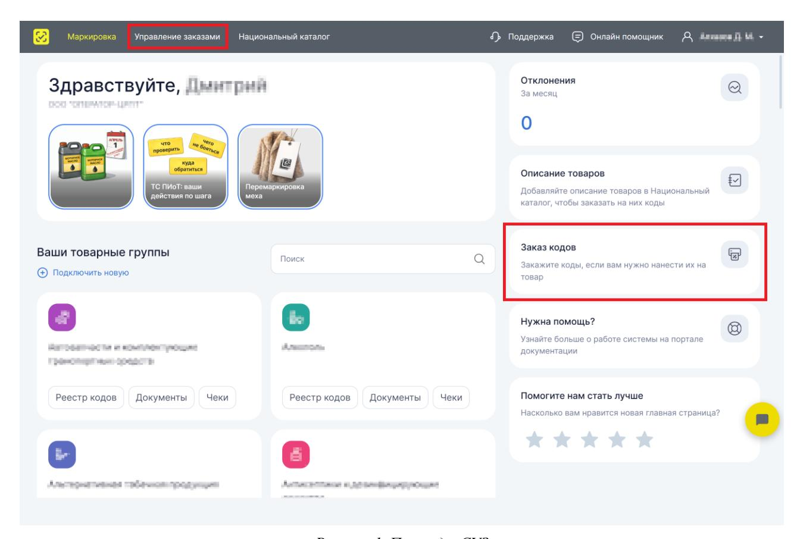
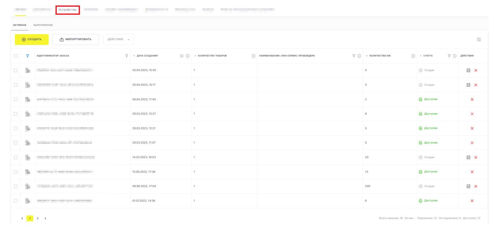
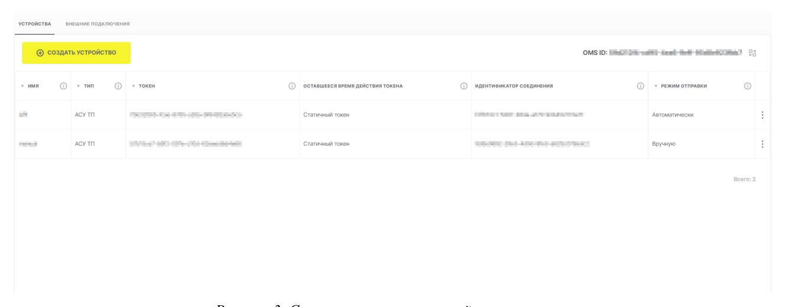
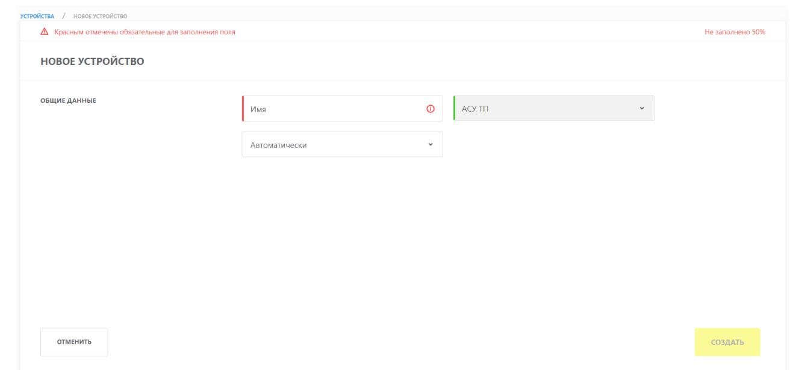
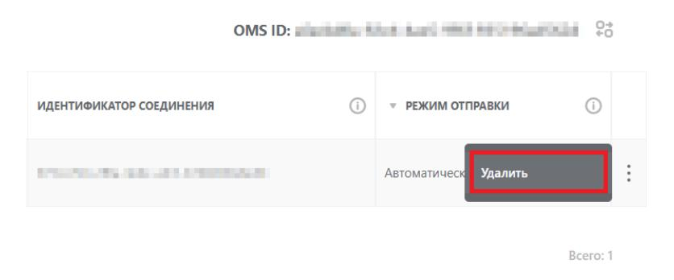

# Инструкция по получению динамического клиентского токена (clientToken) посредством обращения к методам единой аутентификации

Версия 16.0

# **Содержание**

| 1. Общее описание и назначение функциональности<br>3                                  |
|---------------------------------------------------------------------------------------|
| 2. Получение уникального идентификатора соединения (внешнего подключения —            |
| omsConnection) посредством пользовательского интерфейса СУЗ<br>4                      |
| 3. Получение уникального идентификатора соединения (внешнего подключения —            |
| omsConnection) посредством регистрации установки интеграционного решения, используя   |
| API<br>8                                                                              |
| 4. Получение динамического клиентского токена (clientToken) посредством обращения к   |
| методам единой аутентификации<br>10                                                   |
| 5. Метод «Запрос регистрации установки экземпляра интеграционного решения»<br>11      |
| 5.1. Запрос<br>11                                                                     |
| 5.2. Ответ<br>13                                                                      |
| 6. Получение клиентского токена посредством обращения к методам единой аутентификации |
| True API<br>15                                                                        |
| 6.1. Запрос авторизации при единой аутентификации<br>15                               |
| 6.1.1. Запрос 15                                                                      |
| 6.1.2. Ответ<br>15                                                                    |
| 6.2. Получение аутентификационного токена<br>16                                       |
| 6.2.1. Запрос 16                                                                      |
| 6.2.2. Ответ<br>18                                                                    |
| Перечень сокращений, условных обозначений и терминов<br>20                            |

# <span id="page-2-0"></span>**1. Общее описание и назначение функциональности**

Для получения динамического клиентского токена посредством обращения к методам единой аутентификации ГИС МТ предварительно получить уникальный идентификатор соединения (внешнего подключения — omsConnection) для установки интеграционного решения. Под динамическим токеном понимается токен с ограниченным по времени сроком действия.

На переходном этапе получение уникального идентификатора соединения (внешнего подключения — omsConnection) будет доступно двумя способами:

- посредством пользовательского интерфейса СУЗ (см. раздел «[Получение уникального](#page-3-0) [идентификатора соединения \(внешнего подключения — omsConnection\) посредством](#page-3-0) [пользовательского интерфейса СУЗ](#page-3-0)»);
- посредством регистрации установки интеграционного решения, используя API (см. раздел [«Получение уникального идентификатора соединения \(внешнего подключения](#page-7-0)  [omsConnection\) посредством регистрации установки интеграционного решения, используя](#page-7-0) [API»](#page-7-0)).

**ВАЖНО**

Доступ к функциональности ГИС МТ осуществляется в соответствии с ролевой моделью. Информацию об ограничениях прав см. в [«Памятке по](https://docs.crpt.ru/gismt/Памятка_ролевая_модель_доступа/) [ролевой модели доступа Системы маркировки»](https://docs.crpt.ru/gismt/Памятка_ролевая_модель_доступа/).

# <span id="page-3-0"></span>**2. Получение уникального идентификатора соединения (внешнего подключения omsConnection) посредством пользовательского интерфейса СУЗ**

• авторизоваться в СУЗ-Облако.

Участникам после авторизации в ГИС МТ под пользователем с ролью «Администратор» перейти в СУЗ, выбрав раздел **«Управление заказами»** в **«Главном окне»**;



*Рисунок 1. Переход в СУЗ*

• после успешной авторизации в верхней панели меню **«Главного окна»** СУЗ перейти в раздел **«Устройства»**.

Данный раздел доступен для просмотра и редактирования только пользователям с ролью **«Администратор»**;



*Рисунок 2. Кнопка «Устройства»*

• в разделе **«Устройства»** отображается весь список клиентских устройств.

Для зарегистрированных устройств уникальный идентификатор соединения (внешнего подключения — omsConnection) отображается в столбце **«Идентификатор соединения»** (у каждого устройства он разный), который используют при запросе динамического клиентского токена (clientToken) посредством обращения к методам единой аутентификации (см. раздел [«Получение динамического клиентского токена \(clientToken\) посредством](#page-9-0) [обращения к методам единой аутентификации](#page-9-0)»).



*Рисунок 3. Cписок клиентских устройств участника*

Для получения уникального идентификатора соединения (внешнего подключения omsConnection) нового устройства добавить устройство самостоятельно;

• уникальный идентификатор соединения (внешнего подключения — omsConnection), который используется для получения динамического клиентского токена посредством методов единой аутентификации (см. раздел [«Получение динамического клиентского токена \(clientToken\)](#page-9-0) [посредством обращения к методам единой аутентификации»](#page-9-0)), генерируется автоматически (после создания устройства);

- для добавления нового устройства нажать кнопку **[ + Создать устройство ]** в левом верхнем углу экрана и в открывшемся окне заполнить поля ввода данных (красным отмечены обязательные для заполнения поля):
  - **«Имя»** заполнить прямым вводом данных, указав наименование устройства;
  - **«Тип»** по умолчанию установлено значение **«АСУ ТП»** и не подлежит редактированию;
  - **«Режим отправки отчетов»** выбрать значение из выпадающего списка (по умолчанию установлено значение **«Автоматически»**).



*Рисунок 4. Создание нового устройства*

• после заполнения формы нового устройства нажать кнопку **[ Создать ]**. При нажатии кнопки **[ Отменить ]** процедура добавления устройства прекращается.

Созданное устройство отобразится в списке клиентских устройств (см. иллюстрацию к п.3).

- 1. Устройство можно удалить, для этого в строке устройства через меню быстрых действий
  - нажать кнопку **[ Удалить ]**.



*Рисунок 5. Кнопка «Удалить»*

Удаление подтвердить в модальном окне.

*Рисунок 6. Подтверждение удаления*

# <span id="page-7-0"></span>**3. Получение уникального идентификатора соединения (внешнего подключения omsConnection) посредством регистрации установки интеграционного решения, используя API**

Альтернативным способом получения уникального идентификатора соединения (внешнего подключения — omsConnection) является регистрация установки интеграционного решения, используя API.

Получение уникального идентификатора соединения (внешнего подключения — omsConnection) через личный кабинет СУЗ описано в разделе [«Получение уникального идентификатора](#page-3-0) [соединения \(внешнего подключения — omsConnection\) посредством пользовательского](#page-3-0) [интерфейса СУЗ](#page-3-0)».

Для получения уникального идентификатора соединения (внешнего подключения omsConnection) посредством регистрации установки интеграционного решения, используя API СУЗ, используемое интеграционное решение должно быть зарегистрировано Оператором (подробнее о регистрации см. в [«Инструкции по работе с реестром партнёров и интеграторов»](https://docs.crpt.ru/gismt/Инструкция_по_работе_с_РИ/)).

Регистрация интеграционных решений у Оператора на данный момент является добровольной. В процессе регистрации интеграционного решения выполняется проверка корректности взаимодействия с СУЗ интеграционного решения, предоставляются рекомендации по исправлению выявленных проблем и оптимизации взаимодействия. Основными заинтересованными лицами данного процесса являются системные интеграторы, разработчики и поставщики программного обеспечения, вместе с тем для участников оборота товаров, использующих собственные разработки, данная процедура также доступна и рекомендована.

При успешном завершении тестирования интеграционному решению выдается уникальный код (registrationKey), который используется в «Запросе регистрации установки экземпляра интеграционного решения» (см. пункт 1 ниже).

Вместе с тем, при необходимости владелец может ограничить доступ к информации о регистрации своего интеграционного решения.

Если интеграционное решение было зарегистрировано Оператором:

• используя уникальный код регистрации интеграционного решения (registrationKey), сформировать запрос по методу «Запрос регистрации установки экземпляра интеграционного решения» (POST /api/v2/integration/connection?omsId=значение идентификатора СУЗ, см. раздел [«Метод «Запрос регистрации установки экземпляра](#page-10-0) [интеграционного решения»](#page-10-0)»), указав данные регистрируемой установки интеграционного

# решения;

- отправить запрос по методу «Запрос регистрации установки экземпляра интеграционного решения» (POST /api/v2/integration/connection?omsId=значение идентификатора СУЗ) в СУЗ;
- получить ответ на запрос. Если запрос был успешно обработан, то ответ будет содержать уникальный идентификатор соединения (внешнего подключения — omsConnection), который сохраняется для использования при запросе динамического клиентского токена (clientToken) посредством обращения к методам единой аутентификации (см. раздел [«Получение](#page-9-0) [динамического клиентского токена \(clientToken\) посредством обращения к методам единой](#page-9-0) [аутентификации»](#page-9-0)).

# <span id="page-9-0"></span>**4. Получение динамического клиентского токена (clientToken) посредством обращения к методам единой аутентификации**

- после получения уникального идентификатора соединения (внешнего подключения omsConnection) сформировать запрос для получения идентификатора аутентификации и данных для подписи посредством True API (описание метода «Запрос авторизации при единой аутентификации» (GET /auth/key) см. в разделе [«Получение клиентского токена](#page-14-0) [посредством обращения к методам единой аутентификации True API»](#page-14-0));
- отправить запрос, сформированный на шаге 1, посредством True API;
- получив ответ на запрос, отправленный на шаге 2, сформировать, используя уникальный идентификатор соединения (внешнего подключения — omsConnection), запрос для получения ключа сессии при единой аутентификации посредством True API (описание метода «Получение ключа сессии при единой аутентификации» (POST /auth/simpleSignIn/идентификатор внешнего подключения) см. в разделе [«Получение](#page-14-0) [клиентского токена посредством обращения к методам единой аутентификации True API»](#page-14-0));
- отправить запрос, сформированный на шаге 3, посредством True API;
- при успешной обработке запроса, ответ будет содержать динамический клиентский токен (clientToken), указав который в параметре HTTP-заголовка, можно направлять запросы к API СУЗ. При этом время действия клиентского токена, полученного посредством True API, – 10 часов.

Для каждой установки интеграционного решения доступно получение только одного токена, при повторном запросе клиентского токена для установки интеграционного решения действие ранее полученного токена прекращается и генерируется новый токен.

**Примечание:** после успешного обращения к API СУЗ с помощью клиентского токена, полученного посредством методов единой аутентификации (динамического клиентского токена), использование статичных клиентских токенов становится недоступным (должны использоваться только динамические токены).

# <span id="page-10-0"></span>**5. Метод «Запрос регистрации установки экземпляра интеграционного решения»**

Этот метод используется для отправки запроса на регистрацию установки экземпляра интеграционного решения в СУЗ.

Запрос регистрации установки экземпляра интеграционного решения должен быть подписан сертификатом участника оборота товаров.

Участник оборота товаров формирует запрос, подписывает его и формирует присоединённую или откреплённую подпись с использованием сертификата. Присоединённая или откреплённая подпись помещается в HTTP заголовок в параметр «X-Signature» в кодировке Base64. Для подписи используются данные, помещаемые в тело сообщения.

В данном разделе под <url стенда> подразумевается базовый адрес стенда, на котором размещено API для регистрации установки экземпляра интеграционного решения.

Доступны следующие адреса стендов для отправки запроса регистрации установки экземпляра интеграционного решения:

- <https://suz-integrator.sandbox.crpt.tech> базовый адрес демонстрационного контура. Для тестирования на демонстрационном контуре всем участникам доступен следующий код регистрации интеграционного решения — 4344d884-7f21-456c-981e-cd68e92391e8;
- <https://suzgrid.crpt.ru:16443> базовый адрес продуктивного контура.

# <span id="page-10-1"></span>**5.1. Запрос**

**URL**: <url стенда>/api/v2/integration/connection?omsId=значение идентификатора СУЗ

**Метод:** POST

**X-Signature**: <Присоединённая или откреплённая подпись запроса>

**X-RegistrationKey**: <Уникальный код регистрации интеграционного решения>

**Content-type**: application/json;charset=UTF-8

# **Параметры заголовка запроса:**

| Параметр    | Тип    | Обяз. | Описание                                              | Комментарий |
|-------------|--------|-------|-------------------------------------------------------|-------------|
| X-Signature | string | +     | Присоединённая или<br>откреплённая подпись<br>запроса |             |

| Параметр          | Тип    | Обяз. | Описание                                              | Комментарий |
|-------------------|--------|-------|-------------------------------------------------------|-------------|
| Content-type      | string | +     | Content<br>type:application/json;charset=<br>UTF-8    |             |
| X-RegistrationKey | string | +     | Уникальный код регистрации<br>интеграционного решения |             |

# **Параметры строки запроса:**

| Параметр | Тип              | Обяз. | Описание                        | Комментарий |
|----------|------------------|-------|---------------------------------|-------------|
| omsId    | string<br>(UUID) | +     | Уникальный идентификатор<br>СУЗ |             |

# **Параметры тела запроса:**

| Параметр | Тип    | Обяз.                                                      | Описание                                                                                                                                                                                                                                        | Комментарий                                                                                                                                                                       |
|----------|--------|------------------------------------------------------------|-------------------------------------------------------------------------------------------------------------------------------------------------------------------------------------------------------------------------------------------------|-----------------------------------------------------------------------------------------------------------------------------------------------------------------------------------|
| address  | string | +<br>Адрес установки экземпляра<br>интеграционного решения |                                                                                                                                                                                                                                                 |                                                                                                                                                                                   |
| name     | string | -                                                          | Наименование экземпляра<br>интеграционного решения<br>(внешнего подключения). Не<br>должно дублировать<br>наименования<br>зарегистрированных у<br>участника оборота товаров<br>экземпляров<br>интеграционного решения<br>(внешнего подключения) | Если параметр не<br>указан, то будет<br>сгенерировано<br>случайное<br>наименование в<br>формате UUID.<br>Длина значения<br>может состоять от<br>1 до 256 символов<br>включительно |

# **Пример запроса:**

POST /api/v2/integration/connection?omsId=cdf12109-10d3-11e6-8b6f-0050569977a1

HTTP/1.1

Content-Type: application/json;charset=UTF-8

X-Signature: <Присоединённая или откреплённая подпись запроса>

X-RegistrationKey: cdf12109-10d3-11e6-8b6f-0050569977a1

```
{
  "address": "г.Москва, ул. Тестовая, 1",
```

```
  "name": "Наименование"
}
```

# <span id="page-12-0"></span>**5.2. Ответ**

При успешном выполнении запроса сервер возвращает HTTP код 200 и статус регистрации установки экземпляра интеграционного решения.

# **Параметры ответа:**

| Параметр        | Тип           | Обяз. | Описание                                                                                                                                                                                 |
|-----------------|---------------|-------|------------------------------------------------------------------------------------------------------------------------------------------------------------------------------------------|
| status          | string        | +     | Статус регистрации установки экземпляра<br>интеграционного решения.<br>Принимает значения:<br>•<br>SUCCESS<br>–<br>обработка<br>завершена<br>успешно;<br>•<br>REJECTED – запрос отклонен |
| omsConnection   | string (UUID) | -     | Уникальный идентификатор соединения<br>(внешнего подключения), присвоенный<br>зарегистрированной установке<br>интеграционного решения.<br>Содержится в ответе, если status =<br>SUCCESS  |
| name            | string        | -     | Наименование экземпляра<br>интеграционного решения (внешнего<br>подключения).<br>Содержится в ответе, если status =<br>SUCCESS                                                           |
| rejectionReason | string        | -     | Причина отклонения запроса на<br>регистрацию установки экземпляра<br>интеграционного решения.<br>Содержится в ответе, если status =<br>REJECTED                                          |

**Примечание:** для каждой установки интеграционного решения (omsConnection) доступно получение только одного токена, при повторном запросе клиентского токена для установки интеграционного решения (omsConnection) действие ранее полученного токена прекращается и генерируется новый токен.

# **Пример ответа:**

```
HTTP/1.1 200 OK
Content-Type: application/json;charset=UTF-8
```

```
{
  "status": "SUCCESS",
  "omsConnection": "ccc11111-11c1-11c1-1c1c-0000500000c0",
  "name": "Наименование"
}
```

# <span id="page-14-0"></span>**6. Получение клиентского токена посредством обращения к методам единой аутентификации True API**

В данном разделе описаны методы True API для получения клиентского токена, который используется при обращении к методам API СУЗ.

В данном разделе под <url стенда> подразумевается базовый адрес стенда, на котором размещено True API.

Доступны следующие адреса стендов:

- базовые адреса демонстрационного контура:
  - [https://markirovka.sandbox.crptech.ru/api/v3/true-api;](https://markirovka.sandbox.crptech.ru/api/v3/true-api)
  - [https://markirovka.sandbox.crptech.ru/api/v4/true-api;](https://markirovka.sandbox.crptech.ru/api/v4/true-api)
- базовые адреса промышленного контура:
  - <https://markirovka.crpt.ru/api/v3/true-api>;
  - <https://markirovka.crpt.ru/api/v4/true-api>.

# <span id="page-14-1"></span>**6.1. Запрос авторизации при единой аутентификации**

Этот метод используется для получения идентификатора аутентификации и данных для подписи УКЭП участника оборота товаров.

# <span id="page-14-2"></span>**6.1.1. Запрос**

**URL:** <url стенда>/auth/key

**Метод:** GET

# **Пример запроса:**

GET /auth/key

# <span id="page-14-3"></span>**6.1.2. Ответ**

При успешном выполнении запроса сервер возвращает HTTP код 200, идентификатор сгенерированных случайных данных и данные для подписи.

# **Параметры ответа:**

| Параметр | Тип    | Обяз. | Описание                                                  |
|----------|--------|-------|-----------------------------------------------------------|
| uuid     | string | +     | Уникальный идентификатор сгенерированных случайных данных |
| data     | string | +     | Случайная строка данных                                   |

### Пример ответа:

```
HTTP/1.1 200 OK
Content-Type: application/json;charset=UTF-8

{
    "uuid":"a63ff582-b723-4da7-958b-453da27a6c62",
    "data":"GNUFBAZBMPIUUMLXNMIOGSHTGFXZM"
```

# <span id="page-15-0"></span>6.2. Получение аутентификационного токена

Этот метод используется для получения маркера безопасности (аутентификационного токена) для СУЗ. Для получения токена для СУЗ в метод добавлен параметр «omsConnection» — уникальный идентификатор соединения (внешнего подключения), присвоенный зарегистрированной установке интеграционного решения.

# <span id="page-15-1"></span>6.2.1. Запрос

}

URL: <url стенда>/auth/simpleSignIn/идентификатор внешнего подключения

Метод: POST

### Пример строки запроса:

```
curl -X POST "<url стенда>/auth/simpleSignIn/11b1abc1-f1ee-11db-1a11-f11ac11111e1"
-H "accept: application/json"
-H "Content-Type: application/json"
```

### Параметры строки запроса:

| Параметр      | Тип    | Обяз.                                                                        | Описание                                                                                                                                  | Комментарий                                                            |
|---------------|--------|------------------------------------------------------------------------------|-------------------------------------------------------------------------------------------------------------------------------------------|------------------------------------------------------------------------|
| omsConnection | string | Должен быть<br>указан для<br>получения<br>токена для<br>доступа к API<br>СУЗ | Уникальный<br>идентификатор<br>соединения (внешнего<br>подключения),<br>присвоенный<br>зарегистрированной<br>установке<br>интеграционного | Выдаётся при<br>регистрации<br>установки<br>интеграционного<br>решения |
|               |        |                                                                              | решения                                                                                                                                   |                                                                        |

**Примечание:** на переходном этапе получение уникального идентификатора соединения (внешнего подключения — omsConnection) также будет доступно посредством регистрации в пользовательском интерфейсе СУЗ клиентского устройства (системы), которое будет взаимодействовать посредством API СУЗ.

# **Пример тела запроса:**

```
{
  "uuid":"b223216d-5c43-416a-b2c3-39c79240c08a",
  "data":"<Подписанные данные в base64>"
}
```

# **Параметры тела запроса:**

| Параметр | Тип    | Обяз. | Описание                                                                                                                                                          | Комментарий |
|----------|--------|-------|-------------------------------------------------------------------------------------------------------------------------------------------------------------------|-------------|
| uuid     | string | +     | Уникальный идентификатор<br>подписанных случайных<br>данных                                                                                                       |             |
| data     | string | +     | Подписанные УКЭП<br>зарегистрированного<br>участника оборота товаров,<br>случайные данные в base64<br>(электронная подпись<br>присоединённая или<br>откреплённая) |             |

| Параметр | Тип    | Обяз. | Описание                  | Комментарий        |
|----------|--------|-------|---------------------------|--------------------|
| inn      | string | -     | ИНН участника оборота     | Параметр           |
|          |        |       | товаров, под которым      | заполняется для    |
|          |        |       | требуется авторизация для | получения          |
|          |        |       | физического лица по       | аутентификационн   |
|          |        |       | машиночитаемой            | ого токена на      |
|          |        |       | доверенности              | конкретную         |
|          |        |       |                           | организацию /      |
|          |        |       |                           | индивидуального    |
|          |        |       |                           | предпринимателя и  |
|          |        |       |                           | только в случае,   |
|          |        |       |                           | если пользователь, |
|          |        |       |                           | выполняющий        |
|          |        |       |                           | запрос, имеет      |
|          |        |       |                           | активные           |
|          |        |       |                           | машиночитаемые     |
|          |        |       |                           | доверенности от    |
|          |        |       |                           | разных             |
|          |        |       |                           | организаций /      |
|          |        |       |                           | индивидуальных     |
|          |        |       |                           | предпринимателей.  |
|          |        |       |                           | Длина значения: 10 |
|          |        |       |                           | или 12 цифр        |

# <span id="page-17-0"></span>**6.2.2. Ответ**

При успешном выполнении запроса сервер возвращает HTTP код 200 и токен.

# **Параметры ответа:**

| Параметр      | Тип    | Обяз. | Описание                                                                                                    |
|---------------|--------|-------|-------------------------------------------------------------------------------------------------------------|
| token         | string | -     | Аутентификационный токен. Токен<br>действителен 10 часов. Параметр<br>указывается в случае успешного ответа |
| code          | string | -     | Код ошибки                                                                                                  |
| error_message | string | -     | Сообщение об ошибке                                                                                         |
| description   | string | -     | Описание ошибки                                                                                             |

# **Пример ответа:**

```
HTTP/1.1 200 OK
```

Content-Type: application/json;charset=UTF-8

```
{
  "token":"2f2222c2-cbc2-22ff-bc2c-2222222fbef2"
}
```

# <span id="page-19-0"></span>Перечень сокращений, условных обозначений и терминов

| Сокращение, условное обозначение, термин | Описание                                                                                                                                                                                                                                                                                                                                                                                                                                                  |
|------------------------------------------|-----------------------------------------------------------------------------------------------------------------------------------------------------------------------------------------------------------------------------------------------------------------------------------------------------------------------------------------------------------------------------------------------------------------------------------------------------------|
| API                                      | Application Programming Interface (интерфейс программирования приложений) — программный интерфейс приложения, набор готовых классов, процедур, функций, структур и констант, предоставляемых приложением (библиотекой, сервисом) или операционной                                                                                                                                                                                                         |
|                                          | системой для использования во внешних программных продуктах                                                                                                                                                                                                                                                                                                                                                                                               |
| ГИС MT                                   | Государственная информационная система, созданная в целях автоматизации процессов сбора и обработки информации об обороте товаров, подлежащих обязательной маркировке средствами идентификации, хранения такой информации, обеспечения доступа к ней, её предоставления и распространения, повышения эффективности обмена такой информацией и обеспечения прослеживаемости указанных товаров, а также в иных целях, предусмотренных федеральными законами |

| Сокращение, условное обозначение, термин | Описание                                                                                                                                                                                                                                                                                                                                                                                                                                                                                                                                                                                                                                                                                                                    |
|------------------------------------------|-----------------------------------------------------------------------------------------------------------------------------------------------------------------------------------------------------------------------------------------------------------------------------------------------------------------------------------------------------------------------------------------------------------------------------------------------------------------------------------------------------------------------------------------------------------------------------------------------------------------------------------------------------------------------------------------------------------------------------|
| Оператор                                 | Частный партнёр, действующий в качестве<br>Оператора Единой системы маркировки в<br>соответствии с распоряжением Правительства<br>РФ от 8 мая 2019 г. № 899-р «О реализации<br>проекта государственно-частного партнёрства,<br>заключаемого в целях создания, эксплуатации<br>и технического обслуживания объекта,<br>предназначенного для обеспечения маркировки<br>и прослеживаемости отдельных видов<br>товаров» (https://честныйзнак.рф),<br>распоряжением Правительства Российской<br>Федерации от 3 апреля 2019 г. № 620-р «Об<br>операторе государственной информационной<br>системы мониторинга за оборотом товаров,<br>подлежащих обязательной маркировке», и<br>распоряжением № 2828-р от 18 декабря 2019<br>года |
| СУЗ                                      | Станция управления заказами кодов<br>маркировки                                                                                                                                                                                                                                                                                                                                                                                                                                                                                                                                                                                                                                                                             |
| УКЭП                                     | Усиленная квалифицированная электронная<br>подпись, обладающая дополнительными<br>признаками защищённости: ключом проверки<br>и подтверждёнными средствами электронной<br>подписи                                                                                                                                                                                                                                                                                                                                                                                                                                                                                                                                           |