# Инструкция по работе с API

Версия 38.0

## **Содержание**

| 1. Описание и назначение функциональности 4                                         |    |
|-------------------------------------------------------------------------------------|----|
| 2. Описание операций 5                                                              |    |
| 2.1. Документация 5                                                                 |    |
| 2.2. Подготовительный этап к проведению интеграционного тестирования с API<br>5     |    |
| 2.3. Начало взаимодействия с API 7                                                  |    |
| 2.3.1. Общая последовательность действий для выполнения запросов через API 7        |    |
| 2.3.2. Подписание документов УКЭП 10                                                |    |
| 2.3.2.1. Подписание присоединённой подписью<br>10                                   |    |
| 2.3.2.2. Подписание откреплённой подписью<br>13                                     |    |
| 2.3.3. Получение аутентификационного токена ГИС МТ для взаимодействия с API НК и    |    |
| True API<br>13                                                                      |    |
| 2.3.4. Вызов метода «Запрос авторизации при единой аутентификации» 16               |    |
| 2.3.5. Вызов метода «Получение ключа сессии при единой аутентификации»<br>17        |    |
| 2.3.6. Вызов метода «Метод получения токена аутентификации в СУЗ»<br>19             |    |
| 2.4. Краткое описание основных операций в API СУЗ<br>20                             |    |
| 2.4.1. Вызов метода СУЗ-Облако «Проверить доступность СУЗ»<br>21                    |    |
| 2.4.2. Вызов метода СУЗ-Облако «Создать заказ на эмиссию кодов маркировки»<br>23    |    |
| 2.4.3. Вызов метода СУЗ-Облако «Получить статус массива КМ из заказа»<br>26         |    |
| 2.4.4. Вызов метода СУЗ-Облако «Получить КМ из заказа»<br>27                        |    |
| 2.4.5. Вызов метода СУЗ-Облако «Отправить отчёт об использовании (нанесении) КМ»    | 28 |
| 2.4.6. Вызов метода СУЗ-Облако «Отправить отчёт об агрегации КМ»<br>30              |    |
| 2.4.7. Вызов метода True API «Метод получения общедоступной информации о КИ по      |    |
| списку» 32                                                                          |    |
| 2.5. Краткое описание основных операций с True API<br>33                            |    |
| 2.5.1. Методы по работе с документами прямой подачи сведений<br>33                  |    |
| 2.6. Краткое описание основных операций с API «Национального каталога маркированных |    |
| товаров»<br>34                                                                      |    |
| 2.6.1. Авторизация в «Национальном каталоге маркированных товаров»<br>35            |    |
| 2.6.2. Создание и изменение карточки товара<br>36                                   |    |
| 2.6.2.1. Проверка регистрации кода ТН ВЭД для создаваемой карточки товара<br>36     |    |
| 2.6.2.2. Получение информации по атрибутам 37                                       |    |
| 2.6.2.3. Создание черновика карточки товара 38                                      |    |
| 2.6.2.3.1. Создание черновика ранее неопубликованной карточки товара<br>39          |    |
| 2.6.2.3.2. Создание черновика карточки товара на основе ранее опубликованной        |    |
| карточки товара<br>39                                                               |    |
| 2.6.2.3.3. Создание карточки товара с техническим GTIN<br>40                        |    |
| 2.6.2.3.4. Создание карточки товара с иностранным GTIN 40                           |    |
| 2.6.2.4. Редактирование карточки товара<br>41                                       |    |
| 2.6.2.5. Отправка карточки товара на модерацию<br>41                                |    |
| 2.6.3. Подписание карточки товара<br>42                                             |    |
| 2.6.4. Работа с субаккаунтами<br>42                                                 |    |
|                                                                                     |    |

| Перечень сокращений, условных обозначений и терминов<br>43 |  |
|------------------------------------------------------------|--|
| История изменений 47                                       |  |

## <span id="page-3-0"></span>**1. Описание и назначение функциональности**

Инструкция описывает основные операции для начала работы с ГИС МТ через API. Описаны особенности использования набора вспомогательных инструментов, перечень подготовительных операций, последовательность основных действий работы с ГИС МТ, а также раскрыты аспекты работы с программным интерфейсом, вызывающие основные сложности на практике.

В настоящем документе следующие элементы графического интерфейса вспомогательных инструментов выделены полужирным начертанием и кавычками:

- названия экранных форм и окон;
- названия полей в экранных формах и окнах;
- названия кнопок в экранных формах и окнах;
- тексты сообщений в модальных и всплывающих окнах.

## <span id="page-4-0"></span>**2. Описание операций**

Основные документы для работы с ГИС МТ через API перечислены в разделе [«Документация](#page-4-1)».

Перед началом работы с ГИС МТ через API должны быть выполнены все пункты перечня из раздела «[Подготовительный этап к проведению интеграционного тестирования с API](#page-4-2)».

Последовательность действий по корректной аутентификации и получению токенов см. в разделе «[Начало взаимодействия с API](#page-6-0)».

Последовательность действий по заказу и использованию (нанесению) кодов маркировки, а также их агрегации см. в разделе «[Краткое описание основных операций в API СУЗ](#page-19-0)».

Описание основных операций с документами при работе с True API см. в разделе [«Краткое](#page-32-0) [описание основных операций с True API](#page-32-0)».

**ВАЖНО**

Доступ к функциональности Системы маркировки осуществляется в соответствии с ролевой моделью. Информацию об ограничениях прав см. в [«Памятке по ролевой модели доступа Системы маркировки»](https://честныйзнак.рф/business/doc/?id=Памятка_ролевая_модель_доступа.html)

## <span id="page-4-1"></span>**2.1. Документация**

- «API Каталога маркированных товаров» заполнение карточек товаров в «Национальном каталоге маркированных товаров»;
- «API СУЗ-Облако» заказ КМ в СУЗ;
- «Описание True API» для проведения операций с маркированным товаром;
- «Описание API ЭДО Лайт» осуществление отгрузки УПД другому участнику оборота товаров, подключённому к ЭДО Лайт или коммерческому Оператору ЭДО;
- [«Методические рекомендации по описанию сведений о передаче маркированных товаров при](https://честныйзнак.рф/business/doc/?id=Методические_рекомендации_по_оформлению_документов_ЭДО.html) [оформлении электронных документов для уведомления ГИС МТ об обороте маркированной](https://честныйзнак.рф/business/doc/?id=Методические_рекомендации_по_оформлению_документов_ЭДО.html) [продукции»](https://честныйзнак.рф/business/doc/?id=Методические_рекомендации_по_оформлению_документов_ЭДО.html);
- [«Рекомендуемый алгоритм экранирования специальных символов в составе кода](https://честныйзнак.рф/business/doc/?id=Рекомендуемый_алгоритм_экранирования.html) [идентификации».](https://честныйзнак.рф/business/doc/?id=Рекомендуемый_алгоритм_экранирования.html)

Актуальная документация размещена в разделе «Помощь» ГИС МТ (промышленный стенд).

## <span id="page-4-2"></span>**2.2. Подготовительный этап к проведению интеграционного тестирования с API**

Перед началом проведения тестирования с API выполнить следующие действия:

- 1. Убедиться в наличии УКЭП (для регистрации использовать УКЭП, полученную в Аккредитованном удостоверяющем центре) и регистрации в ГИС МТ на интеграционном или демонстрационном контуре (см. «Инструкцию по регистрации участника оборота товаров в Государственной информационной системе мониторинга за оборотом товаров»). Проведение тестирования на интеграционном и демонстрационном контуре не несёт юридической значимости.
- 2. Зарегистрироваться в «Национальном каталоге маркированных товаров» или GS1 РУС, создать карточку товара, отправить на модерацию и дождаться перехода карточки в статус «Опубликована» (см. «Инструкцию по настройке профиля участника оборота товаров и работе с товарами в подсистеме Государственной информационной системы мониторинга за оборотом товаров «Национальный каталог маркированных товаров»»).
- 3. Для получения доступа к API НКМТ получить «арі-key» (необходим для авторизации и совершения запросов к API), ознакомиться с документацией «API Каталога маркированных товаров», перейти на сайт и отправить письмо на support@national-catalog.ru, указав в заявке следующие данные:
  - наименование организации;
  - ИНН организации;
  - участник проекта маркировки (да/нет).

Приложить подписанный меморандум (обязательно для компаний-партнёров и интеграторов).

- 4. Перейти в СУЗ в раздел «Устройства», скопировать полученный «omsId» («OMS ID» в правом верхнем углу списка устройств) и «omsConnection» (столбец «Идентификатор соединения» в списке устройств) для дальнейшего получения динамического токена аутентификации в СУЗ (см. «Инструкцию по получению динамического клиентского токена (clientToken) посредством обращения к методам единой аутентификации» и «Вызов метода «Метод получения токена аутентификации в СУЗ»») для дальнейшей работы по АРІ с помощью ПО «Postman» или Swagger СУЗ.
- 5. При работе с товарными группами, для которых коды маркировки являются платными, необходимо пополнить баланс лицевого счёта. При работе на интеграционном или демонстрационном контуре отправить запрос на <a href="mailto:support@crpt.ru">support@crpt.ru</a> для пополнения баланса соответствующей товарной группы. После пополнения баланса лицевого счёта откроется доступ к созданию заказа на КМ.
- 6. Для успешной интеграции и работы с API рекомендуется установить и использовать следующее ПО:
  - «Postman» ПО для интеграционного тестирования и работы с API;

- «Notepad++» текстовый редактор для удаления скрытых символов переноса строки из файла УКЭП. Необходимо проверить, что в текстовом редакторе установлены плагины JSON viewer и XML tools для работы с форматами документов \* .json и \* .csv и для проверки корректности экранирования символов в составе КИ;
- «Крипто APM» для подписания документов УКЭП с помощью ПО.

Также можно воспользоваться онлайн-сервисами, например, здесь.

7. Скачать описание API в разделе «Помощь» ГИС МТ (промышленный стенд) или в канале Telegram. Документация API НКМТ и ГИС МТ публикуется только в формате \* .pdf. API СУЗ также доступен на Swagger при переходе по иконке пользователя в СУЗ и выборе значения «Swagger документация» в ниспадающем меню.

## <span id="page-6-0"></span>2.3. Начало взаимодействия с АРІ

Работа с API начинается с авторизации, в ходе которой необходимо получить токены аутентификации True API и СУЗ для совершения дальнейших действий в системе.

В настоящем разделе описаны:

- общая последовательность действий для выполнения запросов через API при помощи ПО «Postman» (см. «Общая последовательность действий для выполнения запросов через API»);
- способы подписания документов УКЭП через АРІ (см. «Подписание документов УКЭП»);
- пример получения токена аутентификации True API с помощью последовательности вызова методов: «Вызов метода «Запрос авторизации при единой аутентификации»» и «Вызов метода «Получение ключа сессии при единой аутентификации»»;
- пример получения токена аутентификации СУЗ через «Вызов метода «Метод получения токена аутентификации в СУЗ»».

#### <span id="page-6-1"></span>2.3.1. Общая последовательность действий для выполнения запросов через АРІ

Описанная последовательность действий применяется для выполнения запроса любого из методов в описании API:

• в ПО «Postman» создать новый запрос (элемент 1 на рисунке ниже);

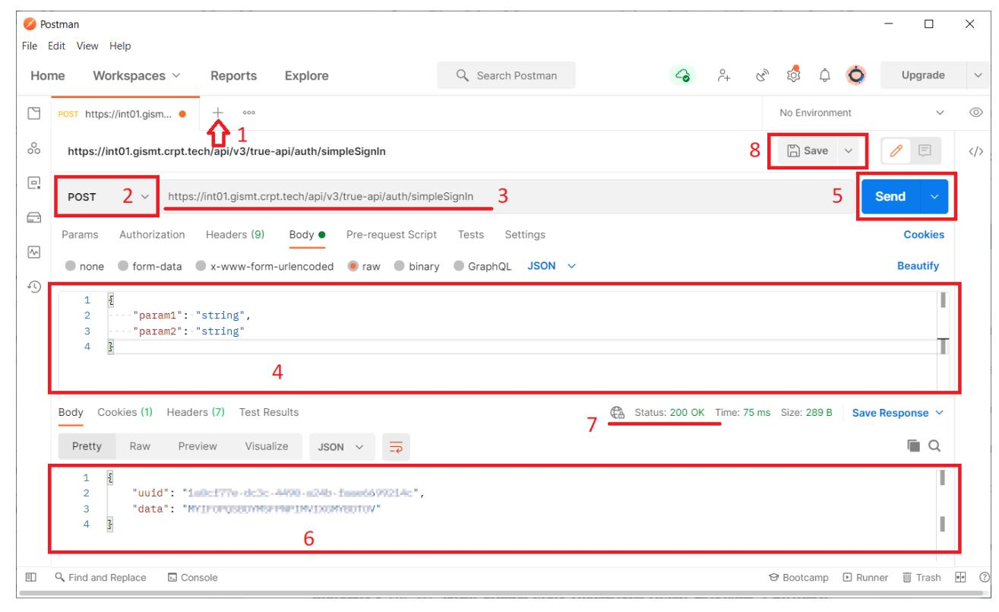

*Рисунок 1. Основные элементы интерфейса ПО Postman*

• скопировать URL стенда (например, для True API [https://markirovka.sandbox.crptech.ru/api/v3/](https://markirovka.sandbox.crptech.ru/api/v3/true-api) [true-api\)](https://markirovka.sandbox.crptech.ru/api/v3/true-api) и подставить его в строку ПО «Postman» (элемент 3 на рисунке выше);

| Контур   | URL стенда                                           |                                                                                           |
|----------|------------------------------------------------------|-------------------------------------------------------------------------------------------|
|          | ПРОМЫШЛЕННЫЙ                                         | ДЕМОНСТРАЦИОННЫЙ<br>(ТЕСТОВЫЙ)                                                            |
| ГИС МТ   | •<br>https://markirovka.crpt.ru/api/v3/<br>true-api; | •<br>https://markirovka.sandbox.crptech.<br>ru/api/v3/true-api;                           |
|          | •<br>https://markirovka.crpt.ru/api/v4/<br>true-api  | •<br>https://markirovka.sandbox.crptech.<br>ru/api/v4/true-api;                           |
|          |                                                      | •<br>https://int01.gismt.crpt.tech/api/v3/<br>true-api (адрес устаревший)                 |
| СУЗ      | https://suzgrid.crpt.ru                              | •<br>https://suz.sandbox.crptech.ru;<br>•<br>https://suz<br>integrator.sandbox.crptech.ru |
| НКМТ     | https://апи.национальный-каталог.рф                  | •<br>https://nk.sandbox.crptech.ru;<br>•<br>https://api.nk.sandbox.crptech.ru             |
| ЭДО лайт | https://elk.edo.crpt.tech                            | https://edo.sandbox.crptech.ru                                                            |

• в выпадающем списке методов выбрать тип метода (элемент 2 на рисунке выше):

- «GET» для получения данных (например: проверка статуса документа, проверка статуса кода идентификации и т.д.);
- «**POST**» для передачи данных в ГИС МТ (например: создание и отправка различных типов документов);
- в строку, в которой указан URL стенда, добавить URL необходимого метода, скопировав его из документации (элемент 3 на рисунке выше);
- в поле запроса на вкладке «**Body**» ПО «Postman» (элемент 4 на рисунке выше) выставить зависимый переключатель в значение «**raw**»;
- скопировать пример запроса необходимого метода из документации в поле запроса и выбрать подходящий синтаксис в выпадающем списке справа (JSON или XML для \* .json или \* xml соответственно);
- указать обязательные параметры запроса, следуя формату, указанному в описании;
- в случае необходимости подписать запрос присоединённой или откреплённой подписью (подробнее см. в «Подписание документов УКЭП»);
- отправить запрос, нажав на кнопку «Send» (элемент 5 на рисунке выше);
- в поле ответа (элемент 6 на рисунке выше) получить ответ с запрашиваемой информацией или признак успешного ответа, если информация была направлена в ГИС МТ. Для проверки статуса ответа см. элемент 7 на рисунке выше;
- для сохранения запроса во вкладке «Collection» нажать на кнопку «Save» (элемент 8 на рисунке выше). Для удобства можно воспользоваться ранее сформированным запросом из данной вкладки, но состав параметров запроса требует регулярной актуализации, поскольку методы могут изменяться.

Методы имеют разный тип приватности (тип приватности указан перед описанием каждого метода). Наличие приватности у метода обусловлено характером запрашиваемой информации, которая может быть доступной только одному участнику оборота товаров или всем участникам оборота товаров, зарегистрированным в ГИС МТ. Если в документации к методу указан тип приватности «Без токена», то токен аутентификации True API в запросе не указывается. Для работы с методами, требующими наличия токена аутентификации True API, при формировании запроса в ПО «Роstman»:

- на вкладке «Authorization» в раскрывающемся списке «Type» выбрать «Bearer Token»;
- заполнить поле ввода «**Token**» значением параметра «**token**», полученным при авторизации в True API.

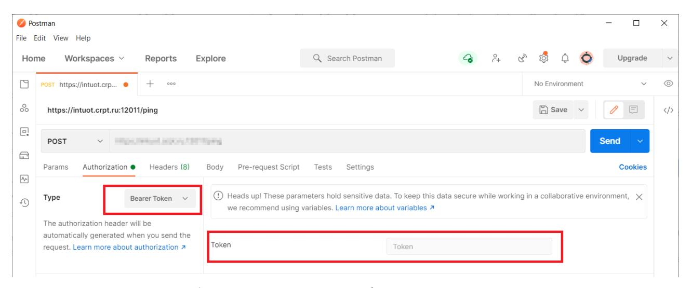

*Рисунок 2. Указание токена аутентификации в приватные запросы*

#### <span id="page-9-0"></span>**2.3.2. Подписание документов УКЭП**

#### <span id="page-9-1"></span>**2.3.2.1. Подписание присоединённой подписью**

Для подписания данных присоединённой подписью создать новый файл в тестовом редакторе «Notepad++», скопировать в него значение параметра, требующего подписания, и сохранить файл. Расширение для файла не указывать. Максимальный размер файла для подписания присоединённой подписью 6 Мб.

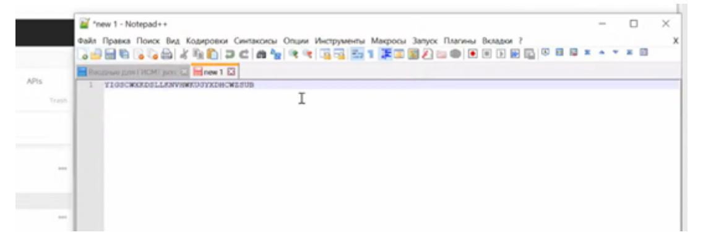

*Рисунок 3. Создание файла с данными для подписания присоединённой подписью*

Подписать созданный файл с помощью ПО «КриптоАРМ» присоединённой подписью.

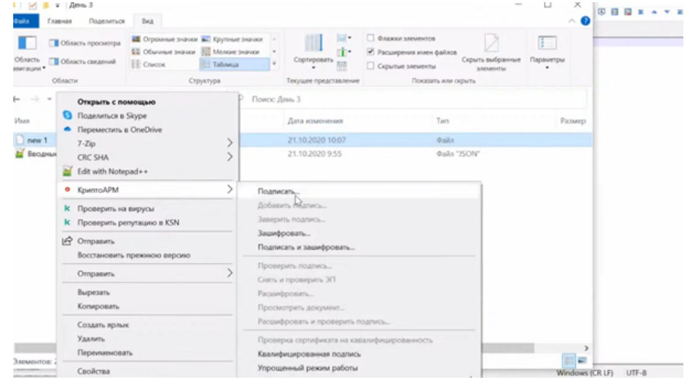

*Рисунок 4. Подписание файла ПО КриптоАРМ*

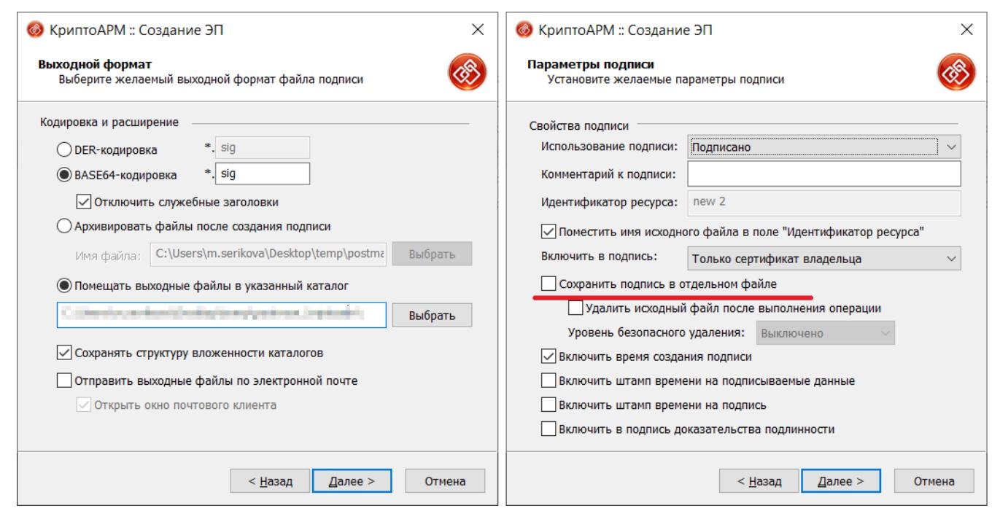

*Рисунок 5. Задание выходного формата и параметров присоединённой подписи*

Открыть подписанный файл в текстовом редакторе «Notepad++».

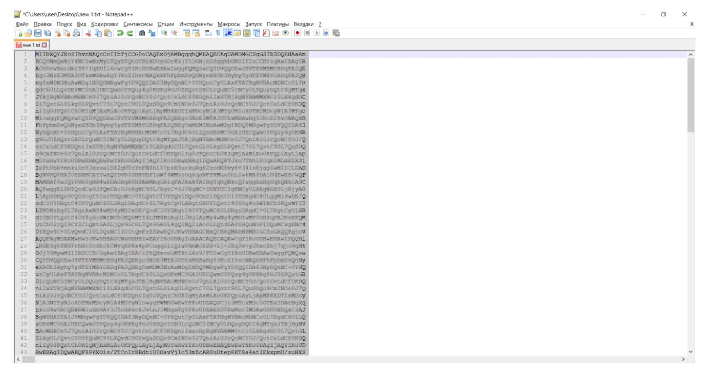

*Рисунок 6. Подписание присоединённой подписью*

Привести данные в файле к требованиям формата Base64, удалив символы переноса строки (\r\n). Для этого выделить весь текст (ctrl+a), вызвать инструмент поиска и замены (ctrl+h), установить флаг **«Режим поиска»** в положение **«Расширенный»**, выставить параметры как указано на рисунке ниже и нажать кнопку **«Заменить всё»**. Признаком успешного завершения операции является объединение всех строк файла в единую строку.

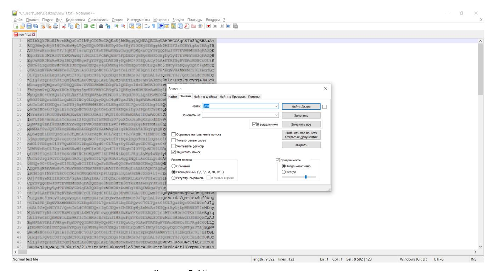

*Рисунок 7. Удаление символов переноса строки*

Скопировать отредактированные данные и вставить их в качестве значения параметра, требующего подписания, в поле запроса ПО «Postman».

#### <span id="page-12-0"></span>2.3.2.2. Подписание откреплённой подписью

Для создания откреплённой подписи скопировать содержимое тела запроса из вкладки «**Body**» ПО «Postman» в новый файл в текстовом редактора «Notepad++», выделить всё (ctrl+a), в главном меню выбрать «**Синтаксисы**»  $\rightarrow$  «**J»**  $\rightarrow$  «**JSON**», после чего сохранить файл с расширением \* .json. В контекстном меню файла выбрать «КриптоAPM»  $\rightarrow$  «Подписать...» и подписать файл **откреплённой подписью** (см. параметры на рисунке ниже).

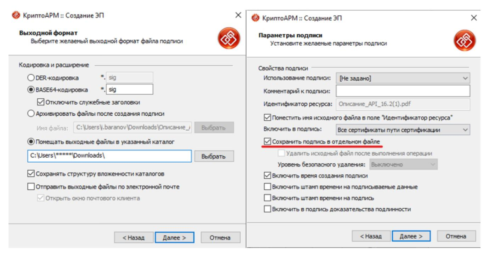

Рисунок 8. Задание выходного формата и параметров откреплённой подписи

Открыть подписанный файл в текстовом редакторе «Notepad++». Привести данные к требованиям формата Base64, удалив символы переноса строки (\r\n). Признаком успешного завершения операции является объединение всех строк файла в единую строку.

Скопировать отредактированные данные и вставить их в запрос в ПО «Postman».

## <span id="page-12-1"></span>2.3.3. Получение аутентификационного токена ГИС МТ для взаимодействия с API НК и True API

Получение аутентификационного токена ГИС МТ доступно зарегистрированным в ГИС МТ участникам оборота товаров с хотя бы одной подключённой товарной группой. Для получения токена выполнить запрос авторизации (метод GET /auth/key), после чего отправить запрос на получение токена (метод POST /auth/simpleSignIn).

- запустить ПО «Postman» (при необходимости зарегистрироваться и авторизоваться);
- в поле «Enter request URL» указать URL стенда (информацию о стендах см. в документации «Описание True API») и URL метода (/auth/key). Например, для демонстрационного стенда: https://markirovka.sandbox.crptech.ru/api/v3/true-api/auth/key;

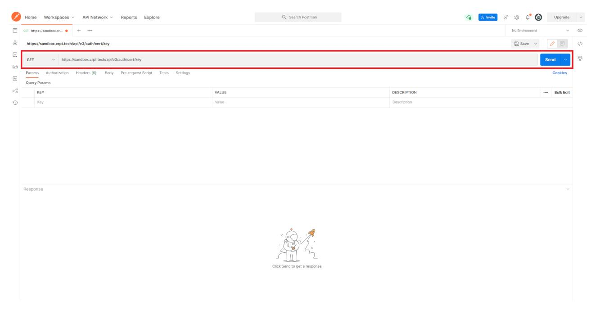

*Рисунок 9. Указание URL в строке запроса*

• нажать кнопку **«Send»**, не меняя тип метода слева от указанного URL (**«GET»** значение по умолчанию).

После отправки запроса в поле **«Status»** отобразится код ответа **«200 OK»** («Успешный»). В случае получения кода, отличного от **«200 OK»**, следует повторно ознакомиться с документацией к методу и описанием ошибки. В случае успешного ответа в поле ответа отобразятся параметры **«uuid»** и **«data»**, необходимые для завершения авторизации через вызов метода /auth/simpleSignIn;

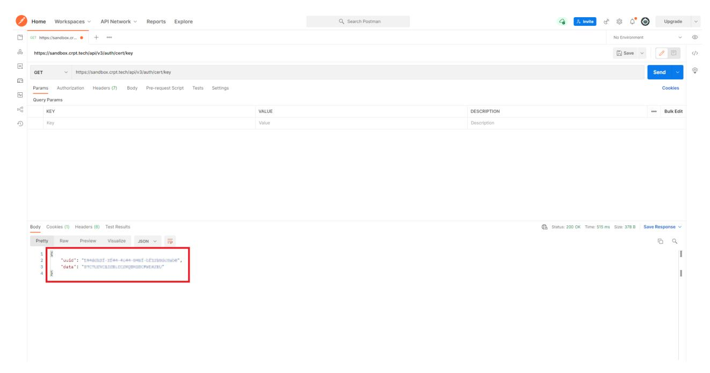

*Рисунок 10. Успешный ответ на вызов метода*

- в ПО «Postman» открыть новую страницу для создания запроса, нажав кнопку **«+»**;
- в поле **«Enter request URL»** указать URL стенда и URL метода (/auth/simpleSignIn).

Например, для демонстрационного стенда: https://markirovka.sandbox.crptech.ru/api/v3/true-api/auth/simpleSignIn;

- слева от указанного URL нажать тип метода «GET» и в раскрывающемся списке выбрать тип «POST»;
- во вкладке «**Body**» переключить зависимый переключатель в положение «**raw**», в выпадающем списке выбрать значение «**JSON**»;
- в поле ввода указать JSON-схему примера тела запроса:

```
{
    "uuid":"string",
    "data":"string"
}
```

Вместо значения **«string»** параметра **«uuid»** указывается значение параметра **«uuid»**, полученное при вызове предыдущего метода. Вместо значения **«string»** параметра **«data»** указывается значение параметра **«data»**, полученное при вызове предыдущего метода и подписанное **присоединённой** электронной подписью зарегистрированного участника оборота товаров в кодировке Base64 (подробнее см. раздел «Подписание присоединённой подписью»).

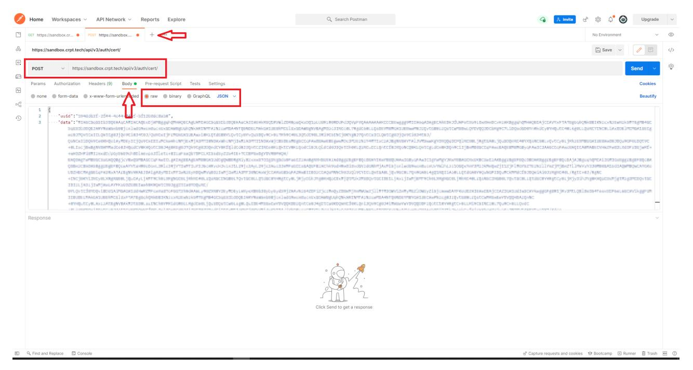

Рисунок 11. Вызов метода на получение токена

• нажать кнопку «Send».

После отправки запроса в поле «Status» отобразится код ответа «200 ОК» («Успешный»). В случае получения кода, отличного от «200 ОК», следует повторно ознакомиться с документацией к методу и описанием ошибки. В случае успешного ответа в поле ответа

вернётся значение токена аутентификации ГИС МТ. Полученное значение использовать для формирования всех запросов АРІ НКМТ и в приватных методах True API. Токен действителен 10 часов.

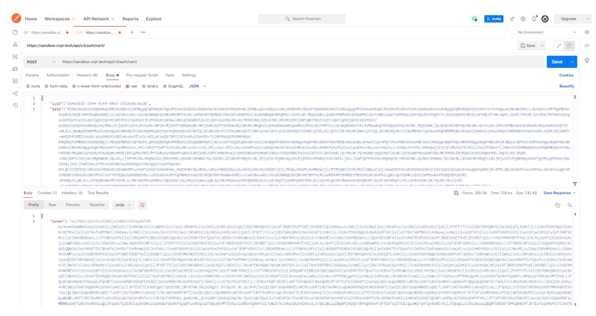

Рисунок 12. Успешный ответ на вызов метода

#### <span id="page-15-0"></span>2.3.4. Вызов метода «Запрос авторизации при единой аутентификации»

- запустить ПО «Postman» (при необходимости зарегистрироваться и авторизоваться);
- в поле «Enter request URL» указать URL стенда и URL метода (например, для демонстрационного стенда ГИС МТ / «ИР Маркировки»: https://markirovka.sandbox.crptech.ru/api/v3/true-api/auth/key);

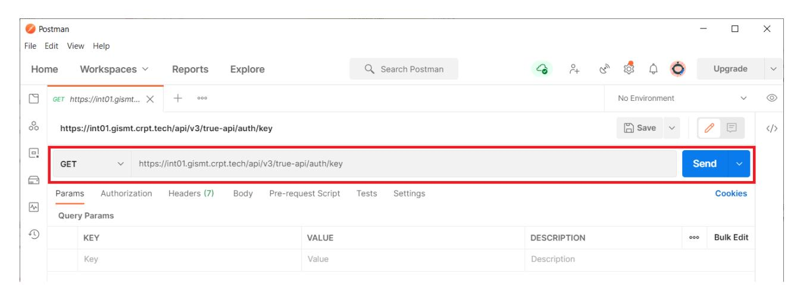

Рисунок 13. Указание URL в строке запроса

- в выпадающем списке методов выбрать «GET» (значение по умолчанию);
- нажать кнопку «Send».

После отправки запроса в поле «Status» отобразится код ответа «200 ОК» («Успешный»). В случае получения кода, отличного от «200 ОК», следует повторно ознакомиться с

документацией к методу и описанием ошибки. В случае успешного ответа в поле ответа отобразятся параметры **«uuid»** и **«data»**, необходимые для завершения авторизации через [«Вызов метода «Получение ключа сессии при единой аутентификации»»](#page-16-0).

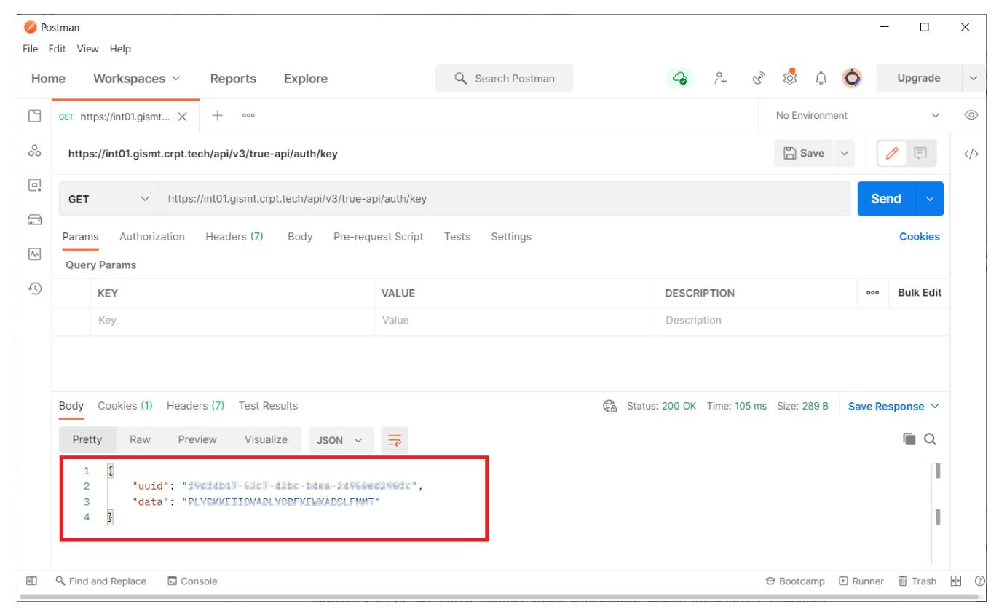

*Рисунок 14. Ответ на вызов метода*

#### <span id="page-16-0"></span>**2.3.5. Вызов метода «Получение ключа сессии при единой аутентификации»**

- в ПО «Postman» нажать на кнопку **«+»** для создания нового запроса;
- в поле **«Enter request URL»** указать URL стенда и URL метода (например, для демонстрационного стенда ГИС МТ: [https://markirovka.sandbox.crptech.ru/api/v3/true-api/auth/](https://markirovka.sandbox.crptech.ru/api/v3/true-api/auth/simpleSignIn) [simpleSignIn](https://markirovka.sandbox.crptech.ru/api/v3/true-api/auth/simpleSignIn));
- в раскрывающемся списке типа метода выбрать **«POST»**;
- во вкладке **«Body»** переключить зависимый переключатель в положение **«raw»**, в выпадающем списке выбрать значение **«JSON»** (см. рисунок ниже);

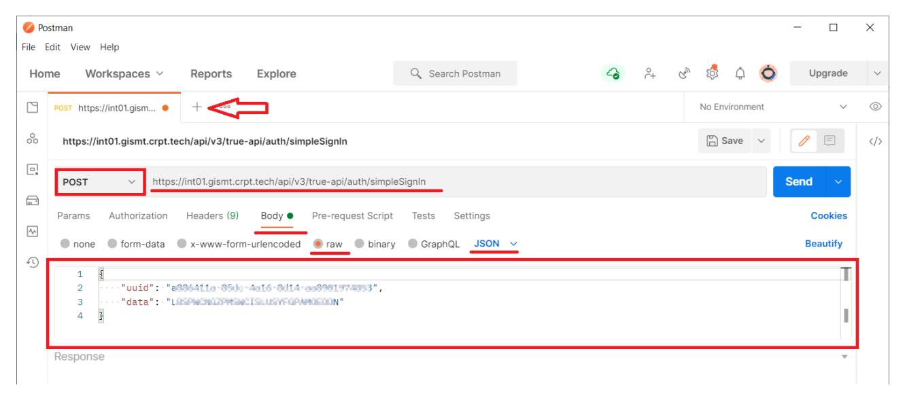

Рисунок 15. Вызов метода получения ключа сессии при единой аутентификации

• в поле ввода добавить JSON-схему примера тела запроса, приведённую в описании метода:

```
{
    "uuid": "string",
    "data": "string"
}
```

Вместо значения **«string»** параметра **«uuid»** указывается значение параметра **«uuid»**, полученное при вызове предыдущего метода. Вместо значения **«string»** параметра **«data»** указывается значение параметра **«data»**, полученное при вызове предыдущего метода и подписанное **присоединённой** электронной подписью зарегистрированного участника оборота товаров в кодировке Base64 (подробнее см. «Подписание присоединённой подписью»).

#### ПРИМЕЧАНИЕ

Физическому индивидуальному предпринимателю, лицу имеющему активные машиночитаемые доверенности, оформленные получения разными организациями, ДЛЯ аутентификационного токена конкретную организацию на необходимо дополнительно заполнить параметр тела запроса «inn», указав в нём ИНН организации, под которой требуется авторизация по машиночитаемой доверенности (10 или 12 цифр)

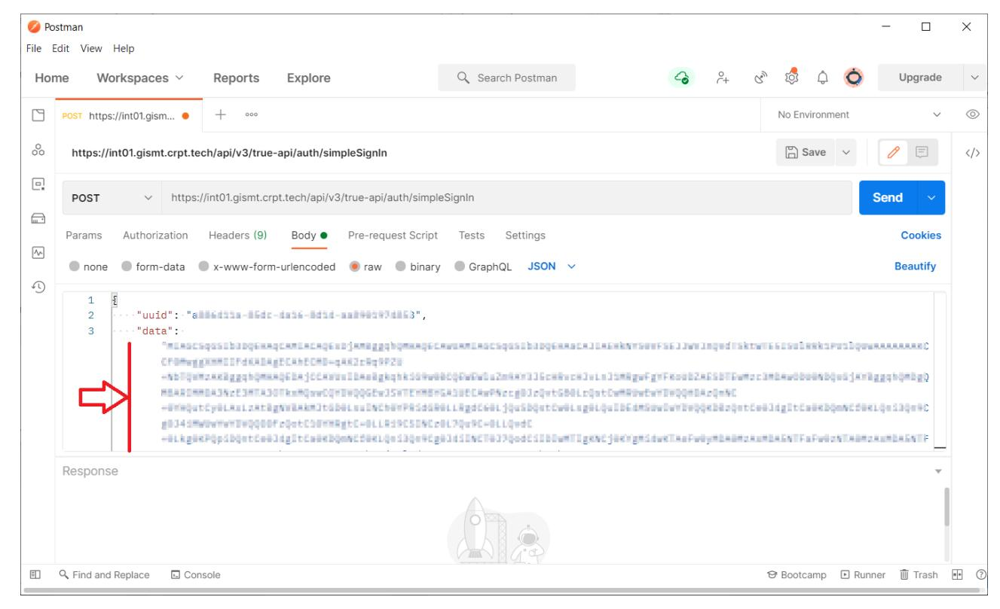

Рисунок 16. Отправка запроса

• нажать кнопку «Send».

После отправки запроса в поле «**Status**» отобразится код ответа «**200 OK**» («Успешный»). В случае получения кода, отличного от «**200 OK**», следует повторно ознакомиться с документацией к методу и описанием ошибки. В случае успешного ответа в поле ответа вернётся значение токена аутентификации ГИС МТ. Полученное значение использовать для формирования всех запросов в приватных методах True API.

#### <span id="page-18-0"></span>2.3.6. Вызов метода «Метод получения токена аутентификации в СУЗ»

- в ПО «Postman» нажать на кнопку «+» для создания нового запроса;
- в поле «Enter request URL» указать URL стенда, URL метода и уникальный идентификатор соединения с СУЗ (см. в графе «Идентификатор соединения» в разделе «Устройства» в пользовательском интерфейсе СУЗ). Пример URL запроса для демонстрационного стенда ГИС МТ: https://markirovka.sandbox.crptech.ru/api/v3/true-api/auth/simpleSignIn/ {omsConnection};
- в раскрывающемся списке типа метода выбрать «POST»;
- во вкладке «**Body**» переключить зависимый переключатель в положение «**raw**», в выпадающем списке выбрать значение «**JSON**»;
- в поле ввода добавить JSON-схему примера тела запроса, приведённую в описании метода:

```
{
    "uuid":"string",
```

```
"data":"string"
}
```

Вместо значения **«string»** параметра **«uuid»** указывается значение параметра **«uuid»**, полученное при запросе **«Вызов метода «Запрос авторизации при единой аутентификации»»**. Вместо значения **«string»** параметра **«data»** указывается значение параметра **«data»**, полученное в паре с параметром **«uuid»** и подписанное **присоединённой** или **откреплённой** электронной подписью зарегистрированного участника оборота товаров в кодировке Base64 (подробнее см. «Подписание присоединённой подписью»).

#### ПРИМЕЧАНИЕ

Физическому лицу / индивидуальному предпринимателю, имеющему машиночитаемые активные доверенности, оформленные организациями, для разными получения аутентификационного токена на конкретную организацию необходимо дополнительно заполнить параметр тела запроса «inn», указав в нём ИНН организации, под которой требуется авторизация по машиночитаемой доверенности (10 или 12 цифр)

• нажать кнопку «Send».

После отправки запроса в поле «Status» отобразится код ответа «200 ОК» («Успешный»). В случае получения кода, отличного от «200 ОК», следует повторно ознакомиться с документацией к методу и описанием ошибки. В случае успешного ответа в поле ответа вернётся значение динамического токена аутентификации СУЗ, которое необходимо использовать для формирования всех запросов в приватных методах СУЗ.

### <span id="page-19-0"></span>2.4. Краткое описание основных операций в АРІ СУЗ

Для возможности заказа КМ выполнить все пункты, указанные в разделе «Подготовительный этап к проведению интеграционного тестирования с API».

Запросы по заказу КМ отправляются через стенд СУЗ (URL стендов см. в разделе «Начало взаимодействия с API»). Актуальная документация «АРІ СУЗ-Облако» размещена в разделе «Помощь» ГИС МТ (промышленный стенд).

КМ проходит несколько этапов жизненного цикла, меняя свой статус в ГИС МТ. Для возможности совершения большинства операций с КМ, он должен сменить статус **«EMITTED»** («Эмитирован») на статус **«APPLIED»** («Нанесён»).

Для генерации КМ и корректного перехода между этапами жизненного цикла придерживаться следующей последовательности вызова методов АРІ СУЗ и True API:

- осуществить вызов метода СУЗ-Облако «Проверить доступность СУЗ» (см. раздел «[Вызов](#page-20-0) [метода СУЗ-Облако «Проверить доступность СУЗ»](#page-20-0)»);
- для генерации КМ в СУЗ-Облако осуществить Вызов метода СУЗ-Облако «Создать заказ на эмиссию кодов маркировки» (см. раздел [«Вызов метода СУЗ-Облако «Создать заказ на](#page-22-0) [эмиссию кодов маркировки»»](#page-22-0));
- для проверки готовности КМ к генерации осуществить вызов метода СУЗ-Облако «Получить статус массива КМ из заказа» (см. раздел «[Вызов метода СУЗ-Облако «Получить статус](#page-25-0) [массива КМ из заказа»»](#page-25-0));
- для получения КМ осуществить вызов метода СУЗ-Облако «Получить КМ из заказа» (см. раздел [«Вызов метода СУЗ-Облако «Получить КМ из заказа»»](#page-26-0));
- для перевода КМ в статус «APPLIED» («Нанесён») осуществить вызов метода СУЗ-Облако «Отправить отчёт об использовании (нанесении) КМ» (см. раздел [«Вызов метода СУЗ-](#page-27-0)[Облако «Отправить отчёт об использовании \(нанесении\) КМ»](#page-27-0)»);
- для проверки изменения статуса КИ осуществить вызов метода True API «Метод получения общедоступной информации о КИ по списку» (см. раздел [«Вызов метода True API «Метод](#page-31-0) [получения общедоступной информации о КИ по списку»»](#page-31-0));
- при наличии станции агрегации на производственной линии осуществить вызов метода СУЗ-Облако «Отправить отчёт об агрегации КМ» (см. раздел «[Вызов метода СУЗ-Облако](#page-29-0) [«Отправить отчёт об агрегации КМ»](#page-29-0)»);
- для проверки статуса сформированного агрегата осуществить вызов метода True API «Метод получения общедоступной информации о КИ по списку» (см. раздел [«Вызов метода True API](#page-31-0) [«Метод получения общедоступной информации о КИ по списку»](#page-31-0)»).

#### <span id="page-20-0"></span>**2.4.1. Вызов метода СУЗ-Облако «Проверить доступность СУЗ»**

- в ПО «Postman» нажать на кнопку **«+»** для создания нового запроса;
- в поле **«Enter request URL»** указать URL стенда, расширение для товарной группы и URL метода. Например, для товарной группы «Молочная продукция» и демонстрационного стенда СУЗ-Облако ввести:<https://suz.sandbox.crptech/api/v2/milk/ping>;
- в раскрывающемся списке типа метода выбрать **«GET»**;
- во вкладке **«Params»** в поле ввода добавить параметр **«omsId»** и ввести уникальный идентификатор СУЗ в поле **«VALUE»**;

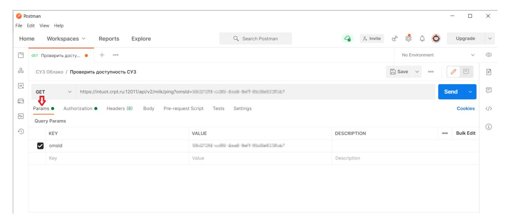

*Рисунок 17. Пример заполнения вкладки Params*

Идентификатор «omsId» можно узнать в ЛК ГИС МТ в разделе **«Управление заказами»** → **«Устройства»**.

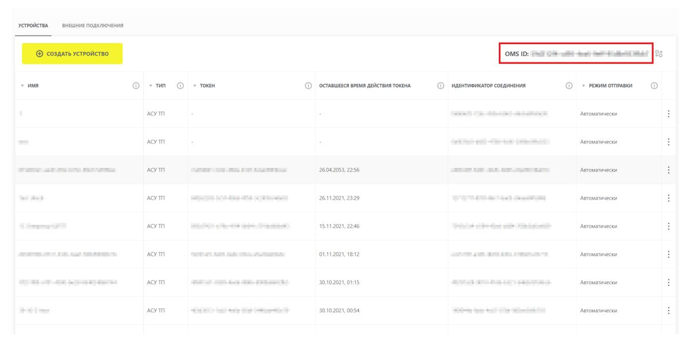

*Рисунок 18. Информация об omsId в пользовательском интерфейсе СУЗ ГИС МТ*

• во вкладке **«Headers»** добавить параметр **«clientToken»** и ввести значение динамического токена аутентификации СУЗ в поле **«VALUE»** (см. раздел «[Вызов метода «Метод получения](#page-18-0) [токена аутентификации в СУЗ»](#page-18-0)»);

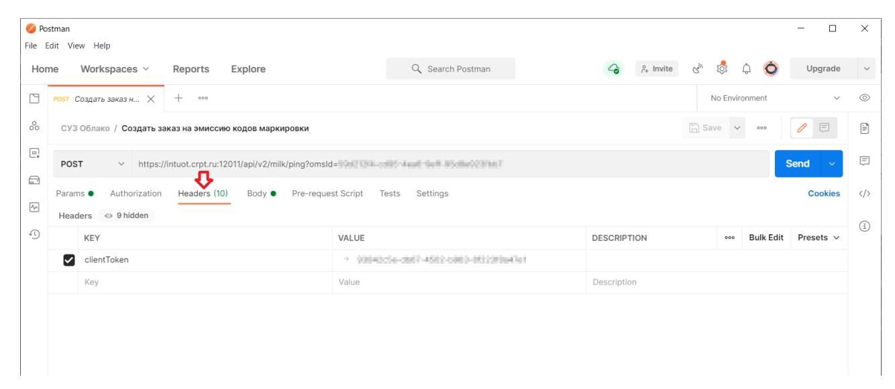

*Рисунок 19. Пример заполнения вкладки Headers*

• нажать кнопку **«Send»**.

После отправки запроса в поле **«Status»** отобразится код ответа **«200 OK»** («Успешный»). В случае получения кода, отличного от **«200 OK»**, следует повторно ознакомиться с документацией к методу и описанием ошибки. В случае успешного ответа в поле ответа вернётся значение параметра **«omsId»**.

#### <span id="page-22-0"></span>**2.4.2. Вызов метода СУЗ-Облако «Создать заказ на эмиссию кодов маркировки»**

- в ПО «Postman» нажать на кнопку **«+»** для создания нового запроса;
- в поле **«Enter request URL»** указать URL стенда, расширение для товарной группы и URL метода. Например, для товарной группы «Молочная продукция» и демонстрационного стенда СУЗ-Облако ввести: [https://suz.sandbox.crptech/api/v2/milk/orders;](https://suz.sandbox.crptech/api/v2/milk/orders)
- в раскрывающемся списке типа метода выбрать **«POST»**;
- во вкладке **«Params»** в поле ввода добавить параметр **«omsId»** и ввести уникальный идентификатор СУЗ в поле **«VALUE»**;
- во вкладке **«Body»** переключить зависимый переключатель в положение **«raw»**, в выпадающем списке выбрать значение **«JSON»**;

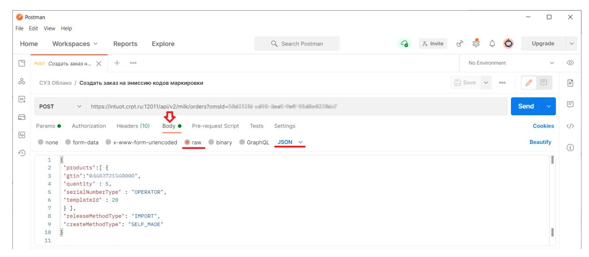

*Рисунок 20. Пример заполнения вкладки Body для запроса создания заказа на эмиссию КМ*

• во вкладке **«Body»** в поле ввода добавить JSON-схему тела запроса, указав как общие для всех товарных групп параметры запроса, так и специфические параметры для выбранной товарной группы (подробнее см. в документации «API СУЗ-Облако»). Пример запроса для товарной группы «Молочная продукция» см. ниже:

```
{
  "products":[
  {
  "gtin":"04611111111111",
  "quantity":5,
  "serialNumberType":"OPERATOR",
  "templateId":20
  }
  ],
  "releaseMethodType":"PRODUCTION",
  "createMethodType":"SELF_MADE"
}
```

Все карточки товара с указанными в запросе кодами товара должны находиться в статусе **«Опубликована»** и **«Готов к эмиссии КМ»** (подробнее см. раздел [«Подготовительный этап](#page-4-2) [к проведению интеграционного тестирования с API](#page-4-2)»).

- во вкладке **«Headers»**:
  - добавить параметр **«clientToken»** и ввести значение динамического токена аутентификации СУЗ в поле **«VALUE»** (см. раздел [«Вызов метода «Метод получения](#page-18-0) [токена аутентификации в СУЗ»](#page-18-0)»);
  - добавить параметр **«Content-type»** и ввести значение **«application/json;charset=UTF-8»**;
  - добавить параметр **«X-Signature»** и скопировать в значение параметра присоединённую или откреплённую цифровую подпись данных запроса (подробнее см. «[Подписание](#page-9-1)

#### [присоединённой подписью»](#page-9-1), «[Подписание откреплённой подписью](#page-12-0)»).

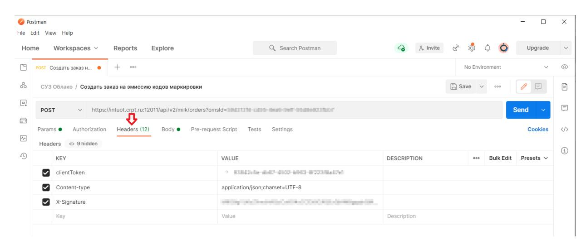

*Рисунок 21. Корректно заполненная вкладка Headers*

#### • нажать кнопку **«Send»**.

После отправки запроса в поле **«Status»** отобразится код ответа **«200 OK»** («Успешный»). В случае получения кода, отличного от **«200 OK»**, следует повторно ознакомиться с документацией к методу и описанием ошибки. В случае успешного ответа в поле ответа будут указаны уникальный идентификатор заказа **«orderId»** и время планируемого выполнения заказа в миллисекундах **«expectedCompleteTimestamp»**. Значение **«orderId»** потребуется для выполнения следующих запросов, изложенных в данной инструкции.

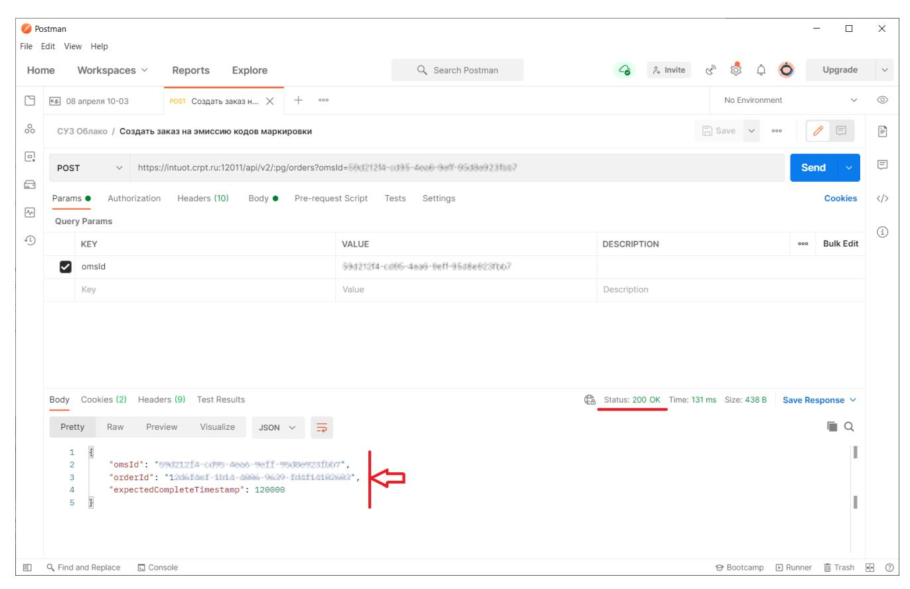

*Рисунок 22. Пример успешного ответа для запроса создания заказа на эмиссию КМ*

#### <span id="page-25-0"></span>**2.4.3. Вызов метода СУЗ-Облако «Получить статус массива КМ из заказа»**

- в ПО «Postman» нажать на кнопку **«+»** для создания нового запроса;
- в поле **«Enter request URL»** указать URL стенда, расширение для товарной группы и URL метода. Например, для товарной группы «Молочная продукция» и демонстрационного стенда СУЗ-Облако ввести:<https://suz.sandbox.crptech/api/v2/milk/buffer/status>;
- в раскрывающемся списке типа метода выбрать **«GET»**;
- во вкладке **«Params»** указать значение параметров **«omsId»**, **«orderId»** ранее созданного запроса и **«gtin»** для товара из созданного заказа;

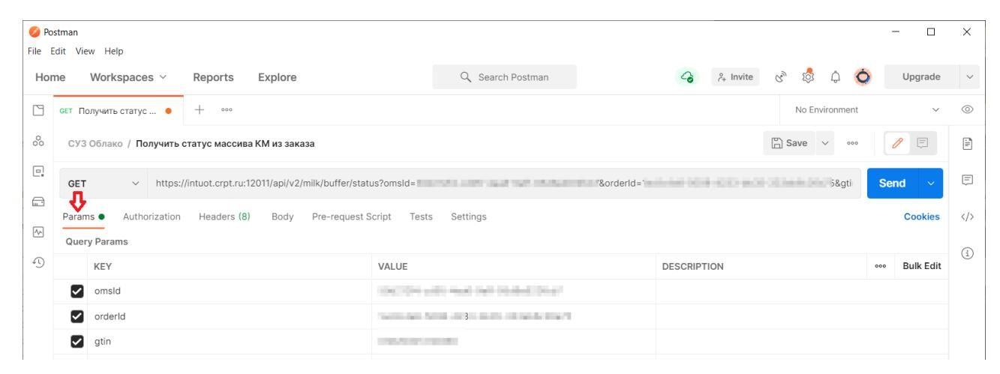

*Рисунок 23. Пример корректного заполнения вкладки Params для запроса статуса массива КМ из заказа*

- во вкладке **«Headers»** добавить параметр **«clientToken»** и ввести значение динамического токена аутентификации СУЗ в поле **«VALUE»** (см. раздел «[Вызов метода «Метод получения](#page-18-0) [токена аутентификации в СУЗ»](#page-18-0)»);
- нажать кнопку **«Send»**.

После отправки запроса в поле **«Status»** отобразится код ответа **«200 OK»** («Успешный»). В случае получения кода, отличного от **«200 OK»**, следует повторно ознакомиться с документацией к методу и описанием ошибки. Если параметр **«bufferStatus»** имеет значение **«ACTIVE»**, то коды маркировки доступны для получения. Расшифровку остальных значений параметров успешного ответа и значения кодов ошибок см. в документации «API СУЗ-Облако»).

*Рисунок 24. Пример успешного ответа на запрос проверки статуса массива КМ из заказа*

#### <span id="page-26-0"></span>**2.4.4. Вызов метода СУЗ-Облако «Получить КМ из заказа»**

- в ПО «Postman» нажать на кнопку **«+»** для создания нового запроса;
- в поле **«Enter request URL»** указать URL стенда, расширение для товарной группы и URL метода. Например, для товарной группы «Молочная продукция» и демонстрационного стенда СУЗ-Облако ввести: [https://suz.sandbox.crptech/api/v2/milk/codes;](https://suz.sandbox.crptech/api/v2/milk/codes)
- в раскрывающемся списке типа метода выбрать **«GET»**;
- во вкладке **«Params»** указать значение параметров:
  - **«omsId»**;
  - **«orderId»** ранее созданного запроса;
  - **«gtin»** для товара из созданного заказа;
  - **«quantity»** количество кодов, запрашиваемых на печать;
  - **«lastBlockId»** идентификатор блока кодов (равен «0» при первом запросе КМ из пула, для повторных запросов передавать идентификатор предыдущего пакета).

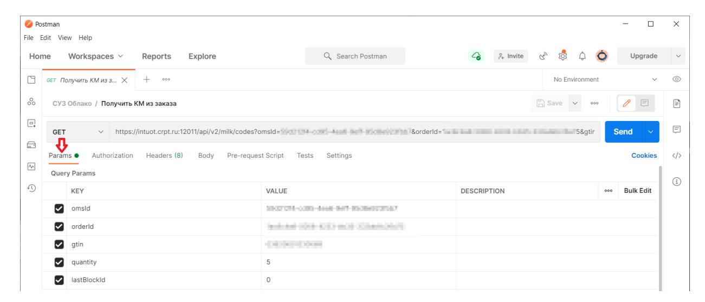

*Рисунок 25. Пример корректного заполнения вкладки Params для запроса КМ из заказа*

- во вкладке **«Headers»** добавить параметр **«clientToken»** и ввести значение динамического токена аутентификации СУЗ в поле **«VALUE»** (см. раздел «[Вызов метода «Метод получения](#page-18-0) [токена аутентификации в СУЗ»](#page-18-0)»);
- нажать кнопку **«Send»**.

После отправки запроса в поле **«Status»** отобразится код ответа **«200 OK»** («Успешный»). В случае получения кода, отличного от **«200 OK»**, следует повторно ознакомиться с документацией к методу и описанием ошибки.

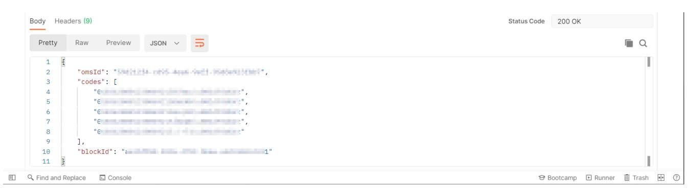

*Рисунок 26. Пример успешного ответа на запрос получения КМ из заказа*

КМ передаются в параметре **«codes»**. Значение параметра **«blockId»** вводить при повторном обращении к методу, если в исходном заказе выбраны не все КМ, сгенерированные в заказе.

#### <span id="page-27-0"></span>**2.4.5. Вызов метода СУЗ-Облако «Отправить отчёт об использовании (нанесении) КМ»**

Данный метод позволяет перевести КМ из статуса **«EMITTED»** («Эмитирован») в статус **«APPLIED»** («Нанесён»), что позволяет совершать дальнейшие операции с КМ: вводить в оборот, проводить агрегацию и т.д. Список товарных групп, для которых перевод статуса производится автоматически, без отправки отчёта о маркировке, см. в документации «API СУЗ-Облако», для остальных групп — отправка отчёта об использовании (нанесении) является обязательной.

#### Для отправки отчёта:

- в ПО «Postman» нажать на кнопку **«+»** для создания нового запроса;
- в поле **«Enter request URL»** указать URL стенда, расширение для товарной группы (см. Справочник «Список поддерживаемых товарных групп») и URL метода. Например, для товарной группы «Пиво, напитки, изготавливаемые на основе пива, и слабоалкогольные напитки» на демонстрационном стенде СУЗ-Облако ввести: [https://suz.sandbox.crptech.ru/api/](https://suz.sandbox.crptech.ru/api/v2/beer/utilisation) [v2/beer/utilisation](https://suz.sandbox.crptech.ru/api/v2/beer/utilisation);
- в раскрывающемся списке типа метода выбрать **«POST»**;
- во вкладке **«Params»** указать значение параметра **«omsId»**;
- во вкладке **«Headers»** добавить параметры:
  - **«clientToken»** и ввести значение динамического токена аутентификации СУЗ в поле **«VALUE»** (см. раздел «[Вызов метода «Метод получения токена аутентификации в](#page-18-0) [СУЗ»](#page-18-0)»);
  - **«Content-type»** и ввести значение **«application/json»**.
- в поле ввода во вкладке **«Body»** добавить JSON-схему тела запроса, указав как общие для всех товарных групп параметры запроса, так и специфические параметры для выбранной товарной группы (подробнее, см. в документации «API СУЗ-Облако»). Список КМ передать в параметре **«sntins»**, указав полный код маркировки, включая код проверки (как было получено в ответе вызова метода СУЗ-Облако «Получить КМ из заказа» (см. раздел «[Вызов](#page-26-0) [метода СУЗ-Облако «Получить КМ из заказа»»](#page-26-0)));

Пример запроса для товарной группы «Пиво, напитки, изготавливаемые на основе пива, и слабоалкогольные напитки» см. ниже:

```
{
  "sntins":[
  "010461111111111121GLTP9kqZn5QRt\u001d93dGVz",
  "010461111111111121iOpbrH3AAObaw\u001d93dGVz",
  "010461111111111121kDEGDIQemE9IE\u001d93dGVz",
  "0104611111111111212Xg3Cz3KFIjDI\u001d93dGVz",
  "010461111111111121LL8GyS1szEs8b\u001d93dGVz"
  ],
  "usageType":"VERIFIED",
  "expDate":"220516"
}
```

• нажать кнопку **«Send»**.

После отправки запроса в поле **«Status»** отобразится код ответа **«200 OK»** («Успешный»). В случае получения кода, отличного от **«200 OK»**, следует повторно ознакомиться с документацией к методу и описанием ошибки.

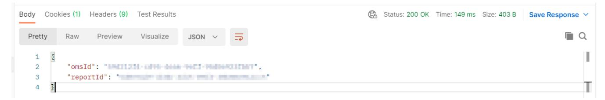

Рисунок 27. Пример успешного ответа

После отправки отчёта произвести вызов метода True API «Метод получения общедоступной информации о КИ по списку» (см. раздел «Вызов метода True API «Метод получения общедоступной информации о КИ по списку»») для проверки перехода КМ в статус «APPLIED» («Нанесён»).

#### <span id="page-29-0"></span>2.4.6. Вызов метода СУЗ-Облако «Отправить отчёт об агрегации КМ»

Метод используется при наличии станции агрегации на производственной линии.

Для формирования и отправки отчёта об агрегации нескольких КМ в групповую и транспортную упаковку:

- в ПО «Postman» нажать на кнопку «+» для создания нового запроса;
- в поле «Enter request URL» указать URL стенда, расширение для товарной группы (см. Справочник «Список поддерживаемых товарных групп») и URL метода. Например, для товарной группы «Пиво, напитки, изготавливаемые на основе пива, и слабоалкогольные напитки» на демонстрационном стенде СУЗ-Облако ввести: https://suz.sandbox.crptech.ru/api/v2/beer/aggregation;
- в раскрывающемся списке типа метода выбрать «POST»;
- во вкладке «Params» указать значение параметра «omsId»;
- во вкладке «**Headers**» добавить параметры:
  - «clientToken» и ввести значение динамического токена аутентификации СУЗ в поле «VALUE» (см. раздел «Вызов метода «Метод получения токена аутентификации в СУЗ»»);
  - «Content-type» и ввести значение «application/json».
- во вкладке «**Body**» в поле ввода добавить JSON-схему тела запроса, указав как общие для всех товарных групп параметры запроса, так и специфические параметры для выбранной товарной группы (подробнее см. в документации «АРІ СУЗ-Облако»);

Пример запроса на агрегацию для товарной группы «Пиво, напитки, изготавливаемые на основе пива, и слабоалкогольные напитки» см. ниже:

```
{
  "participantId":"7777777777",
  "aggregationUnits":[
  {
  "aggregatedItemsCount":5,
  "aggregationType":"AGGREGATION",
  "aggregationUnitCapacity":5,
  "sntins":[
  "010461111111111121GLTP9kqZn5QRt",
  "010461111111111121iOpbrH3AAObaw",
  "010461111111111121kDEGDIQemE9IE",
  "0104611111111111212Xg3Cz3KFIjDI",
  "010461111111111121LL8GyS1szEs8b"
  ],
  "unitSerialNumber":"099970000561221533"
  }
  ]
}
```

Список объединяемых КМ передать в параметре **«sntins» без кода проверки** (удалить последние символы кода, начиная с «\u001d»). Все объединяемые КМ должны иметь статус **«APPLIED»** («Нанесён»). Для проверки статуса КМ произвести вызов метода True API «Метод получения общедоступной информации о КИ по списку» (см. раздел «[Вызов метода](#page-31-0) [True API «Метод получения общедоступной информации о КИ по списку»](#page-31-0)»).

Поле **«unitSerialNumber»** («Код агрегата») должно содержать уникальный номер внутри ГИС МТ. Для проверки уникальности см. раздел [«Вызов метода True API «Метод получения](#page-31-0) [общедоступной информации о КИ по списку»»](#page-31-0), указав выбранный номер **«unitSerialNumber»**.

Пример ответа при уникальном номере см. ниже:

```
[
  {
  "cisInfo":{
  "requestedCis":"099970000561134533",
  "cis":"099970000561134533",
  "gtin":"09997000056113",
  "maxRetailPrice":null
  },
  "errorMessage":"КМ/КИ не найден",
  "errorCode":"404"
  }
]
```

• нажать кнопку **«Send»**.

После отправки запроса в поле **«Status»** отобразится код ответа **«200 OK»** («Успешный»). В случае получения кода, отличного от **«200 OK»**, следует повторно ознакомиться с документацией к методу и описанием ошибки.

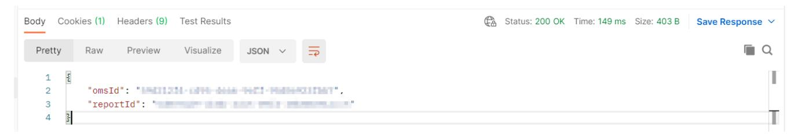

*Рисунок 28. Пример успешного ответа*

Значение параметра **«reportId»** отображается в пользовательском интерфейсе СУЗ **«Агрегация»**. При этом в пользовательском разделе ГИС МТ в разделе **«Документы»** отчёт будет иметь другой номер.

#### <span id="page-31-0"></span>**2.4.7. Вызов метода True API «Метод получения общедоступной информации о КИ по списку»**

Данный метод позволяет получить подробную информацию о запрашиваемом списке КИ товара: в одном запросе указывается как один КИ, так и несколько КИ (не более 1000 КИ). С помощью данного запроса можно узнать актуальный статус КИ, а также проверить уникальность кода агрегата при заполнении параметров отчёта об агрегации.

Для формирования запроса:

- в ПО «Postman» нажать на кнопку **«+»** для создания нового запроса;
- в поле **«Enter request URL»** указать URL стенда и URL метода. На демонстрационном стенде True API ввести: [https://markirovka.sandbox.crptech.ru/api/v3/true-api/cises/info;](https://markirovka.sandbox.crptech.ru/api/v3/true-api/cises/info)
- в раскрывающемся списке типа метода выбрать **«POST»**;
- во вкладке **«Params»** в значении параметра **«pg»** указать расширение для товарной группы;
- во вкладке **«Authorization»** в раскрывающемся списке **«Type»** выбрать **«Bearer Token»** и заполнить поле ввода **«Token»** значением параметра **«token»**, полученным в ответе на вызов метода «Получение ключа сессии при единой аутентификации» (см. раздел [«Вызов метода](#page-16-0) [«Получение ключа сессии при единой аутентификации»»](#page-16-0));
- в поле ввода во вкладке **«Body»** добавить JSON-схему тела запроса, указав запрашиваемые КИ. КМ указывать **без кода проверки** (без крипто-части). Для этого удалить последние символы КМ, начиная с «\u001d».

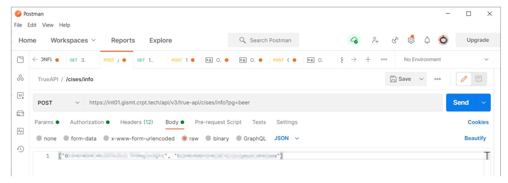

*Рисунок 29. Пример запроса получения общедоступной информации о КИ по списку*

После отправки запроса в поле **«Status»** отобразится код ответа **«200 OK»** («Успешный»). В случае получения кода, отличного от **«200 OK»**, следует повторно ознакомиться с документацией к методу и описанием ошибки. Статус КМ см. в значении параметра **«status»**.

*Рисунок 30. Пример успешного ответа*

## <span id="page-32-0"></span>**2.5. Краткое описание основных операций с True API**

Для подачи сведений о КИ в ГИС МТ через True API используется [«Методы по работе с](#page-32-1) [документами прямой подачи сведений](#page-32-1)» и соответствующие типы документов (см. «Описание True API»).

#### <span id="page-32-1"></span>**2.5.1. Методы по работе с документами прямой подачи сведений**

Для подачи сведений в документе с помощью «Методы по работе с документами прямой подачи сведений»:

- в ПО «Postman» нажать кнопку «+» для создания нового запроса;
- в поле «Enter request URL» указать URL стенда, URL метода и расширение для товарной группы. Например, для демонстрационного стенда ГИС МТ / «ИР Маркировки»: https://markirovka.sandbox.crptech.ru/api/v3/true-api/lk/documents/create?pg=lp;
- во вкладке «Authorization» в раскрывающемся списке «Туре» выбрать «Bearer Token» и заполнить поле ввода «Token» значением параметра «token», полученным при авторизации в True API (подробнее см. в разделе «Вызов метода «Получение ключа сессии при единой аутентификации»»);
- заполнить параметры документа в формате \* .json, \* .xml или \* .csv значениями в допустимом формате в соответствии с документацией «Описание True API»;

При указании КИ в документе учесть необходимость экранирования (см. «Рекомендуемый алгоритм экранирования специальных символов в составе кода идентификации»).

- подписать сформированный документ откреплённой УКЭП;
- указать откреплённую подпись в параметре «signature» в формате Base64;
- закодировать сформированный документ в Base64 и указать в параметре **«product document»**;
- указать необходимую товарную группу;

При подаче сведений в документе через API учитывать доступность подаваемого документа для определённых товарных групп.

• при успешной подаче документа в ответе вернётся «**uuid**» — уникальный идентификатор документа.

Статус отправленного документа можно проверить с помощью метода «Метод получения списка загруженных документов в ГИС МТ» в документации «Описание True API». Информацию о КИ в составе документа можно запросить с помощью метода «Метод получения информации о списке КИ по заданным фильтрам» в документации «Описание True API».

# <span id="page-33-0"></span>2.6. Краткое описание основных операций с API «Национального каталога маркированных товаров»

Методы НКМТ позволяют регистрировать товары, получать и редактировать сведения в карточках зарегистрированных товаров, управлять доступом субаккаунтов и т.д.

Для доступа к методам API НКМТ требуется авторизоваться в системе (см. раздел «Авторизация в «Национальном каталоге маркированных товаров»»).

Работа в НКМТ включает несколько основных этапов и связанных с ними групп методов:

- создание карточки товара и отправка её на модерацию (см. раздел [«Создание и изменение](#page-35-0) [карточки товара](#page-35-0)»);
- подписание карточки товара (см. раздел [«Подписание карточки товара»](#page-41-0));
- предоставление доступа к карточке товара для субаккантов (см. раздел [«Работа с](#page-41-1) [субаккаунтами»](#page-41-1)).

#### <span id="page-34-0"></span>**2.6.1. Авторизация в «Национальном каталоге маркированных товаров»**

Вызов методов НКМТ возможен с использованием авторизации одним из следующих способов:

• через аутентификационный токен ГИС МТ (подробнее см. в разделе [«Получение](#page-12-1) [аутентификационного токена ГИС МТ для взаимодействия с API НК и True API»](#page-12-1)).

Параметр является обязательным, если в параметрах URL запроса не указан **«apikey»**.

В Postman аутентификационный токен указывается во вкладке **«Authorization»** в поле **«Token»**, которое отображается в раскрывающемся списке **«Type»** при выборе значения **«Bearer Token»** (подробнее см. в разделе [«Общая последовательность действий для](#page-6-1) [выполнения запросов через API](#page-6-1)»).

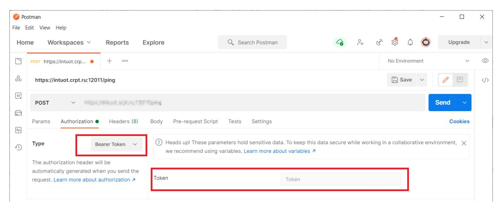

*Рисунок 31. Указание токена аутентификации в приватные запросы*

• через указание параметра «apikey» в параметрах URL запроса. Значение для параметра можно получить в личном кабинете Национального каталога в разделе «Профиль» → «Данные участника» (поле «API KEY»). Поле «API KEY» отображается только для пользователя с ролью «Администратор». Параметр является обязательным, если в заголовке запроса не указан аутентификационный токен ГИС МТ.

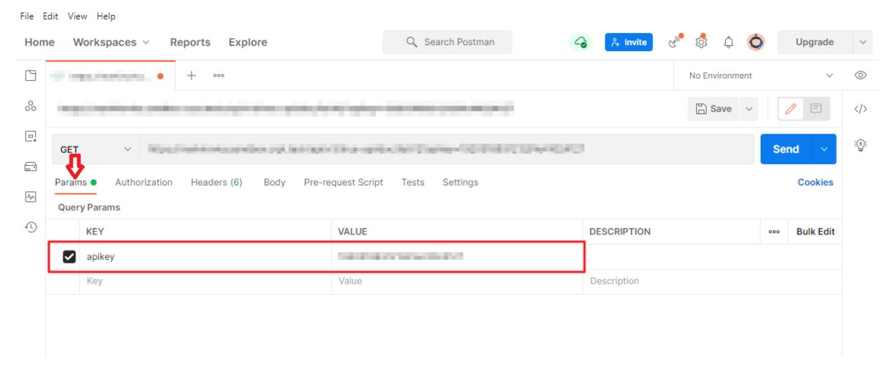

*Рисунок 32. Пример указания apikey в параметрах запроса*

#### <span id="page-35-0"></span>**2.6.2. Создание и изменение карточки товара**

Для создания карточки выполнить следующие действия:

- 1. Проверить наличие регистрации в НКМТ кода группы ТН ВЭД, к которому относится создаваемая карточка товара (см. раздел [«Проверка регистрации кода ТН ВЭД для](#page-35-1) [создаваемой карточки товара»](#page-35-1)).
- 2. Определить атрибутивный состав создаваемой карточки товара (см. в разделе [«Получение](#page-36-0) [информации по атрибутам»](#page-36-0)).
- 3. Если создаваемая карточка ранее не описывалась в GS1, то сгенерировать код товара (GTIN). Для генерации кода товара осуществить вызов метода «Метод генерации черновиков кодов товаров» (/nk/generate-gtins).
- 4. Сформировать черновик карточки товара (см. в разделе [«Создание черновика карточки](#page-37-0) [товара](#page-37-0)»).
- 5. При необходимости отредактировать черновик карточки товара (см. в разделе [«Редактирование карточки товара»](#page-40-0)).
- 6. Отправить карточку товара на модерацию (см. в разделе [«Отправка карточки товара на](#page-40-1) [модерацию](#page-40-1)»).
- 7. Убедиться, что обработка пакета обновлений карточки завершено (подробнее см. метод «Метод получения статуса фида по ID фида от его заказчика» (/nk/feed-status)), и карточка товара перешла в статус «Опубликована» (подробнее см. метод «Метод получения карточки товара, в том числе неопубликованной карточки» (/nk/feed-product)).

#### <span id="page-35-1"></span>**2.6.2.1. Проверка регистрации кода ТН ВЭД для создаваемой карточки товара**

Сведения о наличии регистрации кода ТН ВЭД в НКМТ необходимы для корректного формирования запроса при создании карточки товара. Поскольку в НКМТ зарегистрированы не все коды ТН ВЭД из общероссийского классификатора кодов, и при этом для ряда товарных позиций зарегистрированы не десятизначные, а четырёхзначные коды ТН ВЭД, то передача в запросе на создание карточки товара кода ТН ВЭД из общероссийского классификатора кодов напрямую, может привести к отклонению карточки товара при модерации.

Проверку регистрации кода ТН ВЭД для создаваемой карточки товара можно осуществить посредством метода «Метод определения кода принадлежности товара к маркируемым товарным группам» (/nk/mark-check), для этого:

- в теле запроса в атрибуте «tnveds» («Массив, содержащий коды ТН ВЭД, с которым связан указанный в запросе код товара») ввести проверяемый код ТН ВЭД в четырёхзначном и десятизначном форматах;
- в ответе запроса для зарегистрированного кода ТН ВЭД в параметре «is\_marked» будет указано значение «Товар с указанным кодом ТНВЭД подлежит маркировке».

Примером товаров, для которых при создании карточек товаров требуется указывать десятизначный код ТН ВЭД являются товары следующих товарных групп:

- «Альтернативная табачная продукция»;
- «Молочная продукция»: сыры и творог, код ТНВЭД у которых начинается с «0406»;
- «Никотинсодержащая продукция»;
- «Пиво, напитки, изготавливаемые на основе пива, и слабоалкогольные напитки»;
- «Специализированная пищевая продукция и БАД к пище»;
- «Табачная продукция»;
- «Упакованная вода».

#### <span id="page-36-0"></span>**2.6.2.2. Получение информации по атрибутам**

Для уточнения атрибутивного состава создаваемой карточки товара осуществить вызов метода «Метод получения списка атрибутов как публичных, так и приватных для запрашивающего аккаунта» (/nk/attributes).

Для запроса атрибутивного состава указать зарегистрированный в НКМТ код группы ТН ВЭД (подробнее см. в разделе «[Проверка регистрации кода ТН ВЭД для создаваемой карточки](#page-35-1) [товара](#page-35-1)»).

Атрибутивный состав карточки товара содержит три группы атрибутов:

• атрибуты первого слоя — минимальный набор обязательных атрибутов, необходимый для создания черновика карточки и возможности эмиссии кодов маркировки.

Атрибуты первого слоя одинаковы для всех товаров и включают:

- «gtin» («Идентификатор в Национальном каталоге товаров, код товара»);
- «good\_name» («Наименование товара»);
- «tnved» («ТН ВЭД»);
- «brand» («Торговая марка товара»).

После создания черновика карточки товара атрибуты первого слоя недоступны для редактирования.

• атрибуты второго слоя — обязательные атрибуты, необходимые для полного описания товара. Без заполнения атрибутов второго слоя карточка товара не может быть подписана и, как следствие, код маркировки, выпущенный для такого товара, не может быть введён в оборот.

Состав атрибутов второго слоя отличается для товаров разных товарных групп и определяется соответствующими Постановлениями Правительства РФ для каждой товарной группы.

Редактирование атрибутов второго слоя доступно только до момента отправки карточки товара на модерацию.

• атрибуты третьего слоя — набор необязательных атрибутов, предназначенных для более полного информирования потребителя о товаре.

Переключение метода «Метод получения списка атрибутов как публичных, так и приватных для запрашивающего аккаунта» (/nk/attributes) на предоставление сведений по обязательным и необязательным атрибутам осуществляется через параметр запроса «attr\_type» («Тип атрибута»):

- «a» все атрибуты (значение по умолчанию);
- «m» только обязательные атрибуты;
- «r» только рекомендуемые атрибуты;
- «o» только опциональные (необязательные) атрибуты.

#### <span id="page-37-0"></span>**2.6.2.3. Создание черновика карточки товара**

При создании карточки товара доступны следующие опции:

- создание черновика ранее неопубликованной карточки товара (см. раздел «[Создание](#page-38-0) [черновика ранее неопубликованной карточки товара»](#page-38-0));
- создание черновика карточки товара на основе ранее опубликованной карточки товара (см. раздел «[Создание черновика карточки товара на основе ранее опубликованной карточки](#page-38-1) [товара](#page-38-1)»);

- создание карточки товара с техническим кодом товара (см. раздел «[Создание карточки товара](#page-39-0) [с техническим GTIN](#page-39-0)»);
- создание карточки товара с иностранным кодом товара (см. раздел «[Создание карточки](#page-39-1) [товара с иностранным GTIN](#page-39-1)»).

#### <span id="page-38-0"></span>**2.6.2.3.1. Создание черновика ранее неопубликованной карточки товара**

Для создания черновика ранее неопубликованной карточки товара осуществить вызов метода «Метод создания и обновления товаров» (/nk/feed).

Минимальный набор параметров тела запроса для создания черновика карточки товара включает атрибуты первого слоя:

- «gtin» («Идентификатор в Национальном каталоге товаров, код товара»);
- «good\_name» («Наименование товара»);
- «tnved» («ТН ВЭД»).

Если в НКМТ для товара зарегистрирован деcятизначный код ТН ВЭД, то указать десятизначный код, иначе указать четырёхзначный код ТН ВЭД (подробнее см. в разделе [«Проверка регистрации кода ТН ВЭД для создаваемой карточки товара](#page-35-1)»).

Доступность кодов ТН ВЭД при формировании карточки товара определяется перечнем товарных групп, подключённых в личном кабинете ГИС МТ.

Создание карточки товара через API невозможно, если создаваемая карточка товара была ранее описана в GS1 с незаполненным полем «tnved» («ТН ВЭД»). Такую карточку товара можно создать в НКМТ только через личный кабинет ГИС МТ.

• «brand» («Торговая марка товара»).

Для управления режимом отправки карточки на модерацию указать значение параметра «moderation» («Признак того, что товар надо отправлять на модерацию») в теле запроса:

- «0» (значение по умолчанию) автоматическая отправка исключена. Карточка товара после создания переходит в статус «Черновик» и может быть отредактирована при последующих вызовах метода «Метод создания и обновления товаров» (/nk/feed);
- «1» автоматическая отправка карточки товара на модерацию в момент отправки запроса «Метод создания и обновления товаров» (/nk/feed).

#### <span id="page-38-1"></span>**2.6.2.3.2. Создание черновика карточки товара на основе ранее опубликованной карточки товара**

Метод «Метод создания и обновления товаров» (/nk/feed) позволяет создавать карточки товаров на основе ранее опубликованных в НКМТ карточек товаров. Для этого в параметрах тела запроса указать идентификатор копируемой карточки товаров в параметре «good\_id» («Идентификатор товара в каталоге»). Параметр «gtin» («Идентификатор в Национальном каталоге товаров, код товара») в этом случае не указывается.

Для карточек товаров, созданных на основе ранее опубликованных карточек, доступно редактирование параметров, относящихся только к атрибутам третьего слоя (подробнее см. в разделе «[Получение информации по атрибутам](#page-36-0)»).

#### <span id="page-39-0"></span>**2.6.2.3.3. Создание карточки товара с техническим GTIN**

Метод «Метод создания и обновления товаров» (/nk/feed) позволяет создавать карточки товаров с техническим кодом товара (GTIN), предназначенных для описания остатков или для перемаркировки товаров). Для этого в параметрах тела запроса для параметра «is\_tech\_gtin» («Признак создания карточки товара с техническим кодом товара») установить значение «true». Параметр «gtin» («Идентификатор в Национальном каталоге товаров, код товара») в этом случае не указывается. В этом случае технический GTIN будет сгенерирован системой автоматически.

Для управления режимом отправки карточки на модерацию указать значение параметра «moderation» («Признак того, что товар надо отправлять на модерацию») в теле запроса:

- «0» (значение по умолчанию) автоматическая отправка исключена. Карточка товара после создания переходит в статус «Черновик» и может быть отредактирована при последующих вызовах метода «Метод создания и обновления товаров» (/nk/feed);
- «1» автоматическая отправка карточки товара на модерацию в момент отправки запроса «Метод создания и обновления товаров» (/nk/feed).

#### <span id="page-39-1"></span>**2.6.2.3.4. Создание карточки товара с иностранным GTIN**

Метод «Метод создания и обновления товаров» (/nk/feed) позволяет создавать карточки товаров с иностранным кодом товара (GTIN). Для создания такой карточки товара следовать инструкциям, указанным в разделе [«Создание черновика ранее неопубликованной карточки товара](#page-38-0)», при этом в параметре «gtin» («Идентификатор в Национальном каталоге товаров, код товара») указать код товара иностранного диапазона.

Перед обработкой запроса система проверяет наличие карточки товара с указанным кодом товара в системе GS1. В зависимости от результатов проверки возможны следующие сценарии:

- если карточка товара присутствует в GS1 и отсутствует в НКМТ, при этом значения параметров «tnved» («ТН ВЭД») и «brand» («Торговая марка товара»), указанные в запросе и в карточке товара в GS1 не совпадают, то запрос будет отклонён\$
- если карточка товара присутствует в GS1 и отсутствует в НКМТ, при этом значения параметров «tnved» («ТН ВЭД») и «brand» («Торговая марка товара»), указанные в запросе и в карточке товара в GS1 совпадают, то информация о товаре будет загружена из GS1, и запрос будет успешно обработан;

• если карточка товара отсутствует и в GS1, и в НКМТ, то при успешной обработке запроса будет сформирована новая карточка товара.

Для управления режимом отправки карточки на модерацию указать значение параметра «moderation» («Признак того, что товар надо отправлять на модерацию») в теле запроса:

- «0» (значение по умолчанию) автоматическая отправка исключена. Карточка товара после создания переходит в статус «Черновик» и может быть отредактирована при последующих вызовах метода «Метод создания и обновления товаров» (/nk/feed);
- «1» автоматическая отправка карточки товара на модерацию в момент отправки запроса «Метод создания и обновления товаров» (/nk/feed).

#### <span id="page-40-0"></span>**2.6.2.4. Редактирование карточки товара**

Редактирование карточки товара возможно только для карточек в статусах «Черновик» и «Требует изменений».

Для редактирования карточки товаров осуществить вызов метода «Метод создания и обновления товаров» (/nk/feed), в параметрах тела запроса которого указать идентификатор редактируемой карточки товаров в параметре «good\_id» («Идентификатор товара в каталоге») и изменяемые параметры карточки. Параметр «gtin» («Идентификатор в Национальном каталоге товаров, код товара») в этом случае не указывается.

Для получения идентификатора карточки товара, указываемого в параметре «good\_id» («Идентификатор товара в каталоге»), вызвать метод «Метод получения карточки товара, в том числе неопубликованной карточки» (/nk/feed-product).

Для редактирования недоступны атрибуты первого слоя. Атрибуты второго слоя доступны для редактирования только до момента отправки карточки на модерацию. После публикации карточки товара атрибуты первого и второго слоя для редактирования недоступны.

#### <span id="page-40-1"></span>**2.6.2.5. Отправка карточки товара на модерацию**

Отправка карточки товара на модерацию производится автоматически, если в параметрах запроса метода «Метод создания и обновления товаров» (/nk/feed) для параметра «moderation» («Признак того, что товар надо отправлять на модерацию») установлено значение «true».

Принудительная отправка на модерацию доступна для карточек товара в статусе «Черновик» посредством метода «Метод отправки на модерацию карточки товаров в статусе «Черновик»» (/nk/feed-moderation). При использования принудительной отправки на модерацию, в случае отклонения карточки модератором просмотр информации о причинах отклонения доступен только через личный кабинет ГИС МТ (по API просмотр сведений недоступен).

Длительность процедуры модерации отличается для промышленного и демонстрационного

(тестового) контура:

- на промышленном контуре модерация карточек товаров производится в порядке очерёдности в течение двух рабочих дней;
- на демонстрационном (тестовом) контуре модерация производится по запросу в службу технической поддержки по адресу [support@national-catalog.ru.](mailto:support@national-catalog.ru) Обработка запроса производится в порядке очередности.

#### <span id="page-41-0"></span>**2.6.3. Подписание карточки товара**

Подписание карточки товара возможно двумя методами:

- посредством метода «Метод получения массива ID прошедших валидацию товаров» (/nk/feed-product-sign);
- посредством метода «Метод подписи карточки товара» (/nk/feed-product-sign-pkcs).

Для подписания карточки товара требуется запросить её XML с помощью метода «Метод получения XML товаров по массиву ID товаров или коду товара» (/nk/feed-product-document).

#### <span id="page-41-1"></span>**2.6.4. Работа с субаккаунтами**

Механизм работы с субаккаунтами необходим для предоставления доступа к карточкам товаров сторонним организациям. Организации-субаккаунты получают возможность выпускать коды маркировки по карточкам товаров организации-владельца карточки товара.

Для предоставления доступа к карточкам товаров в рамках механизма субаккантов обе организации (и организация-владелец карточки товара, и организация, регистрируемая в качестве субакканта) должны быть зарегистрированы в НКМТ.

Для работы с субаккаунтами предназначены следующие методы:

- для получения списка субаккаунтов «Метод получения списка субаккаунтов компании» (/nk/linked-accounts);
- получение xml файла необходимого для управления доступами субаккаунтов «Метод получения файла в формате XML для управления доступами субаккаунтов» (/nk/linkedaccounts-documents);
- подписание выдачи или отзыва разрешения субаккаунту на использование кодов товара для эмиссии КМ — «Метод подписи предоставления или отзыва разрешения на использование КИ» (/nk/linked-accounts-sign).

# <span id="page-42-0"></span>Перечень сокращений, условных обозначений и терминов

| Сокращение, условное обозначение, термин | Описание                                                                                                                                                                                                                                                                                                                                                  |
|------------------------------------------|-----------------------------------------------------------------------------------------------------------------------------------------------------------------------------------------------------------------------------------------------------------------------------------------------------------------------------------------------------------|
| API                                      | Аpplication Programming Interface (интерфейс программирования приложений) — программный интерфейс приложения, набор готовых классов, процедур, функций, структур и констант, предоставляемых приложением (библиотекой, сервисом) или операционной системой для использования во внешних программных продуктах                                             |
| CSV                                      | Comma-Separated Values — текстовый формат файла, предназначенный для предоставления табличных данных                                                                                                                                                                                                                                                      |
| GS1                                      | Global Standard 1 — независимая некоммерческая организация, специализирующаяся на разработке и внедрении глобальных стандартов идентификации, маркировки в торговых процессах для различных целей, включая организацию прослеживаемости товаров. Ассоциация автоматической идентификации «ГС1 РУС», использующая стандарты GS1                            |
| GTIN                                     | Global Trade Item Number – глобальный идентификационный номер, присваиваемый единице товара (продукции) национальной организацией GS1 в соответствии с правилами, установленными стандартами системы GS1, наносимый в виде штрихового кода на каждую единицу товара (продукции) в целях ее однозначной идентификации в мировом экономическом пространстве |
| JSON                                     | JavaScript Object Notation — текстовый формат обмена данными, основанный на JavaScript                                                                                                                                                                                                                                                                    |
| URL                                      | Uniform Resource Locator — унифицированный указатель ресурса                                                                                                                                                                                                                                                                                              |

| Сокращение, условное обозначение, термин | Описание                                                                                                                                                                                                                                                                                                                                                                                                                                                  |
|------------------------------------------|-----------------------------------------------------------------------------------------------------------------------------------------------------------------------------------------------------------------------------------------------------------------------------------------------------------------------------------------------------------------------------------------------------------------------------------------------------------|
| XML                                      | eXtensible Markup Language — расширяемый язык разметки, состоящий из набора тегов, их атрибутов, значений, а также набора правил, определяющих какие атрибуты и элементы могут входить в состав других элементов                                                                                                                                                                                                                                          |
| ГИС МТ                                   | Государственная информационная система, созданная в целях автоматизации процессов сбора и обработки информации об обороте товаров, подлежащих обязательной маркировке средствами идентификации, хранения такой информации, обеспечения доступа к ней, её предоставления и распространения, повышения эффективности обмена такой информацией и обеспечения прослеживаемости указанных товаров, а также в иных целях, предусмотренных федеральными законами |
| ИНН                                      | Идентификационный номер налогоплательщика — цифровой код, упорядочивающий учёт налогоплательщиков в Российской Федерации                                                                                                                                                                                                                                                                                                                                  |
| КИ                                       | Код идентификации — последовательность символов, представляющая собой уникальный номер экземпляра товара, формируемая Оператором информационной системы мониторинга для целей идентификации товаров, в том числе в потребительской упаковке                                                                                                                                                                                                               |
| КИТУ                                     | Код идентификации транспортной упаковки (указывается от 18 до 74 символов включительно: цифры, буквы латинского алфавита, спецсимволы: A-Z a-z 0-9 % & ' " ( ) * + , / : ; < = > ? !)                                                                                                                                                                                                                                                                     |

| Сокращение, условное обозначение, термин | Описание                                                                                                                                                                                                                                                                                                                                                                                                                                                                                  |
|------------------------------------------|-------------------------------------------------------------------------------------------------------------------------------------------------------------------------------------------------------------------------------------------------------------------------------------------------------------------------------------------------------------------------------------------------------------------------------------------------------------------------------------------|
| КМ                                       | Код маркировки — совокупность уникального<br>идентификатора товара (SGTIN) и кода<br>проверки (КП), применяемая для<br>идентификации товара, в том числе в<br>потребительской упаковке                                                                                                                                                                                                                                                                                                    |
| ЛК                                       | Личный кабинет размещён в информационно<br>телекоммуникационной сети «Интернет» на<br>сайте Оператора информационный сервис,<br>предоставляемый Оператором в установленном<br>порядке участнику оборота товаров или<br>федеральному органу исполнительной власти и<br>используемый Оператором, участником<br>оборота товаров и федеральным органом<br>исполнительной власти                                                                                                               |
| НКМТ                                     | Национальный каталог маркированных<br>товаров                                                                                                                                                                                                                                                                                                                                                                                                                                             |
| ПО                                       | Программное обеспечение                                                                                                                                                                                                                                                                                                                                                                                                                                                                   |
| СУЗ                                      | Станция управления заказами кодов<br>маркировки                                                                                                                                                                                                                                                                                                                                                                                                                                           |
| УКЭП                                     | Усиленная квалифицированная электронная<br>подпись, обладающая дополнительными<br>признаками защищённости: ключом проверки<br>и подтверждёнными средствами электронной<br>подписи                                                                                                                                                                                                                                                                                                         |
| Участник оборота товаров                 | Юридические и физические лица,<br>зарегистрированные в качестве<br>индивидуальных предпринимателей,<br>являющиеся налоговыми резидентами<br>Российской Федерации, осуществляющие ввод<br>товаров в оборот, оборот и (или) вывод из<br>оборота товаров, за исключением юридических<br>лиц и физических лиц, зарегистрированных в<br>качестве индивидуальных предпринимателей,<br>приобретающих товары для использования в<br>целях, не связанных с их последующей<br>реализаций (продажей) |

| Сокращение, условное обозначение, термин | Описание                                 |
|------------------------------------------|------------------------------------------|
| ЭДО                                      | Оператор электронного документооборота — |
|                                          | организация, обеспечивающая обмен        |
|                                          | электронными документами, обладающими    |
|                                          | юридической силой. Операторы ЭДО         |
|                                          | оказывают услуги по организации обмена   |
|                                          | электронными документами по сделкам,     |
|                                          | такими, как договоры, первичные          |
|                                          | бухгалтерские документы, счёта-фактуры,  |
|                                          | между организациями, являющимися         |
|                                          | юридическими лицами, индивидуальными     |
|                                          | предпринимателями, государственными      |
|                                          | органами. Список доверенных Операторов   |
|                                          | ЭДО России, входящих в сеть ФНС РФ,      |
|                                          | размещён на официальном сайте налоговой  |
|                                          | службы                                   |

# <span id="page-46-0"></span>История изменений

| Дата       | Версия<br>докуме<br>нта | Изменения                                                                                                                                                                                                                                                                                                                                                                                                                                      |
|------------|-------------------------|------------------------------------------------------------------------------------------------------------------------------------------------------------------------------------------------------------------------------------------------------------------------------------------------------------------------------------------------------------------------------------------------------------------------------------------------|
| 30.04.2026 | 38.0                    | Название товарной группы «Предметы одежды, бельё постельное, столовое, туалетное и кухонное» изменено на «Лёгкая промышленность».                                                                                                                                                                                                                                                                                                              |
| 30.12.2025 | 37.0                    | Название товарной группы «Биологически активные добавки к пище» изменено на «Специализированная пищевая продукция и БАД к пище».                                                                                                                                                                                                                                                                                                               |
| 01.08.2024 | 36.0                    | Изменён способ получения ключа доступа («арікеу»). Подробнее см. в разделе «Авторизация в «Национальном каталоге маркированных товаров»»                                                                                                                                                                                                                                                                                                       |
| 16.04.2024 | 35.0                    | Изменён URL демонстрационного стенда Национального каталога (подробнее см. раздел «Общая последовательность действий для выполнения запросов через API»)                                                                                                                                                                                                                                                                                       |
| 04.09.2023 | 34.0                    | Раздел «Получение аутентификационного токена ГИС МТ для взаимодействия с АРІ НК и АРІ ГИС МТ» переименован в «Получение аутентификационного токена ГИС МТ для взаимодействия с АРІ НК и True API»; По тексту удалено упоминание АРІ ГИС МТ в связи с прекращением его поддержки; В разделе «Методы по работе с документами прямой подачи сведений» актуализирован метод, с помощью которого можно получить информацию о КИ в составе документа |
| 13.07.2023 | 33.0                    | В раздел «Получение аутентификационного токена ГИС МТ для взаимодействия с АРІ НК и АРІ ГИС МТ» добавлено примечание о том, что получение токена для пользователей с машиночитаемой доверенностью осуществляется посредством True API                                                                                                                                                                                                          |
| 15.06.2023 | 32.0                    | В разделы «Вызов метода «Получение ключа сессии при единой аутентификации»», «Вызов метода «Метод получения токена аутентификации в СУЗ»» добавлено описание параметра тела запроса «inn» («ИНН организации, под которой требуется авторизация для физического лица / индивидуального предпринимателя по машиночитаемой доверенности»)                                                                                                         |
| 08.06.2023 | 31.0                    | В раздел «Описание операций» добавлена ссылка на «Памятку по ролевой модели доступа Системы маркировки»                                                                                                                                                                                                                                                                                                                                        |

| Дата       | Версия<br>докуме<br>нта | Изменения                                                                                                                                                                                                                                                                                                                                                                                         |
|------------|-------------------------|---------------------------------------------------------------------------------------------------------------------------------------------------------------------------------------------------------------------------------------------------------------------------------------------------------------------------------------------------------------------------------------------------|
| 20.03.2023 | 30.0                    | В разделах «Вызов метода «Запрос авторизации при единой<br>аутентификации»», «Методы по работе с документами прямой подачи<br>сведений» актуализирована ссылка на демонстрационный контур                                                                                                                                                                                                         |
| 07.03.2023 | 29.0                    | Унифицированы русскоязычные наименования статусов кодов для<br>однозначной интерпретации значений во всех товарных группах:<br>•<br>«Эмитирован. Выпущен» → «Эмитирован»;                                                                                                                                                                                                                         |
| 23.11.2022 | 28.0                    | •<br>«Эмитирован. Получен» → «Нанесён»<br>В раздел «Описание операций» добавлена информация об<br>ограничениях функциональности в соответствии с ролевой моделью<br>доступа                                                                                                                                                                                                                       |
| 15.09.2022 | 27.0                    | Раздел «Перечень терминов и сокращений» переименован в «Перечень<br>сокращений, условных обозначений и терминов»;<br>Название товарной группы «Биологические активные добавки к пище»<br>изменено на «Биологически активные добавки к пище».                                                                                                                                                      |
| 15.09.2022 | 26.0                    | В разделе «Вызов метода СУЗ-Облако «Проверить доступность СУЗ»»<br>актуализирован рисунок «Информация об omsId в пользовательском<br>интерфейсе СУЗ ГИС МТ»                                                                                                                                                                                                                                       |
| 28.06.2022 | 25.0                    | В «Справочник "Дополнительные параметры в ответе в зависимости от<br>товарных групп"» добавлен раздел «Дополнительные параметры для<br>ТГ "Биологически активные добавки к пище"»;<br>В раздел «Дополнительные параметры для ТГ "Пиво, напитки,<br>изготавливаемые на основе пива, слабоалкогольные напитки"»<br>добавлен параметр «massConcentrationSugars» («Массовая<br>концентрация сахаров») |

| Дата       | Версия<br>докуме<br>нта | Изменения                                                                                                                                                                                                                                                                                                                                                                                                                                                                                                                                                                                                                                                                                                                                                                                                                                                                                                                                                                                                                                                                                                                                                                                                                                                                                                                                                                                                                                                                                                                                                                                                                                                                                                                                                                                                                                                                                                                                                                                                                                                              |
|------------|-------------------------|------------------------------------------------------------------------------------------------------------------------------------------------------------------------------------------------------------------------------------------------------------------------------------------------------------------------------------------------------------------------------------------------------------------------------------------------------------------------------------------------------------------------------------------------------------------------------------------------------------------------------------------------------------------------------------------------------------------------------------------------------------------------------------------------------------------------------------------------------------------------------------------------------------------------------------------------------------------------------------------------------------------------------------------------------------------------------------------------------------------------------------------------------------------------------------------------------------------------------------------------------------------------------------------------------------------------------------------------------------------------------------------------------------------------------------------------------------------------------------------------------------------------------------------------------------------------------------------------------------------------------------------------------------------------------------------------------------------------------------------------------------------------------------------------------------------------------------------------------------------------------------------------------------------------------------------------------------------------------------------------------------------------------------------------------------------------|
| 27.06.2022 | 24.0                    | В раздел «Перечень сокращений, уеловных обозначений и терминов» добавлен термин «Участник оборота товаров» и сокращения «ЛК», «НК», удалены сокращения «ИНН», «КИТУ», «КМТ», «УКД», «УПД»; в разделах «Описание и назначение функциональности», «Описание операций», «Документация» акгуализировано описание; в разделе «Подготовительный этап к проведению интеграционного тестирования с АРІ» актуализировано и расширено описание по взаимодействию с АРІ НК, добавлены ссылка на инструкцию по созданию и установке тестовой электронной цифровой подписи и уточнение, что Swagger доступен только зарегистрированным в ГИС МТ участникам оборота товаров; в раздел «Получение аутентификационного токена ГИС МТ для взаимодействия с АРІ НК и АРІ ГИС МТ»; в разделе «Общая последовательность действий для выполнения запросов через АРІ» актуализирована ссылка на демонстрационный (тестовый) стенд; в раздел «Подписание документов УКЭП» добавлена ссылка на инструкцию по созданию и установке тестовой электронной цифровой подписи; Переименованы разделы «Заказ кодов маркировки через АРІ СУЗ» в «Краткое описание основных операций в АРІ СУЗ», «Основные операции с типами документов и методами Ттие АРІ» в «Краткое описание основных операций в АРІ СУЗ», «Основные операции» в «Методы по работе с документами прямой подачи сведений»; Удалены разделы «Агрегация и ввод товара в оборот», «Получение информации о статусе КИ», «Агрегация товаров с использованием «Единого метода создания документов»», «Проверка формирования документа об агрегации», «Проверка значения КИ агрегата», «Ввод в оборот», «Оттрузка и приёмка товара», «Оттрузка товара», «Приёмка товара», «Получение сведений о новых документах, загруженных в ГИС МТ», «Получение сведений о новых документах, загруженных в ГИС МТ», «Получение сведений о пориёмке», «Просмотр статуса отправленного документа "Приёмка"», «Возврат в оборот», «Приёмка товара», «Приёмке» (Приложение 1. Справочники» со всеми подразделами справочников; «Приложение 1. Справочников; |

Ducylich by thornally the Halleny

| Дата       | Версия<br>докуме<br>нта | Изменения                                                                                                                                                                                                                                                                                                                                                                                                                                                                                          |
|------------|-------------------------|----------------------------------------------------------------------------------------------------------------------------------------------------------------------------------------------------------------------------------------------------------------------------------------------------------------------------------------------------------------------------------------------------------------------------------------------------------------------------------------------------|
| 23.06.2022 | 23.0                    | В справочнике «Актуальные статусы» код<br>«INTRODUCED_RETURNED» («Возвращён в оборот») изменён на<br>«INTRODUCED» («Возвращён в оборот»)                                                                                                                                                                                                                                                                                                                                                           |
| 20.06.2022 | 22.0                    | В «Справочник «Причины выбытия»» для причины выбытия<br>«OWN_USE» («Использование для собственных нужд») удален тип<br>документа «Отгрузка с выводом из оборота» (LP_SHIP_RECEIPT), так<br>как он актуален только для устаревшей причины «NO_RETAIL_USE»<br>(«Использование для собственных нужд покупателем»);<br>В справочнике «Актуальные особые состояния» в описании кода<br>«RETIRED_LIQUIDATION» («Ликвидация предприятия») название<br>документа «Вывод из оборота» изменено на «Списание» |
| 15.06.2022 | 21.0                    | Термин «КМТ» заменён на «НКМТ»                                                                                                                                                                                                                                                                                                                                                                                                                                                                     |
| 14.06.2022 | 20.0                    | В «Справочник "Типы документов"» добавлен код типа документа<br>«Вывод из оборота (ОСУ)» (LK_GTIN_RECEIPT);<br>В «Справочник «Причины выбытия»» добавлены причины выбытия<br>для типа документа «Вывод из оборота (ОСУ)» (LK_GTIN_RECEIPT)                                                                                                                                                                                                                                                         |
| 03.06.2022 | 19.0                    | Изменена пунктуация в истории изменений                                                                                                                                                                                                                                                                                                                                                                                                                                                            |
| 31.05.2022 | 18.0                    | В разделе "Справочник "Типы упаковки"" актуализирован список<br>товарных групп, для которых доступен тип упаковки "GROUP"<br>("Групповая упаковка")                                                                                                                                                                                                                                                                                                                                                |
| 26.05.2022 | 17.0                    | В «Справочник "Типы документов"» добавлен код типа документа<br>«Сведения о разрешительной документации для ввода товара в<br>оборот»:<br>Для типа документа «CIRCULATION_INFORMATION» изменено<br>наименование с «Дополнительные сведения для ввода в оборот» на<br>«Сведения о кодах идентификации для ввода товара в оборот»                                                                                                                                                                    |
| 23.05.2022 | 16.0                    | В «Справочник "Типы упаковки"» добавлен столбец «Тип кода<br>идентификации»                                                                                                                                                                                                                                                                                                                                                                                                                        |

| Дата       | Версия<br>докуме<br>нта | Изменения                                                                                                                                                                                                                                                                                                                                                                                                                                                                                                                                                                    |
|------------|-------------------------|------------------------------------------------------------------------------------------------------------------------------------------------------------------------------------------------------------------------------------------------------------------------------------------------------------------------------------------------------------------------------------------------------------------------------------------------------------------------------------------------------------------------------------------------------------------------------|
| 17.05.2022 | 15.0                    | В «Справочник «Список поддерживаемых товарных групп»» название<br>товарной группы «Кресла-коляски» изменено на «Медицинские<br>изделия»;<br>В «Справочник "Дополнительные параметры в ответе в зависимости от<br>товарных групп"» название товарной группы «Кресла-коляски»<br>изменено на «Медицинские изделия», актуализированы<br>дополнительные параметры для товарной группы «Медицинские<br>изделия»                                                                                                                                                                   |
| 16.05.2022 | 14.0                    | В справочник «Справочник "Типы документов"» добавлены значения<br>для документа «Ввод в оборот. Импорт ФТС. Мех»<br>(FURS_FTS_INTRODUCE, FURS_FTS_INTRODUCE_CSV,<br>FURS_FTS_INTRODUCE_XML) (только для товарной группы «Товары<br>из натурального меха»);<br>В справочник «Дополнительные параметры для ТГ "Товары из<br>натурального меха"» для параметра «furType» («Тип меха») добавлена<br>ссылка на «Справочник "Тип меха"»;<br>В разделе «Справочник «Причины выбытия»» скорректировано<br>описание причины выбытия OWN_USE («Использование для<br>собственных нужд») |

| Дата       | Версия<br>докуме<br>нта | Изменения                                                                                                                                                                                                                                                                                                                                                                                                                                                                                                                                                                                                                                                                                                                                                                                                                                                                                                                                                                                                                                                                                     |
|------------|-------------------------|-----------------------------------------------------------------------------------------------------------------------------------------------------------------------------------------------------------------------------------------------------------------------------------------------------------------------------------------------------------------------------------------------------------------------------------------------------------------------------------------------------------------------------------------------------------------------------------------------------------------------------------------------------------------------------------------------------------------------------------------------------------------------------------------------------------------------------------------------------------------------------------------------------------------------------------------------------------------------------------------------------------------------------------------------------------------------------------------------|
| 12.05.2022 | 13.0                    | В разделах «Документация», «Подготовительный этап к проведению<br>интеграционного тестирования с API», «Заказ кодов маркировки через<br>API СУЗ», «Вызов метода СУЗ-Облако «Создать заказ на эмиссию<br>кодов маркировки»», «Вызов метода СУЗ-Облако «Получить статус<br>массива КМ из заказа»», «Вызов метода СУЗ-Облако «Отправить отчёт<br>об использовании (нанесении) КМ»», «Вызов метода СУЗ-Облако<br>«Отправить отчёт об агрегации КМ»», «Основные операции с типами<br>документов и методами True API», «Единый метод создания<br>документов», «Агрегация товаров с использованием «Единого метода<br>создания документов»», «Проверка формирования документа об<br>агрегации», «Проверка значения КИ агрегата», «Ввод в оборот»,<br>«Отгрузка товара», «Получение сведений о новых длкументах,<br>загруженных в ГИС МТ», «Получение сведений о содержимом<br>документа по идентификатору», «Подача сведений о приёмке»,<br>«Просмотр статуса отправленного документа "Приёмка"», «Вывод<br>товара из оборота», «Справочник "Типы документов"» удалены ссылки<br>на документацию API |
| 05.05.2022 | 12.0                    | Актуализирован справочник «Дополнительные параметры для ТГ<br>"Товары из натурального меха"»;<br>Добавлен справочник «Справочник "Тип меха"»                                                                                                                                                                                                                                                                                                                                                                                                                                                                                                                                                                                                                                                                                                                                                                                                                                                                                                                                                  |
| 18.04.2022 | 11.0                    | В «Справочник «Список поддерживаемых товарных групп»»<br>добавлены товарные группы «Безалкогольное пиво», «Соковая<br>продукция и безалкогольные напитки»                                                                                                                                                                                                                                                                                                                                                                                                                                                                                                                                                                                                                                                                                                                                                                                                                                                                                                                                     |
| 06.04.2022 | 10.0                    | Актуализирован «Справочник «Причины выбытия»» (ранее<br>«Справочник «Причины вывода из оборота»»)                                                                                                                                                                                                                                                                                                                                                                                                                                                                                                                                                                                                                                                                                                                                                                                                                                                                                                                                                                                             |
| 15.03.2022 | 9.0                     | Изменены адреса демонстрационного контура «Национального<br>каталога маркированных товаров», «Станции управления заказами»,<br>ГИС МТ и ЭДО Лайт                                                                                                                                                                                                                                                                                                                                                                                                                                                                                                                                                                                                                                                                                                                                                                                                                                                                                                                                              |
| 12.03.2022 | 8.0                     | В справочнике «Дополнительные параметры для ТГ "Альтернативная<br>табачная продукция" и "Табачная продукция"» удалены параметры<br>ответа «okpd2Group» («Код ОКПД2») и «okpd2Code» («Код ОКПД2»)                                                                                                                                                                                                                                                                                                                                                                                                                                                                                                                                                                                                                                                                                                                                                                                                                                                                                              |

| Дата       | Версия<br>докуме<br>нта | Изменения                                                                                                                                                                                                                                                                                                                                                                                                                                                                                                                                                                                                                                 |
|------------|-------------------------|-------------------------------------------------------------------------------------------------------------------------------------------------------------------------------------------------------------------------------------------------------------------------------------------------------------------------------------------------------------------------------------------------------------------------------------------------------------------------------------------------------------------------------------------------------------------------------------------------------------------------------------------|
| 02.03.2022 | 7.0                     | В разделе «Справочник "Типы упаковки"» актуализировано<br>ограничение использования типа упаковки «Комплект» («BUNDLE») в<br>связи с тем, что комплекты доступны только для товарной группы<br>«Предметы одежды, бельё постельное, столовое, туалетное и<br>кухонное»;<br>В разделах «Вызов метода «Метод получения токена аутентификации в<br>СУЗ»» и «Вызов метода СУЗ-Облако «Создать заказ на эмиссию кодов<br>маркировки»» добавлено уточнение о возможности использования<br>присоединённой и откреплённой подписи;<br>В «Справочник «Статусы УОТ»» добавлено значение<br>«PRE_REGISTERED» («Предварительная регистрация началась») |
| 28.02.2022 | 6.0                     | В «Справочник "Типы документов"» добавлено указание на<br>отключение подачи сведений в типе документа «Отгрузка»<br>(LP_SHIP_GOODS, LP_SHIP_GOODS_CSV, LP_SHIP_GOODS_XML) с<br>01 марта 2022 года                                                                                                                                                                                                                                                                                                                                                                                                                                         |
| 01.02.2022 | 5.0                     | В «Справочник "Типы документов"» добавлен код типа документа<br>«Приёмка отгрузки в государствах-членах ЕАЭС с признанием КИ при<br>объёмно-сортовом учёте»                                                                                                                                                                                                                                                                                                                                                                                                                                                                               |
| 21.12.2021 | 4.0                     | В «Справочник "Типы документов"» добавлены документы<br>«EAS_CROSSBORDER_EXPORT»,<br>«EAS_CROSSBORDER_EXPORT_CSV»,<br>«EAS_CROSSBORDER_EXPORT_ACCEPTANCE»;<br>В разделе «Описание операций» актуализированы адреса стендов и<br>описания методов;<br>В разделе «Приложение 1. Справочники» актуализированы<br>справочники                                                                                                                                                                                                                                                                                                                 |
| 06.05.2021 | 3.0                     | В раздел «Отгрузка товара» добавлена рекомендация об использовании<br>методов «Метод поиска содержимого документа по идентификатору<br>документа» и «Метод получения общедоступной информации о КИ по<br>списку» при наличии в документе «Отгрузка» 10000 КИ и более;<br>В разделе «Получение сведений о содержимом документа по<br>идентификатору» заменён рекомендуемый метод для использования на<br>«Метод поиска содержимого документа по идентификатору документа»<br>при наличии в документе «Приемка» 10000 КИ и более                                                                                                            |

| Дата       | Версия<br>докуме<br>нта | Изменения              |
|------------|-------------------------|------------------------|
| 15.04.2021 | 2.0                     | Актуализация документа |
| 02.03.2021 | 1.0                     | Начальная версия       |