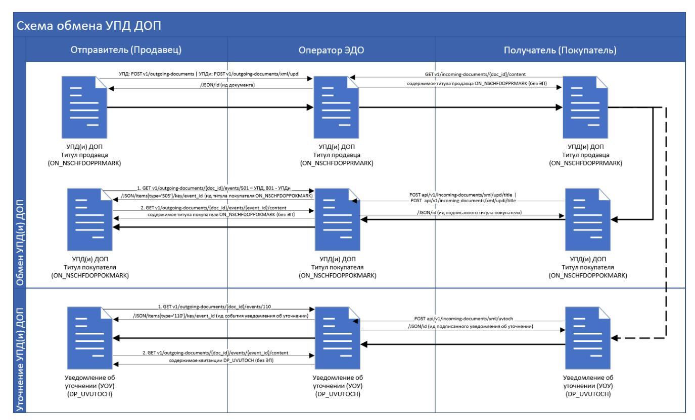
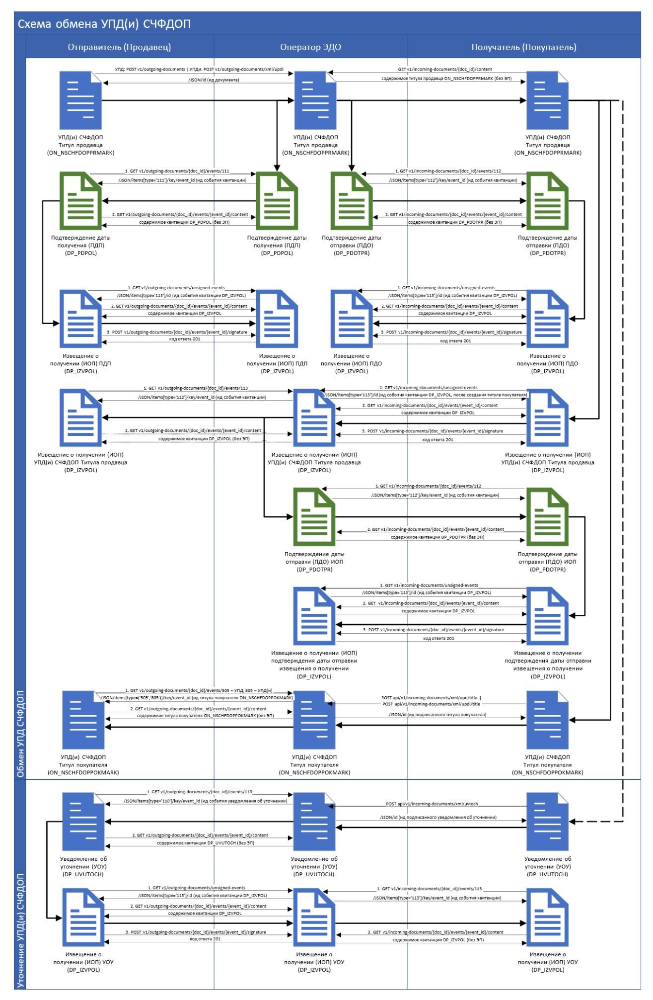
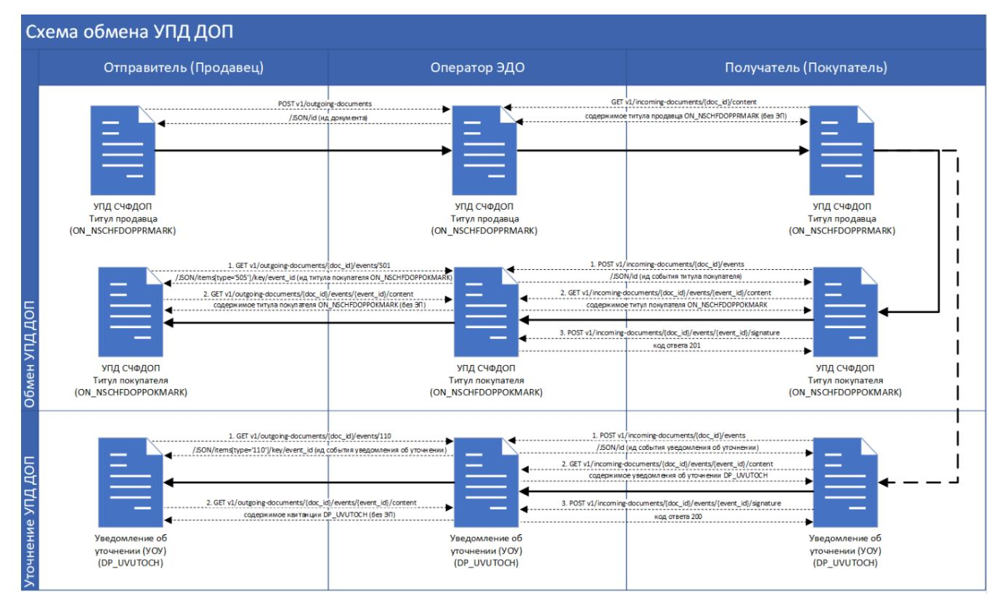
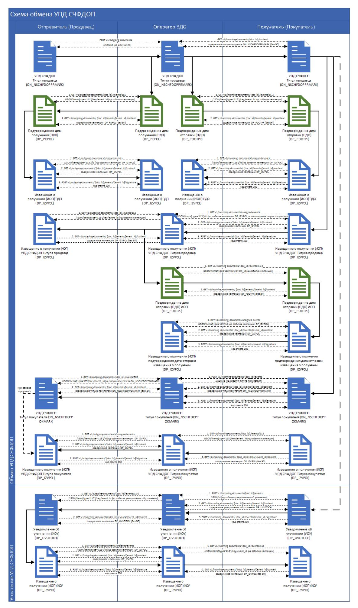

# Описание АРІ ЭДО Лайт

Версия 70.0

# **Содержание**

| 1. Стенды для интеграции с партнёрами<br>4                                            |    |
|---------------------------------------------------------------------------------------|----|
| 2. Аутентификация<br>4                                                                |    |
| 2.1. Запрос авторизации при единой аутентификации<br>4                                |    |
| 2.2. Получение ключа сессии при единой аутентификации<br>5                            |    |
| 3. Методы API для работы с документами и квитанциями 9                                |    |
| 3.1. Метод загрузки файла информации продавца УПД в формате XML<br>9                  |    |
| 3.2. Метод загрузки файла информации продавца УПДи в формате XML 13                   |    |
| 3.3. Метод загрузки информации продавца УКД согласно приказу 189 от 13 апреля 2016 г. |    |
| в формате XML<br>16                                                                   |    |
| 3.4. Метод загрузки информации продавца УКД/УКДи согласно приказу 736 от 12 октября   |    |
| 2020 г. в формате XML<br>19                                                           |    |
| 3.5. Получение содержимого XML документа 23                                           |    |
| 3.6. Подписание исходящего документа<br>24                                            |    |
| 3.7. Получение печатной формы УПД/УПДи/УКД 25                                         |    |
| 3.8. Получение ZIP архива с документооборотом УПД/УПДи/УКД 26                         |    |
| 3.9. Получение списка документов<br>27                                                |    |
| 3.10. Метод загрузки файла информации покупателя УПД / УПДи согласно приказу 820 от   |    |
| 19.12.2018 № ММВ-7-15/820@ в формате XML<br>33                                        |    |
| 3.11. Метод загрузки файла титула покупателя УПД / УПДи согласно приказу № ЕД-7-      |    |
| 26/970@ от 20 декабря 2023 г. в формате XML<br>38                                     |    |
| 3.12. Метод загрузки файла информации покупателя УКД согласно приказу 189 от 13       |    |
| апреля 2016 г. в формате XML 42                                                       |    |
| 3.13. Метод загрузки файла информации покупателя УКД/УКДи согласно приказу 736 от     |    |
| 12 октября 2020 г. в формате XML<br>46                                                |    |
| 3.14. Получение списка квитанций для подписания<br>50                                 |    |
| 3.15. Получение XML файла информации покупателя (УПД/УПДи/УКД) или квитанции          | 52 |
| 3.16. Подписание квитанций или файла информации покупателя (УПД/УПДи/УКД)<br>53       |    |
| 3.17. Создание уведомления об уточнении через загрузку файла XML<br>54                |    |
| 3.18. Запрос аннулирования документа через загрузку файла XML<br>55                   |    |
| 3.19. Приём аннулирования документа 58                                                |    |
| 3.20. Отклонение аннулирования документа через загрузку файла XML УвТоч<br>59         |    |
| 3.21. Метод получения JSON квитанции<br>63                                            |    |
| 3.22. Метод создания УПДи через XML 63                                                |    |
| 4. Создание универсальных сообщений<br>68                                             |    |
| 4.1. Создание универсального сообщения через XML к документу / титулу продавца 68     |    |
| 4.2. Создание универсального сообщения через XML к предложению об аннулировании /     |    |
| титулу покупателя 71                                                                  |    |
| 5. Метод получения данных об МЧД<br>76                                                |    |
| 6. Справочники<br>79                                                                  |    |
| 6.1. Справочник «Список поддерживаемых товарных групп» 79                             |    |
| 6.2. Справочник «Типы документов»<br>81                                               |    |
|                                                                                       |    |

| 6.3. Справочник «Статусы документов» 83                    |  |
|------------------------------------------------------------|--|
| 6.4. Справочник «Коды регионов»<br>87                      |  |
| 6.5. Справочник «Валюты»<br>90                             |  |
| 6.6. Справочник «Единицы измерения»<br>90                  |  |
| 6.7. Справочник «Типы квитанций»<br>91                     |  |
| 6.8. Справочник «Коды универсальных сообщений»<br>94       |  |
| 6.8.1. Извещение о получении<br>94                         |  |
| 6.8.2. Уведомление об уточнении<br>94                      |  |
| 6.8.3. Отказ в принятии<br>94                              |  |
| 7. Схемы обмена документов с методами API ЭДО Лайт<br>95   |  |
| Перечень сокращений, условных обозначений и терминов<br>99 |  |
| История изменений 102                                      |  |

# <span id="page-3-0"></span>1. Стенды для интеграции с партнёрами

Для интеграции с партнёрами используются стенды, представленные в таблице.

| End-point                       | Описание                    |  |
|---------------------------------|-----------------------------|--|
| https://edo.sandbox.crptech.ru/ | Интеграционный стенд ГИС МТ |  |
| https://edo-gismt.crpt.ru/      | Промышленный стенд ГИС МТ   |  |

# <span id="page-3-1"></span>2. Аутентификация

Авторизация в ЭДО доступна только участникам оборота товаров, зарегистрированным в Системе маркировки (ГИС МТ и «ИР Маркировки»).

## важно

Доступ к функциональности Системы маркировки осуществляется в соответствии с ролевой моделью. Информацию об ограничениях прав см. в «Памятке по ролевой модели доступа Системы маркировки»

Для использования методов API ЭДО Лайт необходимо получить токен аутентификации. Срок действия токена для Системы маркировки — 10 часов с момента получения.

Для получения токена аутентификации для Системы маркировки используются методы True API:

- «Запрос авторизации при единой аутентификации» (/auth/key);
- «Получение ключа сессии при единой аутентификации» (/auth/simpleSignIn).

Для обращения к True API используйте адреса, представленные ниже:

- https://markirovka.sandbox.crptech.ru/api/v3/true-api (базовый адрес демонстрационного контура);
- https://markirovka.crpt.ru/api/v3/true-api (базовый адрес промышленного контура).

#### <span id="page-3-2"></span>2.1. Запрос авторизации при единой аутентификации

Метод используется для получения UUID (идентификатора текущей аутентификации) и сгенерированных случайных данных, которые в дальнейшем подписываются участником оборота товаров и передаются в метод получения ключа сессии при единой аутентификации для дальнейшего получения токена по УКЭП:

1. Получение пары «uuid — data», где «uuid» — идентификатор текущей аутентификации, «data» — строка на подпись пользователю.

- 2. Отправка в Систему маркировки данных в том же виде, в котором данные были получены (пара «uuid data»), только теперь «data» это подписанная УКЭП строка.
- 3. Сервер отвечает на запрос сообщением с кодом 200 (ОК), либо сообщением об ошибке.

**URL:** /auth/key

Метод: GET

## Пример строки запроса:

```
curl -X GET "<url стенда v3>/auth/key"
-H "accept: application/json"
```

#### Параметры ответа:

| Параметр | Тип    | Обяз. | Описание                                                  |
|----------|--------|-------|-----------------------------------------------------------|
| uuid     | string | +     | Уникальный идентификатор сгенерированных случайных данных |
| data     | string | +     | Случайная строка данных                                   |

## Пример ответа:

```
{
   "uuid":"a63ff582-b723-4da7-958b-453da27a6c62",
   "data":"GNUFBAZBMPIUUMLXNMIOGSHTGFXZMT"
}
```

## <span id="page-4-0"></span>2.2. Получение ключа сессии при единой аутентификации

URL: /auth/simpleSignIn

Метод: POST

## Пример строки запроса:

```
curl -X POST "<url стенда v3>/auth/simpleSignIn"
-H "accept: application/json"
-H "Content-Type: application/json"
```

#### Пример тела запроса:

```
{
```

```
  "uuid":"string",
  "data":"string",
  "inn":"string"
}
```

## **Параметры тела запроса:**

| Параметр | Тип    | Обяз. | Описание                                                                                                                                        | Комментарий                                                                                                                                                                                                                                                                                                                                                |
|----------|--------|-------|-------------------------------------------------------------------------------------------------------------------------------------------------|------------------------------------------------------------------------------------------------------------------------------------------------------------------------------------------------------------------------------------------------------------------------------------------------------------------------------------------------------------|
| uuid     | string | +     | Уникальный<br>идентификатор<br>подписанных<br>случайных данных                                                                                  |                                                                                                                                                                                                                                                                                                                                                            |
| data     | string | +     | Подписанные УКЭП<br>зарегистрированного<br>участника оборота<br>товаров случайные<br>данные в base64<br>(присоединённая<br>электронная подпись) |                                                                                                                                                                                                                                                                                                                                                            |
| inn      | string | -     | ИНН участника<br>оборота товаров, под<br>которым требуется<br>авторизация для<br>физического лица по<br>машиночитаемой<br>доверенности          | Параметр заполняется для<br>получения<br>аутентификационного токена на<br>конкретную организацию /<br>индивидуального<br>предпринимателя и только в<br>случае, если пользователь,<br>выполняющий запрос, имеет<br>активные машиночитаемые<br>доверенности от разных<br>организаций / индивидуальных<br>предпринимателей.<br>Длина значения: 10 или 12 цифр |

| Параметр | Тип    | Обяз. | Описание                                                                                                                      | Комментарий |
|----------|--------|-------|-------------------------------------------------------------------------------------------------------------------------------|-------------|
| details  | string | -     | Реквизиты действующего аттестата соответствия объекта информатизации, выданного органом по аттестации объектов информатизации |             |

## Пример ответа:

1. В случае успеха:

```
{
    "token":"eyJhbGciOiJIUzI1NiIsInR5cCI6IkpXVCJ9.e.....mk6qe0lB12w9zEs"
}
```

- 2. В случае ошибки:
  - 2.1. Код 400, если не указан параметр «uuid»:

```
{
    "error_message":"В запросе отсутствует идентификатор авторизации (UUID)"
}
```

2.2. Код 400, если не указан параметр «data»:

```
{
 "error_message":"В запросе отсутствует параметр data"
}
```

2.3. Код 400, если в параметре «inn» указано значение не равное 10 или 12 цифрам:

```
{
    "error_message":"В параметре inn должен быть передан ИНН организации, под
которой планируется авторизация от МЧД"
}
```

2.4. Код 400, если не передано тело запроса:

```
{
 "error_message":"Тело запроса не может быть пустым"
}
```

2.5. Код 400, если в параметре «uuid» передано значение, не найденное в хранилище:

```
{
    "error_message":"UUID не найден в хранилище ключей. UUID = a33ff333-b333-3da3-
333b-333da33a3c33"
}
```

2.6. Код 400, если «data» не подписан УКЭП или содержит не те данные:

```
{
    "error_message":"Ошибка при проверке подписи"
}
```

2.7. Код 403, если «data» подписан УКЭП сотрудника, который не является добавленным пользователем организации, под которой происходит попытка авторизации:

```
{
 "error_message":"Отсутствует доступ к ресурсу"
}
```

## Параметры ответа:

| Параметр     | Тип    | Обяз. | Описание                     | Комментарий                                       |
|--------------|--------|-------|------------------------------|---------------------------------------------------|
| token        | string | -     | Аутентификацион<br>ный токен | Параметр указывается в случае успешного ответа    |
| code         | string | -     | Код ошибки                   | Параметр указывается в случае не успешного ответа |
| error_messag | string | -     | Сообщение об ошибке          |                                                   |
| description  | string | -     | Описание ошибки              |                                                   |

«token» — токен аутентификации, полученный в результате работы метода получения токена аутентификации. Срок действия полученного токена не более 10 часов с момента получения.

# <span id="page-8-0"></span>**3. Методы API для работы с документами и квитанциями**

При создании/редактировании документа или квитанции есть одно общее требование для полей с датой и временем: поля с датами и временем передаются как integer в формате timestamp, например, если установлено 28.01.2020, то должно передаваться 1580169600, что соответствует 28.01.2020 00:00:00 GMT.

ВНИМАНИЕ: при работе через API ЭДО Лайт действует ограничение на 1000 исходящих документов в год.

# <span id="page-8-1"></span>**3.1. Метод загрузки файла информации продавца УПД в формате XML**

Метод предназначен для загрузки файла информации продавца (титула продавца) УПД по формату Приказа ФНС России № ЕД-7-26/970@ от 19.12.2023.

При выполнении данного метода без параметра «signature» («Откреплённая УКЭП XML документа в формате base64») загруженный XML будет находиться в статусе «Черновик». При выполнении данного метода с параметром «signature» («Откреплённая УКЭП XML документа в формате base64») загруженный документ будет находиться в статусе «Отправлен».

> В зависимости от идентификатора ЭДО получателя документа (в \* .xml значение «СвУчДокОбор.ИдПол»):

## **ПРИМЕЧАНИЕ**

- документ будет доставлен получателю в «ЭДО Лайт» или отправлен в роуминг;
- система проверит статус связи между отправителем и получателем в случае отправки документа в роуминг

**URL:** /api/v1/outgoing-documents

**Метод:** POST

## **Параметры заголовка запроса:**

| Параметр      | Значение            |
|---------------|---------------------|
| Authorization | <token></token>     |
| Content-Type  | multipart/form-data |

| Параметр | Значение                                                                                                                                                            |
|----------|---------------------------------------------------------------------------------------------------------------------------------------------------------------------|
| Headers  | send_mchd_file («Способ передачи сведений об МЧД»). Параметр необязательный с типом boolean. Возможные значения:                                                    |
|          | true — будет передана МЧД в виде отдельного файла и подписи к нему, если данная МЧД зарегистрирована в ГИС МТ; false — сведения об МЧД будут переданы в метаданных. |
|          | Если параметр не заполнен, то значение по умолчанию — false                                                                                                         |

При заполненном параметре «send\_mchd\_file» («Способ передачи сведений об МЧД») система проверяет наличие информационных полей (ИнфПолФХЖ1) с наименованием "МЧД" в ХМL, затем берёт значение МЧД и передаёт указанную МЧД в виде файла в пакете с УПД и подписью.

#### ПРИМЕЧАНИЕ

Пример заполнения информационных полей для передачи сведений об МЧД:

```
<ИнфПолФХЖ1>
<TекстИнф Идентиф="МЧД" Значен="111f11d1-1111-111a-1ff1-
fa11e11afc11"/>
<TекстИнф Идентиф="Сведения об информационной системе"
Значен="https://m4d.nalog.gov.ru/"/>
</ИнфПолФХЖ1>
```

## Параметры тела запроса:

| Параметр | Тип  | Обяз. | Описание               | Комментарий                                                                                                                      |
|----------|------|-------|------------------------|----------------------------------------------------------------------------------------------------------------------------------|
| content  | file | +     | Ссылка на XML документ | Пример ссылки: content=@/C:/Users/ON_NSCHFDOPPR_2 LT-50_2LT-354_20200218_cc716325-e5b9- 43b8-813d- 8e70e7912272_0_1_0_0_0_00.xml |
|          |      |       |                        | Данный метод не поддерживает загрузку УПД (ON_NSCHFDOPPRPROS) с признаком прослеживаемости (PROS)                                |

| Параметр  | Тип    | Обяз. | Описание                                                  | Комментарий |
|-----------|--------|-------|-----------------------------------------------------------|-------------|
| signature | string | -     | Откреплённая<br>УКЭП XML<br>документа в<br>формате base64 |             |

## **Пример c URL запроса:**

```
 curl --location --request POST '<URL стенда>/api/v1/outgoing-documents'
--header 'authorization: Bearer <Токен>'
--header 'content-type: multipart/form-data; boundary=----
WebKitFormBoundary7MA4YWxkTrZu0gW'
--form 'content=@/C:/Users//Desktop/ON.xml'
```

## **Параметры ответа:**

| Тип    | Обяз. | Описание         | Комментарий                            |
|--------|-------|------------------|----------------------------------------|
| string | +     | Уникальный       | По данному идентификатору можно        |
|        |       | идентификатор    | производить с документом необходимые   |
|        |       | события создания | действия (редактирование, подписание и |
|        |       | файла            | т. д.). Идентификатор возвращается при |
|        |       | информации       | успешном создании нового файла и при   |
|        |       | продавца         | повторной загрузке файла, если файл с  |
|        |       |                  | таким наименование уже существует в    |
|        |       |                  | системе (вернётся идентификатор ранее  |
|        |       |                  | загруженного файла)                    |
|        |       |                  |                                        |

## **Пример ответа:**

```
{
  "id": "00000000-0000-0000-0000-000000000000" 
}
```

## **Список возможных ошибок:**

| Код ошибки | Сообщение об ошибке                                   | Описание ошибки                 |
|------------|-------------------------------------------------------|---------------------------------|
| 400        | Отсутствует заголовок запроса:<br>multipart/form-data | В запросе отсутствует заголовок |

| Код ошибки | Сообщение об ошибке                                                                         | Описание ошибки                                                                                                              |
|------------|---------------------------------------------------------------------------------------------|------------------------------------------------------------------------------------------------------------------------------|
| 400        | Отсутствует или неверный формат<br>заголовка запроса: multipart/form-data                   | Отсутствует или имеет неверный<br>формат параметр "Content-Type"<br>заголовка запроса                                        |
| 400        | В теле запроса отсутствует файл                                                             | В теле запроса в параметре "content"<br>отсутствует ссылка на документ в<br>формате XML                                      |
| 400        | Отсутствует form-data key: content                                                          | Отсутствует параметр "content"                                                                                               |
| 400        | Неверный тип загружаемого файла:<br>Content-Type: ([тип загружаемого<br>контента])          | Загружаемый файл имеет неверный<br>тип: content-Type                                                                         |
| 400        | Неверный тип документа<br>загружаемого xml файла                                            | Загружается неверный тип файла в<br>формате XML (например: УПДи<br>вместо УПД)                                               |
| 400        | Неверный формат параметра<br>\"product_group\"                                              | Значение параметра "product_group"<br>невозможно привести к типу integer                                                     |
| 400        | Неверный формат параметра<br>"signature" + "value" (значение)                               | Параметр "signature" имеет неверный<br>формат                                                                                |
| 400        | Неверный формат параметра "folder"                                                          | Значение параметра "folder"<br>невозможно привести к типу integer                                                            |
| 400        | Отсутствует заголовок запроса<br>\"Content-Type\" загружаемого файла                        | Отсутствует заголовок запроса<br>"Content-Type" загружаемого файла                                                           |
| 400        | Нет прав на подписание документа                                                            | Не пройдена проверка подписи                                                                                                 |
| 400        | Невозможно создать<br>документ.<наименование<br>организации> не зарегистрирован в<br>ГИС МТ | Возвращается при попытке<br>подписания и отправки документа<br>участнику оборота товаров, не<br>зарегистрированному в ГИС МТ |
| 422        | В ЭДО лайт нельзя создавать<br>документы, содержащие сведения о<br>прослеживаемом товаре    | Загружен УПД с признаком<br>прослеживаемости (PROS)                                                                          |
| 422        | Неверно заполнены сведения об МЧД<br>в <тег с ошибкой из XML>                               |                                                                                                                              |
| 500        | Описание ошибки                                                                             | Возникновение иных ошибок в<br>случае ошибки 500                                                                             |

Форматы и XSD-схема размещены на сайте ФНС по ссылке: [https://www.nalog.gov.ru/rn77/](https://www.nalog.gov.ru/rn77/about_fts/docs/8335278/) [about\\_fts/docs/8335278/.](https://www.nalog.gov.ru/rn77/about_fts/docs/8335278/)

# <span id="page-12-0"></span>**3.2. Метод загрузки файла информации продавца УПДи в формате XML**

Метод предназначен для загрузки файла информации продавца (титула продавца) УПДи по формату Приказа ФНС России № ЕД-7-26/970@ от 19.12.2023.

При выполнении данного метода без параметра «signature» («Откреплённая УКЭП XML документа в формате base64») загружаемый документ в формате XML будет находиться в статусе «Черновик». При выполнении данного метода с параметром «signature» («Откреплённая УКЭП XML документа в формате base64») загруженный документ будет находиться в статусе «Отправлен».

**URL:** /api/v1/outgoing-documents/xml/updi

**Метод:** POST

## **Параметры заголовка запроса:**

| Параметр      | Значение                                                                                                                                                                                                                                          |  |
|---------------|---------------------------------------------------------------------------------------------------------------------------------------------------------------------------------------------------------------------------------------------------|--|
| Authorization | <token></token>                                                                                                                                                                                                                                   |  |
| Content-Type  | multipart/form-data                                                                                                                                                                                                                               |  |
| Headers       | send_mchd_file («Способ передачи сведений об МЧД»). Параметр<br>необязательный с типом boolean. Возможные значения:                                                                                                                               |  |
|               | true<br>— будет передана МЧД в виде отдельного файла и подписи к нему, если<br>данная МЧД зарегистрирована в ГИС МТ;<br>false<br>— сведения об МЧД будут переданы в метаданных.<br>Если параметр не заполнен, то значение по умолчанию —<br>false |  |

## **ПРИМЕЧАНИЕ**

При заполненном параметре «send\_mchd\_file» («Способ передачи сведений об МЧД») система проверяет наличие информационных полей (ИнфПолФХЖ1) с наименованием "МЧД" в XML, затем берёт значение МЧД и передаёт указанную МЧД в виде файла в пакете с УПД и подписью.

Пример заполнения информационных полей для передачи сведений об МЧД:

```
<ИнфПолФХЖ1>
<ТекстИнф Идентиф="МЧД" Значен="111f11d1-1111-111a-1ff1-
fa11e11afc11"/>
<ТекстИнф Идентиф="Сведения об информационной системе"
Значен="https://m4d.nalog.gov.ru/"/>
</ИнфПолФХЖ1>
```

## **Параметры тела запроса:**

| Параметр  | Тип    | Обяз. | Описание                                                  | Комментарий                                                                                                                                                                                                                                             |
|-----------|--------|-------|-----------------------------------------------------------|---------------------------------------------------------------------------------------------------------------------------------------------------------------------------------------------------------------------------------------------------------|
| content   | file   | +     | Ссылка на XML<br>документ                                 | Пример ссылки:<br>content=@/C:/Users/ON_NSCHFDOPPR_2<br>LT-50_2LT-354_20200218_cc716325-e5b9-<br>43b8-813d<br>8e70e7912272_0_1_0_0_0_00.xml<br>Данный метод не поддерживает загрузку<br>УПДи (ON_NSCHFDOPPRPROS) с<br>признаком прослеживаемости (PROS) |
| signature | string | -     | Откреплённая<br>УКЭП XML<br>документа в<br>формате base64 |                                                                                                                                                                                                                                                         |
| parent_id | string | -     | Идентификатор<br>родительского<br>документа               |                                                                                                                                                                                                                                                         |

## **Пример c URL запроса:**

```
  curl --location --request POST '<URL стенда>/api/v1/outgoing-documents/xml/updi' \
--header 'Content-Type: multipart/form-data' \
--header 'Authorization: Bearer <ТОКЕН>' \
--form 'content=@/C:/Users/a.nemnyugin/Downloads/ON_NSCHFDOPPR_1LT-10000000138_1LT-
10000000137_20200715_e1f1e961-b7a0-494f-9682-4f6528e26a39_0_1_0_0_0_00.xml' \
--form 'parent_id=e1f1e961-b7a0-494f-9682-4f6528e26a39'
```

## **Параметры ответа:**

| Параметр | Тип    | Обяз. | Описание                                                            | Комментарий                                                                                                                                                                                                                                                                                                                 |
|----------|--------|-------|---------------------------------------------------------------------|-----------------------------------------------------------------------------------------------------------------------------------------------------------------------------------------------------------------------------------------------------------------------------------------------------------------------------|
| id       | string | +     | Уникальный идентификатор события создания файла информации продавца | По данному идентификатору можно производить с документом необходимые действия (редактирование, подписание и т. д.). Идентификатор возвращается при успешном создании нового файла и при повторной загрузке файла, если файл с таким наименование уже существует в системе (вернётся идентификатор ранее загруженного файла) |

# Пример ответа:

```
{
    "id": "00000000-0000-0000-000000000000"
}
```

## Список возможных ошибок:

| Код ошибки | Сообщение об ошибке                                                                | Описание ошибки                                                                   |
|------------|------------------------------------------------------------------------------------|-----------------------------------------------------------------------------------|
| 400        | Отсутствует заголовок запроса: multipart/form-data                                 | В запросе отсутствует заголовок                                                   |
| 400        | Отсутствует или неверный формат заголовка запроса: multipart/form-data             | Отсутствует или имеет неверный формат параметр "Content-Type" заголовка запроса   |
| 400        | В теле запроса отсутствует файл                                                    | В теле запроса в параметре "content" отсутствует ссылка на документ в формате XML |
| 400        | Отсутствует form-data key: content                                                 | Отсутствует параметр "content"                                                    |
| 400        | Неверный тип загружаемого файла:<br>Content-Type: ([тип загружаемого<br>контента]) | Загружаемый файл имеет неверный тип: content-Type                                 |
| 400        | Неверный тип документа<br>загружаемого xml файла                                   | Загружается неверный тип файла в формате XML (например: УПДи вместо УПД)          |
| 400        | Неверный формат параметра<br>"product_group"                                       | Значение параметра "product_group" невозможно привести к типу integer             |

| Код ошибки | Сообщение об ошибке                                                                                                                                                                                  | Описание ошибки                                                                                                                                    |
|------------|------------------------------------------------------------------------------------------------------------------------------------------------------------------------------------------------------|----------------------------------------------------------------------------------------------------------------------------------------------------|
| 400        | Неверный формат параметра<br>"signature" + "value" (значение)                                                                                                                                        | Параметр "signature" имеет неверный<br>формат                                                                                                      |
| 400        | Неверный формат параметра "folder"                                                                                                                                                                   | Значение параметра "folder"<br>невозможно привести к типу integer                                                                                  |
| 400        | Отсутствует заголовок запроса<br>"Content-Type" загружаемого файла                                                                                                                                   | Отсутствует заголовок запроса<br>"Content-Type" загружаемого файла                                                                                 |
| 400        | Нет прав на подписание документа                                                                                                                                                                     | Не пройдена проверка подписи                                                                                                                       |
| 400        | Неверный формат параметра запроса<br>"parent_id"                                                                                                                                                     | При загрузке УПДи указан неверный<br>формат строки идентификатора<br>родительского документа                                                       |
| 422        | В ЭДО лайт нельзя создавать<br>документы, содержащие сведения о<br>прослеживаемом товаре                                                                                                             | Загружен УПДи с признаком<br>прослеживаемости (PROS)                                                                                               |
| 422        | Идентификатор ЭДО получателя<br>документа отличается от<br>Идентификатора получателя,<br>указанного в корректируемом<br>документе. Измените ИдЭДО<br>получателя на корректный и<br>повторите попытку | Значение Идентификатор ЭДО<br>получателя в имени файла и в<br>элементе <ИдПол> загружаемого<br>документа и родительского<br>документа не совпадают |
| 422        | Неверно заполнены сведения об МЧД<br>в <тег с ошибкой из XML>                                                                                                                                        |                                                                                                                                                    |
| 500        | Описание ошибки                                                                                                                                                                                      | Возникновение иных ошибок в<br>случае ошибки 500                                                                                                   |

# <span id="page-15-0"></span>**3.3. Метод загрузки информации продавца УКД согласно приказу 189 от 13 апреля 2016 г. в формате XML**

Формат УКД регламентируется Приказом ФНС от 13 апреля 2016 г. № ММВ-7-15/189 – [nalog.ru](https://www.nalog.ru/rn77/about_fts/docs/6076582/).

При выполнении данного метода без параметра «signature» («Откреплённая УКЭП XML документа в формате base64») загруженный документ в формате XML будет находиться в статусе «Черновик». При выполнении данного метода с параметром «signature» («Откреплённая УКЭП XML документа в формате base64») загруженный документ будет находиться в статусе «Отправлен».

**URL:** /api/v1/outgoing-documents/xml/ukd

**Метод:** POST

## **Параметры заголовка запроса:**

| Параметр      | Значение            |
|---------------|---------------------|
| Authorization | <token></token>     |
| Content-Type  | multipart/form-data |

## **Параметры тела запроса:**

| Параметр  | Тип    | Обяз. | Описание                                                  | Комментарий                                                                                                                       |
|-----------|--------|-------|-----------------------------------------------------------|-----------------------------------------------------------------------------------------------------------------------------------|
| content   | file   | +     | Ссылка на XML<br>документ                                 | Пример ссылки:<br>content=@/C:/Users/ON_NSCHFDOPPRM<br>ARK_2LT-50_2LT<br>354_20200218_cc716325-e5b9-43b8-813d<br>8e70e7912272.xml |
| signature | string | -     | Откреплённая<br>УКЭП XML<br>документа в<br>формате base64 |                                                                                                                                   |
| parent_id | string | -     | Идентификатор<br>родительского<br>документа               |                                                                                                                                   |

## **Пример c URL запроса:**

```
 curl --location --request POST '<URL стенда>/api/v1/outgoing-documents/xml/ukd' \
--header 'Content-Type: multipart/form-data' \
--header 'Authorization: Bearer <ТОКЕН>' \
--form 'content=@/C:/Users/a.nemnyugin/Downloads/ON_KORSCHFDOPPR_2LT-10000000138_2LT-
10000000137_20200727_8889a57c-987a-47b2-91cc-ba3aee5ddcd6.xml' \
--form 'parent_id=f60b418c-628e-4dd9-9812-22847f3c2241' \
```

## **Параметры ответа:**

| Параметр | Тип    | Обяз. | Описание                                                            | Комментарий                                                                                                                                                                                                                                                                                                                 |
|----------|--------|-------|---------------------------------------------------------------------|-----------------------------------------------------------------------------------------------------------------------------------------------------------------------------------------------------------------------------------------------------------------------------------------------------------------------------|
| id       | string | +     | Уникальный идентификатор события создания файла информации продавца | По данному идентификатору можно производить с документом необходимые действия (редактирование, подписание и т. д.). Идентификатор возвращается при успешном создании нового файла и при повторной загрузке файла, если файл с таким наименование уже существует в системе (вернётся идентификатор ранее загруженного файла) |

# Пример ответа:

```
{
    "id": "00000000-0000-0000-000000000000"
}
```

## Список возможных ошибок:

| Код ошибки | Сообщение об ошибке                                                                | Описание ошибки                                                                   |
|------------|------------------------------------------------------------------------------------|-----------------------------------------------------------------------------------|
| 400        | Отсутствует заголовок запроса: multipart/form-data                                 | В запросе отсутствует заголовок                                                   |
| 400        | Отсутствует или неверный формат заголовка запроса: multipart/form-data             | Отсутствует или имеет неверный формат параметр "Content-Type" заголовка запроса   |
| 400        | В теле запроса отсутствует файл                                                    | В теле запроса в параметре "content" отсутствует ссылка на документ в формате XML |
| 400        | Отсутствует form-data key: content                                                 | Отсутствует параметр "content"                                                    |
| 400        | Неверный тип загружаемого файла:<br>Content-Type: ([тип загружаемого<br>контента]) | Загружаемый файл имеет неверный тип: content-Type                                 |
| 400        | Неверный тип документа<br>загружаемого xml файла                                   | Загружается неверный тип файла в формате XML (например: УПДи вместо УПД)          |
| 400        | Неверный формат параметра<br>"product_group"                                       | Значение параметра "product_group" невозможно привести к типу integer             |

| Код ошибки | Сообщение об ошибке                                                | Описание ошибки                                                                              |
|------------|--------------------------------------------------------------------|----------------------------------------------------------------------------------------------|
| 400        | Неверный формат параметра<br>"signature" + "value" (значение)      | Параметр "signature" имеет неверный<br>формат                                                |
| 400        | Неверный формат параметра "folder"                                 | Значение параметра "folder"<br>невозможно привести к типу integer                            |
| 400        | Отсутствует заголовок запроса<br>"Content-Type" загружаемого файла | Отсутствует заголовок запроса<br>"Content-Type" загружаемого файла                           |
| 400        | Нет прав на подписание документа                                   | Не пройдена проверка подписи                                                                 |
| 400        | Неверный формат параметра запроса<br>"parent_id"                   | При загрузке УПДи указан неверный<br>формат строки идентификатора<br>родительского документа |
| 500        | Описание ошибки                                                    | Возникновение иных ошибок в<br>случае ошибки 500                                             |

# <span id="page-18-0"></span>**3.4. Метод загрузки информации продавца УКД/УКДи согласно приказу 736 от 12 октября 2020 г. в формате XML**

Формат УКД регламентируется Приказом ФНС от 12 октября 2020 г. № ЕД-7-26/736@ – [nalog.ru.](https://www.nalog.ru/rn77/about_fts/docs/10223010/)

При выполнении данного метода без параметра «signature» («Откреплённая УКЭП XML документа в формате base64») загруженный документ в формате XML будет находиться в статусе «Черновик». При выполнении данного метода с параметром «signature» («Откреплённая УКЭП XML документа в формате base64») загруженный документ будет находиться в статусе «Отправлен».

## **URL:**

| Путь                                   | Описание |
|----------------------------------------|----------|
| api/v1/outgoing-documents/xml/ukd/736  | для УКД  |
| api/v1/outgoing-documents/xml/ukdi/736 | для УКДи |

**Метод:** POST

## **Параметры заголовка запроса:**

| Параметр      | Значение        |
|---------------|-----------------|
| Authorization | <token></token> |

| Параметр     | Значение                                                                                                                                                                                           |  |
|--------------|----------------------------------------------------------------------------------------------------------------------------------------------------------------------------------------------------|--|
| Content-Type | application/json<br>— для интеграции с 1С;<br>multipart/form-data<br>— в остальных случаях                                                                                                         |  |
| Headers      | send_mchd_file («Способ передачи сведений об МЧД»). Параметр<br>необязательный с типом boolean. Возможные значения:<br>true<br>— будет передана МЧД в виде отдельного файла и подписи к нему, если |  |
|              | данная МЧД зарегистрирована в ГИС МТ;<br>false<br>— сведения об МЧД будут переданы в метаданных.                                                                                                   |  |
|              | Если параметр не заполнен, то значение по умолчанию —<br>false                                                                                                                                     |  |

При заполненном параметре «send\_mchd\_file» («Способ передачи сведений об МЧД») система проверяет наличие информационных полей (ИнфПолФХЖ1) с наименованием "МЧД" в XML, затем берёт значение МЧД и передаёт указанную МЧД в виде файла в пакете с УПД и подписью.

## **ПРИМЕЧАНИЕ**

Пример заполнения информационных полей для передачи сведений об МЧД:

```
<ИнфПолФХЖ1>
<ТекстИнф Идентиф="МЧД" Значен="111f11d1-1111-111a-1ff1-
fa11e11afc11"/>
<ТекстИнф Идентиф="Сведения об информационной системе"
Значен="https://m4d.nalog.gov.ru/"/>
</ИнфПолФХЖ1>
```

## **Параметры тела запроса:**

| Параметр     | Тип     | Обяз. | Описание                                                                                                                      | Комментарий                                           |
|--------------|---------|-------|-------------------------------------------------------------------------------------------------------------------------------|-------------------------------------------------------|
| content      | file    | +     | Файл документа. Данный метод не поддерживает загрузку УКД/УКД(и) (ON_NKORSCHF DOPPRPROS) с признаком прослеживаемост и (PROS) |                                                       |
| parent_id    | string  | +     | Идентификатор родительского документа                                                                                         |                                                       |
| signature    | string  | -     | Откреплённая<br>УКЭП XML<br>документа в<br>формате base64                                                                     |                                                       |
| product_grou | integer | -     | Код товарной группы (целое число)                                                                                             | см. Справочник «Список поддерживаемых товарных групп» |

## Пример с URL запроса:

```
curl --location --request POST '<URL стенда>/api/v1/outgoing-documents/xml/ukd/736' \
--header 'Content-Type: application/multipart/form-data' \
--header 'Authorization: Bearer <TOKEH>' \
--form 'content=@"<путь к файлу в формате XML>"' \
--form 'parent_id="aaaaaaaa-bbbb-cccc-dddd-eeeeeeeeee"'
```

## Параметры ответа:

| Параметр | Тип    | Обяз. | Описание                                                            | Комментарий                                                                                                                                                                                                                                                                                                                 |
|----------|--------|-------|---------------------------------------------------------------------|-----------------------------------------------------------------------------------------------------------------------------------------------------------------------------------------------------------------------------------------------------------------------------------------------------------------------------|
| id       | string | +     | Уникальный идентификатор события создания файла информации продавца | По данному идентификатору можно производить с документом необходимые действия (редактирование, подписание и т. д.). Идентификатор возвращается при успешном создании нового файла и при повторной загрузке файла, если файл с таким наименование уже существует в системе (вернётся идентификатор ранее загруженного файла) |

# Пример ответа:

```
{
    "id":"00000000-0000-0000-000000000000"
}
```

## Список возможных ошибок:

| Код ошибки | Сообщение об ошибке                                                                | Описание ошибки                                                                   |
|------------|------------------------------------------------------------------------------------|-----------------------------------------------------------------------------------|
| 400        | Отсутствует заголовок запроса: multipart/form-data                                 | В запросе отсутствует заголовок "Content-Type"                                    |
| 400        | Отсутствует или неверный формат заголовка запроса: multipart/form-data             | Отсутствует или имеет неверный формат параметр "Content-Type" заголовка запроса   |
| 400        | В теле запроса отсутствует файл                                                    | В теле запроса в параметре "content" отсутствует ссылка на документ в формате XML |
| 400        | Отсутствует form-data key: content                                                 | Отсутствует параметр "content"                                                    |
| 400        | Неверный тип загружаемого файла:<br>Content-Type: ([тип загружаемого<br>контента]) | Загружаемый файл имеет неверный тип "Content-Type"                                |
| 400        | Неверный тип документа<br>загружаемого xml файла                                   | Загружается неверный тип файла в формате XML (например: УКДи вместо УКД)          |
| 400        | Неверный формат параметра<br>"product_group"                                       | Значение параметра "product_group" невозможно привести к типу integer             |

| Код ошибки | Сообщение об ошибке                                                                                                                                                                                  | Описание ошибки                                                                                                                                    |  |
|------------|------------------------------------------------------------------------------------------------------------------------------------------------------------------------------------------------------|----------------------------------------------------------------------------------------------------------------------------------------------------|--|
| 400        | Неверный формат параметра<br>"signature" + "value" (значение)                                                                                                                                        | Параметр "signature" имеет неверный<br>формат                                                                                                      |  |
| 400        | Отсутствует заголовок запроса<br>"Content-Type" загружаемого файла                                                                                                                                   | Отсутствует заголовок запроса<br>"Content-Type" загружаемого файла                                                                                 |  |
| 400        | Нет прав на подписание документа                                                                                                                                                                     | Не пройдена проверка подписи                                                                                                                       |  |
| 400        | Неверный формат параметра запроса<br>"parent_id"                                                                                                                                                     | При загрузке УКДи указан неверный<br>формат строки идентификатора<br>родительского документа                                                       |  |
| 422        | В ЭДО лайт нельзя создавать<br>документы, содержащие сведения о<br>прослеживаемом товаре                                                                                                             | Загружен УКД/УКД(и) с признаком<br>прослеживаемости (PROS)                                                                                         |  |
| 422        | Идентификатор ЭДО получателя<br>документа отличается от<br>Идентификатора получателя,<br>указанного в корректируемом<br>документе. Измените ИдЭДО<br>получателя на корректный и<br>повторите попытку | Значение Идентификатор ЭДО<br>получателя в имени файла и в<br>элементе <ИдПол> загружаемого<br>документа и родительского<br>документа не совпадают |  |
| 422        | Неверно заполнены сведения об МЧД<br>в <тег с ошибкой из XML>                                                                                                                                        |                                                                                                                                                    |  |
| 500        |                                                                                                                                                                                                      | Сервис недоступен                                                                                                                                  |  |

# <span id="page-22-0"></span>**3.5. Получение содержимого XML документа**

## **URL:**

| Путь                                        | Описание                 |
|---------------------------------------------|--------------------------|
| /api/v1/outgoing-documents/{doc_id}/content | Для исходящих документов |
| /api/v1/incoming-documents/{doc_id}/content | Для входящих документов  |

Вызов метода /api/v1/incoming-documents/{doc\_id}/content автоматически создаёт неподписанную квитанцию «Извещение о получении УПД» (DP\_IZVPOL).

**Метод:** GET

## **Параметры запроса:**

| Параметр | Тип     | Обяз. | Описание                   | Комментарий |
|----------|---------|-------|----------------------------|-------------|
| doc_id   | integer | +     | Идентификатор<br>документа |             |

**Параметры заголовка запроса:** Authorization: <token>

## **Пример запроса:**

```
curl --location --request GET
'<URL стенда>/api/v1/incoming-documents/a034cad4-73ae-45da-ba13-c7980bea5ba3/content'
--header 'Authorization: Bearer <ТОКЕН>'
```

В ответе возвращается содержимое документа в формате \* .xml.

# <span id="page-23-0"></span>**3.6. Подписание исходящего документа**

Метод используется для добавления электронной откреплённой подписи к черновику файл информации продавца (УПД/УПДи/УКД/УКДи). В результате выполнения метода к документу добавляется откреплённая подпись, после чего документ отправляется получателю.

## **ПРИМЕЧАНИЕ**

При попытке подписания и отправки документа участнику оборота товаров, не зарегистрированному в ГИС МТ, возвращается ошибка с кодом «400» («Невозможно создать документ.<наименование организации> не зарегистрирован в ГИС МТ»)

**URL:** /api/v1/outgoing-documents/{doc\_id}/signature

**Метод:** POST

## **Параметры запроса:**

| Параметр | Тип     | Обяз. | Описание      | Комментарий |
|----------|---------|-------|---------------|-------------|
| doc_id   | integer | +     | Идентификатор |             |
|          |         |       | документа     |             |

## **Параметры заголовка запроса:**

| Параметр         | Значение        |
|------------------|-----------------|
| Authorization    | <token></token> |
| Content-encoding | base64          |

| Параметр     | Значение   |
|--------------|------------|
| Content-type | text/plain |

**Параметры тела запроса:** Откреплённая подпись под документом в base64, передается строкой в теле запроса.

## **Пример запроса:**

```
curl --location --request POST
'<URL стенда>/api/v1/outgoing-documents/8c6000fc-a18e-4711-88b7-
11b3e16e6e2c/signature'
--header 'content-encoding: base64' \
--header 'authorization: <Токен>'
--header 'content-type: text/plain' \
--data-raw
'MIIPkQYJKoZIhvcNAQcCoIIPgjCCD34CAQExDjAMBggqhQMHAQECAwUAMAsGCSqG
SIb3DQEHAaCCCRUwggkRMIIIvqADAgECAhEBr1uLAFartopGqtxJllj2fjAKBggq
hQMHAQEDAjCCAVsxIDAeBgkqhkiG9w0BCQEWEWluZm9AY3J5cHRvcHJvLnJ1MRgw
...
CRZuQ23fjxLW5ht/PAzjaKmxacR/GH1f2iJ1nI4mg7T/wJLm8xGTD4/EjSGHa/WI
Ri6pt6zN0++Q/nh0L/xTbxwbIk//UfYuexHeUA8irry5K2VbUZJF+l6oor+UHgZz
rVmlXVk='
```

## **Пример создания и подписания титула:**

- 1. Создаётся черновик документа согласно методам ["Метод загрузки файла информации](#page-8-1) [продавца УПД в формате XML"](#page-8-1), "[Метод загрузки файла информации продавца УПДи в](#page-12-0) [формате XML](#page-12-0)", "Методы загрузки информации продавца УКД согласно приказу 189 от 13 апреля 2016 г. в формате XML" ⇒ возвращается doc\_id документа.
- 2. Запрашивается XML документа согласно методу "[Получение содержимого XML документа](#page-22-0)" используя doc\_id ⇒ возвращается XML.
- 3. XML подписывается и отправляется используя doc\_id

# <span id="page-24-0"></span>**3.7. Получение печатной формы УПД/УПДи/УКД**

## **URL:**

| Путь                                      | Описание                                            |
|-------------------------------------------|-----------------------------------------------------|
| /api/v1/outgoing-documents/{doc_id}/print | Получение<br>печатной формы исходящего<br>документа |
| /api/v1/incoming-documents/{doc_id}/print | Получение<br>печатной формы входящего<br>документа  |

**Метод:** GET

**Параметры заголовка запроса:** Authorization <token>

## **Пример запроса:**

curl --location --request GET

'<URL стенда>/api/v1/outgoing-documents/6e97179f-c7e8-407c-b16f-aa447410e71e/print'

--header 'authorization: Bearer <ТОКЕН>'

## **Параметры запроса:**

| Параметр | Тип     | Обяз. | Описание      | Комментарий |
|----------|---------|-------|---------------|-------------|
| doc_id   | integer | +     | Идентификатор |             |
|          |         |       | документа     |             |

**Пример ответа:** в ответ вернется PDF-файл печатной формы

**ПРИМЕЧАНИЕ**

Недоступно получение печатной формы для документов, сформированных по приказам № ММВ-7-15/155@ и № ММВ-7- 15/189@

## **Список возможных ошибок:**

| Код ошибки | Сообщение об ошибке                                                         | Описание ошибки                                                                          |
|------------|-----------------------------------------------------------------------------|------------------------------------------------------------------------------------------|
| 400        | Создание печатной формы для УПД<br>по приказу № ММВ-7-15/155@<br>невозможно | Получение печатной формы<br>входящего документа для данного<br>типа документа недоступен |
| 400        | Создание печатной формы для УКД<br>по приказу № ММВ-7-15/189@<br>невозможно | Получение печатной формы<br>входящего документа для данного<br>типа документа недоступен |

# <span id="page-25-0"></span>**3.8. Получение ZIP архива с документооборотом УПД/УПДи/УКД**

## **URL:**

| Путь                                | Описание                                  |
|-------------------------------------|-------------------------------------------|
| /api/v1/outgoing-documents/{doc_id} | Получение  ZIP архива с документооборотом |
|                                     | исходящего документа                      |

| Путь                                | Описание                                  |
|-------------------------------------|-------------------------------------------|
| /api/v1/incoming-documents/{doc_id} | Получение  ZIP архива с документооборотом |
|                                     | входящего документа                       |

**Метод:** GET

## **Параметры заголовка запроса:**

| Параметр      | Значение        |
|---------------|-----------------|
| Authorization | <token></token> |
| Accept        | application/zip |

## **Параметры запроса:**

| Параметр | Тип     | Обяз. | Описание                   | Комментарий |
|----------|---------|-------|----------------------------|-------------|
| doc_id   | integer | +     | Идентификатор<br>документа |             |

**Пример ответа:** в ответ вернется zip-архив, в котором будет документ с подписью, квитанциями с подписями и печатная форма документа (для документов, сформированных по приказам № ММВ-7-15/155@ и № ММВ-7-15/189@, печатная форма не будет сформирована)

## **Пример запроса:**

```
curl --location --request GET
'<URL стенда>/api/v1/outgoing-documents/6e97179f-c7e8-407c-b16f-aa447410e71e'
--header 'accept: application/zip' \
--header 'authorization: Bearer <ТОКЕН>'
```

# <span id="page-26-0"></span>**3.9. Получение списка документов**

## **URL:**

| Путь                       | Описание                              |
|----------------------------|---------------------------------------|
| /api/v1/outgoing-documents | Получение списка исходящих документов |
| /api/v1/incoming-documents | Получение списка входящих документов  |

**Метод:** GET

**Параметры заголовка запроса:** Authorization: <token>

## Пример запроса:

<URL стенда>/api/v1/outgoingdocuments?limit=40&offset=0&sortBy=created\_at&asc=false&created\_from=1578430800&create
d\_to=1583010000&partner\_inn=0000000000&status=1&type=504&type=800

## Параметры запроса:

| Параметр     | Тип     | Обяз. | Описание                                                           | Комментарий                                                                     |
|--------------|---------|-------|--------------------------------------------------------------------|---------------------------------------------------------------------------------|
| limit        | integer | -     | Количество возвращаемых документов                                 | По умолчанию 10                                                                 |
| offset       | integer | -     | Позиция смещения в наборе результатов для начала нумерации страниц |                                                                                 |
| created_from | string  | -     | Нижняя граница<br>фильтрации<br>документов по<br>времени создания  | В выборку попадут документы, время создания которых больше или равно указанному |
| created_to   | string  | -     | Верхняя граница фильтрации документов по времени создания          | В выборку попадут документы, время создания которых меньше или равно указанному |
| partner_inn  | string  | -     | ИНН контрагента                                                    | Для исходящего документа это получатель, для входящего — отправитель            |
| status       | integer | -     | Цифровое обозначение статуса возвращаемых документов               | См. «Справочник «Статусы документов»»                                           |
| type         | integer | -     | Цифровое обозначение типа создаваемых документов                   | См. «Справочник «Типы документов»»                                              |

| Параметр | Тип     | Обяз. | Описание                                                                                        | Комментарий                                                                                                                                                                                                                                                                                                                                            |
|----------|---------|-------|-------------------------------------------------------------------------------------------------|--------------------------------------------------------------------------------------------------------------------------------------------------------------------------------------------------------------------------------------------------------------------------------------------------------------------------------------------------------|
| sortBy   | string  | -     | Параметр, по<br>которому<br>необходимо<br>отсортировать<br>возвращаемый<br>список<br>документов | Допустимые значения:<br>created_at<br>— время создания документа<br>(параметр сортировки по умолчанию);<br>date<br>— дата документа;<br>partner_name<br>— контрагент (для<br>исходящего документа это получатель, для<br>входящего — отправитель);<br>type<br>— тип документа (сортировка<br>выполняется не по названию, а по<br>цифровому коду типа); |
|          |         |       |                                                                                                 | status<br>— статус документа (сортировка<br>выполняется не по названию, а по<br>цифровому коду статуса)                                                                                                                                                                                                                                                |
| asc      | boolean | -     | Параметр,<br>определяющий<br>направление<br>сортировки                                          | Допустимые значения: false - по<br>убыванию (значение по умолчанию), true -<br>по возрастанию.                                                                                                                                                                                                                                                         |

## **Пример ответа:**

```
{
  "items":[
  {
  "id":"11ecae1e-1ff1-11c1-be11-1e1111111b1c",
  "created_at":1582090925,
  "date":1582059600,
  "documents":[
  {
  "id":"11ecae1e-1ff1-11c1-be11-1e1111111b1c",
  "created_at":1582090925,
  "date":1582059600,
  "number":"номер документа",
  "processed_at":1582097248,
  "status":0,
  "total_price":1930500,
  "total_vat_amount":279500,
  "type":504
  }
  ],
  "group_id":"b22a22ce-2222-22ec-b22b-a222fd2bd22a",
  "number":"номер документа",
  "recipient":{
```

```
  "id":666666666,
  "extra_id":"00000000-23c4-3685-0000-000000000000",
  "inn":"0000000000",
  "name":"ООО"
  },
  "status":0,
  "total_price":1930500,
  "total_vat_amount":279500,
  "type":504,
  "create_time_stamp":1582059600,
  "export_time_stamp":1582097248
  },
  {
  "id":"33a333ee-3cb3-3aae-3f33-d33ce333333c",
  "created_at":1582097164,
  "date":1582059600,
  "documents":[
  {
  "id":"33a333ee-3cb3-3aae-3f33-d33ce333333c",
  "created_at":1582097164,
  "date":1582059600,
  "number":"номер документа",
  "processed_at":1582097180,
  "status":1,
  "total_price":1930500,
  "total_vat_amount":279500,
  "type":504
  }
  ],
  "group_id":"4d44444e-4d44-4444-4e44-a4cd444ed444",
  "number":"номер документа",
  "recipient":{
  "id":999999999,
  "extra_id":"00000000-23c4-3685-0000-000000000000",
  "inn":"0000000000",
  "name":"ООО"
  },
  "status":1,
  "total_price":1930500,
  "total_vat_amount":279500,
  "type":504,
  "create_time_stamp":1582059600,
  "export_time_stamp":1582097180
  }
  ],
  "has_next_page":true
}
```

## **Параметры ответа:**

| Параметр     | Тип               | Обяз. | Описание                                                                      | Комментарий |
|--------------|-------------------|-------|-------------------------------------------------------------------------------|-------------|
| items        | array<br>[object] | -     | Информация о<br>последнем<br>документе                                        |             |
| *id          | string            | -     | Идентификатор<br>последнего<br>документа<br>цепочки                           |             |
| *created_at  | integer           | -     | Дата создания<br>последнего<br>документа<br>цепочки в<br>формате<br>timestamp |             |
| *date        | integer           | -     | Дата последнего<br>документа<br>цепочки в<br>формате<br>timestamp             |             |
| *documents   | array<br>[object] | -     | Информация о<br>документе в<br>системе ЭДО<br>Оператора                       |             |
| **id         | string            | -     | Идентификатор<br>документа в<br>системе ЭДО<br>Оператора                      |             |
| **created_at | integer           | -     | Дата создания<br>документа в<br>формате<br>timestamp                          |             |
| **date       | integer           | -     | Дата документа в<br>формате<br>timestamp                                      |             |
| **number     | integer           | -     | Номер документа                                                               |             |

| Параметр               | Тип     | Обяз. | Описание                                                           | Комментарий                           |
|------------------------|---------|-------|--------------------------------------------------------------------|---------------------------------------|
| **processed_<br>at     | integer | -     | Дата последней<br>обработки<br>документа в<br>формате<br>timestamp |                                       |
| **status               | integer | -     | Числовой статус<br>документа                                       | См. «Справочник «Статусы документов»» |
| **total_price          | string  | -     | Цена с НДС                                                         |                                       |
| **total_vat_a<br>mount | string  | -     | Сумма НДС                                                          |                                       |
| **type                 | integer | -     | Код типа<br>документа                                              | См. «Справочник «Типы документов»»    |
| *group_id              | string  | -     | Идентификатор<br>группы цепочки<br>документов                      |                                       |
| *number                | integer | -     | Номер последнего<br>документа в<br>цепочке                         |                                       |
| *sender                | object  | -     | Информация о<br>покупателе                                         |                                       |
| **id                   | integer | -     | Идентификатор<br>получателя в<br>системе ЭДО<br>Оператора          |                                       |
| **inn                  | integer | -     | ИНН получателя                                                     |                                       |
| **name                 | string  | -     | Наименование<br>получателя                                         |                                       |
| **email                | string  | -     | E-mail получателя                                                  |                                       |
| *status                | integer | -     | Числовой статус<br>последнего<br>документа<br>цепочки              | См. «Справочник «Статусы документов»» |

| Параметр               | Тип     | Обяз. | Описание                                               | Комментарий                                                                                                                                              |
|------------------------|---------|-------|--------------------------------------------------------|----------------------------------------------------------------------------------------------------------------------------------------------------------|
| *total_price           | string  | -     | Общая сумма c<br>НДС                                   |                                                                                                                                                          |
| *total_vat_am<br>ount  | string  | -     | Общая сумма<br>НДС                                     |                                                                                                                                                          |
| *type                  | string  | -     | Код типа<br>документа<br>последнего в<br>цепочке       | См. «Справочник «Типы документов»»                                                                                                                       |
| *create_time_<br>stamp | integer | -     | Дата создания<br>документа в<br>формате<br>timestamp   |                                                                                                                                                          |
| *export_time<br>_stamp | integer | -     | Дата последней<br>обработки<br>документа в<br>секундах |                                                                                                                                                          |
| has_next_pag<br>e      | bolean  | +     | Признак наличия<br>следующей<br>страницы               | Возможные значения:<br>true<br>— есть данные для отображения на<br>следующей странице;<br>false<br>— нет данных для отображения на<br>следующей странице |

# <span id="page-32-0"></span>**3.10. Метод загрузки файла информации покупателя УПД / УПДи согласно приказу 820 от 19.12.2018 № ММВ-7-15/820@ в формате XML**

## **URL:**

| Путь                                      | Описание |
|-------------------------------------------|----------|
| api/v1/incoming-documents/xml/upd/title   | для УПД  |
| /api/v1/incoming-documents/xml/updi/title | для УПДи |

**Метод:** POST

## **Параметры заголовка запроса:**

| Параметр      | Значение                                                                                                                                                                                                                                          |
|---------------|---------------------------------------------------------------------------------------------------------------------------------------------------------------------------------------------------------------------------------------------------|
| Authorization | <token></token>                                                                                                                                                                                                                                   |
| Content-type  | multipart/form-data                                                                                                                                                                                                                               |
| Headers       | send_mchd_file («Способ передачи сведений об МЧД»). Параметр<br>необязательный с типом boolean. Возможные значения:                                                                                                                               |
|               | true<br>— будет передана МЧД в виде отдельного файла и подписи к нему, если<br>данная МЧД зарегистрирована в ГИС МТ;<br>false<br>— сведения об МЧД будут переданы в метаданных.<br>Если параметр не заполнен, то значение по умолчанию —<br>false |

При заполненном параметре «send\_mchd\_file» («Способ передачи сведений об МЧД») система проверяет наличие информационных полей (ИнфПолФХЖ1) с наименованием "МЧД" в XML, затем берёт значение МЧД и передаёт указанную МЧД в виде файла в пакете с УПД и подписью.

## **ПРИМЕЧАНИЕ**

Пример заполнения информационных полей для передачи сведений об МЧД:

```
<ИнфПолФХЖ1>
<ТекстИнф Идентиф="МЧД" Значен="111f11d1-1111-111a-1ff1-
fa11e11afc11"/>
<ТекстИнф Идентиф="Сведения об информационной системе"
Значен="https://m4d.nalog.gov.ru/"/>
</ИнфПолФХЖ1>
```

## **Параметры тела запроса:**

| Параметр | Тип    | Обяз. | Описание                                                   | Комментарий                                                                                                                  |
|----------|--------|-------|------------------------------------------------------------|------------------------------------------------------------------------------------------------------------------------------|
| content  | file   | +     | Ссылка на XML<br>документ                                  | Пример ссылки:<br>content=@/C:/Users/ON_NSCHFDOPPOK_<br>2LT-50_2LT-354_20200218_cc716325-e5b9-<br>43b8-813d-8e70e7912272.xml |
| doc_id   | string | +     | Идентификатор<br>документа файла<br>информации<br>продавца |                                                                                                                              |

| Параметр  | Тип    | Обяз. | Описание                                                  | Комментарий |
|-----------|--------|-------|-----------------------------------------------------------|-------------|
| signature | string | +     | Откреплённая<br>УКЭП XML<br>документа в<br>формате base64 |             |

## **Пример запроса:**

```
curl --location --request POST '<URL стенда>/api/v1/incoming-documents/xml/upd/title'
\
--header 'Authorization: Bearer <ТОКЕН>' \
--form 'content=@"/C:/Users//Desktop/ON.xml"' \
--form 'doc_id="ec798fcb-efae-45e4-9e18-a166b281d7a0"' \
--form 'signature="<signature> "'
```

## **Параметры ответа:**

| Параметр | Тип    | Обяз. | Описание                                                                                                                    | Комментарий                                                                                                                |
|----------|--------|-------|-----------------------------------------------------------------------------------------------------------------------------|----------------------------------------------------------------------------------------------------------------------------|
| event_id | string | +     | Идентификатор<br>события,<br>полученный в<br>ответе на<br>создание файла<br>информации<br>покупателя или<br>файла квитанции | По данному идентификатору можно<br>производить с документом необходимые<br>действия (редактирование, подписание и<br>т.д.) |

## **Пример ответа**:

```
{
  "event_id": "875b2e45-3aad-4c55-831b-2c58a5d7bb40"
}
```

## **Список возможных ошибок:**

| Код ошибки | Сообщение об ошибке                    | Описание ошибки                                                                  |
|------------|----------------------------------------|----------------------------------------------------------------------------------|
| 400        | Неверно указан получатель<br>документа | В БД не удалось найти участника<br>оборота товаров, указанного как<br>получатель |

| Код ошибки | Сообщение об ошибке                                                                                                                               | Описание ошибки<br>У получателя указан префикс<br>Оператора ЭДО, не соответствующий<br>префиксу основного Оператора<br>участника оборота товаров |  |
|------------|---------------------------------------------------------------------------------------------------------------------------------------------------|--------------------------------------------------------------------------------------------------------------------------------------------------|--|
| 400        | Получатель использует услуги ЭДО<br>другого оператора                                                                                             |                                                                                                                                                  |  |
| 400        | Отсутствует настройка роуминга с<br>оператором ЭДО получателя                                                                                     | Не произведена настройка роуминга<br>с Оператором ЭДО получателя                                                                                 |  |
| 400        | Отсутствует или неверный формат<br>заголовка запроса: multipart/form-data                                                                         | Отсутствует или имеет неверный<br>формат параметр "Content-Type"<br>заголовка запроса                                                            |  |
| 400        | В теле запроса отсутствует файл                                                                                                                   | В теле запроса отсутствует файл                                                                                                                  |  |
| 400        | Отсутствует form-data key: content                                                                                                                | Отсутствует параметр "content"                                                                                                                   |  |
| 400        | Неверный тип загружаемого файла:<br>Неверный тип загружаемого файла:<br>Content-Type: ([тип загружаемого<br>Content-Type<br>контента])            |                                                                                                                                                  |  |
| 400        | Неверный тип документа<br>загружаемого xml файла                                                                                                  | Загружается неверный тип xml<br>файла, например, УПДи загружается<br>в метод для УПД                                                             |  |
| 400        | Неверный формат параметра<br>"signature" + "value" (значение)                                                                                     | Неверный формат параметра<br>"signature"                                                                                                         |  |
| 400        | Отсутствует заголовок запроса<br>"Content-Type" загружаемого файла                                                                                | Отсутствует заголовок запроса<br>"Content-Type" загружаемого файла                                                                               |  |
| 400        | Ошибка создания объекта<br>(ON_NSCHFDOPPOK ON_KORSCH<br>FDOPPOK)[doc_id:]: err_msg                                                                | Загружается невалидный файл                                                                                                                      |  |
| 400        | Подпись не прошла проверку в crypto                                                                                                               | Подпись не прошла проверку                                                                                                                       |  |
| 400        | Документ уже подписан                                                                                                                             | Документ в статусе 4                                                                                                                             |  |
| 400        | Документ [doc_id] в статусе [статус]<br>Документ находится в статусе<br>с типом [тип документа] не может<br>отличном от 3 или 13<br>быть подписан |                                                                                                                                                  |  |
| 400        | Функция документа: [функция] и<br>титула: [функция] не совпадают                                                                                  | Значение функции в документе и в<br>информации покупателя не<br>совпадают                                                                        |  |

| Код ошибки | Сообщение об ошибке                                                                                                                                                                        | Описание ошибки                                                                                                                |  |
|------------|--------------------------------------------------------------------------------------------------------------------------------------------------------------------------------------------|--------------------------------------------------------------------------------------------------------------------------------|--|
| 400        | Неверный тип загружаемого<br>документа                                                                                                                                                     | Попытка загрузки типа документа,<br>отличного от ожидаемого, например,<br>загрузка информации покупателя<br>УПДи в url для УПД |  |
| 400        | Документ [doc_id] не найден в базе                                                                                                                                                         | Документ, для которого загружается<br>информация покупателя не найден в<br>БД                                                  |  |
| 400        | Ошибка сохранения титула в базе<br>данных                                                                                                                                                  | Произошла ошибка при сохранении в<br>БД                                                                                        |  |
| 400        | Нет прав на подписание квитанции                                                                                                                                                           | УКЭП не прошла проверку                                                                                                        |  |
| 400        | Неверный формат параметра запроса<br>'doc_id'                                                                                                                                              | Формат документа неверен,<br>например, используются<br>недопустимые символы                                                    |  |
| 400        | Неверно указан получатель<br>В БД не найден получатель<br>документа                                                                                                                        |                                                                                                                                |  |
| 400        | Неверный формат параметра<br>"product_group"                                                                                                                                               | Значение параметра "product_group"<br>невозможно привести к типу integer                                                       |  |
| 400        | Неверный формат параметра "folder"                                                                                                                                                         | Значение параметра "folder"<br>невозможно привести к типу integer                                                              |  |
| 400        | Отсутствует заголовок запроса<br>"Content-Type" загружаемого файла                                                                                                                         | Отсутствует заголовок запроса<br>"Content-Type" загружаемого файла                                                             |  |
| 400        | Нет прав на подписание документа                                                                                                                                                           | Не пройдена проверка подписи                                                                                                   |  |
| 400        | Неверный формат параметра запроса<br>При загрузке УПДи указан неверный<br>"parent_id"<br>формат строки идентификатора<br>родительского документа                                           |                                                                                                                                |  |
| 422        | Неверно заполнены сведения об МЧД<br>в <тег с ошибкой из XML>                                                                                                                              |                                                                                                                                |  |
| 422        | Значение ИнфПок.ИдИнфПрод.ЭП не<br>Значение <ИнфПок.ИдИнфПрод.ЭП><br>соответствует подписи под титулом<br>в титуле покупателя не соответствует<br>продавца<br>подписи под титулом продавца |                                                                                                                                |  |
| 500        | Описание ошибки                                                                                                                                                                            | Возникновение иных ошибок в<br>случае ошибки 500                                                                               |  |

## **Пример XML:**

```
<?xml version="1.0" encoding="windows-1251"?>
<Файл ИдФайл="ON_NSCHFDOPPOKMARK_1LT-10000000137_1LT-10000000138_20201119_2afedde7-
f948-4a26-a2ed-d3dbcbf5e2fe" ВерсФорм="5.01" ВерсПрог="EDOLite 1.0">
  <СвУчДокОбор ИдОтпр="1LT-10000000138" ИдПол="1LT-10000000137">
  <СвОЭДОтпр НаимОрг="ООО &quot;Оператор-ЦРПТ&quot;" ИННЮЛ="0000000000"
ИдЭДО="1LT"/>
  </СвУчДокОбор>
  <ИнфПок КНД="0000000" ДатаИнфПок="19.11.2020" ВремИнфПок="12.41.30"
НаимЭконСубСост="ООО "НАЗВАНИЕ", ИНН: 0000000000">
  <ИдИнфПрод ИдФайлИнфПр="ON_NSCHFDOPPRMARK_1LT-10000000138_1LT-
10000000137_20201119_ec798fcb-efae-45e6-9e18-a166b281d7a9" ДатаФайлИнфПр="19.11.2020"
ВремФайлИнфПр="12.40.22">
  <ЭП>signature</ЭП>
  </ИдИнфПрод>
  <СодФХЖ4 НаимДокОпрПр="Счет-фактура и документ об отгрузке товаров (выполнении
работ), передаче имущественных прав (документ об оказании услуг)" Функция="СЧФДОП"
НомСчФИнфПр="19112003" ДатаСчФИнфПр="19.11.2020">
  <СвПрин>
  <КодСодОпер КодИтога="1"/>
  </СвПрин>
  </СодФХЖ4>
  <Подписант ОблПолн="1" Статус="3" ОснПолн="Должностные обязанности"
ОснПолнОрг="123">
  <ЮЛ ИННЮЛ="0000000000" Должн="Директор">
  <ФИО Фамилия="Иванов" Имя="Иван" Отчество="Иванович"/>
  </ЮЛ>
  </Подписант>
  </ИнфПок>
</Файл>
```

# <span id="page-37-0"></span>**3.11. Метод загрузки файла титула покупателя УПД / УПДи согласно приказу № ЕД-7-26/970@ от 20 декабря 2023 г. в формате XML**

## **URL:**

| Путь                                         | Описание |
|----------------------------------------------|----------|
| api/v1/incoming-documents/xml/upd/title/970  | для УПД  |
| api/v1/incoming-documents/xml/updi/title/970 | для УПДи |

**Метод:** POST

## **Параметры заголовка запроса:**

| Параметр      | Значение                          |  |
|---------------|-----------------------------------|--|
| Authorization | <token></token>                   |  |
| Content-Type  | application/x-www-form-urlencoded |  |

#### Параметры тела запроса:

| Параметр  | Тип    | Обяз. | Описание                                                  | Комментарий                                                                                                                        |
|-----------|--------|-------|-----------------------------------------------------------|------------------------------------------------------------------------------------------------------------------------------------|
| content   | file   | +     | Ссылка на XML<br>документ                                 | Пример ссылки: content=@/C:/Users/ON_NSCHFDOPPOK_ 2LT-50_2LT-354_20200218_cc716325-e5b9- 43b8-813d- 8e70e7912272_0_1_0_0_0_0_0.xml |
| doc_id    | string | +     | Идентификатор документа файла информации продавца         |                                                                                                                                    |
| signature | string | +     | Откреплённая<br>УКЭП ХМL<br>документа в<br>формате base64 |                                                                                                                                    |

## Пример запроса:

```
curl --location --request POST '<URL стенда>/api/v1/incoming-documents/xml/upd/title/970' \
--header 'Content-Type: multipart/form-data' \
--header 'Authorization: Bearer <TOKEH>' \
--form 'content=@"<путь к файлу в формате XML>"' \
--form 'doc_id="aaaaaaaa-bbbb-cccc-dddd-eeeeeeeeee"' \
--form 'signature="<signature>"'
```

## Параметры ответа:

| Параметр | Тип    | Обяз. | Описание                    | Комментарий |
|----------|--------|-------|-----------------------------|-------------|
| id       | string | +     | Идентификатор<br>созданного |             |
|          |        |       | документа                   |             |

Пример ответа: в случае успешного выполнения метода — код 201 и идентификатор созданного

документа.

```
{
  "id": "000a0a00-0aaa-0a00-000a-0a00a0a0aa00"
}
```

## **Список возможных ошибок:**

| Код ошибки | Сообщение об ошибке                                                                           | Описание ошибки                                                                       |
|------------|-----------------------------------------------------------------------------------------------|---------------------------------------------------------------------------------------|
| 400        | Неверно указан получатель<br>документа                                                        | В БД не удалось найти участника<br>оборота товаров, указанного как<br>получатель      |
| 400        | Отсутствует заголовок запроса:<br>multipart/form-data                                         | Отсутствует или имеет неверный<br>формат параметр "Content-Type"<br>заголовка запроса |
| 400        | Отсутствует или неверный формат<br>заголовка запроса: multipart/form-data                     | Отсутствует или имеет неверный<br>формат параметр "Content-Type"<br>заголовка запроса |
| 400        | В теле запроса отсутствует файл                                                               | В теле запроса отсутствует файл                                                       |
| 400        | Отсутствует form-data key: content                                                            | Отсутствует параметр "content"                                                        |
| 400        | Неверный тип загружаемого файла:<br>Content-Type: (<тип загружаемого<br>контента>)            | Загружаемый файл имеет неверный<br>тип "Content-Type"                                 |
| 400        | Неверный тип документа<br>загружаемого xml файла                                              | Загружается неверный тип файла в<br>формате XML (например: УКДи<br>вместо УКД)        |
| 400        | Неверный формат параметра<br>"signature" + "value" (значение                                  | Неверный формат параметра<br>"signature"                                              |
| 400        | Отсутствует заголовок запроса<br>"Content-Type" загружаемого файла                            | Отсутствует заголовок запроса<br>"Content-Type" загружаемого файла                    |
| 400        | Ошибка создания объекта<br>(ON_NSCHFDOPPOK ON_KORSCH<br>FDOPPOK) <doc_id:>: err_msg</doc_id:> | Загружается невалидный файл                                                           |
| 400        | Подпись не прошла проверку в crypto                                                           | Подпись не прошла проверку                                                            |

| Код ошибки | Сообщение об ошибке                                                                                           | Описание ошибки                                                                                              |  |
|------------|---------------------------------------------------------------------------------------------------------------|--------------------------------------------------------------------------------------------------------------|--|
| 400        | Документ уже подписан                                                                                         | Документ в статусе 4 (см.<br>Справочник «Статусы документов»)                                                |  |
| 400        | Документ <идентификатор<br>документа> в статусе <статус> с<br>типом <тип документа> не может<br>быть подписан | Документ находится в статусе,<br>отличном от 3 или 13 (см.<br>Справочник «Статусы документов»)               |  |
| 400        | Функция документа: <функция> и<br>титула: <функция> не совпадают                                              | Значение функции в документе и в<br>титуле не совпадают                                                      |  |
| 400        | Функция загружаемого титула не<br>соответствует функции<br>родительского документа                            | Значение функции в документе и в<br>титуле не совпадают                                                      |  |
| 400        | Неверный тип загружаемого<br>документа                                                                        | Попытка загрузки типа документа,<br>отличного от ожидаемого, например,<br>загружаем титул УПДи в url для УПД |  |
| 400        | Документ <идентификатор<br>документа> не найден в базе                                                        | Документ, для которого загружается<br>титул, не найден в БД                                                  |  |
| 400        | Ошибка сохранения титула в базе<br>данных                                                                     | Произошла ошибка при сохранении в<br>БД                                                                      |  |
| 400        | Нет прав на подписание квитанции                                                                              | УКЭП не прошла проверку                                                                                      |  |
| 400        | Неверный формат параметра запроса<br>'doc_id'                                                                 | Формат документа неверен,<br>например, используются<br>недопустимые символы                                  |  |
| 400        | Неверно указан получатель                                                                                     | В БД не найден получатель<br>документа                                                                       |  |
| 400        | Отправитель документа не<br>соответствует получателю<br>загружаемого титула                                   | ИдЭДО Отправителя родительского<br>документа не совпадает с ИДЭДО<br>Получателя титула                       |  |
| 400        | Отправитель загружаемого титула не<br>соответствует                                                           | ИдЭДО отправителя или получателя<br>не соответствуют ИдЭДО в<br>родительском документе                       |  |
| 400        | Атрибут "КодИтога" не может<br>принимать значение "3" при<br>подписании исправлений УПД                       | В титуле покупателя УПДи не может<br>быть указан <КодИтога> = 3                                              |  |

| Код ошибки | Сообщение об ошибке                                                                      | Описание ошибки                                                                                                             |
|------------|------------------------------------------------------------------------------------------|-----------------------------------------------------------------------------------------------------------------------------|
| 401        | Access denied: token not valid                                                           | Ошибка авторизации. Токен не<br>прошел проверку, истек срок жизни<br>токена                                                 |
| 401        | Access denied: token not found                                                           | Ошибка авторизации. Запрос был<br>выполнен без токена, истек срок<br>жизни токена                                           |
| 403        | Недостаточно прав для выполнения<br>действия                                             | В токене указана роль, которая не<br>предусматривает выполнение<br>данного запроса                                          |
| 404        | Не найден родительский документ<br><идентификатор документа>                             | Не найден УПД, для которого<br>формируется УПДи                                                                             |
| 422        | В ЭДО лайт нельзя создавать<br>документы, содержащие сведения о<br>прослеживаемом товаре | Загружен УПДи с признаком<br>прослеживаемости (PROS)                                                                        |
| 422        | Обмен приглашениями абонентами в<br>роуминге не завершен                                 | Невозможно отправить документ по<br>внутренним логически причинам,<br>например, отсутствие настроенной<br>роуминговой связи |
| 422        | Роуминг не настроен. Требуется<br>обмен приглашениями между<br>абонентами.               | Невозможно отправить документ по<br>внутренним логически причинам,<br>например, отсутствие настроенной<br>роуминговой связи |
| 500        | Сервис недоступен                                                                        |                                                                                                                             |

# <span id="page-41-0"></span>**3.12. Метод загрузки файла информации покупателя УКД согласно приказу 189 от 13 апреля 2016 г. в формате XML**

**URL:** /api/v1/incoming-documents/xml/ukd/title

**Метод:** POST

## **Параметры заголовка запроса:**

| Параметр      | Значение            |
|---------------|---------------------|
| Authorization | <token></token>     |
| Content-type  | multipart/form-data |

## **Параметры тела запроса:**

| Параметр  | Тип    | Обяз. | Описание                                                   | Комментарий                                                                                                                   |
|-----------|--------|-------|------------------------------------------------------------|-------------------------------------------------------------------------------------------------------------------------------|
| content   | file   | +     | Ссылка на XML<br>документ                                  | Пример ссылки:<br>content=@/C:/Users/ON_KORSCHFDOPP<br>OK_2LT-50_2LT-354_20200320_4acefe2e<br>c266-41f2-af9e-eb222222f22c.xml |
| doc_id    | string | +     | Идентификатор<br>документа файла<br>информации<br>продавца |                                                                                                                               |
| signature | string | +     | Откреплённая<br>УКЭП XML<br>документа в<br>формате base64  |                                                                                                                               |

## **Пример запроса:**

```
curl --location --request POST '<URL стенда>/api/v1/incoming-documents/xml/ukd/title'
\
--header 'Content-Type: application/json;charset=UTF-8' \
--header 'Authorization: Bearer <ТОКЕН>' \
--form 'content=@"/C:/Users//Desktop/ON.xml"' \
--form 'doc_id="ec798fcb-efae-45e4-9e18-a166b281d7a0"' \
--form 'signature="<signature> "'
```

## **Параметры ответа:**

| Параметр | Тип    | Обяз. | Описание                                                                                                                    | Комментарий                                                                                                                |
|----------|--------|-------|-----------------------------------------------------------------------------------------------------------------------------|----------------------------------------------------------------------------------------------------------------------------|
| event_id | string | +     | Идентификатор<br>события,<br>полученный в<br>ответе на<br>создание файла<br>информации<br>покупателя или<br>файла квитанции | По данному идентификатору можно<br>производить с документом необходимые<br>действия (редактирование, подписание и<br>т.д.) |

## **Пример ответа**:

```
{
  "event_id": "875b2e45-3aad-4c55-831b-2c58a5d7bb40"
}
```

## **Список возможных ошибок:**

| Код ошибки | Сообщение об ошибке                                                                | Описание ошибки                                                                                                               |
|------------|------------------------------------------------------------------------------------|-------------------------------------------------------------------------------------------------------------------------------|
| 400        | Неверно указан получатель<br>документа                                             | В БД не удалось найти участника<br>оборота товаров, указанного как<br>получатель                                              |
| 400        | Получатель использует услуги ЭДО<br>другого оператора                              | У получателя указан префикс<br>Оператора ЭДО, не соответствующий<br>префиксу основного Оператора<br>участника оборота товаров |
| 400        | Отсутствует настройка роуминга с<br>оператором ЭДО получателя                      | Не произведена настройка роуминга<br>с Оператором ЭДО получателя                                                              |
| 400        | Отсутствует заголовок запроса:<br>multipart/form-data                              | В запросе отсутствует заголовок:<br>multipart/form-data                                                                       |
| 400        | Отсутствует или неверный формат<br>заголовка запроса: multipart/form-data          | Отсутствует или неверный формат<br>заголовка запроса: multipart/form-data                                                     |
| 400        | В теле запроса отсутствует файл                                                    | В теле запроса отсутствует файл                                                                                               |
| 400        | Отсутствует form-data key: content                                                 | Отсутствует form-data key: content                                                                                            |
| 400        | Неверный тип загружаемого файла:<br>Content-Type: ([тип загружаемого<br>контента]) | Неверный тип загружаемого файла:<br>Content-Type                                                                              |
| 400        | Неверный тип документа<br>загружаемого xml файла                                   | Загружается неверный тип xml<br>файла, например, УПДи загружается<br>в метод для УПД                                          |
| 400        | Неверный формат параметра<br>"signature" + "value" (значение)                      | Неверный формат параметра<br>"signature"                                                                                      |
| 400        | Отсутствует заголовок запроса<br>"Content-Type" загружаемого файла                 | Отсутствует заголовок запроса<br>"Content-Type" загружаемого файла                                                            |
| 400        | Ошибка создания объекта<br>(ON_NSCHFDOPPOK ON_KORSCH<br>FDOPPOK)[doc_id:]: err_msg | Загружается невалидный файл                                                                                                   |

| Код ошибки | Сообщение об ошибке                                                                 | Описание ошибки                                                                                                       |
|------------|-------------------------------------------------------------------------------------|-----------------------------------------------------------------------------------------------------------------------|
| 400        | Подпись не прошла проверку в стурто                                                 | Подпись не прошла проверку                                                                                            |
| 400        | Документ уже подписан                                                               | Документ в статусе 4                                                                                                  |
| 400        | Документ [doc_id] в статусе [статус] с типом [тип документа] не может быть подписан | Документ находится в статусе отличном от 3 или 13                                                                     |
| 400        | Функция документа: [функция] и титула: [функция] не совпадают                       | Значение функции в документе и в информации покупателя не совпадают                                                   |
| 400        | Неверный тип загружаемого<br>документа                                              | Попытка загрузки типа документа, отличного от ожидаемого, например, загрузка информации покупателя УПДи в url для УПД |
| 400        | Документ [doc_id] не найден в базе                                                  | Документ, для которого загружается информация покупателя не найден в БД                                               |
| 400        | Ошибка сохранения титула в базе<br>данных                                           | Произошла ошибка при сохранении в<br>БД                                                                               |
| 400        | Нет прав на подписание квитанции                                                    | УКЭП не прошла проверку                                                                                               |
| 400        | Неверный формат параметра запроса 'doc_id'                                          | Формат документа неверен, например, используются недопустимые символы                                                 |
| 400        | Неверно указан получатель                                                           | В БД не найден получатель документа                                                                                   |
| 500        | Описание ошибки                                                                     | Возникновение иных ошибок в случае ошибки 500                                                                         |

## Пример ХМL:

```
<?xml version="1.0" encoding="windows-1251"?>
<Файл ИдФайл="ON_KORSCHFDOPPOK_1LT-10000000137_1LT-10000000138_20201119_6c0d27ab-984e-
4425-96ac-e357678a53f7" BepcФорм="5.01" BepcПрог="EDOLite 1.0">
```

```
НаимЭконСубСост="ООО "НАЗВАНИЕ", ИНН 000000000000">
  <ИдИнфПрод ИдФайлИнфПр="ON_KORSCHFDOPPR_1LT-10000000138_1LT-
10000000137_20201119_e3e0e3c2-f4c3-43e6-ab08-35986d221e35" ДатаФайлИнфПр="19.11.2020"
ВремФайлИнфПр="11.54.22">
  <ЭП>signature</ЭП>
  </ИдИнфПрод>
  <СодФХЖ4 НаимДокОпрПр="Корректировочный счет-фактура и документ об изменении
стоимости отгруженных товаров (выполненных работ, оказанных услуг), переданных
имущественных прав" ФункцияПр="КСЧФДИС" НомДокИнфПр="1" ДатаДокИнфПр="19.11.2020">
  <СвСоглас СодОпер="С изменением стоимости согласен"/>
  </СодФХЖ4>
  <Подписант ОблПолн="3" Статус="1" ОснПолн="Должностные обязанности"
ОснПолнОрг="123">
  <ЮЛ ИННЮЛ="0000000000" Должн="Директор">
  <ФИО Фамилия="Иванов" Имя="Иван" Отчество="Иванович"/>
  </ЮЛ>
  </Подписант>
  </ИнфПок>
</Файл>
```

# <span id="page-45-0"></span>**3.13. Метод загрузки файла информации покупателя УКД/УКДи согласно приказу 736 от 12 октября 2020 г. в формате XML**

## **URL:**

| Путь                                         | Описание |
|----------------------------------------------|----------|
| api/v1/incoming-documents/xml/ukd/title/736  | для УКД  |
| api/v1/incoming-documents/xml/ukdi/title/736 | для УКДи |

**Метод:** POST

## **Параметры заголовка запроса:**

| Параметр      | Значение                                                                                   |  |
|---------------|--------------------------------------------------------------------------------------------|--|
| Authorization | <token></token>                                                                            |  |
| Content-Type  | application/json<br>— для интеграции с 1С;<br>multipart/form-data<br>— в остальных случаях |  |

| Параметр | Значение                                                                                                                                                            |
|----------|---------------------------------------------------------------------------------------------------------------------------------------------------------------------|
| Headers  | send_mchd_file («Способ передачи сведений об МЧД»). Параметр необязательный с типом boolean. Возможные значения:                                                    |
|          | true — будет передана МЧД в виде отдельного файла и подписи к нему, если данная МЧД зарегистрирована в ГИС МТ; false — сведения об МЧД будут переданы в метаданных. |
|          | Если параметр не заполнен, то значение по умолчанию — false                                                                                                         |

При заполненном параметре «send\_mchd\_file» («Способ передачи сведений об МЧД») система проверяет наличие информационных полей (ИнфПолФХЖ1) с наименованием "МЧД" в ХМL, затем берёт значение МЧД и передаёт указанную МЧД в виде файла в пакете с УПД и подписью.

#### ПРИМЕЧАНИЕ

Пример заполнения информационных полей для передачи сведений об МЧД:

```
<ИнфПолФХЖ1>
<TeкстИнф Идентиф="МЧД" Значен="111f11d1-1111-111a-1ff1-
fa11e11afc11"/>
<TeкстИнф Идентиф="Сведения об информационной системе"
Значен="https://m4d.nalog.gov.ru/"/>
</ИнфПолФХЖ1>
```

## Параметры тела запроса:

| Параметр  | Тип    | Обяз. | Описание                                                  | Комментарий |
|-----------|--------|-------|-----------------------------------------------------------|-------------|
| content   | file   | +     | Файл титула документа                                     |             |
| doc_id    | string | +     | Идентификатор документа файла информации продавца         |             |
| signature | string | +     | Откреплённая<br>УКЭП XML<br>документа в<br>формате base64 |             |

## Пример запроса:

```
curl --location --request POST '<URL стенда>/api/v1/incoming-documents/xml/ukd/title/736' \
--header 'Content-Type: multipart/form-data' \
--header 'Authorization: Bearer <TOKEH>' \
--form 'content=@"<путь к файлу в формате XML>"' \
--form 'doc_id="aaaaaaaa-bbbb-cccc-dddd-eeeeeeeeee"' \
--form 'signature="<signature>"'
```

## Параметры ответа:

| Параметр | Тип    | Обяз. | Описание                                                                                               | Комментарий                                                                                                       |
|----------|--------|-------|--------------------------------------------------------------------------------------------------------|-------------------------------------------------------------------------------------------------------------------|
| event_id | string | +     | Идентификатор события, полученный в ответе на создание файла информации покупателя или файла квитанции | По данному идентификатору можно производить с документом необходимые действия (редактирование, подписание и т.д.) |

## Пример ответа:

```
{
    "event_id": "000a0a00-0aaa-0a00-000a-0a00a0a0a00"
}
```

## Список возможных ошибок:

| Код ошибки | Сообщение об ошибке                                        | Описание ошибки                                                                                                      |
|------------|------------------------------------------------------------|----------------------------------------------------------------------------------------------------------------------|
| 400        | Неверно указан получатель<br>документа                     | В БД не удалось найти участника оборота товаров, указанного как получатель                                           |
| 400        | Получатель использует услуги ЭДО другого оператора         | У получателя указан префикс Оператора ЭДО, не соответствующий префиксу основного Оператора участника оборота товаров |
| 400        | Отсутствует настройка роуминга с оператором ЭДО получателя | Не произведена настройка роуминга с Оператором ЭДО получателя                                                        |

| Код ошибки | Сообщение об ошибке                                                                       | Описание ошибки                                                                                                                |
|------------|-------------------------------------------------------------------------------------------|--------------------------------------------------------------------------------------------------------------------------------|
| 400        | Отсутствует заголовок запроса:<br>multipart/form-data                                     | В запросе отсутствует заголовок<br>"Content-Type"                                                                              |
| 400        | Отсутствует или неверный формат<br>заголовка запроса: multipart/form-data                 | Отсутствует или имеет неверный<br>формат параметр "Content-Type"<br>заголовка запроса                                          |
| 400        | В теле запроса отсутствует файл                                                           | В теле запроса отсутствует файл                                                                                                |
| 400        | Отсутствует form-data key: content                                                        | Отсутствует параметр "content"                                                                                                 |
| 400        | Неверный тип загружаемого файла:<br>Content-Type: ([тип загружаемого<br>контента])        | Загружаемый файл имеет неверный<br>тип "Content-Type"                                                                          |
| 400        | Неверный тип документа<br>загружаемого xml файла                                          | Загружается неверный тип файла в<br>формате XML (например: УКДи<br>вместо УКД)                                                 |
| 400        | Неверный формат параметра<br>"signature" + "value" (значение                              | Неверный формат параметра<br>"signature"                                                                                       |
| 400        | Отсутствует заголовок запроса<br>"Content-Type" загружаемого файла                        | Отсутствует заголовок запроса<br>"Content-Type" загружаемого файла                                                             |
| 400        | Ошибка создания объекта<br>(ON_NSCHFDOPPOK ON_KORSCH<br>FDOPPOK)[doc_id:]: err_msg        | Загружается невалидный файл                                                                                                    |
| 400        | Подпись не прошла проверку в crypto                                                       | Подпись не прошла проверку                                                                                                     |
| 400        | Документ уже подписан                                                                     | Документ в статусе 4 (см.<br>Справочник «Статусы документов»)                                                                  |
| 400        | Документ [doc_id] в статусе [статус]<br>с типом [тип документа] не может<br>быть подписан | Документ находится в статусе,<br>отличном от 3 или 13 (см.<br>Справочник «Статусы документов»)                                 |
| 400        | Функция документа: [функция] и<br>титула: [функция] не совпадают                          | Значение функции в документе и в<br>информации покупателя не<br>совпадают                                                      |
| 400        | Неверный тип загружаемого<br>документа                                                    | Попытка загрузки типа документа,<br>отличного от ожидаемого, например,<br>загрузка информации покупателя<br>УКДи в url для УКД |

| Код ошибки | Сообщение об ошибке                                                                                                                                 | Описание ошибки                                                                                        |
|------------|-----------------------------------------------------------------------------------------------------------------------------------------------------|--------------------------------------------------------------------------------------------------------|
| 400        | Документ [doc_id] не найден в базе                                                                                                                  | Документ, для которого загружается<br>информация покупателя не найден в<br>БД                          |
| 400        | Ошибка сохранения титула в базе<br>данных                                                                                                           | Произошла ошибка при сохранении в<br>БД                                                                |
| 400        | Нет прав на подписание квитанции                                                                                                                    | УКЭП не прошла проверку                                                                                |
| 400        | Неверный формат параметра запроса<br>'doc_id'                                                                                                       | Формат документа неверен,<br>например, используются<br>недопустимые символы                            |
| 400        | Неверно указан получатель                                                                                                                           | В БД не найден получатель<br>документа                                                                 |
| 400        | Имя загружаемого файла должен<br>совпадать с ИдФайл                                                                                                 | Имя загружаемого файла не<br>соответствует значению "ИдФайл"                                           |
| 400        | Отправитель родительского<br>документа не совпадает с<br>получателем титула                                                                         | Отправитель документа не<br>соответствует получателю<br>загружаемого титула                            |
| 400        | Отправитель титула не совпадает с<br>получателем родительского<br>документа                                                                         | Отправитель загружаемого титула не<br>соответствует получателю документа                               |
| 400        | В имени родительского документа<br>есть признак прослеживаемости<br>товара PROS, а в имени загружаемого<br>файла титула этот признак<br>отсутствует | В имени загружаемого файла<br>отсутствует признак<br>прослеживаемости товаров                          |
| 422        | Неверно заполнены сведения об МЧД<br>в <тег с ошибкой из XML>                                                                                       |                                                                                                        |
| 422        | Значение ИнфПок.ИдИнфПрод.ЭП не<br>соответствует подписи под титулом<br>продавца                                                                    | Значение <ИнфПок.ИдИнфПрод.ЭП><br>в титуле покупателя не соответствует<br>подписи под титулом продавца |
| 500        |                                                                                                                                                     | Сервис недоступен                                                                                      |

# <span id="page-49-0"></span>**3.14. Получение списка квитанций для подписания**

**URL:**

| Путь                                       | Описание                                                      |
|--------------------------------------------|---------------------------------------------------------------|
| /api/v1/outgoing-documents/unsigned-events | получение квитанций, которые относятся к исходящим документам |
| /api/v1/incoming-documents/unsigned-events | получение квитанций, которые относятся к входящим документам  |

Метод: GET

Параметры заголовка запроса: Authorization <token>

## Параметры ответа:

| Параметр | Тип               | Обяз. | Описание                                          | Комментарий                      |
|----------|-------------------|-------|---------------------------------------------------|----------------------------------|
| items    | array<br>[object] | -     | Информация о<br>квитанции                         |                                  |
| *id      | string            | -     | Идентификатор квитанции в формате GUID (event_id) |                                  |
| *type    | integer           | -     | Цифровой обозначение типа квитанции               | см. Справочник «Типы документов» |
| document | object            | -     | Информация о<br>документе                         |                                  |
| *id      | string            | -     | Идентификатор документа в формате GUID            |                                  |

## Пример запроса:

```
curl --location --request GET
'<URL стенда>/api/v1/incoming-documents/unsigned-events' \
--header 'Authorization: Bearer <TOKEH>'
```

## Пример ответа:

```
{
    "items": [
    {
```

```
"id": "cffce1db-195f-4770-9738-d50c2fd9ca8a",
    "type": 113,
    "document": {
        "id": "8c6000fc-a18e-4711-88b7-11b3e16e6e2c"
      }
    }
}
```

# <span id="page-51-0"></span>3.15. Получение XML файла информации покупателя (УПД/УПДи/УКД) или квитанции

URL: /api/v1/incoming-documents/{doc\_id}/events/{event\_id}/content

Метод: GET

## Параметры запроса:

| Параметр | Тип     | Обяз. | Описание                                                                                               | Комментарий |
|----------|---------|-------|--------------------------------------------------------------------------------------------------------|-------------|
| doc_id   | integer | +     | Идентификатор файла информации продавца или входящей квитанции                                         |             |
| event_id | integer | +     | Идентификатор события, полученный в ответе на создание файла информации покупателя или файла квитанции |             |

Параметры заголовка запроса: Authorization <token>

## Пример запроса:

```
curl --location --request GET
'<URL стенда>/api/v1/incoming-documents/666063c5-51d1-47ab-89f7-
dd8e4a221c4e/events/23b390ef-e82e-4cac-bb31-a99cd1502515/content'
--header 'Authorization: Bearer <TOKEH>'
```

**Пример ответа:** в ответ вернется содержимое квитанции в виде XML-файла.

# <span id="page-52-0"></span>**3.16. Подписание квитанций или файла информации покупателя (УПД/УПДи/УКД)**

**URL:** /api/v1/incoming-documents/{doc\_id}/events/{event\_id}/signature

**Метод:** POST

## **Параметры запроса:**

| Параметр | Тип     | Обяз. | Описание                                                                                                                    | Комментарий |
|----------|---------|-------|-----------------------------------------------------------------------------------------------------------------------------|-------------|
| doc_id   | integer | +     | Идентификатор<br>файла<br>информации<br>продавца или<br>входящей<br>квитанции                                               |             |
| event_id | integer | +     | Идентификатор<br>события,<br>полученный в<br>ответе на<br>создание файла<br>информации<br>покупателя или<br>файла квитанции |             |

## **Параметры заголовка запроса:**

| Параметр         | Значение        |
|------------------|-----------------|
| Authorization    | <token></token> |
| Content-encoding | base64          |
| Content-Type     | text/plain      |

**Параметры тела запроса:** откреплённая подпись под документом в base64 в формате raw.

## **Пример запроса:**

curl --location --request POST '<URL стенда>/api/v1/incoming-documents/c90befdb-61b3-466c-bf46- 1bcd6407f86e/events/87230c0f-9dd0-40b1-b248-613abf2d30ef/signature' \

```
--header 'Content-encoding: base64' \
--header 'Authorization: Bearer <TOKEH>' \
--header 'Content-Type: text/plain' \
--data-raw
'MIIVdAYJKoZIhvcNAQcCoIIVZTCCFWECAQE...Z0sPgWGdyS5+6tpb/etBcYAtyoaLtZL6slzKJqc+SLF0Jaq
9Yz'
```

После выполнения запроса будут подписаны указанные в запросе квитанция или файл.

# <span id="page-53-0"></span>3.17. Создание уведомления об уточнении через загрузку файла XML

URL: api/v1/incoming-documents/xml/uvtoch

Метод: POST

## Параметры заголовка запроса:

| Параметр      | Значение            |
|---------------|---------------------|
| Authorization | <token></token>     |
| Content-type  | multipart/form-data |

## Параметры тела запроса:

| Параметр  | Тип    | Обяз. | Описание                                                    | Комментарий                                                                                                              |
|-----------|--------|-------|-------------------------------------------------------------|--------------------------------------------------------------------------------------------------------------------------|
| content   | file   | +     | Ссылка на XML<br>документ                                   | Пример ссылки:<br>content=@/C:/Users/DP_UVUTOCH_2LT-<br>50_2LT-354_20250115_0d4d0333-f333-<br>4c4d-9919-f118b88aca88.xml |
| doc_id    | string | +     | Идентификатор документа, для которого создается уведомление |                                                                                                                          |
| signature | string | +     | Откреплённая<br>УКЭП ХМL-<br>документа в<br>формате base64  |                                                                                                                          |

## Пример запроса:

```
curl --location --request POST '<URL стенда>/api/v1/incoming-documents/xml/uvtoch' \
--header 'Authorization: Bearer <ТОКЕН>'
--header 'Content-Type: multipart/form-data' \
--form 'content=@"/C:/Users//Desktop/ON.xml"' \
--form 'doc_id="ec798fcb-efae-45e4-9e18-a166b281d7a0"' \
--form 'signature="<signature>"'
```

## **Пример ответа:**

```
{
    "id": "875b2e45-3aad-4c55-831b-2c58a5d7bb40"
}
```

## **Параметры ответа:**

| Параметр | Тип    | Обяз. | Описание                                   | Комментарий |
|----------|--------|-------|--------------------------------------------|-------------|
| id       | string | +     | Идентификатор<br>события в<br>формате guid |             |

# <span id="page-54-0"></span>**3.18. Запрос аннулирования документа через загрузку файла XML**

## **URL:**

| Путь                                   | Описание                 |
|----------------------------------------|--------------------------|
| api/v1/outgoing-documents/xml/annul_02 | Для исходящих документов |
| api/v1/incoming-documents/xml/annul_02 | Для входящих документов  |

**Метод:** POST

## **Параметры заголовка запроса:**

| Параметр      | Значение            |
|---------------|---------------------|
| Authorization | <token></token>     |
| Content-type  | multipart/form-data |

## **Параметры тела запроса:**

| Параметр  | Тип    | Обяз. | Описание                                                   | Комментарий                                                                                                                                                  |
|-----------|--------|-------|------------------------------------------------------------|--------------------------------------------------------------------------------------------------------------------------------------------------------------|
| content   | file   | +     | Файл<br>DR_PRANNUL                                         | XML-файл. Пример имени файла: DP_PRANNUL_2LT-111111111_2LT- 111111_1111111_f11f111f-1d11-111c-1111- 1a1fafaa1111                                             |
| doc_id    | string | +     | Идентификатор документа, который предлагается аннулировать | В значении идентификатора допускаются символы латинского алфавита а—z, цифры 0—9. Пример формата идентификатора документа: aa111bbb-cccc-1e1-1e11-d111d1d1d1 |
| signature | string | +     | Откреплённая<br>УКЭП                                       |                                                                                                                                                              |

Данный метод разрешает аннулировать документ в статусе «Уточнён», если все его дочерние документы аннулированы, т.е.:

#### ПРИМЕЧАНИЕ

- УКД может быть аннулирован, если все УКДи на него уже находятся в статусе «Аннулирован»;
- УПД может быть аннулирован, если УПДи, УКД и УКДи для него уже в статусе «Аннулирован».

## Пример запроса:

```
curl --location --request POST '<URL стенда>/api/v1/outgoing-documents/xml/annul_02' \
--header 'Authorization: Bearer <TOKEH>'
--header 'Content-Type: multipart/form-data' \
--form 'content=@"<путь к файлу в формате XML>"' \
--form 'doc_id="aa111bbb-cccc-1e1-1e11-d111d111d1d1"' \
--form 'signature="<signature>"'
```

## Пример ответа:

```
{
    "id":"111b1e11-1aad-1c11-111b-1c11a1d1bb11"
}
```

## Параметры ответа:

| Параметр | Тип    | Обяз. | Описание                                | Комментарий |
|----------|--------|-------|-----------------------------------------|-------------|
| id       | string | +     | Идентификатор<br>созданной<br>квитанции |             |

## **Список возможных ошибок:**

| Код ошибки | Сообщение об ошибке                                                                | Описание ошибки                                                                                                               |
|------------|------------------------------------------------------------------------------------|-------------------------------------------------------------------------------------------------------------------------------|
| 400        | Неверно указан получатель<br>документа                                             | В БД не удалось найти участника<br>оборота товаров, указанного как<br>получатель                                              |
| 400        | Получатель использует услуги ЭДО<br>другого оператора                              | У получателя указан префикс<br>Оператора ЭДО, не соответствующий<br>префиксу основного Оператора<br>участника оборота товаров |
| 400        | Отсутствует настройка роуминга с<br>оператором ЭДО получателя                      |                                                                                                                               |
| 400        | Отсутствует заголовок запроса:<br>multipart/form-data                              |                                                                                                                               |
| 400        | Ошибка создания объекта<br>DP_PRANNUL[doc_id:] version:                            |                                                                                                                               |
| 400        | Отсутствует или неверный формат<br>заголовка запроса: multipart/form-data          |                                                                                                                               |
| 400        | В теле запроса отсутствует файл                                                    |                                                                                                                               |
| 400        | Отсутствует form-data key: content                                                 | Отсутствует form-data key: content                                                                                            |
| 400        | Неверный тип загружаемого файла:<br>Content-Type: ([тип загружаемого<br>контента]) |                                                                                                                               |
| 400        | Неверный формат параметра<br>"signature" + "value" (значение)                      | Неверный формат параметра<br>«signature» («Откреплённая УКЭП»)                                                                |
| 400        | Отсутствует заголовок запроса<br>"Content-Type" загружаемого файла                 |                                                                                                                               |

| Код ошибки | Сообщение об ошибке                                    | Описание ошибки                                                                                                                                                                                                                                                           |  |
|------------|--------------------------------------------------------|---------------------------------------------------------------------------------------------------------------------------------------------------------------------------------------------------------------------------------------------------------------------------|--|
| 400        | Неверный формат параметра запроса<br>"doc_id"          | Формат идентификатора документа<br>неверен, например, использованы<br>недопустимые символы. В значении<br>идентификатора допускаются<br>символы латинского алфавита a–z,<br>цифры 0–9. Пример формата<br>идентификатора документа:<br>aa111bbb-cccc-1e1-1e11-d111d111d1d1 |  |
| 400        | Неверно указан получатель                              | В БД не найден получатель                                                                                                                                                                                                                                                 |  |
| 400        | "doc_id" обязательный параметр                         | Не указан параметр «doc_id»<br>(«Идентификатор документа,<br>который предлагается<br>аннулировать»)                                                                                                                                                                       |  |
| 400        | "signature" обязательный параметр                      | Не указан параметр «signature»<br>(«Откреплённая УКЭП»)                                                                                                                                                                                                                   |  |
| 400        | Документ" + [документ] + "не найден<br>в базе          | Указанный в параметрах документ не<br>найден в БД                                                                                                                                                                                                                         |  |
| 400        | Ошибка сохранения эвента " +<br>[квитанция] + " в базе | Ошибка при создании квитанции в<br>БД                                                                                                                                                                                                                                     |  |
| 500        | Сервис недоступен                                      |                                                                                                                                                                                                                                                                           |  |

# <span id="page-57-0"></span>**3.19. Приём аннулирования документа**

## **URL:**

| Путь                                                               | Описание                 |
|--------------------------------------------------------------------|--------------------------|
| /api/v1/outgoing<br>documents/{doc_id}/events/{event_id}/signature | Для исходящих документов |
| /api/v1/incoming<br>documents/{doc_id}/events/{event_id}/signature | Для входящих документов  |

**Метод:** POST

## **Параметры заголовка запроса:**

| Параметр         | Значение                        |
|------------------|---------------------------------|
| Authorization    | <token></token>                 |
| Accept           | application/json, text/plain, / |
| Content-encoding | base64                          |

## **Параметры строки запроса:**

| Параметр | Тип    | Обяз. | Описание                                               | Комментарий                                                                         |
|----------|--------|-------|--------------------------------------------------------|-------------------------------------------------------------------------------------|
| doc_id   | string | +     | Идентификатор<br>документа,<br>который<br>аннулируется | Пример формата идентификатора<br>документа: aa111bbb-cccc-1e1-1e11-<br>d111d111d1d1 |
| event_id | string | +     | Идентификатор<br>квитанции<br>DP_PRANNUL               | Пример формата идентификатора:<br>111a1a11-1aaa-1a11-111a-1a11a1a1aa11              |

## **Параметры тела запроса:**

| Параметр  | Тип    | Обяз. | Описание                                 | Комментарий |
|-----------|--------|-------|------------------------------------------|-------------|
| signature | string | +     | Откреплённая<br>УКЭП в формате<br>base64 |             |

## **Пример запроса:**

```
curl --location --request POST
'<URL стенда>/api/v1/incoming-documents/{doc_id}/events/{event_id}/signature' \
--header 'Accept: application/json, text/plain, */*' \
--header 'Authorization: Bearer <ТОКЕН>' \
--header 'Content-encoding: base64' \
```

**Пример ответа:** в случае успешного выполнения метода — код 201 "Created".

# <span id="page-58-0"></span>**3.20. Отклонение аннулирования документа через загрузку файла XML УвТоч**

**URL:**

| Путь                                       | Описание                 |
|--------------------------------------------|--------------------------|
| api/v1/outgoing-documents/xml/annul_uvtoch | Для исходящих документов |
| api/v1/incoming-documents/xml/annul_uvtoch | Для входящих документов  |

**Метод:** POST

## **Параметры заголовка запроса:**

| Параметр      | Значение            |
|---------------|---------------------|
| Authorization | <token></token>     |
| Content-type  | multipart/form-data |

## **Параметры тела запроса:**

| Параметр  | Тип    | Обяз. | Описание                                                                    | Комментарий                                                                                                                |
|-----------|--------|-------|-----------------------------------------------------------------------------|----------------------------------------------------------------------------------------------------------------------------|
| content   | file   | +     | Файл<br>DP_UVUTOCH                                                          | XML-файл. Пример имени файла<br>DP_UVUTOCH_2LT-11111111_2LT<br>111111111_11111111_bdc11e11-111f-1111-<br>b111-bf1c1fcfdf1c |
| doc_id    | string | +     | Идентификатор<br>документа, для<br>которого<br>отклоняется<br>аннулирование | Пример формата идентификатора<br>документа: aa111bbb-cccc-1e1-1e11-<br>d111d111d1d1                                        |
| annul_id  | string | +     | Идентификатор<br>запроса<br>аннулирования<br>(DP_PRANNUL)                   | Пример формата идентификатора<br>документа: ff111fff-ffff-11f1-1f11-<br>f111f111f1f1                                       |
| signature | string | +     | Откреплённая<br>УКЭП                                                        |                                                                                                                            |

## **Пример запроса:**

```
curl --location --request POST '<URL стенда>/api/v1/outgoing-
documents/xml/annul_uvtoch' \
--header 'Authorization: Bearer <ТОКЕН>'
--header 'Content-Type: multipart/form-data' \
--form 'content=@"<путь к файлу в формате XML>"' \
--form 'doc_id="cc111ccc-efee-11e1-1e11-b111b111b1b1"' \
```

```
--form 'annul_id="ff111fff-ffff-11f1-1f11-f111f111f1f1"'
--form 'signature="<signature>"'
```

## Пример ответа:

```
{
    "id": "111b1e11-1aad-1c11-111b-1c11a1d1bb11"
}
```

## Параметры ответа:

| Параметр | Тип    | Обяз. | Описание                          | Комментарий |
|----------|--------|-------|-----------------------------------|-------------|
| id       | string | +     | Идентификатор созданной квитанции |             |

## Список возможных ошибок:

| Код ошибки | Сообщение об ошибке                                                                | Описание ошибки                                                                                                      |
|------------|------------------------------------------------------------------------------------|----------------------------------------------------------------------------------------------------------------------|
| 400        | Неверно указан получатель<br>документа                                             | В БД не удалось найти участника оборота товаров, указанного как получатель                                           |
| 400        | Получатель использует услуги ЭДО другого оператора                                 | У получателя указан префикс Оператора ЭДО, не соответствующий префиксу основного Оператора участника оборота товаров |
| 400        | Отсутствует настройка роуминга с оператором ЭДО получателя                         |                                                                                                                      |
| 400        | Отсутствует заголовок запроса: multipart/form-data                                 | В запросе отсутствует заголовок: multipart/form-data                                                                 |
| 400        | Отсутствует или неверный формат заголовка запроса: multipart/form-data             |                                                                                                                      |
| 400        | В теле запроса отсутствует файл                                                    |                                                                                                                      |
| 400        | Отсутствует form-data key: content                                                 |                                                                                                                      |
| 400        | Неверный тип загружаемого файла:<br>Content-Type: ([тип загружаемого<br>контента]) |                                                                                                                      |

| Код ошибки | Сообщение об ошибке                                                                                                | Описание ошибки                                                                                              |
|------------|--------------------------------------------------------------------------------------------------------------------|--------------------------------------------------------------------------------------------------------------|
| 400        | Неверный формат параметра "signature" + "value" (значение)                                                         | Неверный формат параметра «signature» («Откреплённая УКЭП»)                                                  |
| 400        | Отсутствует заголовок запроса "Content-Type" загружаемого файла                                                    |                                                                                                              |
| 400        | Нет прав на подписание квитанции                                                                                   | Подпись не прошла проверки                                                                                   |
| 400        | Неверный формат параметра запроса "doc_id"                                                                         | Формат идентификатора документа неверен, например, использованы недопустимые символы                         |
| 400        | Неверный формат параметра запроса "annul_id"                                                                       | Неверный формат параметра запроса "annul_id" ("Идентификатор запроса аннулирования (DP_PRANNUL)")            |
| 400        | Квитанция запроса аннулирования с " + [квитанция] + " не найдена                                                   | Квитанция DP_PRANNUL не найдена                                                                              |
| 400        | Неверно указан получатель                                                                                          | В БД не найден получатель                                                                                    |
| 400        | "doc_id" обязательный параметр                                                                                     | Не указан параметр "doc_id" ("Идентификатор документа, для которого отклоняется аннулирование")              |
| 400        | "signature" обязательный параметр                                                                                  | Не указан параметр «signature» («Откреплённая УКЭП»)                                                         |
| 400        | "annul_id" обязательный параметр                                                                                   | Не указан параметр "annul_id" ("Идентификатор запроса аннулирования (DP_PRANNUL)")                           |
| 400        | Ошибка создания объекта DP_UVUTOCH[doc_id:] для DP_PRANNUL[annul_id:]                                              | Возникла ошибка при отклонении предложения об аннулировании — создании УвТоч на предложение об аннулировании |
| 400        | На документ" + [документ] + "в статусе" + [статус документа] + "с типом" + [тип документа] + "уточнение невозможно | Не пройдена проверка возможности создания УвТоч на документ                                                  |
| 400        | Документ" + [документ] + "не найден<br>в базе                                                                      | Указанный в параметрах документ не найден в БД                                                               |

| Код ошибки | Сообщение об ошибке                                 | Описание ошибки                       |
|------------|-----------------------------------------------------|---------------------------------------|
| 400        | Ошибка сохранения эвента " + [квитанция] + " в базе | Ошибка при создании квитанции в<br>БД |
| 500        | Сервис недоступен                                   |                                       |

## <span id="page-62-0"></span>3.21. Метод получения JSON квитанции

Метод предназначен для получения содержимого квитанции в формате \* .json. В частности, метод полезен для получения текста уведомления об уточнении, комментария к аннулированию или отказа от аннулирования. Список типов квитанций доступен в разделе "Справочник «Типы квитанций»".

#### **URL**:

| Путь                                                                     | Описание                           |
|--------------------------------------------------------------------------|------------------------------------|
| api/v1/outgoing-documents/идентификатор документа/events/{тип квитанции} | Для квитанции исходящего документа |
| api/v1/incoming-documents/идентификатор документа/events/{тип квитанции} | Для квитанции входящего документа  |

Метол: GET

#### Параметры заголовка запроса:

| Параметр      | Значение        | Комментарий |
|---------------|-----------------|-------------|
| Authorization | <token></token> |             |

#### Пример запроса:

curl --location --request GET '<URL стенда>/api/v1/incoming-documents/cd0ce000-0cd0-0c0c-0f0a-00000e0c000f/events/000000' \ --header 'Authorization: Bearer <TOKEH>'

# <span id="page-62-1"></span>3.22. Метод создания УПДи через ХМL

## ПРИМЕЧАНИЕ

Формирование УПДи производится по формату приказа ФНС России от 19.12.2023 № ЕД-7-26/970@, в том числе для документа-основания по формату приказа ФНС России от 19.12.2018 № ММВ-7-15/820@

URL: api/v1/outgoing-documents/xml/updi/970

Метод: POST

## Параметры заголовка запроса:

| Параметр      | Значение                          |  |
|---------------|-----------------------------------|--|
| Authorization | <token></token>                   |  |
| Content-type  | application/x-www-form-urlencoded |  |

## Параметры тела запроса:

| Параметр             | Тип     | Обяз. | Описание                                                                   | Комментарий                                                                                                                                                                                                                                                                                 |
|----------------------|---------|-------|----------------------------------------------------------------------------|---------------------------------------------------------------------------------------------------------------------------------------------------------------------------------------------------------------------------------------------------------------------------------------------|
| content              | file    | +     | Файл документа                                                             |                                                                                                                                                                                                                                                                                             |
| doc_id               | string  | -     | Идентификатор<br>связанного<br>документа                                   | Может быть указан документ любого типа (DOCUMENTS), который есть в БД                                                                                                                                                                                                                       |
| signature            | string  | -     | Откреплённая<br>УКЭП<br>содержимого<br>файла документа<br>в формате base64 |                                                                                                                                                                                                                                                                                             |
| product_grou         | integer | -     | Код товарной группы                                                        |                                                                                                                                                                                                                                                                                             |
| movement_co<br>ntrol | object  | -     | Объект, содержащий в себе флаги-параметры N4 и N5                          |                                                                                                                                                                                                                                                                                             |
| fixation             | boolean | -     | Необходимость отправки запроса на создание УПДи на фиксацию в ГИС МТ       | По умолчанию значение = false. Может быть заполнен для товарной группы «Пиво, напитки, изготавливаемые на основе пива, слабоалкогольные напитки» значением «true» только для типов документов 820 и 824 и с параметром N4="1" в имени файла. В остальных случаях игнорируется при обработке |

| Параметр | Тип     | Обяз. | Описание                                                                             | Комментарий                                                                                              |
|----------|---------|-------|--------------------------------------------------------------------------------------|----------------------------------------------------------------------------------------------------------|
| *beer    | boolean | -     | Наличие в<br>документе<br>алкогольной<br>продукции,<br>подлежащей<br>маркировке (N4) | По умолчанию значение = false. При<br>значении true в параметре N4 необходимо<br>передавать "1"          |
| *tobacco | boolean | -     | Наличие в<br>документе<br>табачной и<br>никотиносодержа<br>щей продукции<br>(N5)     | По умолчанию значение = false (N5="0").<br>При значении true в параметре N5<br>необходимо передавать "1" |

## **Пример ответа:**

```
{
  "id":"cd0ce000-0cd0-0c0c-0f0a-00000e0c000f"
}
```

## **Параметры ответа:**

| Параметр | Тип    | Обяз. | Описание      | Комментарий |
|----------|--------|-------|---------------|-------------|
| id       | string | +     | Идентификатор |             |
|          |        |       | созданного    |             |
|          |        |       | документа     |             |

## **Список возможных ошибок:**

| Код ошибки | Сообщение об ошибке                                                                                          | Описание ошибки                                                                       |  |  |
|------------|--------------------------------------------------------------------------------------------------------------|---------------------------------------------------------------------------------------|--|--|
| 400        | Отсутствует заголовок запроса:<br>multipart/form-data                                                        | Отсутствует или имеет неверный<br>формат параметр "Content-Type"<br>заголовка запроса |  |  |
| 400        | Отсутствует или неверный формат<br>В запросе отсутствует заголовок<br>заголовка запроса: multipart/form-data |                                                                                       |  |  |
| 400        | Отсутствует заголовок запроса<br>"Content-Type" загружаемого файла                                           | Отсутствует заголовок запроса<br>"Content-Type" загружаемого файла                    |  |  |
| 400        | Отсутствует form-data key: content<br>Отсутствует form-data key: content                                     |                                                                                       |  |  |

| Код ошибки | Сообщение об ошибке                                                                                                                | Описание ошибки                                                                                                         |  |  |
|------------|------------------------------------------------------------------------------------------------------------------------------------|-------------------------------------------------------------------------------------------------------------------------|--|--|
| 400        | Нет прав на подписание документа                                                                                                   | Не пройдена проверка подписи                                                                                            |  |  |
| 400        | Неверный формат параметра запроса<br>"parent_id"                                                                                   | При загрузке УПДи указан неверный<br>формат строки идентификатора<br>родительского документа                            |  |  |
| 400        | Неверный формат параметра<br>Неверный формат параметра<br>"signature" + "value" (значение)<br>«signature» («Откреплённая УКЭП»)    |                                                                                                                         |  |  |
| 400        | Неверный тип загружаемого файла:<br>Content-Type: ([тип загружаемого<br>контента])                                                 | Загружаемый файл имеет неверный<br>тип: content-Type                                                                    |  |  |
| 400        | Неверный формат параметра<br>"product_group"                                                                                       | Значение параметра "product_group"<br>невозможно привести к типу integer                                                |  |  |
| 400        | Неверный тип документа<br>загружаемого xml файла                                                                                   | Загружается неверный тип файла в<br>формате XML (например: УКДи<br>вместо УПД, УПД по старому<br>приказу вместо нового) |  |  |
| 400        | В теле запроса отсутствует файл                                                                                                    | В теле запроса в параметре "Content"<br>отсутствует ссылка на документ в<br>формате XML                                 |  |  |
| 401        | Access denied: token not valid                                                                                                     | Ошибка авторизации. Токен не<br>прошел проверку, истек срок жизни<br>токена                                             |  |  |
| 401        | Access denied: token not found                                                                                                     | Ошибка авторизации. Запрос был<br>выполнен без токена, истек срок<br>жизни токена                                       |  |  |
| 403        | Недостаточно прав для выполнения<br>В токене указана роль, которая не<br>действия<br>предусматривает выполнение<br>данного запроса |                                                                                                                         |  |  |
| 404        | Не найден связанный документ<br>Не найден УПД, для которого<br><идентификатор запрашиваемого<br>формируется УПДи<br>документа>     |                                                                                                                         |  |  |
| 422        | Функция документа не соответствует<br>функции родительского документа                                                              |                                                                                                                         |  |  |

| Код ошибки | Сообщение об ошибке                 | Описание ошибки |
|------------|-------------------------------------|-----------------|
| 422        | В документе не переданы данные о    |                 |
|            | маркировке <наименование            |                 |
|            | отсутствующего атрибута>. При       |                 |
|            | использовании настоящего формата в  |                 |
|            | целях контроля за                   |                 |
|            | движением/оборотом алкогольной,     |                 |
|            | табачной и никотиносодержащей       |                 |
|            | продукции требуется указать признак |                 |
|            | наличия маркированных товаров       |                 |
|            | (значение атрибута N3 в ИдФайл      |                 |
|            | должно равняться 1)                 |                 |
| 500        | Сервис недоступен                   |                 |

# <span id="page-67-0"></span>4. Создание универсальных сообщений

Универсальное сообщение (далее УС) — это вспомогательный электронный документ, который используется в ЭДО для передачи информации о событиях, связанных с основным документом (например, УПД или УКД). УС создаётся в формате XML и служит для информирования участников документооборота о таких действиях, как подписание, уточнение, аннулирование, отказ в подписи и другие события, связанные с документом.

#### Основные особенности УС:

- не самостоятельный документ, а вспомогательное сообщение к основному (родительскому) документу;
- создаётся в зависимости от типа события и содержит соответствующий код статуса;
- может быть создано как для входящих, так и для исходящих документов.

Коды статусов УС, которые поддерживаются в ЭДО Лайт см. в «Справочнике «Коды универсальных сообщений»».

# <span id="page-67-1"></span>4.1. Создание универсального сообщения через XML к документу / титулу продавца

Создание УС доступно только на интеграционном стенде.

## ПРИМЕЧАНИЕ

С 1 июля 2026 года будет осуществлён переход текущих методов на методы True API. Подробнее см. в «Планируемых изменениях в True API»

В данном разделе описано создание УС к документу и титулу продавца. Создание УС к предложению об аннулировании и титула покупателя описано в разделе «Создание универсального сообщения через XML к предложению об аннулировании / титулу покупателя».

#### **URL**:

| Путь                                           | Описание                 |
|------------------------------------------------|--------------------------|
| /api/v1/incoming-documents/xml/unimsg/{doc_id} | Для входящего документа  |
| /api/v1/outgoing-documents/xml/unimsg/{doc_id} | Для исходящего документа |

Метод: POST

#### Параметры заголовка запроса:

| Параметр      | Значение            |
|---------------|---------------------|
| Authorization | <token></token>     |
| Content-type  | multipart/form-data |

## **Параметры строки запроса:**

| Параметр | Тип    | Обяз. | Значение                                           |
|----------|--------|-------|----------------------------------------------------|
| doc_id   | string | +     | Идентификатор документа, для которого создается УС |

## **Параметры тела запроса:**

| Параметр | Тип  | Обяз. | Описание              |
|----------|------|-------|-----------------------|
| content  | file | +     | Файл УС в формате XML |

## **Пример c URL запроса:**

```
 curl --location --request POST '<URL стенда>/api/v1/incoming-
documents/xml/unimsg/c00c0000-c0b0-00d0-aa4a-e000c0fdabbc'
--header 'authorization: Bearer <ТОКЕН>'
--header 'content-type: multipart/form-data'
--form 'content=@/C:/Users//Desktop/DP_UNISOOBSCH_2LT-000000000_2LT-
00000000000_20251209_0d0fcd00-000c-0b00-0000-ce00fac0c000.xml'
```

## **Параметры ответа:**

| Параметр | Тип    | Обяз. | Описание                       | Комментарий |
|----------|--------|-------|--------------------------------|-------------|
| id       | string | +     | Идентификатор<br>созданного УС |             |

## **Пример ответа:**

```
{
  "id":"cd0ce000-0cd0-0c0c-0f0a-00000e0c000f"
}
```

## **Список возможных ошибок:**

| Код ошибки | Сообщение об ошибке                                                             | Описание ошибки                                                                                                                                                                                                                                                                                                                                                                                                                                                                                                                                                                                                                                                                                                                                                                                                                                                                             |
|------------|---------------------------------------------------------------------------------|---------------------------------------------------------------------------------------------------------------------------------------------------------------------------------------------------------------------------------------------------------------------------------------------------------------------------------------------------------------------------------------------------------------------------------------------------------------------------------------------------------------------------------------------------------------------------------------------------------------------------------------------------------------------------------------------------------------------------------------------------------------------------------------------------------------------------------------------------------------------------------------------|
| 400        | Обмен УС со статусом {значение из<br>Документ.СвСобытДок.СтатусУС}<br>ограничен | Некорректный код УС                                                                                                                                                                                                                                                                                                                                                                                                                                                                                                                                                                                                                                                                                                                                                                                                                                                                         |
| 400        | Для документа невозможно создать<br>УС                                          | Создание УС-ИзвПол (11519991) и<br>УС-комментариев (11540021)<br>доступно для входящих документов в<br>любом статусе. Для исходящих<br>документов доступно только<br>создание УС-комментариев<br>(11540021).<br>Создание УС-УвТоч на титул<br>продавца (11529991) доступно только<br>для входящих документов в статусах:<br>2<br>— Подпись не требуется;<br>3<br>— Требуется подпись;<br>12<br>— Подпись не требуется<br>(документ просмотрен);<br>13<br>— Требуется подпись (документ<br>просмотрен);<br>4<br>— Подписан;<br>61<br>— Подписан (Отправлен в ГИС<br>МТ);<br>62<br>— Подписан (Не принят в ГИС<br>МТ);<br>63<br>— Подписан (Отправка в ГИС<br>МТ);<br>7<br>— Уточнён;<br>18<br>— Аннулирован;<br>19<br>— Отказано в аннулировании;<br>64<br>— Аннулирован: Отправлен в ГИС<br>МТ;<br>65<br>— Аннулирован: Не принят в ГИС<br>МТ;<br>66<br>— Аннулирован: Отправка в ГИС<br>МТ |
| 400        | Некорректное тело запроса                                                       | Тело запроса отсутствует                                                                                                                                                                                                                                                                                                                                                                                                                                                                                                                                                                                                                                                                                                                                                                                                                                                                    |

| Код ошибки | Сообщение об ошибке                                                                                   | Описание ошибки                                                                                                          |
|------------|-------------------------------------------------------------------------------------------------------|--------------------------------------------------------------------------------------------------------------------------|
| 400        | Значение элемента ИдОтпрУС не<br>совпадает с данными отправителя,<br>указанными в ИдФайл              | Данные отправителя и получателя в<br>файле УС не совпадают с данными<br>отправителя и получателя в имени<br>файла УС     |
| 400        | Значение элемента ИдПолучУС не<br>совпадает с данными получателя,<br>указанными в ИдФайл              |                                                                                                                          |
| 400        | Данные отправителя УС<br>{ИдОтпрУС} не совпадают с<br>данными получателя документа<br>{filename}      | Данные отправителя и получателя в<br>файле УС не совпадают с данными<br>отправителя и получателя документа<br>родителя   |
| 400        | Данные получателя УС<br>{ИдПолучУС} не совпадают с<br>данными отправителя документа<br>{filename}     |                                                                                                                          |
| 400        | Не найден файл<br>{Документ.СведУС.ИмяПолФайл} на<br>который ссылается УС                             | Имя файла документа в базе данных<br>отличается от документа, на который<br>ссылается УС<br>(Документ.СведУС.ИмяПолФайл) |
| 400        | Имя загружаемого файла: {filename}<br>не соответствует значению атрибута<br>ИдФайл: {Значение ИдФайл} | Имя файла УС отличается от ИдФайл<br>УС                                                                                  |
| 401        | Невалидный/просроченный токен                                                                         |                                                                                                                          |
| 403        | Указанная в токене роль не<br>разрешена при работе с документом                                       | В токене указана роль, которая не<br>предусматривает выполнение<br>данного запроса                                       |
| 404        | Документ не найден в БД                                                                               | Не найден УПД, для которого<br>формируется универсальное<br>сообщение                                                    |
| 500        | Внутренняя ошибка сервиса                                                                             |                                                                                                                          |

# <span id="page-70-0"></span>**4.2. Создание универсального сообщения через XML к предложению об аннулировании / титулу покупателя**

В данном разделе описано создание УС для аннулирования документов и титула покупателя. Создание УС к документу и титулу продавца описано в разделе «[Создание универсального](#page-67-1) [сообщения через XML к документу / титулу продавца»](#page-67-1).

Создание УС доступно только на интеграционном стенде.

## **ПРИМЕЧАНИЕ**

С 1 июля 2026 года будет осуществлён переход текущих методов на методы True API. Подробнее см. в [«Планируемых изменениях в True](https://docs.crpt.ru/gismt/Exchange/#rabota_s_universalnymi_soobshcheniyami_v_edo_lajt) [API»](https://docs.crpt.ru/gismt/Exchange/#rabota_s_universalnymi_soobshcheniyami_v_edo_lajt)

## **URL:**

| Путь                                          | Описание                              |
|-----------------------------------------------|---------------------------------------|
| /api/v1/incoming                              | Для титула покупателя / аннулирования |
| documents/xml/unimsg/{doc_id}/event/{event_id | входящего документа                   |
| }                                             |                                       |
| /api/v1/outgoing                              | Для титула покупателя / аннулирования |
| documents/xml/unimsg/{doc_id}/event/{event_id | исходящего документа                  |
| }                                             |                                       |

**Метод:** POST

## **Параметры заголовка запроса:**

| Параметр      | Значение            |
|---------------|---------------------|
| Authorization | <token></token>     |
| Content-type  | multipart/form-data |

## **Параметры строки запроса:**

| Параметр | Тип    | Обяз. | Значение                                           |
|----------|--------|-------|----------------------------------------------------|
| doc_id   | string | +     | Идентификатор документа, для которого создается УС |
| event_id | string | +     | Идентификатор квитанции, к которой создается УС    |

## **Параметры тела запроса:**

| Параметр | Тип  | Обяз. | Описание              |
|----------|------|-------|-----------------------|
| content  | file | +     | Файл УС в формате XML |

## **Пример c URL запроса:**

```
curl --location --request POST '<URL стенда>/api/v1/incoming-
documents/xml/unimsg/00ede00f-00ed-0be0-a00c-b00ec0ed000c/event/cba000d0-da00-00e0-
ac00-bab00000fd00'
--header 'authorization: Bearer <TOKEH>'
--header 'content-type: multipart/form-data'
--form 'content=@/C:/Users//Desktop/DP_UNISOOBSCH_2LT-000000000_2LT-
00000000000_20251209_0d0fcd00-000c-0b00-0000-ce00fac0c000.xml'
```

## Параметры ответа:

| Параметр | Тип    | Обяз. | Описание                    | Комментарий |
|----------|--------|-------|-----------------------------|-------------|
| id       | string | +     | Идентификатор созданного УС |             |

## Пример ответа:

```
{
    "id":"cd0ce000-0cd0-0c0c-0f0a-00000e0c000f"
}
```

#### Список возможных ошибок:

| Код ошибки | Сообщение об ошибке                                                                                        | Описание ошибки                                             |
|------------|------------------------------------------------------------------------------------------------------------|-------------------------------------------------------------|
| 400        | Обмен УС со статусом {значение из Документ.СвСобытДок.СтатусУС} ограничен                                  | Некорректный код УС                                         |
| 400        | Приём УС для титула покупателя со статусом {значение из Документ.СвСобытДок.СтатусУС} ограничен            | Пла кританнии указан накоррактун й                          |
| 400        | Приём УС для предложения об аннулировании со статусом {значение из Документ.СвСобытДок.СтатусУС} ограничен | Для квитанции указан некорректный (неподдерживаемый) код УС |
| 400        | Для документа невозможно создать<br>УС                                                                     |                                                             |
| 400        | Невалидные входные параметры                                                                               |                                                             |

| Код ошибки | Сообщение об ошибке                                                                                                            | Описание ошибки                                                                                                                                                     |  |
|------------|--------------------------------------------------------------------------------------------------------------------------------|---------------------------------------------------------------------------------------------------------------------------------------------------------------------|--|
| 400        | Некорректное тело запроса                                                                                                      |                                                                                                                                                                     |  |
| 400        | Тело запроса отсутствует                                                                                                       |                                                                                                                                                                     |  |
| 400        | Значение элемента ИдОтпрУС не<br>совпадает с данными отправителя,<br>указанными в ИдФайл                                       | Данные отправителя и получателя в<br>файле универсального сообщения не<br>совпадают с данными отправителя и<br>получателя в имени файла<br>универсального сообщения |  |
| 400        | Значение элемента ИдПолучУС не<br>совпадает с данными получателя,<br>указанными в ИдФайл                                       |                                                                                                                                                                     |  |
| 400        | Данные отправителя УС<br>{ИдОтпрУС} не совпадают с<br>данными получателя документа<br>{filename}                               | Данные отправителя и получателя в<br>файле УС не совпадают с данными                                                                                                |  |
| 400        | Данные получателя УС<br>{ИдПолучУС} не совпадают с<br>данными отправителя документа<br>{filename}                              | получателя и отправителя документа<br>- родителя                                                                                                                    |  |
| 400        | Данные отправителя УС<br>{ИдОтпрУС} не совпадают с<br>данными получателя ПоА {filename}                                        | Для отказов в аннулировании данные                                                                                                                                  |  |
| 400        | Данные получателя УС<br>{ИдПолучУС} не совпадают с<br>данными отправителя ПоА<br>{filename}                                    | отправителя и получателя внутри<br>файла УС сравниваются с данными<br>получателя и отправителя ПоА                                                                  |  |
| 400        | УС ссылается на квитанцию<br>{значение из<br>Документ.СведУС.ИмяПолФайл} и<br>не может быть загружен к квитанции<br>{filename} | Номер файла квитанции в БД<br>отличается от квитанции, на которую<br>ссылается УС<br>(Документ.СведУС.ИмяПолФайл)                                                   |  |
| 400        | Имя загружаемого файла: {filename}<br>не соответствует значению атрибута<br>ИдФайл: {Значение ИдФайл}                          | Название файла УС отличается от<br>ИдФайл УС                                                                                                                        |  |
| 401        | Невалидный/просроченный токен                                                                                                  |                                                                                                                                                                     |  |

| Код ошибки | Сообщение об ошибке                                             | Описание ошибки                                                                    |
|------------|-----------------------------------------------------------------|------------------------------------------------------------------------------------|
| 403        | Указанная в токене роль не<br>разрешена при работе с документом | В токене указана роль, которая не<br>предусматривает выполнение<br>данного запроса |
| 404        | Документ не найден в БД /<br>Квитанция не найдена в БД          |                                                                                    |
| 500        | Внутренняя ошибка сервиса                                       |                                                                                    |

# <span id="page-75-0"></span>**5. Метод получения данных об МЧД**

Метод возвращает информацию о всех МЧД в документообороте, если документы были подписаны пользователем с МЧД. Проверить МЧД в ФНС можно по ссылке: [https://m4d.nalog.gov.ru/EMCHD/get-info.](https://m4d.nalog.gov.ru/EMCHD/get-info)

Если данные об МЧД запрашиваются по документу / квитанции, которые подписаны без МЧД, то в ответе вернётся код 200 и пустой JSON.

## **URL:**

| Путь                                         | Описание                 |
|----------------------------------------------|--------------------------|
| api/v1/outgoing-documents/{doc_id}/mchd-list | Для исходящих документов |
| api/v1/incoming-documents/{doc_id}/mchd-list | Для входящих документов  |

## **Метод:** GET

## **Параметры заголовка запроса:**

| Параметр      | Значение        | Комментарий |
|---------------|-----------------|-------------|
| Authorization | <token></token> |             |

## **Параметры строки запроса:**

| Параметр | Тип    | Обяз. | Описание                                  | Комментарий |
|----------|--------|-------|-------------------------------------------|-------------|
| doc_id   | string | +     | Идентификатор<br>документа /<br>квитанции |             |

## **Пример запроса:**

```
curl --location --request GET '<URL стенда>/api/v1/incoming-documents/cd0ce000-0cd0-
0c0c-0f0a-00000e0c000f/mchd-list' \
--header 'Authorization: Bearer <ТОКЕН>'
```

## **Пример ответа:**

```
{
  "id":"cd0ce000-0cd0-0c0c-0f0a-00000e0c000f",
  "file_name":"ON_NSCHFDOPPR_2LT-10000000137_2LT-600002285_20231016_cd0ce000-0cd0-
0c0c-0f0a-00000e0c000f",
  "type":504,
```

```
  "created_at":1695202803000,
  "mchd_id":"1efd11b1-e1d1-1111-b111-e111dfc1c1f1",
  "mchd_inn_dov":"7777777777",
  "name":"ООО ОРГАНИЗАЦИЯ",
  "mchd_date_from ":1694770803000,
  "mchd_date_to ":1726393203000,
  "mchd_status":"ACTIVE",
  "mchd_fl_fio":"Петрова А.П.",
  "mchd_fl_inn":"888888888888"
}
```

## **Параметры ответа:**

| Параметр           | Тип          | Обяз. | Описание                                                | Комментарий                                             |
|--------------------|--------------|-------|---------------------------------------------------------|---------------------------------------------------------|
| id                 | string       | +     | Идентификатор<br>документа /<br>квитанции из<br>запроса |                                                         |
| file_name          | string       | -     | Имя файла<br>документа /<br>квитанции без<br>расширения | Не возвращается для 99 и 98 квитанций                   |
| type               | integer      | +     | Тип документа /<br>квитанции                            |                                                         |
| created_at         | timesma<br>p | +     | Дата создания<br>документа /<br>квитанции               |                                                         |
| mchd_id            | string       | +     | Идентификатор<br>МЧД                                    |                                                         |
| mchd_inn_do<br>v   | string       | +     | ИНН доверителя                                          |                                                         |
| name               | string       | -     | Наименование<br>доверителя                              | Не возвращается, если данные<br>отсутствуют в БД ГИС МТ |
| mchd_date_fr<br>om | timesma<br>p | -     | Дата начала<br>действия<br>доверенности                 | Не возвращается, если данные<br>отсутствуют в БД ГИС МТ |

| Параметр     | Тип          | Обяз. | Описание                             | Комментарий                                                                                                                                                                                                                                                                                                                                                                                 |
|--------------|--------------|-------|--------------------------------------|---------------------------------------------------------------------------------------------------------------------------------------------------------------------------------------------------------------------------------------------------------------------------------------------------------------------------------------------------------------------------------------------|
| mchd_date_to | timesma<br>p | -     | Дата окончания действия доверенности | Не возвращается, если данные отсутствуют в БД ГИС МТ                                                                                                                                                                                                                                                                                                                                        |
| mchd_status  | string       | +     | Статус МЧД                           | Статус МЧД на момент подписания документа / квитанции. Возможные значения:  «АСТІVЕ» — действительна;  «СREATED» — создана, в обработке;  «РROCESSING» — на проверке в ФНС;  «EXPIRED» — истёк срок действия;  «REVOKED» — отозвана;  «REJECTED» — не зарегистрирована;  «NONE» — не удалось проверить.  Если информация о статусе отсутствует в БД ГИС МТ, то возвращается значение «NONE» |
| mchd_fl_fio  | string       | -     | ФИО доверенного лица                 | Не возвращается, если данные отсутствуют в БД ГИС МТ                                                                                                                                                                                                                                                                                                                                        |
| mchd_fl_inn  | string       | -     | ИНН доверенного лица                 | Не возвращается, если данные отсутствуют в БД ГИС МТ                                                                                                                                                                                                                                                                                                                                        |

## Список возможных ошибок:

| Код ошибки | Сообщение об ошибке        | Описание ошибки                                              |
|------------|----------------------------|--------------------------------------------------------------|
| 404        | Не найден документ         | Не найден документ, для которого были запрошены доверенности |
| 500        | Сервис временно недоступен | Сервис временно недоступен                                   |

# <span id="page-78-0"></span>**6. Справочники**

# <span id="page-78-1"></span>**6.1. Справочник «Список поддерживаемых товарных групп»**

| Код в БД | Наименование | Описание                                                                   |  |
|----------|--------------|----------------------------------------------------------------------------|--|
| 1        | lp           | Лёгкая промышленность                                                      |  |
| 2        | shoes        | Обувные товары                                                             |  |
| 3        | tobacco      | Табачная продукция                                                         |  |
| 4        | perfumery    | Духи и туалетная вода                                                      |  |
| 5        | tires        | Шины и покрышки пневматические резиновые новые                             |  |
| 6        | electronics  | Фотокамеры (кроме кинокамер), фотовспышки и лампы<br>вспышки               |  |
| 8        | milk         | Молочная продукция                                                         |  |
| 9        | bicycle      | Велосипеды и велосипедные рамы                                             |  |
| 10       | wheelchairs  | Медицинские изделия                                                        |  |
| 11       | alcohol      | Алкоголь                                                                   |  |
| 12       | otp          | Альтернативная табачная продукция                                          |  |
| 13       | water        | Упакованная вода                                                           |  |
| 14       | furs         | Товары из натурального меха                                                |  |
| 15       | beer         | Пиво, напитки, изготавливаемые на основе пива,<br>слабоалкогольные напитки |  |
| 16       | ncp          | Никотиносодержащая продукция                                               |  |
| 17       | bio          | Специализированная пищевая продукция и БАД к пище                          |  |
| 19       | antiseptic   | Антисептики и дезинфицирующие средства                                     |  |
| 20       | petfood      | Корма для животных                                                         |  |
| 21       | seafood      | Морепродукты                                                               |  |
| 22       | nabeer       | Безалкогольное пиво                                                        |  |
| 23       | softdrinks   | Соковая продукция и безалкогольные напитки                                 |  |
| 25       | meat         | Мясные изделия                                                             |  |
| 26       | vetpharma    | Ветеринарные препараты                                                     |  |

| Код в БД | Наименование | Описание                                                             |  |
|----------|--------------|----------------------------------------------------------------------|--|
| 27       | toys         | Игры и игрушки для детей                                             |  |
| 28       | radio        | Радиоэлектронная продукция                                           |  |
| 31       | titan        | Титановая металлопродукция                                           |  |
| 32       | conserve     | Консервированная продукция                                           |  |
| 33       | vegetableoil | Растительные масла                                                   |  |
| 34       | opticfiber   | Оптоволокно и оптоволоконная продукция                               |  |
| 35       | chemistry    | Косметика, бытовая химия и товары личной гигиены                     |  |
| 36       | books        | Печатная продукция                                                   |  |
| 37       | grocery      | Бакалейная продукция                                                 |  |
| 38       | pharmaraw    | Фармацевтическое сырьё, лекарственные средства                       |  |
| 39       | construction | Строительные материалы                                               |  |
| 40       | fire         | Пиротехника и огнетушащее оборудование                               |  |
| 41       | heater       | Отопительные приборы                                                 |  |
| 42       | cableraw     | Кабельно-проводниковая продукция                                     |  |
| 43       | autofluids   | Моторные масла                                                       |  |
| 44       | polymer      | Полимерные трубы                                                     |  |
| 45       | sweets       | Сладости и кондитерские изделия                                      |  |
| 48       | carparts     | Автозапчасти и комплектующие транспортных средств                    |  |
| 49       | furslp       | Натуральный мех                                                      |  |
| 50       | nicotindev   | Радиоэлектронная продукция. Электронные системы<br>доставки никотина |  |
| 51       | gadgets      | Радиоэлектронная продукция. Ноутбуки и смартфоны                     |  |
| 52       | frozen       | Полуфабрикаты и замороженные продукты                                |  |
| 53       | fertilizers  | Удобрения в потребительской упаковке                                 |  |
| 54       | homeware     | Товары для дома и интерьера                                          |  |

# <span id="page-80-0"></span>**6.2. Справочник «Типы документов»**

| Название документа                                                                     | Цифров<br>ое<br>обознач<br>ение |
|----------------------------------------------------------------------------------------|---------------------------------|
| Уведомление об уточнении (DP_UVUTOCH)                                                  | 110                             |
| Квитанция подтверждения даты получения (DP_PDPOL)                                      | 111                             |
| Квитанция подтверждения даты отправки (DP_PDOTPR)                                      | 112                             |
| Квитанция извещение о получении файла продавцом (DP_IZVPOL)                            | 113                             |
| Квитанция предложения об аннулировании документа (DP_PRANNUL)                          | 114                             |
| Квитанция извещение о получении файла покупателем (DP_IZVPOL)                          | 115                             |
| УКД с функцией ДИС (корректировка накладной)                                           | 200                             |
| УКД с функцией ДИС информация покупателя (корректировка накладной)                     | 201                             |
| УКД с функцией КСЧФ (корректировка счет-фактуры)                                       | 202                             |
| УКД с функцией КСЧФДИС (корректировка счет-фактуры+накладная)                          | 204                             |
| УКД с функцией КСЧФДИС информация покупателя (корректировка счет<br>фактуры+накладная) | 205                             |
| УКД(и) с функцией ДИС (Накладная)                                                      | 400                             |
| УПД с функцией ДОП (Накладная)                                                         | 500                             |
| УПД с функцией ДОП информация покупателя (Накладная)                                   | 501                             |
| УПД с функцией СЧФ (Счёт-фактура)                                                      | 502                             |
| УПД<br>с функцией СЧФДОП (Счёт-фактура+Накладная)                                      | 504                             |
| УПД<br>с функцией СЧФДОП информация покупателя (Счёт-фактура+Накладная)                | 505                             |
| УПД с функцией ДОП (Накладная) (ЕД-7-26/970@)                                          | 520                             |
| УПД с функцией ДОП титул покупателя (Накладная) (ЕД-7-26/970@)                         | 521                             |
| УПД с функцией СЧФ (Счёт-фактура) (ЕД-7-26/970@)                                       | 522                             |
| УПД<br>с функцией СЧФДОП (Счёт-фактура+Накладная) (ЕД-7-26/970@)                       | 524                             |
| УПД<br>с функцией СЧФДОП титул покупателя (Счёт-фактура+Накладная) (ЕД-7-<br>26/970@)  | 525                             |
| УКД ДИС (Накладная)                                                                    | 600                             |

| Название документа                                                                                      | Цифров<br>ое<br>обознач<br>ение |
|---------------------------------------------------------------------------------------------------------|---------------------------------|
| УКД КСЧФ (Корректировочный счёт-фактура)                                                                | 602                             |
| УКД КСФДИС (Корректировочный счёт-фактура+Документ об изменении стоимости)                              | 604                             |
| УКД(и) ДИС (Накладная)                                                                                  | 700                             |
| УКД(и) КСЧФ (Корректировочный счёт-фактура)                                                             | 702                             |
| УКД(и) КСФДИС (Корректировочный счёт-фактура+Документ об изменении<br>стоимости)                        | 704                             |
| УПДи с функцией ДОП (Накладная исправленная)                                                            | 800                             |
| УПДи с функцией ДОП информация покупателя (Накладная исправленная)                                      | 801                             |
| УПДи с функцией СЧФ (Счёт-фактура)                                                                      | 802                             |
| УПДи<br>с функцией СЧФДОП (Счёт-фактура исправленный + Накладная)                                       | 804                             |
| УПДи<br>с функцией СЧФДОП<br>информация покупателя (Счёт-фактура исправленный +<br>Накладная)           | 805                             |
| УПДи с функцией ДОП (Накладная исправленная) (ЕД-7-26/970@)                                             | 820                             |
| УПДи с функцией ДОП титул покупателя (Накладная исправленная) (ЕД-7-26/970@)                            | 821                             |
| УПДи с функцией СЧФ (Счёт-фактура) (ЕД-7-26/970@)                                                       | 822                             |
| УПДи<br>с функцией СЧФДОП (Счёт-фактура исправленный + Накладная) (ЕД-7-<br>26/970@)                    | 824                             |
| УПДи<br>с функцией СЧФДОП<br>титул покупателя (Счёт-фактура исправленный +<br>Накладная) (ЕД-7-26/970@) | 825                             |

# <span id="page-82-0"></span>**6.3. Справочник «Статусы документов»**

| Цифров<br>ое<br>обознач<br>ение | Статусы исходящих                   | Статусы входящих     | Описание                                                                                                                |
|---------------------------------|-------------------------------------|----------------------|-------------------------------------------------------------------------------------------------------------------------|
| 0                               | Черновик                            | -                    | Создан черновик документа                                                                                               |
| 1                               | Отправлен                           | -                    | Отправлен исходящий<br>документ                                                                                         |
| 2                               | Доставлен (подпись не<br>требуется) | Подпись не требуется | Для исходящих документов:<br>исходящий документ<br>доставлен контрагенту,<br>подпись отправителя не<br>требуется.       |
|                                 |                                     |                      | Для входящих документов:<br>получен входящий<br>документ, который успешно<br>обработан                                  |
| 3                               | Доставлен (ожидается<br>подпись)    | Требуется подпись    | Для исходящих документов:<br>исходящий документ<br>доставлен контрагенту,<br>ожидается подпись<br>получателя документа. |
|                                 |                                     |                      | Для входящих документов:<br>требуется подписать<br>входящий документ УКЭП                                               |
| 4                               | Подписан                            | Подписан             | Документ подписан<br>получателем<br>УКЭП                                                                                |
| 5                               | Подписан с расхождениями            | Отклонён             | Для входящих документов:<br>документ отклонён                                                                           |
| 7                               | Уточнён                             | Уточнён              | На документ был<br>сформирован и отправлен<br>исправленный /<br>корректировочный<br>документ                            |

| Цифров<br>ое<br>обознач<br>ение | Статусы исходящих                    | Статусы входящих                              | Описание                                                                                          |
|---------------------------------|--------------------------------------|-----------------------------------------------|---------------------------------------------------------------------------------------------------|
| 8                               | Требуется уточнение                  | Ожидается уточнение                           | Для исходящих документов:<br>отправлен / получен запрос<br>на уточнение                           |
|                                 |                                      |                                               | Для входящих документов:<br>на документ отправлен<br>запрос на уточнение,<br>ожидается уточнение  |
| 11                              | Ожидается отправка                   | -                                             | Осуществляется отправка<br>документа в роуминг                                                    |
| 12                              | Просмотрен (подпись не<br>требуется) | Подпись не требуется<br>(документ просмотрен) | Для исходящих документов:<br>просмотрен исходящий<br>документ, подпись не<br>требуется            |
|                                 |                                      |                                               | Для входящих документов:<br>входящий документ<br>просмотрен, подпись не<br>требуется              |
| 13                              | Просмотрен (ожидается<br>подпись)    | Требуется подпись<br>(документ просмотрен)    | Для исходящих документов:<br>документ просмотрен,<br>ожидается подпись УКЭП                       |
|                                 |                                      |                                               | Для входящих документов:<br>входящий документ<br>просмотрен, требуется<br>подписать документ УКЭП |

| Цифров<br>ое<br>обознач<br>ение | Статусы исходящих                                          | Статусы входящих                                           | Описание                                                                                                                                     |
|---------------------------------|------------------------------------------------------------|------------------------------------------------------------|----------------------------------------------------------------------------------------------------------------------------------------------|
| 14                              | Требуется уточнение<br>(запрос на уточнение<br>просмотрен) | Запрос на уточнение<br>просмотрен (ожидается<br>уточнение) | Для исходящих документов:<br>запрос на уточнение<br>просмотрен.                                                                              |
|                                 |                                                            |                                                            | Для входящих документов:<br>просмотрен входящий<br>запрос на уточнение,<br>требуется отправить<br>уточнение или отклонить<br>входящий запрос |
| 15                              | Подписан с расхождениями<br>(запрос просмотрен)            | Отклонён (запрос<br>просмотрен)                            | Для входящих документов:<br>просмотрен входящий<br>запрос на уточнение и<br>отклонён                                                         |
| 16                              | Ожидается аннулирование                                    | Ожидается аннулирование                                    | Запрошено аннулирование<br>документа, ожидается<br>аннулирование документа                                                                   |
| 17                              | Требуется аннулирование                                    | Требуется аннулирование                                    | Требуется аннулирование<br>документа                                                                                                         |
| 18                              | Аннулирован                                                | Аннулирован                                                | Документ аннулирован                                                                                                                         |
| 19                              | Отказано в аннулировании                                   | Отказано в аннулировании                                   | Отказано в аннулировании<br>документа                                                                                                        |
| 41                              | Ошибка отправки                                            | Ошибка отправки                                            | При отправке документа<br>возникла ошибка с кодом в<br>диапазоне 400-499                                                                     |
| 42                              | Ошибка отправки                                            | Ошибка отправки                                            | При отправке документа<br>возникла ошибка с кодом в<br>диапазоне 500-599                                                                     |

| Цифров<br>ое<br>обознач<br>ение | Статусы исходящих                  | Статусы входящих                   | Описание                                                                                                                                           |
|---------------------------------|------------------------------------|------------------------------------|----------------------------------------------------------------------------------------------------------------------------------------------------|
| 43                              | Ошибка обработки                   | Ошибка обработки                   | Документ был отправлен в<br>роуминг. Оператором ЭДО<br>получателя документа не<br>найден документ, к<br>которому был отправлен<br>текущий документ |
| 44                              | Ошибка обработки                   | Ошибка обработки                   | Документ был отправлен в<br>роуминг. При обработке<br>документа Оператором<br>получателя документа<br>произошла неизвестная<br>ошибка              |
| 61                              | Подписан: Отправлен в<br>ГИС МТ    | Подписан: Отправлен в<br>ГИС МТ    | Документ подписан УКЭП<br>и отправлен в ГИС МТ                                                                                                     |
| 62                              | Подписан: Не принят в<br>ГИС МТ    | Подписан: Не принят в<br>ГИС МТ    | Документ подписан УКЭП,<br>но не принят в ГИС МТ                                                                                                   |
| 63                              | Подписан: Отправка в ГИС<br>МТ     | Подписан: Отправка в ГИС<br>МТ     | Документ подписан УКЭП,<br>осуществляется отправка<br>документа в ГИС МТ                                                                           |
| 64                              | Аннулирован: Отправлен в<br>ГИС МТ | Аннулирован: Отправлен в<br>ГИС МТ | Документ аннулирован и<br>отправлен в ГИС МТ                                                                                                       |
| 65                              | Аннулирован: Не принят в<br>ГИС МТ | Аннулирован: Не принят в<br>ГИС МТ | Документ аннулирован, но<br>не принят в ГИС МТ                                                                                                     |
| 66                              | Аннулирован: Отправка в<br>ГИС МТ  | Аннулирован: Отправка в<br>ГИС МТ  | Документ аннулирован,<br>осуществляется отправка<br>документа в ГИС МТ                                                                             |

# <span id="page-86-0"></span>**6.4. Справочник «Коды регионов»**

| 01 | Адыгея республика                   |
|----|-------------------------------------|
| 02 | Башкортостан республика             |
| 03 | Бурятия республика                  |
| 04 | Алтай республика                    |
| 05 | Дагестан республика                 |
| 06 | Ингушетия республика                |
| 07 | Кабардино-Балкарская республика     |
| 08 | Калмыкия республика                 |
| 09 | Карачаево-Черкесская республика     |
| 10 | Карелия республика                  |
| 11 | Коми республика                     |
| 12 | Марий Эл республика                 |
| 13 | Мордовия республика                 |
| 14 | Саха /Якутия/ республика            |
| 15 | Северная Осетия - Алания республика |
| 16 | Татарстан республика                |
| 17 | Тыва республика                     |
| 18 | Удмуртская республика               |
| 19 | Хакасия республика                  |
| 20 | Чеченская республика                |
| 21 | Чувашская Республика - Чувашия      |
| 22 | Алтайский край                      |
| 23 | Краснодарский край                  |
| 24 | Красноярский край                   |
| 25 | Приморский край                     |
| 26 | Ставропольский край                 |
| 27 | Хабаровский край                    |

| 01 | Адыгея республика       |
|----|-------------------------|
| 28 | Амурская область        |
| 29 | Архангельская область   |
| 30 | Астраханская область    |
| 31 | Белгородская область    |
| 32 | Брянская область        |
| 33 | Владимирская область    |
| 34 | Волгоградская область   |
| 35 | Вологодская область     |
| 36 | Воронежская область     |
| 37 | Ивановская область      |
| 38 | Иркутская область       |
| 39 | Калининградская область |
| 40 | Калужская область       |
| 41 | Камчатский край         |
| 42 | Кемеровская область     |
| 43 | Кировская область       |
| 44 | Костромская область     |
| 45 | Курганская область      |
| 46 | Курская область         |
| 47 | Ленинградская область   |
| 48 | Липецкая область        |
| 49 | Магаданская область     |
| 50 | Московская область      |
| 51 | Мурманская область      |
| 52 | Нижегородская область   |
| 53 | Новгородская область    |
| 54 | Новосибирская область   |

| 01 | Адыгея республика            |
|----|------------------------------|
| 55 | Омская область               |
| 56 | Оренбургская область         |
| 57 | Орловская область            |
| 58 | Пензенская область           |
| 59 | Пермский край                |
| 60 | Псковская область            |
| 61 | Ростовская область           |
| 62 | Рязанская область            |
| 63 | Самарская область            |
| 64 | Саратовская область          |
| 65 | Сахалинская область          |
| 66 | Свердловская область         |
| 67 | Смоленская область           |
| 68 | Тамбовская область           |
| 69 | Тверская область             |
| 70 | Томская область              |
| 71 | Тульская область             |
| 72 | Тюменская область            |
| 73 | Ульяновская область          |
| 74 | Челябинская область          |
| 75 | Забайкальский край           |
| 76 | Ярославская область          |
| 77 | Москва город                 |
| 78 | Санкт-Петербург город        |
| 79 | Еврейская автономная область |
| 83 | Ненецкий автономный округ    |

| 01 | Адыгея республика                                            |
|----|--------------------------------------------------------------|
| 86 | Ханты-Мансийский Автономный округ - Югра<br>автономный округ |
| 87 | Чукотский автономный округ                                   |
| 89 | Ямало-Ненецкий автономный округ                              |
| 91 | Крым республика                                              |
| 92 | Севастополь город                                            |
| 99 | Байконур город                                               |

# <span id="page-89-0"></span>**6.5. Справочник «Валюты»**

Классификацию находящихся в обращении валют, валютных ценностей и валютных фондов стран мира см. в [Общероссийском классификаторе валют.](https://classifikators.ru/okv)

# <span id="page-89-1"></span>**6.6. Справочник «Единицы измерения»**

Коды, наименования, кодовые и условные обозначения международных и национальных единиц измерения см. в [Общероссийском классификаторе единиц измерения](https://classifikators.ru/okei).

# <span id="page-90-0"></span>**6.7. Справочник «Типы квитанций»**

| Цифров<br>ое<br>обознач<br>ение | Название документа                                                                                                                                                                                                                                                                                                                   | Типы использующих документов и<br>квитанций                                       |
|---------------------------------|--------------------------------------------------------------------------------------------------------------------------------------------------------------------------------------------------------------------------------------------------------------------------------------------------------------------------------------|-----------------------------------------------------------------------------------|
| 98                              | Согласие с аннулированием                                                                                                                                                                                                                                                                                                            |                                                                                   |
| 110009                          | Уведомление об уточнении документа<br>(DP_UVUTOCH)                                                                                                                                                                                                                                                                                   | 500, 800, 200, 400, 600, 700                                                      |
| 110019                          | Уведомление об уточнении документа<br>(DP_UVUTOCH)                                                                                                                                                                                                                                                                                   | 502, 504, 802, 804, 202, 204, 402, 404,<br>602, 604, 702, 704                     |
| 110114                          | Отказ от аннулирования документа<br>(Уведомление об уточнении на предложение об<br>аннулировании документа (DP_PRANNUL))                                                                                                                                                                                                             |                                                                                   |
| 111002                          | Подтверждение даты поступления документа<br>(DP_PDPOL)                                                                                                                                                                                                                                                                               | 500, 502, 504, 600, 602, 604, 700, 702,<br>704, 800, 802, 804                     |
| 111110                          | Подтверждение даты поступления<br>Уведомления об уточнении (DP_PDPOL)                                                                                                                                                                                                                                                                | 502, 504, 802, 804, 202, 204, 402, 404,<br>602, 604, 702, 704                     |
| 111113                          | Подтверждение даты поступления Извещения<br>о получении документа (DP_PDPOL)                                                                                                                                                                                                                                                         | 502, 504, 802, 804, 202, 204, 402, 404,<br>602, 604, 702, 704                     |
| 111300                          | Подтверждение даты поступления титула<br>документа (DP_PDPOL)                                                                                                                                                                                                                                                                        | 500, 501, 504, 505, 600, 601, 604, 605,<br>700, 701, 704, 705, 800, 801, 804, 805 |
| 1115131                         | Счет-фактура, или документ об отгрузке<br>товаров (выполнении работ), передаче<br>имущественных прав (документ об оказании<br>услуг), включающий счет-фактуру<br>(информация продавца), или документ об<br>отгрузке товаров (выполнении работ), передаче<br>имущественных прав (документ об оказании<br>услуг) (информация продавца) | 520, 522, 524, 820, 822, 824                                                      |

| Цифров<br>ое<br>обознач<br>ение | Название документа                                                                                                                                                                                                                                                                                                                       | Типы использующих документов и<br>квитанций                                                    |
|---------------------------------|------------------------------------------------------------------------------------------------------------------------------------------------------------------------------------------------------------------------------------------------------------------------------------------------------------------------------------------|------------------------------------------------------------------------------------------------|
| 1115132                         | Счет-фактура, или документ об отгрузке<br>товаров (выполнении работ), передаче<br>имущественных прав (документ об оказании<br>услуг), включающий счет-фактуру<br>(информация покупателя), или документ об<br>отгрузке товаров (выполнении работ), передаче<br>имущественных прав (документ об оказании<br>услуг) (информация покупателя) | 521, 525, 821, 825                                                                             |
| 1151999<br>1                    | Универсальное сообщение с Извещением о<br>получении на Титул продавца                                                                                                                                                                                                                                                                    | 500, 502, 504, 520, 522, 524, 600, 602,<br>604, 700, 702, 704, 800, 802, 804, 820,<br>822, 824 |
| 1151999<br>2                    | Универсальное сообщение с Извещением о<br>получении на Титул покупателя<br>(DP_UNISOOBSCH)                                                                                                                                                                                                                                               | 501, 505, 521, 525, 601, 605, 701, 705,<br>801, 805, 821, 825                                  |
| 1153999<br>0                    | Универсальное сообщение с Уведомлением об<br>уточнении на предложение об аннулировании<br>(DP_UNISOOBSCH)                                                                                                                                                                                                                                | 110114, 14001                                                                                  |
| 1152999<br>1                    | Универсальное сообщение с Уведомлением об<br>уточнении на Титул продавца<br>(DP_UNISOOBSCH)                                                                                                                                                                                                                                              | 500, 502, 504, 520, 522, 524, 600, 602,<br>604, 700, 702, 704, 800, 802, 804, 820,<br>822, 824 |
| 112003                          | Подтверждение даты отправки документа<br>(DP_PDOTPR)                                                                                                                                                                                                                                                                                     | 500, 502, 504, 600, 602, 604, 700, 702,<br>704, 800, 802, 804                                  |
| 112110                          | Подтверждение даты отправки Уведомления об<br>уточнении (DP_PDOTPR)                                                                                                                                                                                                                                                                      | 502, 504, 802, 804, 202, 204, 402, 404,<br>602, 604, 702, 704                                  |
| 112113                          | Подтверждение даты отправки Извещения о<br>получении документа (DP_PDOTPR)                                                                                                                                                                                                                                                               | 502, 504, 802, 804, 202, 204, 402, 404,<br>602, 604, 702, 704                                  |
| 112300                          | Подтверждение даты отправки титула<br>(DP_PDOTPR)                                                                                                                                                                                                                                                                                        | 500, 501, 504, 600, 601, 604, 700, 701,<br>704, 800, 801, 804                                  |
| 113006                          | Извещение о получении документа<br>(DP_IZVPOL)                                                                                                                                                                                                                                                                                           | 502, 504, 802, 804, 202, 204, 402, 404,<br>602, 604, 702, 704                                  |

| Цифров<br>ое<br>обознач<br>ение | Название документа                                                                 | Типы использующих документов и<br>квитанций |
|---------------------------------|------------------------------------------------------------------------------------|---------------------------------------------|
| 113110                          | Извещение о получении уведомления об<br>уточнении документа (DP_IZVPOL)            | 500, 800, 200, 400, 600, 700                |
| 113115                          | Извещение о получении документа<br>(DP_IZVPOL) (используется только в<br>роуминге) | 500, 800, 200, 400, 600, 700                |
| 114001                          | Предложение об аннулировании документа<br>(XSD-схема 1.02)                         |                                             |
| 201                             | Файл информации покупателя на УКД с<br>функцией ДИС                                | 200                                         |
| 205                             | Файл информации покупателя на УКД с<br>функцией КСЧФДИС                            | 204                                         |
| 401                             | Файл информации покупателя на УКД(и) с<br>функцией ДИС                             | 400                                         |
| 405                             | Файл информации покупателя на УКД(и) с<br>функцией КСЧФДИС                         | 404                                         |
| 501                             | Файл информации покупателя на УПД с<br>функцией ДОП                                | 500                                         |
| 505                             | УПД СЧФДОП покупателя                                                              | 504                                         |
| 601                             | Файл информации покупателя на УКД с<br>функцией ДИС                                | 600                                         |
| 605                             | Файл информации покупателя на УКД с<br>функцией КСЧФДИС                            |                                             |
| 701                             | Файл информации покупателя на УКД(и) с<br>функцией ДИС                             | 700                                         |
| 705                             | Файл информации покупателя на УКД(и) с<br>функцией КСЧФДИС                         | 704                                         |
| 801                             | УПД ДОП (и) покупателя - исправление                                               | 800                                         |
| 805                             | УПД-СЧФДОП(и) покупателя - исправление                                             | 804                                         |

# <span id="page-93-0"></span>**6.8. Справочник «Коды универсальных сообщений»**

## <span id="page-93-1"></span>**6.8.1. Извещение о получении**

| Название группы статусов | Код статуса | Расшифровка кода     |
|--------------------------|-------------|----------------------|
| Извещение о получении    | 1999        | Получен организацией |

## <span id="page-93-2"></span>**6.8.2. Уведомление об уточнении**

| Название группы статусов | Код статуса | Расшифровка кода                     |
|--------------------------|-------------|--------------------------------------|
| Уведомление об уточнении | 2999        | Замечание по документу: иные причины |

## <span id="page-93-3"></span>**6.8.3. Отказ в принятии**

| Название группы статусов | Код статуса | Расшифровка кода                  |
|--------------------------|-------------|-----------------------------------|
| Отказ в принятии         | 3999        | Отказано в принятии: иные причины |

# <span id="page-94-0"></span>**7. Схемы обмена документов с методами API ЭДО Лайт**



*Рисунок 1. Схема обмена УПД (УПДи) ДОП*



*Рисунок 2. Схема обмена УПД (УПДи) СЧФДОП*



*Рисунок 3. Схема обмена УПД ДОП*



*Рисунок 4. Схема обмена УПД СЧФДОП*

# <span id="page-98-0"></span>Перечень сокращений, условных обозначений и терминов

| Сокращение, условное обозначение, термин | Описание                                                                                                                                                                                                                                                                                                                                                                                                                                                  |
|------------------------------------------|-----------------------------------------------------------------------------------------------------------------------------------------------------------------------------------------------------------------------------------------------------------------------------------------------------------------------------------------------------------------------------------------------------------------------------------------------------------|
| API                                      | Аpplication Programming Interface (интерфейс программирования приложений) — программный интерфейс приложения, набор готовых классов, процедур, функций, структур и констант, предоставляемых приложением (библиотекой, сервисом) или операционной системой для использования во внешних программных продуктах                                                                                                                                             |
| GUID                                     | Глобальный уникальный идентификатор                                                                                                                                                                                                                                                                                                                                                                                                                       |
| XML                                      | eXtensible Markup Language — расширяемый язык разметки, состоящий из набора тегов, их атрибутов, значений, а также набора правил, определяющих какие атрибуты и элементы могут входить в состав других элементов                                                                                                                                                                                                                                          |
| БД                                       | База данных                                                                                                                                                                                                                                                                                                                                                                                                                                               |
| ГИС МТ                                   | Государственная информационная система, созданная в целях автоматизации процессов сбора и обработки информации об обороте товаров, подлежащих обязательной маркировке средствами идентификации, хранения такой информации, обеспечения доступа к ней, её предоставления и распространения, повышения эффективности обмена такой информацией и обеспечения прослеживаемости указанных товаров, а также в иных целях, предусмотренных федеральными законами |
| КиЗ                                      | Контрольный идентификационный знак                                                                                                                                                                                                                                                                                                                                                                                                                        |
| мчд                                      | Машиночитаемая доверенность                                                                                                                                                                                                                                                                                                                                                                                                                               |
| ОКЕИ                                     | Общероссийский классификатор единиц<br>измерения                                                                                                                                                                                                                                                                                                                                                                                                          |

| Сокращение, условное обозначение, термин | Описание                                                                                                                                                                                                                                                                                                                                                                                                                                                                                  |
|------------------------------------------|-------------------------------------------------------------------------------------------------------------------------------------------------------------------------------------------------------------------------------------------------------------------------------------------------------------------------------------------------------------------------------------------------------------------------------------------------------------------------------------------|
| УКД                                      | Универсальный корректировочный документ<br>— электронный документ, формат которого<br>утверждается Федеральной налоговой<br>службой, предназначенный для<br>документирования факта изменения стоимости<br>ранее осуществлённой поставки и (или) факта<br>расхождения по количеству (качеству)<br>продукции при её приёмке                                                                                                                                                                 |
| УКДи                                     | Исправленный универсальный<br>корректировочный документ                                                                                                                                                                                                                                                                                                                                                                                                                                   |
| УКЭП                                     | Усиленная квалифицированная электронная<br>подпись, обладающая дополнительными<br>признаками защищённости: ключом проверки<br>и подтверждёнными средствами электронной<br>подписи                                                                                                                                                                                                                                                                                                         |
| УПД                                      | Универсальный передаточный документ —<br>электронный документ об отгрузке товаров<br>(выполнении работ, оказании услуг) или<br>передаче имущественных прав, формат<br>которого утверждается Федеральной налоговой<br>службой                                                                                                                                                                                                                                                              |
| УПДи                                     | Исправленный универсальный передаточный<br>документ                                                                                                                                                                                                                                                                                                                                                                                                                                       |
| Участник оборота товаров                 | Юридические и физические лица,<br>зарегистрированные в качестве<br>индивидуальных предпринимателей,<br>являющиеся налоговыми резидентами<br>Российской Федерации, осуществляющие ввод<br>товаров в оборот, оборот и (или) вывод из<br>оборота товаров, за исключением юридических<br>лиц и физических лиц, зарегистрированных в<br>качестве индивидуальных предпринимателей,<br>приобретающих товары для использования в<br>целях, не связанных с их последующей<br>реализаций (продажей) |

| Сокращение, условное обозначение, термин | Описание                                                                                                                                                                                                                                                                                                                                                                                                                                                                                                                                                                            |
|------------------------------------------|-------------------------------------------------------------------------------------------------------------------------------------------------------------------------------------------------------------------------------------------------------------------------------------------------------------------------------------------------------------------------------------------------------------------------------------------------------------------------------------------------------------------------------------------------------------------------------------|
| ФНС                                      | Федеральная налоговая служба —<br>федеральный орган исполнительной власти,<br>осуществляющий государственный<br>экономический надзор                                                                                                                                                                                                                                                                                                                                                                                                                                                |
| ЭДО                                      | Оператор электронного документооборота —<br>организация, обеспечивающая обмен<br>электронными документами, обладающими<br>юридической силой. Операторы ЭДО<br>оказывают услуги по организации обмена<br>электронными документами по сделкам,<br>такими, как договоры, первичные<br>бухгалтерские документы, счёта-фактуры,<br>между организациями, являющимися<br>юридическими лицами, индивидуальными<br>предпринимателями, государственными<br>органами. Список доверенных Операторов<br>ЭДО России, входящих в сеть ФНС РФ,<br>размещён на официальном сайте налоговой<br>службы |

# <span id="page-101-0"></span>**История изменений**

| Дата       | Версия<br>документа | Изменения                                                                                                                                                                                                                                                                                                                                                                                                                                                        |
|------------|---------------------|------------------------------------------------------------------------------------------------------------------------------------------------------------------------------------------------------------------------------------------------------------------------------------------------------------------------------------------------------------------------------------------------------------------------------------------------------------------|
| 30.04.2026 | 70.0                | Товарная группа «Предметы одежды, бельё<br>постельное, столовое, туалетное и кухонное»<br>переименована в «Лёгкая промышленность»                                                                                                                                                                                                                                                                                                                                |
| 15.04.2026 | 69.0                | В разделы «Создание универсального сообщения<br>через XML к документу / титулу продавца» и<br>«Создание универсального сообщения через XML к<br>предложению об аннулировании / титулу<br>покупателя» добавлено примечание о переходе на<br>методы True API                                                                                                                                                                                                       |
| 08.04.2026 | 68.0                | Актуализировано описание в справочнике «Типы<br>квитанций»                                                                                                                                                                                                                                                                                                                                                                                                       |
| 02.03.2026 | 67.0                | В «Справочник «Список поддерживаемых товарных<br>групп»» добавлен код товарной группы<br>«Натуральный мех»                                                                                                                                                                                                                                                                                                                                                       |
| 20.02.2026 | 66.0                | Запуск использования Единого токена авторизации<br>в формате UUID перенесён на неопределенный<br>срок<br>из-за<br>необходимости<br>обновления<br>инфраструктуры<br>True API,<br>в<br>связи<br>с<br>этим<br>из<br>описания следующих методов удалено упоминание<br>данного токена:<br>•<br>«Получение<br>ключа<br>сессии<br>при<br>единой<br>аутентификации» (/auth/simpleSignIn);<br>•<br>«Запрос<br>авторизации<br>при<br>единой<br>аутентификации» (/auth/key) |

| Дата       | Версия<br>документа | Изменения                                                                                                                                                                                                                                                                                                                                                                                                                                                                                                                    |
|------------|---------------------|------------------------------------------------------------------------------------------------------------------------------------------------------------------------------------------------------------------------------------------------------------------------------------------------------------------------------------------------------------------------------------------------------------------------------------------------------------------------------------------------------------------------------|
| 13.02.2026 | 65.0                | •<br>В описание метода «Получение печатной формы<br>УПД/УПДи/УКД»:<br>◦<br>добавлено<br>примечание<br>о<br>невозможности<br>получения печатной формы для документов,<br>сформированных по приказам № ММВ-7-<br>15/155@ и № ММВ-7-15/189@;<br>◦<br>добавлены сообщения об ошибках.<br>•<br>В описание метода «Получение ZIP архива с<br>документооборотом<br>УПД/УПДи/УКД»<br>добавлено<br>уточнение<br>о<br>невозможности<br>формирования печатной формы для документов<br>по приказам № ММВ-7-15/155@ и № ММВ-7-<br>15/189@ |
| 04.02.2026 | 64.0                | В справочник «Список поддерживаемых товарных<br>групп»<br>добавлен код товарной группы<br>«Полуфабрикаты и замороженные продукты»                                                                                                                                                                                                                                                                                                                                                                                            |

| Дата               | Версия<br>документа | Изменения                                                                                                                                                                  |
|--------------------|---------------------|----------------------------------------------------------------------------------------------------------------------------------------------------------------------------|
| 29.01.2026<br>63.0 |                     | •<br>Реализованы методы:                                                                                                                                                   |
|                    |                     | ◦<br>«Создание универсального сообщения через<br>XML к документу / титулу продавца»:                                                                                       |
|                    |                     | ▪<br>api/v1/incoming<br>documents/xml/unimsg/{doc_id}<br>— для<br>входящего документа;                                                                                     |
|                    |                     | ▪<br>api/v1/outgoing<br>documents/xml/unimsg/{doc_id}<br>— для<br>исходящего документа.                                                                                    |
|                    |                     | ◦<br>«Создание универсального сообщения через<br>XML к предложению об аннулировании /<br>титулу покупателя»:                                                               |
|                    |                     | ▪<br>api/v1/incoming<br>documents/xml/unimsg/{doc_id}/event/{ev<br>ent_id}<br>— для<br>титула<br>покупателя<br>/<br>аннулирования входящего документа;                     |
|                    |                     | ▪<br>api/v1/outgoing<br>documents/xml/unimsg/{doc_id}/event/{ev<br>ent_id}<br>— для<br>титула<br>покупателя<br>/<br>аннулирования исходящего документа.                    |
|                    |                     | •<br>Добавлен<br>раздел<br>«Справочник<br>«Коды<br>универсальных сообщений»»;                                                                                              |
|                    |                     | •<br>В<br>раздел<br>«Справочник<br>«Типы<br>квитанций»»<br>добавлены<br>квитанции<br>типа<br>«11519991»,<br>«11519992», «11539990», «11529991»;                            |
|                    |                     | •<br>В разделе «Метод загрузки файла информации<br>продавца<br>УПД<br>в<br>формате<br>XML»<br>скорректированы параметры тела запроса                                       |
| 21.01.2026         | 62.0                | В описании метода «Получение ключа сессии при<br>единой аутентификации» (/auth/simpleSignIn)<br>дополнено примечание о сроке действия<br>получаемого токена в формате UUID |

| Дата       | Версия<br>документа | Изменения                                                                                                                                                                                                                                                                     |
|------------|---------------------|-------------------------------------------------------------------------------------------------------------------------------------------------------------------------------------------------------------------------------------------------------------------------------|
| 01.12.2025 | 61.0                | В «Справочник «Список поддерживаемых товарных<br>групп»» добавлены коды товарных групп «Товары<br>для дома и интерьера», «Удобрения в<br>потребительской упаковке»                                                                                                            |
| 24.11.2025 | 60.0                | В «Справочник «Список поддерживаемых товарных<br>групп»» добавлен код товарной группы «Мясные<br>изделия»                                                                                                                                                                     |
| 06.11.2025 | 59.0                | В «Справочник «Список поддерживаемых товарных<br>групп»» добавлен код товарной группы<br>«Радиоэлектронная продукция. Ноутбуки и<br>смартфоны»                                                                                                                                |
| 06.10.2025 | 58.0                | В «Справочник «Список поддерживаемых товарных<br>групп»» добавлен код товарной группы<br>«Радиоэлектронная продукция. Электронные<br>системы доставки никотина»                                                                                                               |
| 30.09.2025 | 57.0                | В раздел «Метод загрузки файла титула покупателя<br>УПД / УПДи согласно приказу № ЕД-7-26/970@ от<br>20 декабря 2023 г. в формате XML» добавлено<br>новое сообщение для ошибки 400: «Атрибут<br>"КодИтога" не может принимать значение "3" при<br>подписании исправлений УПД» |

| Дата       | Версия<br>документа | Изменения                                                                                                                                                                                                                                                                                                                                                                                                                                                                                                                                                                                                                                                                                                                                                                                    |
|------------|---------------------|----------------------------------------------------------------------------------------------------------------------------------------------------------------------------------------------------------------------------------------------------------------------------------------------------------------------------------------------------------------------------------------------------------------------------------------------------------------------------------------------------------------------------------------------------------------------------------------------------------------------------------------------------------------------------------------------------------------------------------------------------------------------------------------------|
| 19.09.2025 | 56.0                | • В описание метода «Запрос авторизации при единой аутентификации» (/аиth/key) добавлено уточнение о том, что для получения единого токена в формате UUID данный метод можно не использовать.  • В описании метода «Получение ключа сессии при единой аутентификации» (/auth/simpleSignIn):  • добавлено примечание о том, что поддержка токена в формате jwt будет сохранена до марта 2026 года;  • актуализирован пример тела запроса токена в формате jwt;  • обновлены комментарии к параметрам «data» («Подписанные УКЭП зарегистрированного участника оборота товаров случайные данные в base64 (присоединённая электронная подпись)»), «inn» («ИНН организации, под которой требуется авторизация пользователя по МЧД»), «unitedToken» («Признак запроса единого токена в виде UUID») |
| 10.09.2025 | 55.0                | <ul> <li>Переименованы товарные группы:</li> <li>«Парфюмерные и косметические средства и бытовая химия» → «Косметика, бытовая химия и товары личной гигиены»;</li> <li>«Слабоалкогольные напитки» → «Алкоголь»</li> </ul>                                                                                                                                                                                                                                                                                                                                                                                                                                                                                                                                                                    |

| Дата       | Версия<br>документа | Изменения                                                                                                                                                                                                                                                                                                                                                                                                                                                                                                                                                                                                                                                           |
|------------|---------------------|---------------------------------------------------------------------------------------------------------------------------------------------------------------------------------------------------------------------------------------------------------------------------------------------------------------------------------------------------------------------------------------------------------------------------------------------------------------------------------------------------------------------------------------------------------------------------------------------------------------------------------------------------------------------|
| 31.07.2025 | 54.0                | Для пользователей с МЧД доступно получение<br>токена<br>аутентификации<br>в<br>формате<br>UUID<br>с<br>помощью метода «Получение ключа сессии при<br>единой<br>аутентификации»<br>(/auth/simpleSignIn),<br>в<br>связи с этим в описании метода:<br>•<br>изменились<br>требования<br>к<br>заполнению<br>параметров<br>запроса<br>«data»<br>(«Подписанные<br>УКЭП зарегистрированного участника оборота<br>товаров<br>случайные<br>данные<br>в<br>base64<br>(присоединённая<br>электронная<br>подпись)»)<br>и<br>«unitedToken»<br>(«Признак<br>запроса<br>единого<br>токена в виде UUID»);<br>•<br>актуализированы<br>сообщения<br>об<br>ошибках<br>с<br>кодами «400» |
| 15.07.2025 | 53.0                | В описание метода «Метод создания УПДи через<br>XML» (api/v1/outgoing-documents/xml/updi/970)<br>добавлен параметр тела запроса «fixation»<br>(Необходимость отправки запроса на создание<br>УПДи на фиксацию в ГИС МТ), который применим<br>только для товарной группы «Пиво, напитки,<br>изготавливаемые на основе пива, слабоалкогольные<br>напитки»                                                                                                                                                                                                                                                                                                             |

| Дата       | Версия<br>документа | Изменения                                                                                                                                                                                                                                                                                                                                                                                                                                                                                                   |
|------------|---------------------|-------------------------------------------------------------------------------------------------------------------------------------------------------------------------------------------------------------------------------------------------------------------------------------------------------------------------------------------------------------------------------------------------------------------------------------------------------------------------------------------------------------|
| 07.07.2025 | 52.0                | Доступно<br>получение<br>токена<br>аутентификации<br>в<br>формате UUID с помощью метода «Получение<br>ключа<br>сессии<br>при<br>единой<br>аутентификации»<br>(/auth/simpleSignIn), в связи с этим в описании<br>метода:                                                                                                                                                                                                                                                                                     |
|            |                     | •<br>добавлены<br>параметр<br>запроса<br>«unitedToken»<br>(«Признак<br>запроса<br>единого<br>токена<br>в<br>виде<br>UUID»)<br>и<br>параметр<br>ответа<br>«uuidToken»<br>(«Аутентификационный токен в виде UUID»);                                                                                                                                                                                                                                                                                           |
|            |                     | •<br>изменилась<br>обязательность<br>и<br>требования<br>к<br>заполнению<br>параметров<br>запроса<br>«uuid»<br>(«Уникальный<br>идентификатор<br>подписанных<br>случайных<br>данных»),<br>«data»<br>(«Подписанные<br>УКЭП зарегистрированного участника оборота<br>товаров<br>случайные<br>данные<br>в<br>base64<br>(присоединённая электронная подпись)»), «inn»<br>(«ИНН<br>организации,<br>под<br>которой<br>требуется<br>авторизация по МЧД»);<br>•<br>актуализированы<br>сообщения<br>об<br>ошибках<br>с |
| 10.04.2025 | 51.0                | кодами «400» и «403»<br>Реализовано формирование исправленного УПД<br>(ММВ-7-15/820@) по формату приказа ФНС России<br>от 19.12.2023 № ЕД-7-26/970@ (см. разделы «Метод<br>создания УПДи через XML» и «Загрузка черновика<br>файла титула продавца УПД / УПДи в формате<br>JSON»)                                                                                                                                                                                                                           |
| 01.04.2025 | 50.0                | Закрыта подача УПД / УПДи по формату приказа<br>ФНС России от 19.12.2018 № ММВ-7-15/820@                                                                                                                                                                                                                                                                                                                                                                                                                    |
| 03.03.2025 | 49.0                | В «Справочник «Список поддерживаемых товарных<br>групп»» добавлены коды товарных групп<br>«Автозапчасти и комплектующие транспортных<br>средств», «Сладости и кондитерские изделия»                                                                                                                                                                                                                                                                                                                         |
| 16.01.2025 | 48.0                | В раздел «Справочник «Типы квитанций»»<br>добавлены квитанции типа «1115131» и «1115132»                                                                                                                                                                                                                                                                                                                                                                                                                    |

| Дата       | Версия<br>документа | Изменения                                                                                                                                          |
|------------|---------------------|----------------------------------------------------------------------------------------------------------------------------------------------------|
| 24.12.2024 | 47.0                | Реализован<br>метод<br>«Загрузка<br>черновика<br>файла<br>титула продавца УПД / УПДи в формате JSON»:                                              |
|            |                     | •<br>api/v1/outgoing-documents/json/upd/970<br>(для<br>УПД);                                                                                       |
|            |                     | •<br>api/v1/outgoing-documents/json/updi/970<br>(для<br>УПДи).                                                                                     |
|            |                     | В<br>параметры<br>ответа<br>добавлен<br>объект<br>«movement_control» («Объект, содержащий в себе<br>флаги-параметры N4 и N5») с параметрами «beer» |
|            |                     | («Наличие в документе алкогольной продукции,<br>подлежащей<br>маркировке<br>(N4)»)<br>и<br>«tobacco»                                               |
|            |                     | («Наличие<br>в<br>документе<br>табачной<br>и<br>никотиносодержащей продукции (N5)») в методы:                                                      |
|            |                     | •<br>«Метод создания УПДи через XML»;<br>•<br>«Метод загрузки файла информации продавца<br>УПД в формате XML».                                     |
|            |                     | В Справочник «Типы документов»<br>добавлены типы<br>документов: 520, 521, 522, 524, 525, 820, 821, 822,<br>824, 825                                |

| Дата       | Версия<br>документа | Изменения                                                                                                                                                                                                                                                                                                                                                                                                                                                                                                                                                                                                                                                                                    |
|------------|---------------------|----------------------------------------------------------------------------------------------------------------------------------------------------------------------------------------------------------------------------------------------------------------------------------------------------------------------------------------------------------------------------------------------------------------------------------------------------------------------------------------------------------------------------------------------------------------------------------------------------------------------------------------------------------------------------------------------|
| 20.11.2024 | 46.0                | Реализованы методы:                                                                                                                                                                                                                                                                                                                                                                                                                                                                                                                                                                                                                                                                          |
|            |                     | •<br>«Метод<br>создания<br>УПДи<br>через<br>XML»<br>(api/v1/outgoing-documents/xml/updi/970);<br>•<br>«Метод загрузки файла титула покупателя УПД<br>/ УПДи согласно приказу № ЕД-7-26/970@ от 20                                                                                                                                                                                                                                                                                                                                                                                                                                                                                            |
|            |                     | декабря 2023 г. в формате XML»:<br>◦<br>api/v1/incoming-documents/xml/upd/title/970<br>(для УПД);                                                                                                                                                                                                                                                                                                                                                                                                                                                                                                                                                                                            |
|            |                     | ◦<br>api/v1/incoming-documents/xml/updi/title/970<br>(для УПДи).                                                                                                                                                                                                                                                                                                                                                                                                                                                                                                                                                                                                                             |
|            |                     | Удалён раздел «Метод загрузки файла информации<br>покупателя<br>УПДи<br>согласно<br>приказу<br>820<br>от<br>19.12.2018 № ММВ-7-15/820@ в формате XML»;<br>Раздел<br>«Метод<br>загрузки<br>файла<br>информации<br>покупателя<br>УПД<br>согласно<br>приказу<br>820<br>от<br>19.12.2018 № ММВ-7-15/820@ в формате XML»<br>переименован<br>в<br>«Метод<br>загрузки<br>файла<br>информации покупателя УПД / УПДи согласно<br>приказу 820 от 19.12.2018 № ММВ-7-15/820@ в<br>формате XML»;<br>Раздел<br>«Метод<br>загрузки<br>файла<br>информации<br>продавца УПД согласно приказу 820 от 19.12.2018<br>№ ММВ-7-15/820@ в формате XML» переименован<br>в «Метод загрузки файла информации продавца |
|            |                     | УПД в формате XML»;<br>Раздел<br>«Метод<br>загрузки<br>файла<br>информации<br>продавца УПДи согласно приказу 820 от 19.12.2018<br>№ ММВ-7-15/820@ в формате XML» переименован<br>в «Метод загрузки файла информации продавца<br>УПДи в формате XML»                                                                                                                                                                                                                                                                                                                                                                                                                                          |
| 15.11.2024 | 45.0                | В «Справочник «Список поддерживаемых товарных<br>групп»» добавлен код товарной группы<br>«Полимерные трубы»                                                                                                                                                                                                                                                                                                                                                                                                                                                                                                                                                                                  |

| Дата       | Версия<br>документа | Изменения                                                                                                                                                                                                                                                                                                             |  |
|------------|---------------------|-----------------------------------------------------------------------------------------------------------------------------------------------------------------------------------------------------------------------------------------------------------------------------------------------------------------------|--|
| 22.10.2024 | 44.0                | В «Справочник «Список поддерживаемых товарных<br>групп»» добавлен код товарной группы «Кабельно<br>проводниковая продукция»                                                                                                                                                                                           |  |
| 05.08.2024 | 43.0                | В «Справочник «Список поддерживаемых товарных<br>групп»» добавлен код товарной группы «Моторные<br>масла»                                                                                                                                                                                                             |  |
| 05.07.2024 | 42.0                | В «Справочник «Список поддерживаемых товарных<br>групп»» добавлен код товарной группы<br>«Пиротехника и огнетушащее оборудование»                                                                                                                                                                                     |  |
| 03.07.2024 | 41.0                | В «Справочник «Список поддерживаемых товарных<br>групп»» добавлен код товарной группы «Бакалейная<br>продукция»                                                                                                                                                                                                       |  |
| 25.06.2024 | 40.0                | В «Справочник «Список поддерживаемых товарных<br>групп»» добавлен код товарной группы<br>«Отопительные приборы»                                                                                                                                                                                                       |  |
| 28.05.2024 | 39.0                | В «Справочник «Список поддерживаемых товарных<br>групп»» добавлены коды товарных групп «Печатная<br>продукция», «Строительные материалы»                                                                                                                                                                              |  |
| 09.04.2024 | 38.0                | В методе «Получение ключа сессии при единой<br>аутентификации» (/auth/simpleSignIn) реализован<br>необязательный параметр тела запроса «details»<br>(«Реквизиты действующего аттестата соответствия<br>объекта информатизации, выданного органом по<br>аттестации объектов информатизации»)                           |  |
| 01.03.2024 | 37.0                | Добавлены:<br>•<br>описание<br>методов<br>авторизации<br>True<br>API:<br>«Запрос<br>авторизации<br>при<br>единой<br>аутентификации» (/auth/key), «Получение ключа<br>сессии<br>при<br>единой<br>аутентификации»<br>(/auth/simpleSignIn);<br>•<br>адреса стендов для обращения к True API в<br>раздел «Аутентификация» |  |

| Дата       | Версия<br>документа | Изменения                                                                                                                                                                                                             |                                                                                                                                                                                                                                                                                                                                                                                                                                                                                     |
|------------|---------------------|-----------------------------------------------------------------------------------------------------------------------------------------------------------------------------------------------------------------------|-------------------------------------------------------------------------------------------------------------------------------------------------------------------------------------------------------------------------------------------------------------------------------------------------------------------------------------------------------------------------------------------------------------------------------------------------------------------------------------|
| 05.02.2024 | 36.0                | Отключены методы авторизации API ЭДО Лайт:<br>•<br>«Запрос авторизации» (/api/v1/session);<br>•<br>«Получение ключа сессии» (/api/v1/session).<br>Вместо них используйте методы авторизации<br>True API (для ГИС МТ): |                                                                                                                                                                                                                                                                                                                                                                                                                                                                                     |
|            |                     | Отключённый<br>метод API ЭДО<br>Лайт                                                                                                                                                                                  | Метод взамен для ГИС МТ                                                                                                                                                                                                                                                                                                                                                                                                                                                             |
|            |                     | GET /api/v1/session                                                                                                                                                                                                   | GET /auth/key                                                                                                                                                                                                                                                                                                                                                                                                                                                                       |
|            |                     | POST /api/v1/session                                                                                                                                                                                                  | POST /auth/simpleSignIn                                                                                                                                                                                                                                                                                                                                                                                                                                                             |
|            |                     | True API» (для ГИС МТ)                                                                                                                                                                                                | Описание методов см. в документации «Описание                                                                                                                                                                                                                                                                                                                                                                                                                                       |
| 06.12.2023 | 35.0                | •<br>(для исходящих документов);<br>•<br>(для входящих документов)                                                                                                                                                    | Реализован «Метод получения данных об МЧД»:<br>api/v1/outgoing-documents/{doc_id}/mchd-list<br>api/v1/incoming-documents/{doc_id}/mchd-list                                                                                                                                                                                                                                                                                                                                         |
| 09.11.2023 | 34.0                | под титулом продавца»)                                                                                                                                                                                                | В разделах «Метод загрузки файла информации<br>покупателя УПД согласно приказу 820 от 19.12.2018<br>№ ММВ-7-15/820@ в формате XML», «Метод<br>загрузки файла информации покупателя УПДи<br>согласно приказу 820 от 19.12.2018 № ММВ-7-<br>15/820@ в формате XML», «Метод загрузки файла<br>информации покупателя УКД/УКДи согласно<br>приказу 736 от 12 октября 2020 г. в формате XML»<br>добавлена ошибка с кодом «422» («Значение<br>ИнфПок.ИдИнфПрод.ЭП не соответствует подписи |

| Дата       | Версия<br>документа | Изменения                                                                                                                                                                                                                                                                                                                                                                                                                                                                                                                                                                                                                                                                                                                                                                                                                                                                                                                                                                                                                                                                                                                                                                                                                                                                                                                                                               |
|------------|---------------------|-------------------------------------------------------------------------------------------------------------------------------------------------------------------------------------------------------------------------------------------------------------------------------------------------------------------------------------------------------------------------------------------------------------------------------------------------------------------------------------------------------------------------------------------------------------------------------------------------------------------------------------------------------------------------------------------------------------------------------------------------------------------------------------------------------------------------------------------------------------------------------------------------------------------------------------------------------------------------------------------------------------------------------------------------------------------------------------------------------------------------------------------------------------------------------------------------------------------------------------------------------------------------------------------------------------------------------------------------------------------------|
| 08.11.2023 | 33.0                | Добавлен<br>параметр<br>заголовка<br>запроса<br>«send_mchd_file» («Способ передачи сведений об<br>МЧД») и код ошибки «422» в методы:<br>•<br>«Метод загрузки файла информации продавца<br>УПД согласно приказу 820 от 19.12.2018 №<br>ММВ-7-15/820@<br>в<br>формате<br>XML»<br>(/api/v1/outgoing-documents);<br>•<br>«Метод загрузки файла информации продавца<br>УПДи согласно приказу 820 от 19.12.2018 №<br>ММВ-7-15/820@<br>в<br>формате<br>XML»<br>(/api/v1/outgoing-documents/xml/updi);<br>•<br>«Метод<br>загрузки<br>информации<br>продавца<br>УКД/УКДи согласно приказу 736 от 12 октября<br>2020<br>г.<br>в<br>формате<br>XML»<br>(api/v1/outgoing<br>documents/xml/ukd/736,<br>api/v1/outgoing<br>documents/xml/ukdi/736);<br>•<br>«Метод загрузки файла информации покупателя<br>УПД согласно приказу 820 от 19.12.2018 №<br>ММВ-7-15/820@<br>в<br>формате<br>XML»<br>(api/v1/incoming-documents/xml/upd/title);<br>•<br>«Метод загрузки файла информации покупателя<br>УПДи согласно приказу 820 от 19.12.2018 №<br>ММВ-7-15/820@<br>в<br>формате<br>XML»<br>(/api/v1/incoming-documents/xml/updi/title);<br>•<br>«Метод загрузки файла информации покупателя<br>УКД/УКДи согласно приказу 736 от 12 октября<br>2020<br>г.<br>в<br>формате<br>XML»<br>(api/v1/incoming<br>documents/xml/ukd/title/736,<br>api/v1/incoming<br>documents/xml/ukdi/title/736) |
| 09.10.2023 | 32.0                | Актуализирован перечень и описание статусов в<br>разделе «Справочник «Статусы документов»»                                                                                                                                                                                                                                                                                                                                                                                                                                                                                                                                                                                                                                                                                                                                                                                                                                                                                                                                                                                                                                                                                                                                                                                                                                                                              |

| Дата       | Версия<br>документа | Изменения                                                                                                                                                                                                                                                                                                                                                                                                                                                                                                                                                                                                           |
|------------|---------------------|---------------------------------------------------------------------------------------------------------------------------------------------------------------------------------------------------------------------------------------------------------------------------------------------------------------------------------------------------------------------------------------------------------------------------------------------------------------------------------------------------------------------------------------------------------------------------------------------------------------------|
| 03.10.2023 | 31.0                | Удалена планируемая дата отключения методов<br>авторизации API ЭДО Лайт;<br>В раздел «Справочник «Список поддерживаемых<br>товарных групп»» добавлена товарная группа<br>«Титановая металлопродукция»                                                                                                                                                                                                                                                                                                                                                                                                               |
| 31.07.2023 | 30.0                | 10.09.2023 планируется отключение методов<br>авторизации API ЭДО Лайт                                                                                                                                                                                                                                                                                                                                                                                                                                                                                                                                               |
| 10.07.2023 | 29.0                | Актуализирован комментарий параметра ответа<br>«id» («Уникальный идентификатор события<br>создания файла информации продавца») в методах<br>«Метод загрузки файла информации продавца УПД<br>согласно приказу 820 от 19.12.2018 № ММВ-7-<br>15/820@ в формате XML», «Метод загрузки файла<br>информации продавца УПДи согласно приказу 820<br>от 19.12.2018 № ММВ-7-15/820@ в формате XML»,<br>«Метод загрузки информации продавца УКД<br>согласно приказу 189 от 13 апреля 2016 г. в формате<br>XML», «Метод загрузки информации продавца<br>УКД/УКДи согласно приказу 736 от 12 октября<br>2020 г. в формате XML» |
| 08.06.2023 | 28.0                | В раздел «Аутентификация» добавлена ссылка на<br>«Памятку по ролевой модели доступа Системы<br>маркировки»                                                                                                                                                                                                                                                                                                                                                                                                                                                                                                          |
| 06.04.2023 | 27.0                | Из раздела «Получение списка документов»<br>удалено описание параметра ответа «count»<br>(«Общее число документов»), добавлено описание<br>параметра ответа «has_next_page» («Признак<br>наличия следующей страницы»)                                                                                                                                                                                                                                                                                                                                                                                               |

| Дата       | Версия<br>документа | Изменения                                                                                                                                                                                                                                                                                                                                                                                                                                                                                                                                                                                                                                                                                                                                                                                                                 |
|------------|---------------------|---------------------------------------------------------------------------------------------------------------------------------------------------------------------------------------------------------------------------------------------------------------------------------------------------------------------------------------------------------------------------------------------------------------------------------------------------------------------------------------------------------------------------------------------------------------------------------------------------------------------------------------------------------------------------------------------------------------------------------------------------------------------------------------------------------------------------|
| 28.03.2023 | 26.0                | В раздел «Метод загрузки файла информации<br>продавца УПД согласно приказу 820 от 19.12.2018<br>№ ММВ-7-15/820@ в формате XML» добавлена<br>информация о проверках значения атрибута<br>«ИдЭДО» («Идентификатор Оператора<br>электронного документооборота отправителя файла<br>обмена счёта-фактуры (информации продавца)»);<br>В разделы «Метод загрузки файла информации<br>продавца УПДи согласно приказу 820 от 19.12.2018<br>№ ММВ-7-15/820@ в формате XML» и «Методы<br>загрузки информации продавца УКД/УКДи<br>согласно приказу 736 от 12 октября 2020 г. в<br>формате XML» добавлена ошибка с кодом «422»<br>(«Идентификатор ЭДО получателя документа<br>отличается от Идентификатора получателя,<br>указанного в корректируемом документе. Измените<br>ИдЭДО получателя на корректный и повторите<br>попытку») |
| 24.03.2023 | 25.0                | В раздел «Метод загрузки файла информации<br>продавца УПД согласно приказу 820 от 19.12.2018<br>№ ММВ-7-15/820@ в формате XML» добавлена<br>ошибка с кодом «400» («Невозможно создать<br>документ. <наименование организации> не<br>зарегистрирован в ГИС МТ»);<br>В раздел «Подписание исходящего документа»<br>добавлена информация о невозможности отправки<br>УПД участнику оборота товаров, не<br>зарегистрированному в ГИС МТ                                                                                                                                                                                                                                                                                                                                                                                       |
| 13.02.2023 | 24.0                | В раздел «Запрос аннулирования документа через<br>загрузку файла XML» добавлена информация об<br>условиях аннулирования УПД и УКД, имеющих<br>дочерние документы                                                                                                                                                                                                                                                                                                                                                                                                                                                                                                                                                                                                                                                          |

| Дата       | Версия<br>документа | Изменения                                                                                                                                                                                                           |
|------------|---------------------|---------------------------------------------------------------------------------------------------------------------------------------------------------------------------------------------------------------------|
| 29.12.2022 | 23.0                | В следующие разделы добавлена информация о<br>невозможности загрузки документов с признаком<br>прослеживаемости:                                                                                                    |
|            |                     | •<br>«Метод загрузки файла информации продавца<br>УПД согласно приказу 820 от 19.12.2018 №<br>ММВ-7-15/820@ в формате XML»;                                                                                         |
|            |                     | •<br>«Метод загрузки файла информации продавца<br>УПДи согласно приказу 820 от 19.12.2018 №<br>ММВ-7-15/820@ в формате XML»;                                                                                        |
|            |                     | •<br>«Методы<br>загрузки<br>информации<br>продавца<br>УКД/УКДи согласно приказу 736 от 12 октября<br>2020 г. в формате XML».                                                                                        |
|            |                     | В эти же разделы добавлена ошибка с кодом 422: «В<br>ЭДО лайт нельзя создавать документы, содержащие<br>сведения о прослеживаемом товаре»                                                                           |
| 27.12.2022 | 22.0                | В раздел «Справочник «Типы квитанций»» внесены<br>следующие изменения:                                                                                                                                              |
|            |                     | •<br>удалена<br>квитанция<br>типа<br>«112210»<br>(«Подтверждение даты отправки Уведомления<br>об уточнении (DP_PDOTPR)»);<br>•<br>актуализировано<br>описание<br>квитанций<br>типа                                  |
|            |                     | «111002» («Подтверждение даты поступления<br>документа<br>(DP_PDPOL)»),<br>«112003»<br>(«Подтверждение<br>даты<br>отправки<br>документа<br>(DP_PDOTPR)»);                                                           |
|            |                     | •<br>добавлены<br>квитанции<br>типа<br>«111300»<br>(«Подтверждение<br>даты<br>поступления<br>титула<br>документа<br>(DP_PDPOL)»)<br>и<br>«112300»<br>(«Подтверждение<br>даты<br>отправки<br>титула<br>(DP_PDOTPR)») |
| 15.09.2022 | 21.0                | Раздел "Перечень терминов и сокращений"<br>переименован в "Перечень сокращений, условных<br>обозначений и терминов"                                                                                                 |

| Дата       | Версия<br>документа | Изменения                                                                                                                                                                                                                                                                                                                                                   |
|------------|---------------------|-------------------------------------------------------------------------------------------------------------------------------------------------------------------------------------------------------------------------------------------------------------------------------------------------------------------------------------------------------------|
| 15.06.2022 | 20.0                | Термин "МДЛП" заменён на "ФГИС МДЛП"                                                                                                                                                                                                                                                                                                                        |
| 20.05.2022 | 19.0                | Добавлены разделы "Метод получения JSON<br>квитанции", "Справочник «Типы квитанций»"                                                                                                                                                                                                                                                                        |
| 17.05.2022 | 18.0                | В "Справочник «Список поддерживаемых товарных<br>групп»" название товарной группы "Кресла<br>коляски" изменено на "Медицинские изделия"                                                                                                                                                                                                                     |
| 28.04.2022 | 17.0                | В разделе "Получение содержимого XML<br>документа" добавлено уточнение о том, что вызов<br>метода /api/v1/incoming-documents/{doc_id}/content<br>автоматически создаёт неподписанную квитанцию<br>«Извещение о получении УПД» (DP_IZVPOL);<br>В "Справочник «Типы документов»" добавлены<br>типы документов: 400, 502, 600, 602, 604, 700, 702,<br>704, 802 |
| 18.04.2022 | 16.0                | В "Справочник «Список поддерживаемых товарных<br>групп»" добавлены товарные группы<br>"Безалкогольное пиво", "Соковая продукция и<br>безалкогольные напитки"                                                                                                                                                                                                |
| 29.03.2022 | 15.0                | Добавлены разделы "Запрос аннулирования<br>документа через загрузку файла XML", "Приём<br>аннулирования документа", "Отклонение<br>аннулирования документа через загрузку файла<br>XML УвТоч";<br>В раздел "Перечень сокращений, условных<br>обозначений и терминов" добавлено сокращение<br>"БД"                                                           |
| 15.03.2022 | 14.0                | В разделе "Стенды для интеграции с партнёрами"<br>изменён адрес интеграционного стенда ГИС МТ                                                                                                                                                                                                                                                               |
| 11.03.2022 | 13.0                | В разделе "Стенды для интеграции с партнёрами"<br>изменены адреса промышленных стендов для ГИС<br>МТ                                                                                                                                                                                                                                                        |

| Дата       | Версия<br>документа | Изменения                                                                                                                                                                                                                                                                                                                                                                                                                                                                                                                                                                                                                                                                                                                                                                                                                                                                                                                                                                                                                                                                                                                                                              |
|------------|---------------------|------------------------------------------------------------------------------------------------------------------------------------------------------------------------------------------------------------------------------------------------------------------------------------------------------------------------------------------------------------------------------------------------------------------------------------------------------------------------------------------------------------------------------------------------------------------------------------------------------------------------------------------------------------------------------------------------------------------------------------------------------------------------------------------------------------------------------------------------------------------------------------------------------------------------------------------------------------------------------------------------------------------------------------------------------------------------------------------------------------------------------------------------------------------------|
| 11.02.2022 | 12.0                | В разделах "Метод загрузки файла информации<br>покупателя УПД согласно приказу 820 от 19.12.2018<br>№ ММВ-7-15/820@ в формате XML", "Метод<br>загрузки файла информации покупателя УПДи<br>согласно приказу 820 от 19.12.2018 № ММВ-7-<br>15/820@ в формате XML", "Метод загрузки файла<br>информации покупателя УКД согласно приказу 189<br>от 13 апреля 2016 г. в формате XML" добавлен<br>параметр ответа "event_id" ("Идентификатор<br>события, полученный в ответе на создание файла<br>информации покупателя или файла квитанции") и<br>актуализирован пример ответа;<br>В разделе "Метод загрузки файла информации<br>покупателя УКД/УКДи согласно приказу 736 от 12<br>октября 2020 г. в формате XML" изменено название<br>и описание параметра ответа "id" ("Уникальный<br>идентификатор события создания файла<br>информации продавца") на "event_id"<br>("Идентификатор события, полученный в ответе на<br>создание файла информации покупателя или файла<br>квитанции") и актуализирован пример ответа;<br>В разделе "Получение списка квитанций для<br>подписания" дополнено описание параметра ответа<br>"id" ("Идентификатор квитанции в формате GUID") |
| 18.01.2022 | 11.0                | В разделе "Перечень сокращений, условных<br>обозначений и терминов" добавлены сокращения<br>"API", "XML", "GUID", "УКД", "УКДи";<br>Добавлен раздел "Методы загрузки информации<br>продавца УКД/УКДи согласно приказу 736 от 12<br>октября 2020 г. в формате XML";<br>Добавлен раздел "Метод загрузки файла<br>информации покупателя УКД/УКДи согласно<br>приказу 736 от 12 октября 2020 г. в формате XML";<br>В раздел "Справочники" добавлен "Справочник<br>«Список поддерживаемых товарных групп»"                                                                                                                                                                                                                                                                                                                                                                                                                                                                                                                                                                                                                                                                  |

| Дата       | Версия<br>документа | Изменения                                                                                                                                                                                                                                                                                                                                                                                                                                                                                                                                                                                                                                                                                                                                                                                                                                                                                                                                                                                                                                                                                                                                                                                                                                                                                                                                                                                                                                                                                                                                                               |
|------------|---------------------|-------------------------------------------------------------------------------------------------------------------------------------------------------------------------------------------------------------------------------------------------------------------------------------------------------------------------------------------------------------------------------------------------------------------------------------------------------------------------------------------------------------------------------------------------------------------------------------------------------------------------------------------------------------------------------------------------------------------------------------------------------------------------------------------------------------------------------------------------------------------------------------------------------------------------------------------------------------------------------------------------------------------------------------------------------------------------------------------------------------------------------------------------------------------------------------------------------------------------------------------------------------------------------------------------------------------------------------------------------------------------------------------------------------------------------------------------------------------------------------------------------------------------------------------------------------------------|
| 19.10.2021 | 10.0                | Скорректирован рисунок "Схема обмена УПД<br>СЧФДОП"                                                                                                                                                                                                                                                                                                                                                                                                                                                                                                                                                                                                                                                                                                                                                                                                                                                                                                                                                                                                                                                                                                                                                                                                                                                                                                                                                                                                                                                                                                                     |
| 16.09.2021 | 9.0                 | В разделе "Метод загрузки файла информации<br>покупателя УПД согласно приказу 820 от 19.12.2018<br>№ ММВ-7-15/820@ в формате XML"<br>актуализирован комментарий для параметра тела<br>запроса "content" ("Ссылка на XML документ");<br>В разделах "Метод загрузки файла информации<br>продавца УПД согласно приказу 820 от 19.12.2018<br>№ ММВ-7-15/820@ в формате XML", "Метод<br>загрузки файла информации продавца УПДи<br>согласно приказу 820 от 19.12.2018 № ММВ-7-<br>15/820@ в формате XML", "Методы загрузки<br>информации продавца УКД согласно приказу 189 от<br>13 апреля 2016 г. в формате XML" скорректирован<br>тип параметра запроса "content" ("Ссылка на XML<br>документ");<br>В разделах "Метод загрузки файла информации<br>продавца УПДи согласно приказу 820 от 19.12.2018<br>№ ММВ-7-15/820@ в формате XML", "Методы<br>загрузки информации продавца УКД согласно<br>приказу 189 от 13 апреля 2016 г. в формате XML",<br>"Метод загрузки файла информации покупателя<br>УПД согласно приказу 820 от 19.12.2018 № ММВ-7-<br>15/820@ в формате XML" актуализировано<br>значение параметра заголовка запроса "Content<br>Type";<br>В разделах "Метод загрузки файла информации<br>продавца УПДи согласно приказу 820 от 19.12.2018<br>№ ММВ-7-15/820@ в формате XML", "Методы<br>загрузки информации продавца УКД согласно<br>приказу 189 от 13 апреля 2016 г. в формате XML",<br>"Метод загрузки файла информации покупателя<br>УПД согласно приказу 820 от 19.12.2018 № ММВ-7-<br>15/820@ в формате XML" актуализированы<br>примеры c URL запроса |

| Дата       | Версия<br>документа | Изменения                                                                                                                                                                                                                                                                                                                                                                                                                                                                                                                                                                                                                                                                                                                                                                                         |
|------------|---------------------|---------------------------------------------------------------------------------------------------------------------------------------------------------------------------------------------------------------------------------------------------------------------------------------------------------------------------------------------------------------------------------------------------------------------------------------------------------------------------------------------------------------------------------------------------------------------------------------------------------------------------------------------------------------------------------------------------------------------------------------------------------------------------------------------------|
| 03.09.2021 | 8.0                 | Скорректирован пример строки запроса "Метод<br>загрузки файла информации покупателя УПД<br>согласно приказу 820 от 19.12.2018 № ММВ-7-<br>15/820@ в формате XML";<br>Из списка возможных ошибок метода удалено<br>описание кода ошибки 400 "Отсутствует заголовок<br>запроса: multipart/form-data"                                                                                                                                                                                                                                                                                                                                                                                                                                                                                                |
| 18.08.2021 | 7.0                 | В разделе "Стенды для интеграции с партнёрами"<br>изменён адрес интеграционного стенда ГИС МТ<br>https://edo.int10.gismt.crpt.tech/<br>на<br>https://edo.sandbox.crpt.tech/                                                                                                                                                                                                                                                                                                                                                                                                                                                                                                                                                                                                                       |
| 29.07.2021 | 6.0                 | В разделе "Стенды для интеграции с партнёрами"<br>изменён адрес интеграционного стенда ГИС МТ<br>https://int.edo.crpt.tech/<br>на<br>https://edo.int10.gismt.crpt.tech/. Интеграционный<br>стенд ГИС МТ не доступен по адресу<br>https://int.edo.crpt.tech/                                                                                                                                                                                                                                                                                                                                                                                                                                                                                                                                       |
| 26.05.2021 | 5.0                 | Добавлена версия API v1 в примеры запросов<br>методов<br>"Метод загрузки файла информации покупателя<br>УПД согласно приказу 820 от 19.12.2018 № ММВ-7-<br>15/820@ в формате XML";<br>"Метод загрузки файла информации покупателя<br>УПДи согласно приказу 820 от 19.12.2018 № ММВ<br>7-15/820@ в формате XML";<br>"Метод загрузки файла информации покупателя<br>УКД согласно приказу 189 от 13 апреля 2016 г. в<br>формате XML";<br>В разделе "Схемы обмена документов с методами<br>API ЭДО Лайт" заменены схемы обмена УПД<br>(УПДи) ДОП и УПД (УПДи) СЧФДОП;<br>В методе "Создание уведомления об уточнении"<br>изменен тип файла загрузки с JSON на XML,<br>изменено название метода на "Создание<br>уведомления об уточнении через загрузку файла<br>XML", актуализировано описание метода |

| Дата       | Версия<br>документа | Изменения                                             |
|------------|---------------------|-------------------------------------------------------|
| 01.04.2021 | 4.0                 | Изменен стиль написания перечня ошибок                |
|            |                     | (компактно, в виде таблицы) в методах                 |
|            |                     | Метод загрузки файла информации продавца УПД          |
|            |                     | согласно приказу 820 от 19.12.2018 № ММВ-7-           |
|            |                     | 15/820@ в формате XML;                                |
|            |                     | Метод загрузки файла информации продавца УПДи         |
|            |                     | согласно приказу 820 от 19.12.2018 № ММВ-7-           |
|            |                     | 15/820@ в формате XML;                                |
|            |                     | "Методы загрузки информации продавца УКД              |
|            |                     | согласно приказу 189 от 13 апреля 2016 г. в формате   |
|            |                     | XML";                                                 |
|            |                     | Метод загрузки файла информации покупателя            |
|            |                     | УПД согласно приказу 820 от 19.12.2018 № ММВ-7-       |
|            |                     | 15/820@ в формате XML;                                |
|            |                     | Метод загрузки файла информации покупателя            |
|            |                     | УПДи согласно приказу 820 от 19.12.2018 № ММВ         |
|            |                     | 7-15/820@ в формате XML; Добавлен Справочник          |
|            |                     | «Единицы измерения»<br>со ссылкой на                  |
|            |                     | Общероссийский классификатор единиц измерения;        |
|            |                     | Добавлен Справочник «Валюты»<br>со ссылкой на         |
|            |                     | Общероссийский классификатор валют;                   |
|            |                     | Удален Справочник «Список поддерживаемых              |
|            |                     | товарных групп»;                                      |
|            |                     | В Справочник «Типы документов»<br>добавлены типы      |
|            |                     | документов: 200, 201, 202, 204, 205;                  |
|            |                     | Добавлено упоминание "УКД" в заголовки                |
|            |                     | Получение печатной формы УПД/УПДи/УКД,                |
|            |                     | Получение ZIP архива с документооборотом              |
|            |                     | УПД/УПДи/УКД,                                         |
|            |                     | Получение XML файла информации покупателя             |
|            |                     | (УПД/УПДи/УКД) или квитанции,                         |
|            |                     | Подписание квитанций или файла информации             |
|            |                     | покупателя (УПД/УПДи/УКД);                            |
|            |                     | В заголовок "Методы загрузки информации               |
|            |                     | продавца УКД согласно приказу 189 от 13 апреля        |
|            |                     | 2016 г. в формате XML" добавлено выражение …          |
|            |                     | информации продавца…;                                 |
|            |                     | В разделе "Подписание исходящего документа" в         |
|            |                     | "Примере создания и подписания титула"                |
|            |                     | актуализированы ссылки на разделы документации<br>121 |

| Дата       | Версия<br>документа | Изменения                                                                                                                                                                                                                                                                                                                                                                                                                                                                                                                                                                                                                                                                                 |
|------------|---------------------|-------------------------------------------------------------------------------------------------------------------------------------------------------------------------------------------------------------------------------------------------------------------------------------------------------------------------------------------------------------------------------------------------------------------------------------------------------------------------------------------------------------------------------------------------------------------------------------------------------------------------------------------------------------------------------------------|
| 19.02.2021 | 3.0                 | Для метода "Подписание квитанций или файла<br>информации покупателя (УПД/УПДи)"<br>актуализирован пример строки запроса;<br>Удалён "Метод загрузки файла информации<br>покупателя УКДи согласно приказу 189 от 13<br>апреля 2016 г. в формате XML";                                                                                                                                                                                                                                                                                                                                                                                                                                       |
| 25.11.2020 | 2.0                 | В раздел "Методы API для работы с документами и<br>квитанциями" добавлены "Метод загрузки файла<br>информации покупателя УПД согласно приказу 820<br>от 19.12.2018 № ММВ-7-15/820@ в формате XML",<br>"Метод загрузки файла информации покупателя<br>УПДи согласно приказу 820 от 19.12.2018 № ММВ<br>7-15/820@ в формате XML", "Метод загрузки файла<br>информации покупателя УКД согласно приказу 189<br>от 13 апреля 2016 г. в формате XML", "Метод<br>загрузки файла информации покупателя УКДи<br>согласно приказу 189 от 13 апреля 2016 г. в формате<br>XML";<br>Удалён метод "Создание файла информации<br>покупателя (УПД/УПДи) по приказу 820 от<br>19.12.2018 № ММВ-7-15/820@"; |
| 23.11.2020 | 1.9                 | Добавлены расшифровки выводимых ошибок для<br>кода 400 и 500 в разделах "Метод загрузки файла<br>информации продавца УПД согласно приказу 820 от<br>19.12.2018 № ММВ-7-15/820@ в формате XML",<br>"Метод загрузки файла информации продавца<br>УПДи согласно приказу 820 от 19.12.2018 № ММВ<br>7-15/820@ в формате XML", и "Метод загрузки<br>УКД согласно приказу 189 от 13 апреля 2016 г. в<br>формате XML".                                                                                                                                                                                                                                                                           |
| 26.10.2020 | 1.8                 | Base64 в верхнем регистре заменён на нижний<br>base64; "Метод загрузки файла информации<br>продавца УПД согласно приказу 820 от 19.12.2018<br>№ ММВ-7-15/820@ в формате XML"<br>скорректированы параметры заголовка запроса.                                                                                                                                                                                                                                                                                                                                                                                                                                                              |

| Дата       | Версия<br>документа | Изменения                                                                                                                                                                                                                                                                                                                                                                                                                                                                                                                                                                                                                                                                                                                                             |
|------------|---------------------|-------------------------------------------------------------------------------------------------------------------------------------------------------------------------------------------------------------------------------------------------------------------------------------------------------------------------------------------------------------------------------------------------------------------------------------------------------------------------------------------------------------------------------------------------------------------------------------------------------------------------------------------------------------------------------------------------------------------------------------------------------|
| 08.10.2020 | 1.7                 | Для методов "Метод загрузки файла информации<br>продавца УПД согласно приказу 820 от 19.12.2018<br>№ ММВ-7-15/820@ в формате XML", "Метод<br>загрузки УКД согласно приказу 189 от 13 апреля<br>2016 г. в формате XML", "Метод загрузки файла<br>информации продавца УПДи согласно приказу 820<br>от 19.12.2018 № ММВ-7-15/820@ в формате XML"<br>удалён параметр "product_group";<br>Для методов "Метод загрузки файла информации<br>продавца УПДи согласно приказу 820 от 19.12.2018<br>№ ММВ-7-15/820@ в формате XML", "Метод<br>загрузки УКД согласно приказу 189 от 13 апреля<br>2016 г. в формате XML", "Получение списка<br>документов" удален параметр "folder";<br>Изменён URL интеграционного стенда ГИС МТ на<br>https://int.edo.crpt.tech/ |
| 10.09.2020 | 1.6                 | Удалены методы:<br>"Загрузка черновика файла информации продавца<br>(УПД/УПДи) согласно приказу 820 от 19.12.2018 №<br>ММВ-7-15/820@ в формате JSON";<br>"Загрузка черновика файла информации продавца<br>(УКД/УКДи) согласно приказу 189 от 13.03.2016 №<br>ММВ-7-15/189@ в формате JSON";<br>"Получение содержимого JSON документа".                                                                                                                                                                                                                                                                                                                                                                                                                |
| 01.09.2020 | 1.5                 | Для метода "Получение списка документов"<br>изменена обязательность для параметра "folder".                                                                                                                                                                                                                                                                                                                                                                                                                                                                                                                                                                                                                                                           |
| 11.08.2020 | 1.4                 | Добавлены методы: "Загрузка черновика файла<br>информации продавца (УПД/УПДи) согласно<br>приказу 820 от 19.12.2018 № ММВ-7-15/820@ в<br>формате JSON";<br>"Метод редактирования черновика файла<br>информации продавца (УПД/УПДи) по приказу<br>820 от 19.12.2018 № ММВ-7-15/820@";<br>"Получение содержимого JSON документа".<br>Добавлены "Схемы обмена документов с методами<br>API ЭДО Лайт".                                                                                                                                                                                                                                                                                                                                                    |

| Дата       | Версия<br>документа | Изменения                                       |
|------------|---------------------|-------------------------------------------------|
| 28.07.2020 | 1.3                 | Добавлены справочники:                          |
|            |                     | Справочник «Коды регионов»;                     |
|            |                     | Справочник «Список поддерживаемых товарных      |
|            |                     | групп».                                         |
|            |                     | Добавлены методы:                               |
|            |                     | "Метод загрузки файла информации продавца       |
|            |                     | УПДи согласно приказу 820 от 19.12.2018 № ММВ   |
|            |                     | 7-15/820@ в формате XML";                       |
|            |                     | "Метод загрузки УКД согласно приказу 189 от 13  |
|            |                     | апреля 2016 г. в формате XML".                  |
|            |                     | Изменено описание в разделе "Аутентификация".   |
|            |                     | Удалены методы:                                 |
|            |                     | "Загрузка черновика файла информации продавца   |
|            |                     | (УПД/УПДи) согласно приказу 820 от 19.12.2018 № |
|            |                     | ММВ-7-15/820@ в формате JSON";                  |
|            |                     | "Метод редактирования черновика файла           |
|            |                     | информации продавца (УПД/УПДи) по приказу       |
|            |                     | 820 от 19.12.2018 № ММВ-7-15/820@";             |
|            |                     | "Получение содержимого JSON документа".         |
|            |                     | Из справочника "Справочник «Типы документов»"   |
|            |                     | удалены "УПД с функцией СЧФ (Счет-фактура)" и   |
|            |                     | "УПДи с функцией СЧФ (Счет-фактура              |
|            |                     | исправленный)".                                 |
|            |                     | Для метода "Метод загрузки файла информации     |
|            |                     | продавца УПД согласно приказу 820 от 19.12.2018 |
|            |                     | № ММВ-7-15/820@ в формате XML" изменены         |
|            |                     | параметры запроса.                              |
| 03.04.2020 | 1.2                 | Добавлен метод "Создание уведомления об         |
|            |                     | уточнении"                                      |
| 04.03.2020 | 1.1                 | Добавлен метод 2.4 Получение содержимого JSON   |
|            |                     | документа                                       |
| 19.02.2020 | 1.0                 | Начальная версия                                |