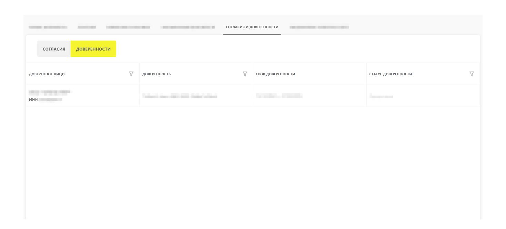

# Инструкция по использованию машиночитаемых доверенностей в Системе маркировки

Версия 9.0

# **Содержание**

| Что нового в v.9.0 от 26.02.2026<br>3                                       |  |
|-----------------------------------------------------------------------------|--|
| 1. Описание и назначение функциональности 4                                 |  |
| 2. Авторизация и информация о стендах<br>5                                  |  |
| 2.1. Запрос авторизации при единой аутентификации<br>5                      |  |
| 2.2. Получение ключа сессии при единой аутентификации<br>6                  |  |
| 3. Отправка заявки на регистрацию машиночитаемой доверенности 10            |  |
| 4. Проверка статуса заявки на регистрацию машиночитаемой доверенности<br>15 |  |
| 5. Просмотр машиночитаемой доверенности в личном кабинете<br>17             |  |
| Изменения в предыдущих версиях документа 19                                 |  |

# <span id="page-2-0"></span>**Что нового в v.9.0 от 26.02.2026**

В личном кабинете Системы маркировки для участника оборота товаров реализован [просмотр](#page-16-0) [реестра машиночитаемых доверенностей](#page-16-0), выданных юридическим лицам / индивидуальным предпринимателям.

*Для просмотра полной истории изменений по документу перейти в раздел [«Изменения в](#page-18-0) [предыдущих версиях документа](#page-18-0)».*

# <span id="page-3-0"></span>**1. Описание и назначение функциональности**

Данная инструкция описывает метод отправки заявки на регистрацию машиночитаемой доверенности от юридического лица / индивидуального предпринимателя, метод получения статуса заявки на регистрацию машиночитаемой доверенности и просмотр реестра доверенностей в личном кабинете Системы маркировки.

## <span id="page-4-0"></span>2. Авторизация и информация о стендах

Для работы с True API необходимо авторизоваться с помощью аутентификационного токена. Для его получения используйте метод получения ключа сессии при единой аутентификации.

Для работы с методами используйте URL адреса, представленные ниже:

- https://markirovka.sandbox.crptech.ru/api/v3/true-api (базовый адрес тестового контура);
- https://markirovka.crpt.ru/api/v3/true-api (базовый адрес промышленного контура).

## <span id="page-4-1"></span>2.1. Запрос авторизации при единой аутентификации

Метод используется для получения UUID (идентификатора текущей аутентификации) и сгенерированных случайных данных, которые в дальнейшем подписываются участником оборота товаров и передаются в метод получения ключа сессии при единой аутентификации для дальнейшего получения токена по УКЭП:

- 1. Получение пары «uuid data», где «uuid» идентификатор текущей аутентификации, «data» строка на подпись пользователю.
- 2. Отправка в Систему маркировки данных в том же виде, в котором данные были получены (пара «uuid data»), только теперь «data» это подписанная УКЭП строка.
- 3. Сервер отвечает на запрос сообщением с кодом 200 (ОК), либо сообщением об ошибке.

URL: /auth/key

Метод: GET

#### Пример строки запроса:

```
curl -X GET "<url стенда v3>/auth/key"
-H "accept: application/json"
```

#### Параметры ответа:

| Параметр | Тип    | Обяз. | Описание                                                  |
|----------|--------|-------|-----------------------------------------------------------|
| uuid     | string | +     | Уникальный идентификатор сгенерированных случайных данных |
| data     | string | +     | Случайная строка данных                                   |

#### Пример ответа:

```
{
  "uuid":"a63ff582-b723-4da7-958b-453da27a6c62",
  "data":"GNUFBAZBMPIUUMLXNMIOGSHTGFXZMT"
}
```

## <span id="page-5-0"></span>**2.2. Получение ключа сессии при единой аутентификации**

**URL:** /auth/simpleSignIn

**Метод:** POST

#### **Пример строки запроса:**

```
curl -X POST "<url стенда v3>/auth/simpleSignIn"
-H "accept: application/json"
-H "Content-Type: application/json"
```

#### **Пример тела запроса:**

```
{
  "uuid":"string",
  "data":"string",
  "inn":"string"
}
```

#### **Параметры тела запроса:**

| Параметр | Тип    | Обяз. | Описание                                                                                                                                        | Комментарий |
|----------|--------|-------|-------------------------------------------------------------------------------------------------------------------------------------------------|-------------|
| uuid     | string | +     | Уникальный<br>идентификатор<br>подписанных<br>случайных данных                                                                                  |             |
| data     | string | +     | Подписанные УКЭП<br>зарегистрированного<br>участника оборота<br>товаров случайные<br>данные в base64<br>(присоединённая<br>электронная подпись) |             |

| Параметр | Тип    | Обяз. | Описание                                                                                                                      | Комментарий                                                                                                                                                                                                                                                                                                             |
|----------|--------|-------|-------------------------------------------------------------------------------------------------------------------------------|-------------------------------------------------------------------------------------------------------------------------------------------------------------------------------------------------------------------------------------------------------------------------------------------------------------------------|
| inn      | string | -     | ИНН участника оборота товаров, под которым требуется авторизация для физического лица по машиночитаемой доверенности          | Параметр заполняется для получения аутентификационного токена на конкретную организацию / индивидуального предпринимателя и только в случае, если пользователь, выполняющий запрос, имеет активные машиночитаемые доверенности от разных организаций / индивидуальных предпринимателей.  Длина значения: 10 или 12 цифр |
| details  | string | -     | Реквизиты действующего аттестата соответствия объекта информатизации, выданного органом по аттестации объектов информатизации |                                                                                                                                                                                                                                                                                                                         |

#### Пример ответа:

1. В случае успеха:

```
{
    "token":"eyJhbGciOiJIUzI1NiIsInR5cCI6IkpXVCJ9.e.....mk6qe0lB12w9zEs"
}
```

- 2. В случае ошибки:
  - 2.1. Код 400, если не указан параметр «uuid»:

```
{
 "error_message":"В запросе отсутствует идентификатор авторизации (UUID)"
}
```

2.2. Код 400, если не указан параметр «data»:

```
{
  "error_message":"В запросе отсутствует параметр data"
}
```

2.3. Код 400, если в параметре «inn» указано значение не равное 10 или 12 цифрам:

```
{
  "error_message":"В параметре inn должен быть передан ИНН организации, под
которой планируется авторизация от МЧД"
}
```

2.4. Код 400, если не передано тело запроса:

```
{
  "error_message":"Тело запроса не может быть пустым"
}
```

2.5. Код 400, если в параметре «uuid» передано значение, не найденное в хранилище:

```
{
  "error_message":"UUID не найден в хранилище ключей. UUID = a33ff333-b333-3da3-
333b-333da33a3c33"
}
```

2.6. Код 400, если «data» не подписан УКЭП или содержит не те данные:

```
{
  "error_message":"Ошибка при проверке подписи"
}
```

2.7. Код 403, если «data» подписан УКЭП сотрудника, который не является добавленным пользователем организации, под которой происходит попытка авторизации:

```
{
  "error_message":"Отсутствует доступ к ресурсу"
}
```

#### **Параметры ответа:**

| Параметр          | Тип    | Обяз. | Описание                     | Комментарий                                          |
|-------------------|--------|-------|------------------------------|------------------------------------------------------|
| token             | string | -     | Аутентификацион<br>ный токен | Параметр указывается в случае успешного<br>ответа    |
| code              | string | -     | Код ошибки                   | Параметр указывается в случае не<br>успешного ответа |
| error_messag<br>e | string | -     | Сообщение об<br>ошибке       |                                                      |
| description       | string | -     | Описание ошибки              |                                                      |

«token» — токен аутентификации, полученный в результате работы метода получения токена аутентификации. Срок действия полученного токена не более 10 часов с момента получения.

# <span id="page-9-0"></span>3. Отправка заявки на регистрацию машиночитаемой доверенности

Метод предназначен для отправки заявки на регистрацию машиночитаемой доверенности от юридического лица / индивидуального предпринимателя.

Тип приватности: с токеном авторизации

URL: mrd/application/send

Метод: POST

#### Пример строки запроса:

```
curl -X POST "<url стенда>/mrd/application/send"
-H "accept: */*"
-H "Authorization: Bearer <TOKEH>"
-H "Content-Type: application/json"
```

#### Пример тела запроса:

```
{
    "document": "string",
    "signature": "string"
}
```

#### Параметры тела запроса:

| Параметр  | Обязате<br>льность | Тип    | Описание                                                                | Комментарий |
|-----------|--------------------|--------|-------------------------------------------------------------------------|-------------|
| document  | +                  | string | Тело<br>доверенности в<br>формате * .xml,<br>закодированное в<br>base64 |             |
| signature | +                  | string | Подпись генерального директора (УКЭП), закодированная в base64          |             |

#### **Пример ответа:**

- 1. В случае успеха:
  - 1.1. Код 201, возвращается номер машиночитаемой доверенности:

```
{
  "mchdId": "1a11a1a1-1111-111a-aa1a-a11aa1111111"
}
```

- 2. В случае ошибок:
  - 2.1. Код 400:
    - при ошибке в параметрах запроса:

```
{
  "error_message":"Отсутствует обязательный параметр запроса <параметр>"
}
```

```
{
  "error_message":"Неверный тип параметра запроса <параметр>"
}
```

◦ если заявка на регистрацию доверенности была отправлена ранее:

```
{
  "error_message":"Заявка на регистрацию доверенности <mchdId> была отправлена
ранее"
}
```

◦ не пройдена проверка доверителя / представителя:

```
{
  "error_message":"Проверка доверителя <ИНН> <Наименование> не пройдена"
}
```

```
{
  "error_message":"Проверка представителя <ИНН> <Наименование> не пройдена"
}
```

◦ не пройдена проверка доверенности:

```
{
  "error_message":"Не пройдена проверка по XSD схеме"
}
{
  "error_message":"Версия формата должна быть EMCHD_1"
}
{
  "error_message":"Доверенность должна быть с индивидуальными полномочиями"
}
{
  "error_message":"Дата выдачи доверенности не должна быть в будущем"
}
{
  "error_message":"Истёк срок действия доверенности"
}
{
  "error_message":"Доверенность должна быть выдана юридическим лицом или
индивидуальным предпринимателем"
}
{
  "error_message":"Доверенность должна быть выдана на одного уполномоченного
представителя"
}
{
  "error_message":"Доверенность должна быть выдана на юридическое лицо"
}
{
  "error_message":"Недопустимый тип полномочий"
}
```

```
{
 "error_message":"Недопустимые коды полномочий"
}
```

```
{
 "error_message":"В доверенности не может быть РАФП"
}
```

• не пройдена проверка подписи / доверенность подписана лицом не имеющим права действовать без доверенности:

```
{
    "error_message":"Проверка подписи не пройдена"
}
```

• полномочия в заявке отличаются от уже созданной заявки с пересекающимся сроком лействия:

```
{
    "error_message":"В системе уже есть заявка с отличными полномочиями и пересекающимся сроком действия."
}
```

• полномочия в заявке отличаются от уже созданной доверенности с пересекающимся сроком действия:

```
{
    "error_message":"В системе уже есть доверенность с отличными полномочиями и пересекающимся сроком действия."
}
```

- 2.2. Код 401 при ошибках авторизации:
  - в запросе не передан токен;
  - при указании невалидного токена;
  - при указании валидного просроченного токена.

```
{
 "error_message":"Токен не действителен. Необходимо получить новый токен
аутентификации"
```

}

#### 2.3. Код 403 при ошибке доступа:

```
{
    "error_message":"Отсутствует доступ к ресурсу"
}

{
    "error_message":"Отказ в доступе"
}
```

#### Параметры ответа:

| Параметр | Обязате<br>льность |        | Описание              | Комментарий |
|----------|--------------------|--------|-----------------------|-------------|
| mchdId   | +                  | string | Номер<br>доверенности |             |

# <span id="page-14-0"></span>4. Проверка статуса заявки на регистрацию машиночитаемой доверенности

Метод предназначен для получения статуса обработки заявки на регистрацию машиночитаемой доверенности.

Тип приватности: с токеном авторизации

URL: /mrd/application/status/{mchdId}

Метод: GET

#### Пример строки запроса:

```
curl -X GET "<url стенда>/mrd/application/status/<номер доверенности>"
-H "accept: */*"
-H "Authorization: Bearer <TOKEH>"
```

#### Параметры строки запроса:

| Параметр | Обязате<br>льность |        | Описание                | Комментарий |
|----------|--------------------|--------|-------------------------|-------------|
| mchdId   | +                  | string | Номер<br>машиночитаемой |             |
|          |                    |        | доверенности            |             |

#### Пример ответа:

- 1. В случае успеха:
  - 1.1. Код 200, МЧД найдены:

```
{
"status":"REJECTED",
"errors": [
```

- 2. В случае ошибок:
  - 2.1. Код 400 при ошибке в параметрах запроса:

```
{
  "error_message":"Отсутствует обязательный параметр запроса <параметр>"
}
```

```
{
  "error_message":"Не верный тип параметра запроса <параметр>"
}
```

#### 2.2. Код 401 при ошибках авторизации:

- в запросе не передан токен;
- при указании невалидного токена;
- при указании валидного просроченного токена.

```
{
  "error_message":"Токен не действителен. Необходимо получить новый токен
аутентификации"
}
```

#### 2.3. Код 403 при ошибке доступа:

```
{
  "error_message":"Отсутствует доступ к ресурсу"
}
```

#### **Параметры ответа:**

| Параметр | Обязате<br>льность | Тип                 | Описание      | Комментарий                                                                                                                                                                                                                                                                                                                               |
|----------|--------------------|---------------------|---------------|-------------------------------------------------------------------------------------------------------------------------------------------------------------------------------------------------------------------------------------------------------------------------------------------------------------------------------------------|
| status   | +                  | array of<br>object  | Статус заявки | Возможные значения:<br>«PENDING»<br>— в ожидании;<br>«CHECKING»<br>— проверяется (в<br>обработке у Оператора ЦРПТ);<br>«CREATED»<br>— проверяется (в<br>обработке в ФНС);<br>«SUCCESS»<br>— успешно обработано;<br>«EXPIRED»<br>— просрочена;<br>«REVOKED»<br>— отозвана;<br>«REJECTED»<br>— отклонена;<br>«WITHOUT_FNS»<br>— обработка в |
|          |                    |                     |               | ФНС                                                                                                                                                                                                                                                                                                                                       |
| errors   | -                  | array of<br>objects | Массив ошибок |                                                                                                                                                                                                                                                                                                                                           |
| *message | -                  | string              | Текст ошибки  |                                                                                                                                                                                                                                                                                                                                           |

# <span id="page-16-0"></span>**5. Просмотр машиночитаемой доверенности в личном кабинете**

В личном кабинете Системы маркировки участнику оборота товаров, выдавшему машиночитаемую доверенность юридическому лицу / индивидуальному предпринимателю, доступен просмотр реестра таких доверенностей.

Для просмотра реестра доверенностей:

- в ниспадающем меню профиля пользователя выберите **«Документы от оператора» › «Согласия и доверенности»**;
- нажмите кнопку **[ Доверенности ]**.

Отозвать такую доверенность можно только через ФНС.



# <span id="page-18-0"></span>**Изменения в предыдущих версиях документа**

#### v.8.0 от 20.02.2026

Запуск использования Единого токена авторизации в формате UUID перенесён на неопределенный срок из-за необходимости обновления инфраструктуры True API, в связи с этим из описания следующих методов удалено упоминание данного токена:

- [«Получение ключа сессии при единой аутентификации»](#page-5-0) (/auth/simpleSignIn);
- [«Запрос авторизации при единой аутентификации](#page-4-1)» (/auth/key).

#### v.7.0 от 21.01.2026

В описании метода «[Получение ключа сессии при единой аутентификации»](#page-5-0) (/auth/simpleSignIn) дополнено примечание о сроке действия получаемого токена в формате UUID.

#### v.6.0 от 19.09.2025

- В описание метода «[Запрос авторизации при единой аутентификации»](#page-4-1) (/auth/key) добавлено уточнение о том, что для получения единого токена в формате UUID данный метод можно не использовать.
- В описании метода «[Получение ключа сессии при единой аутентификации](#page-5-0)» (/auth/simpleSignIn):
  - добавлено примечание о том, что поддержка токена в формате jwt будет сохранена до марта 2026 года;
  - актуализирован пример тела запроса токена в формате jwt;
  - обновлены комментарии к параметрам «data» («Подписанные УКЭП зарегистрированного участника оборота товаров случайные данные в base64 (присоединённая электронная подпись)»), «inn» («ИНН организации, под которой требуется авторизация пользователя по МЧД»), «unitedToken» («Признак запроса единого токена в виде UUID»).

#### v.5.0 от 31.07.2025

Для пользователей с МЧД доступно получение токена аутентификации в формате UUID с помощью метода [«Получение ключа сессии при единой аутентификации»](#page-5-0) (/auth/simpleSignIn), в связи с этим в описании метода:

- изменились требования к заполнению параметров запроса «data» («Подписанные УКЭП зарегистрированного участника оборота товаров случайные данные в base64 (присоединённая электронная подпись)») и «unitedToken» («Признак запроса единого токена в виде UUID»);
- актуализированы сообщения об ошибках с кодом «400».

#### v.4.0 от 07.07.2025

Доступно получение токена аутентификации в формате UUID с помощью метода [«Получение](#page-5-0) [ключа сессии при единой аутентификации](#page-5-0)» (/auth/simpleSignIn), в связи с этим в описании метода:

- добавлены параметр запроса «unitedToken» («Признак запроса единого токена в виде UUID») и параметр ответа «uuidToken» («Аутентификационный токен в виде UUID»);
- изменилась обязательность и требования к заполнению параметров запроса «uuid» («Уникальный идентификатор подписанных случайных данных»), «data» («Подписанные УКЭП зарегистрированного участника оборота товаров случайные данные в base64 (присоединённая электронная подпись)»), «inn» («ИНН организации, под которой требуется авторизация по МЧД»);
- актуализированы сообщения об ошибках с кодами «400» и «403».

#### v.3.0 от 18.04.2025

Актуализирован текст ошибки с кодом «403» в разделах «[Отправка заявки на регистрацию](#page-9-0) [машиночитаемой доверенности»](#page-9-0) и «[Проверка статуса заявки на регистрацию машиночитаемой](#page-14-0) [доверенности»](#page-14-0).

#### v.2.0 от 17.04.2025

- Добавлен раздел [«Запрос авторизации при единой аутентификации](#page-4-1)».
- Раздел «Метод получения ключа сессии при единой аутентификации» переименован в [«Получение ключа сессии при единой аутентификации»](#page-5-0).

#### v.1.0 от 02.04.2025

Начальная версия.