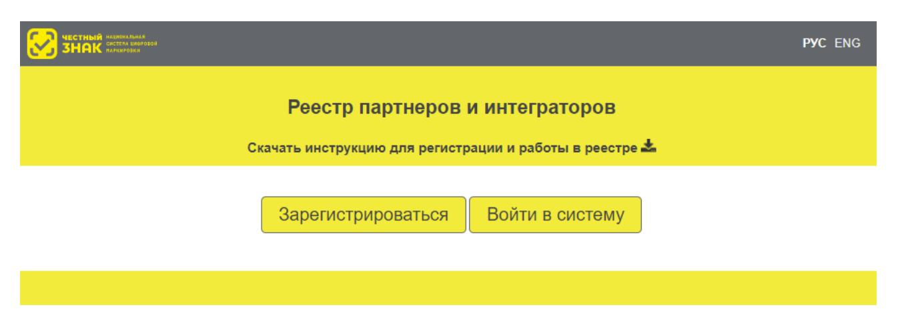
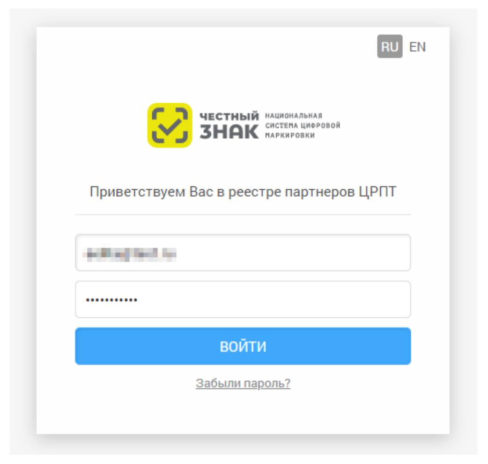
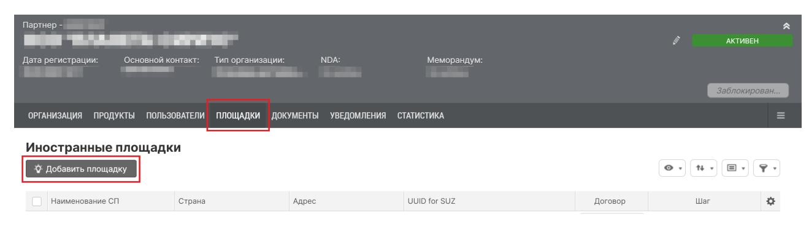
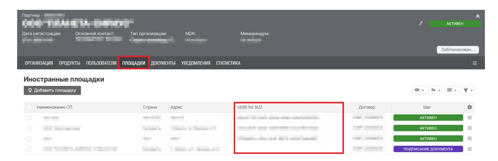
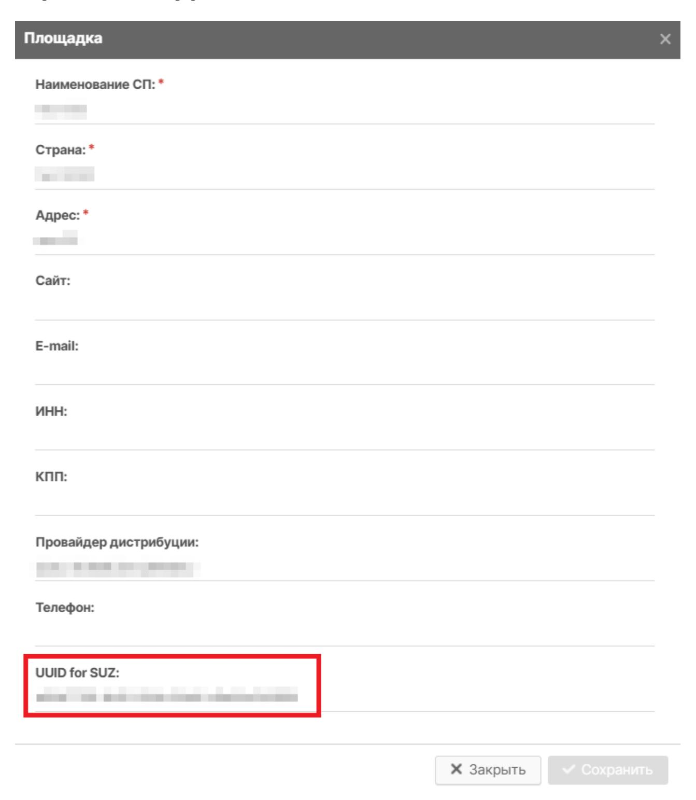

# Инструкция по добавлению иностранной площадки в реестре партнёров и интеграторов

Версия 3.0

#### **Содержание**

| 1. Описание и назначение функциональности 3                            |  |
|------------------------------------------------------------------------|--|
| 2. Авторизация 4                                                       |  |
| 3. Добавление иностранной площадки в карточке провайдера дистрибуции 5 |  |
| 4. Подписание договора для иностранного сервис-провайдера 6         |  |

### **1. Описание и назначение функциональности**

Данная инструкция описывает пользовательский интерфейс личного кабинета Реестра партнёров и интеграторов по добавлению иностранной площадки в карточку провайдера дистрибуции.

#### **2. Авторизация**

Для авторизации в системе:

• перейдите в Реестр партнёров и интеграторов по ссылке [https://registry.intuot.crpt.ru;](https://registry.intuot.crpt.ru)

*Рисунок 1. Страница входа в реестр интеграторов и партнёров*

- нажмите кнопку **[ Войти в систему ]**;
- заполните логин и пароль для входа в систему, направленные Оператором на адрес электронной почты, указанный в заявке на регистрацию.

*Рисунок 2. Форма ввода логина и пароля*

# **3. Добавление иностранной площадки в карточке провайдера дистрибуции**

Для добавления иностранной площадки:

- перейдите в карточку организации — **«Главное меню» › «Моя организация»**;
- нажмите на вкладку **«Площадки» › «Добавить площадку»**;

*Рисунок 3. Кнопка добавления площадки*

- в модальном окне **«Площадка»** заполните поля ввода данных (**\*** отмечены обязательные для заполнения поля);
- нажмите кнопку **[ Сохранить ]**.

После добавления площадки генерируется договор о предоставлении Сервис-провайдеру программно-аппаратного комплекса дистрибуции кодов маркировки путём предоставления удалённого доступа к нему на безвозмездной основе.

# **4. Подписание договора для иностранного сервиспровайдера**

Для подписания сгенерированного договора:

- перейдите во вкладку **«Документы»;**
- выберите договор, который необходимо подписать, и нажмите **«Договор на ПАК для иностранного СП»**;
- скачайте PDF-файл и ознакомьтесь с его содержимым;
- нажмите **[ Подписать документ ]**;
- в открывшемся модальном окне **«Подписать документ»** выберите из списка требуемый сертификат электронной подписи и нажмите **[ Подписать документ ]**.

После ответного подписания договора со стороны Оператора документ переходит в статус **«Подписан»**, а площадка переходит в статус **«Активен»**, после чего сведения об иностранной площадке будут добавлены в перечень сервис-провайдеров в пользовательском интерфейсе управления заказами.

#### **ОБРАТИТЕ ВНИМАНИЕ**

Если в процессе ознакомления или согласования до подписания договора произойдет смена юридического адреса у провайдера дистрибуции, потребуется повторное подписание договора, который будет сгенерирован автоматически

Также после подписания договора вы получите индивидуальный идентификатор (UUID) для работы с СУЗ. Ознакомиться с ним можно:

- в уведомлении, которое направляется от Оператора после подписания договора;
- в столбце «**UUID for SUZ**» в списке площадок;

*Рисунок 4. Список площадок*

• в карточке с общей информацией о площадке;

*Рисунок 5. Карточка с общей информацией*