# Инструкция по работе с реестром партнёров и интеграторов

Версия 32.0

# **Содержание**

| 2. Начало работы 5 3. Формирование заявки на регистрацию 7 3.1. Таблица соответствия типов организации видам деятельности 12 3.2. Отправка согласия на обработку персональных данных при регистрации физических лиц 16 4. Авторизация и восстановление доступа 18 5. Основные функциональные возможности Реестра интеграторов и партнёров 21 5.1. Интерфейс карточки организации 21 5.2. Редактирование данных об организации 23 5.2.1. Редактирование банковских реквизитов 24 5.2.2. Подача заявки на изменение перечня видов деятельности 26 5.3. Управление интеграционными и партнёрскими продуктами 27 5.3.1. Продукты к интеграции 28 5.3.1.1. Регистрация продукта к интеграции 29 5.3.1.1.1. Перевод продукта к интеграции в статус «Недействителен» 31 5.3.1.1.2. Регистрация новых версий продукта 33 5.3.1.1.3. Регистрация новых версий продукта ТС ПИоТ 35 5.3.1.2. Тестирование с участием службы технической поддержки Оператора 36 5.3.1.2.1. Подача заявки на приёмочные испытания в СУЗ 36 5.3.1.2.2. Подача заявки на приёмочные испытания ТС ПИоТ 50 5.3.1.2.3. Подача заявки на приёмочные испытания ГИС (TrueAPI) 66 5.3.1.2.4. Переход в чат с Оператором 75 5.3.1.2.5. Тестирование интеграции с СУЗ 76 5.3.1.2.6. Тестирование интеграции ТС ПИоТ 79 5.3.1.2.7. Тестирование интеграции с ГИС (TrueAPI) 81 5.3.1.3. Автотестирование интеграционного решения 82 5.3.1.3.1. Описание набора тестов 84 5.3.1.3.2. Прохождение набора тестов 85 5.3.1.4. Добавление доверенных ИНН 88 5.3.2. Партнёрские решения 91 5.3.3. Заполнение анкеты по продукту 93 |
|---------------------------------------------------------------------------------------------------------------------------------------------------------------------------------------------------------------------------------------------------------------------------------------------------------------------------------------------------------------------------------------------------------------------------------------------------------------------------------------------------------------------------------------------------------------------------------------------------------------------------------------------------------------------------------------------------------------------------------------------------------------------------------------------------------------------------------------------------------------------------------------------------------------------------------------------------------------------------------------------------------------------------------------------------------------------------------------------------------------------------------------------------------------------------------------------------------------------------------------------------------------------------------------------------------------------------------------------------------------------------------------------------------------------------------------------------------------------------------------------------------------------------------------------------------------------------------------------------------------------------------------------------------------------------------------------------------------------------------------------|
|                                                                                                                                                                                                                                                                                                                                                                                                                                                                                                                                                                                                                                                                                                                                                                                                                                                                                                                                                                                                                                                                                                                                                                                                                                                                                                                                                                                                                                                                                                                                                                                                                                                                                                                                             |
|                                                                                                                                                                                                                                                                                                                                                                                                                                                                                                                                                                                                                                                                                                                                                                                                                                                                                                                                                                                                                                                                                                                                                                                                                                                                                                                                                                                                                                                                                                                                                                                                                                                                                                                                             |
|                                                                                                                                                                                                                                                                                                                                                                                                                                                                                                                                                                                                                                                                                                                                                                                                                                                                                                                                                                                                                                                                                                                                                                                                                                                                                                                                                                                                                                                                                                                                                                                                                                                                                                                                             |
|                                                                                                                                                                                                                                                                                                                                                                                                                                                                                                                                                                                                                                                                                                                                                                                                                                                                                                                                                                                                                                                                                                                                                                                                                                                                                                                                                                                                                                                                                                                                                                                                                                                                                                                                             |
|                                                                                                                                                                                                                                                                                                                                                                                                                                                                                                                                                                                                                                                                                                                                                                                                                                                                                                                                                                                                                                                                                                                                                                                                                                                                                                                                                                                                                                                                                                                                                                                                                                                                                                                                             |
|                                                                                                                                                                                                                                                                                                                                                                                                                                                                                                                                                                                                                                                                                                                                                                                                                                                                                                                                                                                                                                                                                                                                                                                                                                                                                                                                                                                                                                                                                                                                                                                                                                                                                                                                             |
|                                                                                                                                                                                                                                                                                                                                                                                                                                                                                                                                                                                                                                                                                                                                                                                                                                                                                                                                                                                                                                                                                                                                                                                                                                                                                                                                                                                                                                                                                                                                                                                                                                                                                                                                             |
|                                                                                                                                                                                                                                                                                                                                                                                                                                                                                                                                                                                                                                                                                                                                                                                                                                                                                                                                                                                                                                                                                                                                                                                                                                                                                                                                                                                                                                                                                                                                                                                                                                                                                                                                             |
|                                                                                                                                                                                                                                                                                                                                                                                                                                                                                                                                                                                                                                                                                                                                                                                                                                                                                                                                                                                                                                                                                                                                                                                                                                                                                                                                                                                                                                                                                                                                                                                                                                                                                                                                             |
|                                                                                                                                                                                                                                                                                                                                                                                                                                                                                                                                                                                                                                                                                                                                                                                                                                                                                                                                                                                                                                                                                                                                                                                                                                                                                                                                                                                                                                                                                                                                                                                                                                                                                                                                             |
|                                                                                                                                                                                                                                                                                                                                                                                                                                                                                                                                                                                                                                                                                                                                                                                                                                                                                                                                                                                                                                                                                                                                                                                                                                                                                                                                                                                                                                                                                                                                                                                                                                                                                                                                             |
|                                                                                                                                                                                                                                                                                                                                                                                                                                                                                                                                                                                                                                                                                                                                                                                                                                                                                                                                                                                                                                                                                                                                                                                                                                                                                                                                                                                                                                                                                                                                                                                                                                                                                                                                             |
|                                                                                                                                                                                                                                                                                                                                                                                                                                                                                                                                                                                                                                                                                                                                                                                                                                                                                                                                                                                                                                                                                                                                                                                                                                                                                                                                                                                                                                                                                                                                                                                                                                                                                                                                             |
|                                                                                                                                                                                                                                                                                                                                                                                                                                                                                                                                                                                                                                                                                                                                                                                                                                                                                                                                                                                                                                                                                                                                                                                                                                                                                                                                                                                                                                                                                                                                                                                                                                                                                                                                             |
|                                                                                                                                                                                                                                                                                                                                                                                                                                                                                                                                                                                                                                                                                                                                                                                                                                                                                                                                                                                                                                                                                                                                                                                                                                                                                                                                                                                                                                                                                                                                                                                                                                                                                                                                             |
|                                                                                                                                                                                                                                                                                                                                                                                                                                                                                                                                                                                                                                                                                                                                                                                                                                                                                                                                                                                                                                                                                                                                                                                                                                                                                                                                                                                                                                                                                                                                                                                                                                                                                                                                             |
|                                                                                                                                                                                                                                                                                                                                                                                                                                                                                                                                                                                                                                                                                                                                                                                                                                                                                                                                                                                                                                                                                                                                                                                                                                                                                                                                                                                                                                                                                                                                                                                                                                                                                                                                             |
|                                                                                                                                                                                                                                                                                                                                                                                                                                                                                                                                                                                                                                                                                                                                                                                                                                                                                                                                                                                                                                                                                                                                                                                                                                                                                                                                                                                                                                                                                                                                                                                                                                                                                                                                             |
|                                                                                                                                                                                                                                                                                                                                                                                                                                                                                                                                                                                                                                                                                                                                                                                                                                                                                                                                                                                                                                                                                                                                                                                                                                                                                                                                                                                                                                                                                                                                                                                                                                                                                                                                             |
|                                                                                                                                                                                                                                                                                                                                                                                                                                                                                                                                                                                                                                                                                                                                                                                                                                                                                                                                                                                                                                                                                                                                                                                                                                                                                                                                                                                                                                                                                                                                                                                                                                                                                                                                             |
|                                                                                                                                                                                                                                                                                                                                                                                                                                                                                                                                                                                                                                                                                                                                                                                                                                                                                                                                                                                                                                                                                                                                                                                                                                                                                                                                                                                                                                                                                                                                                                                                                                                                                                                                             |
|                                                                                                                                                                                                                                                                                                                                                                                                                                                                                                                                                                                                                                                                                                                                                                                                                                                                                                                                                                                                                                                                                                                                                                                                                                                                                                                                                                                                                                                                                                                                                                                                                                                                                                                                             |
|                                                                                                                                                                                                                                                                                                                                                                                                                                                                                                                                                                                                                                                                                                                                                                                                                                                                                                                                                                                                                                                                                                                                                                                                                                                                                                                                                                                                                                                                                                                                                                                                                                                                                                                                             |
|                                                                                                                                                                                                                                                                                                                                                                                                                                                                                                                                                                                                                                                                                                                                                                                                                                                                                                                                                                                                                                                                                                                                                                                                                                                                                                                                                                                                                                                                                                                                                                                                                                                                                                                                             |
|                                                                                                                                                                                                                                                                                                                                                                                                                                                                                                                                                                                                                                                                                                                                                                                                                                                                                                                                                                                                                                                                                                                                                                                                                                                                                                                                                                                                                                                                                                                                                                                                                                                                                                                                             |
|                                                                                                                                                                                                                                                                                                                                                                                                                                                                                                                                                                                                                                                                                                                                                                                                                                                                                                                                                                                                                                                                                                                                                                                                                                                                                                                                                                                                                                                                                                                                                                                                                                                                                                                                             |
|                                                                                                                                                                                                                                                                                                                                                                                                                                                                                                                                                                                                                                                                                                                                                                                                                                                                                                                                                                                                                                                                                                                                                                                                                                                                                                                                                                                                                                                                                                                                                                                                                                                                                                                                             |
|                                                                                                                                                                                                                                                                                                                                                                                                                                                                                                                                                                                                                                                                                                                                                                                                                                                                                                                                                                                                                                                                                                                                                                                                                                                                                                                                                                                                                                                                                                                                                                                                                                                                                                                                             |
|                                                                                                                                                                                                                                                                                                                                                                                                                                                                                                                                                                                                                                                                                                                                                                                                                                                                                                                                                                                                                                                                                                                                                                                                                                                                                                                                                                                                                                                                                                                                                                                                                                                                                                                                             |
|                                                                                                                                                                                                                                                                                                                                                                                                                                                                                                                                                                                                                                                                                                                                                                                                                                                                                                                                                                                                                                                                                                                                                                                                                                                                                                                                                                                                                                                                                                                                                                                                                                                                                                                                             |
|                                                                                                                                                                                                                                                                                                                                                                                                                                                                                                                                                                                                                                                                                                                                                                                                                                                                                                                                                                                                                                                                                                                                                                                                                                                                                                                                                                                                                                                                                                                                                                                                                                                                                                                                             |
| 5.4. Редактирование данных о пользователях 95                                                                                                                                                                                                                                                                                                                                                                                                                                                                                                                                                                                                                                                                                                                                                                                                                                                                                                                                                                                                                                                                                                                                                                                                                                                                                                                                                                                                                                                                                                                                                                                                                                                                                            |
| 5.5. Работа с документами 98                                                                                                                                                                                                                                                                                                                                                                                                                                                                                                                                                                                                                                                                                                                                                                                                                                                                                                                                                                                                                                                                                                                                                                                                                                                                                                                                                                                                                                                                                                                                                                                                                                                                                                             |
| 5.5.1. Таблица соответствия обязательности документов и типов организаций 99                                                                                                                                                                                                                                                                                                                                                                                                                                                                                                                                                                                                                                                                                                                                                                                                                                                                                                                                                                                                                                                                                                                                                                                                                                                                                                                                                                                                                                                                                                                                                                                                                                                             |
| 5.5.2. Подписание документов 101                                                                                                                                                                                                                                                                                                                                                                                                                                                                                                                                                                                                                                                                                                                                                                                                                                                                                                                                                                                                                                                                                                                                                                                                                                                                                                                                                                                                                                                                                                                                                                                                                                                                                                            |
| 5.5.3. Заполнение анкеты для подключения Сервис-провайдера 106                                                                                                                                                                                                                                                                                                                                                                                                                                                                                                                                                                                                                                                                                                                                                                                                                                                                                                                                                                                                                                                                                                                                                                                                                                                                                                                                                                                                                                                                                                                                                                                                                                                                           |
| 5.5.4. Подача заявления на договор ПАК 108                                                                                                                                                                                                                                                                                                                                                                                                                                                                                                                                                                                                                                                                                                                                                                                                                                                                                                                                                                                                                                                                                                                                                                                                                                                                                                                                                                                                                                                                                                                                                                                                                                                                                               |
| 5.6. Просмотр уведомлений 110                                                                                                                                                                                                                                                                                                                                                                                                                                                                                                                                                                                                                                                                                                                                                                                                                                                                                                                                                                                                                                                                                                                                                                                                                                                                                                                                                                                                                                                                                                                                                                                                                                                                                                            |
| 5.7. Просмотр статистики использования продуктов к интеграции 111                                                                                                                                                                                                                                                                                                                                                                                                                                                                                                                                                                                                                                                                                                                                                                                                                                                                                                                                                                                                                                                                                                                                                                                                                                                                                                                                                                                                                                                                                                                                                                                                                                                                           |
| 5.8. Работа с задачами от Оператора 113                                                                                                                                                                                                                                                                                                                                                                                                                                                                                                                                                                                                                                                                                                                                                                                                                                                                                                                                                                                                                                                                                                                                                                                                                                                                                                                                                                                                                                                                                                                                                                                                                                                                                                  |

| 5.9. Статистика 117                                      |  |
|-------------------------------------------------------------|--|
| 5.9.1. Статистика ОФД 117                                |  |
| 5.9.2. Статистика ЭДО 119                                |  |
| 5.9.3. Статистика СУЗ 121                                   |  |
| 5.10. Сведения о нормативно-правовых актах 122           |  |
| 5.11. Просмотр новостей 124                              |  |
| Перечень сокращений, условных обозначений и терминов 126 |  |
| История изменений 130                                       |  |

## **1. Описание и назначение функциональности**

Данная инструкция описывает пользовательский интерфейс Личного кабинета Реестра партнёров и интеграторов, его функциональные возможности, а также основные вопросы, возникающие при работе с Реестром интеграторов и партнёров на практике.

## **2. Начало работы**

Для начала работы следует выполнить следующие действия:

• перейти в Реестр интеграторов и партнёров по ссылке [https://registry.intuot.crpt.ru;](https://registry.intuot.crpt.ru)

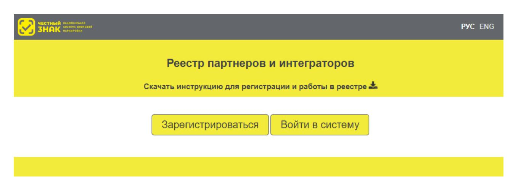

*Рисунок 1. Страница входа в реестр интеграторов и партнёров*

- нажать кнопку **[ Зарегистрироваться ]**, заполнить и отправить на проверку формуляр регистрации компании (см. раздел «[Формирование заявки на регистрацию»](#page-6-0));
- после одобрения заявки Оператором, получить данные для входа в систему в письме, направленном на адрес электронной почты, указанный в заявке;
  - В случае отклонения заявки на адрес электронной почты будет отправлено уведомление с причиной отклонения заявки. Для устранения указанной причины подать заявку на регистрацию повторно, указав корректные сведения.
- авторизоваться в системе, ознакомиться и принять условия использования (см. раздел [«Авторизация и восстановление доступа»](#page-17-0));
- проверить и при необходимости отредактировать данные профиля организации (см. разделы [«Редактирование данных об организации](#page-22-0)»);
- выполнить необходимые действия для перевода профиля организации в статус **«Активен»**.
  - В зависимости от типа организации, присвоенного организации (подробнее см. раздел [«Таблица соответствия типов организации видам деятельности](#page-11-0)»), предусмотрены следующие сценарии перехода профиля в статус **«Активен»**:
    - для типа организации **«Участник оборота товаров»** статус **«Активен»** проставляется автоматически;
    - для типов организаций **«Партнёр»**, **«Интегратор»**, **«Самозанятый разработчик»**, **«Сервис-провайдер»** смена статуса возможна только после прохождения проверки организации со стороны Службы Безопасности.

В случае отклонения заявки со стороны Службы Безопасности на адрес электронной почты будет отправлено соответствующее уведомление. При возникновении вопросов обратиться в службу технической поддержки по адресу, указанному в уведомлении.

- для типа организации **«Интегратор»**, **«Самозанятый разработчик»** и **«Участник оборота товаров»** добавить продукты («[Управление интеграционными и партнёрскими продуктами](#page-26-0)») и подписать связанные документы. Перечень документов будет направлен на адрес электронной почты при переходе профиля организации в статус **«Активен»** (подробнее см. в разделе «[Таблица соответствия обязательности документов и типов организаций»](#page-98-0));
- для типа организации **«Сервис-провайдер»** заполнить анкету Сервис-провайдера (см. раздел [«Заполнение анкеты для подключения Сервис-провайдера](#page-105-0)»), дождаться перехода анкеты в статус **«Подтверждена»** после окончания проверки данных Оператором, создать и подписать заявление на договор ПАК (см. раздел «[Подача заявления на договор ПАК](#page-107-0)»), а также автоматически сгенерированный договор ПАК. После успешного завершения обработки документов организация с типом **«Сервис-провайдер»** будет добавлена в перечень сервиспровайдеров в пользовательский интерфейс СУЗ;
- для организаций с видами деятельности **«Оператор фискальных данных»** и **«Оператор электронного документооборота»** доступна функциональность выгрузки статистических данных по ОФД и ЭДО соответственно (подробнее см. в разделе «Статистика по ОФД и ЭДО»).

Подробнее об основных функциональных возможностях Личного кабинета Реестра интеграторов и партнёров см. в разделе «[Основные функциональные возможности Реестра](#page-20-0) [интеграторов и партнёров»](#page-20-0).

## **3. Формирование заявки на регистрацию**

Для регистрации в Реестре партнёров и интеграторов перейти по ссылке [https://registry.intuot.crpt.ru,](https://registry.intuot.crpt.ru) нажать кнопку **[ Зарегистрироваться ]** и заполнить поля формуляра регистрации компании.

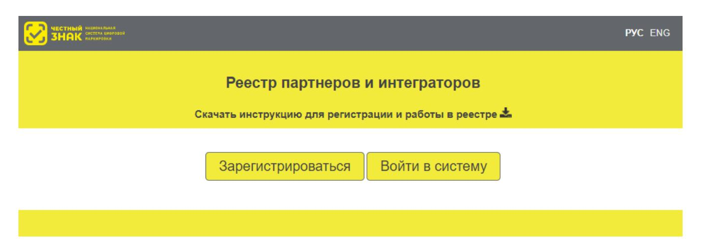

*Рисунок 2. Страница входа в систему*

Скачивание инструкции по работе в Реестре интеграторов и партнёров доступно по ссылке **«Скачать инструкцию для регистрации и работы в реестре»**.

В формуляре регистрации компании указать следующие сведения:

• **«Страна регистрации бизнеса»** (по умолчанию, **«Россия»**);

При выборе значения **«Физ лицо»** в поле **«Форма регистрации бизнеса»**, доступно только значение **«Россия»**.

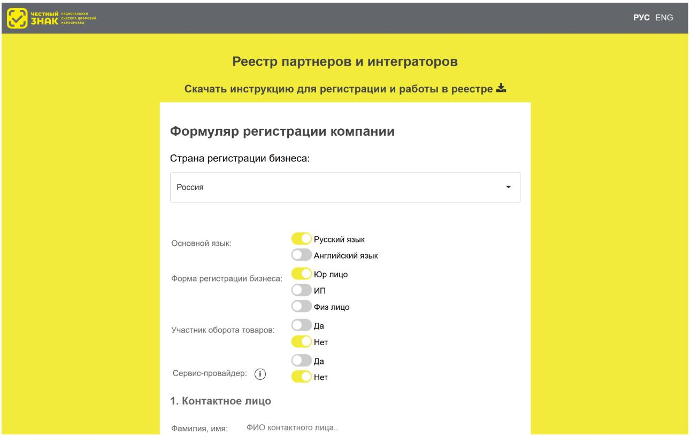

*Рисунок 3. Формуляр регистрации компании*

• **Основной язык** (по умолчанию, **«Русский язык»**)

Возможные значения:

- **«Русский язык»**;
- **«Английский язык»**.

При выборе страны, отличной от **«Россия»**, автоматически устанавливается **«Английский язык»** (при этом выбор значения **«Русский язык»** остаётся доступным).

• **«Форма регистрации бизнеса»** (передвинуть соответствующий переключатель в активное положение). В зависимости от выбранного значения меняется состав полей формуляра регистрации компании.

Выбранное значение является неизменяемым и не может быть отредактировано в ходе дальнейшей работы в системе.

#### Возможные значения:

◦ **«Юр лицо»** — юридическое лицо.

При рассмотрении заявки Оператором проверяется, что юридическое лицо зарегистрировано на территории страны, указанной в поле **«Страна регистрации бизнеса»**.

◦ **«ИП»** — индивидуальный предприниматель.

К регистрации допускаются индивидуальные предприниматели, у которых вид гражданства отличается от «РФ», при условии, что страной регистрации бизнеса для таких индивидуальных предпринимателей является РФ.

◦ **«Физ лицо»** — физическое лицо. Значение выбирается в случае, если указанное физическое лицо является разработчиком ПО для маркировки и зарегистрировано в качестве плательщика налога на профессиональный доход (самозанятого).

Данное значение соответствует типу организации **«Самозанятый разработчик»**, включающий следующие возможные роли для физических лиц:

- интегратор программных и аппаратных решений;
- разработчик кассового программного обеспечения;
- разработчик товаро-учётного программного обеспечения;
- разработчик систем планирования ресурсов и процессов (ERP системы);
- разработчик программно-аппаратных комплексов криптографии и средств информационной защиты;
- разработчик ПО Track&Trace (Маркировки и прослеживаемости);
- консалтинговая деятельность;
- разработка ПО для сервис-провайдеров.

При выборе значения **«Физ лицо»**, в поле **«Страна регистрации бизнеса»** доступно только значение **«Россия»**.

При выборе значения **«Физ лицо»**, в поле **«3. Вид деятельности»** автоматически активируется значение **«Самозанятый разработчик»**, все остальные значения блокируются. При этом в нижней части формы появляется кнопка **[ Скачать согласие на обработку персональных данных ]**, при нажатии которой доступно скачивание файла «Согласие на обработку персональных данных», автоматически заполненного на основании данных заявки.

• **«Участник оборота товаров»** (недоступно для формы регистрации бизнеса **«Физ лицо»**). Выбрать значение **«Да»** / **«Нет»** перемещением соответствующего переключателя в активное положение.

Выбрать **«Да»** в случае, если компания зарегистрирована в ГИС МТ или ФГИС МДЛП. При выборе значения **«Да»**, в поле **«3. Вид деятельности»** автоматически активируется значение **«УОТ»**, все остальные значения блокируются.

Выбрать **«Нет»** в остальных случаях, в том числе если компания осуществляет взаимодействие по API с ГИС МТ или ФГИС МДЛП, но участие в обороте маркированных товаров сводится к следующим исключительным случаям:

- оказание услуг доставки товаров потребителям;
- оказание услуг почтовой связи в отношении почтовых отправлений с наложенным платежом при продаже товаров по образцам или дистанционным способом;
- компания выступает платежным агентом, не осуществляющим оборот маркированного товара;
- приобретение либо реализация (продажа) маркированной продукции по сделке, сведения о которой составляют государственную тайну.
- **«Сервис-провайдер»** (выбрать значение **«Да»** / **«Нет»** перемещением соответствующего переключателя в активное положение).

Значение **«Да»** доступно только для компаний с формой регистрации **«Юр лицо»**. При наведении на иконку информации доступен перечень требований, предъявляемых к компаниям для регистрации в роли Сервис-провайдера.

Выбрать **«Да»**, если компания является действующим или будущим Сервис-провайдером с видом деятельности **«Типография»**.

При выборе значения **«Да»**, в блоке **«3. Вид деятельности»** автоматически активируется значение **«типография»** (все остальные значения блокируются) и отображается поле **«Провайдер дистрибуции»**, в котором необходимо выбрать значение из выпадающего списка.

- в блоке **«1. Контактное лицо»** заполнить прямым вводом данные основного контактного лица, которое будет зарегистрировано в Реестре интеграторов и партнёров в качестве администратора и основного контактного лица:
  - **«Фамилия, имя»** указать фамилию, имя и отчество контактного лица;
  - **«Адрес e-mail»** указать адрес электронной почты, который будет использоваться в качестве логина для входа в систему, а также для отправки пароля для входа и инструкций от Оператора;
  - **«Номер телефона»** (только цифры).

Для данного поля применяется маска **«+7»** при выборе в поле **«Страна регистрации бизнеса»** значения **«Россия»**. Для остальных стран маска не применяется.

◦ **«Должность»**.

- в блоке **«2. Данные компании»** (недоступно для формы регистрации бизнеса **«Физ лицо»**) заполнить прямым вводом следующие поля (при рассмотрении заявки вводимые данные проверяются на соответствие данным ЕГРЮЛ и ЕГРИП):
  - **«Название»** (недоступно, если в поле **«Страна регистрации бизнеса»** указано значение **«Россия»**);
  - **«ИНН»**.

Если в поле **«Страна регистрации бизнеса»** указано значение **«Россия»**, то выполняется проверка длины значения в поле **«ИНН»**: для юридических лиц — 10 знаков, для ИП — 12 знаков.

При повторной подаче заявки на регистрацию, ранее отклонённой Оператором, при вводе значения в поле **«ИНН»**, активируется переключатель **«Подать повторную заявку на регистрацию»** над полем **«Название»**.

- **«КПП»** (недоступно, если в поле **«Страна регистрации бизнеса»** указано значение **«Россия»**);
- **«Основной email»** основной адрес электронной почты компании. Может отличаться от значения, указанного в поле **«Адрес e-mail»** в блоке **«1. Контактное лицо»**;
- **«Телефон»** (только цифры). Указать основной телефон компании. Параметр не является обязательным, если форма регистрации бизнеса — **«ИП»**.

Для данного поля применяется маска **«+7»** при выборе в поле **«Страна регистрации бизнеса»** значения **«Россия»**. Для остальных стран маска не применяется.

- **«WEB сайт»** сайт компании (обязательное поле);
- **«Основной адрес»** адрес регистрации места жительства (отображается только для формы регистрации бизнеса **«ИП»**);
- **«Описание деятельности»**.

Заполнить описание деятельности компании в части отношения к ГИС МТ или ФГИС МДЛП.

Минимальное количество символов — 100 знаков.

- в блоке **«2. Данные о физическом лице»** (доступно только для формы регистрации бизнеса **«Физ лицо»**) заполнить прямым вводом следующие поля:
  - **«ФИО»** указать фамилию, имя и отчество физического лица;
  - **«ИНН»** указать 12-значный ИНН физического лица;

- **«Дата рождения»** указать дату в формате «ДД.ММ.ГГГГ» или выбрать значение в календаре (иконка );
- **«Место рождения»** указать место рождения (как в паспорте);
- **«Адрес регистрации»** указать адрес регистрации места жительства;
- в разделе **«Паспорт»** указать паспортные данные в полях **«Серия»**, **«Номер»**, **«Кем выдан»**, **«Дата выдачи»**;
- **«Основной email»** основной адрес электронной почты физического лица. Может отличаться от значения, указанного в поле **«Адрес e-mail»** в блоке **«1. Контактное лицо»**;
- **«Телефон»** (только цифры). Для данного поля применяется маска **«+7»**;
- **«WEB сайт»** сайт компании (необязательное поле);
- **«Описание деятельности»**.

Заполнить описание деятельности компании в части отношения к ГИС МТ или ФГИС МДЛП.

Минимальное количество символов — 100 знаков.

• в блоке **«3.Вид деятельности»** выбрать актуальные значения перемещением соответствующих переключателей в активное положение.

Выбор значений определяет круг возможностей и сценариев работы в системе, доступных зарегистрированному пользователю Реестра интеграторов и партнёров. Каждый из видов деятельности соответствует одному из типов организации (функциональной группе): **«Участник оборота товаров»**, **«Интегратор»**, **«Партнёр»**, **«Сервис-провайдер»** или **«Самозанятый разработчик»**. Подробнее об ограничениях и особенностях выбора видов деятельности см. в разделе «[Таблица соответствия типов организации видам деятельности»](#page-11-0).

Перечень документов для активации функций, соответствующих типам организаций см. в разделе «[Таблица соответствия обязательности документов и типов организаций»](#page-98-0).

Перечень видов деятельности может быть отредактирован после регистрации организации в Реестре интеграторов и партнёров путём подачи заявки в Личном кабинете (подробнее см. раздела «[Подача заявки на изменение перечня видов деятельности»](#page-25-0)).

## **3.1. Таблица соответствия типов организации видам деятельности**

В Реестре интеграторов и партнёров предусмотрены несколько типов организации, определяющих набор функциональных возможностей организации, зарегистрированной в системе. Тип организации назначается автоматически на основании видов деятельности, указанных в заявке на регистрацию (см. раздел «[Формирование заявки на регистрацию](#page-6-0)») или при редактировании профиля (см. раздел «[Подача заявки на изменение перечня видов](#page-25-0) [деятельности»](#page-25-0)). Соответствие между видами деятельности и типами организации, а также связанные ограничения описаны в таблице ниже.

| Тип организации  | Вид деятельности | Комментарий                         |
|------------------|------------------|-------------------------------------|
| Участник оборота | «УОТ»            | Значение автоматически              |
| товаров          |                  | активируется при выборе в поле      |
|                  |                  | «Участник оборота товаров»          |
|                  |                  | значения «Да». Если активно, то все |
|                  |                  | остальные значения заблокированы.   |
|                  |                  | Добавление типов деятельности       |
|                  |                  | «Интегратор» и «Партнёр»         |
|                  |                  | возможно через заявку в службу      |
|                  |                  | технической поддержки по адресу     |
|                  |                  | support@crpt.ru                     |

| Тип организации | Вид деятельности                                          | Комментарий                                                             |
|-----------------|-----------------------------------------------------------|-------------------------------------------------------------------------|
| Интегратор      | «интегратор программных и                                 | Доступно только для форм                                                |
|                 | аппаратных Решений»                                       | регистрации бизнеса «Юр лицо» и                                      |
|                 | «разработчик товаро-учетного программного обеспечения» | «ИП».                                                                   |
|                 | «разработчик систем                                       | При выборе хотя бы одного значения из списка, компании присваивается |
|                 | планирования ресурсов и процессов (ERP системы)»       | тип организации «Интегратор».                                           |
|                 | «разработчик ПО                                           | Допускается одновременный выбор                                         |
|                 | Track&Trace\Маркировки и                                  | значений, соответствующих типам                                         |
|                 | прослеживаемости»                                         | организации «Интегратор» и                                           |
|                 | «разработка ПО для сервис                                 | «Партнёр».                                                              |
|                 | провайдеров»                                              | Добавление типа деятельности                                            |
|                 | «разработчик ПО для вендинговых                           | «Участник оборота товаров»                                              |
|                 | аппаратов, производитель                                  | возможно через заявку в службу                                          |
|                 | вендинговых аппаратов»                                    | технической поддержки (подробнее                                        |
|                 | «разработчик модели ТС ПИоТ»                              | см. в разделе «Подача заявки на                                         |
|                 |                                                           | изменение перечня видов                                                 |
|                 | «разработчик компонент ТС ПИоТ»                        | деятельности»)                                                          |
|                 | «центр технического обслуживания (ЦТО)»                |                                                                         |

| Тип организации | Вид деятельности                                             | Комментарий                                                                                                                         |
|-----------------|--------------------------------------------------------------|-------------------------------------------------------------------------------------------------------------------------------------|
| Партнёр         | «оператор электронного документооборота»                  | Доступно только для форм регистрации бизнеса «Юр лицо» и                                                                      |
|                 | «оператор фискальных данных»                                 | «ИП». При выборе хотя бы одного значения из списка, компании присваивается тип организации «Партнёр».                      |
|                 | «производитель контрольно кассовой техники»               |                                                                                                                                     |
|                 | «разработчик кассового программного обеспечения»          |                                                                                                                                     |
|                 |                                                              | Допускается одновременный выбор значений, соответствующих типам                                                                  |
|                 | «производитель, импортер 2D сканеров»                     | организации «Интегратор» и                                                                                                       |
|                 | «производитель, импортер терминалов сбора данных (ТСД)»   | «Партнёр». Добавление типа деятельности                                                                                          |
|                 | «производитель, импортер принтеров этикеток/чеков»        | «Участник оборота товаров» возможно через заявку в службу технической поддержки (подробнее см. в разделе «Подача заявки на |
|                 | «производитель, импортер                                     |                                                                                                                                     |
|                 | маркираторов, аппликаторов, оборудования, обеспечивающего | изменение перечня видов                                                                                                             |
|                 | обнаружение, автоматический контроль и анализ средств     | деятельности»)                                                                                                                      |
|                 | идентификации (техническое                                   |                                                                                                                                     |
|                 | зрение), или иного производственного оборудования,        |                                                                                                                                     |
|                 | предназначенного для нанесения и                             |                                                                                                                                     |
|                 | считывания средств идентификации»                         |                                                                                                                                     |
|                 | «разработчик программно                                      |                                                                                                                                     |
|                 | аппаратных комплексов криптографии и средств              |                                                                                                                                     |
|                 | информационной защиты»                                       |                                                                                                                                     |
|                 | «консалтинговая деятельность»                                |                                                                                                                                     |

| Тип организации  | Вид деятельности          | Комментарий                          |
|------------------|---------------------------|--------------------------------------|
| Сервис-провайдер | «типография»              | Значение автоматически               |
|                  |                           | активируется при выборе в поле       |
|                  |                           | «Сервис-провайдер» значения «Да». |
|                  |                           | Если активно, то все остальные       |
|                  |                           | значения заблокированы.              |
|                  |                           | Для завершения процедуры             |
|                  |                           | формирования заявки выбрать          |
|                  |                           | провайдера дистрибуции из            |
|                  |                           | выпадающего списка в поле            |
|                  |                           | «Провайдер дистрибуции»              |
| Самозанятый      | «Самозанятый разработчик» | Значение автоматически               |
| разработчик      |                           | активируется при выборе в поле       |
|                  |                           | «Форма регистрации бизнеса»          |
|                  |                           | значения «Физ лицо». Если активно,   |
|                  |                           | то все остальные значения            |
|                  |                           | заблокированы.                       |
|                  |                           | Для завершения процедуры             |
|                  |                           | формирования заявки приложить        |
|                  |                           | файл согласия на обработку           |
|                  |                           | персональных данных (подробнее см.   |
|                  |                           | в подразделе «Отправка согласия на   |
|                  |                           | обработку персональных данных при    |
|                  |                           | регистрации физических лиц»)         |

## **3.2. Отправка согласия на обработку персональных данных при регистрации физических лиц**

При выборе в поле **«Форма регистрации бизнеса»** значения **«Физ лицо»**, в поле выбора видов деятельности автоматически активируется значение **«Самозанятый разработчик»**, а в нижней части формы регистрации появляется кнопка **[ Скачать согласие на обработку персональных данных ]**.

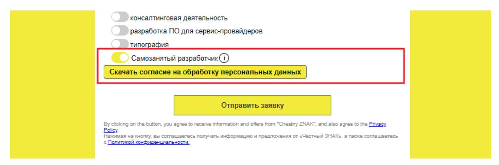

*Рисунок 4. Кнопка для скачивания согласия на обработку персональных данных*

При нажатии кнопки производится автоматическая проверка формата данных в заявке. После успешного завершения проверки, запускается загрузка файла «Согласие на обработку персональных данных», заполненного на основании введённых сведений, а также появляется кнопка **[ Выберите файл ]** для доступа к форме загрузки.

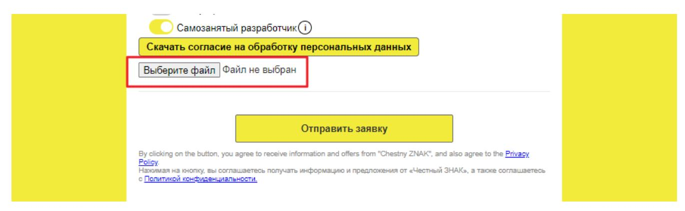

*Рисунок 5. Кнопка выбора файла*

После скачивания файла проверить правильность указанных данных, после чего распечатать и подписать документ от руки.

Электронную версию подписанного документа приложить к заявке через форму загрузки (открыть форму нажатием кнопки **[ Выберите файл ]**.

Оригинал подписанного документа отправить почтовым отправлением на адрес, указанный в письме от службы технической поддержки, которое будет направлено на электронную почту, указанную в поле **«Адрес e-mail»** в блоке **«1. Контактное лицо»**.

После окончания регистрации и успешной авторизации в Личном кабинете Реестра интеграторов и партнёров, загруженный файл будет доступен для просмотра в разделе **«Моя организация» › «Документы»**.

## **4. Авторизация и восстановление доступа**

Для авторизации в системе:

• перейти в Реестр интеграторов и партнёров по ссылке [https://registry.intuot.crpt.ru;](https://registry.intuot.crpt.ru)

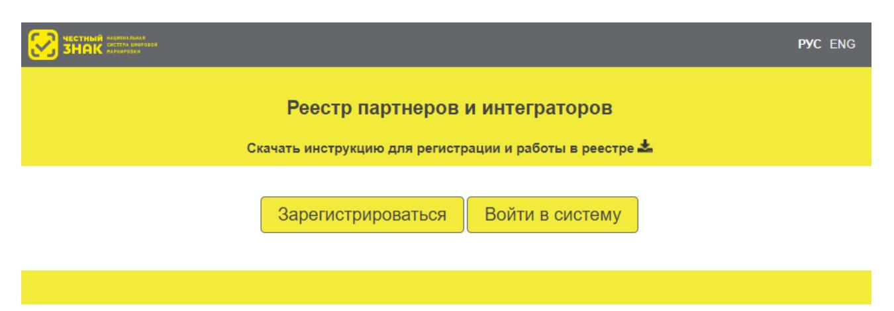

*Рисунок 6. Страница входа в реестр интеграторов и партнёров*

- нажать кнопку **[ Войти в систему ]**;
- заполнить логин и пароль для входа в систему, направленные Оператором на адрес электронной почты, указанный в заявке на регистрацию;

*Рисунок 7. Форма ввода логина и пароля*

Для восстановления пароля нажать на ссылку **«Забыли пароль?»** в нижней части формы ввода данных, после чего ввести зарегистрированный адрес электронной почты и нажать кнопку **[ Отправить ссылку ]**. Временная ссылка для смены пароля будет выслана на указанный адрес (время жизни временной ссылки — 10 минут).

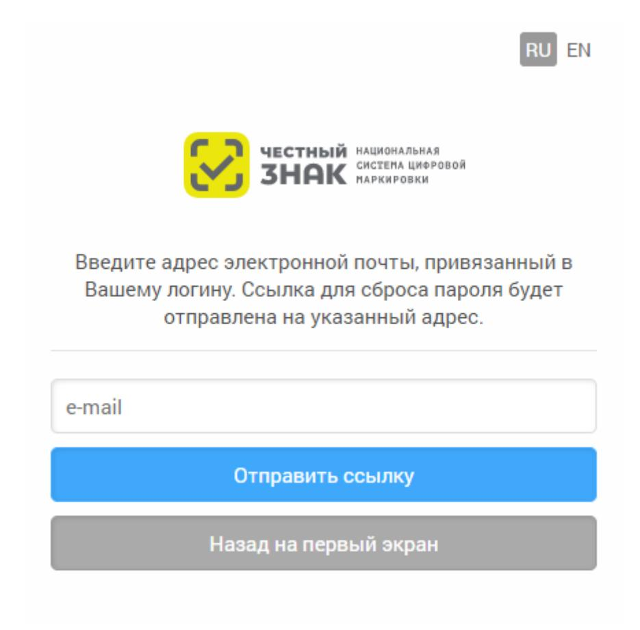

*Рисунок 8. Форма восстановления пароля*

• при первом входе в личный кабинет Реестра интеграторов и партнёров ознакомиться с политикой конфиденциальности и принять условия использования системы, нажав кнопку **[ Соглашаюсь ]**;

*Рисунок 9. Правила использования системы*

# **5. Основные функциональные возможности Реестра интеграторов и партнёров**

В Реестре интеграторов и партнёров доступны следующие функциональные возможности:

- просмотр и редактирование данных об организации (подробнее см. в разделе [«Редактирование данных об организации](#page-22-0)»);
- просмотр, добавление новых продуктов и формирование заявок на их тестирование (подробнее см. в разделе «[Управление интеграционными и партнёрскими продуктами](#page-26-0)»). Просмотр [статистики](#page-110-0) использования интеграционных продуктов;
- просмотр и добавление данных о пользователях системы (подробнее см. в разделе [«Редактирование данных о пользователях»](#page-94-0));
- просмотр и подписание документов (подробнее см. в разделе «[Работа с документами](#page-97-0)»);
- просмотр уведомлений от Оператора (подробнее см. в разделе [«Просмотр уведомлений](#page-109-0)»);
- работа с задачами от Оператора (подробнее см. в разделе [«Работа с задачами от Оператора](#page-112-0)»);
- просмотр справочной информации о нормативно-правовых актах, регламентирующих процессы маркировки, и их изменениях (подробнее см. в разделе «[Сведения о нормативно](#page-121-0)[правовых актах»](#page-121-0));
- просмотр новостей, касающихся Реестра интеграторов и партнёров (подробнее см. в разделе [«Просмотр новостей»](#page-123-0)).

## **5.1. Интерфейс карточки организации**

Для перехода в карточку организации в **«Главном меню»** выбрать раздел **«Моя организация»**.

В верхней части карточки организации, над кнопками перехода во вкладки указаны основные данные об организации:

• идентификационный номер организации в Реестре интеграторов и партнёров (элемент 1);

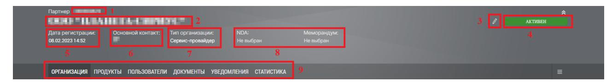

*Рисунок 10. Элементы интерфейса карточки организации*

• название организации (элемент 2) и кнопка редактирования названия (элемент 3);

Редактирование названия организации через иконку доступно только до перехода профиля организации в статус **«Активен»**.

- статус заявки (элемент 4);
- дата и время регистрации (элемент 5);
- фамилия, имя и отчество основного контактного лица в организации (элемент 6);
- тип организации (элемент 7). Подробнее о принципе назначения типа организации см. в разделе «[Таблица соответствия типов организации видам деятельности»](#page-11-0);
- информация о документах, обязательных для типа организации (элемент 8). Подробнее см. в разделе «[Таблица соответствия обязательности документов и типов организаций»](#page-98-0);
- вкладки управления профилем (элемент 9).

Во вкладке **«Организация»** отображаются регистрационные данные, часть которых доступна для редактирования. Подробнее см. в разделе «[Редактирование данных об](#page-22-0) [организации»](#page-22-0);

Сервис-провайдер во вкладке **«Организация»** может получить индивидуальный идентификатор (UUID) в поле **«UUID for SUZ»**, который можно использовать для работы с СУЗ.

## **ОБРАТИТЕ ВНИМАНИЕ**

Индивидуальный идентификатор (UUID) для работы с СУЗ отображается в поле **«UUID for SUZ»** только после подписания [договора ПАК](#page-107-0) со стороны Оператора

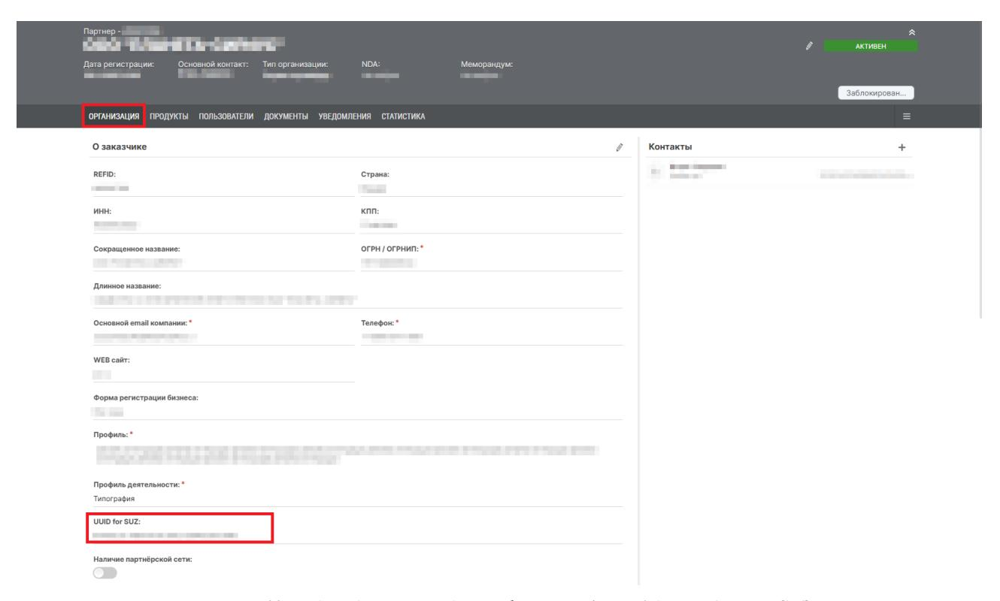

*Рисунок 11. Индивидуальный идентификатор (UUID) для работы с СУЗ*

## **5.2. Редактирование данных об организации**

Для внесения изменений в регистрационные данные, в **«Главном меню»** перейти в раздел **«Моя организация» › «Организация»** и нажать кнопку в карточке организации.

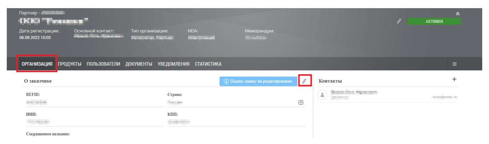

*Рисунок 12. Кнопка редактирования профиля в карточке организации*

В этом режиме доступны для изменения следующие поля:

- **«КПП»**;
- **«Сокращенное название»** (после перехода профиля организации в статус **«Активен»**, значение заблокировано для изменения);
- **«Длинное название»** (после перехода профиля организации в статус **«Активен»**, значение заблокировано для изменения);
- **«Основной email компании»**;
- **«Телефон»**;
- **«WEB сайт»**;
- **«Профиль»**;
- **«Наличие партнёрской сети»** если применимо, активировать перемещением переключателя в правое положение;
- **«Количество партнеров в партнерской сети»** указать значение прямым вводом, если активно значение **«Наличие партнёрской сети»**;
- **«ФИО директора»** указать фамилию, имя и отчество руководителя организации (как в ЕГРЮЛ).

После перехода профиля организации в статус **«Активен»**, значение заблокировано для изменения. Исключением являются организации с единственным типом организации **«Участник оборота товаров»**, для которых возможность изменения поля **«ФИО директора»** не блокируется.

• **«ФИО доверенного лица»**.

Если заполнено, подписать доверенность в разделе **«Документы»**, после добавления соответствующего документа Оператором.

Для корректировки полей, заблокированных после перехода профиля организации в статус **«Активен»**, обратиться в службу технической поддержки по адресу [support@crpt.ru](mailto:support@crpt.ru).

Для редактирования банковских реквизитов см. раздел «[Редактирование банковских](#page-23-0) [реквизитов](#page-23-0)». Банковские реквизиты используются для заполнения NDA (если указаны).

Перечень значений поля **«Профиль деятельности»** может быть отредактирован только Оператором через заявку от пользователя (подробнее см. в разделе «[Подача заявки на изменение](#page-25-0) [перечня видов деятельности](#page-25-0)»).

#### **5.2.1. Редактирование банковских реквизитов**

Для редактирования банковских реквизитов:

- в **«Главном меню»** перейти в раздел **«Моя организация» › «Организация»**;
- в блоке **«Банковские реквизиты»** нажать кнопку ;

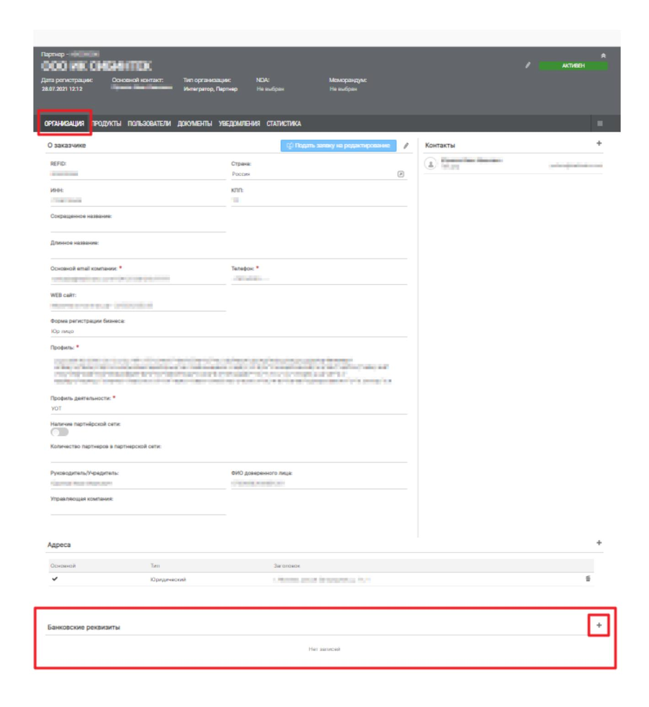

*Рисунок 13. Блок редактирования банковских реквизитов*

• в модальном окне **«Платежные реквизиты»** заполнить поля ввода данных **«БИК»**, **«Банк»**, **«Расчетный счет»**, **«Корр.счет»**, **«Валюта счета»**. Активация переключателя **«По умолчанию»** обозначает, что указанные реквизиты являются основными.

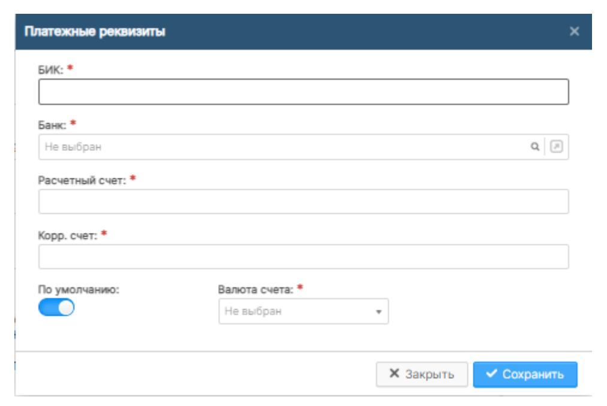

*Рисунок 14. Модальное окно добавления реквизитов*

Повторить указанные действия при необходимости добавления дополнительных банковских реквизитов.

#### **5.2.2. Подача заявки на изменение перечня видов деятельности**

Для изменения типа организации и/или изменения перечня значений в поле **«Профиль деятельности»**:

- в **«Главном меню»** перейти в раздел **«Моя организация» › «Организация»**;
- в правом верхнем углу нажать кнопку **[ Подать заявку на редактирование ]**;

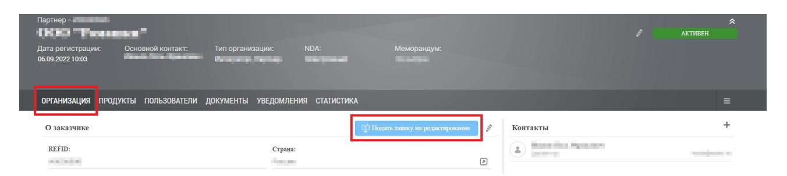

*Рисунок 15. Кнопка подачи заявки на редактирование*

• в модальном окне **«Заявка на редактирование»** в списке **«Профиль деятельности»** выбрать актуальные значения видов деятельности в соответствии с ограничениями для типов организаций (см. раздел «[Таблица соответствия типов организации видам деятельности»](#page-11-0)).

Смена видов деятельности недоступна для типов организаций **«Участник оборота товаров»**, **«Сервис-провайдер»** и **«Самозанятый разработчик»**.

Для типов организации **«Партнёр»** и/или **«Интегратор»** могут быть добавлены любые виды деятельности. При добавлении значения **«УОТ»** к типам организации добавляется значение **«Участник оборота товаров»** (может быть выбрано только в сочетании с другими видами деятельности).

• нажать кнопку **[ Сохранить ]** для отправки заявки на рассмотрение Оператору;

Поданная заявка отображается в разделе **«Заявки»** в **«Главном меню»** в статусе **«Проверка»**. До момента согласования или отклонения заявки, подача повторной заявки невозможна. После одобрения заявки Оператором заявка изменит статус на **«Принята»**, обновлённый перечень видов деятельности отобразится в поле **«Профиль деятельности»**, а актуализированный список типов организации — в заголовке карточки организации (раздел **«Моя организация»** в **«Главном меню»**).

## **5.3. Управление интеграционными и партнёрскими продуктами**

В Реестре интеграторов и партнёров предусмотрено два вида продуктов:

• партнёрские продукты.

К партнёрским продуктам относятся продукты, которые не имеют взаимодействия с API СУЗ, например, онлайн-кассы, УПД Операторы, ТСД сканеры и т.д. Такие продукты не проходят приёмочные испытания на взаимодействие с компонентами ГИС МТ или ФГИС МДЛП, при этом для них обязательно подписание таких документов как Декларация, NDA и Заявление о вступлении в Меморандум.

Подробнее о партнёрских продуктах см. в разделе «[Партнёрские решения](#page-90-0)».

• продукты для интеграции.

К продуктам для интеграции относится программное обеспечение, которое предназначено для взаимодействия с API СУЗ и требует тестирования со стороны Оператора согласно методике проверки пусконаладочных работ, принятой для API СУЗ. Версии программного обеспечения, прошедшие приёмочные испытания, получают статус **«Допущен в промышленную среду»**, а также уникальный ключ регистрации для работы на промышленном контуре ГИС МТ или ФГИС МДЛП. Доступ к такому программному обеспечению появляется в пользовательском интерфейсе СУЗ в разделе **«Реестр интеграционных решений»** для всех участников оборота товаров (при соответствующих настройках видимости).

При этом также обязательно подписание таких документов как Декларация, NDA и Заявление о вступлении в Меморандум.

Подробнее о продуктах к интеграции см. в разделе «[Продукты к интеграции](#page-27-0)». Подробнее о статистике использования интеграционных продуктов см. в разделе «[Просмотр статистики](#page-110-0) Таблица доступности продуктов по типам организаций представлена ниже.

| Тип организации          | Продукт              | Испытание СУЗ |
|--------------------------|----------------------|---------------|
| Партнёр                  |                      | —             |
| Интегратор               | Партнёрское решение  | —             |
| Сервис-провайдер         |                      | —             |
| Интегратор               |                      | +             |
| Участник оборота товаров | Продукт к интеграции | +             |
| Самозанятый разработчик  |                      | +             |

#### **5.3.1. Продукты к интеграции**

Работа с продуктами для интеграции в Реестре интеграторов и партнёров доступна организациям с типами организации **«Интегратор»**, **«Участник оборота товаров»** и **«Самозанятый разработчик»**.

Для регистрации продукта к интеграции и получения версией продукта статуса **«Допущен в промышленную среду»**:

- зарегистрировать продукт в Реестре интеграторов и партнёров (см. раздел [«Регистрация](#page-28-0) [продукта к интеграции](#page-28-0)»);
- самостоятельно протестировать продукт согласно методике проверки пусконаладочных работ, принятой для API СУЗ.

Для ознакомления с методикой, в **«Главном меню»** выбрать раздел **«База знаний»**, перейти по ссылке **«Методика проверки пусконаладочных работ RU»** и скачать описание в формате \* .pdf.

- подать заявку на приёмочные испытания в СУЗ и протестировать интеграцию с СУЗ по API:
  - с участием службы технической поддержки Оператора (см. раздел [«Тестирование с](#page-35-0) [участием службы технической поддержки Оператора»](#page-35-0));
  - без участия службы технической поддержки Оператора (см. раздел [«Автотестирование](#page-81-0) [интеграционного решения](#page-81-0)»).

Данная возможность доступна при отсутствии активных заявок на проведение приёмочных испытаний совместно с Оператором;

• при необходимости добавить доверенные ИНН (см. раздел «[Добавление доверенных ИНН»](#page-87-0)).

#### **5.3.1.1. Регистрация продукта к интеграции**

Для регистрации продукта к интеграции:

- в **«Главном меню»** перейти в раздел **«Моя организация» › «Продукты»**;
- в блоке **«Продукты к интеграции»** нажать кнопку **[ Добавить продукт к интеграции ]**;

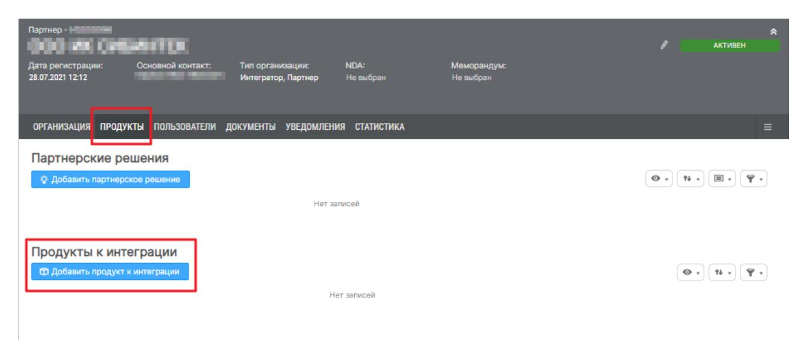

*Рисунок 16. Расположение кнопки добавления продукта к интеграции*

Если в течение дня после регистрации организации в Реестре интеграторов и партнёров кнопка не отобразилась, то обратиться в службу технической поддержки, направив письмо на почту [partners@crpt.ru](mailto:partners@crpt.ru) с копией на адрес [integrators@crpt.ru.](mailto:integrators@crpt.ru)

- в модальном окне **«Новый продукт»** заполнить поля ввода (обязательные поля отмечены красной звёздочкой):
  - **«Наименование»** указать наименование продукта прямым вводом в соответствии с правоустанавливающими документами (в случае, если ПО зарегистрировано в Роспатенте);

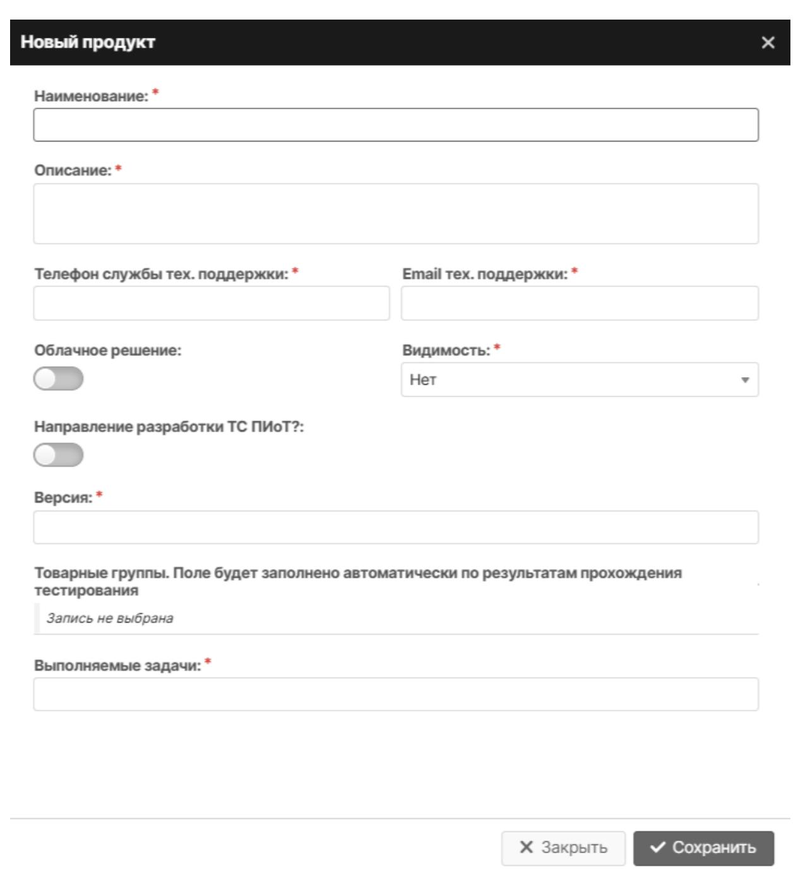

Рисунок 17. Модальное окно добавления продукта к интеграции

- «Описание» / «Описание / Состав модели ТС ПИоТ» (отображается, если активировано поле «Направление разработки ТС ПИоТ?») указать описание ПО прямым вводом, достаточное для идентификации его качеств участниками оборота товаров;
- «Телефон службы тех. поддержки» указать значение прямым вводом в свободной форме;
- «**Email тех. поддержки»** указать значение прямым вводом;
- «Облачное решение» если применимо, активировать значение перемещением переключателя вправо.

Активация значения подтверждает, что программное обеспечение является облачным

решением с авторизацией на web-сервисе и возможностью подключения множества участников оборота товаров;

• «Направление разработки ТС ПИоТ?» — если применимо, активировать значение перемещением переключателя вправо.

Активация значения подтверждает, что программное обеспечение является продуктом ТС ПИоТ, а также позволит подать заявку на приёмочные испытания;

• «**Версия**» — указать номер версии программного обеспечения, которая будет протестирована в рамках приёмочных испытаний в СУЗ.

Регистрация новых версий продукта производится в упрощённом режиме. Подробнее см. в разделе «Регистрация новых версий продукта».

• «Видимость» — выбрать значение выпадающего списка («Да» / «Нет»).

Если выбрано «Да», то после успешного прохождения приёмочных испытаний продукт будет отображаться в Реестре протестированных интеграционных решений СУЗ.

Если программное обеспечение разрабатывается для личного (некоммерческого) использования, выбрать **«Нет»**.

- «Выполняемые задачи» привести описание задач, выполняемых продуктом в рамках указанной версии. Данное описание позволяет участникам оборота товаров идентифицировать реализованные функции продукта по конкретной версии.
- нажать кнопку [ Сохранить ] для завершения регистрации продукта;
- заполнить анкету по продукту (подробнее см. в разделе «Заполнение анкеты по продукту»);
- после заполнения анкеты и подтверждения корректности со стороны Оператора, ознакомиться и подписать обязательные документы, размещённые Оператором в разделе «Моя организация» > «Документы» (подробнее см. в разделе «Подписание документов») в соответствии с таблицей, указанной в разделе «Таблица соответствия обязательности документов и типов организаций»:
  - Декларация на продукт;
  - Заявление о вступлении в Меморандум;
  - NDA.

#### 5.3.1.1.1. Перевод продукта к интеграции в статус «Недействителен»

Для версий интеграционных продуктов в статусе «**Новый**», то есть до момента подачи заявки на приёмочные испытания в СУЗ, доступен перевод версии в статус «**Недействителен**» для обеспечения возможности завершения жизненного цикла неактуальных версий продуктов.

#### **ОБРАТИТЕ ВНИМАНИЕ**

При неуспешном прохождении приёмочных испытаний для версий интеграционных продуктов в статусе **«Зарегистрирован»** доступен перевод версии в статус **«Недействителен»**

Для перевода версии продукта в статус **«Недействителен»** в **«Главном меню»** перейти в раздел **«Моя организация» › «Продукты»** и в блоке **«Продукты к интеграции»** в строке с названием неактуальной версии продукта нажать кнопку **[ Новый ]** / **[ Зарегистрирован ]** и выбрать действие **«Недействителен»**.

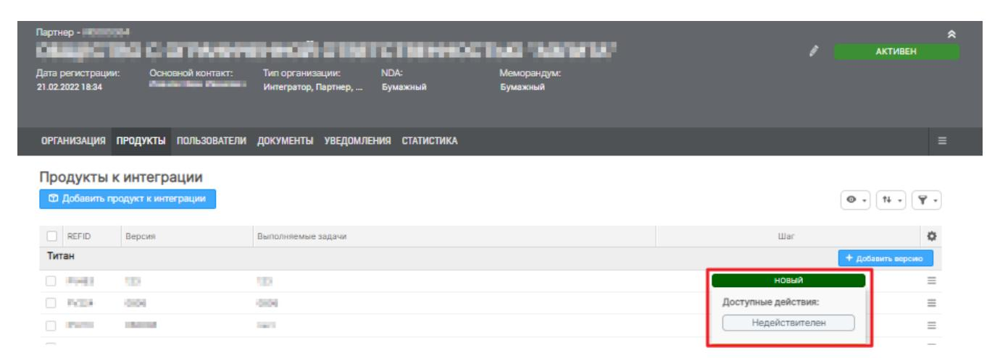

*Рисунок 18. Изменение статуса версии продукта через вкладку с перечнем продуктов*

Альтернативный способ перевода версии продукта в статус **«Недействителен»**: в **«Главном меню»** перейти в раздел **«Моя организация» › «Продукты»**, в блоке **«Продукты к интеграции»** перейти в карточку версии продукта нажатием на строку с названием версии. В левом нижнем углу окна нажать кнопку **[ Недействителен ]**.

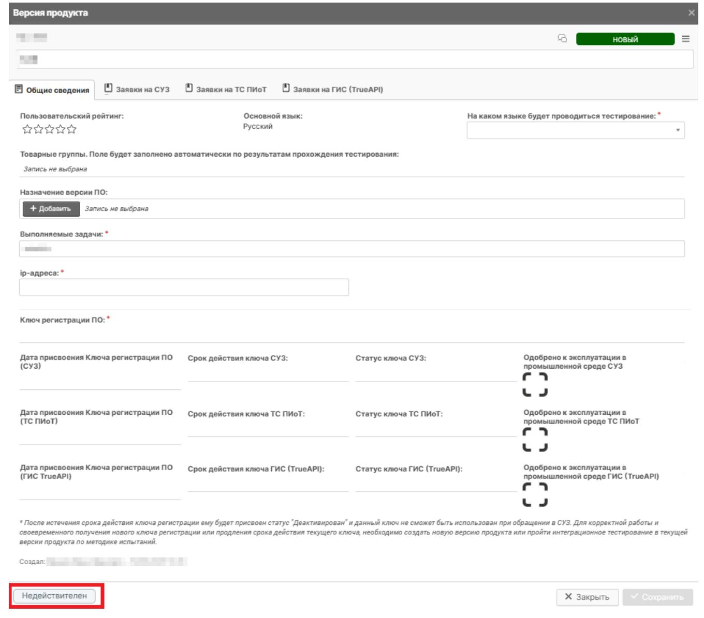

*Рисунок 19. Изменение статуса версии продукта через карточку версии*

#### **5.3.1.1.2. Регистрация новых версий продукта**

Для регистрации новой версии ранее зарегистрированного продукта:

• в **«Главном меню»** перейти в раздел **«Моя организация» › «Продукты»** и в блоке **«Продукты к интеграции»** в строке с названием продукта нажать кнопку **[ Добавить версию ]** для перехода в модальное окно **«Детали версии продукта»**;

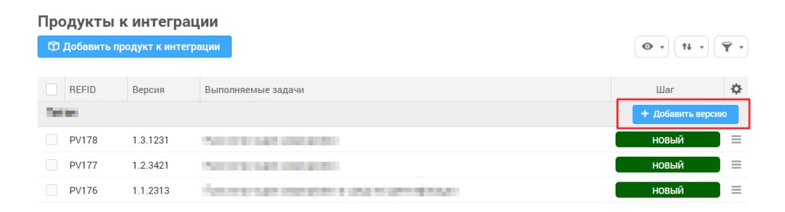

*Рисунок 20. Переход в модальное окно добавления версии через панель продуктов*

- в модальном окне **«Детали версии продукта»** заполнить поля ввода (обязательные поля отмечены красной звёздочкой):
  - **«Продукт»** проверить правильность указания продукта.

При необходимости выбрать другой продукт из списка зарегистрированных нажатием кнопки . Для просмотра сведений о продукте перейти в карточку продукта нажатием кнопки .

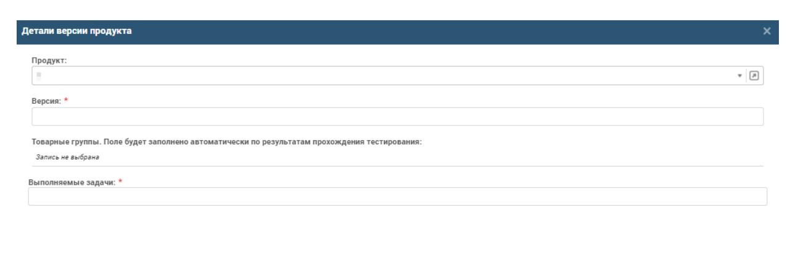

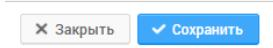

*Рисунок 21. Модальное окно добавления новой версии продукта*

- **«Версия»** указать номер версии;
- **«Выполняемые задачи»** привести описание задач, выполняемых продуктом в рамках указанной версии. Данное описание позволяет участникам оборота товаров идентифицировать реализованные функции продукта по конкретной версии;

• нажать кнопку **[ Сохранить ]**.

#### **5.3.1.1.3. Регистрация новых версий продукта ТС ПИоТ**

Для регистрации новой версии ранее зарегистрированного продукта ТС ПИоТ:

• в **«Главном меню»** перейти в раздел **«Моя организация» › «Продукты»** и в блоке **«Продукты к интеграции»** в строке с названием продукта нажать кнопку **[ Добавить версию ]** для перехода в модальное окно **«Детали версии продукта»**;

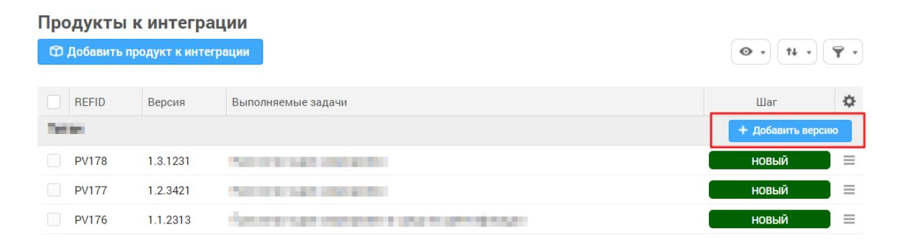

*Рисунок 22. Переход в модальное окно добавления версии через панель продуктов*

- в модальном окне **«Детали версии продукта»** заполнить поля ввода (обязательные поля отмечены красной звёздочкой):
  - **«Продукт»** проверить правильность указания продукта.

При необходимости выбрать другой продукт из списка зарегистрированных нажатием кнопки . Для просмотра сведений о продукте перейти в карточку продукта нажатием кнопки .

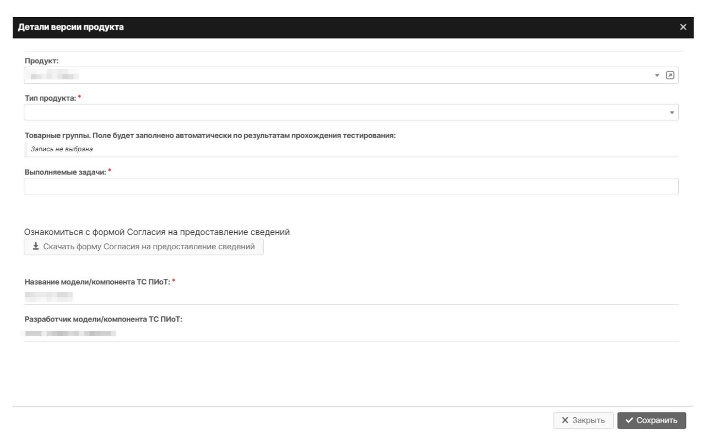

*Рисунок 23. Модальное окно добавления новой версии продукта ТС ПИоТ*

◦ **«Тип продукта»** — выбрать из выпадающего списка. Возможные значения: **«Модель ТС ПИоТ»** или **«Компонерт ТС ПИоТ»**.

В зависимости от выбранного типа продукта заполните дополнительные поля (обязательные поля отмечены красной звёздочкой);

- **«Выполняемые задачи»** привести описание задач, выполняемых продуктом в рамках указанной версии. Данное описание позволяет участникам оборота товаров идентифицировать реализованные функции продукта по конкретной версии;
- нажать кнопку **[ Сохранить ]**.

#### **5.3.1.2. Тестирование с участием службы технической поддержки Оператора**

#### **5.3.1.2.1. Подача заявки на приёмочные испытания в СУЗ**

После регистрации продукта (см. раздел [«Регистрация продукта к интеграции](#page-28-0)») подать заявку на приёмочные испытания в СУЗ:

- в **«Главном меню»** перейти в раздел **«Моя организация» › «Продукты»**;
- в блоке **«Продукты к интеграции»** перейти в карточку той версии продукта, на которую будет подаваться заявка на приёмочные испытания в СУЗ. Для перехода нажать на строку с номером версии;

*Рисунок 24. Переход в карточку версии продукта*

- в карточке версии во вкладке **«Общие сведения»** заполнить поля ввода (обязательные поля отмечены красной звёздочкой):
  - **«На каком языке будет проводиться тестирование»** выбрать значение выпадающего списка (**«Русский»** / **«Английский»**);
  - **«Товарные группы»** заполняется автоматически после успешного завершения приёмочных испытаний и перехода протестированной версия продукта в статус **«Допущен в промышленную среду»**;
  - **«Выполняемые задачи»** заполняется автоматически на основании данных, указанных в заявке на регистрацию продукта к интеграции;
  - **«ip-адреса»** (активно только для облачных решений) заполнить список ip-адресов, с которых будут отправляться запросы в СУЗ во время приёмочных испытаний. Взаимодействие с другими ip-адресами во время испытаний будет заблокировано;
  - нажать кнопку **[ Сохранить ]**.

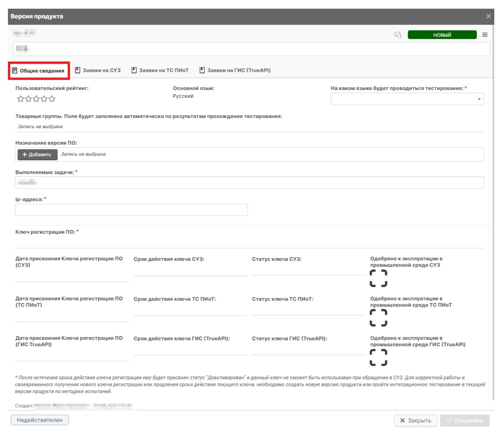

*Рисунок 25. Общие сведения*

- в карточке версии перейти во вкладку **«Заявки на СУЗ»** и заполнить поля ввода (обязательные поля отмечены красной звёздочкой):
  - **«ИНН/ИТИН зарегистрированной орг-ии на Песке ГИСМТ/Песке МДЛП»** указать идентификационный номер организации, зарегистрированной на демонстрационном контуре [ГИС](https://markirovka.sandbox.crptech.ru) МТ (указать ИНН) или [ФГИС МДЛП](https://sb.mdlp.crpt.ru/) (указать ИТИН). Допустимы только численные значения.
    - ИНН / ИТИН должен соответствовать значению, указанному в разделе **«Профиль»** в пользовательском интерфейсе [ГИС](https://markirovka.sandbox.crptech.ru) МТ или [ФГИС МДЛП;](https://sb.mdlp.crpt.ru/)
  - **«Идентификатор организации на Песке ГИСМТ/Песке МДЛП (id / sys\_id)»** указать ID участника в [ГИС](https://markirovka.sandbox.crptech.ru) МТ или [ФГИС МДЛП](https://sb.mdlp.crpt.ru/). Допустимы численные значения (для МДЛП допустимы значения в формате UUID).

Значение указано в пользовательском интерфейсе [ГИС](https://markirovka.sandbox.crptech.ru) МТ или [ФГИС МДЛП](https://sb.mdlp.crpt.ru/) в разделе **«Профиль» › «Данные участника»** в блоке **«Участие в системе»** в поле **«ID участника»**;

◦ **«omsId»** — указать идентификатор omsId участника в СУЗ.

Значение идентификатора omsId можно узнать в СУЗ. Для этого в пользовательском интерфейсе ГИС МТ или ФГИС МДЛП в **«Главном меню»** перейти в раздел **«Управление заказами» › «Устройства»** и скопировать значение идентификатор omsId, указанное в левом верхнем углу **«Главного окна»**;

- **«Осведомлен, что для тестирования метода integration/connection нужно использовать следующий registrationKey = 4344d884-7f21-456c-981e-cd68e92391e8»** ознакомиться с текстом и передвинуть переключатель в активное состояние;
- нажать кнопку **[ Сохранить ]**.
- нажать кнопку **[ Подать заявку на приемочные испытания СУЗ ]**;

### **ОБРАТИТЕ ВНИМАНИЕ**

Кнопка **[ Подать заявку на приемочные испытания СУЗ ]** недоступна, если текущая версия продукта находится на шаге **«Недействителен»**

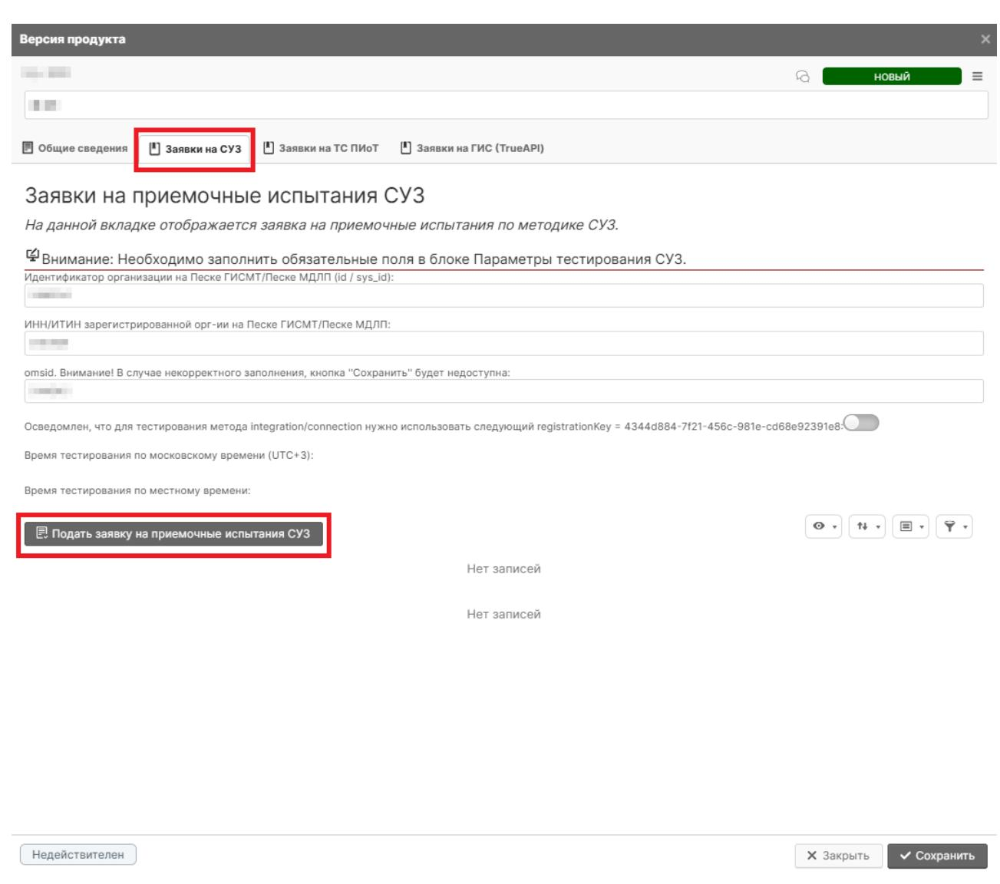

*Рисунок 26. Кнопка подачи заявки на приёмочные испытания СУЗ*

- заполнить поля модального окна **«Заявка на приемочные испытания»** (обязательные поля отмечены красной звёздочкой):
  - **«Товарные группы»** добавить товарную группу, для которой будут проводиться приёмочные испытания продукта по установленной методике тестирования, нажатием кнопки **[ Добавить ]**. Для добавления дополнительных товарных групп нажать кнопку

**[ Добавить ]** повторно. Для удаления значения из списка нажать . Для ознакомления с методикой, в **«Главном меню»** выбрать раздел **«База знаний»**, перейти по ссылке **«Методика проверки пусконаладочных работ RU»** и скачать описание в формате \* .pdf.

Недопустимо выбирать товарную группу «Лекарственные препараты» совместно с другими товарными группами;

◦ **«Зарегистрирован на Песке ГИСМТ или Песке МДЛП»** — активировать, если применимо.

На момент подачи заявки на приёмочные испытания организация должна иметь регистрацию на демонстрационном контуре [ФГИС МДЛП](https://sb.mdlp.crpt.ru/) (для испытаний в товарной группе «Лекарственные препараты») или [ГИС](https://markirovka.sandbox.crptech.ru) МТ (для испытаний в других товарных группах);

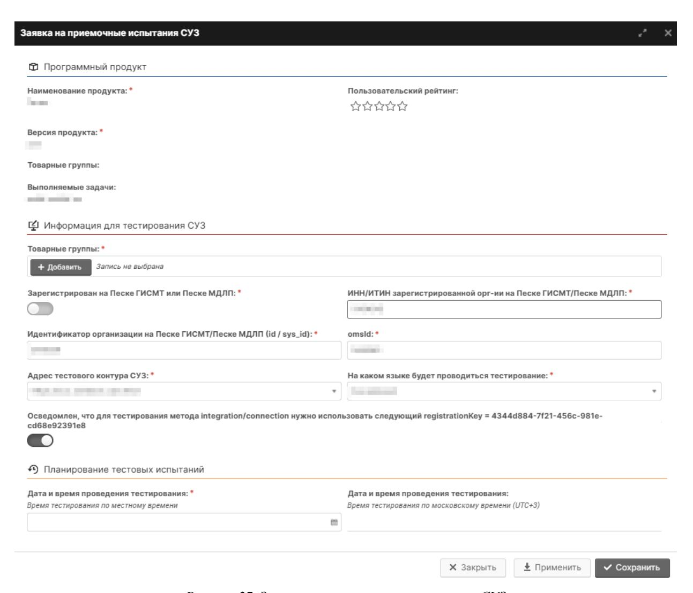

*Рисунок 27. Заявка на приёмочные испытания в СУЗ*

- **«ИНН/ИТИН зарегистрированной орг-ии на Песке ГИСМТ/Песке МДЛП»** заполняется автоматически на основании данных, указанных в карточке версии во вкладке **«Заявки на СУЗ»**;
- **«Идентификатор организации на Песке ГИСМТ/Песке МДЛП (id / sys\_id)»** заполняется автоматически на основании данных, указанных в карточке версии во вкладке **«Заявки на СУЗ»**;
- **«omsId»** заполняется автоматически на основании данных, указанных в карточке версии во вкладке **«Заявки на СУЗ»**;
- **«Адрес тестового контура СУЗ»** выбрать одно из значений списка:
  - <https://intpharma.crpt.ru:12001> для ФГИС МДЛП;
  - <https://suz.sandbox.crptech> для ГИС МТ.
- **«На каком языке будет проводиться тестирование»** заполняется автоматически на основании данных, указанных в карточке версии во вкладке **«Общие сведения»**;
- **«Осведомлен, что для тестирования метода integration/connection нужно использовать следующий registrationKey = 4344d884-7f21-456c-981e-cd68e92391e8»** —

ознакомиться с текстом и передвинуть переключатель в активное состояние;

- **«Дата и время проведения тестирования: Время тестирования по Московскому времени (UTC+3)»** — заполняется автоматически;
- **«Дата и время проведения тестирования: Время тестирования по местному времени»** — предложить дату и время проведения приёмочных испытаний по местному времени нажатием кнопки . Время начала тестирования должно быть указано только в промежутке с 8:00 до 18:00 МСК включительно. При попытке указания времени, несоответствующему допустимому диапазону отобразиться предупреждение: **«Выбранное время вне допустимого диапазона 08:00-18:00 включительно по московскому времени»**.
- нажать кнопку **[ Сохранить ]** для завершения создания заявки.

Сформированная заявка будет направлена на согласование Оператору, а версия продукта перейдёт в статус **«Назначение даты тестирования»**.

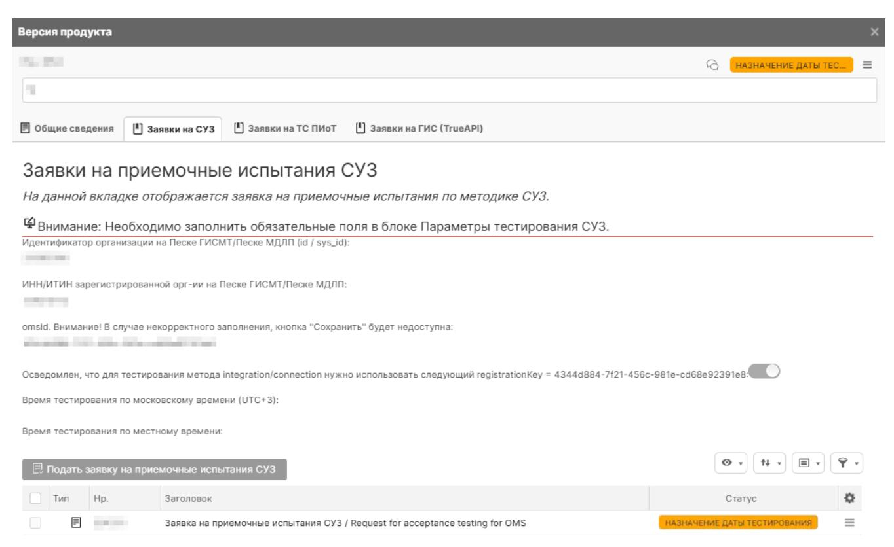

*Рисунок 28. Сформированная заявка*

Для переноса даты приёмочных испытаний, в карточке версии перейти во вкладку **«Заявки на СУЗ»** и нажать на строку с заявкой в статусе **«Назначение даты тестирования»**. В карточке заявки нажать кнопку **[ Отменить… ]** в левом нижнем углу окна, после чего назначить новую дату приёмочных испытаний нажатием кнопки **[ Назначить дату тестирования… ]** после активации обязательных переключателей. В диалоговом окне сохранения изменений выбрать **«Да»**, после чего выбрать новую дату в форме выбора в нижней части карточки заявки нажатием

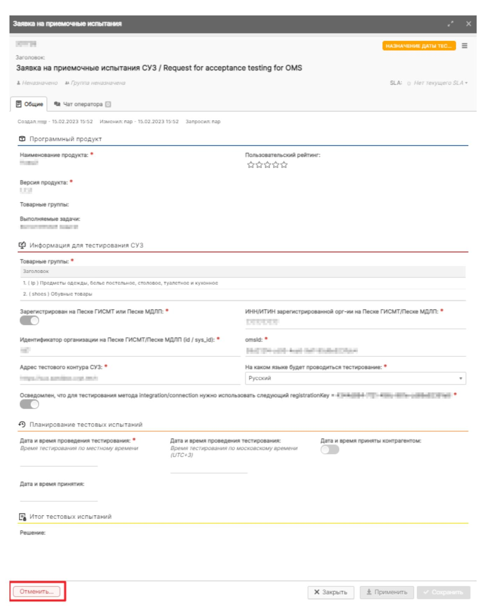

*Рисунок 29. Отмена заявки*

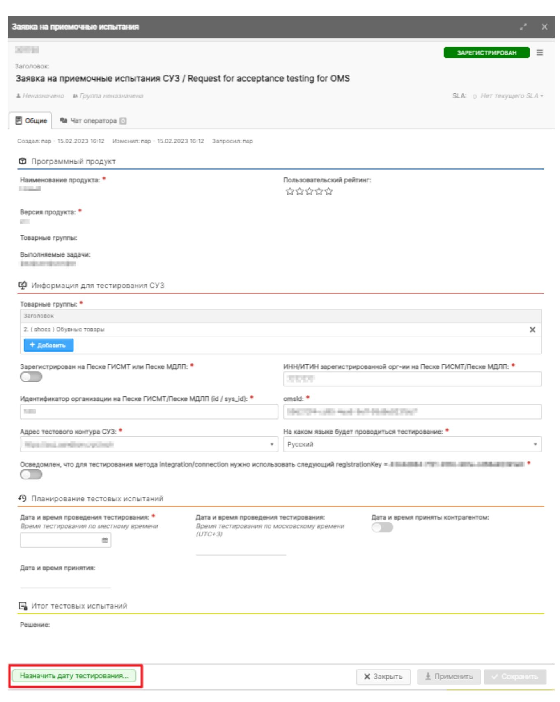

*Рисунок 30. Кнопка перехода к назначению новой даты испытаний*

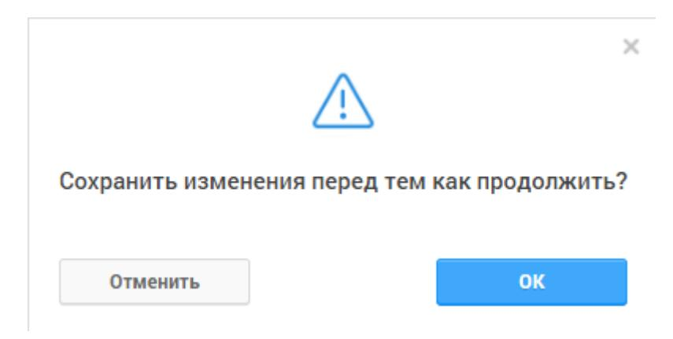

*Рисунок 31. Сохранение изменений*

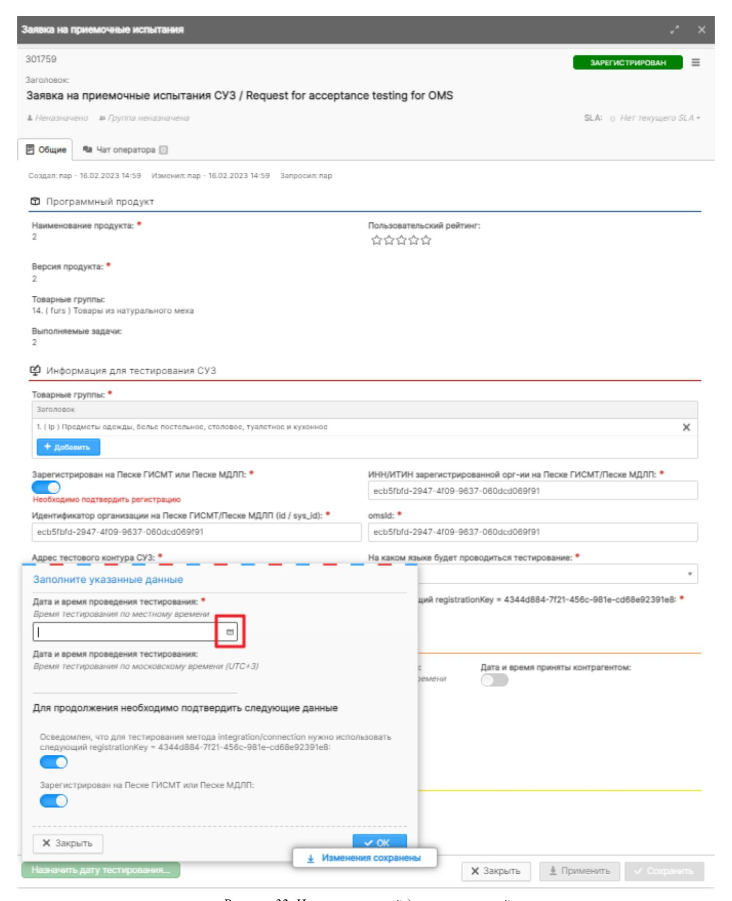

*Рисунок 32. Назначение новой даты испытаний*

После рассмотрения заявки Оператор может предложить другое время проведения приёмочных испытаний. В этом случае заявка переходит в статус **«Согласование даты тестирования»**, после чего на почту основного контактного лица организации поступит уведомление о предложенной дате проведения испытаний.

*Рисунок 33. Уведомление о дате проведения испытаний*

Для согласования предложенного времени перейти в карточку версии, затем во вкладку **«Заявки в СУЗ»**, далее перейти в карточку заявки нажатием на строку с названием заявки в статусе **«Согласование даты тестирования»**. В карточке заявки подтвердить предложенное время нажатием кнопки **[ Принять… ]** или предложить другое время нажатием кнопки **[ Предложить свою дату и время… ]**. Процесс согласования заявки продолжается до утверждения даты и времени проведения приёмочных испытаний обеими сторонами.

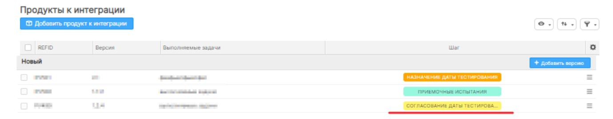

*Рисунок 34. Заявка в состоянии согласования даты тестирования*

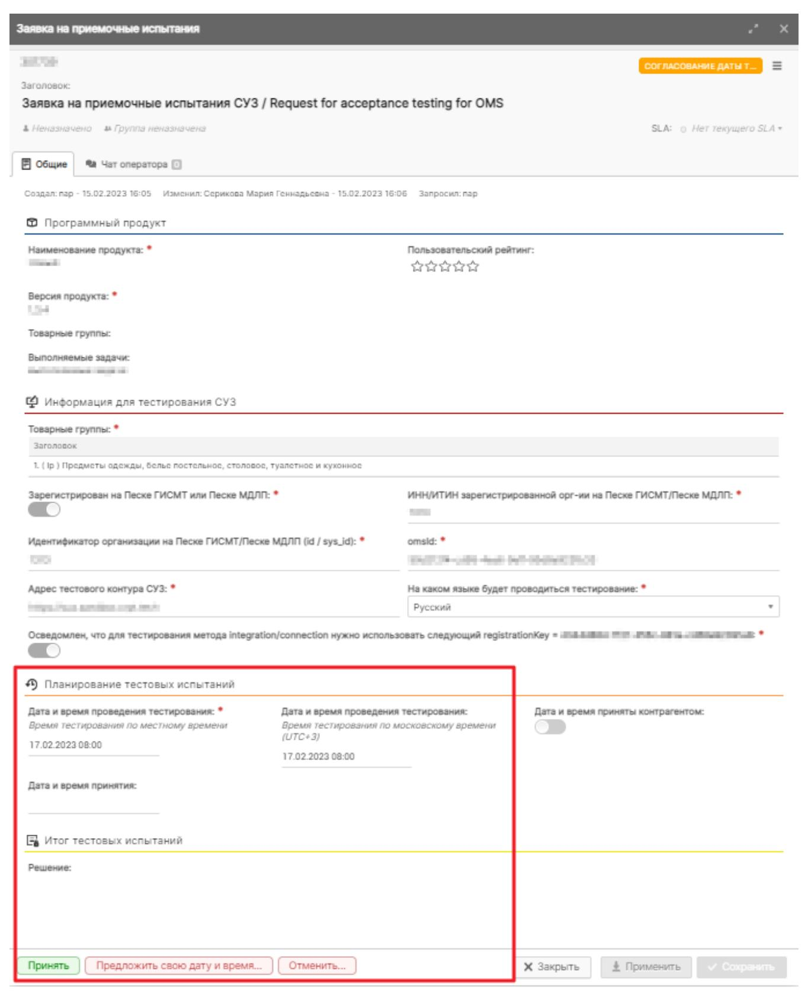

*Рисунок 35. Кнопки согласования даты тестирования*

Согласованная заявка переходит в статус **«Приемочные испытания»**. Во вкладке **«Заявки на СУЗ»** в столбце **«Дата и время принятия»** отобразится дата и время принятия заявки (при согласовании новой даты тестирования дата и время принятия заявки изменяется), в столбце **«Дата и время приняты контрагентом»** отобразится галочка (при соответствующих настройках отображения таблицы).

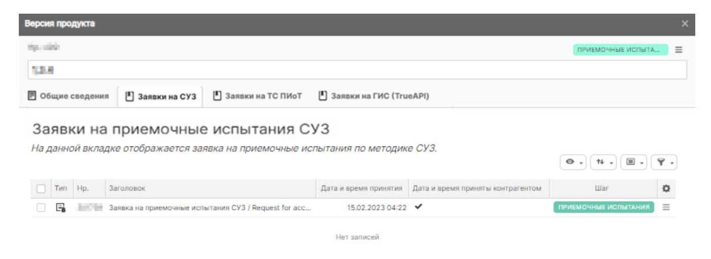

*Рисунок 36. Заявка в состоянии приемочные испытания*

Для настройки выводимых столбцов во вкладке **«Заявки на СУЗ»** нажать кнопку и в выпадающем меню выбрать **«Выбрать список полей»**.

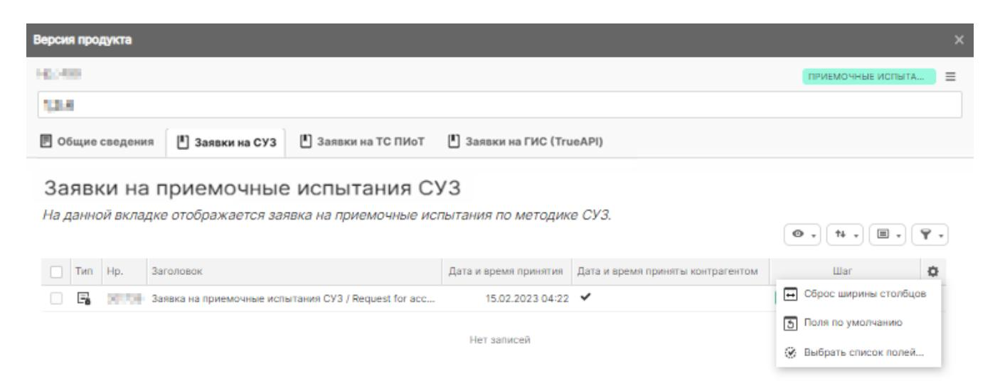

*Рисунок 37. Настройка выводимых столбцов*

В открывшемся окне **«Настройка отображения таблицы»** в левом столбце **«Доступные поля»** отображается перечень всех доступных полей. Видимые столбцы во вкладке **«Заявки на СУЗ»** отображаются в правом столбце **«Отображать поля»**. Для добавления отображения необходимого поля установить флажок выбора данных напротив соответствующего поля в столбце **«Доступные поля»**, для удаления отображения необходимого поля нажать иконку , расположенную напротив соответствующего поля в столбце **«Отображать поля»**, после чего нажать кнопку **[ Применить ]**.

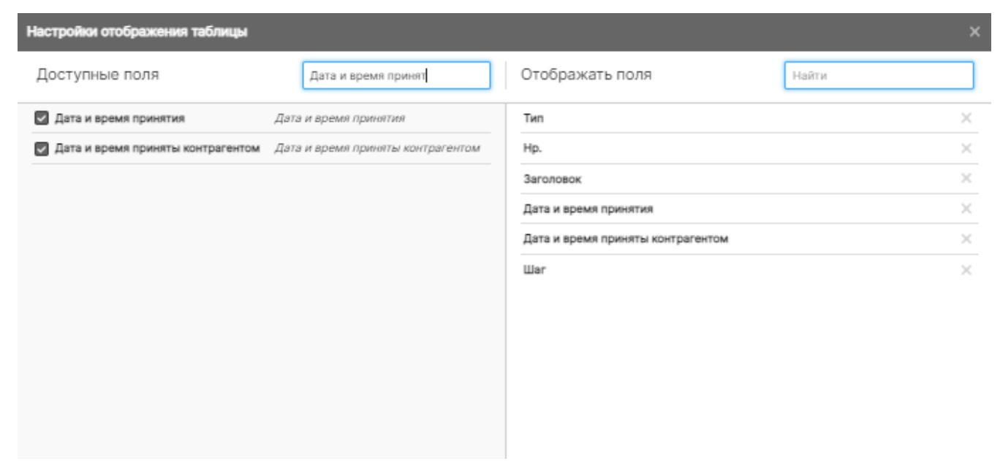

*Рисунок 38. Настройка отображения таблицы*

Для согласования деталей проведения тестирования в Реестре интеграторов и партнёров доступна возможность обмена сообщениями по заявке со службой технической поддержки Оператора (подробнее см. раздел «[Переход в чат с Оператором](#page-74-0)»).

#### **5.3.1.2.2. Подача заявки на приёмочные испытания ТС ПИоТ**

Перед регистрацией продукта ТС ПИоТ необходимо проверить, чтобы был выбран профиль деятельности «Интегратор программных и аппаратных Решений», а также один или несколько профилей деятельности, связанных с ТС ПИоТ: «Разработчик модели ТС ПИоТ», «Разработчик компонент ТС ПИоТ», «Разработчик Библиотеки» и «Разработчик интеграции с Библиотекой». Если необходимые профили деятельности не выбраны, то перейти во вкладку **«Организация»** и нажать **[ Подать заявку на редактирование ]**.

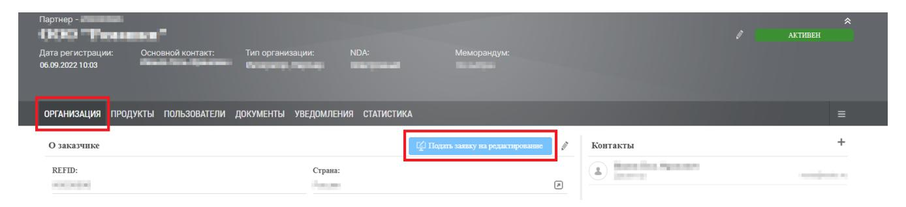

*Рисунок 39. Кнопка подачи заявки на редактирование*

Далее установить необходимые значения и нажать **[ Сохранить ]**.

|              | Поиск                                                                                                         | Q |
|--------------|---------------------------------------------------------------------------------------------------------------|---|
| <b>✓</b>     | Интегратор программных и аппаратных Решений                                                                   |   |
|              | Консалтинговая деятельность                                                                                   |   |
|              | Оператор фискальных данных                                                                                    |   |
|              | Оператор электронного документооборота                                                                        |   |
|              | Производитель контрольно-кассовой техники                                                                     |   |
|              | Производитель, импортер 2D сканеров                                                                           |   |
|              | Производитель, импортер маркираторов, аппликаторов, оборудования, обеспечивающего обнаружение, автоматический |   |
|              | Производитель, импортер принтеров этикеток/чеков                                                              |   |
|              | Производитель, импортер терминалов сбора данных (ТСД)                                                         |   |
|              | Разработка ПО для сервис-провайдеров                                                                          |   |
|              | Разработчик ПО Track&Trace\Mapкиpовки и прослеживаемости                                                      |   |
|              | Разработчик ПО для вендинговых аппаратов, производитель вендинговых аппаратов                                 |   |
|              | Разработчик кассового программного обеспечения                                                                |   |
| $\checkmark$ | Разработчик компонент ТС ПИоТ                                                                                 |   |
| $\checkmark$ | Разработчик модели ТС ПИоТ                                                                                    |   |
|              | Разработчик программно-аппаратных комплексов криптографии и средств информационной защиты                     |   |
|              | Разработчик систем планирования ресурсов и процессов (ERP системы)                                            |   |

*Рисунок 40. Выбор профиля деятельности*

После получения подтверждения по заявке на изменение профиля деятельности можно перейти к регистрации продукта ТС ПИоТ и подаче заявки на приёмочные испытания ТС ПИоТ.

После регистрации продукта (см. раздел [«Регистрация продукта к интеграции](#page-28-0)») подать заявку на приёмочные испытания ТС ПИоТ:

#### **ОБРАТИТЕ ВНИМАНИЕ**

При регистрации продукта к интеграции переключатель **«Продукт ТС ПИОТ»** должен быть активирован. В противном случае подача заявки на приёмочные испытания будет недоступна.

На всех этапах работы с заявкой на электронную почту будут направляться уведомления с результатами проверки. Со всеми сформированными уведомлениями можно ознакомиться во вкладке **«Документы»**

- в **«Главном меню»** перейти в раздел **«Моя организация» › «Продукты»**;
- в блоке **«Продукты к интеграции»** перейти в карточку той версии продукта, на которую будет подаваться заявка на приёмочные испытания ТС ПИоТ. Для перехода нажать на строку с номером версии;

#### **ОБРАТИТЕ ВНИМАНИЕ**

Если у продукта уже есть версия типа **«Компонент ТС ПИоТ»** со статусом **«Допущен в промышленную среду»**, то для новой версии заявку на приёмочные испытания можно подать в уведомительном режиме. При этом не требуются согласие на предоставление сведений и заявление о проверке функциональной совместимости, а заявка автоматически перейдёт в статус **«Закрыта»**

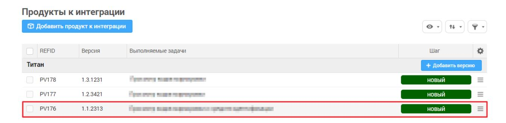

*Рисунок 41. Переход в карточку версии продукта*

• в карточке версии во вкладке **«Общие сведения»** заполнить поля ввода (обязательные поля отмечены красной звёздочкой):

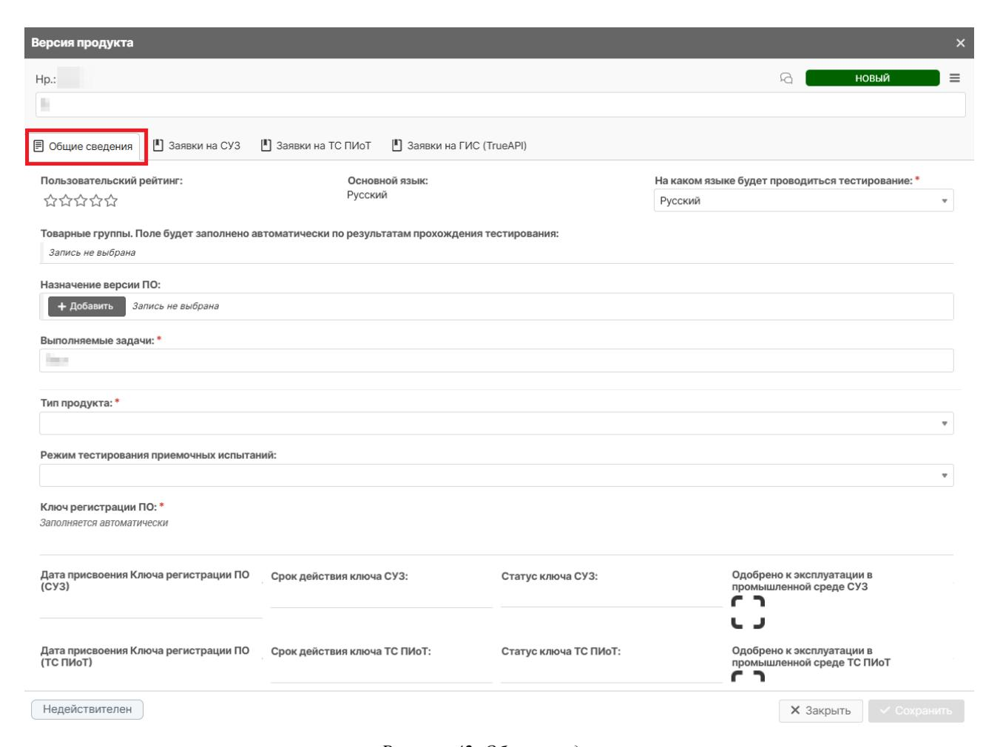

*Рисунок 42. Общие сведения*

◦ **«На каком языке будет проводиться тестирование»** — выбрать значение выпадающего списка (**«Русский»** / **«Английский»**);

- **«Товарные группы»** заполняется автоматически после успешного завершения приёмочных испытаний и перехода протестированной версия продукта в статус **«Допущен в промышленную среду»**;
- **«Выполняемые задачи»** заполняется автоматически на основании данных, указанных в заявке на регистрацию продукта к интеграции;
- **«Тип продукта»** выбрать из выпадающего списка. Возможные значения: **«Модель ТС ПИоТ»** и **«Компонент ТС ПИоТ»**.

Под компонентом ТС ПИоТ подразумевается, в том числе, ПМСР — Программный модуль формирования сведений о расчетах.

В зависимости от выбранного значения будут отличаться заполняемые поля версии продукта во вкладке **«Общие сведения»**;

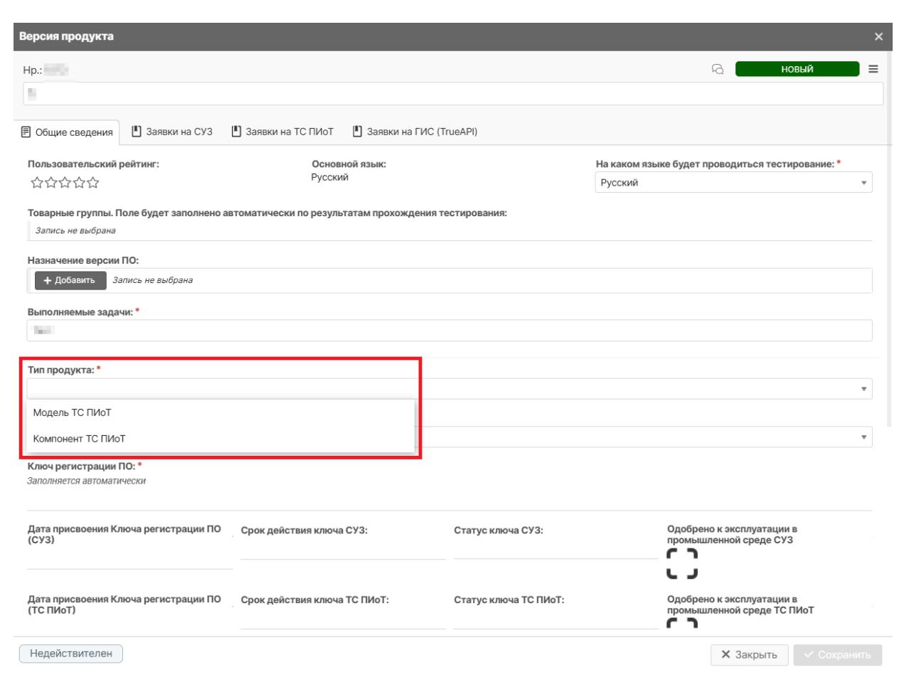

*Рисунок 43. Тип продукта*

◦ **«Согласен с предоставлением сведений»** — активировать значение перемещением переключателя вправо.

После активации переключателя обязательные для заполнения поля будут отмечены красной звёздочкой.

◦ **Тип компоненты ТС ПИОТ** (для типа продукта **«Компонент ТС ПИоТ»**) — выбрать из

выпадающего списка. Возможные значения:

- **«Драйвер ТС ПИоТ»**;
- **«Драйвер контрольно-кассовой техники»**;
- **«Драйвер Сканеров»**;
- **«Программное обеспечение»**;
- **«Библиотека ТС ПИоТ»** (только для профиля деятельности «Разработчик Библиотеки»);
- **«Интеграция с Библиотекой ТС ПИоТ»** (только для профиля деятельности «Разработчик интеграции с Библиотекой»).
- **Режим тестирования приемочных испытаний** (для типа продукта **«Компонент ТС ПИоТ»**) — выбрать из выпадающего списка. Возможные значения:
  - **«Заявительный режим»**;
  - **«Уведомительный режим»**.

Рекомендуется передавать максимально полные сведения о продукте для исключения дополнительных вопросов и уточнений со стороны специалистов, которые будут проводить экспертизы. Для этого необходимо согласиться с предоставлением сведений.

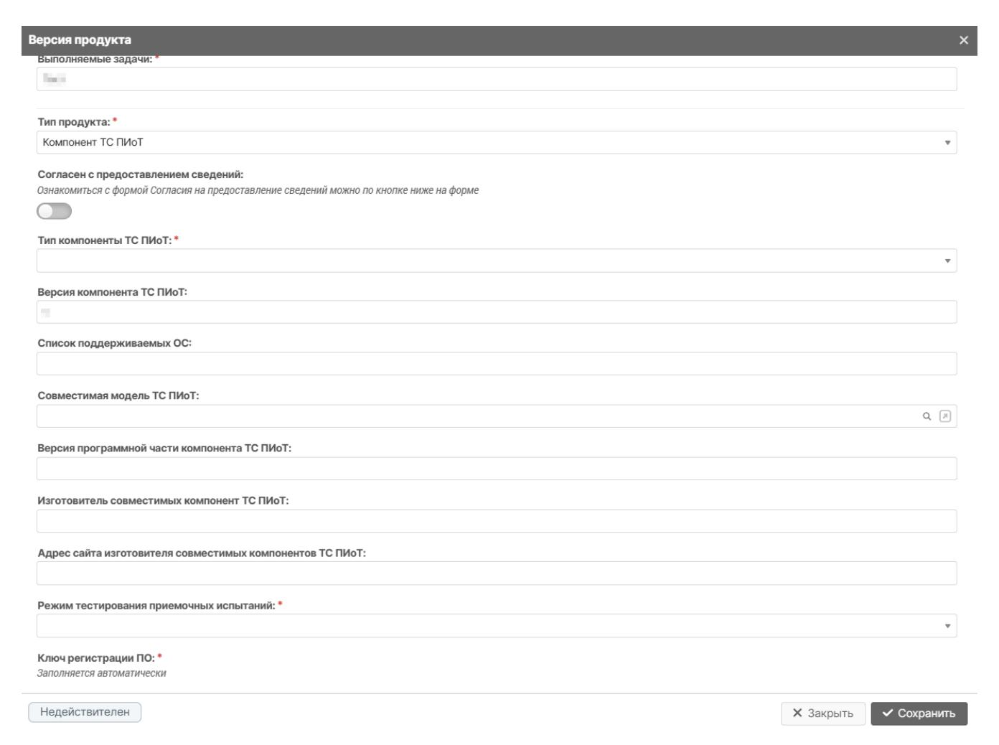

Рисунок 44. Поля для заполнения Компонента ТС ПИоТ

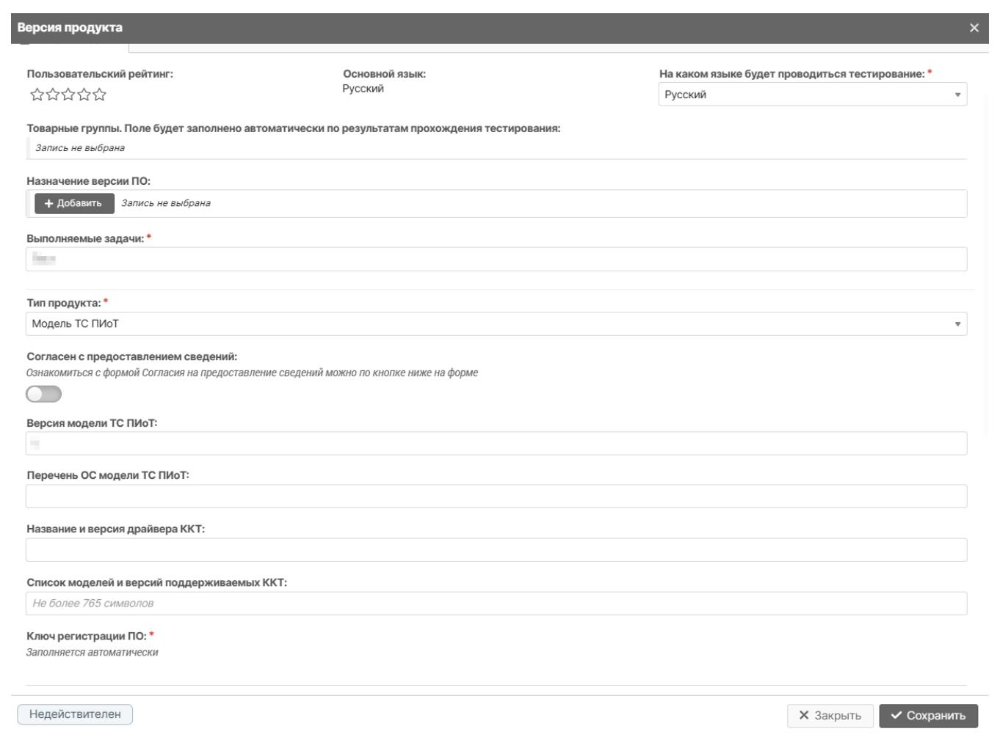

*Рисунок 45. Поля для заполнения Модели ТС ПИоТ*

- нажать кнопку **[ Сохранить ]**.
- в карточке версии перейти во вкладку **«Заявки на ТС ПИоТ»** и нажать кнопку **[ Подать Согласие на предоставление сведений ]**;

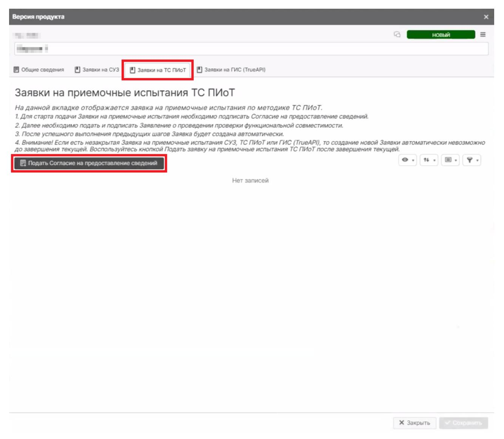

*Рисунок 46. Кнопка подачи согласия на предоставление сведений*

• перейти в карточку сформированного согласия во вкладку **«Документы»**;

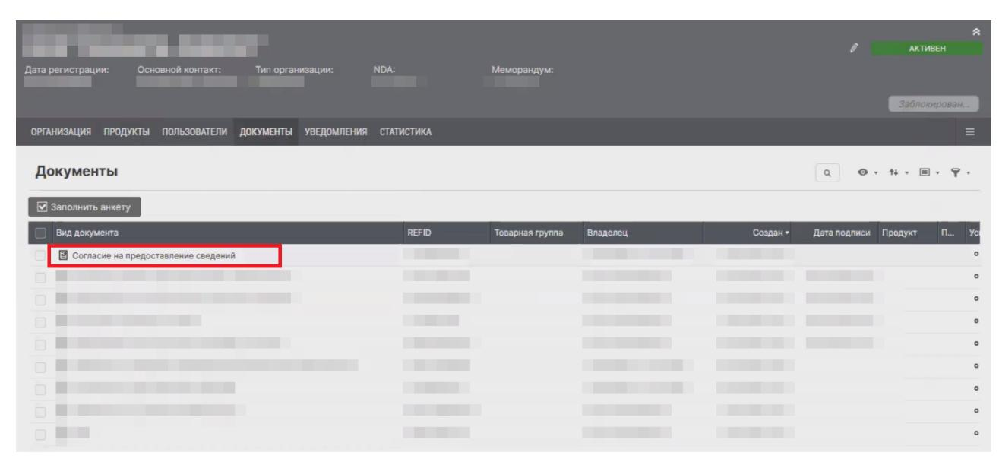

*Рисунок 47. Сформированное согласие на предоставление сведений*

**ОБРАТИТЕ ВНИМАНИЕ** При отказе в приёме согласия на предоставление

сведений поступит уведомление с причиной отклонения. После её исправления доступно обновление документа без необходимости повторной подачи согласия (нажать кнопку **[ Обновить документ ]** — сформируется новый документ с исправленными данными)

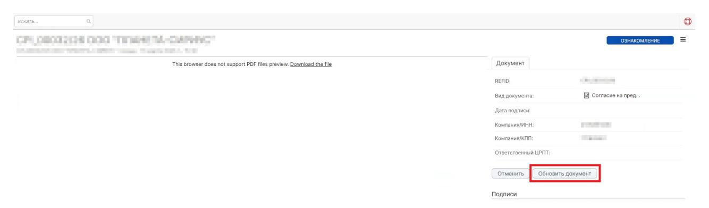

*Рисунок 48. Кнопка обновления документа согласия на предоставление сведений*

• нажать **[ Подписать документ ]** (перед подписанием можно ознакомиться с текстом заявления. Для этого его можно скачать, нажав на **[ Скачать PDF-файл ]**);

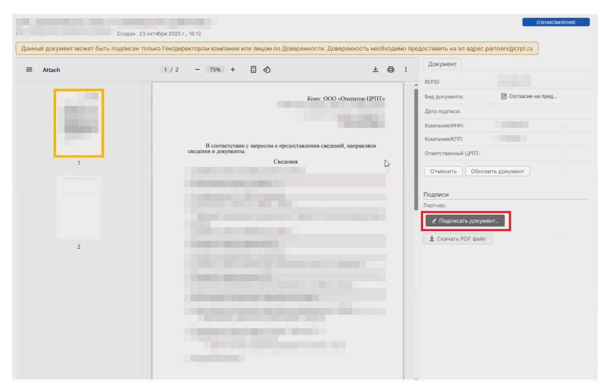

*Рисунок 49. Подписание сформированного согласия на предоставление сведений*

• перейти во вкладку **«Заявки на ТС ПИоТ»** в карточке версии и нажать кнопку **[ Подать Заявление о проведении проверки функциональной совместимости ]**;

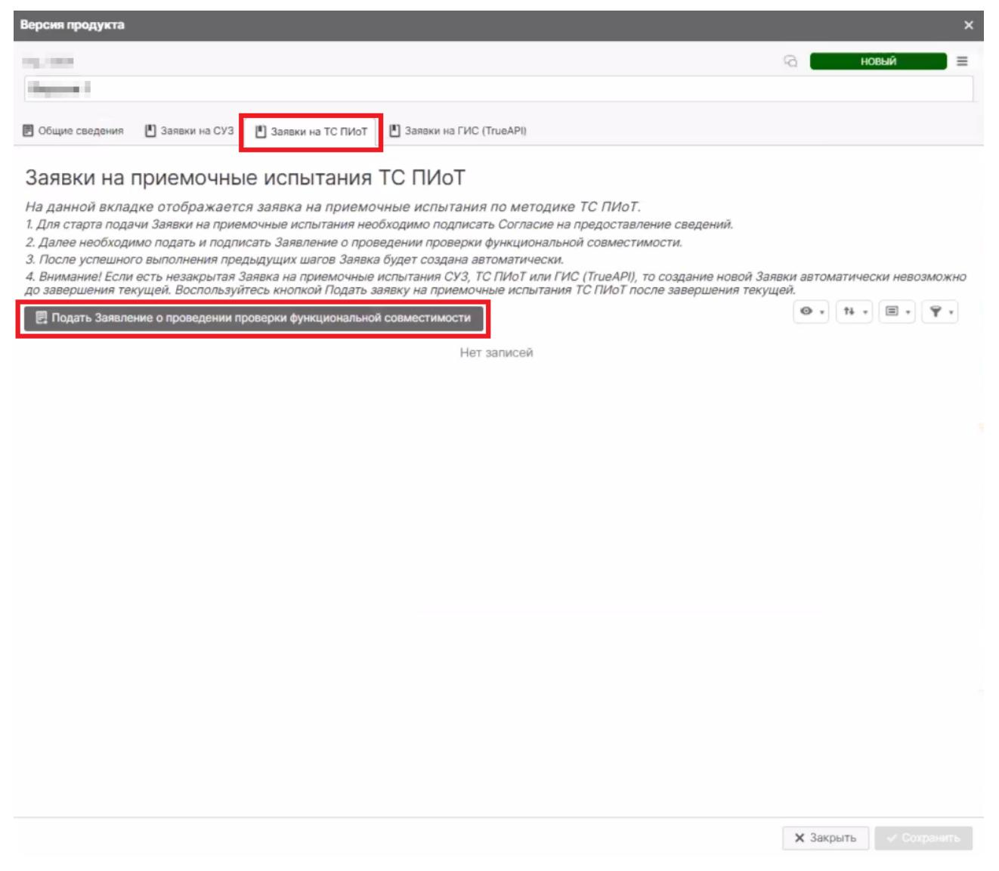

*Рисунок 50. Кнопка подачи заявления*

• перейти в карточку сформированного заявления во вкладку **«Документы»**;

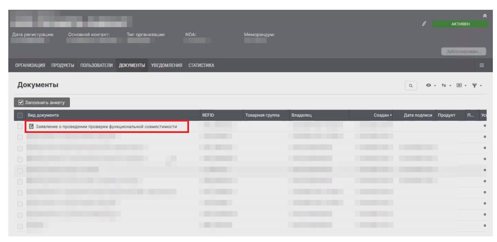

*Рисунок 51. Сформированное заявление о проведении проверки*

• нажать **[ Подписать документ ]** (перед подписанием можно ознакомиться с текстом заявления. Для этого его можно скачать, нажав на **[ Скачать PDF-файл ]**);

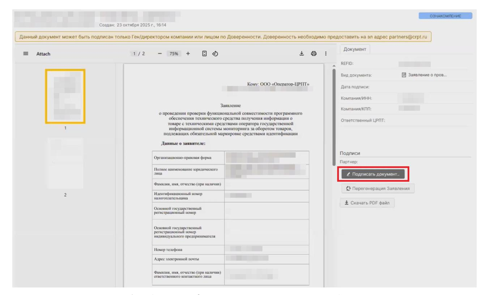

*Рисунок 52. Подписание сформированного заявления о проведении проверки*

Сформированное заявление будет направлено на согласование Оператору, а версия продукта перейдёт в статус **«Новый»**.

В зависимости от результата рассмотрения заявления о проведении проверки функциональной совместимости Оператор загрузит в личный кабинет партнёра документ, с которым можно будет ознакомиться в разделе **«Документы»**:

- при **успешном** рассмотрении — **«Уведомление об отсутствии оснований для отказа»**;
- при **неуспешном** рассмотрении — **«Уведомление об отказе в приеме заявления»**;
- после успешного рассмотрения заявления возможны несколько вариантов подачи заявки на приёмочные испытания:
  - **автоматически** — если все ранее поданные заявки на приёмочные испытания закрыты, заявка сформируется автоматически. Для ознакомления перейти во вкладку **«Заявки на ТС ПИоТ»** в карточке версии и нажать на сформированную заявку.

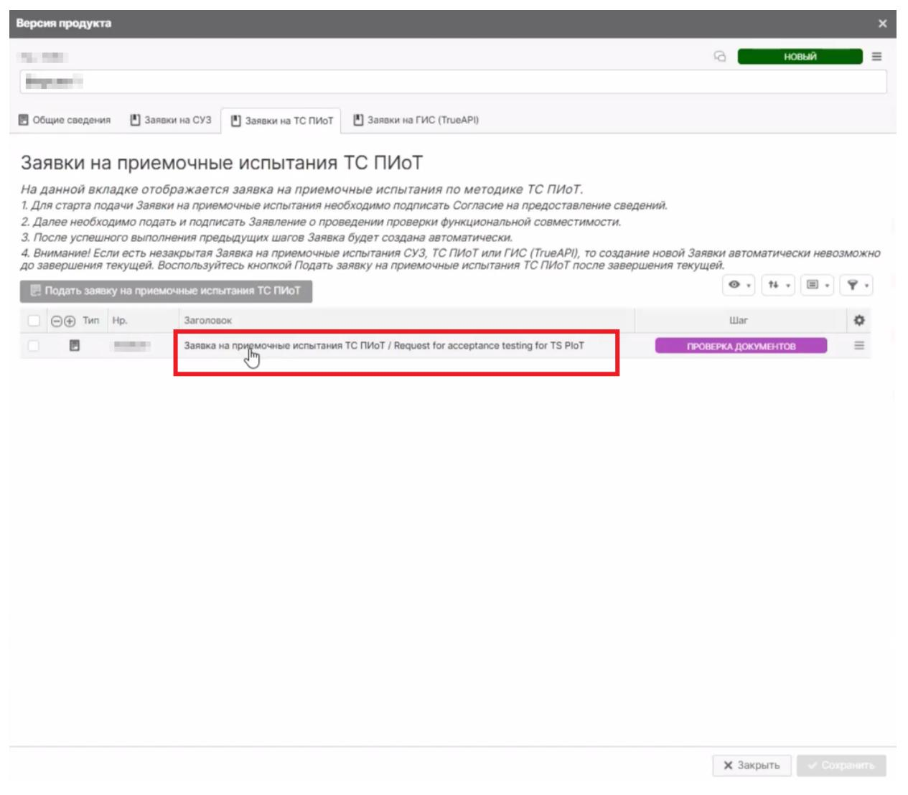

*Рисунок 53. Заявка на приёмочные испытания ТС ПИоТ*

В модальном окне сформированной заявки внести корректировки в поля (обязательные поля отмечены красной звёздочкой):

▪ **«Товарные группы»** — добавить товарную группу, для которой будут проводиться приёмочные испытания продукта по установленной методике тестирования, нажатием кнопки **[ Добавить ]**. Для добавления дополнительных товарных групп нажать кнопку **[ Добавить ]** повторно. Для удаления значения из списка нажать .

#### **ОБРАТИТЕ ВНИМАНИЕ**

В заявке для типа компоненты ТС ПИОТ **«Интеграция с Библиотекой ТС ПИоТ»** для заполнения отображается поле **«Ссылка на протокол проверки вашего ПО на работоспособность интеграции с библиотекой»**. Для остальных типов компоненты ТС ПИоТ отображается поле **«Ссылка на хранилище»**

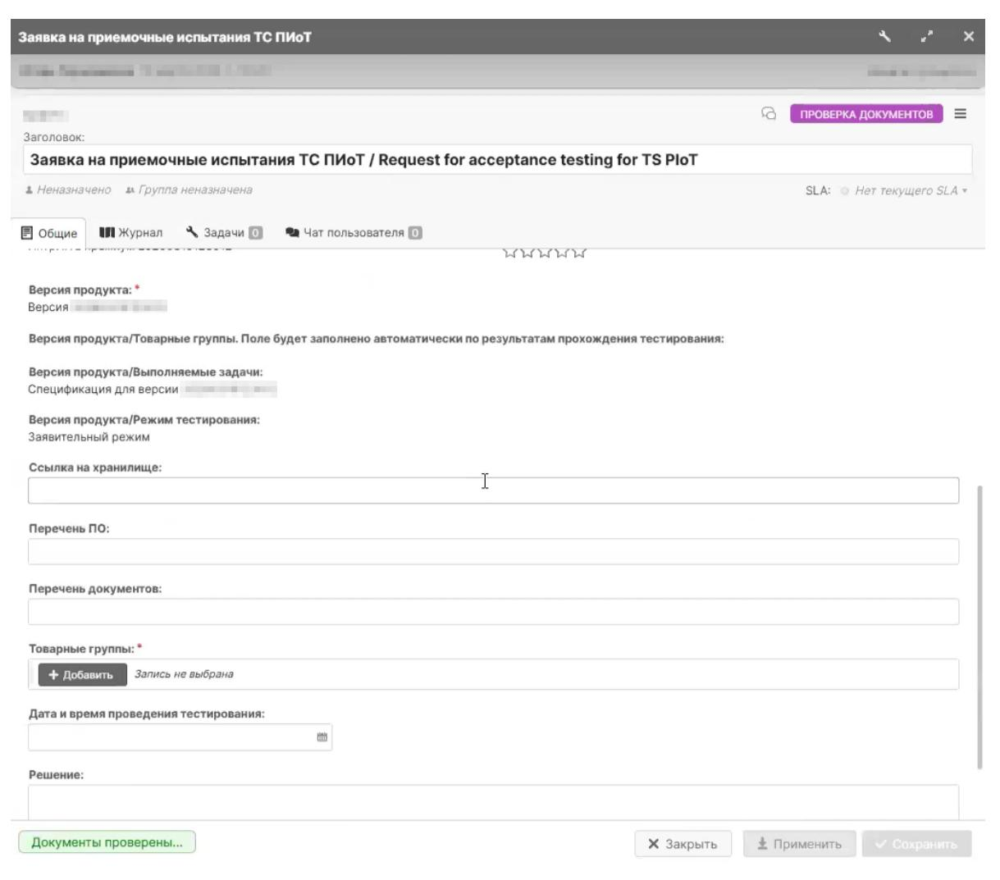

*Рисунок 54. Корректировка полей в сформированной заявке*

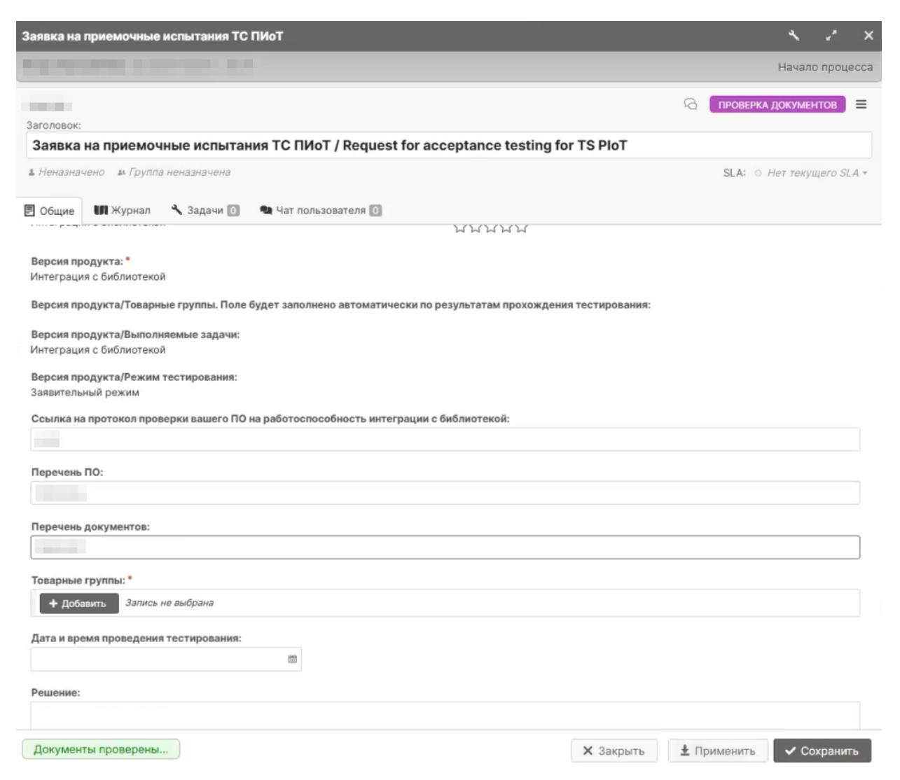

*Рисунок 55. Корректировка полей в сформированной заявке по интеграции с Библиотекой* После внесения корректировок нажать кнопку **[ Сохранить ]**.

◦ **вручную** — если есть незакрытая заявка на приёмочные испытания, то подать заявку вручную. Для этого перейти во вкладку **«Заявки на ТС ПИоТ»** в карточке версии и нажать кнопку **[ Подать заявку на приемочные испытания ТС ПИоТ ]**;

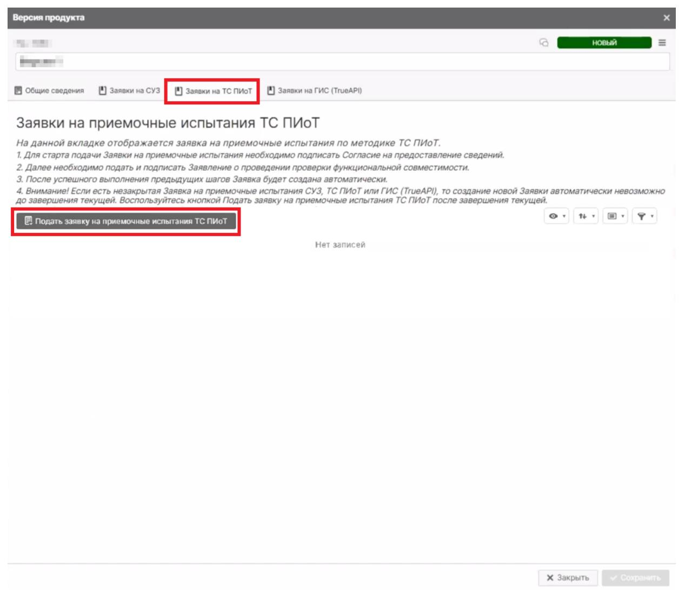

*Рисунок 56. Кнопка подачи заявки на приёмочные испытания ТС ПИоТ*

Заполнить поля модального окна **«Заявка на приемочные испытания»** (обязательные поля отмечены красной звёздочкой):

▪ **«Товарные группы»** — добавить товарную группу, для которой будут проводиться приёмочные испытания продукта по установленной методике тестирования, нажатием кнопки **[ Добавить ]**. Для добавления дополнительных товарных групп нажать кнопку **[ Добавить ]** повторно. Для удаления значения из списка нажать .

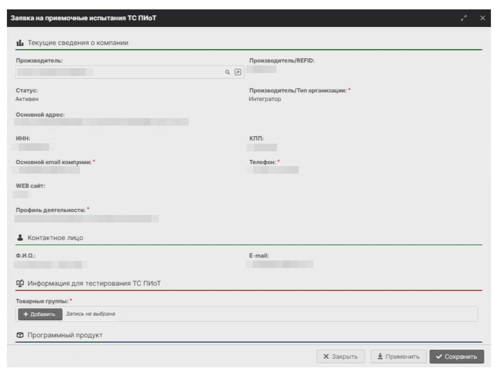

*Рисунок 57. Заявка на приёмочные испытания ТС ПИоТ*

Нажать кнопку **[ Сохранить ]** для завершения создания заявки.

Сформированная заявка будет направлена на согласование Оператору, версия продукта перейдёт в статус **«Приемочные испытания»** и Оператор загрузит в личный кабинет партнёра документ «Программу проверки ТС ПИоТ», с которым можно будет ознакомиться в разделе **«Документы»**.

В зависимости от результата проведённого тестирования Оператор загрузит в личный кабинет партнёра документы, с которым можно будет ознакомиться в разделе **«Документы»**:

- при **успешном** проведении тестирования — **«Уведомление о положительном результате проверки»** и **«Протокол проверки функциональной совместимости»**;
- при **неуспешном** проведении тестирования — **«Уведомление об отрицательном результате проверки»** и **«Протокол проверки функциональной совместимости»**.

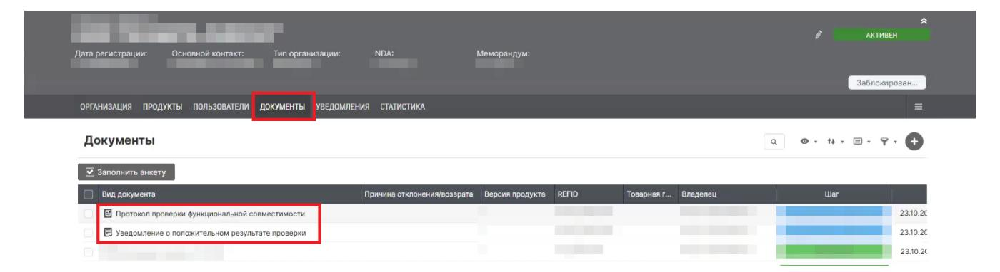

*Рисунок 58. Раздел с документами об успешном проведении тестирования*

Для согласования деталей проведения приёмочных испытаний в Реестре интеграторов и партнёров доступна возможность обмена сообщениями по заявке со службой технической поддержки Оператора (подробнее см. раздел «[Переход в чат с Оператором](#page-74-0)»).

#### **5.3.1.2.3. Подача заявки на приёмочные испытания ГИС (TrueAPI)**

После регистрации продукта (см. раздел [«Регистрация продукта к интеграции](#page-28-0)») подать заявку на приёмочные испытания ГИС (TrueAPI):

- в **«Главном меню»** перейти в раздел **«Моя организация» › «Продукты»**;
- в блоке **«Продукты к интеграции»** перейти в карточку той версии продукта, на которую будет подаваться заявка на приёмочные испытания в ГИС. Для перехода нажать на строку с номером версии;

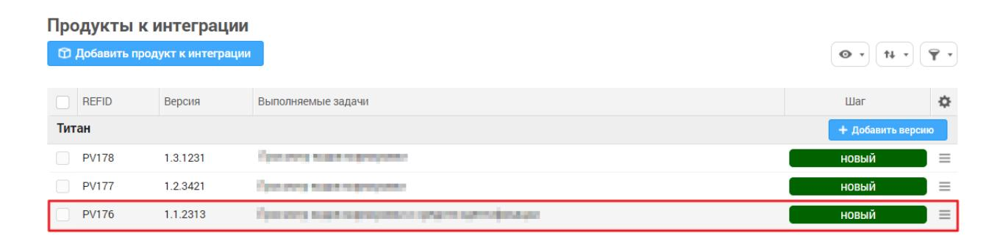

*Рисунок 59. Переход в карточку версии продукта*

- в карточке версии во вкладке **«Общие сведения»** заполнить поля ввода (обязательные поля отмечены красной звёздочкой):
  - **«На каком языке будет проводиться тестирование»** выбрать значение выпадающего списка (**«Русский»** / **«Английский»**);
  - **«Товарные группы»** заполняется автоматически после успешного завершения приёмочных испытаний и перехода протестированной версия продукта в статус **«Допущен в промышленную среду»**;
  - **«Выполняемые задачи»** заполняется автоматически на основании данных, указанных в заявке на регистрацию продукта к интеграции;

◦ нажать кнопку **[ Сохранить ]**.

*Рисунок 60. Общие сведения*

• в карточке версии перейти во вкладку **«Заявки на ГИС (TrueAPI)»** и нажать кнопку **[ Подать заявку на приемочные испытания ГИС (TrueAPI) ]**;

**ОБРАТИТЕ ВНИМАНИЕ**

Кнопка **[ Подать заявку на приемочные испытания ГИС (TrueAPI) ]** недоступна, если текущая версия продукта находится на шаге **«Недействителен»**

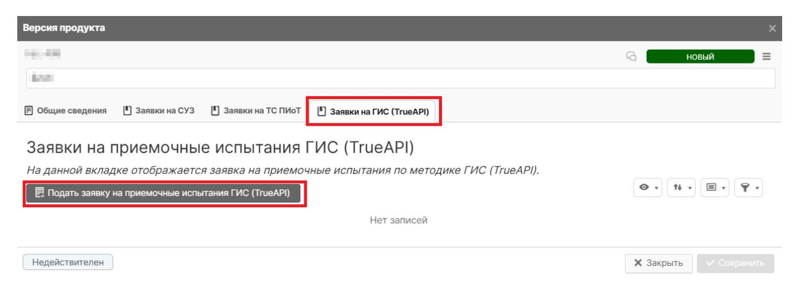

*Рисунок 61. Кнопка подачи заявления о проведении проверки функциональной совместимости*

- заполнить поля модального окна **«Заявка на приемочные испытания»** (обязательные поля отмечены красной звёздочкой):
  - **«Товарные группы»** добавить товарную группу, для которой будут проводиться приёмочные испытания продукта по установленной методике тестирования, нажатием кнопки **[ Добавить ]**. Для добавления дополнительных товарных групп нажать кнопку **[ Добавить ]** повторно. Для удаления значения из списка нажать ;
  - **«Дата и время проведения тестирования: Время тестирования по местному времени»** — предложить дату и время проведения приёмочных испытаний по местному времени нажатием кнопки . Время начала тестирования должно быть указано только в промежутке с 8:00 до 18:00 МСК включительно. При попытке указания времени, несоответствующему допустимому диапазону отобразиться предупреждение: **«Выбранное время вне допустимого диапазона 08:00-18:00 включительно по московскому времени»**;
  - **«Дата и время проведения тестирования: Время тестирования по Московскому времени (UTC+3)»** — заполняется автоматически.

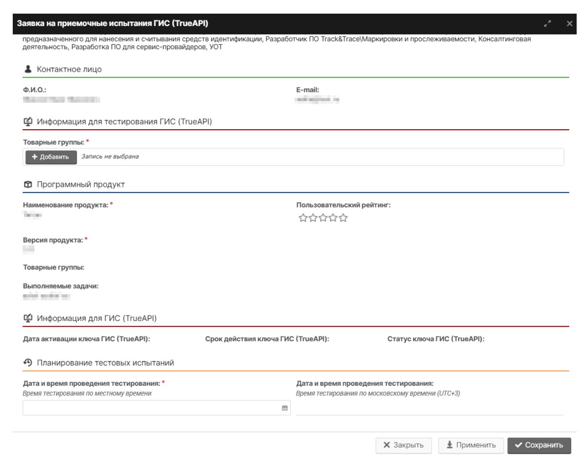

*Рисунок 62. Заявка на приёмочные испытания в ГИС (TrueAPI)*

• нажать кнопку **[ Сохранить ]** для завершения создания заявки.

Сформированная заявка будет направлена на согласование Оператору, а версия продукта перейдёт в статус **«Назначение даты тестирования»**.

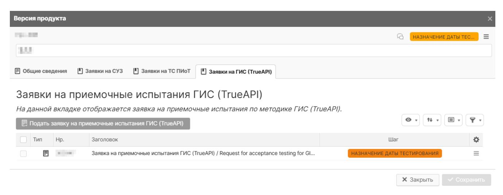

*Рисунок 63. Сформированная заявка*

Для переноса даты приёмочных испытаний, в карточке версии перейти во вкладку **«Заявки на ГИС (TrueAPI)»** и нажать на строку с заявкой в статусе **«Назначение даты тестирования»**. В карточке заявки нажать кнопку **[ Отменить… ]** в левом нижнем углу окна, после чего назначить новую дату приёмочных испытаний нажатием кнопки **[ Назначить дату тестирования… ]** после активации обязательных переключателей. В диалоговом окне сохранения изменений выбрать **«Да»**, после чего выбрать новую дату в форме выбора в нижней части карточки заявки нажатием кнопки .

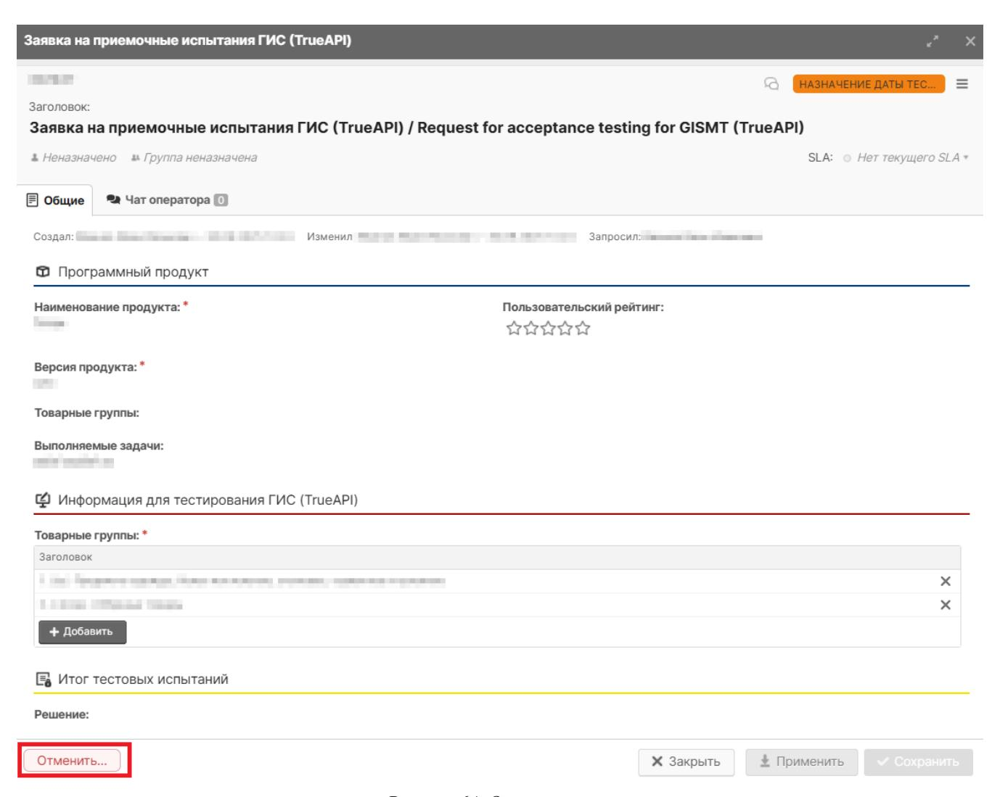

*Рисунок 64. Отмена заявки*

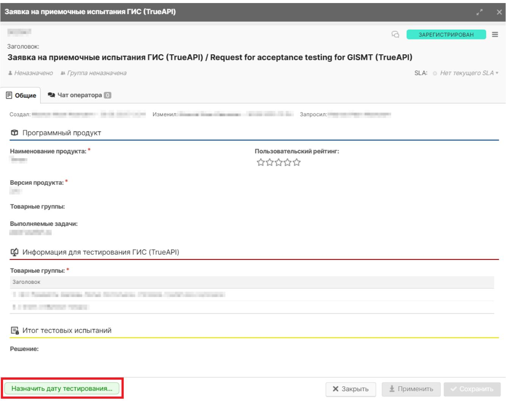

*Рисунок 65. Кнопка перехода к назначению новой даты испытаний*

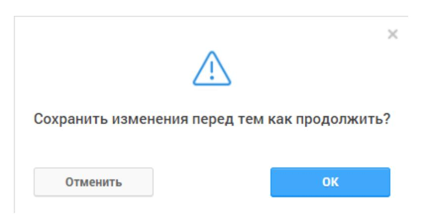

*Рисунок 66. Сохранение изменений*

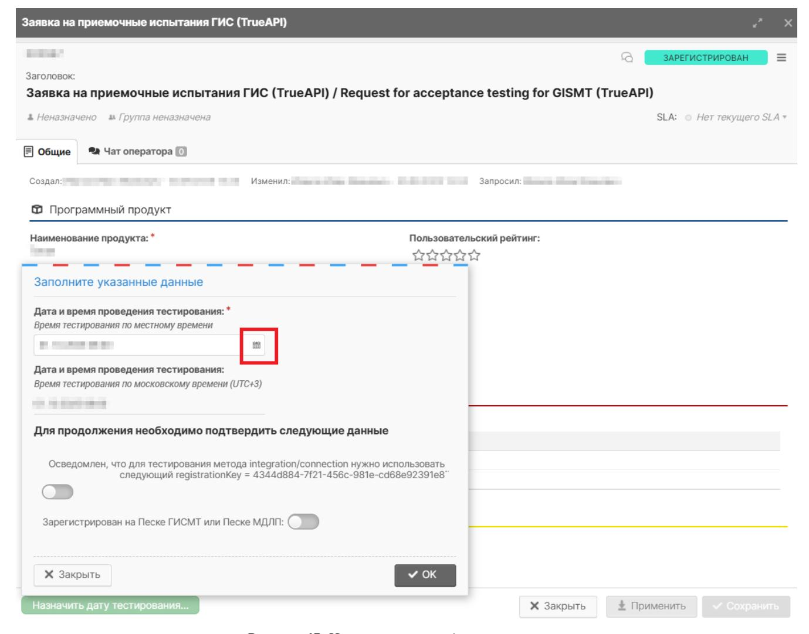

*Рисунок 67. Назначение новой даты испытаний*

После рассмотрения заявки Оператор может предложить другое время проведения приёмочных испытаний. В этом случае заявка переходит в статус **«Согласование даты тестирования»**, после чего на почту основного контактного лица организации поступит уведомление о предложенной дате проведения испытаний.

*Рисунок 68. Уведомление о дате проведения испытаний*

Для согласования предложенного времени перейти в карточку версии, затем во вкладку **«Заявки на ГИС (TrueAPI)»**, далее перейти в карточку заявки нажатием на строку с названием заявки в статусе **«Согласование даты тестирования»**. В карточке заявки подтвердить предложенное время нажатием кнопки **[ Принять… ]** или предложить другое время нажатием кнопки **[ Предложить свою дату и время… ]**. Процесс согласования заявки продолжается до утверждения даты и времени проведения приёмочных испытаний обеими сторонами.

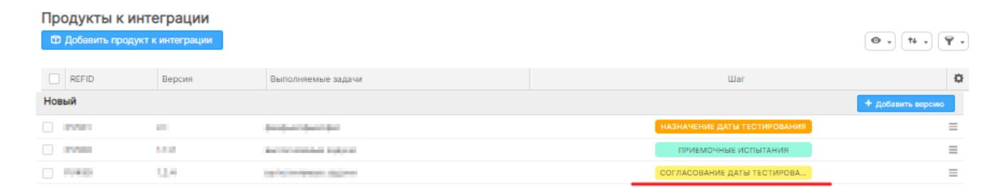

*Рисунок 69. Заявка в состоянии согласования даты тестирования*

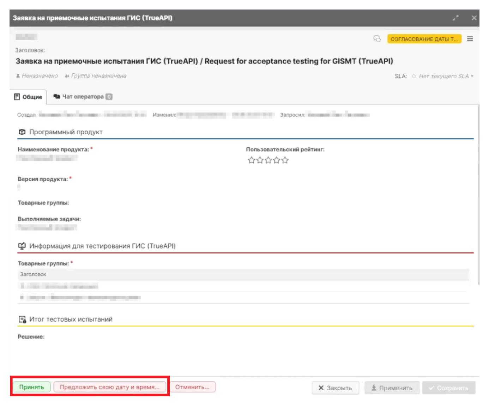

*Рисунок 70. Кнопки согласования даты тестирования*

Согласованная заявка переходит в статус **«Приемочные испытания»**. Во вкладке **«Заявки на ГИС (TrueAPI)»** в столбце **«Дата и время принятия»** отобразится дата и время принятия заявки (при согласовании новой даты тестирования дата и время принятия заявки изменяется), в столбце **«Дата и время приняты контрагентом»** отобразится галочка (при соответствующих настройках отображения таблицы).

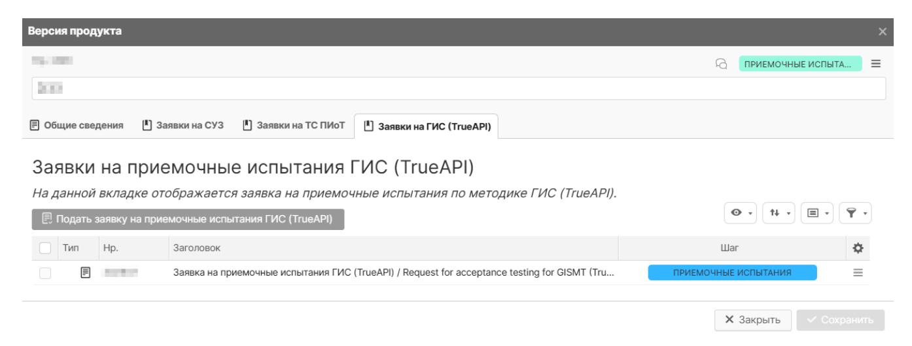

*Рисунок 71. Заявка в состоянии приемочные испытания*

Для настройки выводимых столбцов во вкладке **«Заявки на ГИС (TrueAPI)»** нажать кнопку и в выпадающем меню выбрать **«Выбрать список полей»**.

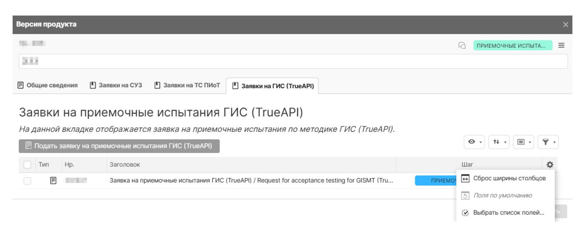

*Рисунок 72. Настройка выводимых столбцов*

В открывшемся окне **«Настройка отображения таблицы»** в левом столбце **«Доступные поля»** отображается перечень всех доступных полей. Видимые столбцы во вкладке **«Заявки на ГИС (TrueAPI)»** отображаются в правом столбце **«Отображать поля»**. Для добавления отображения необходимого поля установить флажок выбора данных напротив соответствующего поля в столбце **«Доступные поля»**, для удаления отображения необходимого поля нажать иконку , расположенную напротив соответствующего поля в столбце **«Отображать поля»**, после чего нажать кнопку **[ Применить ]**.

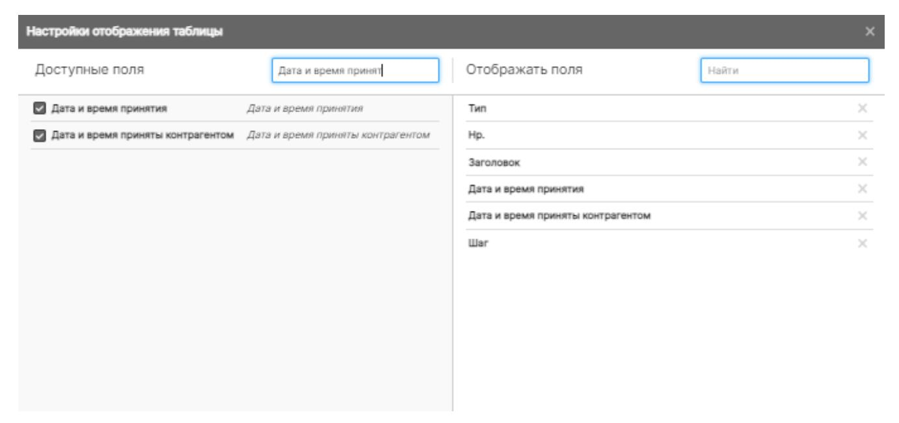

*Рисунок 73. Настройка отображения таблицы*

Для согласования деталей проведения тестирования в Реестре интеграторов и партнёров доступна возможность обмена сообщениями по заявке со службой технической поддержки Оператора (подробнее см. раздел «[Переход в чат с Оператором](#page-74-0)»).

#### **5.3.1.2.4. Переход в чат с Оператором**

Для согласования деталей проведения тестирования в Реестре интеграторов и партнёров доступна возможность обмена сообщениями по заявке со службой технической поддержки Оператора.

#### Для перехода в чат:

- в **«Главном меню»** перейти в раздел **«Заявки»**;
- на панели заявок выбрать заявку для обсуждения с Оператором;

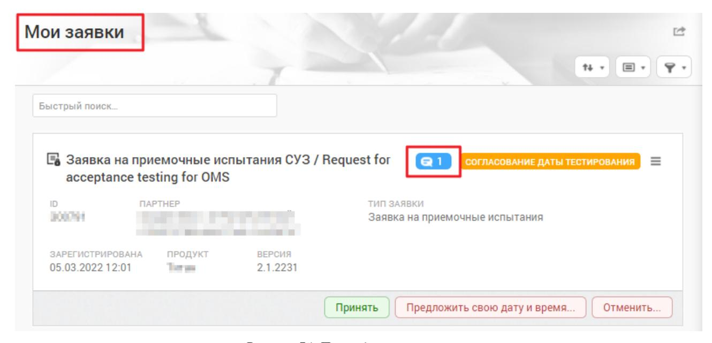

*Рисунок 74. Переход к чату по заявке*

Уведомление о количестве сообщений в чате отображается в заголовке заявки.

• в окне просмотра заявки перейти во вкладку **«Чат оператора»**, ввести сообщение и нажать кнопку **[ Отправить ]**.

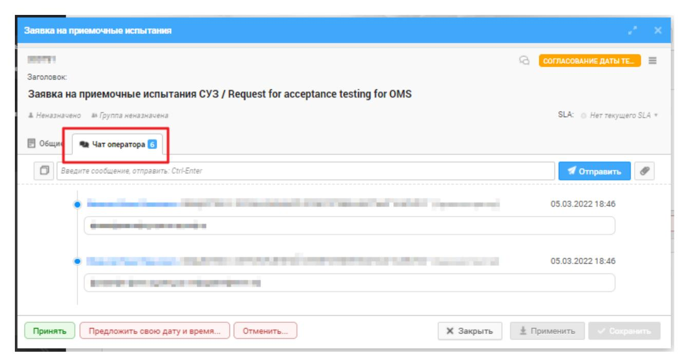

*Рисунок 75. Отправка сообщений в чате*

#### **5.3.1.2.5. Тестирование интеграции с СУЗ**

Перед началом проведения приёмочных испытаний ознакомиться с методикой тестирования интеграции с СУЗ, для чего в **«Главном меню»** выбрать раздел **«База знаний»**, перейти по ссылке **«Методика проверки пусконаладочных работ RU»** и скачать описание в формате \* .pdf.

Проведение приёмочных испытаний производится в заранее согласованное время, указанное в заявке на тестирование (см. раздел [«Подача заявки на приёмочные испытания в СУЗ»](#page-35-1)). В назначенное время сотрудник организации и представитель Оператора проводят совместное тестирование указанной в заявке версии продукта посредством конференции в Zoom по методике проверки пусконаладочных работ.

В случае успешного завершения приёмочных испытаний протестированная версия продукта переходит в статус **«Допущен в промышленную среду»**, в карточке версии появляется отметка **«Одобрено к эксплуатации в промышленной среде СУЗ»**, а в поле **«Ключ регистрации ПО»** — уникальный ключ регистрации (registrationKey), который действует только на **промышленном контуре** ГИС МТ или ФГИС МДЛП.

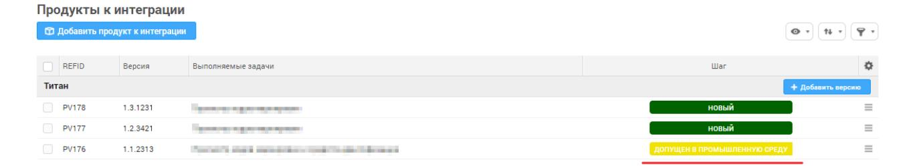

*Рисунок 76. Статус успешно протестированной версии*

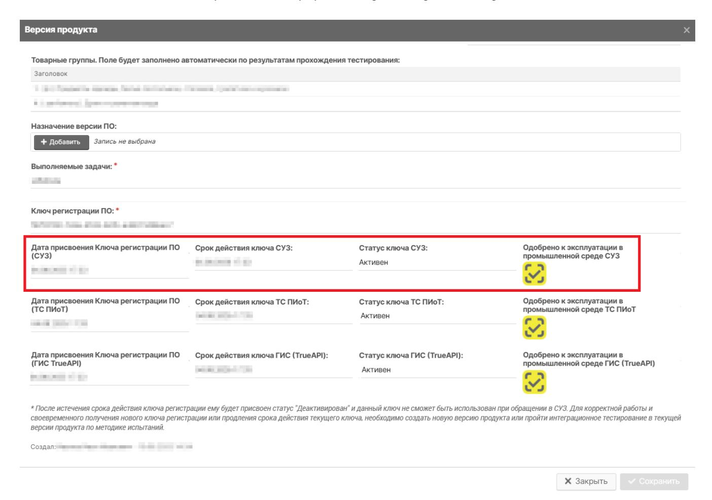

*Рисунок 77. Карточка успешно протестированной версии*

Также в карточке протестированной версии отображается дополнительная информация о ключе регистрации:

- **«Дата присвоения Ключа регистрации ПО (СУЗ)»** отображается дата получения ключа регистрации;
- **«Срок действия ключа СУЗ»** отображается срок действия ключа.

При истечении срока действия ключ переходит в статус **«Деактивирован»** и блокируется для использования в СУЗ. Информационное уведомление об окончании срока действия ключа и необходимости пройти повторное тестирование версии отображается при входе в личный кабинет Реестра интеграторов и партнёров, а также в письме, направляемом на адрес основного контактного лица организации со следующей периодичностью:

- за 3 календарных месяца до истечения срока;
- за 2 календарных месяца до истечения срока;
- за 1 календарный месяц до истечения срока;
- за 3 календарных недели до истечения срока;
- за 2 календарных недели до истечения срока;
- за 1 календарную неделю до истечения срока;
- за 1 календарный день до истечения срока.

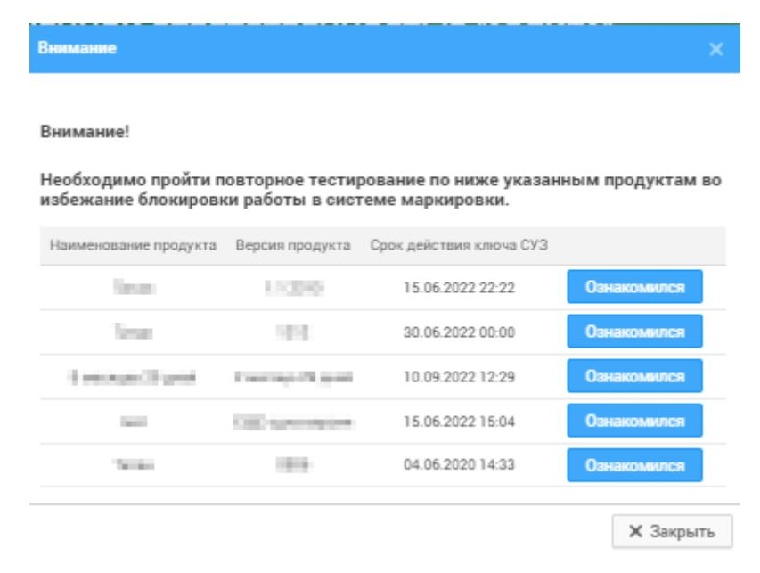

*Рисунок 78. Информационное оповещение об окончании срока действия ключа СУЗ*

Для отключения отображения информационного уведомления в личном кабинете Реестра интеграторов и партнёров до следующей даты оповещения в модальном окне уведомления нажать кнопку **[ Ознакомился ]** в строке с информацией о версии.

Во избежание блокировки регистрационного ключа повторное тестирование может быть пройдено заблаговременно до даты истечения срока действия ключа (см. раздел [«Подача](#page-35-1) [заявки на приёмочные испытания в СУЗ»](#page-35-1)).

• **«Статус ключа СУЗ»** — отображается статус ключа (**«Активен»** и **«Деактивирован»**). Ключ переходит в состояние **«Деактивирован»** при окончании срока действия или при деактивации со стороны Оператора по другим причинам, при этом статус версии продукта изменится на **«Деактивирован»**.

При успешном прохождении повторного тестирования версии регистрационный ключ возвращается в статус **«Активен»**, при этом значение ключа регистрации для версии сохраняется.

Если статусы ключей СУЗ переходят в состояние **«Деактивирован»** при окончании срока

действия или при их деактивации со стороны Оператора по другим причинам, то статус версии продукта изменится на **«Деактивирован»**. Если один из ключей перейдет в статус **«Активен»**, статус версии продукта изменится на **«Допущен в промышленную эксплуатацию»**.

Успешно протестированная версия продукта становится доступна в пользовательском интерфейсе СУЗ в разделе **«Реестр интеграционных решений»** (если для продукта установлена настройка видимости).

Для версий продуктов, получивших статус **«Допущен в промышленную среду»**, доступно добавление доверенных ИНН (см. раздел [«Добавление доверенных ИНН»](#page-87-0)).

#### **5.3.1.2.6. Тестирование интеграции ТС ПИоТ**

В случае успешного завершения приёмочных испытаний протестированная версия продукта переходит в статус **«Допущен в промышленную среду»**, в карточке версии появляется отметка **«Одобрено к эксплуатации в промышленной среде ТС ПИоТ»**, а в поле **«Ключ регистрации ПО»** — уникальный ключ регистрации (registrationKey), который действует только на **промышленном контуре** ГИС МТ или ФГИС МДЛП.

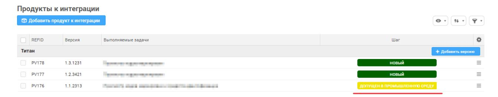

*Рисунок 79. Статус успешно протестированной версии*

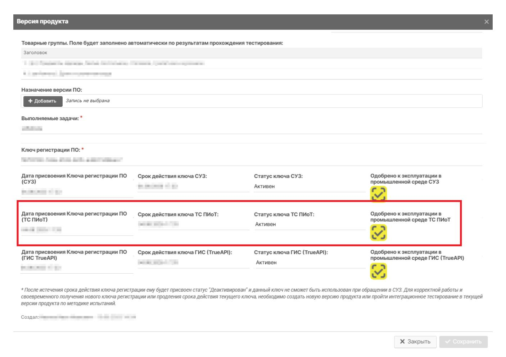

*Рисунок 80. Карточка успешно протестированной версии*

Также в карточке протестированной версии отображается дополнительная информация о ключе регистрации:

- **«Дата присвоения Ключа регистрации ПО (ТС ПИоТ)»** отображается дата получения ключа регистрации;
- **«Срок действия ключа ТС ПИоТ»** отображается срок действия ключа.

При истечении срока действия ключ переходит в статус **«Деактивирован»** и блокируется для использования в ГИС.

Во избежание блокировки регистрационного ключа повторное тестирование может быть пройдено заблаговременно до даты истечения срока действия ключа (см. раздел [«Подача](#page-49-0) [заявки на приёмочные испытания ТС ПИоТ»](#page-49-0)).

• **«Статус ключа ТС ПИоТ»** — отображается статус ключа (**«Активен»** и **«Деактивирован»**). Ключ переходит в состояние **«Деактивирован»** при окончании срока действия или при деактивации со стороны Оператора по другим причинам, при этом статус версии продукта изменится на **«Деактивирован»**.

При успешном прохождении повторного тестирования версии регистрационный ключ возвращается в статус **«Активен»**, при этом значение ключа регистрации для версии

#### сохраняется.

Если статусы ключей ГИС переходят в состояние **«Деактивирован»** при окончании срока действия или при их деактивации со стороны Оператора по другим причинам, то статус версии продукта изменится на **«Деактивирован»**. Если один из ключей перейдет в статус **«Активен»**, статус версии продукта изменится на **«Допущен в промышленную эксплуатацию»**.

#### **5.3.1.2.7. Тестирование интеграции с ГИС (TrueAPI)**

В случае успешного завершения приёмочных испытаний протестированная версия продукта переходит в статус **«Допущен в промышленную среду»**, в карточке версии появляется отметка **«Одобрено к эксплуатации в промышленной среде ГИС (TrueAPI)»**, а в поле **«Ключ регистрации ПО»** — уникальный ключ регистрации (registrationKey), который действует только на **промышленном контуре** ГИС МТ.

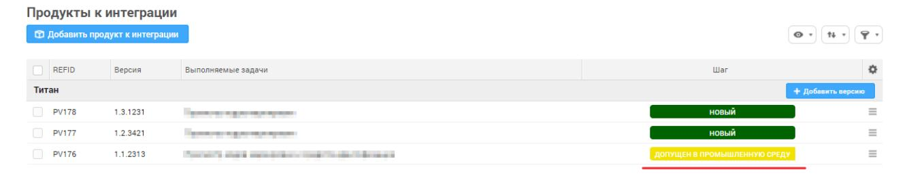

*Рисунок 81. Статус успешно протестированной версии*

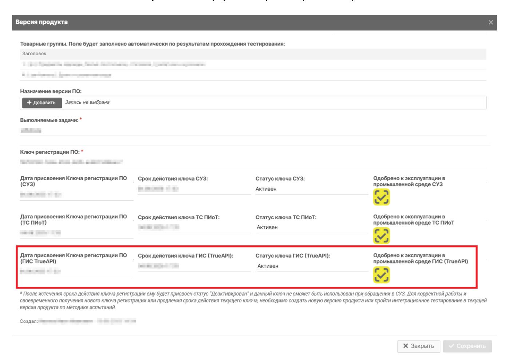

*Рисунок 82. Карточка успешно протестированной версии*

Также в карточке протестированной версии отображается дополнительная информация о ключе регистрации:

- **«Дата присвоения Ключа регистрации ПО (ГИС TrueAPI)»** отображается дата получения ключа регистрации;
- **«Срок действия ключа ГИС (TrueAPI)»** отображается срок действия ключа.

При истечении срока действия ключ переходит в статус **«Деактивирован»** и блокируется для использования в ГИС.

Во избежание блокировки регистрационного ключа повторное тестирование может быть пройдено заблаговременно до даты истечения срока действия ключа (см. раздел [«Подача](#page-65-0) [заявки на приёмочные испытания ГИС \(TrueAPI\)](#page-65-0)»).

• **«Статус ключа ГИС (TrueAPI)»** — отображается статус ключа (**«Активен»** и **«Деактивирован»**). Ключ переходит в состояние **«Деактивирован»** при окончании срока действия или при деактивации со стороны Оператора по другим причинам, при этом статус версии продукта изменится на **«Деактивирован»**.

При успешном прохождении повторного тестирования версии регистрационный ключ возвращается в статус **«Активен»**, при этом значение ключа регистрации для версии сохраняется.

Если статусы ключей ГИС переходят в состояние **«Деактивирован»** при окончании срока действия или при их деактивации со стороны Оператора по другим причинам, то статус версии продукта изменится на **«Деактивирован»**. Если один из ключей перейдет в статус **«Активен»**, статус версии продукта изменится на **«Допущен в промышленную эксплуатацию»**.

#### **5.3.1.3. Автотестирование интеграционного решения**

Самостоятельное тестирование интеграционного решения возможно при следующих условиях:

- для версии интеграционного решения заполнены все обязательные сведения во вкладке **«Общие сведения»**;
- для версии отсутствуют активные заявки на совместное тестирование со службой технической поддержки Оператора;
- по одной товарной группе отсутствуют ранее созданные заявки на самостоятельное тестирование в статусах **«В работе»**, **«Приостановлен»**, **«Проверка»**, **«На доработке»**.

При выполнении всех указанных условий становится доступна кнопка **[ Добавить тест-кейс ]**.

**ОБРАТИТЕ ВНИМАНИЕ**

Кнопка **[ Добавить тест-кейс ]** недоступна, если текущая версия продукта находится на шаге **«Недействителен»**

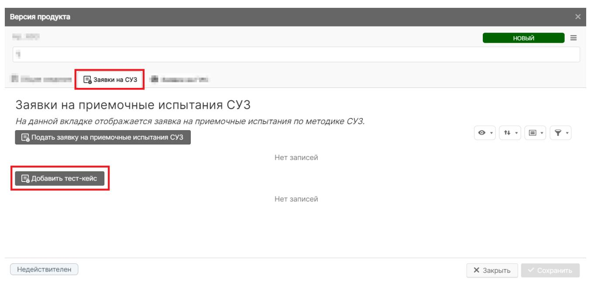

*Рисунок 83. Кнопка добавления тест-кейса*

Переход по кнопке **[ Добавить тест-кейс ]** открывает модальное окно настроек самостоятельного тестирования, в котором требуется заполнить поля:

• **«Товарные группы»** — установить флажки для товарных групп, по которым требуется пройти тестирование. Выбор товарной группы определяет методику тестирования, разработанную Оператором Системы. Для каждой выбранной товарной группы создаётся отдельный набор тестов.

Для выбора всех товарных групп установить флажок напротив строки **«Поиск»**;

**ОБРАТИТЕ ВНИМАНИЕ**

Недопустимо выбирать товарную группу **«(pharma) Лекарственные препараты для медицинского применения»** совместно с другими товарными группами

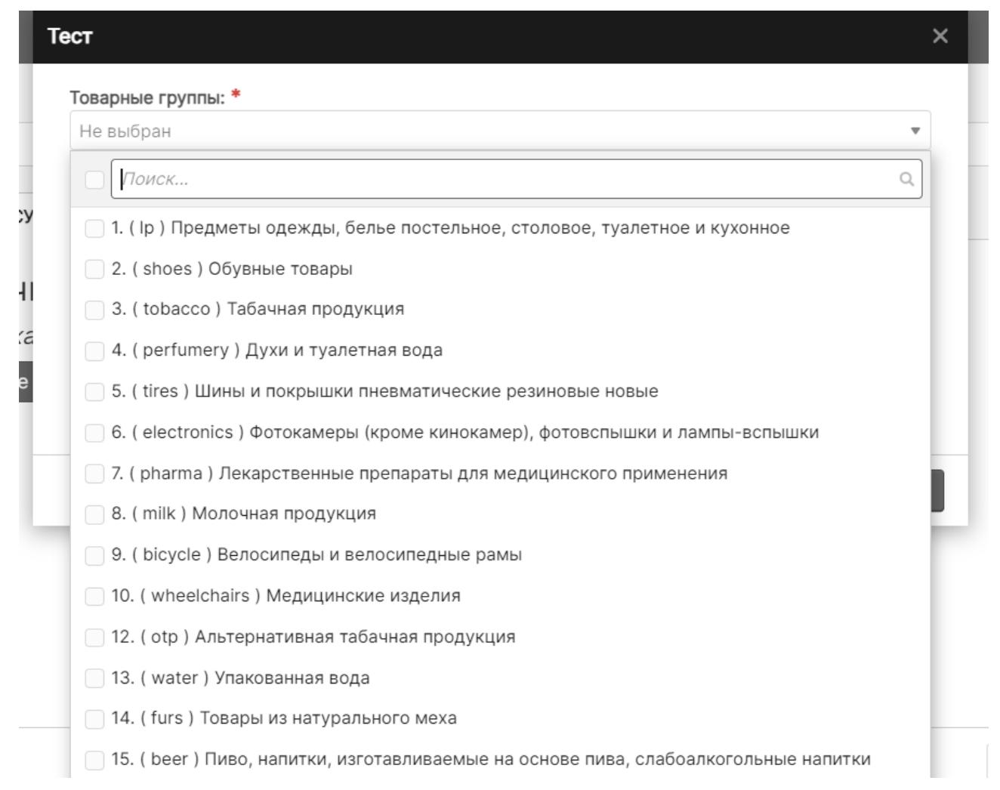

*Рисунок 84. Выбор товарной группы*

• **«Определение»** — выбрать методику, по которой будет тестироваться версия интеграционного решения, из списка предложенных.

После нажатия кнопки **[ Сохранить ]** в нижней части окна заявок на приемочные испытания СУЗ создаются тесты в статусе **«В ожидании тестирования»** для каждой выбранной товарной группы. Подробнее о прохождении тестирования см. в разделах «[Описание набора тестов»](#page-83-0) и [«Прохождение набора тестов»](#page-84-0).

#### **5.3.1.3.1. Описание набора тестов**

Интерфейс каждого набора тестов содержит следующие функциональные области (рисунок ниже):

- статус набора тестов и статус процесса прохождения тестирования (элемент 1);
- кнопки начала тестирования и отклонения заявки (элемент 2).

При выборе действия **«Отклонить»** требуется заполнить обязательное поле ввода комментария для сотрудников службы поддержки Оператора. После отклонения заявки данный тест-кейс нельзя вернуть в работу;

• вкладки: **«Тест»**, **«Комментарии»** (элемент 3).

Вкладка **«Тест»** содержит название методики тестирования и действия методики тестирования.

Вкладка **«Комментарии»** содержит поле ввода комментариев. Ввод комментария доступен на любом этапе жизненного цикла набора тестов;

- описание шагов методики тестирования и кнопки управления шагом (элемент 4);
- список шагов методики тестирования с индикаторами прохождения (элемент 5).

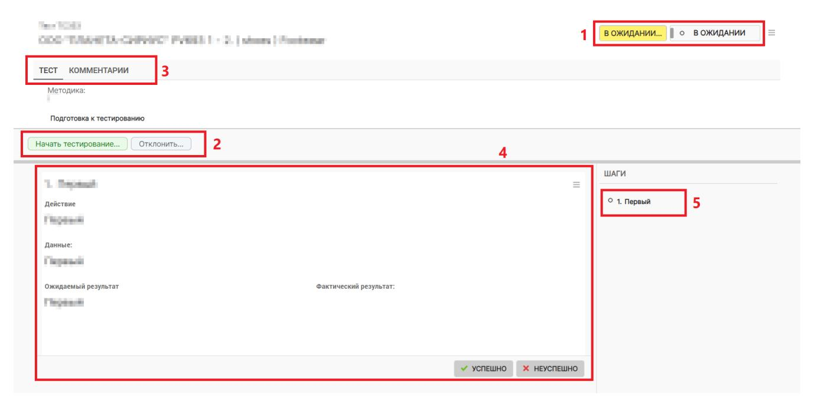

*Рисунок 85. Интерфейс тестирования*

Подробнее о принципе прохождения тестирования см. в разделе [«Прохождение набора тестов»](#page-84-0).

#### **5.3.1.3.2. Прохождение набора тестов**

Для прохождения набора тестов требуется выполнить следующие действия:

- перейти на вкладку **«Тест»**;
- внести описание фактических результатов по подготовительным шагам в поле **«Фактические результаты по п.п. 1-5»**. Без заполнения данного поля нельзя перейти к основным шагам тестирования, если нажать кнопку **[ Начать тестирование ]**, то появится соответствующая подсказка: **«Необходимо завершить подготовку к тестированию и заполнить поле "Фактический результат"»**;
- нажать кнопку **[ Начать тестирование ]** / **[ «Продолжить тестирование ]** и ввести аутентификационный токен в открывшемся модальном окне **«Заполните указанные данные»** для перевода набора тестов в статус **«В работе»**. Все дальнейшие API запросы, выполняемые в рамках прохождения тест-кейсов, необходимо выполнять с аутентификационным токеном, который был указан в модальном окне **«Заполните**

#### **указанные данные»**.

*Рисунок 86. Кнопка начала тестирования*

Аутентификационный токен следует получить заблаговременно через True API (для всех товарных групп, кроме «(pharma) Лекарственные препараты для медицинского применения»») или через API МДЛП (для товарной группы «(pharma) Лекарственные препараты для медицинского применения»»). Документация по API размещена в личном кабинете на промышленном контуре и в базе знаний «Реестра интеграторов».

Аутентификационный токен действует 10 часов. Счётчик времени валидности токена отображается в правом верхнем углу экрана. В случае если тестирование длится дольше указанного времени, то при его превышении набор тестов автоматически перейдет в статус **«Приостановлен»**.

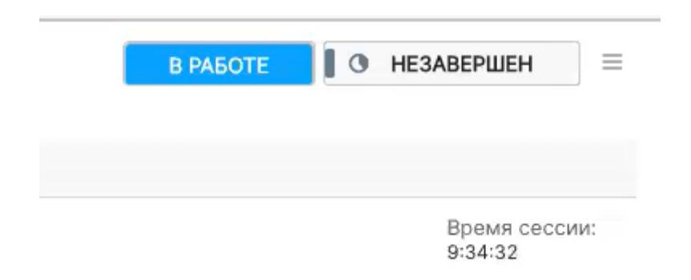

*Рисунок 87. Время жизни токена*

Кнопка **[ Начать тестирование ]** недоступна, если по любым другим товарным группам есть тест-кейсы в статусе **«В работе»**;

- для прохождения шагов тестирования следует:
  - ознакомиться с описанием очередного шага в полях **«Действия»**, **«Данные»**, **«Ожидаемый результат»** и выполнить требуемые действия;

Опциональные шаги отмечены знаком **«Опционален»**;

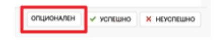

*Рисунок 88. Признак опциональности теста*

◦ внести результаты прохождения текущего шага тест-кейса в поле **«Фактический результат»**. В поле **«Действие»** дана информация о том, какой тип сведений необходимо указать в поле **«Фактический результат»** (логи API запросов и ответов или иные данные).

Поле **«Фактический результат»** доступно, только если набор тестов находится в статусе **«В работе»**;

◦ нажать кнопку **[ Успешно ]** в случае совпадения фактического результата с ожидаемым или **[ Неуспешно ]** — при расхождении результата.

Кнопки доступны, только если набор тестов находится в статусе **«В работе»**.

При выборе значения **«Неуспешно»** для обязательного шага тестирования статус процесса прохождения тестов изменится на **«Не пройден»**. В остальных случаях статус принимает значение **«Незавершен»**;

◦ перейти к выполнению следующего шага методики тестирования.

Для быстрого перехода между шагами методики тестирования выбрать тест в списке **«Шаги»** в правой части экрана.

Для приостановки выполнения тестирования нажать кнопку **[ Приостановить ]** в правом верхнем углу экрана. В этом случае статус процесса прохождения тестов изменится на **«Отложен»**. Для продолжения тестирования нажать кнопку **[ Продолжить тестирование ]**.

• после завершения всех обязательных шагов методики тестирования нажать кнопку **[ Завершить ]** для отправки результатов тестирования на проверку сотрудниками службы технической поддержки Оператора. При этом набор тестов переходит в статус **«Проверка»**, и на электронную почту контактного лица будет направлено письмо о начале процедуры проверки заявки.

В случае, если тест-кейс требует внесения изменений со стороны контрагента, Оператор может перевести заявку на доработку. При этом набор тестов переходит в статус **«На доработке»** и на электронную почту контактного лица будет направлено письмо о том, что заявка на тестирование отправлена на доработку;

- после успешной проверки корректности всех шагов тест-кейса Оператором, статус заявки изменяется на **«Согласование даты приемки»**. Оператор связывается с контрагентом и согласовывает дату и время итоговой приёмки тест-кейса в режиме видеоконференцсвязи, а заявка переходит в статус **«Приемка»**. На приёмке осуществляется демонстрация следующих шагов проверки:
  - «Отчёт об использовании отправляется на основе отчёта о валидации КМ с оборудования L3 (машинное зрение, сканер и т.д.)» (обязательно);

- «Экспортируются только коды идентификации из ПОСС» (обязательно);
- «Соблюдение правил хранения и использования кодов маркировки» (обязательно);
- «Проверка минимального остатка лицевого счета УОТ» *(опционально)*;
- «Автоматическое пополнение запаса КМ» *(опционально)*;
- «Контроль срока годности кодов маркировки» *(опционально)*.

В случае, если данные шаги требуют доработки или исправления со стороны контрагента, Оператор отправляет заявку на исправление, а набор тестов переходит в статус **«Ожидание исправления»**. После проведения исправлений контрагент переводит заявку в статус **«Согласование даты приемки»**.

После успешного проведения приёмки статус процесса прохождения тестов изменится на **«Пройден»**.

#### **5.3.1.4. Добавление доверенных ИНН**

Для версий продуктов, получивших статус **«Допущен в промышленную среду»**, доступна возможность добавления доверенных ИНН. Организации, ИНН которых были добавлены как доверенные, получают возможность использовать данную версию продукта с тем же ключом регистрации (registrationKey), который был получен для данной версии продукта по итогам приёмочных испытаний.

Для добавления доверенных ИНН выполнить следующие требования:

- организация, добавляющая доверенные ИНН, должна быть зарегистрирована в Реестре интеграторов и партнёров с типом организации **«Участник оборота товаров»** (подробнее см. в «[Подача заявки на изменение перечня видов деятельности](#page-25-0)»). Другие типы организации недопустимы;
- организация, добавляющая доверенные ИНН, а также добавляемая организация должны быть зарегистрированы в ГИС МТ или ФГИС МДЛП в товарных группах, соответствующих тем, что указаны в протестированной Оператором версии продукта («[Регистрация продукта к](#page-28-0) [интеграции](#page-28-0)»).

Для добавления доверенных ИНН:

- в **«Главном меню»** перейти в раздел **«Моя организация» › «Продукты»**;
- в блоке **«Продукты к интеграции»** перейти в карточку версии продукта в статусе **«Допущен в промышленную среду»**. Для перехода нажать на строку с номером версии;

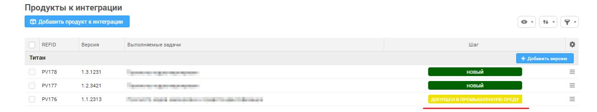

*Рисунок 89. Статус успешно протестированной версии*

• в карточке версии во вкладке **«Общие сведения»** в блоке **«Доверенные инн»** нажать кнопку раскрытия списка , после чего нажать кнопку **[ + Доверенные инн ]**. Допустимо добавлять не более 15 значений ИНН.

Для удаления значения нажать кнопку выбора опций в строке с удаляемым значением, выбрать **«Удалить…»** и подтвердить удаление в диалоговом окне.

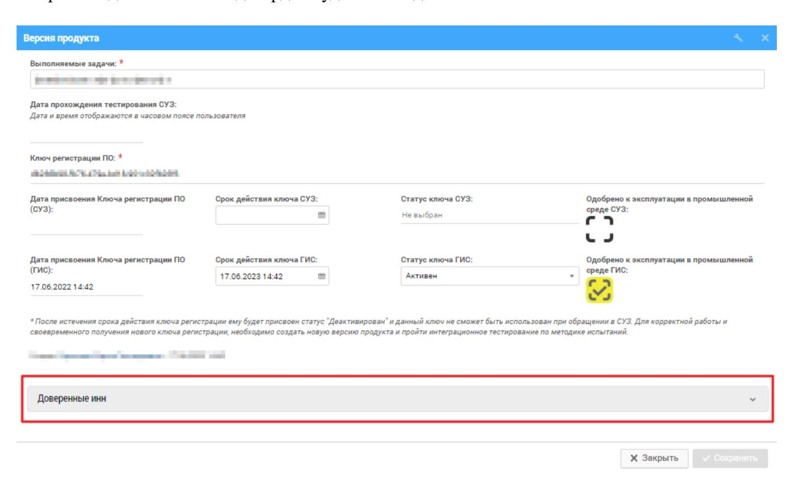

*Рисунок 90. Блок добавления доверенных ИНН*

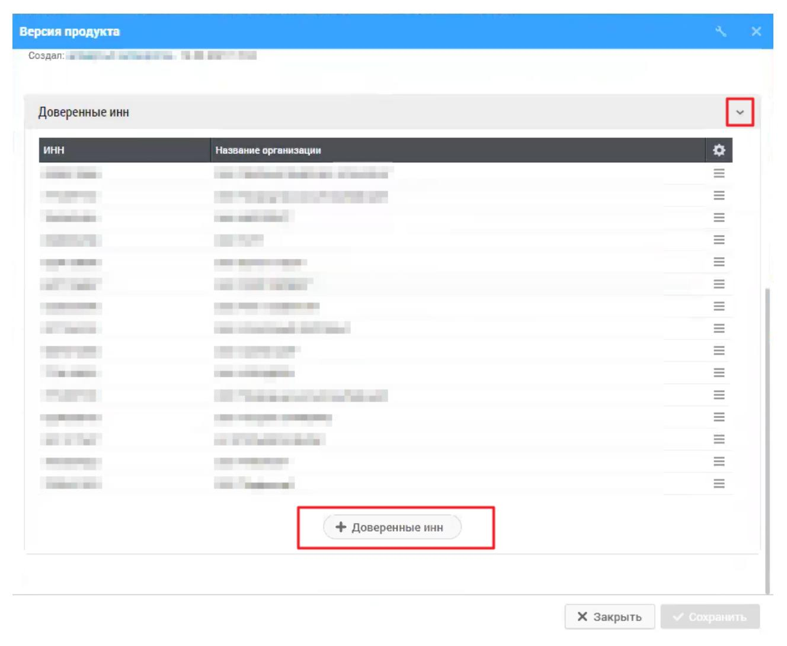

*Рисунок 91. Кнопка добавления доверенных ИНН*

• в модальном окне **«Product version»** заполнить поле **«ИНН»**, нажать кнопку Enter , после чего будет автоматически заполнено поле **«Название организации»** и отобразятся условия конфиденциальности. Ознакомиться с условиями и установить флажок выбора в каждом пункте списка, после чего нажать кнопку **[ Сохранить ]**.

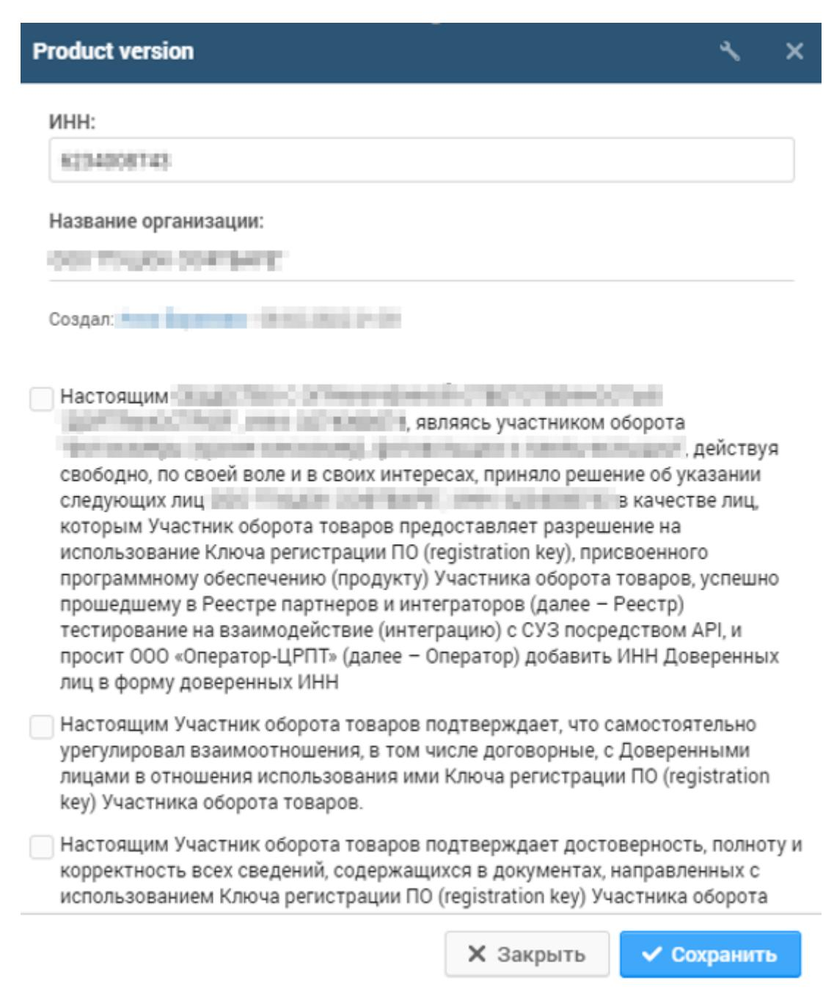

*Рисунок 92. Окно добавления организации в список доверенных*

После проверки на соответствие условиям, организация будет добавлена в список доверенных ИНН.

#### **5.3.2. Партнёрские решения**

Работа с партнёрскими решениями в Реестре интеграторов и партнёров доступна организациям с типами организаций **«Партнер»**, **«Интегратор»** и **«Сервис-провайдер»**.

Для добавления нового партнёрского решения:

- в **«Главном меню»** перейти в раздел **«Моя организация» › «Продукты»**;
- в блоке **«Партнерские решения»** нажать кнопку **[ Добавить партнерское решение ]**;

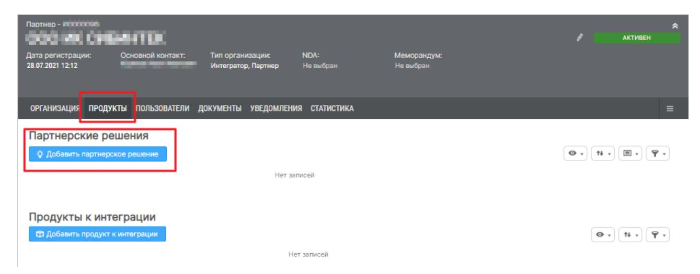

*Рисунок 93. Расположение кнопки добавления партнёрского решения*

Если в течение дня после регистрации организации в Реестре интеграторов и партнёров кнопка не отобразилась, то обратиться в службу технической поддержки, направив письмо на почту [partners@crpt.ru](mailto:partners@crpt.ru) с копией на адрес [integrators@crpt.ru.](mailto:integrators@crpt.ru)

- в модальном окне **«Детали продукта»** заполнить поля ввода (обязательные поля отмечены красной звёздочкой):
  - **«Введите наименование продукта»** указать наименование продукта прямым вводом;

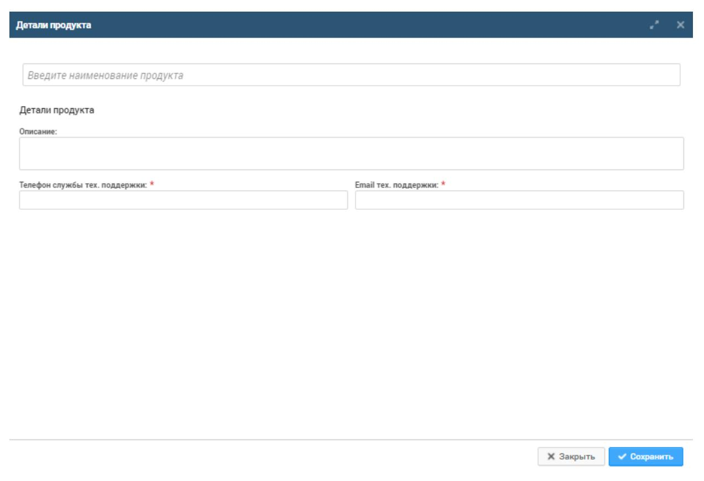

*Рисунок 94. Модальное окно описания деталей продукта*

◦ **«Описание»** — указать описание продукта прямым вводом (привести конкурентные преимущества и основной функционал продукта);

- **«Телефон службы тех. поддержки»** указать номер телефона, по которому участники оборота товаров ГИС МТ или ФГИС МДЛП смогут обратиться в службу технической поддержки данного продукта;
- **«Email тех. поддержки»** указать адрес электронной почты, по которому участники оборота товаров ГИС МТ или ФГИС МДЛП смогут обратиться в службу технической поддержки данного продукта;
- нажать кнопку **[ Сохранить ]** для сохранения изменений.

После добавления продукт переходит в статус **«Новое»** и попадает на рассмотрение Оператору. После проверки того, что продукт корректно взаимодействует с ГИС МТ или ФГИС МДЛП, Оператор переводит продукт в статус **«Подтверждено»**, а партнёру становится доступна анкета по продукту (подробнее см. в разделе «[Заполнение анкеты по](#page-92-0) [продукту](#page-92-0)»).

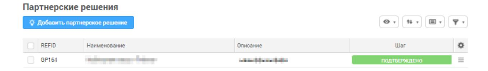

*Рисунок 95. Подтверждённый партнёрский продукт*

- после заполнения анкеты (подробнее см. в разделе [«Заполнение анкеты по продукту»](#page-92-0)) и подтверждения её корректности со стороны Оператора, ознакомиться и подписать обязательные документы, размещённые Оператором в разделе **«Моя организация» › «Документы»** (подробнее см. в разделе [«Подписание документов»](#page-100-0)):
  - Декларация на продукт;
  - Заявление о вступлении в Меморандум;
  - NDA.

#### **5.3.3. Заполнение анкеты по продукту**

Для заполнения анкеты регистрации продукта:

• в разделе **«Моя организация» › «Документы»** нажать кнопку **[ Заполнить анкету ]**.

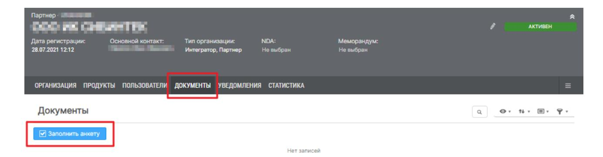

*Рисунок 96. Переход к заполнению анкеты*

- в модальном окне **«Анкета»** заполнить поля ввода данных (обязательные поля отмечены красными звёздочками) и нажать кнопку **[ Сохранить ]**:
  - **«В каких сегментах используются ваши решения»** установить флажки выбора напротив актуальных сегментов (**«Опт»**, **«Розница»**, **«HORECA»**, **«Заправки»**, **«Фарма»**, **«Производство»**, **«Сети»** и/или **«Другое»**);

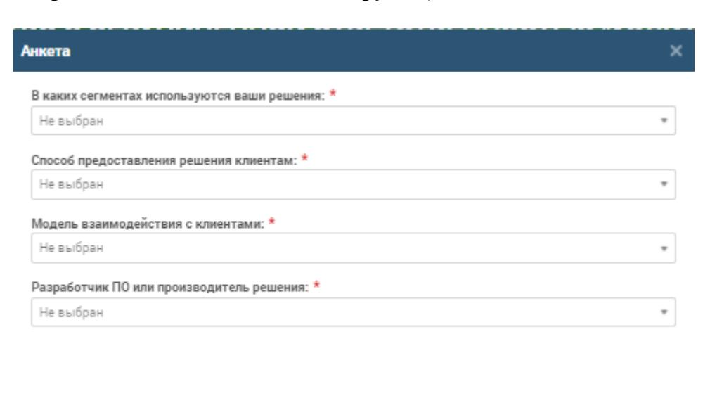

*Рисунок 97. Анкета*

- **«Другое»** (доступно только при выборе значение **«Другое»** в поле **«В каких сегментах используются ваши решения»**) — заполнить прямым вводом. Длина значения — не более 40 знаков;
- **«Способ предоставления решения клиентам»** (**«Облачное решение»**, **«Локальное решение»** и/или **«Другое»**);
- **«Другое»** (доступно только при выборе значение **«Другое»** в поле **«Способ предоставления решения клиентам»**) — заполнить прямым вводом. Длина значения не более 40 знаков;
- **«Модель взаимодействия с клиентами»** (**«Прямое взаимодействие»**, **«Через партнеров»** и/или **«Смешанная»**);
- **«Разработчик ПО или производитель решения»** (**«ПО собственной разработки»**, **«ПО разработанное партнером»**, **«Оборудование собственной разработки»** и/или **«Оборудование разработанное партнером»**).

После заполнения анкета переходит в статус **«На подтверждении»** и после одобрения Оператором переходит в статус **«Подтверждена»**.

## **5.4. Редактирование данных о пользователях**

Помимо основного контактного лица, сведения о котором подаются в систему на этапе формирования заявки на регистрацию (см. раздел «[Формирование заявки на регистрацию»](#page-6-0)), в карточке организации доступна подача сведений о дополнительных пользователях и контактных лицах.

Пользователями Реестра интеграторов и партнёров являются лица, которым предоставлено право входа в систему.

Контактными лицами являются сотрудники организации без права входа в систему, к которым служба технической поддержки Оператора может обратиться за предоставлением информации, связанной с деятельностью организации в рамках Реестра интеграторов и партнёров.

Для добавления нового пользователя и/или контактного лица:

- в **«Главном меню»** перейти в раздел **«Моя организация»**;
- во вкладке **«Организация»** в блоке **«Контакты»** нажать кнопку ;

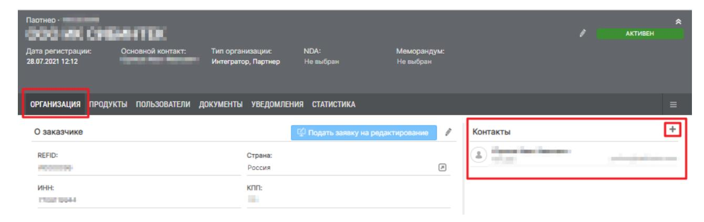

*Рисунок 98. Расположение кнопки добавления пользователей и контактных лиц*

- заполнить поля формы **«Контакты»** (обязательные поля отмечены красной звёздочкой):
  - **«Создаваемый контакт будет Пользователем в РИ»** активировать переключатель перемещением вправо (при необходимости).

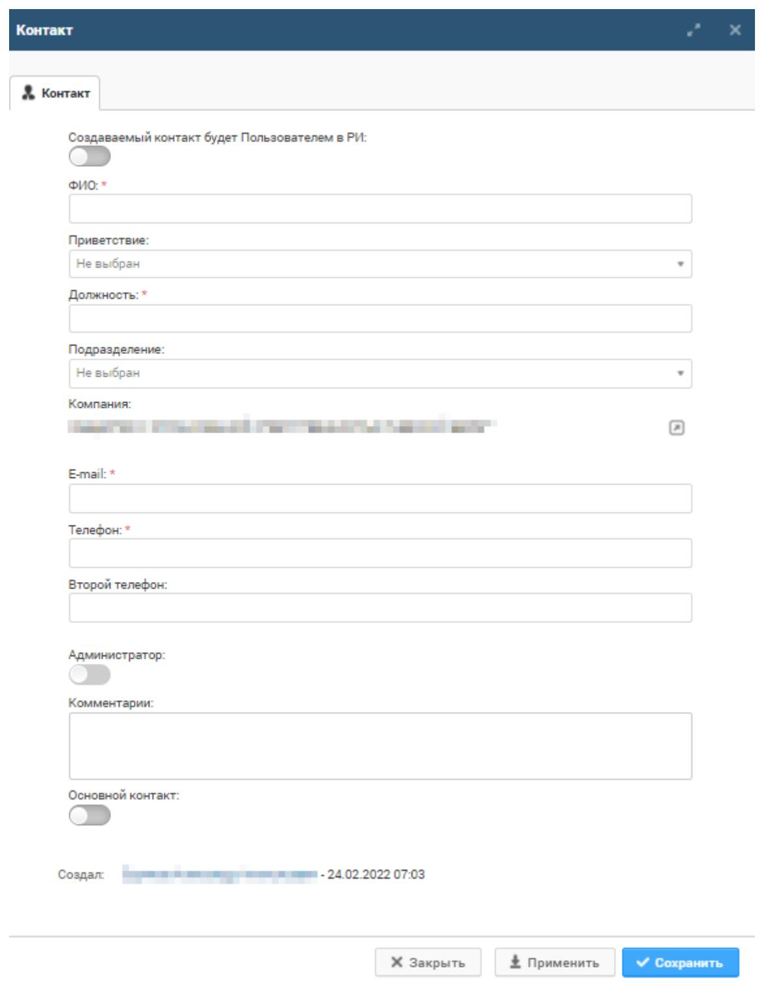

*Рисунок 99. Модальное окно добавления пользователей и контактных лиц*

Если активировано, то добавляемый сотрудник организации будет зарегистрирован в качестве пользователя Реестра интеграторов и партнёров с правом входа в систему. На основании данных формы автоматически генерируется учётная запись пользователя и на указанный адрес электронной почты направляется оповещение с данными доступа (только для организаций в статусе **«Активен»**). Для одной организации допустимо создание не более 3-х пользователей. Просмотр списка пользователей системы доступен в разделе **«Моя организация» › «Пользователи»**.

Если значение не активировано, то добавляемый сотрудник будет зарегистрирован как

контактное лицо без права доступа в систему.

- **«ФИО»** ввести фамилию, имя и отчество сотрудника прямым вводом;
- **«Приветствие»** выбрать значение **«Г-н»** / **«Г-жа»**;
- **«Должность»** указать значение прямым вводом;
- **«Подразделение»** необязательное поле;
- **«E-mail»** указать адрес электронной почты прямым вводом. Адрес будет использоваться в Реестре интеграторов и партнёров для отправки уведомления о создании учетной записи и данных о логине и пароле. Данный адрес будет указан в качестве логина пользователся для входа в систему;
- **«Телефон»**;
- **«Второй телефон»**;
- **«Администратор»** для назначения пользователя администратором передвинуть переключатель вправо (заблокировано, если переключатель **«Создаваемый контакт будет Пользователем в РИ»** не активирован).

При регистрации организации в Реестре интеграторов и партнёров регистрационные данные организации приходят на адрес электронной почты пользователя с правами администратора.

- **«Комментарии»** заполнить произвольным текстом;
- **«Основной контакт»** для назначения пользователя в качестве основного контактного лица передвинуть переключатель вправо;
- нажать кнопку **[ Сохранить ]** для сохранения изменений и добавления пользователя.

Добавленные пользователи будут отображаться в списке пользователей во вкладке **«Организация»**, а также во вкладке **«Пользователи»**.

## **5.5. Работа с документами**

В данном разделе описаны особенности подачи и подписания различных документов, размещаемых Оператором в разделе **«Моя организация» › «Документы»**, связанные с деятельностью организации в рамках Реестра интеграторов и партнёров.

Подробнее о соответствии документов типам организации см. [«Таблица соответствия](#page-98-0) [обязательности документов и типов организаций](#page-98-0)».

Подробнее о подписании документов см. в разделе «[Подписание документов](#page-100-0)».

Подробнее о заполнении документов для подключения Сервис-провайдера см. в «[Заполнение](#page-105-0)

[анкеты для подключения Сервис-провайдера](#page-105-0)» и «[Подача заявления на договор ПАК](#page-107-0)».

Подробнее о заполнении анкеты по продукту см. в «[Заполнение анкеты по продукту](#page-92-0)».

#### **5.5.1. Таблица соответствия обязательности документов и типов организаций**

Для полнофункциональной работы в Реестре интеграторов и партнёров, следует подписать ряд документов, соответствующих типу организации. Таблица соответствия обязательности документов и типов организаций представлена ниже.

| Тип организации             | Наименование документа                  | Тип документа | Способ подписания                                  | Комментарий                        |
|-----------------------------|--------------------------------------------|---------------|-------------------------------------------------------|------------------------------------|
| Участник оборота товаров | Нет обязательных документов для подписания |               |                                                       |                                    |
| Интегратор                  | NDA                                        | Электронный   | Подписание в личном кабинете при помощи УКЭП | Обязателен для работы в системе |
|                             |                                            | Бумажный      | Добавляется Оператором                             | Обязателен для работы в системе |
|                             | Заявление о вступлении в Меморандум  | Электронный   | Подписание в личном кабинете при помощи УКЭП | Обязателен для работы в системе |
|                             |                                            | Бумажный      | Добавляется Оператором                             | Обязателен для работы в системе |
|                             | Декларация по продуктам и решениям   | Электронный   | Заполнение в личном кабинете без подписания     | Обязателен для работы в системе |

| Тип организации            | Наименование документа                          | Тип документа | Способ подписания                                                       | Комментарий                                              |
|----------------------------|----------------------------------------------------|---------------|----------------------------------------------------------------------------|----------------------------------------------------------|
| Партнёр                    | NDA                                                | Электронный   | Подписание в личном кабинете при помощи УКЭП                      | Обязателен для работы в системе                       |
|                            |                                                    | Бумажный      | Добавляется Оператором                                                  | Обязателен для работы в системе                       |
|                            | Заявление о вступлении в Меморандум          | Электронный   | Подписание в личном кабинете при помощи УКЭП                      | Обязателен для работы в системе                       |
|                            |                                                    | Бумажный      | Добавляется Оператором                                                  | Обязателен для работы в системе                       |
|                            | Декларация по продуктам и решениям           | Электронный   | Заполнение в личном кабинете без подписания                          | Обязателен для работы в системе                       |
| Сервис-провайдер           | Заявление на Договор ПАК                        | Электронный   | Подписание в личном кабинете при помощи УКЭП                      | Обязателен для работы в системе                       |
|                            | Договор на ПАК                                     | Электронный   | Подписание в личном кабинете при помощи УКЭП                      | Обязателен для работы в системе                       |
| Самозанятый разработчик | Согласие на обработку персональных данных | Бумажный      | Поступает в систему после регистрации, вкладывается участником | Оригинал направляется в адрес ЦРПТ для хранения |
|                            | NDA                                                | Бумажный      | Добавляется Оператором                                                  | Обязателен для работы в системе                       |
|                            | Заявление о вступлении в Меморандум          | Бумажный      | Добавляется Оператором                                                  | Обязателен для работы в системе                       |

| Тип организации                                 | Наименование документа                 | Тип документа | Способ подписания                                  | Комментарий                        |
|-------------------------------------------------|-------------------------------------------|---------------|-------------------------------------------------------|------------------------------------|
| Комбинация типов: Интегратор, Партнёр, | NDA                                       | Электронный   | Подписание в личном кабинете при помощи УКЭП | Обязателен для работы в системе |
| Участник оборота товаров                     |                                           | Бумажный      | Добавляется Оператором                             | Обязателен для работы в системе |
|                                                 | Заявление о вступлении в Меморандум | Электронный   | Подписание в личном кабинете при помощи УКЭП | Обязателен для работы в системе |
|                                                 |                                           | Бумажный      | Добавляется Оператором                             | Обязателен для работы в системе |
|                                                 | Декларация по продуктам и решениям  | Электронный   | Заполнение в личном кабинете без подписания     | Обязателен для работы в системе |

#### **5.5.2. Подписание документов**

Для подписания документа выполнить следующие действия:

- в **«Главном меню»** перейти в раздел **«Моя организация» › «Документы»**;
- нажать на строку с документом, требующим подписания (такие документы отображаются с отметкой **«Ознакомление»** в столбце **«Шаг»**);
- в окне просмотра документа ознакомиться с содержанием документа;
- если в боковой панели присутствует кнопка **[ Ознакомиться с Меморандумом ]** (актуально только для документа «Заявление о вступлении в Меморандум»), скачать Меморандум и ознакомиться с его текстом;
- если в боковой панели присутствует блок **«Ответственные по договору»** (актуально только для документа NDA), добавить сведения об ответственных по договору.

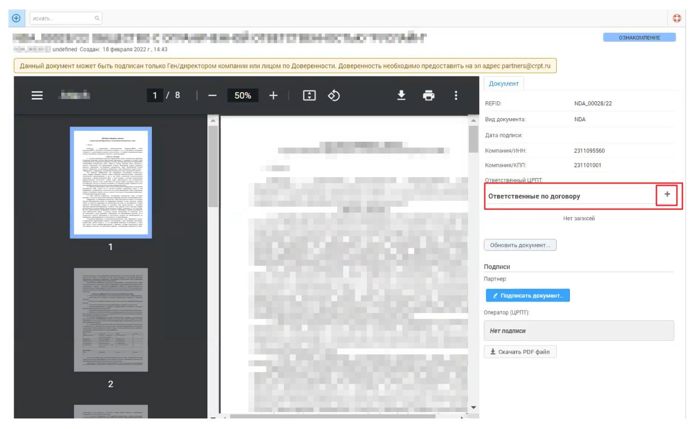

*Рисунок 100. Расположение блока добавления ответственных по договору*

Для добавления ответственных по договору:

- нажать кнопку ;
- заполнить поля модального окна **«Ответственный по договору NDA»**, указав данные сотрудника, ответственного по договору (**«Ф.И.О.»**, **«Должность»**, **«Телефон»**, **«Email»**);
- нажать кнопку **[ Сохранить ]**.

Добавленные данные о сотруднике отобразятся в блоке **«Ответственные по договору»** в боковой панели.

◦ повторить указанные действия необходимое количество раз, указав всех сотрудников, ответственных по договору.

Если блок **«Ответственные по договору»** не заполнен, то при попытке подписания документа отобразится предупреждение о необходимости его заполнения.

*Рисунок 101. Сообщение об ошибке подписания документа*

После появления указанного предупреждения, заполнить требуемые данные, после чего нажать кнопку **[ Обновить документ… ]** для обновления текста документа. Если на момент подписания не производилось обновление текста документа (кнопка **[ Обновить документ… ]** не нажималась), то отобразится предупреждение о необходимости обновления документа.

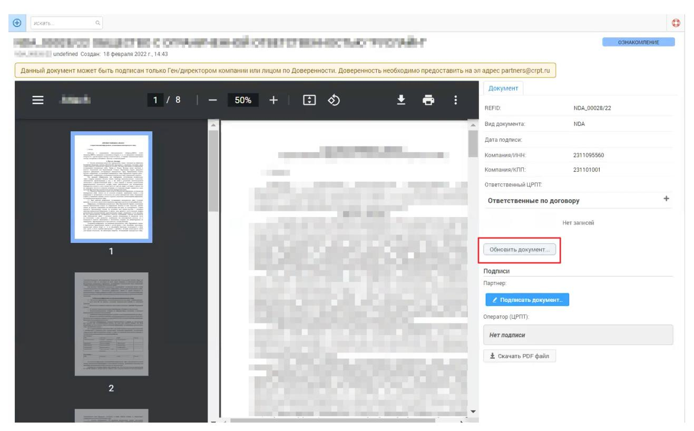

*Рисунок 102. Кнопка обновления документа*

• нажать кнопку **[ Подписать документ… ]** на боковой панели.

Для скачивания документа нажать кнопку **[ Скачать PDF файл ]**.

• в модальном окне подписания документа выбрать сертификат УКЭП и нажать кнопку **[ Подписать документ ]**.

Пользователю, имеющему полномочия подписывать электронные документы от лица компании, необходимо ввести номер МЧД, выпущенной в ФНС, в соответствующем поле. При подписании Генеральным директором организации, вводить номер МЧД не требуется.

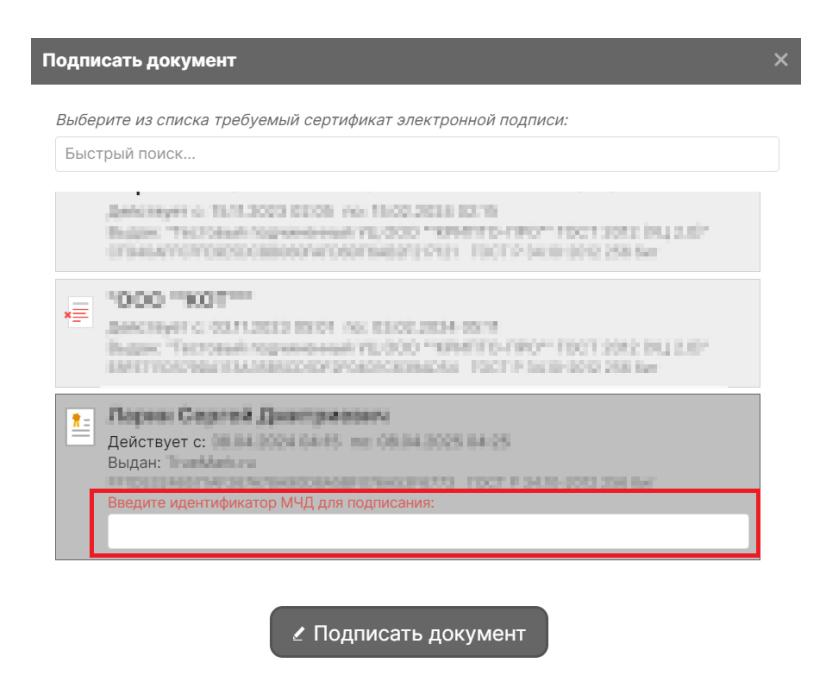

*Рисунок 103. Модальное окно с полем ввода идентификатора МЧД для подписания*

В момент выбора сертификата для подписания документа осуществляется проверка УКЭП на соответствие требованиям.

В случае несоответствия УКЭП, в модальном окне **«Подписать документ»** отобразится информационное сообщение с причинами несоответствия. Информационные сообщения являются предупреждающими, а не ограничивающими подпись и не блокируют процесс подписания:

- **«Документ не может быть подписан тестовым сертификатом»**;
- **«Сертификат отозван»**;
- **«Сертификат не содержит ИНН»**;
- **«Наименование организации в сертификате не соответствует указанному в системе»**;
- **«ИНН в сертификате не соответствует указанному в системе»**;
- **«Генеральный директор в сертификате не соответствует указанному в системе»**;
- **«Ошибка проверки подлинности сертификата: невозможно установить цепочку сертификатов. Возможно, сертификат выдан не доверенным УЦ»**;
- **«Истек срок сертификата»** (подписание недоступно).

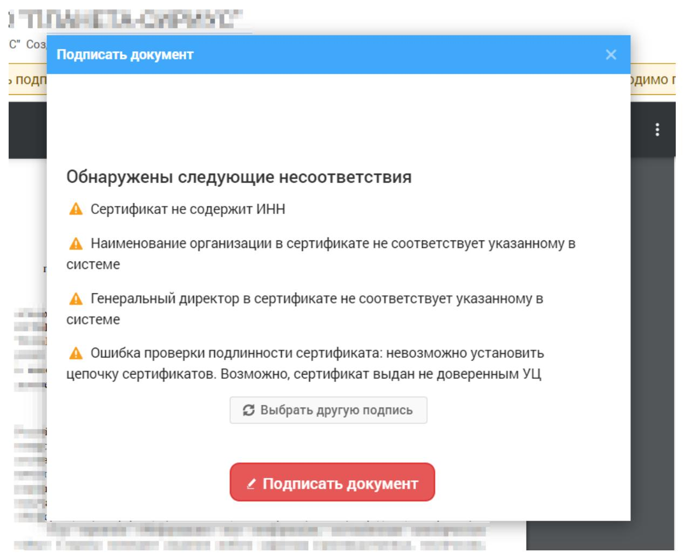

*Рисунок 104. Модальное окно с предупреждающей информацией о несоответствии УКЭП*

Во вкладке **«Документы»** в столбце **«Шаг»** с пометкой **«На рассмотрении»** отобразится подписанный документ;

- дождаться перехода документа в статус **«Подписан»** (соответствующая пометка отобразится в столбце **«Шаг»**) после проверки корректности подписания и подтверждения со стороны Оператора;
- если при подписании документа были выявлены ошибки, то документ будет возвращён в статус **«Ознакомление»** с отображением причины возврата в столбце **«Причина отклонения/возврата»**.

#### В этом случае:

- внести требуемые корректировки;
- открыть документ в модальном окне просмотра документа;
- нажать кнопку **[ Обновить документ… ]**;
- подписать документ, отправив его на повторную проверку.

#### **5.5.3. Заполнение анкеты для подключения Сервис-провайдера**

Для заполнения анкеты для подключения Сервис-провайдера:

• в разделе **«Моя организация» › «Документы»** нажать кнопку **[ Заполнить анкету ]**;

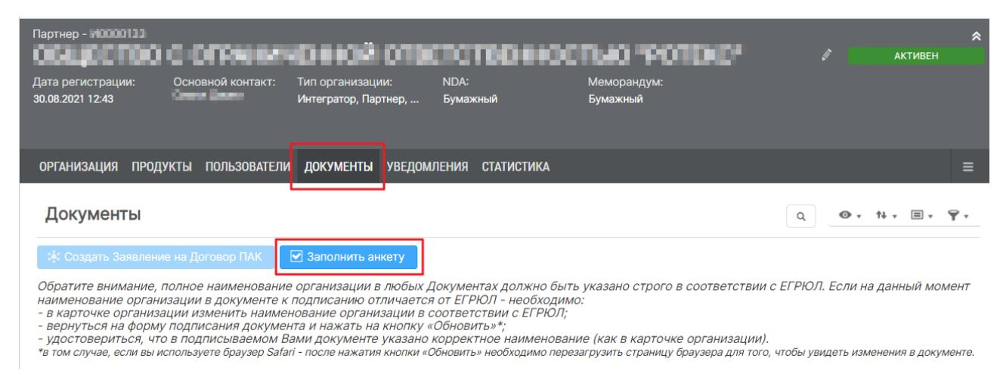

*Рисунок 105. Расположение кнопки перехода к заполнению анкеты*

- в модальном окне **«Анкета на проверку оборудования Сервис-провайдера на соответствие техническим характеристикам»** заполнить поля ввода данных (обязательные поля отмечены красными звёздочками) и нажать кнопку **[ Сохранить ]**:
  - **«Комплекс полиграфического оборудования для производства упаковки/этикетки»**
    - выбрать значение из выпадающего списка:
      - **«Печатная машина для глубокой печати»**;
      - **«Печатная машина для офсетной печати»**;
      - **«Печатная машина для трафаретной печати»**;
      - **«Печатная машина для флексографической печати»**;
      - **«Печатная машина для комбинированной печати»**;
      - **«Цифровые печатные машины»**;
      - **«Другое»**.

При выборе данного значения заполнить дополнительное обязательное поле **«Другое»** произвольным значением.

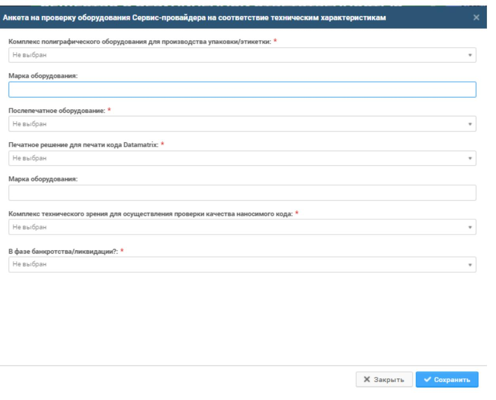

*Рисунок 106. Анкета на проверку оборудования*

- **«Марка оборудования»** указать прямым вводом марку комплекса полиграфического оборудования для производства упаковки/этикетки;
- **«Послепечатное оборудование»** выбрать значение из выпадающего списка:
  - **«Резательная машина»**;
  - **«Ламинационная машина»**;
  - **«Фальцовочная машина»**;
  - **«Лакировальная машина»**;
  - **«Биговальная машина»**;
  - **«Прессы для теснения»**;
  - **«Машина для вырубки»**;
  - **«Другое»**.

При выборе данного значения заполнить дополнительное обязательное поле **«Другое»** произвольным значением.

◦ **«Печатное решение для печати кода Datamatrix»** — выбрать значение из выпадающего списка;

- **«Технология DOD (струйная, отдельным модулем)»**;
- **«Лазерная печать»**;
- **«Термотрансферная»**;
- **«Термоструйная»**;
- **«Каплеструйная»**;
- **«Цифровая печать»**;
- **«Другое»**.

При выборе данного значения заполнить дополнительное обязательное поле **«Другое»** произвольным значением.

- **«Марка оборудования»** указать прямым вводом марку послепечатного оборудования;
- **«Комплекс технического зрения для осуществления проверки качества наносимого кода»** — выбрать **«Да»** / **«Нет»**.

При выборе значения **«Да»** заполнить дополнительное поле **«Марка оборудования»**, указав прямым вводом марку комплекса технического зрения;

◦ **«В фазе банкротства/ликвидации?»** — выбрать **«Да»** / **«Нет»**.

После завершения редактирования, анкета переходит в статус **«На подтверждении»**. После проверки корректности указанных данных Оператором, анкета меняет статус на **«Подтверждена»**, после чего становится доступна возможность создания заявления на Договор ПАК (подробнее см. в разделе «[Подача заявления на договор ПАК»](#page-107-0)).

#### **5.5.4. Подача заявления на договор ПАК**

Для создания заявления на договор ПАК:

• в разделе **«Моя организация» › «Документы»** нажать кнопку **[ Создать Заявление на Договор ПАК ]**;

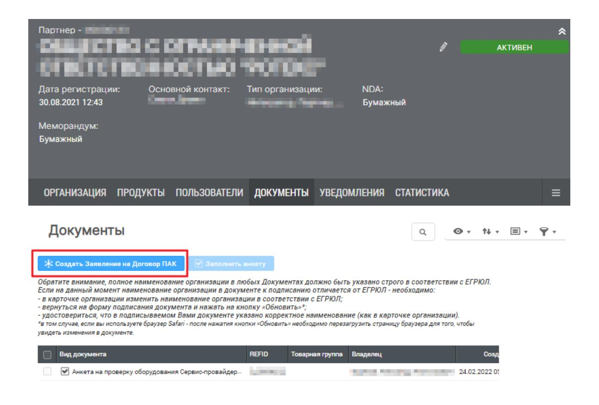

*Рисунок 107. Расположение кнопки перехода к созданию заявления*

• в модальном окне **«Карточка документа»** нажать кнопку **[ Сохранить ]** — заявление переходит в статус **«Генерация»** на время автоматического создания, после чего переходит в статус **«Ознакомление»**;

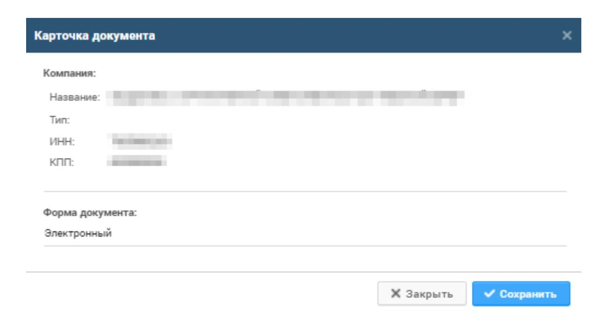

*Рисунок 108. Окно подтверждения создания заявления*

• перейти в окно просмотра документа нажатием на строку заявления в списке документов и подписать документ сертификатом УКЭП, выбрав кнопку **[ Подписать документ… ]** (подробнее см. в разделе «[Подписание документов»](#page-100-0));

*Рисунок 109. Переход к просмотру заявления*

• после согласования Оператором и проверки Службой Безопасности документ переходит в статус **«Подписан»**, а в списке документов появляется договор ПАК в статусе **«Ознакомление»**. Перейти в окно просмотра документа нажатием на строку с договором, ознакомиться и подписать документ сертификатом УКЭП, выбрав кнопку **[ Подписать документ… ]**.

После ответного подписания договора со стороны Оператора, документ переходит в статус **«Подписан»**, а профиль организации переходит в статус **«Активен»**, после чего сведения об организации будут добавлены в перечень сервис-провайдеров в пользовательском интерфейсе СУЗ.

## **ОБРАТИТЕ ВНИМАНИЕ**

При смене юридического адреса организации потребуется повторное подписание договора, который будет сгенерирован автоматически.

После подписания договора со стороны Оператора поступит уведомление, в котором можно ознакомиться с индивидуальным идентификатором (UUID) для работы с СУЗ. Также с идентификатором можно ознакомиться во вкладке **«Организация»** в поле «UUID for SUZ» (см. раздел «[Интерфейс карточки организации](#page-20-1)»)

## **5.6. Просмотр уведомлений**

В данном разделе отображаются уведомления, направляемые Оператором для оповещения пользователя Реестра. Каждое уведомление дублируется письмом на адрес электронной почты основного контактного лица организации, указанного при регистрации (см. раздел [«Формирование заявки на регистрацию](#page-6-0)»).

Для ознакомления с полным текстом уведомления:

• в **«Главном меню»** перейти в раздел **«Моя организация» › «Уведомления»**;

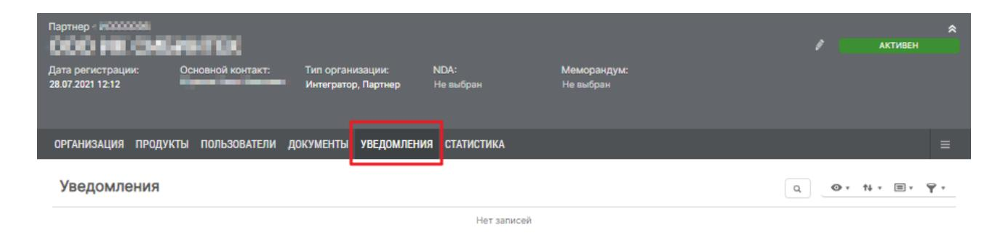

*Рисунок 110. Расположение уведомлений в Реестре интеграторов и партнёров*

При поступлении уведомления в адрес организации оно отображается в списке уведомлений во вкладке **«Уведомления»** в статусе **«На ознакомлении»**.

• нажать на строку с уведомлением и перейти в модальное окно просмотра уведомления;

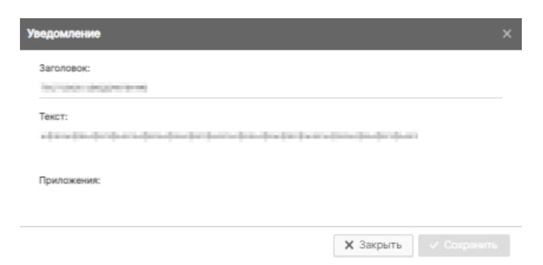

*Рисунок 111. Модальное окно просмотра уведомления*

• ознакомиться с информационным сообщением, после чего нажать кнопку **[ Ознакомился ]** для оповещения Оператора о прочтении и смены статуса уведомления на **«Прочитано»**.

## **5.7. Просмотр статистики использования продуктов к интеграции**

В данном разделе отображаются сведения об установках интеграционных решений участниками оборота товаров. Для перехода в раздел в **«Главном меню»** выбрать раздел **«Моя организация» › «Статистика»**.

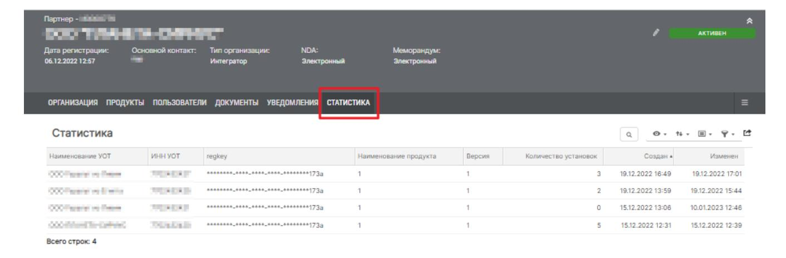

*Рисунок 112. Статистика установок интеграционного решения*

Во вкладке отображается таблица со сведениями об установках интеграционных решений. Если у организации не зарегистрировано ни одного интеграционного решения, то таблица не отображается (вкладка **«Статистика»** будет пустой). В таблице представлены следующие сведения:

- наименование участника оборота товаров, использующего интеграционное решение;
- ИНН участника оборота товаров;
- последние четыре символа регистрационного ключа интеграционного решения;
- версия интеграционного решения;
- количество установок решения участником оборота товаров.

Для скачивания таблицы нажать иконку в правом верхнем углу таблицы и выбрать пункт **«Экспорт таблицы в файл»**. В открывшемся модальном окне установить настройки экспорта (формат и отображаемые поля) и нажать кнопку **[ Экспорт ]**.

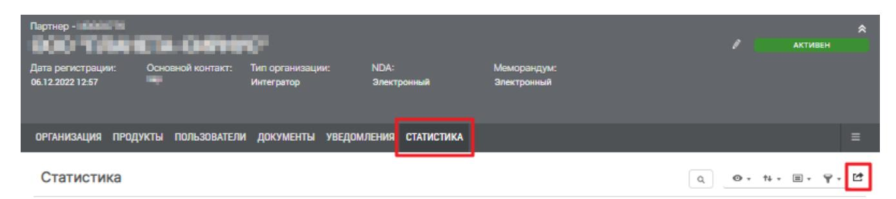

*Рисунок 113. Кнопка экспорта таблицы*

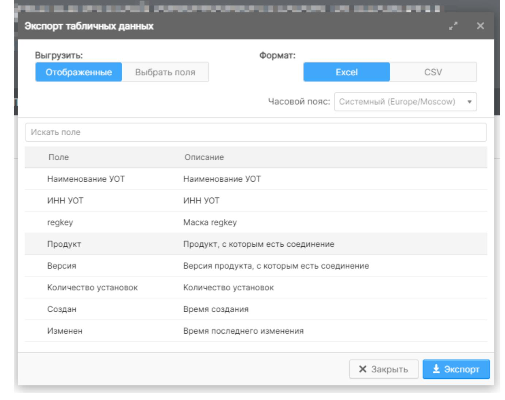

*Рисунок 114. Модальное окно настроек экспорта*

## **5.8. Работа с задачами от Оператора**

В рамках Реестра интеграторов и партнёров Оператору доступна возможность создания задач для отдельных организаций, зарегистрированных в реестре. Примером такого взаимодействия может являться требование по разработке обязательных обновлений для программного обеспечения или партнёрских решений, необходимых для работы с маркированной продукцией. При получении задания организация может взять задачу в работу или отказаться от доработки с указанием причины отказа.

После формирования новой задачи со стороны Оператора и перевода её в статус **«В оценке»**, на почту основного контактного лица организации направляется уведомление о новой задаче со ссылкой для её просмотра в личном кабинете Реестра интеграторов и партнёров.

Для работы с задачей:

• в **«Главном меню»** в блоке **«Задачи»** перейти в раздел **«Открытые»** или в раздел **«Все»**;

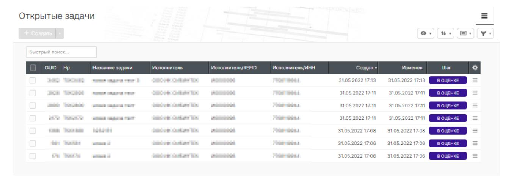

*Рисунок 115. Открытые задачи*

• нажать на строку с задачей и перейти к просмотру карточки задачи;

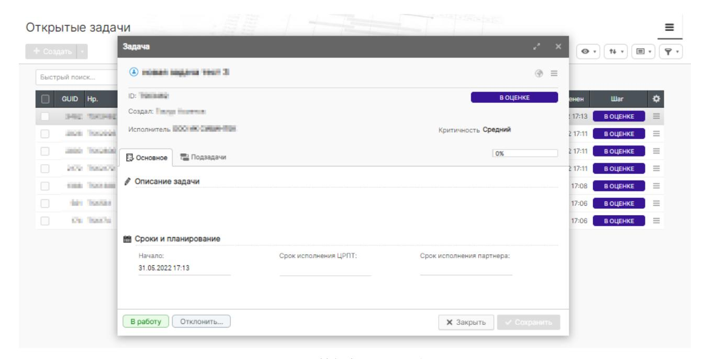

*Рисунок 116. Карточка задачи*

• после ознакомления с описанием задачи во вкладке **«Основное»** (поле **«Описание задачи»**), а также со сроками исполнения (блок **«Сроки и планирование»**) и приоритетом (поле **«Критичность»**) принять задачу в работу, нажав кнопку **[ В работу ]**, или отклонить задачу, нажав кнопку **[ Отклонить ]** и указав причину отклонения в поле **«Комментарий»**.

После принятия задачи в работу, задача переходит в статус **«В работе»**.

В случае отклонения задача переходит в статус **«Отклонена»** и перемещается в раздел **«Отмененные»**.

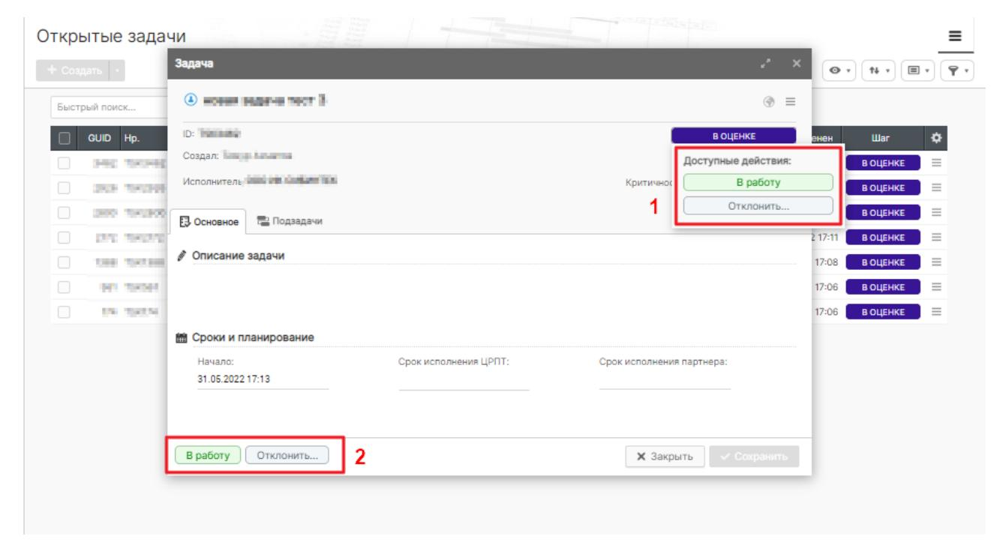

*Рисунок 117. Расположение кнопок действий*

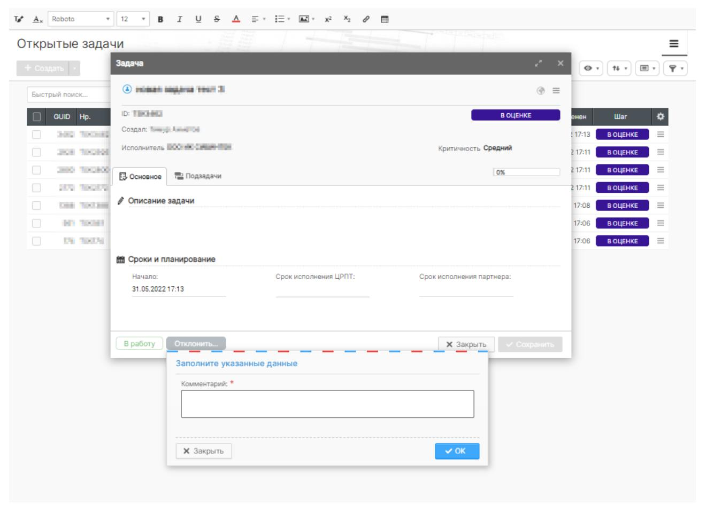

*Рисунок 118. Указание причины отклонения*

• для просмотра связанных подзадач, в карточке задачи перейти во вкладку **«Подзадачи»**, после чего в строке с названием подзадачи нажать иконку . Функционал карточки подзадачи полностью совпадает с функционалом карточки родительской задачи. Для возврата в карточку родительской задачи нажать кнопку **[ Закрыть ]**.

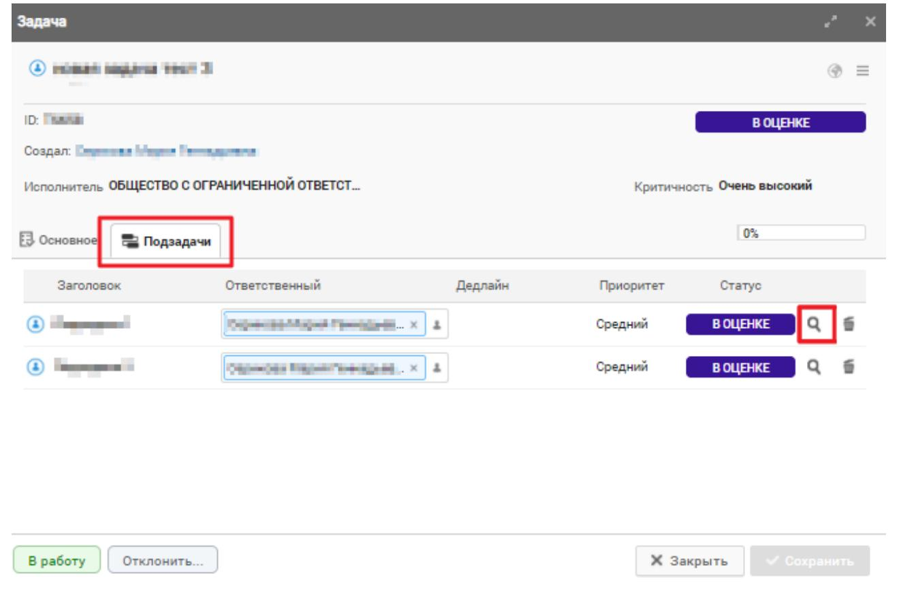

*Рисунок 119. Кнопка просмотра подзадачи*

• после завершения работы над задачей отправить задачу на проверку, нажав кнопку **[ На проверку ]** в блоке действий в нижней части карточки задачи или нажатием на статус задачи. Задача переходит в статус **«На проверке»** для подтверждения со стороны Оператора.

В случае обнаружения неточностей Оператор может перевести задачу на доработку с указанием причины отказа в приёмке. В этом случае задача отображается в личном кабинете Реестра интеграторов и партнёров в статусе **«На доработке»**, а уведомление с указанием причины отклонения направляется на почту основного контактного лица организации. В этом случае для принятия задачу на доработку нажать кнопку **[ В работе ]**, а после исправления замечаний отправить задачу на повторную проверку Оператору.

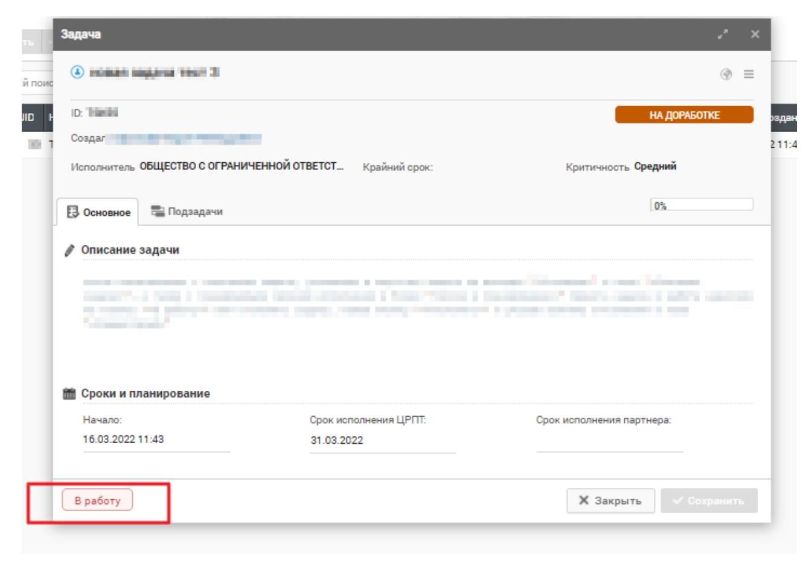

*Рисунок 120. Принятие задачи на доработку*

## **5.9. Статистика**

В рамках Реестра интеграторов и партнёров организациям с видами деятельности **«Оператор фискальных данных»**, **«Оператор электронного документооборота»** и **«Оператор станции управления заказами»** доступна возможность просмотра статистических сведений по обмену информацией с ОФД (подробнее см. в [«Статистика ОФД»](#page-116-1)), операторами ЭДО (подробнее см. в [«Статистика ЭДО»](#page-118-0)) и операторами СУЗ (подробнее см. в [«Статистика СУЗ](#page-120-0)») соответственно.

#### **5.9.1. Статистика ОФД**

Для просмотра статистики ОФД:

• в **«Главном меню»** в блоке **«Отчетность»** перейти в раздел **«ОФД»**;

*Рисунок 121. Отчётность ОФД*

• в блоке настройки периода выгрузки данных (элемент 1 на рисунке) установить даты начала и окончания периода (включительно) нажатием на иконки в соответствующих полях, после чего нажать кнопку **[ Применить ]**. Период выгрузки данных не должен превышать 93 календарных дня. По умолчанию, выгрузка производится за последний месяц.

В загруженной выгрузке данных доступна следующая информация:

- **«Количество переданных чеков»** отображается информация о распределении общего количества чеков, поступивших в ГИС МТ, ФГИС МДЛП и «ИР Маркировки», по всем ОФД (элемент 2). Информация о количестве чеков, переданных от текущего оператора, представлена в табличной части блока в относительных (столбец **«% трафика»**) и абсолютных (столбец **«Всего»**) величинах, а также отмечена на гистограмме столбцом красного цвета;
- **«Количество чеков»** в таблице отображена информация о распределении количества чеков, переданных в ГИС МТ, ФГИС МДЛП и «ИР Маркировки» от текущего оператора, по товарным группам (элемент 3).
- **«Количество ИНН у ОФД»** отображается информация о распределении общего количества участников оборота товаров, передающих документы в ГИС МТ, ФГИС МДЛП и «ИР Маркировки», по всем ОФД (элемент 4). Информация о количестве участников оборота, передающих данные через текущего оператора, представлена в табличной части блока в абсолютных (столбец **«Количество УОТ»**) и относительных (столбец **«% УОТ»**) величинах, а также отмечена на гистограмме столбцом красного цвета;
- **«Ошибки в чеках»** в табличном виде отображена информация о зафиксированных ошибках обработки чеков, поступивших в ГИС МТ, ФГИС МДЛП и «ИР Маркировки» от текущего ОФД:

- **«Кол-во»** количество чеков, обработанных с ошибками;
- **«Всего чеков»** количество поступивших чеков;
- **«Корректных»** количество корректно обработанных чеков;
- **«Ошибки без дубликатов»** количество чеков, обработанных с ошибками, без учёта чеков с ошибкой «4 — DuplicateDocument: Документ <идентификатор документа> зарегистрирован ранее»;
- **«% Ошибок без дубликатов»** доля чеков, обработанных с ошибками (без учёта чеков с ошибкой «4 — DuplicateDocument: Документ <идентификатор документа> зарегистрирован ранее»), относительно общего количества поступивших чеков;
- **«Всего ошибок»** количество чеков, обработанных с ошибками (значение совпадает с полем **«Кол-во»**);
- **«% ошибок»** доля чеков, обработанных с ошибками, относительно общего количества поступивших чеков;
- распределение количества чеков, обработанных с ошибками, по типам ошибок (описание представленных ошибок см. в [«Описание ошибок обработки документов в личном](https://честныйзнак.рф/business/doc/?id=Инструкция_по_возникающим_ошибкам.html) [кабинете и по API»\)](https://честныйзнак.рф/business/doc/?id=Инструкция_по_возникающим_ошибкам.html).

#### **5.9.2. Статистика ЭДО**

Для просмотра статистики ЭДО:

• в **«Главном меню»** в блоке **«Отчетность»** перейти в раздел **«ЭДО»**;

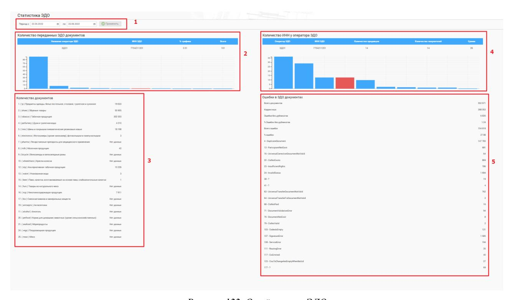

*Рисунок 122. Отчётность ЭДО*

• в блоке настройки периода выгрузки данных (элемент 1 на рисунке) установить даты начала и окончания периода (включительно) нажатием на иконки в соответствующих полях, после чего нажать кнопку **[ Применить ]**. Период выгрузки данных не должен превышать 185 календарных дней. По умолчанию, выгрузка производится за последний месяц.

В загруженной выгрузке данных доступна следующая информация:

- **«Количество переданных ЭДО документов»** отображается информация о распределении общего количества документов ЭДО, поступивших в ГИС МТ, ФГИС МДЛП и «ИР Маркировки», по всем операторам ЭДО (элемент 2). Информация о количестве документов, поступивших от текущего оператора, представлена в табличной части блока в относительных (столбец **«% трафика»**) и абсолютных (столбец **«Всего»**) величинах, а также отмечена на гистограмме столбцом красного цвета;
- **«Количество документов»** в таблице отображена информация о распределении количества документов, поступивших в ГИС МТ, ФГИС МДЛП и «ИР Маркировки» от текущего оператора ЭДО, по товарным группам (элемент 3).
- **«Количество ИНН у оператора ЭДО»** отображается информация о распределении общего количества участников оборота товаров, передающих документы в ГИС МТ, ФГИС МДЛП и «ИР Маркировки», по всем операторам ЭДО (элемент 4). Информация о количестве участников оборота, передающих данные через текущего оператора, представлена в табличной части блока в столбце **«Сумма»** в абсолютных величинах, а также отмечена на гистограмме столбцом красного цвета. Абсолютное значение числа продавцов и покупателей для текущего оператора отображено в таблице в столбцах **Количество продавцов»** и **«Количество покупателей»** соответственно;
- **«Ошибки в ЭДО документах»** в табличном виде отображена информация о возникших ошибках обработки документов, поступивших в ГИС МТ, ФГИС МДЛП и «ИР Маркировки» от текущего оператора ЭДО (элемент 5):
  - **«Всего документов»** количество поступивших документов;
  - **«Корректных»** количество корректно обработанных документов;
  - **«Ошибки без дубликатов»** количество документов, обработанных с ошибками, без учёта документов с ошибкой «4 — DuplicateDocument: Документ <идентификатор документа> зарегистрирован ранее»;
  - **«% Ошибок без дубликатов»** доля документов, обработанных с ошибками (без учёта документов с ошибкой «4 — DuplicateDocument: Документ <идентификатор документа> зарегистрирован ранее»), относительно общего количества поступивших документов;
  - **«Всего ошибок»** количество документов, обработанных с ошибками;
  - **«% ошибок»** доля документов, обработанных с ошибками, относительно общего

количества поступивших документов;

◦ распределение количества документов, обработанных с ошибками, по типам ошибок (описание представленных ошибок см. в [«Описание ошибок обработки документов в](https://честныйзнак.рф/business/doc/?id=Инструкция_по_возникающим_ошибкам.html) [личном кабинете и по API»\)](https://честныйзнак.рф/business/doc/?id=Инструкция_по_возникающим_ошибкам.html).

## **5.9.3. Статистика СУЗ**

Просмотр статистики СУЗ доступен в случае, если у участника оборота товара есть версия продукта в статусе **«Допущен в промышленную среду»** и статус ключа СУЗ **«Активен»**.

Для просмотра статистики СУЗ:

• в **«Главном меню»** в блоке **«Отчетность»** перейти в раздел **«СУЗ»**;

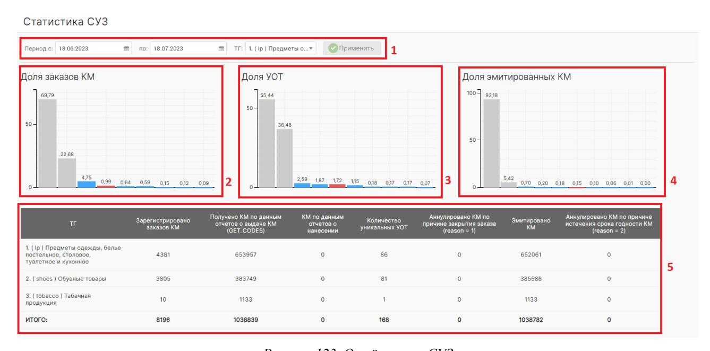

*Рисунок 123. Отчётность СУЗ*

• в блоке настройки периода выгрузки данных и выбора товарных групп, доступных в промышленную среду (элемент 1 на рисунке) установить даты начала и окончания периода (включительно) нажатием на иконки в соответствующих полях и флажки для товарных групп, по которым требуется построить отчёт, после чего нажать кнопку **[ Применить ]**. Период выгрузки данных не должен превышать 180 календарных дней. По умолчанию, выгрузка производится за последний месяц.

В загруженной выгрузке данных доступна следующая информация:

- **«Доля заказов КМ»** отображается информация о зарегистрированных заказах КМ по всем операторам СУЗ (элемент 2). Информация о количестве заказов КМ, поступивших от текущего оператора отмечена на гистограмме столбцом красного цвета;
- **«Для УОТ»** отображается доля участников оборота товаров, по которым

- зарегистрированы заказы КМ (элемент 3). Информация о доле участника оборота товаров, поступившая от текущего оператора отмечена на гистограмме столбцом красного цвета;
- **«Доля эмитированных КМ»** отображается доля эмитированных КМ по заказам КМ, зарегистрированным участником оборота товаров, от общего количества эмитированных КМ в ГИС МТ за указанный период (элемент 4). Информация о доли эмитированных КМ, поступившая от текущего оператора отмечена на гистограмме столбцом красного цвета;
- в табличном виде отображается информация по закрытым квитанциям СУЗ от текущего оператора (элемент 5):
  - **«Товарная группа»** товарная группа, по которой сформирована статистика СУЗ;
  - **«Зарегистрировано заказов КМ»** количество зарегистрированных заказов КМ;
  - **«Получено КМ по данным отчетов о выдаче КМ (GET\_CODES)»** количество КМ, полученных через отчёты о выдаче КМ (GET\_CODES);
  - **«КМ по данным отчетов о нанесении»** количество КМ по которым подан отчёт о нанесении;
  - **«Количество уникальных УОТ»** количество уникальных участников оборота товаров, регистрировавших заказы КМ;
  - **«Аннулировано КМ по причине закрытия заказа (reason = 1)»** количество КМ, аннулированных по причине закрытия заказа (reason = 1);
  - **«Эмитировано КМ»** количество эмитированных КМ;
  - **«Аннулировано КМ по причине истечения срока годности КМ (reason = 2)»** количество КМ, аннулированных по причине истечения срока годности КМ (reason = 2).

## **5.10. Сведения о нормативно-правовых актах**

Раздел **«Сведения о НПА»** предназначен для отображения справочной информации о нормативно-правовых актах, регламентирующих процесс маркировки товаров.

Для просмотра всех доступных нормативно-правовых актов перейти в раздел **«Сведения о НПА»** и выбрать значение **«Все»** из выпадающего списка.

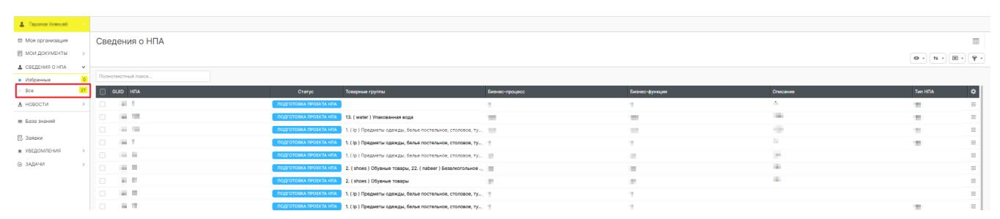

*Рисунок 124. Сведения о НПА*

Сведения о НПА представлены в табличном виде. По умолчанию записи отсортированы по дате

создания от самых ранних к самым поздним. Непрочитанные записи отмечены полужирным шрифтом. Описание полей таблицы представлено ниже.

| Название столбца | Описание                                                            |  |
|------------------|---------------------------------------------------------------------|--|
| НПА              | Название нормативно-правового акта                                  |  |
| Статус           | Текущий статус НПА.                                                 |  |
|                  | Возможные значения:                                                 |  |
|                  | «Подготовка проекта НПА»;                                           |  |
|                  | «Действует»;                                                        |  |
|                  | «Утратил силу»                                                      |  |
| Товарные группы  | Товарные группы, которые затрагивает НПА                            |  |
| Бизнес-процесс   | Краткое описание бизнес-процесса                                    |  |
| Бизнес-функции   | Краткое описание бизнес-функции                                     |  |
| Описание         | Описание записи об НПА                                              |  |
| Тип НПА          | Тип НПА.                                                            |  |
|                  | Возможные значения:                                                 |  |
|                  | «ФЗ» – Федеральный закон;                                           |  |
|                  | «ПП РФ» – Постановление Правительства РФ об утверждении правил      |  |
|                  | маркировки;                                                         |  |
|                  | «Приказ ФНС», «Приказ МПТ» и т.д. — приказ Федеральной налоговой |  |
|                  | службы, Министерства промышленности и торговли и т.д.               |  |

Для поиска по записям в таблице использовать строку поиска, расположенную над таблицей.

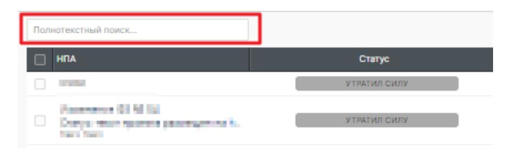

*Рисунок 125. Строка поиска*

Для ознакомления с более подробной информацией о НПА нажать на соответствующую строку в таблице и при необходимости перейти по приложенным ссылкам. Для добавления записи в список избранных, при просмотре записи установить .

*Рисунок 126. Подробная информация о нормативно-правовом акте*

В общем списке избранные записи выделены темно-серым фоном. Для просмотра всех избранных записей в разделе **«Сведения о НПА»** выбрать значение **«Избранные»** из выпадающего списка.

## **5.11. Просмотр новостей**

В данном разделе отображаются новости, касающиеся Реестра интеграторов и партнёров.

Для ознакомления с полным текстом новости:

• перейти в раздел **«Новости»**;

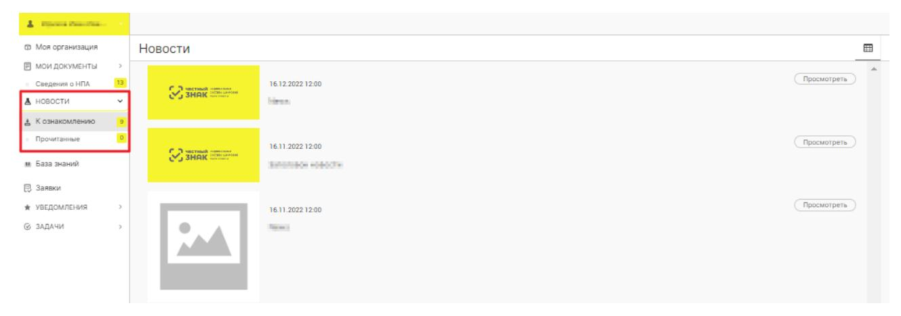

*Рисунок 127. Просмотр новостей*

|   | Поступление новостей отображается в разделе «Новости» в статусе «К ознакомлению».                                                                            |
|---|-----------------------------------------------------------------------------------------------------------------------------------------------------------------|
| • | нажать на строку с новостями и перейти в модальное окно просмотра новостей, после чего нажать кнопку [ Закрыть ]. Статус новости изменится на «Прочитанные». |
|   |                                                                                                                                                                 |
|   |                                                                                                                                                                 |
|   |                                                                                                                                                                 |
|   |                                                                                                                                                                 |
|   |                                                                                                                                                                 |
|   |                                                                                                                                                                 |
|   |                                                                                                                                                                 |
|   |                                                                                                                                                                 |
|   |                                                                                                                                                                 |
|   |                                                                                                                                                                 |
|   |                                                                                                                                                                 |
|   |                                                                                                                                                                 |
|   |                                                                                                                                                                 |
|   |                                                                                                                                                                 |
|   |                                                                                                                                                                 |
|   |                                                                                                                                                                 |
|   |                                                                                                                                                                 |

# Перечень сокращений, условных обозначений и терминов

| Сокращение, условное обозначение, термин | Описание                                                                                                                                                                                                                                                                                                                                                                                                                                                  |
|------------------------------------------|-----------------------------------------------------------------------------------------------------------------------------------------------------------------------------------------------------------------------------------------------------------------------------------------------------------------------------------------------------------------------------------------------------------------------------------------------------------|
| API                                      | Аpplication Programming Interface (интерфейс программирования приложений) — программный интерфейс приложения, набор готовых классов, процедур, функций, структур и констант, предоставляемых приложением (библиотекой, сервисом) или операционной системой для использования во внешних программных продуктах                                                                                                                                             |
| ERP                                      | Enterprise Resource Planning — программное обеспечение для управления бизнеспроцессами предприятия                                                                                                                                                                                                                                                                                                                                                        |
| NDA                                      | Non-disclosure agreement — соглашение о неразглашении                                                                                                                                                                                                                                                                                                                                                                                                     |
| БИК                                      | Банковский идентификационный код                                                                                                                                                                                                                                                                                                                                                                                                                          |
| ΓИС MT                                   | Государственная информационная система, созданная в целях автоматизации процессов сбора и обработки информации об обороте товаров, подлежащих обязательной маркировке средствами идентификации, хранения такой информации, обеспечения доступа к ней, её предоставления и распространения, повышения эффективности обмена такой информацией и обеспечения прослеживаемости указанных товаров, а также в иных целях, предусмотренных федеральными законами |
| ЕГРЮЛ                                    | Единый государственный реестр юридических лиц                                                                                                                                                                                                                                                                                                                                                                                                             |
| ИНН                                      | Идентификационный номер налогоплательщика — цифровой код, упорядочивающий учёт налогоплательщиков в Российской Федерации                                                                                                                                                                                                                                                                                                                                  |

| Сокращение, условное обозначение, термин | Описание                                                                                                                                                                                        |
|------------------------------------------|-------------------------------------------------------------------------------------------------------------------------------------------------------------------------------------------------|
| ИП                                       | Индивидуальный предприниматель                                                                                                                                                                  |
| ИТИН                                     | Индивидуальный идентификационный номер налогоплательщика                                                                                                                                     |
| КМ                                       | Код маркировки — совокупность уникального идентификатора товара (SGTIN) и кода проверки (КП), применяемая для идентификации товара, в том числе в потребительской упаковке          |
| КПП                                      | Код причины постановки на учёт                                                                                                                                                                  |
| КФХ                                      | Крестьянское (фермерское) хозяйство                                                                                                                                                             |
| Меморандум                               | Меморандум о сотрудничестве и взаимодействии в целях разработки технических решений, применяемых в процессе обязательной маркировки товаров средствами идентификации                |
| МЧД                                      | Машиночитаемая доверенность                                                                                                                                                                     |
| НПА                                      | Нормативно-правовой акт                                                                                                                                                                         |
| ОФД                                      | Оператор фискальных данных — юридическое лицо, созданное специально для осуществления приёма, обработки, хранения и передачи фискальных данных в Федеральную налоговую службу (ФНС) |
| ПАК                                      | Программно-аппаратный комплекс                                                                                                                                                                  |
| ПОСС                                     | Программное обеспечение смежной системы                                                                                                                                                         |
| ПО                                       | Программное обеспечение                                                                                                                                                                         |
| РИ                                       | Реестр партнёров и интеграторов                                                                                                                                                                 |
| СБ                                       | Служба безопасности                                                                                                                                                                             |

| Сервис-провайдер Юридическое лицо, осуществляющее по поручению участника оборота преобразование КМ в средство идентификации и (или) нанесение средства идентификации на потребительскую упаковку, на этикетку или на стикер. Сервис-провайдеры должны иметь комплекс полиграфического оборудования с производительностью, достаточной для преобразования и нанесения средств идентификации по поручению участника оборота, но не ниже регулярно размещаемых заказов на производство упаковки и этикеток от участника оборота товаров, и обеспечивающей нанесение символов кодов маркировки не ниже класса 2,5 (В) в соответствии с требованиями национального |  |
|---------------------------------------------------------------------------------------------------------------------------------------------------------------------------------------------------------------------------------------------------------------------------------------------------------------------------------------------------------------------------------------------------------------------------------------------------------------------------------------------------------------------------------------------------------------------------------------------------------------------------------------------------------------------------------------------------------------|--|
|                                                                                                                                                                                                                                                                                                                                                                                                                                                                                                                                                                                                                                                                                                               |  |
|                                                                                                                                                                                                                                                                                                                                                                                                                                                                                                                                                                                                                                                                                                               |  |
|                                                                                                                                                                                                                                                                                                                                                                                                                                                                                                                                                                                                                                                                                                               |  |
|                                                                                                                                                                                                                                                                                                                                                                                                                                                                                                                                                                                                                                                                                                               |  |
|                                                                                                                                                                                                                                                                                                                                                                                                                                                                                                                                                                                                                                                                                                               |  |
|                                                                                                                                                                                                                                                                                                                                                                                                                                                                                                                                                                                                                                                                                                               |  |
|                                                                                                                                                                                                                                                                                                                                                                                                                                                                                                                                                                                                                                                                                                               |  |
|                                                                                                                                                                                                                                                                                                                                                                                                                                                                                                                                                                                                                                                                                                               |  |
|                                                                                                                                                                                                                                                                                                                                                                                                                                                                                                                                                                                                                                                                                                               |  |
|                                                                                                                                                                                                                                                                                                                                                                                                                                                                                                                                                                                                                                                                                                               |  |
|                                                                                                                                                                                                                                                                                                                                                                                                                                                                                                                                                                                                                                                                                                               |  |
|                                                                                                                                                                                                                                                                                                                                                                                                                                                                                                                                                                                                                                                                                                               |  |
|                                                                                                                                                                                                                                                                                                                                                                                                                                                                                                                                                                                                                                                                                                               |  |
|                                                                                                                                                                                                                                                                                                                                                                                                                                                                                                                                                                                                                                                                                                               |  |
|                                                                                                                                                                                                                                                                                                                                                                                                                                                                                                                                                                                                                                                                                                               |  |
| стандарта Российской Федерации ГОСТ Р                                                                                                                                                                                                                                                                                                                                                                                                                                                                                                                                                                                                                                                                         |  |
| ИСО/МЭК 15415-2012                                                                                                                                                                                                                                                                                                                                                                                                                                                                                                                                                                                                                                                                                            |  |
| СУЗ Станция управления заказами кодов                                                                                                                                                                                                                                                                                                                                                                                                                                                                                                                                                                                                                                                                      |  |
| маркировки                                                                                                                                                                                                                                                                                                                                                                                                                                                                                                                                                                                                                                                                                                    |  |
| ТСД Терминал сбора данных                                                                                                                                                                                                                                                                                                                                                                                                                                                                                                                                                                                                                                                                                  |  |
| УОТ Участник оборота товаров — юридические и                                                                                                                                                                                                                                                                                                                                                                                                                                                                                                                                                                                                                                                               |  |
| физические лица, зарегистрированные в                                                                                                                                                                                                                                                                                                                                                                                                                                                                                                                                                                                                                                                                         |  |
| качестве индивидуальных предпринимателей,                                                                                                                                                                                                                                                                                                                                                                                                                                                                                                                                                                                                                                                                     |  |
| являющиеся налоговыми резидентами                                                                                                                                                                                                                                                                                                                                                                                                                                                                                                                                                                                                                                                                             |  |
| Российской Федерации, осуществляющие ввод                                                                                                                                                                                                                                                                                                                                                                                                                                                                                                                                                                                                                                                                     |  |
| товаров в оборот, оборот и (или) вывод из                                                                                                                                                                                                                                                                                                                                                                                                                                                                                                                                                                                                                                                                     |  |
| оборота товаров, за исключением юридических                                                                                                                                                                                                                                                                                                                                                                                                                                                                                                                                                                                                                                                                   |  |
| лиц и физических лиц, зарегистрированных в                                                                                                                                                                                                                                                                                                                                                                                                                                                                                                                                                                                                                                                                    |  |
| качестве индивидуальных предпринимателей,                                                                                                                                                                                                                                                                                                                                                                                                                                                                                                                                                                                                                                                                     |  |
| приобретающих товары для использования в                                                                                                                                                                                                                                                                                                                                                                                                                                                                                                                                                                                                                                                                      |  |
| целях, не связанных с их последующей                                                                                                                                                                                                                                                                                                                                                                                                                                                                                                                                                                                                                                                                          |  |
| реализаций (продажей)                                                                                                                                                                                                                                                                                                                                                                                                                                                                                                                                                                                                                                                                                         |  |

| Сокращение, условное обозначение, термин | Описание                                          |
|------------------------------------------|---------------------------------------------------|
| ФГИС МДЛП                                | Федеральная Государственная                       |
|                                          | Информационная Система Мониторинга                |
|                                          | Движения Лекарственных Препаратов,                |
|                                          | предназначенная для организации                   |
|                                          | непрерывного мониторинга движения                 |
|                                          | лекарственных препаратов от производителя         |
|                                          | до конечного потребителя с использованием         |
|                                          | маркировки (кодификации) и идентификации          |
|                                          | упаковок лекарственных препаратов в целях         |
|                                          | обеспечения эффективного контроля качества        |
|                                          | лекарственных препаратов, находящихся в           |
|                                          | обращении, и борьбы с их фальсификацией           |
| ЦБ РФ                                    | Центральный банк Российской Федерации             |
| ЭДО                                      | Оператор электронного документооборота —          |
|                                          | организация, обеспечивающая обмен                 |
|                                          | электронными документами, обладающими             |
|                                          | юридической силой. Операторы ЭДО                  |
|                                          | оказывают услуги по организации обмена            |
|                                          | электронными документами по сделкам,              |
|                                          | такими, как договоры, первичные                   |
|                                          | бухгалтерские документы, счёта-фактуры,           |
|                                          | между организациями, являющимися                  |
|                                          | юридическими лицами, индивидуальными              |
|                                          | предпринимателями, государственными               |
|                                          | органами. Список доверенных Операторов            |
|                                          | ЭДО России, входящих в сеть ФНС РФ,               |
|                                          | размещён на официальном сайте налоговой службы |
| Юр.лицо                                  | Юридическое лицо                                  |

## **История изменений**

| Дата       | Версия документа | Изменения                                                                                                                                                                                                                                                                                                                                                                                                                                                                                                                                                                                                                                                                                                                                                                                                                                                                                                                                                                                                                                                                                                                                  |
|------------|---------------------|--------------------------------------------------------------------------------------------------------------------------------------------------------------------------------------------------------------------------------------------------------------------------------------------------------------------------------------------------------------------------------------------------------------------------------------------------------------------------------------------------------------------------------------------------------------------------------------------------------------------------------------------------------------------------------------------------------------------------------------------------------------------------------------------------------------------------------------------------------------------------------------------------------------------------------------------------------------------------------------------------------------------------------------------------------------------------------------------------------------------------------------------|
| 27.04.2026 | 32.0                | Доступна подача заявки с типом продукта «Компонент ТС ПИоТ» и типом компоненты ТС ПИоТ «Библиотека ТС ПИоТ» или «Интеграция с Библиотекой ТС ПИоТ» (см. раздел «Подача заявки на приёмочные испытания ТС ПИоТ»); При смене юридического адреса организации потребуется повторное подписание договора, который будет сгенерирован автоматически (см. раздел «Подача заявления на договор ПАК»); Добавлен раздел «Регистрация новых версий продукта ТС ПИоТ»                                                                                                                                                                                                                                                                                                                                                                                                                                                                                                                                                                                                                                                   |
| 25.03.2026 | 31.0                | В разделе «Таблица соответствия типов организации видам деятельности» актуализирован список видов деятельности для типа организации «Интегратор»; В разделе «Подача заявки на приёмочные испытания ТС ПИоТ» актуализированы рисунки «Выбор профиля деятельности», «Общие сведения», «Тип продукта», «Поля для заполнения Компонента ТС ПИоТ», «Поля для заполнения Модели ТС ПИоТ», «Корректировка полей в сформированной заявке», «Подписание сформированного согласия на предоставление сведений» и «Заявка на приёмочные испытания ТС ПИоТ»; Если у продукта уже есть версия типа «Компонент ТС ПИоТ» со статусом «Допущен в промышленную среду», то для новой версии заявку на приёмочные испытания можно подать в уведомительном режиме (см. раздел «Подача заявки на приёмочные испытания ТС ПИоТ»); При отказе в приёме согласия на предоставление сведений поступает уведомление с причиной отклонения. После её исправления доступно обновление документа без необходимости повторной подачи согласия (см. раздел «Подача заявки на приёмочные испытания ТС ПИоТ») |

| Дата       | Версия документа | Изменения                                                                                                                                                                                                                                                                                                                                                                                                                                                                                                                                                                                                                                                                   |
|------------|---------------------|-----------------------------------------------------------------------------------------------------------------------------------------------------------------------------------------------------------------------------------------------------------------------------------------------------------------------------------------------------------------------------------------------------------------------------------------------------------------------------------------------------------------------------------------------------------------------------------------------------------------------------------------------------------------------------|
| 17.03.2026 | 30.0                | В разделы «Подача заявки на приёмочные испытания в СУЗ», «Подача заявки на приёмочные испытания ГИС (TrueAPI)», «Автотестирование интеграционного решения» добавлено примечание о недоступности кнопок при текущей версии продукта на шаге «Недействителен»                                                                                                                                                                                                                                                                                                                                                                                                  |
| 26.02.2026 | 29.0                | Получение индивидуального идентификатора (UUID) для работы в СУЗ доступно только после подписания договора ПАК со стороны Оператора (см. разделы «Интерфейс карточки организации» и «Подача заявления на договор ПАК»)                                                                                                                                                                                                                                                                                                                                                                                                                                          |
| 26.01.2026 | 28.0                | Заявка на приёмочные испытания ТС ПИоТ формируется автоматически после успешного рассмотрения Оператором заявления о проведении проверки функциональной совместимости, если все ранее поданные заявки закрыты. В связи с этим в разделе «Подача заявки на приёмочные испытания ТС ПИоТ» актуализированы описание и рисунки; При неуспешном прохождении приёмочных испытаний для версий интеграционных продуктов в статусе «Зарегистрирован» доступен перевод версии в статус «Недействителен»; В разделе «Регистрация продукта к интеграции» актуализированы описание и рисунок «Модальное окно добавления продукта к интеграции» |
| 01.12.2025 | 27.0                | Сервис-провайдерам в личном кабинете доступно получение индивидуального идентификатора (UUID) для работы в СУЗ (см. разделы «Формирование заявки на регистрацию» и «Интерфейс карточки организации»); Из заполняемой анкеты для подключения Сервис провайдера удалено поле «Наличие контрактов на изготовление упаковки с производителями готовой молочной продукции или минеральной воды»                                                                                                                                                                                                                                                          |

| Дата       | Версия документа | Изменения                                                                                                                                                                                                                                                                                                                                                                                                                                                                                        |
|------------|---------------------|--------------------------------------------------------------------------------------------------------------------------------------------------------------------------------------------------------------------------------------------------------------------------------------------------------------------------------------------------------------------------------------------------------------------------------------------------------------------------------------------------|
| 14.11.2025 | 26.0                | В раздел «Подача заявки на приёмочные испытания ТС ПИоТ» добавлено уточнение о том, что перед регистрацией продукта ТС ПИоТ необходимо проверить, чтобы был выбран профиль деятельности «Интегратор программных и аппаратных Решений», а также один или два профиля деятельности, связанные с ТС ПИоТ: «Разработчик ТС ПИоТ» и/или «Разработчик компонент ТС ПИоТ»                                                                                                          |
| 31.10.2025 | 25.0                | При регистрации продукта к интеграции в модальном окне создания нового продукта стал доступен переключатель «Продукт ТС ПИоТ?», при включении которого становится доступна подача заявки на приёмочные испытания ТС ПИоТ; Изменился процесс подачи заявки на приёмочные испытания ТС ПИоТ. Теперь перед подачей заявки на приёмочные испытания требуется подать согласие на предоставление сведений и заявление о проведении проверки функциональной совместимости |

| Дата       | Версия документа | Изменения                                           |
|------------|---------------------|-----------------------------------------------------|
| 01.10.2025 | 24.0                | Добавлены разделы «Подача заявки на приёмочные      |
|            |                     | испытания ГИС (TrueAPI)» и «Тестирование интеграции |
|            |                     | с ГИС (TrueAPI)»;                                   |
|            |                     | Разделы «Подача заявки на приёмочные испытания в    |
|            |                     | ГИС» и «Тестирование интеграции с ГИС»              |
|            |                     | переименованы на «Подача заявки на приёмочные       |
|            |                     | испытания ТС ПИоТ» и «Тестирование интеграции ТС    |
|            |                     | ПИоТ»;                                              |
|            |                     | В разделах «Подача заявки на приёмочные испытания в |
|            |                     | СУЗ», «Подача заявки на приёмочные испытания ТС     |
|            |                     | ПИоТ», «Тестирование интеграции с СУЗ» и            |
|            |                     | «Тестирование интеграции ТС ПИоТ» актуализированы   |
|            |                     | описания и рисунки;                                 |
|            |                     | В разделе «Перевод продукта к интеграции в статус   |
|            |                     | «Недействителен»» актуализирован рисунок «Изменение |
|            |                     | статуса версии продукта через карточку версии»;     |
|            |                     | При формировании заявки на регистрацию стал      |
|            |                     | доступен выбор основного языка: «Русский язык» или  |
|            |                     | «Английский язык»                                   |
|            |                     |                                                     |
| 07.07.2025 | 23.0                | Добавлены разделы «Подача заявки на приёмочные      |
|            |                     | испытания в ГИС» и «Тестирование интеграции с ГИС»  |
|            |                     | в связи с реализацией функциональности;             |
|            |                     | В разделе «Подача заявки на приёмочные испытания в  |
|            |                     | СУЗ» актуализированы рисунки «Общие сведения»,      |
|            |                     | «Кнопка подачи заявки на приёмочные испытания СУЗ», |
|            |                     | «Сформированная заявка», «Настройка выводимых       |
|            |                     | столбцов» и «Заявка в состоянии приемочные          |
|            |                     | испытания»;                                         |
|            |                     | В разделе «Тестирование интеграции с СУЗ»           |
|            |                     | актуализирован рисунок «Карточка успешно            |
|            |                     | протестированной версии»;                           |
|            |                     | В разделе «Автотестирование интеграционного         |
|            |                     | решения» актуализирован рисунок «Кнопка добавления  |
|            |                     | тест-кейса»;                                        |
|            |                     | В разделе «Перевод продукта к интеграции в статус   |
|            |                     | «Недействителен»» актуализирован рисунок «Изменение |
|            |                     | статуса версии продукта через карточку версии»      |

| Дата       | Версия документа | Изменения                                                                                                                                                                                                                                                                                                                                                                                                                                                                                                                                                                                                                                                                                                                                                                                                                                                                                                                                                                                                                                                                                                                                              |
|------------|---------------------|--------------------------------------------------------------------------------------------------------------------------------------------------------------------------------------------------------------------------------------------------------------------------------------------------------------------------------------------------------------------------------------------------------------------------------------------------------------------------------------------------------------------------------------------------------------------------------------------------------------------------------------------------------------------------------------------------------------------------------------------------------------------------------------------------------------------------------------------------------------------------------------------------------------------------------------------------------------------------------------------------------------------------------------------------------------------------------------------------------------------------------------------------------|
| 23.10.2024 | 22.0                | В раздел «Подписание документов» добавлено уточнение о том, что для работы в Реестре интеграторов и партнёров, следует ознакомиться с текстом Меморандума и подписать Заявление о вступлении в Меморандум                                                                                                                                                                                                                                                                                                                                                                                                                                                                                                                                                                                                                                                                                                                                                                                                                                                                                                                                  |
| 15.05.2024 | 21.0                | В разделе «Таблица соответствия типов организации видам деятельности» для типа организации «Интегратор» добавлен новый вид деятельности: «Центр технического обслуживания (ЦТО)»; В раздел «Подписание документов» добавлена возможность подписания документов пользователем с МЧД                                                                                                                                                                                                                                                                                                                                                                                                                                                                                                                                                                                                                                                                                                                                                                                                                                                   |
| 02.08.2023 | 20.0                | Реализован модуль автотестирования интеграционных решений (см. раздел «Автотестирование интеграционного решения»). Доработка позволяет проводить самостоятельное тестирование интеграторами версий собственного программного обеспечения; В разделе «Тестирование интеграции с СУЗ» добавлено уточнение о том, что статуса версии продукта зависит от статуса ключа СУЗ / ГИС; Раздел «Статистика по ОФД и ЭДО» переименован в «Статистика»; Реализован возможность просмотра статистических сведений по обмену информацией с СУЗ (см. раздел «Статистика СУЗ»). Доработка позволяет получить статистику данных отчётов на основании сведений заказов КМ, построить инструмент для стратегического анализа и планирования в маркетинге, помогающий развивать продукты, ориентируясь на ближайших конкурентов; В разделе «Сведения о нормативно-правовых актах» актуализирован рисунок «Подробная информация о нормативно-правовом акте»; Удалён раздел «Обозначения элементов графического интерфейса» |

| Дата       | Версия документа | Изменения                                                                                                                                                                                                                                                                                                                                                                                                                                                                                                                                                                                                                                                                                                                      |
|------------|---------------------|--------------------------------------------------------------------------------------------------------------------------------------------------------------------------------------------------------------------------------------------------------------------------------------------------------------------------------------------------------------------------------------------------------------------------------------------------------------------------------------------------------------------------------------------------------------------------------------------------------------------------------------------------------------------------------------------------------------------------------|
| 02.06.2023 | 19.0                | В разделе «Сведения о нормативно-правовых актах» добавлена возможность добавления записей в избранные, визуальное выделение прочитанных / непрочитанных записей, а также в таблицу с информацией об НПА добавлено поле «Тип НПА»                                                                                                                                                                                                                                                                                                                                                                                                                                         |
| 20.03.2023 | 18.0                | В раздел «Сведения о нормативно-правовых актах» добавлено уточнение о том, что по умолчанию записи со сведениями о НПА отсортированы по дате создания от самых ранних к самым поздним                                                                                                                                                                                                                                                                                                                                                                                                                                                                                                                                 |
| 17.02.2023 | 17.0                | Актуализированы рисунки в связи с обновлением графического интерфейса Реестра интеграторов и партнёров; В разделе «Таблица соответствия типов организации видам деятельности» для типа организации «Интегратор» добавлен новый вид деятельности: «Разработчик ПО для вендинговых аппаратов, производитель вендинговых аппаратов»; В раздел «Подача заявки на приёмочные испытания в СУЗ» для поля «Дата и время проведения тестирования: Время тестирования по местному времени» добавлено уточнение о том, что при попытке указания времени, несоответствующему допустимому диапазону отобразиться предупреждение |

| Дата       | Версия документа | Изменения                                                                                                                                                                                                                                                                                                                                                                                                                                                                                                                                                                                                                                                                                                                           |
|------------|---------------------|-------------------------------------------------------------------------------------------------------------------------------------------------------------------------------------------------------------------------------------------------------------------------------------------------------------------------------------------------------------------------------------------------------------------------------------------------------------------------------------------------------------------------------------------------------------------------------------------------------------------------------------------------------------------------------------------------------------------------------------|
| 27.01.2023 | 16.0                | В раздел «Формирование заявки на регистрацию» добавлена информация о том, что при регистрации сервис-провайдера необходимо указывать провайдера дистрибуции; В разделе «Таблица соответствия типов организации видам деятельности» для типа организации «Сервис провайдер» добавлена информация: для завершения процедуры формирования заявки выбрать провайдера дистрибуции из выпадающего списка в поле «Провайдер дистрибуции»; В разделе «Сведения о нормативно-правовых актах» актуализировано описание сведений о нормативно правовых актах, представленные в таблице, актуализированы рисунки «Сведения о НПА», «Строка поиска» |
| 28.12.2022 | 15.0                | Добавлен просмотр сведений об использовании интеграционных продуктов (раздел «Просмотр статистики использования продуктов к интеграции»); Для приёмочных испытаний интеграционных решений ограничен интервал времени начала тестирования: с 8:00 до 18:00 МСК                                                                                                                                                                                                                                                                                                                                                                                                                                   |

| Дата       | Версия документа | Изменения                                              |
|------------|---------------------|--------------------------------------------------------|
| 09.12.2022 | 14.0                | В разделе «Регистрация продукта к интеграции»          |
|            |                     | актуализирован рисунок «Модальное окно добавления      |
|            |                     | продукта к интеграции», а также удалено текстовое      |
|            |                     | описание поля «Товарные группы» указанного             |
|            |                     | модального окна;                                       |
|            |                     | В разделе «Перевод продукта к интеграции в статус      |
|            |                     | «Недействителен»» актуализирован рисунок «Изменение    |
|            |                     | статуса версии продукта через карточку версии» в связи |
|            |                     | с добавлением полей ввода данных: «На каком языке      |
|            |                     | будет проводиться тестирование», «ИНН/ИТИН             |
|            |                     | зарегистрированной орг-ии на Песке ГИСМТ/Песке         |
|            |                     | МДЛП», «Идентификатор организации на Песке             |
|            |                     | ГИСМТ/Песке МДЛП (id / sys_id)», «omsId»;              |
|            |                     | В разделе «Регистрация новых версий продукта»          |
|            |                     | актуализирован рисунок «Модальное окна добавления      |
|            |                     | новой версии продукта», а также удалено текстовое      |
|            |                     | описание поля «Товарные группы» указанного             |
|            |                     | модального окна;                                       |
|            |                     | В раздел «Подача заявки на приёмочные испытания в      |
|            |                     | СУЗ» добавлены: информация по отображению даты и       |
|            |                     | времени принятия заявки на приёмочные испытания,       |
|            |                     | описание по настройке выводимых столбцов во вкладке    |
|            |                     | «Заявки на СУЗ», описание по заполнению полей ввода    |
|            |                     | во вкладке «Общие сведения», актуализировано           |
|            |                     |                                                        |
|            |                     | описание по заполнению полей модального окна «Заявка   |
|            |                     | на приемочные испытания», а также удалена              |
|            |                     | информация о том, что в версии продукта со статусом    |
|            |                     | «Назначение даты тестирования» или «Согласование       |
|            |                     | даты тестирования» доступно изменение перечня          |
|            |                     | товарных групп. Актуализированы рисунки: «Кнопка       |
|            |                     | подачи заявки на приёмочные испытания СУЗ», «Отмена    |
|            |                     | заявки», «Кнопка перехода к назначению новой даты      |
|            |                     | испытаний», «Назначение новой даты испытаний»,         |
|            |                     | «Кнопки согласования даты тестирования». Добавлены     |
|            |                     | рисунки: «Общие сведения», «Заявка в состоянии         |
|            |                     | приемочные испытания», «Настройка выводимых            |
|            |                     | столбцов», «Настройка отображения таблицы», удалены    |
|            |                     | рисунки «Список адресов для взаимодействия с СУЗ»,     |
|            |                     | «Кнопки для изменения перечня товарных групп»;         |
|            |                     | Добавлен раздел «Просмотр новостей» 137          |

| Дата       | Версия документа | Изменения                                                                                                                                                                                                                                                                                                                                                                                                                                     |
|------------|---------------------|-----------------------------------------------------------------------------------------------------------------------------------------------------------------------------------------------------------------------------------------------------------------------------------------------------------------------------------------------------------------------------------------------------------------------------------------------|
| 03.11.2022 | 13.0                | В личном кабинете Реестра интеграторов и партнёров добавлен новый раздел «Сведения о НПА», в котором размещена справочная информация об изменениях в нормативно-правовых актах, регламентирующих процессы маркировки, для оперативного отслеживания изменений в статусе регулирующих документов и удобства анализа их влияния на процессы маркировки (подробнее см. в разделе «Сведения о нормативно правовых актах») |
| 28.10.2022 | 12.0                | В разделе «Статистика ОФД» актуализировано описание по периоду выгрузки данных: период выгрузки данных не должен превышать 93 календарных дня; В разделе «Статистика ЭДО» актуализировано описание по периоду выгрузки данных: период выгрузки данных не должен превышать 185 календарных дней                                                                                                                                 |
| 03.10.2022 | 11.0                | В разделе «Подписание документов» актуализировано описание по отображению информационного сообщения с причинами несоответствия УКЭП, актуализирован перечень причин несоответствия, добавлен рисунок «Модальное окно с предупреждающей информацией о несоответствии УКЭП»                                                                                                                                                      |
| 15.09.2022 | 10.0                | Раздел "Перечень терминов и сокращений" переименован в "Перечень сокращений, условных обозначений и терминов"                                                                                                                                                                                                                                                                                                                           |

| Дата       | Версия документа | Изменения                                                                                                                                                                                                                                                                                                                                                                                                                                                                                                                                                                                                                      |
|------------|---------------------|--------------------------------------------------------------------------------------------------------------------------------------------------------------------------------------------------------------------------------------------------------------------------------------------------------------------------------------------------------------------------------------------------------------------------------------------------------------------------------------------------------------------------------------------------------------------------------------------------------------------------------|
| 14.09.2022 | 9.0                 | В раздел «Подача заявки на приёмочные испытания в СУЗ» для ролей «Участник реестра», «Контрагент админ» добавлено описание изменения перечня товарных групп в версии продукта со статусом «Назначение даты тестирования», «Согласование даты тестирования» и рисунок «Кнопки для изменения перечня товарных групп»; В раздел «Подписание документов» добавлена информация о том, что в момент выбора сертификата для подписания документа осуществляется проверка УКЭП на соответствие требованиям и перечень информационных сообщений, отображающихся в случае несоответствия требованиям |

| Дата       | Версия документа | Изменения                                              |
|------------|---------------------|--------------------------------------------------------|
| 29.08.2022 | 8.0                 | Добавлен раздел «Перевод продукта к интеграции в       |
|            |                     | статус «Недействителен»»;                              |
|            |                     | В разделе «Регистрация продукта к интеграции»          |
|            |                     | актуализирован рисунок «Модальное окно добавления      |
|            |                     | продукта к интеграции», а также текстовое описание     |
|            |                     | поля «Товарные группы» указанного модального окна;     |
|            |                     | В разделе «Регистрация новых версий продукта»          |
|            |                     | актуализирован рисунок «Модальное окна добавления      |
|            |                     | новой версии продукта», а также текстовое описание     |
|            |                     | поля «Товарные группы» указанного модального окна;     |
|            |                     | В разделе «Подача заявки на приёмочные испытания в     |
|            |                     | СУЗ» актуализирован рисунок «Список адресов для        |
|            |                     | взаимодействия с СУЗ»;                                 |
|            |                     | В разделе «Тестирование интеграции с СУЗ»              |
|            |                     | актуализированы рисунки «Карточка успешно              |
|            |                     | протестированной версии», «Поля пилотной               |
|            |                     | функциональности»;                                     |
|            |                     | В разделе «Добавление доверенных ИНН»                  |
|            |                     | актуализирован рисунок «Блок добавления доверенных     |
|            |                     | ИНН»;                                                  |
|            |                     | В разделе «Регистрация новых версий продукта»          |
|            |                     | удалены сведения о возможности перехода в модальное    |
|            |                     | окно «Детали версии продукта» через карточку версии    |
|            |                     | продукта, удалён рисунок «Переход в модальное окно     |
|            |                     | добавления версии через карточку продукта»;            |
|            |                     | В разделе «Тестирование интеграции с СУЗ» добавлено    |
|            |                     | примечание о том, что при успешном прохождении         |
|            |                     | повторного тестирования для версии, деактивированной   |
|            |                     | в результате истечения срока действия регистрационного |
|            |                     | ключа, значение регистрационного ключа для версии      |
|            |                     | сохраняется, а также информация о том, что повторное   |
|            |                     | тестирование может быть пройдено заблаговременно до    |
|            |                     | даты истечения срока действия ключа;                   |
|            |                     | В разделе «Управление интеграционными и                |
|            |                     | партнёрскими продуктами» в таблице доступности         |
|            |                     | продуктов по типам организаций, а также в разделе      |
|            |                     | «Партнёрские решения» в перечень типов организаций,    |
|            |                     | имеющих доступ к партнёрским решениям, добавлено       |
|            |                     | значение «Интегратор»;                                 |
|            |                     | В разделе 140«Начало работы» из перечня типов          |

| Дата       | Версия документа | Изменения                                                                                                                                                                                                                                                                                                                                                                                                                                                                                                                                                                                                                                                                                                                                                                                   |
|------------|---------------------|---------------------------------------------------------------------------------------------------------------------------------------------------------------------------------------------------------------------------------------------------------------------------------------------------------------------------------------------------------------------------------------------------------------------------------------------------------------------------------------------------------------------------------------------------------------------------------------------------------------------------------------------------------------------------------------------------------------------------------------------------------------------------------------------|
| 21.07.2022 | 7.0                 | В разделе «Начало работы» добавлено примечание о том, что при переходе профиля организации в статус «Активен» на почту, указанную при регистрации, направляется уведомление с перечнем документов для заполнения и подписания, необходимых для продолжения работы в системе. Добавлено примечание о том, что в случае отклонения заявки на регистрацию со стороны Службы Безопасности на адрес электронной почты будет отправлено соответствующее уведомление. Добавлен список действий для типа организации «Сервис-провайдер» с перечнем действий для добавления в перечень сервис-провайдеров в пользовательский интерфейс СУЗ; Добавлены разделы «Заполнение анкеты для подключения Сервис-провайдера» и «Подача заявления на договор ПАК» |
| 24.06.2022 | 6.0                 | Добавлен раздел «Статистика по ОФД и ЭДО». Сведения о разделе добавлены в раздел «Начало работы»; В раздел «Перечень сокращений, условных обозначений и терминов» добавлены расшифровки для «ЭДО» («Оператор электронного документооборота») и «ОФД» («Оператор фискальных данных»)                                                                                                                                                                                                                                                                                                                                                                                                                                                                                          |

| Дата       | Версия    | Изменения                                            |
|------------|-----------|------------------------------------------------------|
|            | документа |                                                      |
| 20.06.2022 | 5.0       | В разделе «Тестирование интеграции с СУЗ» добавлено  |
|            |           | описание поведения системы при истечении срока       |
|            |           | действия ключа СУЗ, обновлены рисунки «Карточка      |
|            |           | успешно протестированной версии», «Поля пилотной     |
|            |           | функциональности»;                                   |
|            |           | В разделе «Добавление доверенных ИНН» обновлён       |
|            |           | рисунок «Блок добавления доверенных ИНН»;            |
|            |           | в разделе «Интерфейс карточки организации» обновлён  |
|            |           | рисунок «Элементы интерфейса карточки организации»;  |
|            |           | В разделе «Редактирование банковских реквизитов»     |
|            |           | обновлён рисунок«Блок редактирования банковских      |
|            |           | реквизитов»;                                         |
|            |           | В разделе «Подача заявки на изменение перечня видов  |
|            |           | деятельности» обновлён рисунок «Кнопка подачи заявки |
|            |           | на редактирование»;                                  |
|            |           | В разделе «Регистрация продукта к интеграции»        |
|            |           | обновлён рисунок «Расположение кнопки добавления     |
|            |           | продукта к интеграции»;                              |
|            |           | В разделе «Партнёрские решения» обновлён рисунок     |
|            |           | «Расположение кнопки добавления партнёрского         |
|            |           | решения»;                                            |
|            |           | В разделе «Заполнение анкеты по продукту» обновлён   |
|            |           | рисунок «Переход к заполнению анкеты»;               |
|            |           | В разделе «Просмотр уведомлений» обновлён рисунок    |
|            |           | «Расположение уведомлений Реестре интеграторов и     |
|            |           | партнёров»                                           |

| Дата       | Версия документа                                | Изменения                                             |
|------------|----------------------------------------------------|-------------------------------------------------------|
|            |                                                    |                                                       |
|            | добавлены уточнения к полям блока «2. Данные       |                                                       |
|            | компании»: «Название», «ИНН», «КПП»;               |                                                       |
|            | Добавлено описание возможности скачивания          |                                                       |
|            | инструкции работы в системе по ссылке на странице  |                                                       |
|            | входа в Реестр интеграторов и партнёров. Обновлены |                                                       |
|            | рисунки «Страница входа в систему» (в разделе      |                                                       |
|            | «Формирование заявки на регистрацию»), «Страница   |                                                       |
|            |                                                    | входа в реестр интеграторов и партнёров» (в разделах  |
|            |                                                    | «Начало работы», «Авторизация и восстановление        |
|            |                                                    | доступа»);                                            |
|            |                                                    | В разделе «Заполнение анкеты по продукту»             |
|            |                                                    | актуализирован перечень полей модального окна         |
|            |                                                    | «Анкета»;                                             |
|            |                                                    | В разделе «Управление интеграционными и               |
|            |                                                    | партнёрскими продуктами» из таблицы доступности       |
|            |                                                    | продуктов по типам организаций удалена колонка        |
|            |                                                    | «Испытание Сервис-провайдер»;                         |
|            |                                                    | В разделе «Начало работы» для типа организации        |
|            |                                                    | «Сервис-провайдер» актуализировано описание           |
|            |                                                    | перехода в статус «Активен». Удалены разделы          |
|            |                                                    | «Заполнение анкеты для подключения Сервис             |
|            |                                                    | провайдера» и «Подача заявления на договор ПАК»;      |
|            |                                                    | Удалён раздел «Редактирование юридического адреса»    |
| 04.05.2022 | 3.0                                                | В разделе «Формирование заявки на регистрацию»        |
|            |                                                    | добавлены сведения о том, что поле «Телефон» не       |
|            |                                                    |                                                       |
|            |                                                    | является обязательным для формы регистрации бизнеса   |
|            |                                                    | «ИП», а поле «Основной адрес» отображается только для |
|            |                                                    | формы регистрации бизнеса «ИП»;                       |
|            |                                                    | В разделе «Подача заявки на приёмочные испытания в    |
|            |                                                    | СУЗ» актуализирован рисунок «Список адресов для       |
|            |                                                    | взаимодействия с СУЗ»;                                |
|            |                                                    | В разделе «Тестирование интеграции с СУЗ»             |
|            |                                                    | актуализирован рисунок «Карточка успешно              |
|            |                                                    | протестированной версии», добавлен рисунок «Поля      |
|            |                                                    | пилотной функциональности», добавлено описание        |
|            |                                                    | новых поле карточки версии                            |

| документа |                                                       |
|-----------|-------------------------------------------------------|
|           |                                                       |
| 2.0       | В разделе «Редактирование данных об организации» в    |
|           | описание поля «ФИО директора» добавлено уточнение о   |
|           | том, что для организаций с единственным типом         |
|           | организации «Участник оборота товаров» возможность    |
|           | изменения значения поля «ФИО директора» не            |
|           | блокируется при переходе профиля в статус «Активен»;  |
|           | В разделе «Подача заявки на приёмочные испытания в    |
|           | СУЗ» актуализировано описание карточки заявки:        |
|           | добавлено описание поля «На каком языке будет         |
|           | проводиться тестирование», обновлены рисунки «Заявка  |
|           | на приёмочные испытания в СУЗ», «Отмена заявки»,      |
|           | «Кнопка перехода к назначению новой даты испытаний»,  |
|           | «Назначение новой даты испытаний», «Кнопки            |
|           | согласования даты тестирования»;                      |
|           | Добавлены разделы «Переход в чат с Оператором»,       |
|           | «Работа с задачами от Оператора»;                     |
|           | Актуализирован раздел «Основные функциональные        |
|           | возможности Реестра интеграторов и партнёров»;        |
|           | В «Редактирование данных об организации» дополнены    |
|           | сведения о способе перехода в режим редактирования    |
|           | регистрационных данных;                               |
|           | Отредактированы рисунки «Блок редактирования          |
|           | адреса», «Блок редактирования банковских реквизитов», |
|           | «Кнопка обновления документа», «Кнопка подачи заявки  |
|           | на редактирование», «Кнопка редактирования профиля в  |
|           | карточке организации», «Отправка сообщений в чате»,   |
|           | «Переход к чату по заявке», «Переход к просмотру      |
|           | заявления», «Переход к заполнению анкеты»,            |
|           | «Расположение блока добавления ответственных по       |
|           | договору», «Расположение кнопки добавления            |
|           | партнёрского решения», «Расположение кнопки           |
|           | добавления пользователей и контактных лиц»,           |
|           | «Расположение кнопки добавления продукта к            |
|           | интеграции», «Расположение кнопки перехода к          |
|           | созданию заявления», «Расположение кнопки перехода к  |
|           | заполнению анкеты», «Расположение уведомлений         |
|           | Реестре интеграторов и партнёров»                     |
|           |                                                       |

| Дата       | Версия документа | Изменения        |
|------------|---------------------|------------------|
| 28.02.2022 | 1.0                 | Начальная версия |