# Instruction on how to work with Partners and Integrators Register

Version 32.0

# **Contents**

| Description and purpose of functionality 4                                             |  |
|-------------------------------------------------------------------------------------------|--|
| Getting Started 5                                                                      |  |
| Creation of registration request 7                                                        |  |
| Table of correspondence of organization types to activity types 12                     |  |
| Sending of a consent to personal data processing during natural person registration 15 |  |
| Authorization and access recovery 17                                                   |  |
| Major features of the Partners and Integrators Register 20                             |  |
| Organization card interface 20                                                            |  |
| Editing organization data 21                                                           |  |
| Editing bank details 23                                                                   |  |
| Submission of request to change a list of activity types 25                               |  |
| Management of integration and partner products 26                                         |  |
| Integration products 27                                                                |  |
| Integration product registration 27                                                       |  |
| Transfer of integration product to "Invalid" status 30                                    |  |
| Registering new product versions 32                                                       |  |
| Registering new versions of the product of technical means for capturing product          |  |
| information 34                                                                         |  |
| Testing with the participation of the Operator's technical support service 35             |  |
| Submission of request for acceptance tests in the OMS 35                                  |  |
| Submission of request for acceptance tests of technical means for capturing product       |  |
| information 48                                                                         |  |
| Submission of request for GIS acceptance tests (TrueAPI) 63                            |  |
| Switching to chat with Operator 71                                                     |  |
| Testing of integration with the OMS 72                                                    |  |
| Testing of integration with technical means for capturing product information 74          |  |
| Testing of integration with GIS (TrueAPI) 76                                              |  |
| Self-testing of the integration solution 78                                            |  |
| Description of test set 79                                                             |  |
| Passing a test set 80                                                                  |  |
| Adding of trusted INN 83                                                               |  |
| Partner solutions 85                                                                   |  |
| Filling out a questionnaire on product 87                                              |  |
| Editing user data 89                                                                   |  |
| Work with documents 92                                                                 |  |
| Table of correspondence between document mandatory and organization types 93              |  |
| Document signing 95                                                                    |  |
| Filling out a questionnaire to connect a Service Provider 100                          |  |
| Submission of application for Soft and Hardware Package Contract 102                      |  |
| Viewing notifications 104                                                              |  |
| Viewing statistics of integration products usage 105                                      |  |

| Work with tasks from the Operator             | 07  |
|-----------------------------------------------|-----|
| Statistics                                    | 111 |
| Statistics on FDO                             | 111 |
| Statistics on EDM                             | 113 |
| Statistics on OMS                             | 115 |
| Information about laws and regulations        | 116 |
| Viewing news                                  | 118 |
| List of abbreviations, designations and terms | 20  |
| Revision History                              | 22  |

# **Description and purpose of functionality**

This instruction describes a user interface of the user account of the Partners and Integrators Register, its functionality, as well as key issues arising in the work with the Partners and Integrator Register in practice.

# **Getting Started**

To get started, proceed as follows:

• follow the link <https://registry.intuot.crpt.ru>to the Partners and Integrators Register;

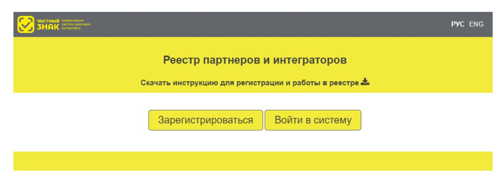

*Figure 1. Login page of the Partners and Integrators Register*

- click the **[ Register ]** button, fill in and send a company registration form for verification (see section "[Creation of registration request"](#page-6-0));
- after approval of the request by the Operator, it is necessary to receive login credentials in a letter sent to the e-mail specified in the request;

If the request is rejected, a notification will be sent to the e-mail with a reason for request rejection. To eliminate the reason specified, it will be necessary to re-submit a registration request with providing correct information.

- log in to the system, familiarize yourself and accept terms of use (see section ["Authorization and](#page-16-0) [access recovery"](#page-16-0));
- check and, if necessary, edit data of the organization profile (see sections ["Editing organization](#page-20-0) [data](#page-20-0)");
- perform actions required to switch an organization profile to the **"Active"** status.

Depending on the organization type assigned to the organization (for more details, see section "[Table of correspondence of organization types to activity types](#page-11-0)"), there are the following scenarios of transition of the profile to the **"Active"** status:

- for a **"Goods circulation participant"** organization type, the **"Active"** status will be provided automatically;
- for **"Partner"**, **"Integrator"**, **"Self-employed developer"**, **"Service provider"** organization types, a status will be changed only after organization is checked by the Security Service.

If the request has been rejected by the Security Service, a corresponding notification will be sent

to the e-mail. In case of any questions, contact the technical support at the address specified in the notification.

- for **"Integrator"**, **"Self-employed developer"** and **"Goods circulation participant"** organization types, add products ("[Management of integration and partner products"](#page-25-0)) and sign related documents. During the transition of the organization profile to **"Active"** status, a list of the documents will be sent to the email (for more information, see section "[Table of correspondence](#page-92-0) [between document mandatory and organization types](#page-92-0)");
- for the **"Service provider"** organization type, fill in a Service Provider questionnaire (see section "[Filling out a questionnaire to connect a Service Provider](#page-99-0)"), wait for transition of the questionnaire to **"Confirmed"** status after the data are checked by the Operator, create and sign an application for Soft and Hardware Package Contract (see section "[Submission of application for Soft and](#page-101-0) [Hardware Package Contract"](#page-101-0)), as well as Soft and Hardware Package Contract generated automatically. Once the documents have been successfully processed, an organization with the **"Service provider"** type will be added to a list of the service providers in the OMS user interface;
- a feature of export of the statistics on FDO and EDM is available for the organizations with **"Fiscal data operator"** and **"Electronic document management operator"** activity types (for more details, see section "Statistics on FDO and EDM").

For more information on the main functionality of the user account of the Partners and Integrators Register, see section ["Major features of the Partners and Integrators Register"](#page-19-0).

# **Creation of registration request**

To register in the Partners and Integrators Register, follow the link [https://registry.intuot.crpt.ru,](https://registry.intuot.crpt.ru) click the **[ Register ]** button and fill in the fields of the company registration form.

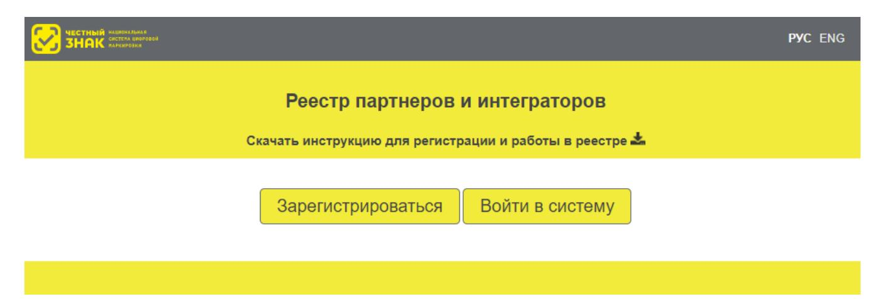

*Figure 2. Login page*

Instruction on how to work in the Partners and Integrators Register can be downloaded from the following link **"Download instruction on how to register and work in the register"**.

The company registration form shall contain the following information:

• **"Country of business registration"** (by default, **"Russian Federation"**);

If you select a **"Natural person"** value in the **"Business registration form"** field, only **"Russian Federation"** value will be available.

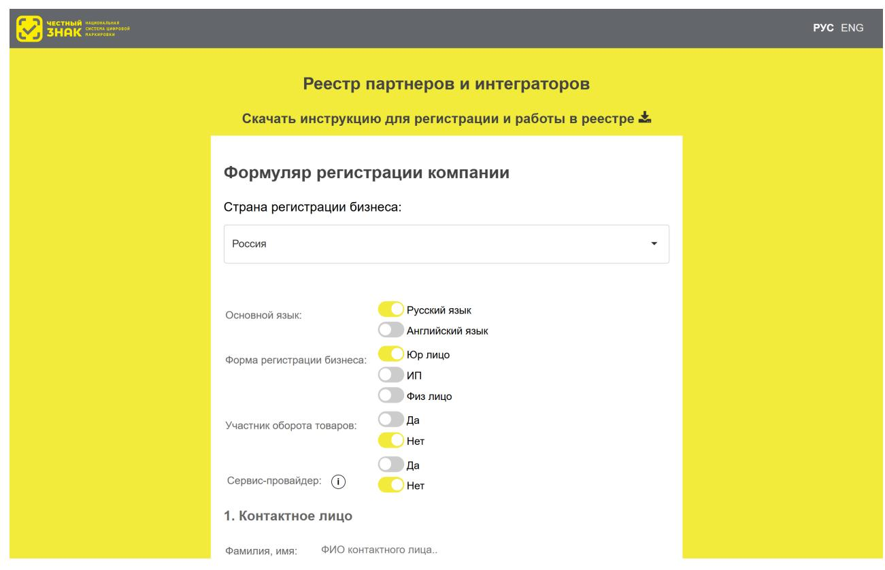

*Figure 3. Company registration form*

• **Main language** (**"Russian"** is set by default)

Possible values:

- **"Russian"**;
- **"English"**.

**"English"** will be automatically set when a country other than **"Russian Federation"** is selected (but you can still select **"Russian"**).

• **"Form of business registration"** (set the corresponding switch in the (on) mode). Depending on the selected value, a field composition of the company registration form changes.

The selected value is immutable and cannot be edited during further work in the system.

Values:

◦ **"Legal entity"** — legal entity.

When considering a request, the Operator verifies that a legal entity is registered on the territory of the country specified in the **"Country of business registration"** field.

◦ **"IE"** — individual entrepreneur.

Individual entrepreneurs whose type of citizenship differs from "Russian Federation" are allowed to register, provided that the country of business registration for such individual entrepreneurs is the Russian Federation.

◦ **"Natural person"** — natural person. The value shall be selected if a natural person specified is a marking software developer and is registered as a self-employed taxpayer.

This value corresponds to the **"Self-employed developer"** organization type and includes the following possible roles for natural persons:

- integrator of software and hardware solutions;
- developer of cash register software;
- developer of goods accounting software;
- developer of process and resource planning system (ERP system);
- developer of encryption software and hardware and information protection means;
- developer of Track&Trace Software;
- consulting activities;
- software development for service providers.

If you select a **"Natural person"** value, only **"Russian Federation"** value will be available in the **"Country of business registration"** field.

If you select a **"Natural person"** value, a **"Self-employed developer"** value will be automatically activated in the **"3. Activity type"** field and all other values will be blocked. At the same time a **[ Download a consent to personal data processing ]** button will appear in the lower part of the form. Clicking the button allows to download a "Consent to personal data processing" file, which is automatically filled out in line with the request data.

• **"Goods circulation participant"** (unavailable for a **"Natural person"** business registration form). Select a **"Yes"** / **"No"** value by moving the corresponding switch in the (on) mode.

Select **"Yes"** if a company is registered in the TT GIS or MDLP FGIS. If you select a **"Yes"** value, a **"GCP"** value will be automatically activated in the **"3. Activity type"** field and all other values will be blocked.

Select **"No"** in other cases, including if a company interacts with the TT GIS and MDLP FGIS via API, but participation in circulation of the marked goods is limited to the following cases:

- delivery of goods to consumers;
- provision of postal services for COD postal items in the sale of goods by sample or distance sale;
- a company acts as a paying agent, which does not perform circulation of the marked goods;

- purchase or sale of the marked products on the deal, the details of which are a state secret.
- **"Service provider"** (select a **"Yes"** / **"No"** value by moving the corresponding switch in the (on) mode).

**"Yes"** value is only available for the companies with a **"Legal entity"** registration form. When hovering over the information icon , a list of requirements required for companies to be registered as a Service provider becomes available.

Select **"Yes"**, if a company is an active or future Service provider with **"Printing shop"** activity type.

If you select **"Yes"** value, the **"printing shop"** value will be automatically activated in the **"3. Activity type"** block (all other values will be blocked) and a **"Distribution provider"** field will be displayed in which it will be necessary to select a value from the drop-down list.

- by means of direct input in block **"1. Contact person"**, fill in the data of the primary contact who will be registered in the Partners and Integrators Register as administrator and main contact person:
  - **"Full name"** specify last name, first name and patronymic of the contact person;
  - **"E-mail"** specify an e-mail address to be used as login to sign in to the system, as well as to be used for sending a login password and Operator's instructions;
  - **"Phone number"** (numbers only).

A mask **"+7"** is used for this field when selecting a **"Russian Federation"** value in the **"Country of business registration"** field. The mask is not used for other countries.

- **"Position"**.
- in a block **"2. Company details"** (unavailable for a **"Natural person"** business registration form) fill in by means of direct input the following fields: (when considering a request, the input data are checked against EGRUL and EGRIP data):
  - **"Name"** (unavailable if the **"Russian Federation"** value is specified in the **"Country of business registration"** field;
  - **"INN"**.

If the **"Russian Federation"** value is specified in the **"Country of business registration"** field, a length of the value in **"INN"** field will be verified: for legal entities - 10 characters, for individual entrepreneurs - 12 characters.

In case of repeated submission of the registration request previously rejected by the Operator, when entering a value in **"INN"** field, a switch **"Submit a repeat registration request"** will be activated above the **"Name"** field.

- **"KPP"** (unavailable if the **"Russian Federation"** value is specified in the **"Country of business registration"** field;
- **"Main email"** main e-mail address of the company. It may differ from the value specified in **"E-mail"** field in block **"1. Contact person"**;
- **"Phone"** (numbers only). Specify a main phone number of the company. The parameter is optional if a business registration form is **"IE"**.

A mask **"+7"** is used for this field when selecting a **"Russian Federation"** value in the **"Country of business registration"** field. The mask is not used for other countries.

- **"Website"** company website (mandatory field);
- **"Main address"** registration address (it displays only for **"IE"** business registration form);
- **"Company profile"**.

Fill out a description of the company's activities in relation to the TT GIS and MDLP FGIS.

The minimum number of characters is 100.

- in block **"2. Natural person data"** (available only for a **"Natural person"** business registration form) fill in by means of direct input the following fields:
  - **"Full name"** specify last name, first name and patronymic of the natural person;
  - **"INN"** specify 12-digit INN of the natural person;
  - **"Date of birth"** specify a date in "DD.MM.YYYY" format or select a value in the calendar (icon );
  - **"Place of birth"** specify a place of birth (the same as in the passport);
  - **"Registration address"** specify address of the registration of the place of residence;
  - in the **"Passport"** section, specify passport details in the following fields: **"Series"**, **"Number"**, **"Issuing authority"**, **"Issue date"**;
  - **"Main email"** main e-mail address of the natural person. It may differ from the value specified in **"E-mail"** field in block **"1. Contact person"**;
  - **"Phone"** (numbers only). A mask **"+7"** is used for this field;
  - **"Website"** company website (optional field);
  - **"Company profile"**.

Fill out a description of the company's activities in relation to the TT GIS and MDLP FGIS.

The minimum number of characters is 100.

• in the block **"3.Activity type"**, select the relevant values by moving the corresponding switches in the (on) mode.

A choice of the values determines a range of possibilities and scenarios of work in the system available to the registered user of the Partners and Integrators Register. Each activity type corresponds to one of the organization types (functional group): **"Goods circulation participant"**, **"Integrator"**, **"Partner"**, **"Service provider"** or **"Self-employed developer"**. For more information on restrictions and peculiarities of the selection of the activity types, see section "[Table](#page-11-0) [of correspondence of organization types to activity types](#page-11-0)".

A list of the documents to activate features corresponding to the organization types can be found in the section ["Table of correspondence between document mandatory and organization types"](#page-92-0).

A list of activity types can be edited after registration of the organization in the Partners and Integrators Register by submitting a request in the User account (for more details, see section "[Submission of request to change a list of activity types"](#page-24-0)).

## **Table of correspondence of organization types to activity types**

The Partners and Integrators Register provides several organization types, defining a feature set of the organizations registered in the system. A type of the organization is assigned automatically on the basis of the activity types specified in the registration request (see section "[Creation of registration request"](#page-6-0)) or when editing a profile (see section ["Submission of request to change a list of activity types"](#page-24-0)). Correspondence between activity types and organization types, as well as related limitations are described in the table below.

| Organization type                | Activity type | Comment                                                                                                                                                                |
|----------------------------------|---------------|------------------------------------------------------------------------------------------------------------------------------------------------------------------------|
| Goods circulation participant | "GCP"         | The value will be automatically activated, if "Yes" value is selected in the "Goods circulation participant" field. If the value is active, all other         |
|                                  |               | values will be blocked. "Integrator" and "Partner" activity types can be added by submitting a request to the technical support service at support@crpt.ru |

| Organization type | Activity type                                                                                                      | Comment                                                                                                                                         |
|-------------------|--------------------------------------------------------------------------------------------------------------------|-------------------------------------------------------------------------------------------------------------------------------------------------|
| Integrator        | "integrator of software and hardware Solutions"                                                                 | It is available only for "Legal entity" and "IE" business registration forms.                                                                |
|                   | "developer of goods accounting software" "developer of process and resource planning system (ERP system)" | If you have selected at least one value from the list, a company will be assigned an "Integrator" organization type.                   |
|                   | "developer of Track&Trace Software"                                                                             | Simultaneous selection of the values corresponding to "Integrator" and                                                                       |
|                   | "software development for service providers" "vending machine software                                       | "Partner" organization types is allowed.                                                                                                     |
|                   | developer, vending machine manufacturer"                                                                        | A "Goods circulation participant" activity type can be added by submitting                                                                   |
|                   | "developer of model of technical means for capturing product information"                                    | a request to the technical support service (for more details, see section "Submission of request to change a list of activity types"). |
|                   | "developer of component of technical means for capturing product information"                                |                                                                                                                                                 |
|                   | "technical service center (TSC)"                                                                                   |                                                                                                                                                 |

| Organization type | Activity type                                                                                                                                                                                                                                                                                                                                                   | Comment                                                                                                             |
|-------------------|-----------------------------------------------------------------------------------------------------------------------------------------------------------------------------------------------------------------------------------------------------------------------------------------------------------------------------------------------------------------|---------------------------------------------------------------------------------------------------------------------|
| Partner           | "electronic document management operator"                                                                                                                                                                                                                                                                                                                    | It is available only for "Legal entity" and "IE" business registration forms.                                    |
|                   | "fiscal data operator"                                                                                                                                                                                                                                                                                                                                          | If you have selected at least one value                                                                             |
|                   | "manufacturer of control and cash register equipment"                                                                                                                                                                                                                                                                                                        | from the list, a company will be assigned a "Partner" organization type.                                         |
|                   | "developer of cash register software"                                                                                                                                                                                                                                                                                                                           | Simultaneous selection of the values                                                                                |
|                   | "manufacturer, importer of 2D scanners"                                                                                                                                                                                                                                                                                                                      | corresponding to "Integrator" and "Partner" organization types is allowed.                                    |
|                   | "manufacturer, importer of data collection terminals (DCT)"                                                                                                                                                                                                                                                                                                  | A "Goods circulation participant" activity type can be added by submitting a request to the technical support |
|                   | "manufacturer, importer of printers of labels/receipts"                                                                                                                                                                                                                                                                                                      |                                                                                                                     |
|                   | "manufacturer, importer of markers, applicators, equipment ensuring detection, automatic control and analysis of identification means (machine vision), or other production equipment designed for application and readout of identification means" "developer of encryption software and hardware and information protection means" | service (for more details, see section "Submission of request to change a list of activity types").           |
|                   | "consulting activities"                                                                                                                                                                                                                                                                                                                                         |                                                                                                                     |

| Organization type          | Activity type             | Comment                                                                                                                                                                                                                                      |
|----------------------------|---------------------------|----------------------------------------------------------------------------------------------------------------------------------------------------------------------------------------------------------------------------------------------|
| Service provider           | "printing shop"           | The value will be automatically activated when selecting a "Yes" value in the "Service provider" field. If the value is active, all other values will be blocked.                                                                |
|                            |                           | To complete a procedure of generation of the request, it is necessary to select a distribution provider from the drop down list in the "Distribution provider" field                                                             |
| Self-employed developer | "Self-employed developer" | The value will be automatically activated when selecting a "Natural person" value in the "Form of business registration" field. If the value is active, all other values will be blocked.                                     |
|                            |                           | To complete a request generation procedure, attach a file of the consent to personal data processing (for more details, see subsection "Sending of a consent to personal data processing during natural person registration") |

### **Sending of a consent to personal data processing during natural person registration**

If you select a **"Natural person"** value in the **"Form of business registration"** field, a **"Selfemployed developer"** value will be automatically activated in the field of selection of activity types and a **[ Download a consent to personal data processing ]** button will appear in the lower part of the registration form.

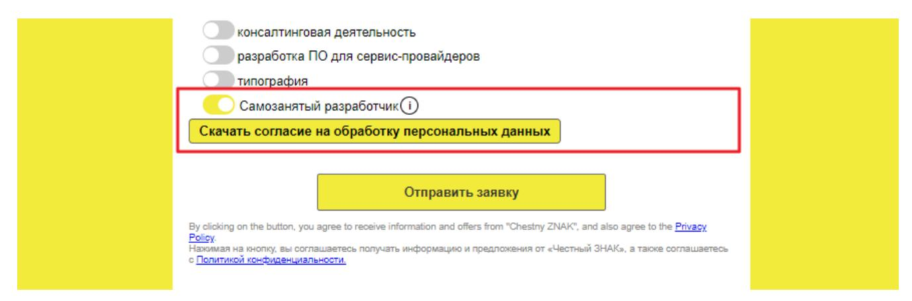

*Figure 4. A button to download a personal data processing consent*

Clicking the button will perform automatic check of the data format in the request. After the check is successfully completed, the download of the file "Consent to personal data processing" filled out on the basis of the entered information is started, and the **[ Choose file ]** button appears to access the upload form.

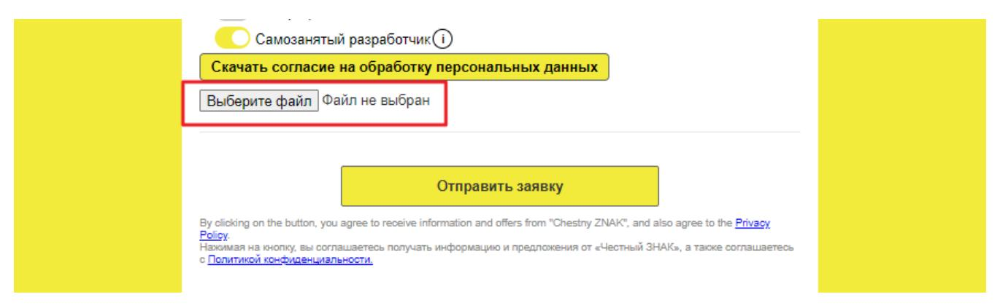

*Figure 5. A button to choose a file*

After downloading the file, check the correctness of the specified data, then print and sign the document by hand.

An electronic version of the signed document shall be attached to the request via upload form (open the form by clicking the **[ Choose file ]** button).

A hard copy of the signed document shall be sent by mail to the address specified in the message from the technical support service. The message will be sent to email specified in the **"Email "** field in the block **"1. Contact person"**.

After completion of the registration and successful authorization in the user account of the Partners and Integrators Register, the uploaded file will be available for viewing in the section **"My Organization" › "Documents"**.

# **Authorization and access recovery**

To authorize in the system:

• follow the link <https://registry.intuot.crpt.ru>to the Partners and Integrators Register;

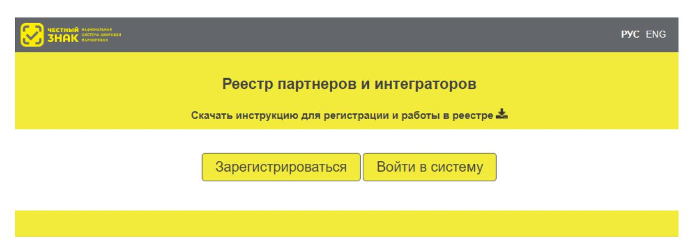

*Figure 6. Login page of the Partners and Integrators Register*

- click **[ Sign in ]** button;
- enter login and password to log in to the system sent by the Operator to the email specified in the registration request;

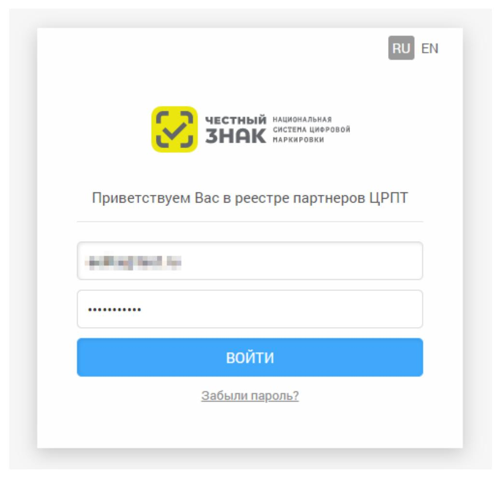

*Figure 7. Login form*

To recover your password click on the **"Forgotten your password?"** link in the lower part of the data entry form, then enter the registered email and click a **[ Send link ]** button. A temporary link to change the password will be sent to the specified address (the temporary link is valid for 10 minutes).

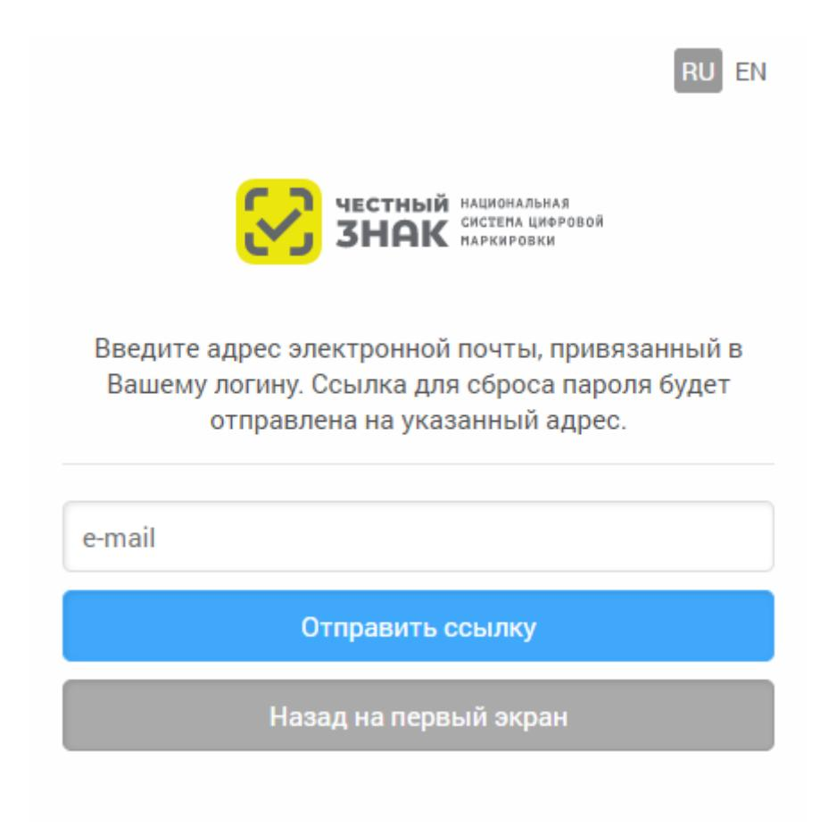

*Figure 8. Password recovery form*

• when first entering the user account of the Partners and Integrators Register, familiarize yourself with the privacy policy and accept the terms of the system use by clicking **[ Agree ]** button;

*Figure 9. Rules for using the system*

# **Major features of the Partners and Integrators Register**

The Partners and Integrators Register includes the following features:

- viewing and editing of organization details (for more information, see section "[Editing organization](#page-20-0) [data](#page-20-0)");
- viewing, adding of new products and forming of requests for their testing (for more information, see section ["Management of integration and partner products"](#page-25-0)). Viewing [statistics](#page-104-0) of integration products usage;
- viewing and adding of the data on system users (for more information, see section ["Editing user](#page-88-0) [data](#page-88-0)");
- viewing and signing of the documents (for more information, see section "[Work with documents](#page-91-0)");
- viewing notifications from the Operator (for more information, see section ["Viewing](#page-103-0) [notifications](#page-103-0)");
- work with tasks from the Operator (for more information, see section ["Work with tasks from the](#page-106-0) [Operator"](#page-106-0));
- viewing the help information about laws and regulations governing the marking processes and their changes (for more details, see section ["Information about laws and regulations"](#page-115-0));
- viewing the news regarding Partners and Integrators Register (for more details, see section "[Viewing news"](#page-117-0)).

## **Organization card interface**

To go to an organization card, select a **"My organization"** section in the **"Main menu"**.

Main details of the organization are indicated at the top part of the organization card, above the tab buttons:

• organization's identification number in the Partners and Integrators Register (element 1);

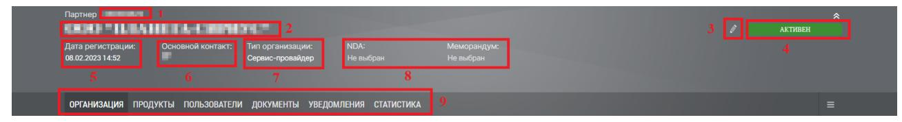

*Figure 10. Organization card interface elements*

• organization name (element 2) and a button to edit the name (element 3);

The organization name can be edited by means of the icon only until the organization profile is in the **"Active"** status.

- request status (element 4);
- registration date and time (element 5);
- last name, first name and patronymic of the primary contact of the organization (element 6);
- organization type (element 7). For more information on principle of assignment of the organization type, see section ["Table of correspondence of organization types to activity types"](#page-11-0);
- information on documents binding on the organization type (element 8). For more information, see section "[Table of correspondence between document mandatory and organization types"](#page-92-0);
- profile control tabs (element 9).

The **"Organization"** tab contains registration details, some of which are editable. For more information, see ["Editing organization data](#page-20-0)";

In the **"Organization"** tab, a service provider can obtain an individual identifier (UUID) in the **"UUID for SUZ"** field, which can be used to work in the OMS.

**ATTENTION**

The individual identifier (UUID) to work in the OMS is displayed in the **"UUID for SUZ"** field only after [Soft and Hardware Package Contract](#page-101-0) is signed by the Operator

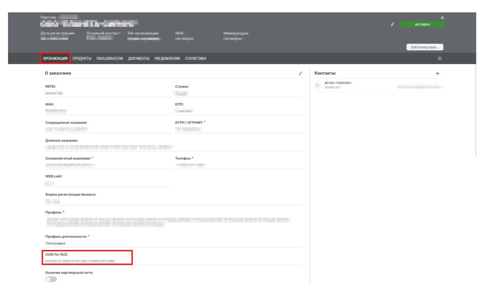

*Figure 11. Individual identifier (UUID) for use in OMS*

### **Editing organization data**

To introduce changes to the registration data, go to **"My organization" › "Organization"** section in

the **"Main menu"** and click button in the organization card.

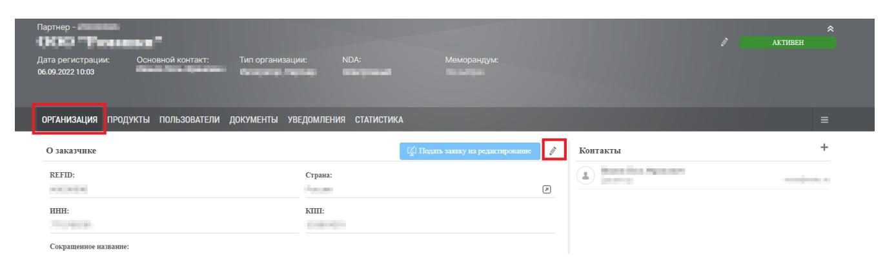

*Figure 12. A button to edit a profile in the organization card*

The following fields are available for modification in this mode:

- **"KPP"**;
- **"Abbreviated name"** (the value will be blocked from changes after an organization profile is in the **"Active"** status);
- **"Long name"** (the value will be blocked from changes after an organization profile is in the **"Active"** status);
- **"Company's main email"**;
- **"Telephone"**;
- **"Website"**;
- **"Profile"**;
- **"Presence of partner network"** if applicable, activate by moving the switch in the (on) mode;
- **"Number of partners in partner network"** specify a value by means of direct input if **"Presence of partner network"** value is active;
- **"Full name of director"** specify last name, first name and patronymic of the head of the organization (in line with EGRUL).

The value will be blocked from changes after the organization profile is in the **"Active"** status. The exceptions are organizations, which have the only organization type - **"Goods circulation participant"**. A possibility to change the **"Full name of director"** field will be not blocked for these organizations.

• **"Full name of attorney-in-fact"**.

If it is filled in, sign a power of attorney in the **"Documents"** section, after the corresponding document is added by the Operator.

To correct fields blocked after transition of the organization profile to **"Active"** status, contact the

Technical Support Service at [support@crpt.ru.](mailto:support@crpt.ru)

To edit bank details, see section "[Editing bank details"](#page-22-0). Bank details are used to fill in a NDA (if specified).

A list of the **"Business profile"** field values can be edited only by the Operator upon request from a user (for more information, see section ["Submission of request to change a list of activity types](#page-24-0)").

### **Editing bank details**

To edit bank details:

- go to **"My organization" › "Organization"** section in the **"Main menu"**;
- in the **"Bank details"** block, click the button;

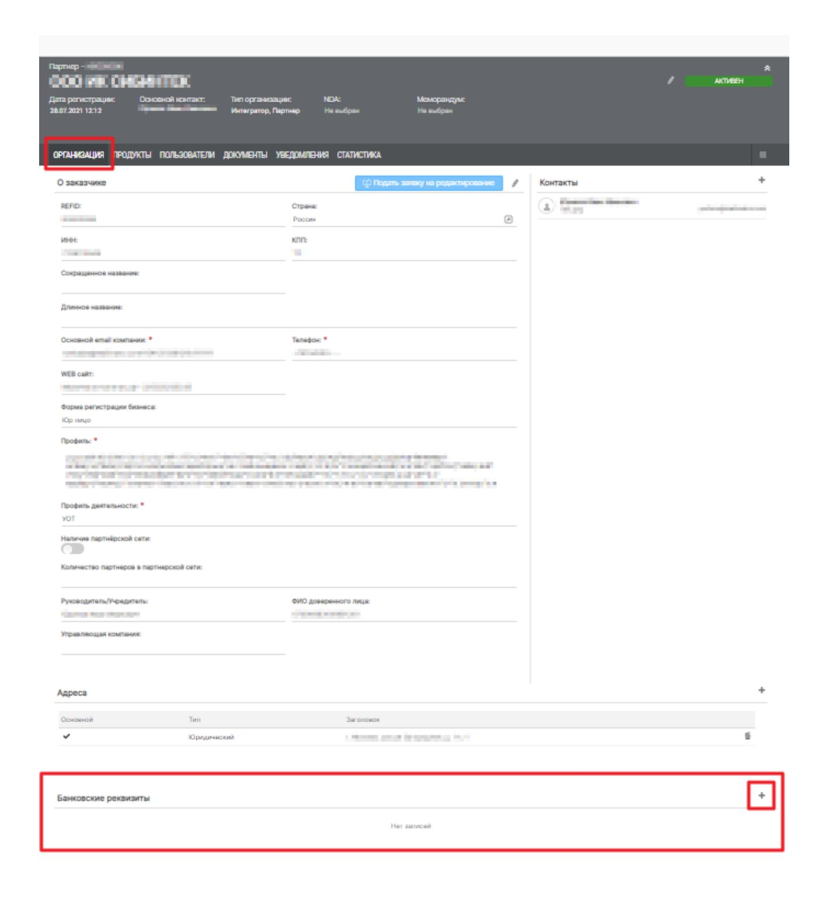

*Figure 13. Block of bank details editing*

• in the **"Payment details"** modal window, fill out the following data entry fields: **"BIC"**, **"Bank"**, **"Settlement account"**, **"c/a"**, **"Account currency"**. Activation of **"By default"** switch indicates that the details specified are the main ones.

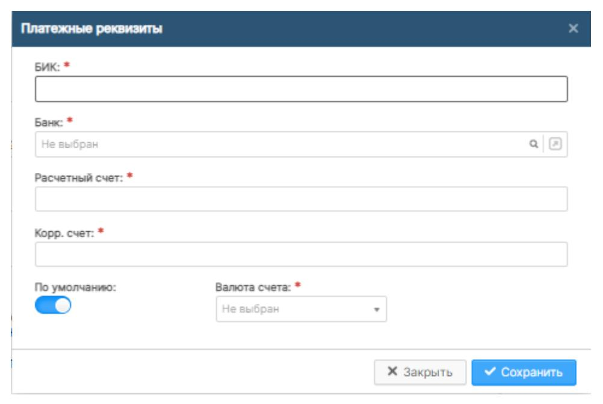

*Figure 14. Modal window for adding details*

Repeat these steps if you need to add additional bank details.

#### **Submission of request to change a list of activity types**

To change organization type and/or to change a list of values in the **"Business profile"** field:

- go to **"My organization" › "Organization"** section in the **"Main menu"** ;
- click **[ Submit edit request ]** button in the upper right corner;

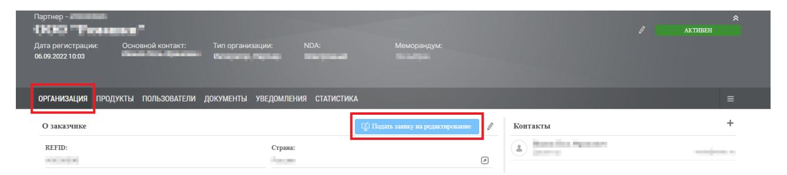

*Figure 15. A button to submit an edit request*

• in the **"Edit request"** modal window in the **"Business profile"** list, select actual values of the activity types in compliance with the restrictions for organization types (see section ["Table of](#page-11-0) [correspondence of organization types to activity types](#page-11-0)").

Activity types cannot be changed for the following organization types: **"Goods circulation participant"**, **"Service provider"** and **"Self-employed developer"**.

Any activity types can be added for **"Partner"** and/or **"Integrator"** organization types. When adding a **"GCP"** value, a **"Goods circulation participant"** value will be added to the organization types (it can be selected only in combination with other activity types).

• click **[ Save ]** button to submit a request to the Operator;

The submitted request will be displayed in the **"Requests"** section in the **"Main menu"** with **"Check"** status. Until the request is approved or rejected, request resubmission will be unavailable. After the request is approved by the Operator, the request will change its status to **"Accepted"**, updated list of the activity types will be displayed in the **"Business profile"** field, and updated list of the organization types will be displayed in the header of the organization card (**"My organization"** section in the **"Main menu"**).

### **Management of integration and partner products**

The Partners and Integrators Register provides two product types:

• partner products.

The partner products include products, which do not interact with OMS API, e.g. online cash registers, UTD Operators, portable data terminal barcode scanners, etc. Such products do not pass acceptance tests on interaction with TT GIS or MDLP FGIS components, while signing of such documents as the Declaration, NDA and Application to enter into a Memorandum is mandatory for them.

More information on partner products can be found in the section ["Partner solutions](#page-84-0)".

• integration products.

Integration products include software, which is intended to interact with OMS API and should be tested by the Operator in accordance with commissioning check procedure adopted for the OMS API. Software versions that have passed the acceptance tests, receive a **"Admitted to the production environment"** status, as well as a unique registration key to work on the production environment of the TT GIS or MDLP FGIS. Access to such software appears in the OMS user interface in the **"Registry of integration solutions"** section and becomes available to all goods circulation participants (with appropriate visibility settings).

It is also mandatory to sign such documents as the Declaration, NDA and Application to enter into a Memorandum.

For more information on integration products, see section "[Integration products](#page-26-0)". For more information on statistics of integration products usage, see section "[Viewing statistics of integration](#page-104-0) [products usage"](#page-104-0).

A table of availability of the products by organization types can be found below.

| Organization type             | Product             | OMS test |
|-------------------------------|---------------------|----------|
| Partner                       |                     | —        |
| Integrator                    | Partner solution    | —        |
| Service provider              |                     | —        |
| Integrator                    |                     | +        |
| Goods circulation participant | Integration product | +        |
| Self-employed developer       |                     | +        |

#### **Integration products**

Work with the integration products is available in the Partners and Integrators Register to the organizations with the following organization types: **"Integrator"**, **"Goods circulation participant"** and **"Self-employed developer"**.

To register an integration product and to get **"Admitted to the production environment"** status for a product version, proceed as follows:

- register a product in the Partners and Integrators Register (see section "[Integration product](#page-26-1) [registration"](#page-26-1));
- test independently a product in accordance with commissioning check procedure adopted for the OMS API.

To familiarize yourself with the procedure, it is necessary to select a **"Knowledge base"** section in the **"Main menu"**, follow a link **"Commissioning check procedure RU"** and download description in \* .pdf format.

- to submit a request for acceptance tests in the OMS and to test integration with the OMS via API:
  - with the technical support service of the Operator (see section ["Testing with the participation of](#page-34-0) [the Operator's technical support service](#page-34-0)");
  - without involving the technical support service of the Operator (see section "[Self-testing of the](#page-77-0) [integration solution"](#page-77-0)).

This option is available if there are no active requests for acceptance tests together with the Operator;

• if necessary, add trusted INN (see section ["Adding of trusted INN](#page-82-0)").

#### **Integration product registration**

To register an integration product:

- go to **"My organization" › "Products"** section in the **"Main menu"**;
- in the **"Integration products"** block, click **[ Add integration product ]** button;

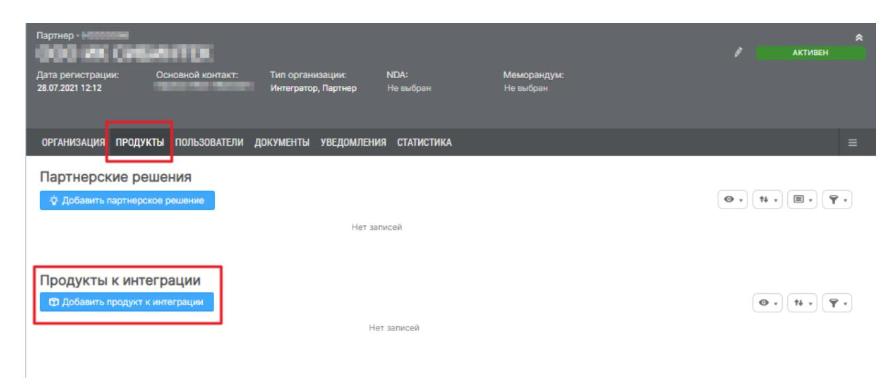

*Figure 16. Location of button to add an integration product*

If the button has not appeared during the day after registration of the organization in the Partners and Integrators Register, please contact the Technical Support Service by sending an email to [partners@crpt.ru](mailto:partners@crpt.ru) with a copy to [integrators@crpt.ru.](mailto:integrators@crpt.ru)

- in a **"New product"** modal window, fill out entry fields (mandatory fields are marked with a red asterisk):
  - **"Name"** specify a product name by means of direct input in accordance with the title documents (if the Software is registered in Rospatent);

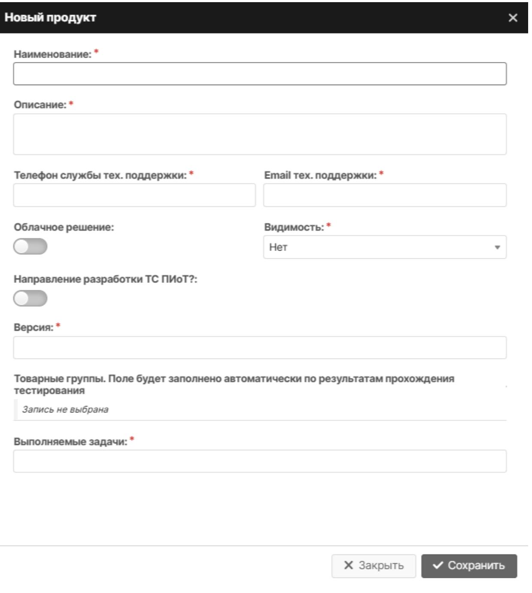

*Figure 17. Modal window to add an integration product*

- **"Description"** / **"Description / Model composition of technical means for capturing product information"** (it is displayed if the **"Is this for development of technical means for capturing product information?"** field is in the (on) mode) — enter a description of the software (by direct input) sufficient for goods circulation participants to identify its qualities;
- **"Phone number of the Technical Support Service"** specify a value by means of direct input in a free form;
- **"Email of the Technical Support Service"** specify a value by means of direct input;
- **"Cloud SW"** if applicable, activate the value by moving the switch in the (on) mode.

Activation of the value confirms that it is a cloud software with authorization on a web service and with a possibility to connect numerous goods circulation participants;

◦ **"Is this for development of technical means for capturing product information?"** — if applicable, enable this option by moving the toggle button to the "on" state.

Activating this option confirms that the software qualifies as a product of technical means for capturing product information, as well as enables you to submit a request for acceptance tests;

◦ **"Version"** — specify a number of the software version, which will be tested within acceptance tests in the OMS.

New product versions are registered in a simplified mode. For more details, see section "[Registering new product versions](#page-31-0)".

◦ **"Visibility"** — select a value from the drop-down list ("Yes" / "No").

If **"Yes"** is selected, the product will be displayed in the Registry of tested OMS integration solutions after successful acceptance testing.

If the software is developed for personal (non-commercial) use, select **"No"**.

- **"Specification"** provide a description of the tasks performed by the product within the version specified. This description will allow goods circulation participants to identify the implemented product features by a particular version.
- click **[ Save ]** button to complete a product registration;
- fill in a questionnaire on product (for more information, see section "[Filling out a questionnaire on](#page-86-0) [product"](#page-86-0));
- after filling in the questionnaire and receiving confirmation of the correctness from the Operator, familiarize yourself and sign mandatory documents placed by the Operator in the **"My organization" › "Documents"** section (for more information, see section "[Document signing"](#page-94-0)) in accordance with the table specified in the section ["Table of correspondence between document](#page-92-0) [mandatory and organization types"](#page-92-0):
  - Declaration;
  - Application to enter into a Memorandum;
  - NDA.

**Transfer of integration product to "Invalid" status**

A status of the integration product versions with the **"New"** status (before the moment of submission of the request for acceptance tests in the OMS) can be changed to **"Invalid"** to ensure a possibility of completion of the life cycle of the non-current products versions.

**ATTENTION**

If acceptance testing fails, the status of the integration product versions (with the **"Registered"** status) can be changed to **"Invalid"**

To change a product version to the **"Invalid"** status, go to **"My organization" › "Products"** section in the **"Main menu"**. Then in the **"Integration products"** block, click the **[ New ]** / **[ Registered ]** button in the row with the name of the non-current product version, and select **"Invalid"**.

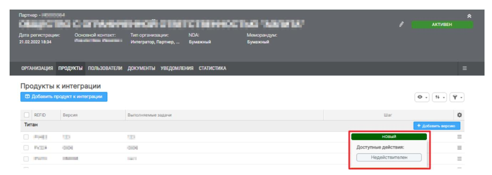

*Figure 18. Product version status change through the tab with a product list*

An alternative way to transfer a product version to the **"Invalid"** status: go to **"My organization" › "Products"** section in the **"Main menu"** and go to a product version card in the **"Integration products"** block by clicking a line with a version name. Click **[ Invalid ]** button in the lower left corner of the window.

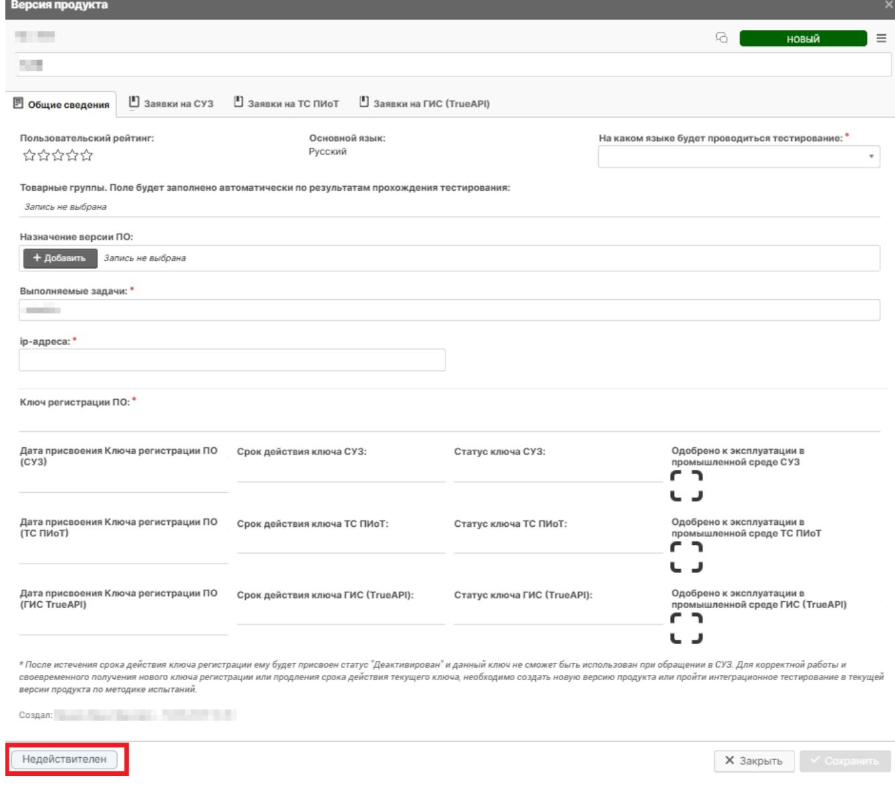

*Figure 19. Product version status change through the version card*

#### **Registering new product versions**

To register a new version of the product, which has already been registered:

• go to **"My organization" › "Products"** section in the **"Main menu"** and click **[ Add version ]** button in a line with a product name in the **"Integration products"** block to switch to **"Product version details"** modal window;

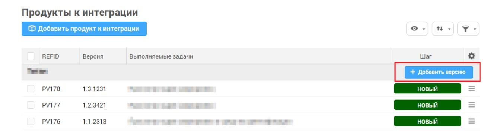

*Figure 20. Switch to modal window to add version through the products tab*

- in a **"Product version details"** modal window, fill out entry fields (mandatory fields are marked with a red asterisk):
  - **"Product"** verify a correctness of indication of the product.

If necessary, select other product from the list of the registered products by clicking on the button . To view product information, go to the product card by clicking the button .

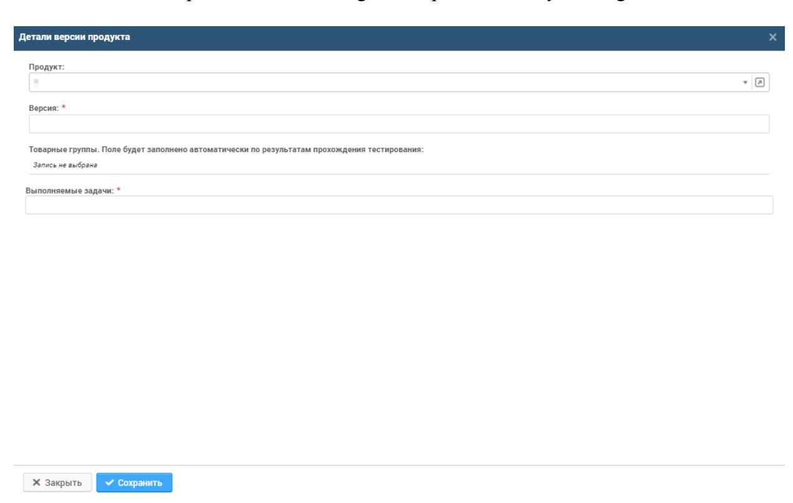

*Figure 21. Modal window to add a new product version*

- **"Version"** specify version number;
- **"Specification"** provide a description of the tasks performed by the product within the version specified. This description will allow goods circulation participants to identify the implemented product features by a particular version;
- click **[ Save ]** button.

**Registering new versions of the product of technical means for capturing product information**

To register a new version of a previously registered product of technical means for capturing product information:

• go to **"My organization" › "Products"** section in the **"Main menu"** and click **[ Add version ]** in the row containing the product name in the **"Integration products"** block to open the **"Product version details"** modal window;

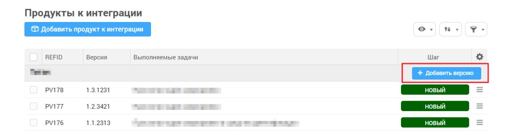

*Figure 22. Switch to modal window to add version through the products tab*

- in the **"Product version details"** modal window, fill in the fields (mandatory fields are marked with a red asterisk):
  - **"Product"** verify that the product is specified correctly.

If necessary, select a different product from the list of registered products by clicking the button

. To view product details, go to the product card by clicking the button .

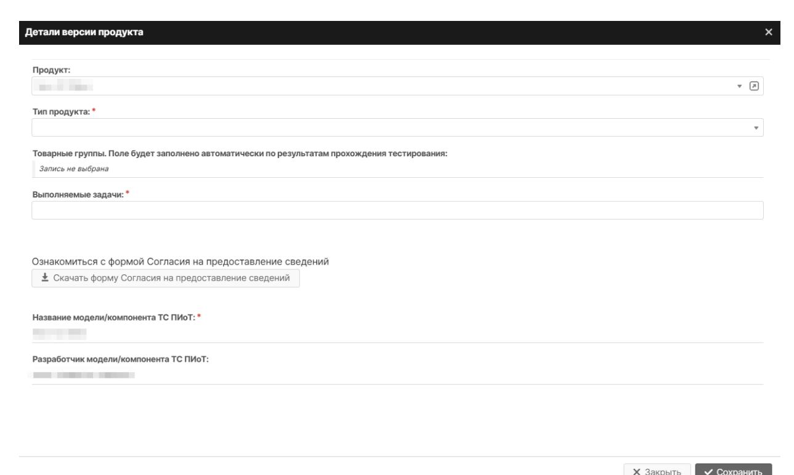

*Figure 23. Modal window to add a new version of a product of technical means for capturing product information*

◦ **"Product type"** — select a value from the drop-down list. Possible values: **"Model of technical means for capturing product information"** or **"Component of technical means for capturing product information"**.

Depending on the selected product type, fill in additional fields (mandatory fields are marked with a red asterisk);

- **"Specification"** provide a description of the tasks performed by the product within the version specified. This description will allow goods circulation participants to identify the features implemented in a specific product version;
- click the **[ Save ]** button.

**Testing with the participation of the Operator's technical support service**

**Submission of request for acceptance tests in the OMS**

After the product is registered (see section ["Integration product registration"](#page-26-1)), submit a request for acceptance tests in the OMS:

- go to **"My organization" › "Products"** section in the **"Main menu"** ;
- in the **"Integration products"** block, go to a card of the product version, which will be requested for acceptance tests in the OMS. To go to the card, click on a line with a version number;

*Figure 24. Switch to product version card*

- fill out entry fields (mandatory fields are marked with a red asterisk) in a version card in **"General information"** tab:
  - **"Language of testing"** select a value from the drop-down list (**"Russian"** / **"English"**);
  - **"Goods groups"** it is filled out automatically after successful completion of the acceptance tests and when a tested product version changes its status to **"Admitted to the production environment"**;
  - **"Specification"** it is filled out automatically on the basis of information specified in the request to register a product for integration;
  - **"ip addresses"** (available only for cloud software) fill out a list of ip addresses from which

requests will be made to the OMS during acceptance tests. Interaction with other ip addresses during the tests will be blocked;

◦ click the **[ Save ]** button.

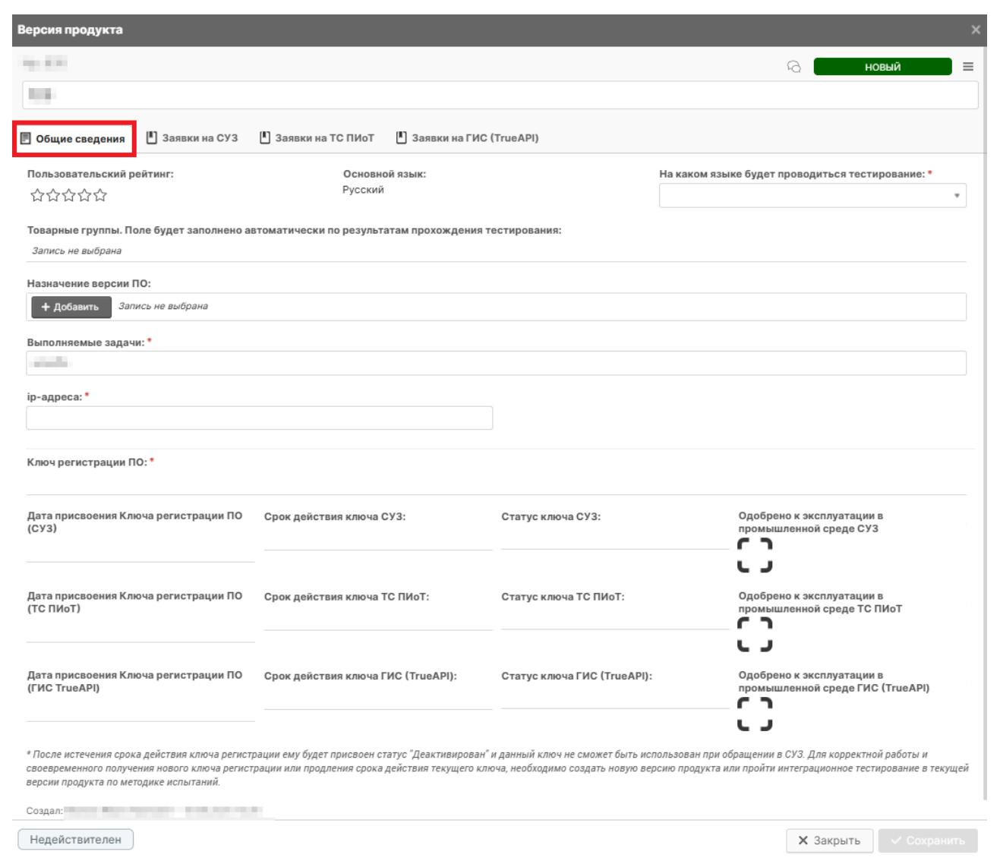

*Figure 25. General information*

- go to the **"OMS requests"** tab in a version card and fill out entry fields (mandatory fields are marked with a red asterisk):
  - **"INN (or analog) of the organization registered on the Sandbox of the TT GIS/Sandbox of the MDLP"** — specify an identification number of the organization registered on the demo environment of the [TT GIS](https://markirovka.sandbox.crptech.ru) (specify INN) or [MDLP FGIS](https://sb.mdlp.crpt.ru/) (specify INN). Only numerical values are available.

INN (or analog) shall correspond to a value specified in the **"Profile"** section in the user interface of [TT GIS](https://markirovka.sandbox.crptech.ru) or [MDLP FGIS;](https://sb.mdlp.crpt.ru/)

◦ **"Organization ID in the Sandbox of the TT GIS/Sandbox of the MDLP (id / sys\_id)"** specify ID of the participant in [TT GIS](https://markirovka.sandbox.crptech.ru) or [MDLP FGIS](https://sb.mdlp.crpt.ru/). Numerical values are available (values of UUID format are available for the MDLP).

The value is specified in the user interface of [TT GIS](https://markirovka.sandbox.crptech.ru) or [MDLP FGIS](https://sb.mdlp.crpt.ru/) in the **"Profile" › "Participant's data"** section, **"Participation in the system"** block, **"Participant ID"** field;

◦ **"omsId"** — specify a participant's omsId identifier in the OMS.

A value of the omsId identifier can be found in the OMS. To do this, in the TT GIS or MDLP FGIS user interface, in the **"Main menu"**, switch to the **"Order management" › "Devices"** section and copy omsId identifier value specified in the upper left corner of the **"Main window"**;

- **"I am aware that the following registrationKey = 4344d884-7f21-456c-981e-cd68e92391e8 should be used to test the integration/connection method"** — familiarize yourself with the text and set a switch in the (on) mode;
- click the **[ Save ]** button.
- click the **[ Submit request for OMS acceptance tests ]** button;

**ATTENTION**

When the current product version status is **"Invalid"**, the **[ Submit request for OMS acceptance tests ]** button is unavailable

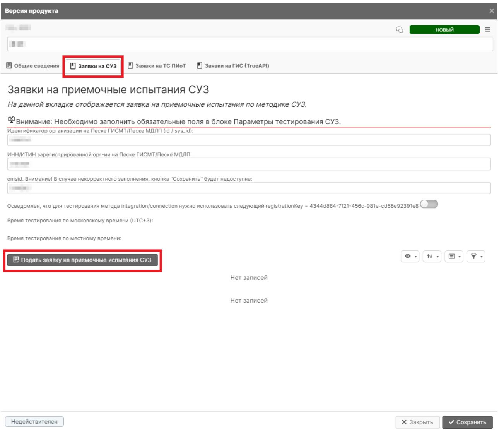

*Figure 26. A button to submit a request for OMS acceptance tests*

- fill in the fields of the **"Acceptance test request"** modal window (mandatory fields are marked with a red asterisk):
  - **"Goods groups"** add a goods group for which acceptance tests of the product will be conducted in accordance with the established testing procedure, by clicking the **[ Add ]** button. To add additional goods groups, click the **[ Add ]** button again. To remove a value from a list,
    - click . To familiarize yourself with the procedure, it is necessary to select a **"Knowledge base"** section in the **"Main menu"**, follow a link **"Commissioning check procedure RU"** and download a description in \* .pdf format.
    - "Medicines" goods group cannot be selected together with other goods groups;
  - **"Registered on the Sandbox of the TT GIS or the Sandbox of the MDLP"** activate if applicable.

At the time of submission of the request for acceptance tests, an organization must already be registered on the demo environment [MDLP FGIS](https://sb.mdlp.crpt.ru/) (for tests in "Medicines" goods group) or [TT](https://markirovka.sandbox.crptech.ru) [GIS](https://markirovka.sandbox.crptech.ru) (for tests in other goods groups);

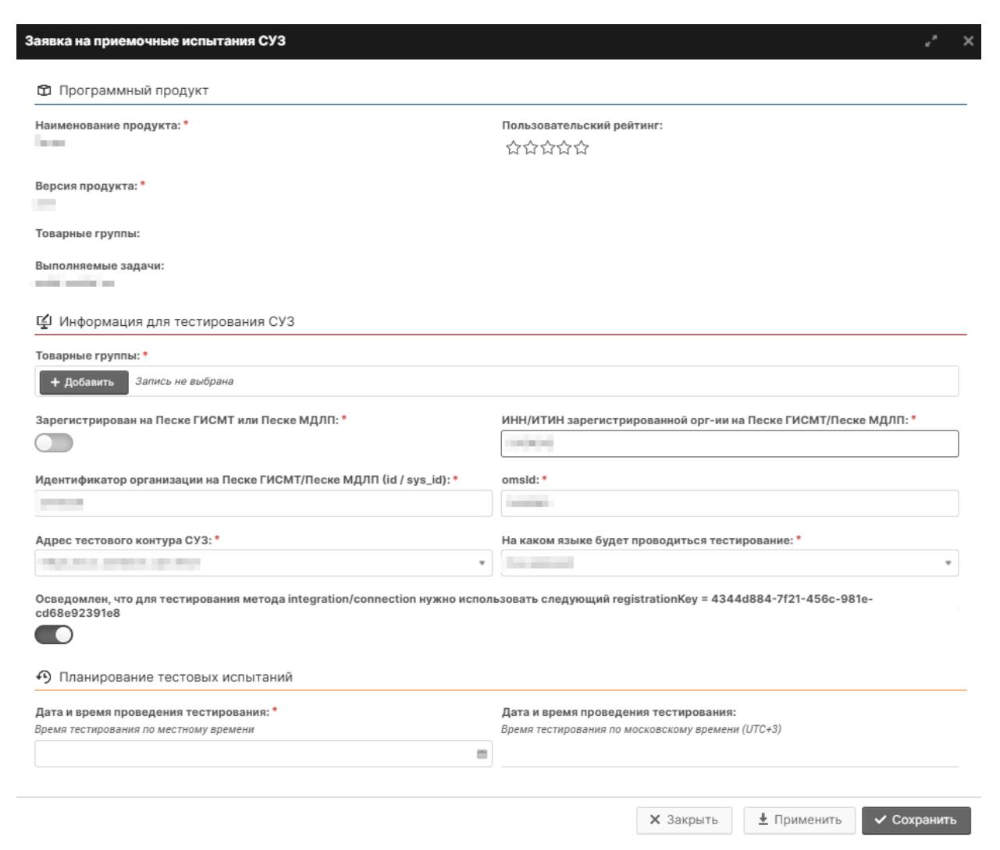

*Figure 27. Request for OMS acceptance tests*

- **"INN (or analog) of the company registered on the Sandbox of the TT GIS/Sandbox of the MDLP"** — it is filled out automatically on the basis of information specified in a version card in the **"OMS requests"** tab;
- **"Organization ID in the Sandbox of the TT GIS/Sandbox of the MDLP (id / sys\_id)"** it is filled out automatically on the basis of information specified in a version card in the **"OMS requests"** tab;
- **"omsId"** it is filled out automatically on the basis of information specified in a version card in the **"OMS requests"** tab;
- **"Address of the OMS test environment"** select one of the values from the list:
  - <https://intpharma.crpt.ru:12001> for MDLP FGIS;
  - <https://suz.sandbox.crptech> for TT GIS.
- **"Language of testing"** it is filled out automatically on the basis of information specified in a version card in **"General information"** tab;
- **"I am aware that the following registrationKey = 4344d884-7f21-456c-981e-cd68e92391e8 should be used to test the integration/connection method"** — familiarize yourself with the

text and set a switch in the (on) mode;

- **"Testing date and time: Testing time, Moscow time (UTC+3)"** it is filled out automatically;
- **"Testing date and time: Testing time, local time"** offer date and time of the acceptance tests (local time) by clicking the button . Testing start time shall be specified only in the interval from 08:00 AM to 06:00 PM, MSK, inclusive. When attempting to indicate time which does not correspond to allowed time range, the following warning will be displayed: **"The specified time is out of the allowed range (from 08:00 AM to 06:00 PM, MSK)"**.
- click **[ Save ]** button to complete request creation.

Created request will be sent to the Operator for approval, and the product version will change its status to **"Testing date assignment"**.

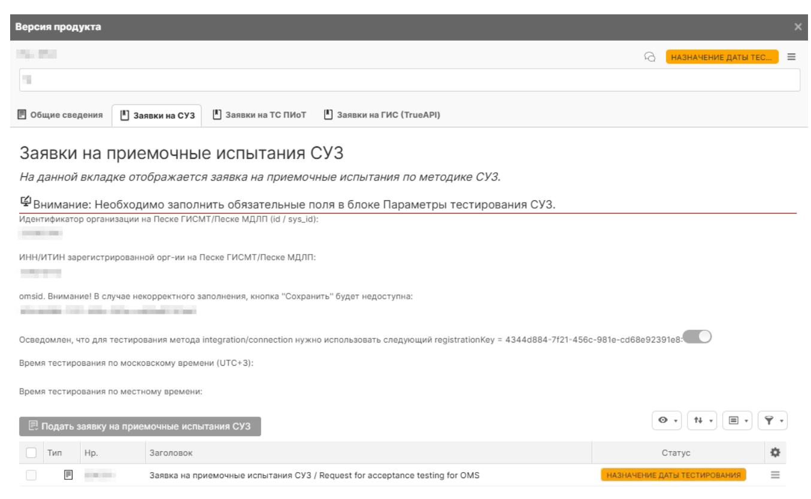

*Figure 28. Created request*

To postpone the acceptance test date, switch to **"OMS requests"** tab in the version card and click on a line with the request in **"Testing date assignment"** status. In the request card, click a **[ Cancel… ]** button in the lower left corner of the window, then set a new date for acceptance tests by clicking the **[ Testing date assignment… ]** button after activation of the mandatory switches. Select a **"Yes"** value in the dialog box for saving changes, then set a new date in the selection form in the lower part of the request card by clicking the button .

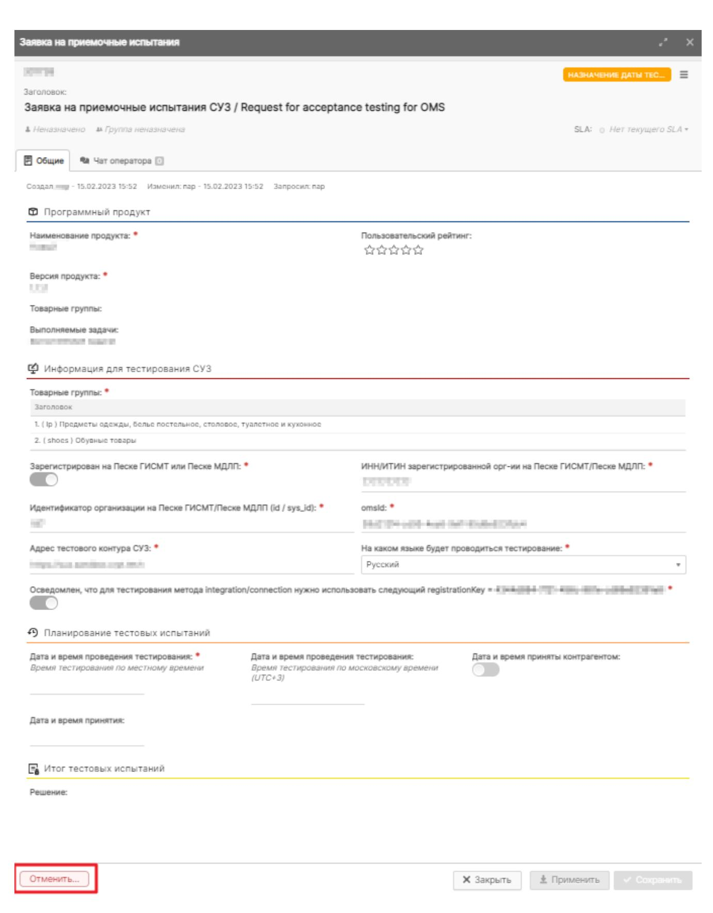

*Figure 29. Request cancellation*

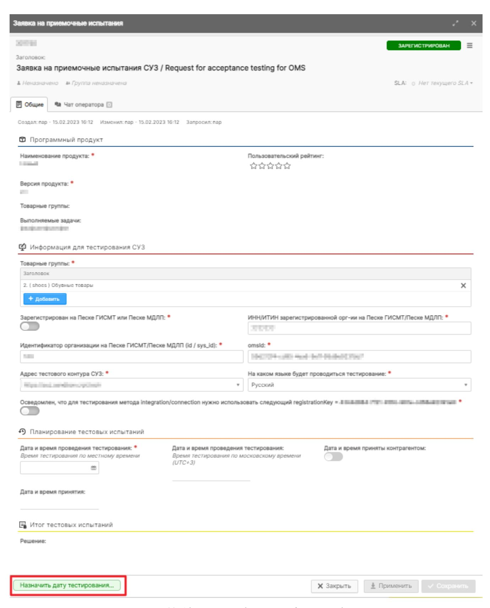

*Figure 30. A button to switch to setting of a new test date*

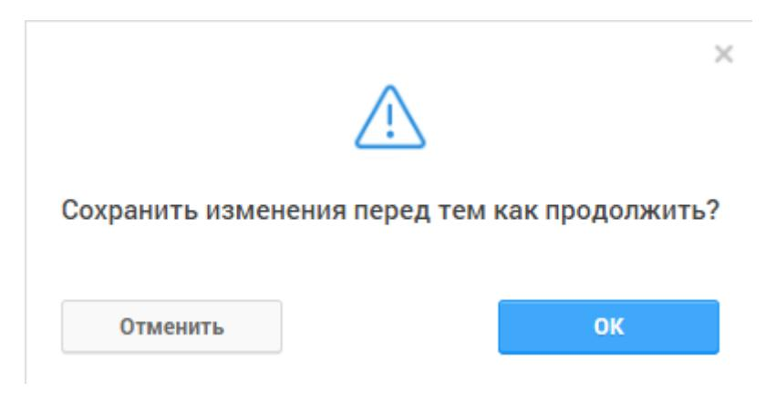

*Figure 31. Saving changes*

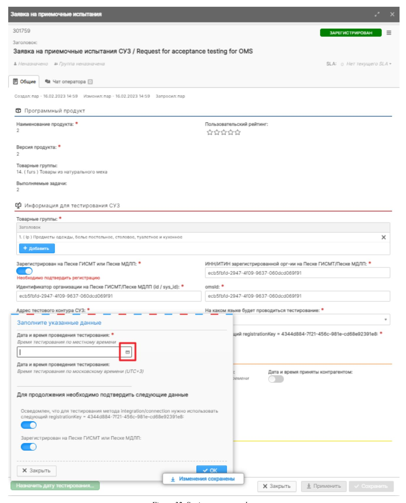

*Figure 32. Setting a new test date*

After consideration of the request, the Operator may propose another time for acceptance tests. In this case, the request will be moved to a **"Testing date approval"** status, after which a primary contact of the organization will be notified of the proposed testing date.

*Figure 33. Notification of testing date*

To agree on the proposed time, go to the version card, **"OMS requests"** tab, then switch to a request card by clicking a line with a name of the request in **"Testing date approval"** status. Confirm the proposed time in the request card by clicking the **[ Accept… ]** button or propose another time by clicking the **[ Suggest your time/date… ]** button. A process of request harmonization continues until the date and time of the acceptance tests have been approved by both parties.

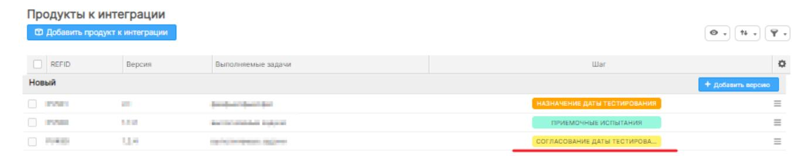

*Figure 34. A request is in the state of harmonization of testing date*

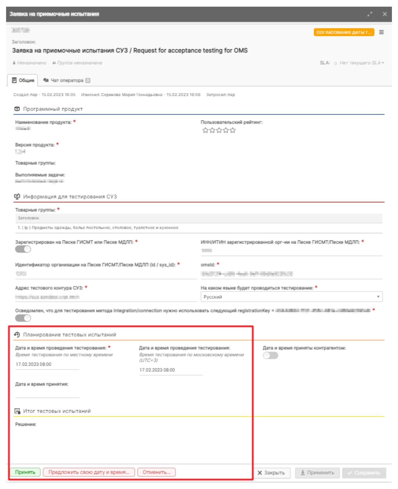

*Figure 35. Buttons to agree on testing date*

The agreed request will change a status to **"Acceptance tests"**. Date and time of the request acceptance will be displayed in the **"OMS requests"** tab in the **"Acceptance date and time"** column (when agreeing a new testing date, request acceptance date and time will be changed), a check mark will appear in the **"Date and time are accepted by counterparty"** column (with the appropriate setting of the table display).

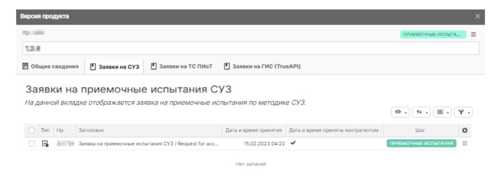

*Figure 36. A request with acceptance tests status*

To configure displayed columns in the **"OMS requests"** tab, click the button and select **"Select a field list"** in the drop-down menu.

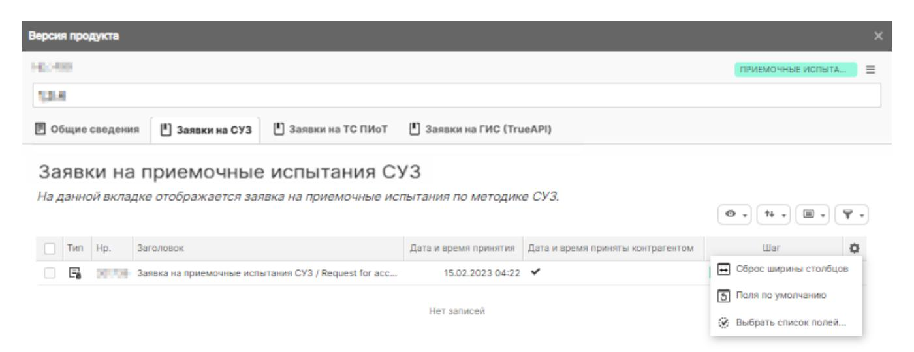

*Figure 37. Configuring displayed columns*

A list of all available fields is displayed in the **"Configuring table display"** opened window in the left column - **"Available fields"**. The visible columns in the **"OMS requests"** tab are displayed in the right column - **"Display fields"**. To add display of the required field, set the data selection check box in front of the corresponding field in the **"Available fields"** column, to hide a field, click the icon located in front of the corresponding field in the **"Display fields"** column, then click **[ Apply ]** button.

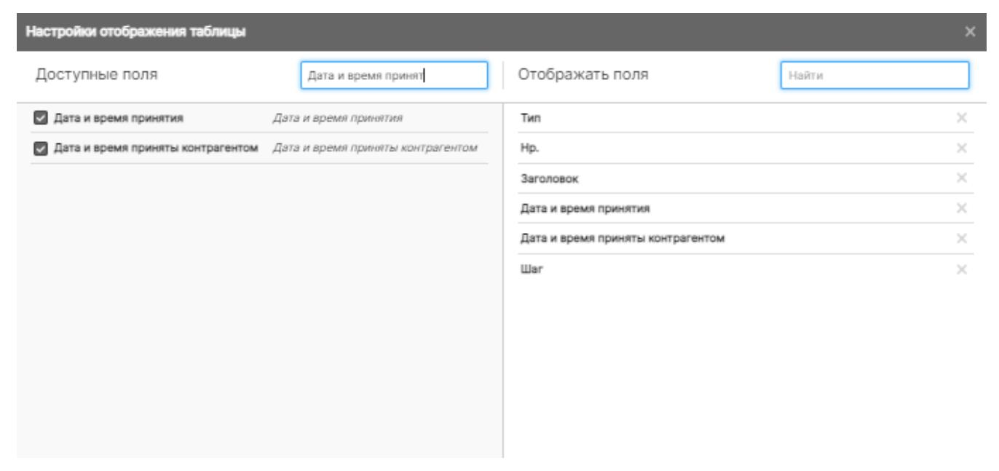

*Figure 38. Configuring table display*

To agree on details of testing, the Partners and Integrators Register provides a possibility to exchange messages on a request with the Operator's Technical Support Service (for more information, see section "[Switching to chat with Operator](#page-70-0)").

**Submission of request for acceptance tests of technical means for capturing product information**

Before registering a product of technical means for capturing product information, ensure that the business profile — "Integrator of software and hardware Solutions" has been selected, as well as one or several business profiles related to technical means for capturing product information: "Developer of model of technical means for capturing product information", "Developer of component of technical means for capturing product information", "Library Developer", and "Library Integration Developer". If the required business profiles are not selected, go to the **"Organization"** tab and click **[ Submit edit request ]**.

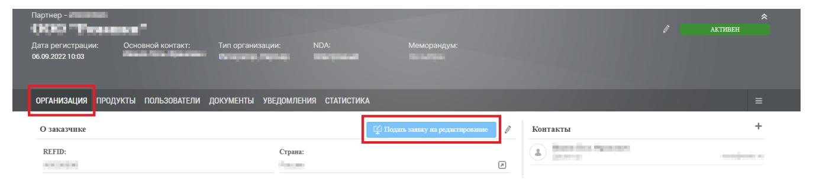

*Figure 39. A button to submit an edit request*

Then, select the required values and click **[ Save ]**.

|              | Поиск                                                                                                         | Q |
|--------------|---------------------------------------------------------------------------------------------------------------|---|
| <u>~</u>     | Интегратор программных и аппаратных Решений                                                                   |   |
|              | Консалтинговая деятельность                                                                                   |   |
|              | Оператор фискальных данных                                                                                    |   |
|              | Оператор электронного документооборота                                                                        |   |
|              | Производитель контрольно-кассовой техники                                                                     |   |
|              | Производитель, импортер 2D сканеров                                                                           |   |
|              | Производитель, импортер маркираторов, аппликаторов, оборудования, обеспечивающего обнаружение, автоматический |   |
|              | Производитель, импортер принтеров этикеток/чеков                                                              |   |
|              | Производитель, импортер терминалов сбора данных (ТСД)                                                         |   |
|              | Разработка ПО для сервис-провайдеров                                                                          |   |
|              | Разработчик ПО Track&Trace\Маркировки и прослеживаемости                                                      |   |
|              | Разработчик ПО для вендинговых аппаратов, производитель вендинговых аппаратов                                 |   |
|              | Разработчик кассового программного обеспечения                                                                |   |
| $\checkmark$ | Разработчик компонент ТС ПИоТ                                                                                 |   |
| $\checkmark$ | Разработчик модели ТС ПИоТ                                                                                    |   |
|              | Разработчик программно-аппаратных комплексов криптографии и средств информационной защиты                     |   |
|              | Разработчик систем планирования ресурсов и процессов (ERP системы)                                            |   |

*Figure 40. Selection of business profile*

Once your request to update the business profile has been approved, you may proceed with registration of your product of technical means for capturing product information and submission of a request for acceptance tests of technical means for capturing product information.

After the product is registered (see section ["Integration product registration"](#page-26-1)), submit a request for acceptance tests of technical means for capturing product information:

### **ATTENTION**

When registering an integration product, the **"Product of technical means for capturing product information"** toggle button must be switched to the "on" mode. Otherwise, the option to submit a request for acceptance tests will be unavailable.

Email notifications with test results will be sent to you at every stage of the request process. All notifications can be found in the **"Documents"** tab

- go to **"My organization" › "Products"** section in the **"Main menu"**;
- in the **"Integration products"** block, go to a card of the product version, which will be requested for acceptance tests of technical means for capturing product information. To go to the card, click on a line with a version number;

#### **ATTENTION**

If a product already has a version of the **"Component of technical means for capturing product information"** type with the **"Admitted to the production environment"** status, a request for acceptance tests may be submitted for a new version in a notification mode. A consent to information provision and a request for interoperability testing are not required; the request for acceptance tests will be automatically moved to the **"Closed"** status

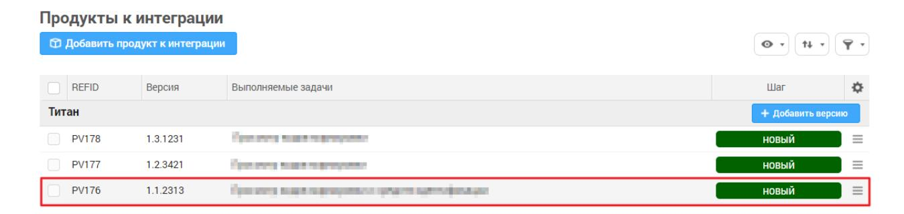

*Figure 41. Switch to product version card*

• fill out entry fields (mandatory fields are marked with a red asterisk) in a version card in **"General information"** tab:

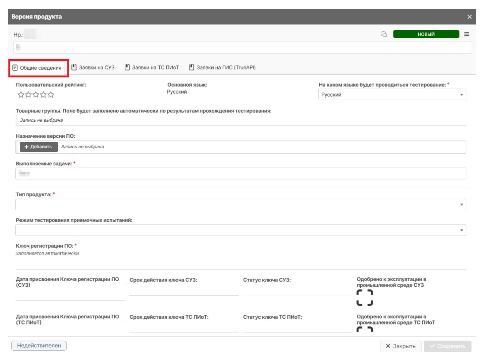

*Figure 42. General information*

- **"Language of testing"** select a value from the drop-down list (**"Russian"** / **"English"**);
- **"Goods groups"** it is filled out automatically after successful completion of the acceptance tests and when a tested product version changes its status to **"Admitted to the production environment"**;

- **"Specification"** it is filled out automatically on the basis of information specified in the request to register a product for integration;
- **"Product type"** select a value from the drop-down list. Possible values: **"Model of technical means for capturing product information"** and **"Component of technical means for capturing product information"**.

The "Component of technical means for capturing product information" is used to refer to, inter alia, a software module that generates settlement data.

Depending on the selected value, the fields of the product version in the **"General information"** tab will differ;

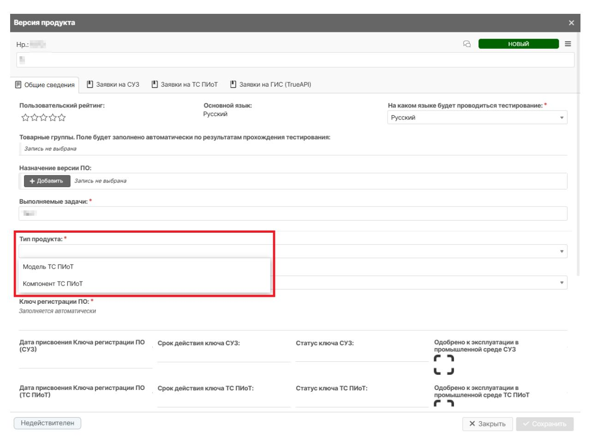

*Figure 43. Product type*

◦ **"I agree to provide information"** — activate this option by moving the toggle button to the "on" state.

Once the switch is activated, mandatory fields will be marked with a red asterisk.

- **Type of component of technical means for capturing product information** (for the **"Component of technical means for capturing product information"** product type) — select a value from the drop-down list. Possible values:
  - **"Driver for technical means for capturing product information"**;

- **"Driver for control and cash register equipment"**;
- **"Driver for Scanners"**;
- **"Software"**;
- **"Library for technical means for capturing product information"** (only for the "Library Developer" business profile);
- **"Integration with Library for technical means for capturing product information"** (only for the "Library Integration Developer" business profile).
- **Acceptance testing mode** (for the **"Component of technical means for capturing product information"** product type) — select a value from the drop-down list. Possible values:
  - **"Request mode"**;
  - **"Notification mode"**.

To avoid additional questions and requests for clarification from the specialists who will carry out the acceptance testing, it is recommended to provide complete and accurate product information. This requires enabling the "I agree to provide information" option.

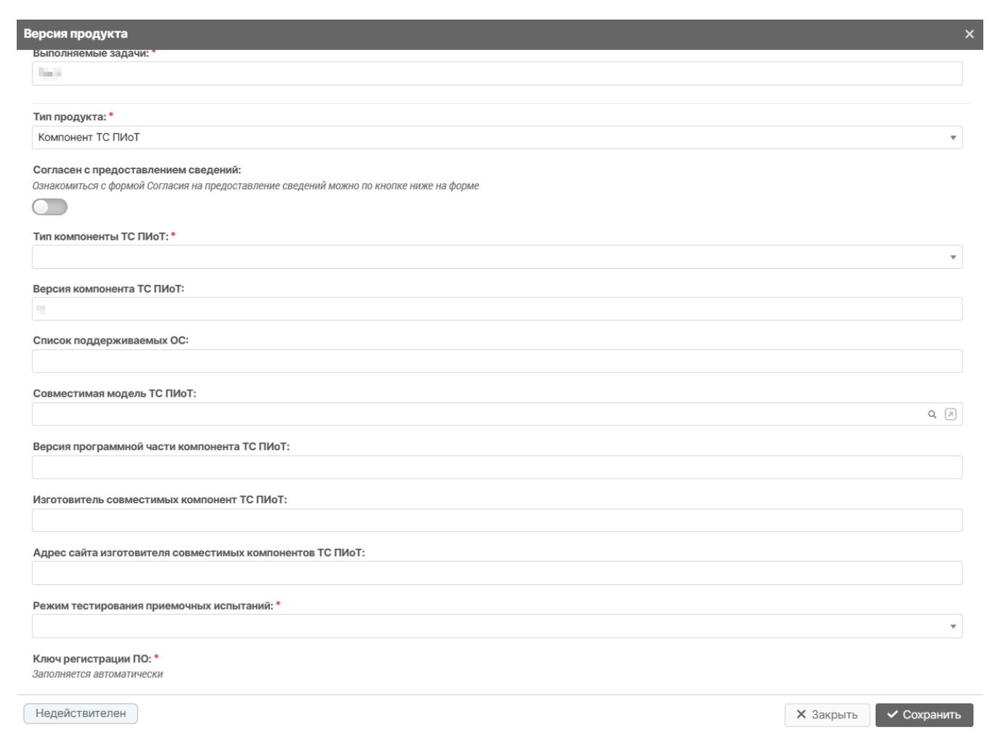

*Figure 44. Fields for Component of technical means for capturing product information*

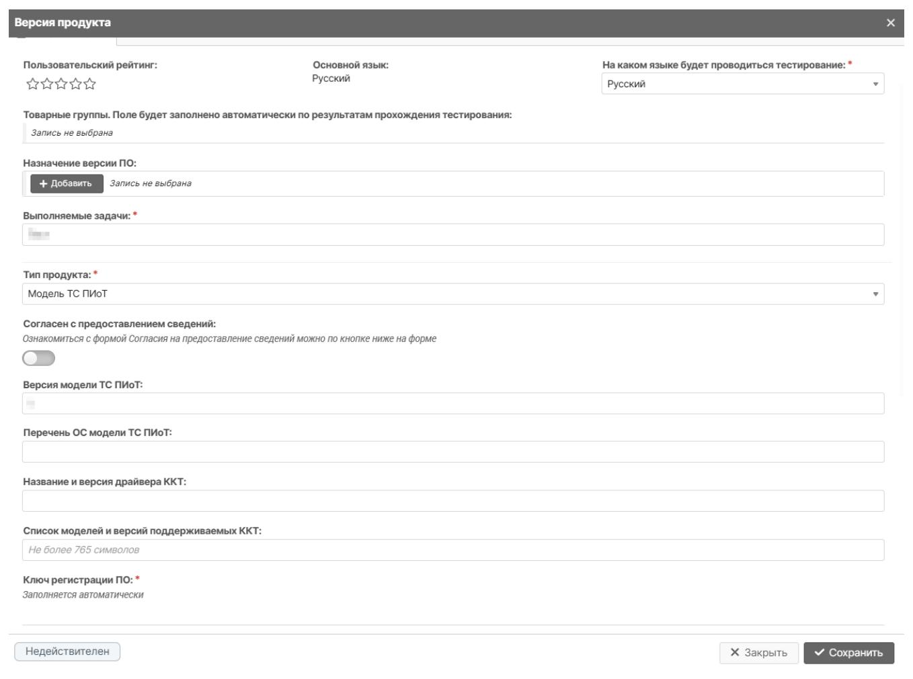

*Figure 45. Fields for Model of technical means for capturing product information*

- click the **[ Save ]** button.
- in a version card, go to the **"Requests for technical means for capturing product information"** tab and click the **[ Submit a consent for information provision ]** button;

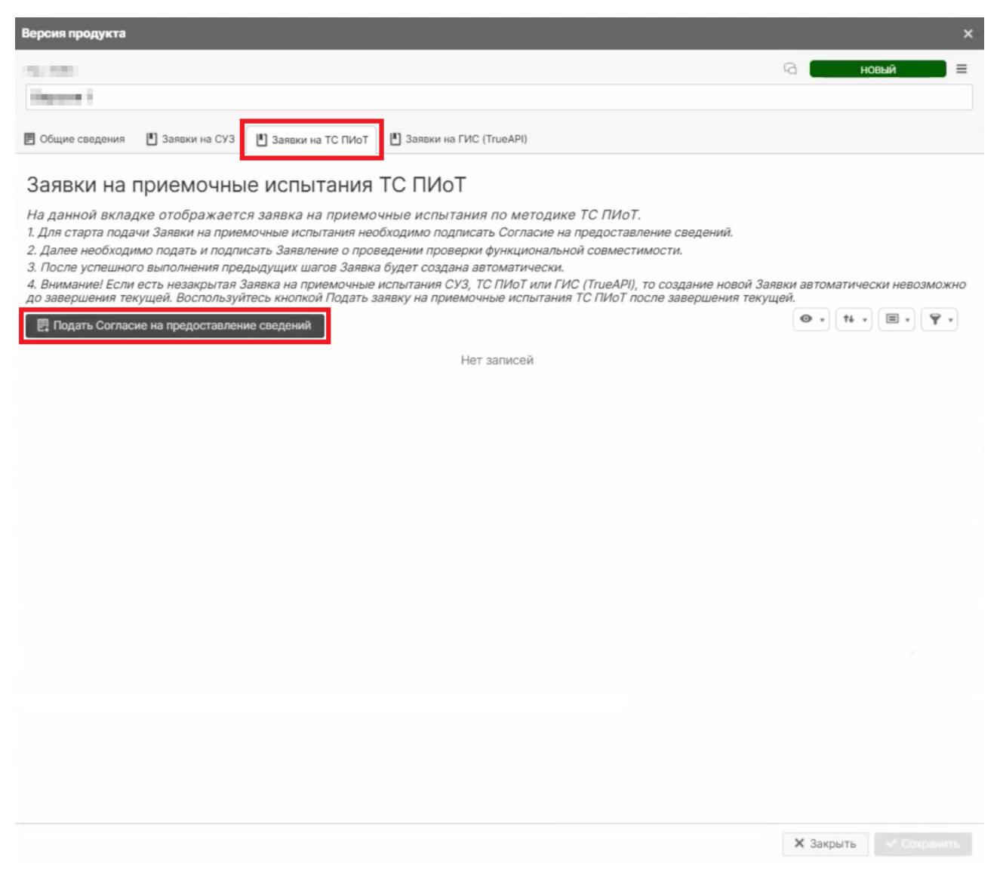

*Figure 46. Button to submit a consent for information provision*

• go to a card of the generated consent in the **"Documents"** tab;

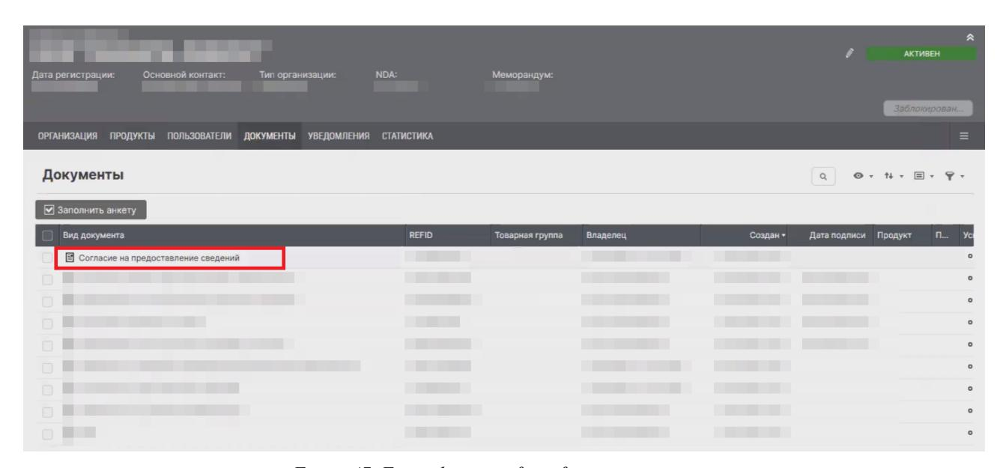

*Figure 47. Formed consent for information provision*

**ATTENTION** If the consent to provide information is rejected, a notification with the

reason for rejection will be sent. After correcting the issues, the document can be updated without the need to resubmit the consent (clicking the **[ Update document ]** button generates a new document with the corrected data)

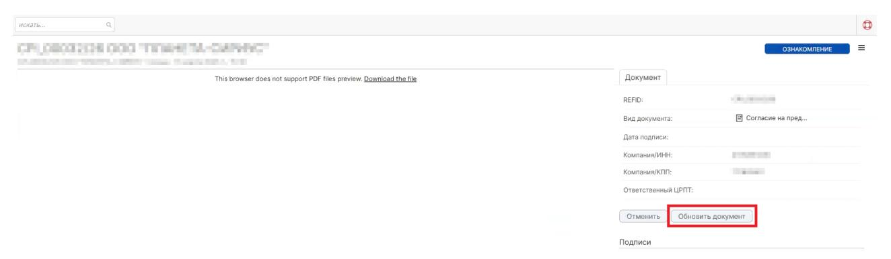

*Figure 48. Button to update a consent to information provision*

• click the **[ Sign document ]** (before signing you can familiarize yourself with a request text. To do this, download it by clicking the **[ Download PDF file ]**);

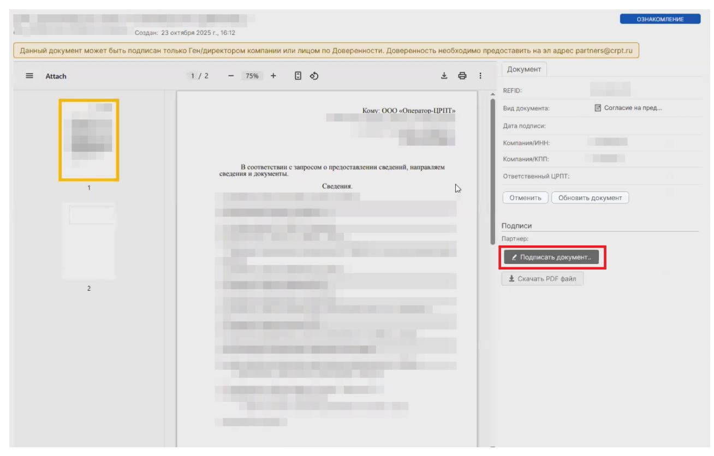

*Figure 49. Signing of the formed consent for information provision*

• in the version card, go to the **"Requests for technical means for capturing product information"** tab and click the **[ Submit Request for interoperability testing ]** button;

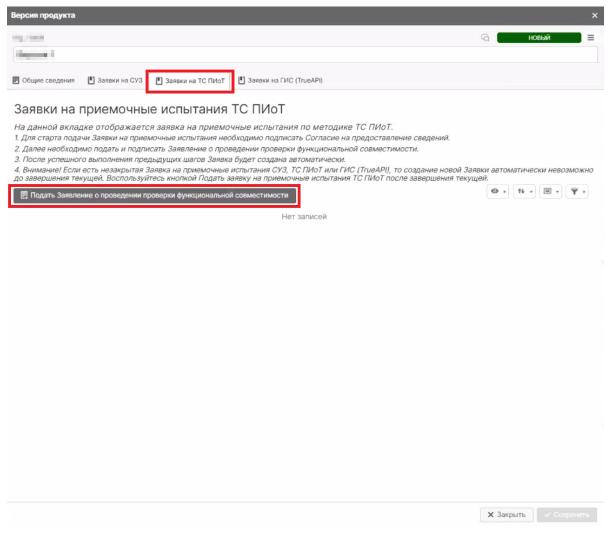

*Figure 50. Button to submit a request*

• go to a card of the formed request in the **"Documents"** tab;

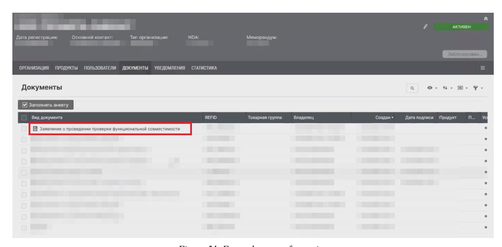

*Figure 51. Formed request for testing*

• click the **[ Sign document ]** (before signing you can familiarize yourself with a request text. To do this, download it by clicking the **[ Download PDF file ]**);

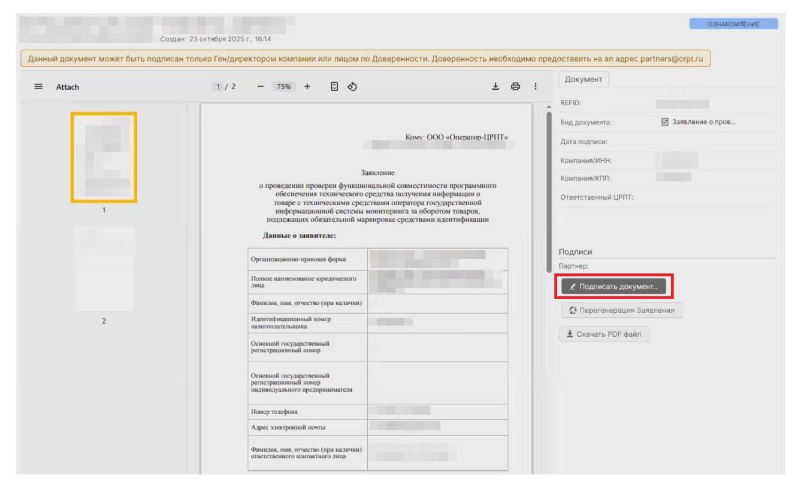

*Figure 52. Signing of the formed request for testing*

The formed request will be sent to the Operator for approval, and a product version will change its status to **"New"**.

Depending on the outcome of consideration of the request for interoperability testing, the Operator will upload a document to the partner's user account. The document will be available in the **"Documents"** section:

- in case of **successful** consideration **"Notification of no grounds for refusal"**;
- in case of **unsuccessful** consideration **"Notification of refusal to accept the request"**;
- after successful consideration of the request, you can submit an acceptance test request in one of two ways:
  - **automatically** if all previously submitted requests for acceptance tests are closed, a new request will be generated automatically. To view it, go to the **"Requests for technical means for capturing product information"** tab in the version card and click the generated request.

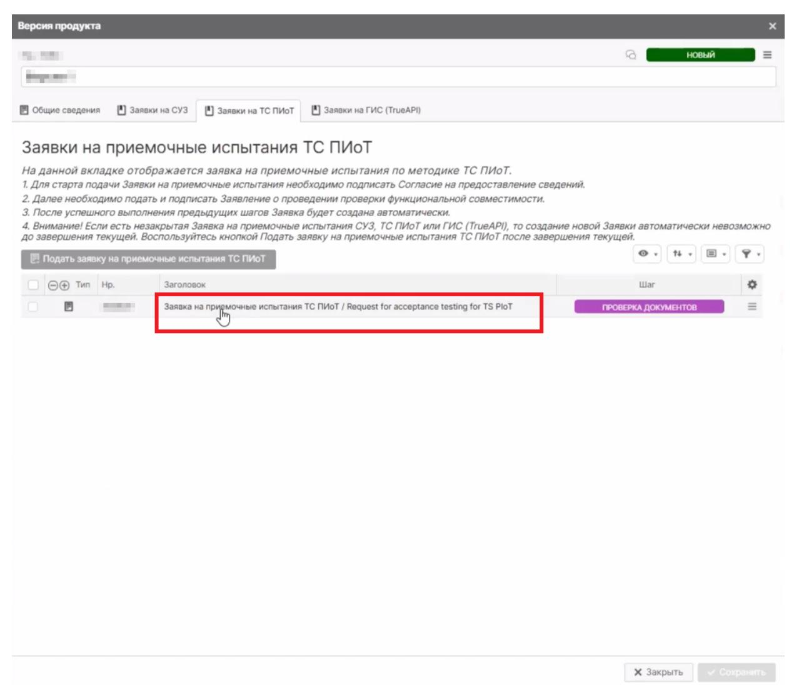

*Figure 53. Request for acceptance tests of technical means for capturing product information*

In the modal window of the generated request, make adjustments to the fields (mandatory fields are marked with a red asterisk):

▪ **"Goods groups"** — add a goods group for which acceptance testing of the product will be conducted in accordance with the established testing procedure by clicking the **[ Add ]** button. To add additional goods groups, click the **[ Add ]** button again. To remove a value from the list, click .

#### **ATTENTION**

In the request form, for the type of component of technical means for capturing product information — **"Integration with Library for technical means for capturing product information"**, the **"Link to protocol verifying software integration with the library"** field is displayed for completion. For other types of components of technical means for capturing product information: the **"Link to storage"** field is displayed.

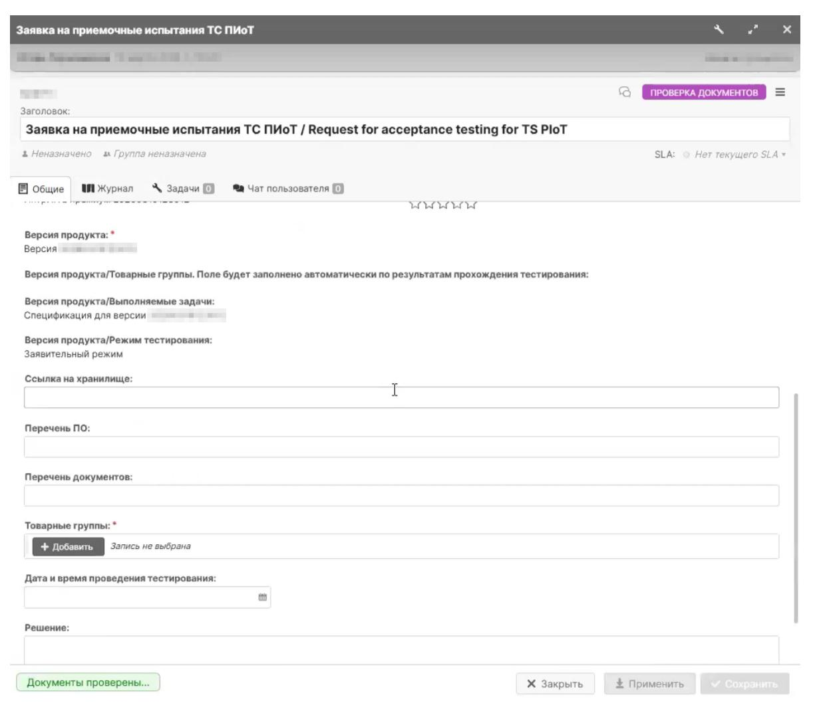

*Figure 54. Fields correction in the generated request*

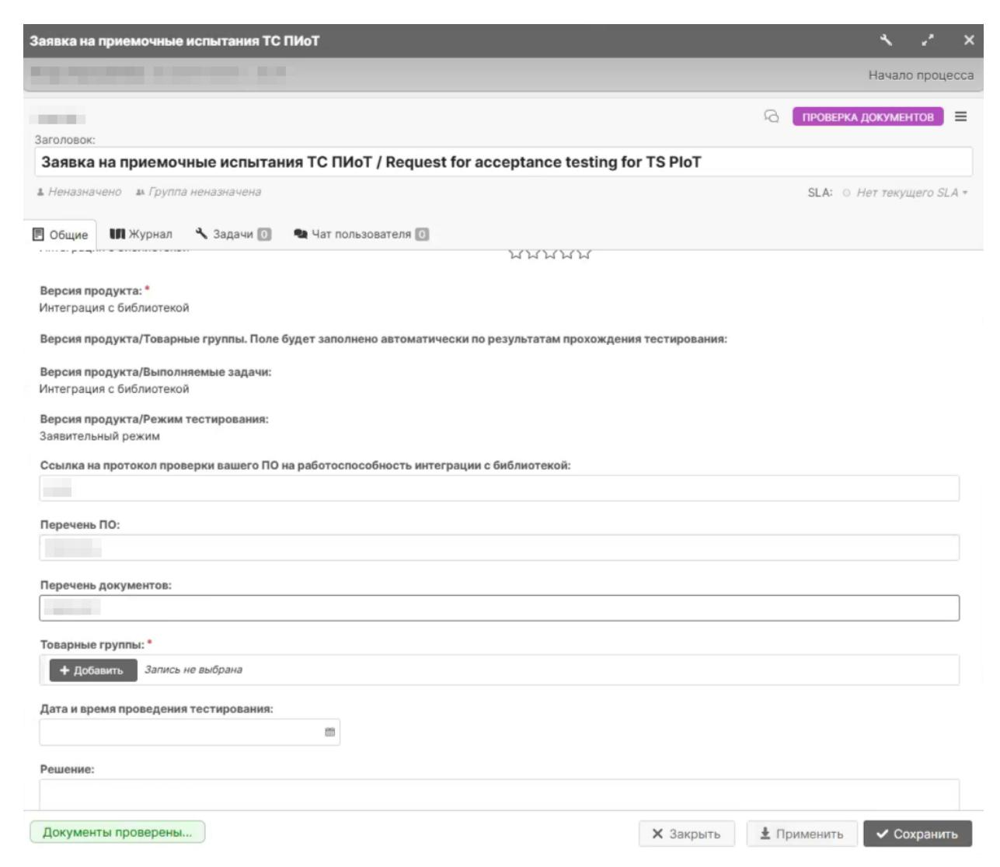

*Figure 55. Fields correction in the generated library integration request*

Once the corrections are made, click the **[ Save ]** button.

◦ **manually** — if there is an open request for acceptance tests, submit the request manually. To do this, go to the **"Requests for technical means for capturing product information"** tab in the version card and click the **[ Submit a request for acceptance tests of technical means for capturing product information ]** button;

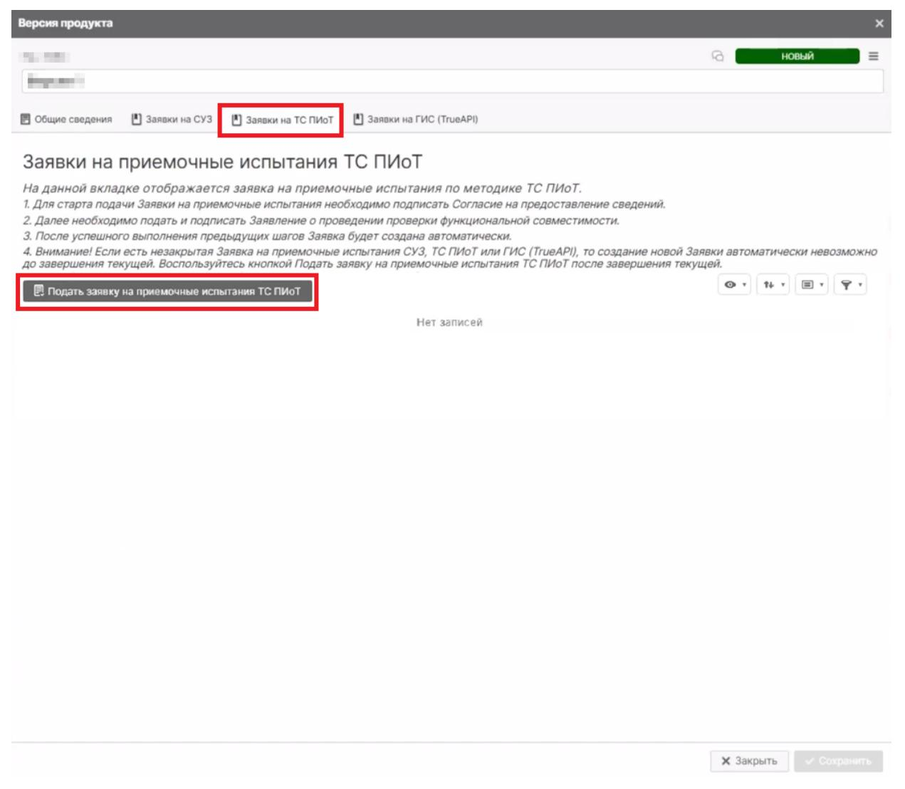

*Figure 56. Button to submit a request for acceptance tests of technical means for capturing product information*

Fill in the fields of the **"Acceptance test request"** modal window (mandatory fields are marked with a red asterisk):

▪ **"Goods groups"** — add a goods group for which acceptance tests of the product will be conducted in accordance with the established testing procedure, by clicking the **[ Add ]** button. To add additional goods groups, click the **[ Add ]** button again. To remove a value from a list, click .

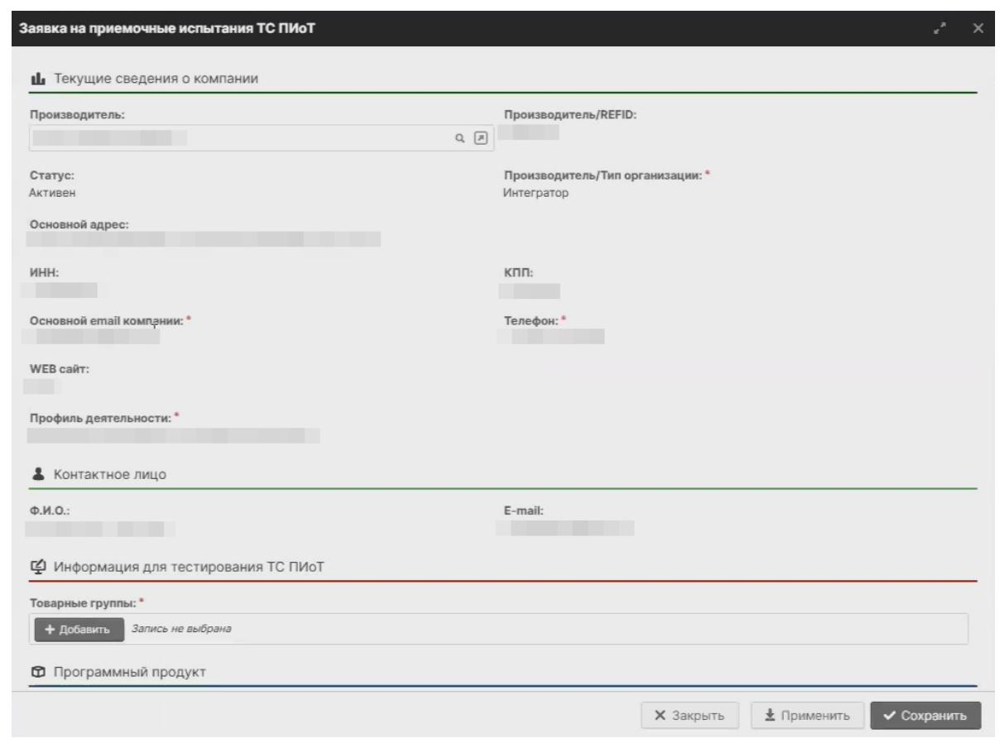

*Figure 57. Request for acceptance tests of technical means for capturing product information*

Click the **[ Save ]** button to complete request creation.

The formed request will be sent to the Operator for approval, a status of the product version will be changed to **"Acceptance tests"**, and the Operator will upload the "Testing program for technical means for capturing product information" document to the partner's user account, where it can be viewed in the **"Documents"** section.

Depending on the testing result, the Operator will upload the following documents to the partner's user account, where they can be viewed in the **"Documents"** section:

- in case of **successful** testing **"Notification of positive testing result"** and **"Interoperability testing protocol"**;
- in case of **unsuccessful** testing **"Notification of negative testing result"** and **"Interoperability testing protocol"**.

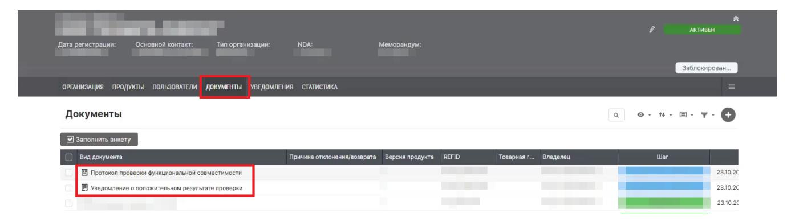

*Figure 58. Section with the documents on successful testing*

To agree on details of acceptance tests, the Partners and Integrators Register provides a possibility to exchange messages on a request with the Operator's Technical Support Service (for more information, see section "[Switching to chat with Operator"](#page-70-0)).

**Submission of request for GIS acceptance tests (TrueAPI)**

After the product is registered (see section "[Integration product registration](#page-26-1)"), submit a request for GIS acceptance tests (TrueAPI):

- go to **"My organization" › "Products"** section in the **"Main menu"**;
- in the **"Integration products"** block, go to a card of the product version that will be requested for acceptance tests in the GIS. To go to the card, click on a line with a version number;

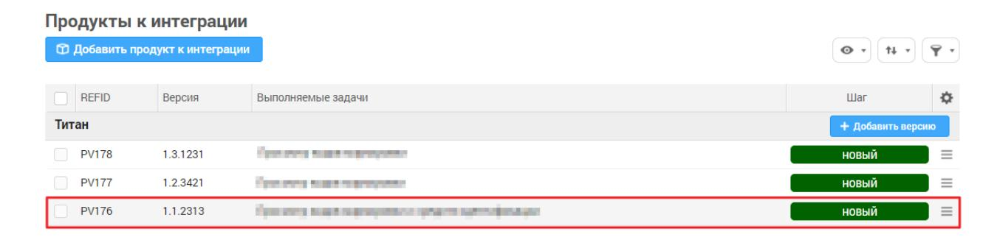

*Figure 59. Switch to product version card*

- fill in entry fields (mandatory fields are marked with a red asterisk) in a version card in the **"General information"** tab:
  - **"Language of testing"** select a value from the drop-down list (**"Russian"** / **"English"**);
  - **"Goods groups"** it is filled in automatically after successful completion of the acceptance tests and when a tested product version changes its status to **"Admitted to the production environment"**;
  - **"Specification"** it is filled in automatically on the basis of the information specified in the request to register a product for integration;
  - click the **[ Save ]** button.

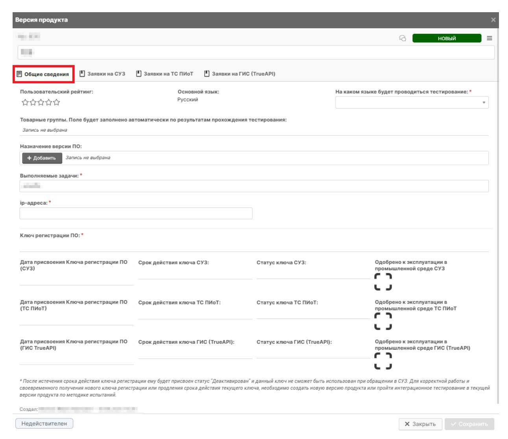

*Figure 60. General information*

• go to the **"GIS requests (TrueAPI)"** tab in a version card and click the **[ Submit a request for acceptance tests in the GIS (TrueAPI) ]** button;

**ATTENTION**

When the current product version status is **"Invalid"**, the **[ Submit a request for acceptance tests in the GIS (TrueAPI) ]** button is unavailable

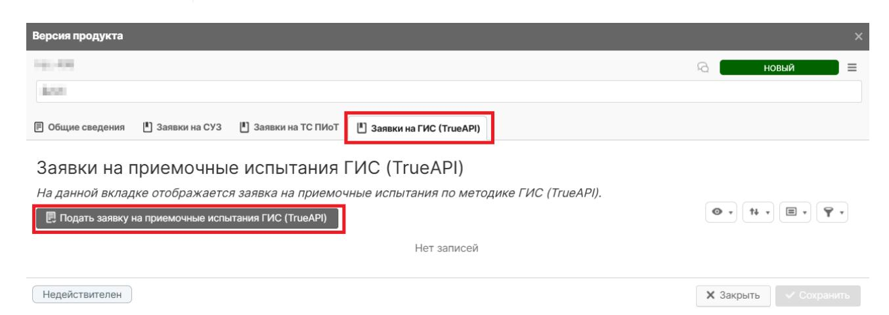

*Figure 61. A button to submit a request for interoperability testing*

- fill in the fields of the **"Acceptance test request"** modal window (mandatory fields are marked with a red asterisk):
  - **"Goods groups"** add a goods group for which acceptance tests of the product will be conducted in accordance with the established testing procedure, by clicking the **[ Add ]** button. To add additional goods groups, click the **[ Add ]** button again. To remove a value from a list, click ;
  - **"Testing date and time: Testing time, local time"** offer date and time of the acceptance tests (local time) by clicking the button . Testing start time shall be specified only in the interval from 08:00 AM to 06:00 PM, MSK inclusive. When attempting to indicate time which does not correspond to the allowed time range, the following warning will be displayed: **"The specified time is out of the allowed range (from 08:00 AM to 06:00 PM, MSK)"**;
  - **"Testing date and time: Testing time, Moscow time (UTC+3)"** it is filled in automatically.

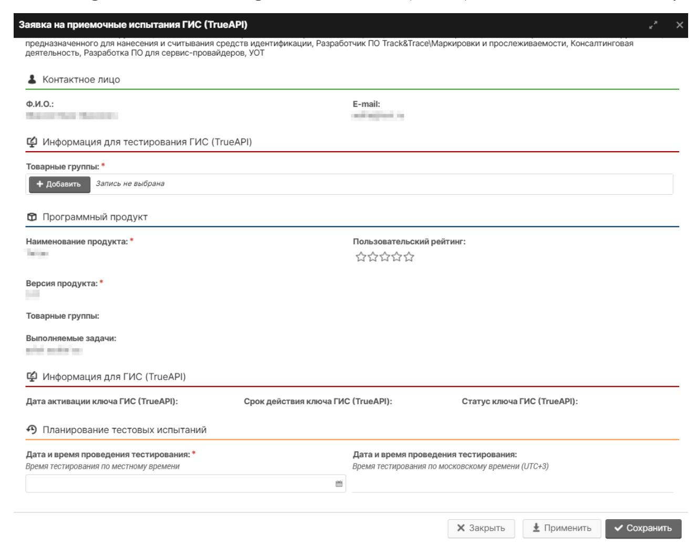

*Figure 62. Request for GIS acceptance tests (TrueAPI)*

• click the **[ Save ]** button to complete request creation.

The created request will be sent to the Operator for approval, and the product version will change its status to **"Testing date assignment"**.

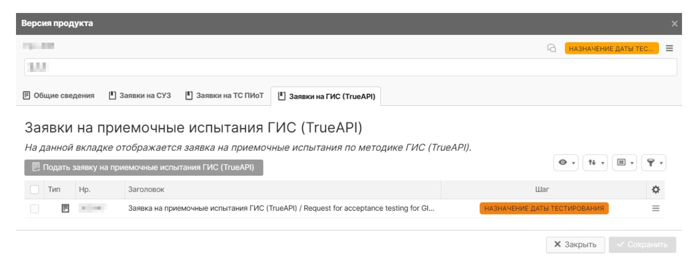

*Figure 63. Created request*

To postpone the acceptance test date, switch to **"GIS requests (TrueAPI)"** tab in the version card and click on a line with the request in **"Testing date assignment"** status. In the request card, click the **[ Cancel… ]** button in the lower left corner of the window, then set a new date for acceptance tests by clicking the **[ Testing date assignment… ]** button after activation of the mandatory switches. Select the **"Yes"** value in the dialog box for saving changes, then set a new date in the selection form in the lower part of the request card by clicking the button .

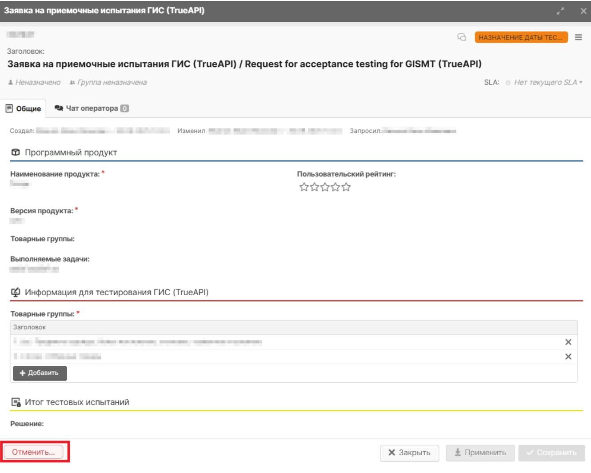

*Figure 64. Request cancellation*

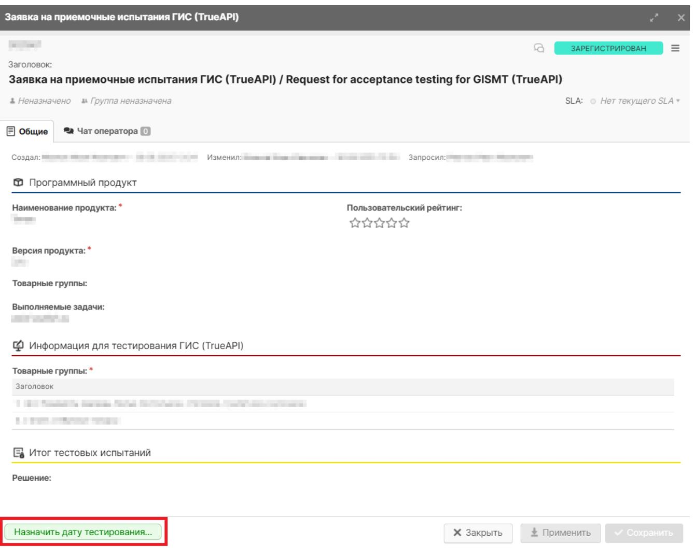

*Figure 65. A button to switch to setting of a new test date*

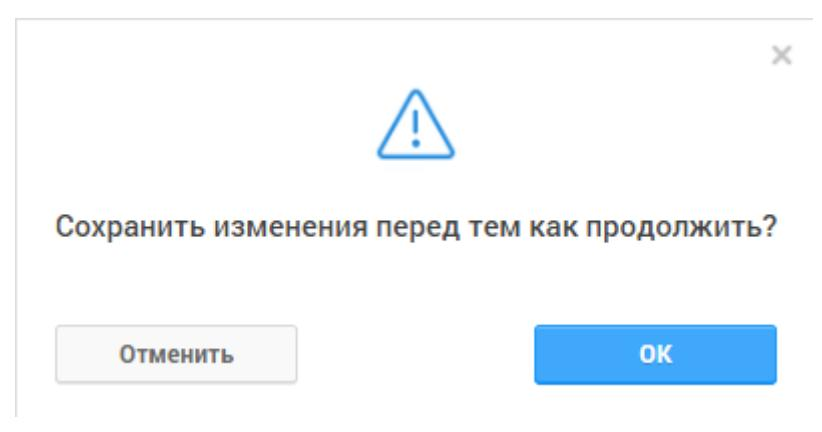

*Figure 66. Saving changes*

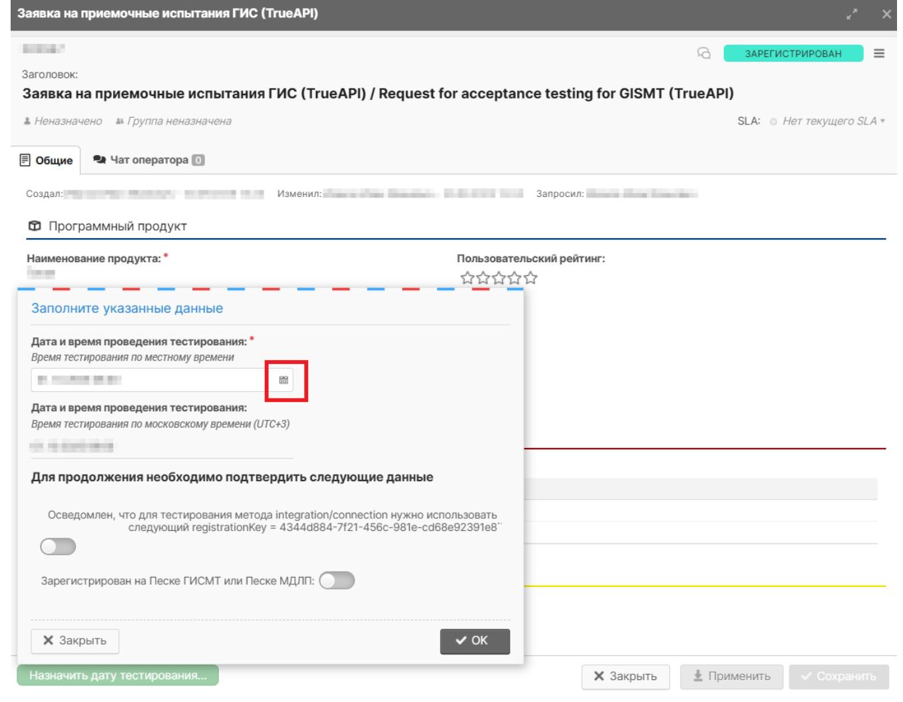

*Figure 67. Setting a new test date*

After consideration of the request, the Operator may propose another time for acceptance tests. In this case, the request will be moved to the **"Testing date approval"** status, after which a primary contact of the organization will be notified of the proposed testing date.

*Figure 68. Notification of testing date*

To agree on the proposed time, go to the version card, **"GIS requests (TrueAPI)"** tab, then switch to a request card by clicking a line with a name of the request in **"Testing date approval"** status. Confirm the proposed time in the request card by clicking the **[ Accept… ]** button or propose another time by clicking the **[ Suggest your time/date… ]** button. A process of request harmonization continues until the date and time of the acceptance tests have been approved by both parties.

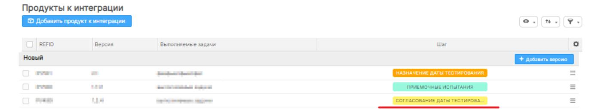

*Figure 69. A request is in the state of harmonization of testing date*

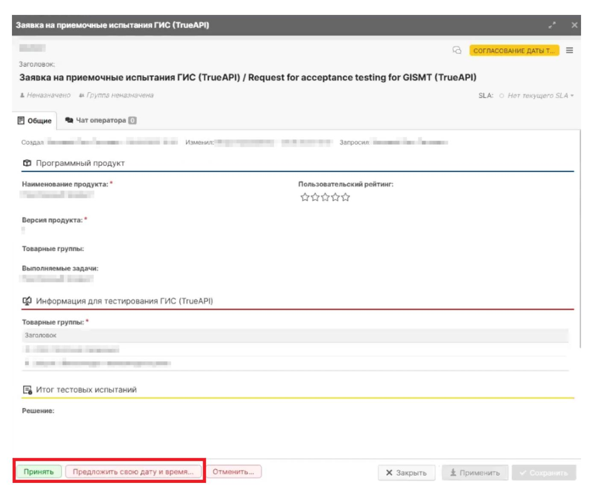

*Figure 70. Buttons to agree on testing date*

The agreed request will change a status to **"Acceptance tests"**. Date and time of the request acceptance will be displayed in the **"GIS requests (TrueAPI)"** tab in the **"Acceptance date and time"** column (when agreeing the new testing date, request acceptance date and time will be changed), a check mark will appear in the **"Date and time are accepted by counterparty"** column (with the appropriate setting of the table display).

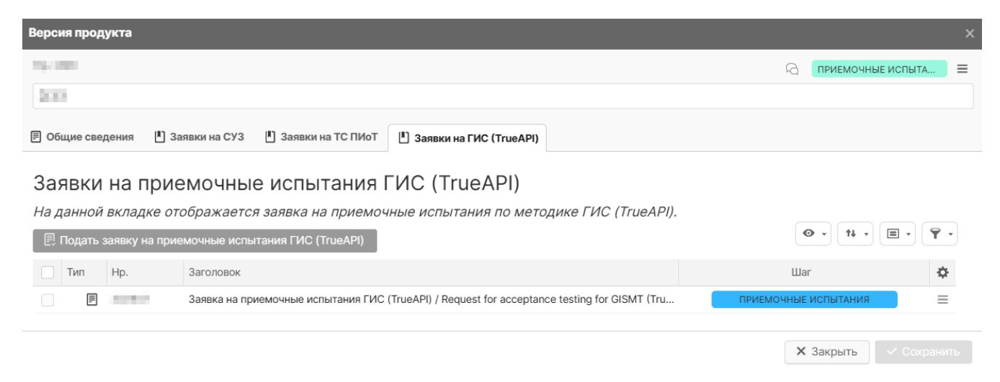

*Figure 71. A request with acceptance tests status*

To configure displayed columns in the **"GIS requests (TrueAPI)"** tab, click the button and select **"Select a field list"** in the drop-down menu.

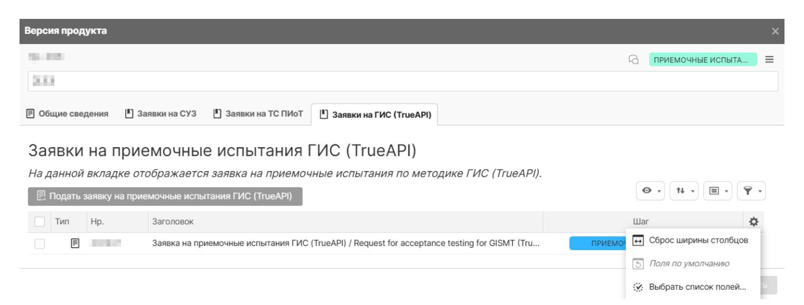

*Figure 72. Configuring displayed columns*

A list of all available fields is displayed in the **"Configuring table display"** opened window in the left column - **"Available fields"**. The visible columns in the **"GIS requests (TrueAPI)"** tab are displayed in the right column - **"Display fields"**. To add display of the required field, set the data selection check box in front of the corresponding field in the **"Available fields"** column, to hide the required field, click the icon located in front of the corresponding field in the **"Display fields"** column, then click the **[ Apply ]** button.

*Figure 73. Configuring table display*

To agree on details of testing, the Partners and Integrators Register provides a possibility to exchange messages on a request with the Operator's Technical Support Service (for more details, see section "[Switching to chat with Operator](#page-70-0)").

#### **Switching to chat with Operator**

To agree on details of testing, the Partners and Integrators Register provides a possibility to exchange messages on a request with the Operator's Technical Support Service.

To switch to the chat:

- go to **"Requests"** section in the **"Main menu"**;
- select a request to be discussed with the Operator on the request panel;

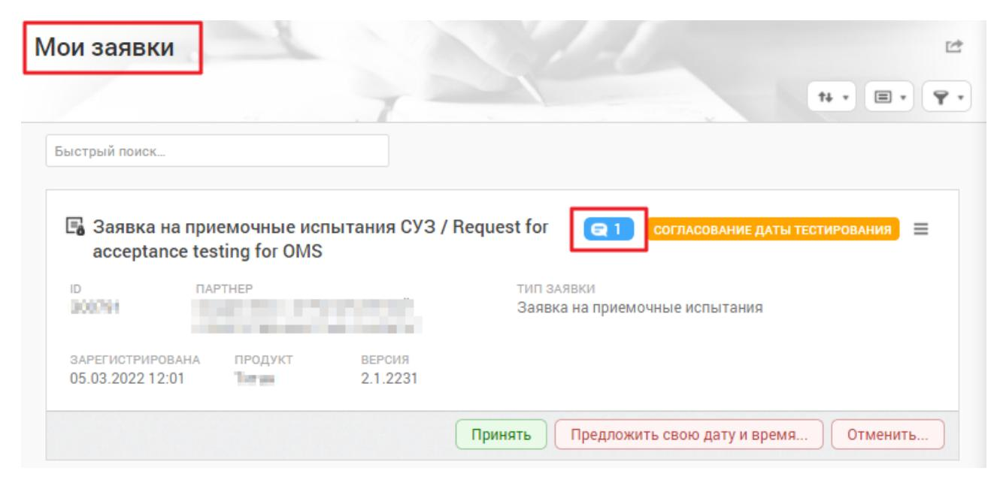

*Figure 74. Switch to a chat on request*

A notification on the number of messages in the chat is displayed in the request header.

• in the request window, switch to **"Operator chat"** tab, enter a message and click a **[ Send ]** button.

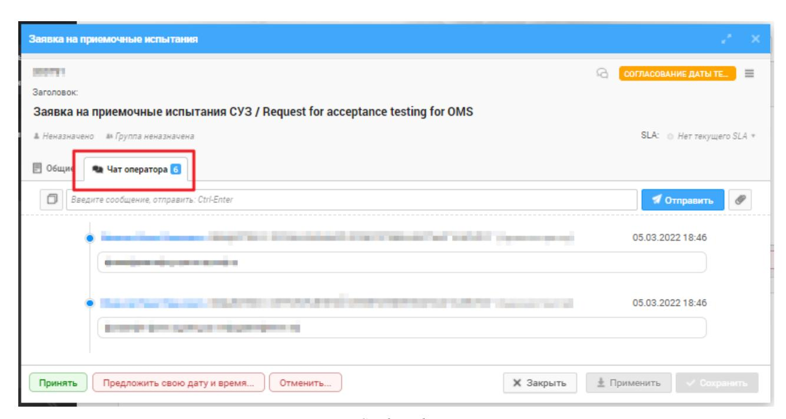

*Figure 75. Sending chat messages*

#### **Testing of integration with the OMS**

Before acceptance tests, it is necessary to familiarize yourself with a procedure for testing integration with the OMS. To do so, select a **"Knowledge base"** section in the **"Main menu"**, follow a link **"Commissioning check procedure RU"** and download description in \* .pdf format.

The acceptance tests are conducted at the pre-agreed time specified in the request for testing (see section ["Submission of request for acceptance tests in the OMS"](#page-34-1)). At the appointed time, an employee of the organization and Operator representative will conduct joint testing of the product version specified in the request in accordance with the commissioning check procedure via Zoom meeting.

In case of successful completion of the acceptance tests, the tested product version will change its status to **"Admitted to the production environment"**, **"Approved for operation in the OMS production environment"** mark will appear in the version card, and a unique registration key (registrationKey), which is valid only in the **production environment** of the TT GIS or MDLP FGIS will appear in the **"Software registration key"** field.

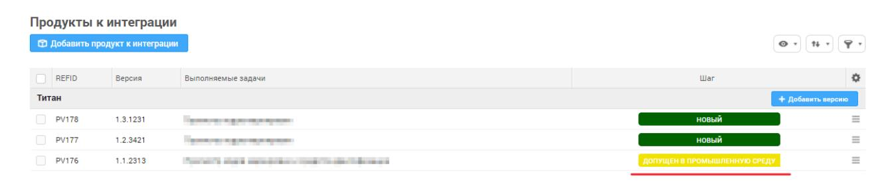

*Figure 76. Status of successfully tested version*

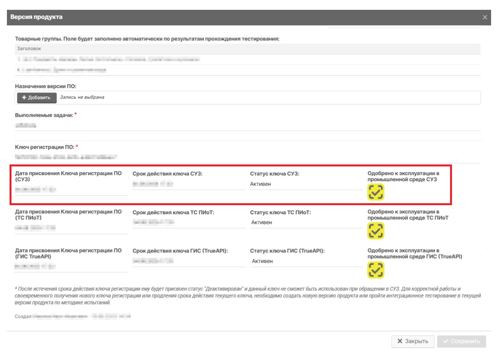

*Figure 77. Card of successfully tested version*

The card of the tested version also contains additional information on the registration key:

- **"Date of assignment of the registration key to the Software (OMS)"** a date of the registration key obtainment is displayed;
- **"OMS key validity period"** a key validity period is displayed .

If the key expires, it changes its status to **"Deactivated"** and is blocked for use in the OMS. Information notice on expiry of the key and on the need of the repeated testing of the version is displayed when entering a user account of the Partners and Integrators Register, as well as in the message sent to the email of the primary contact of the organization at the following frequencies:

- 3 calendar months before expiration date;
- 2 calendar months before expiration date;
- 1 calendar month before expiration date;
- 3 calendar weeks before expiration date;
- 2 calendar weeks before expiration date;
- 1 calendar week before expiration date;
- 1 calendar day before expiration date.

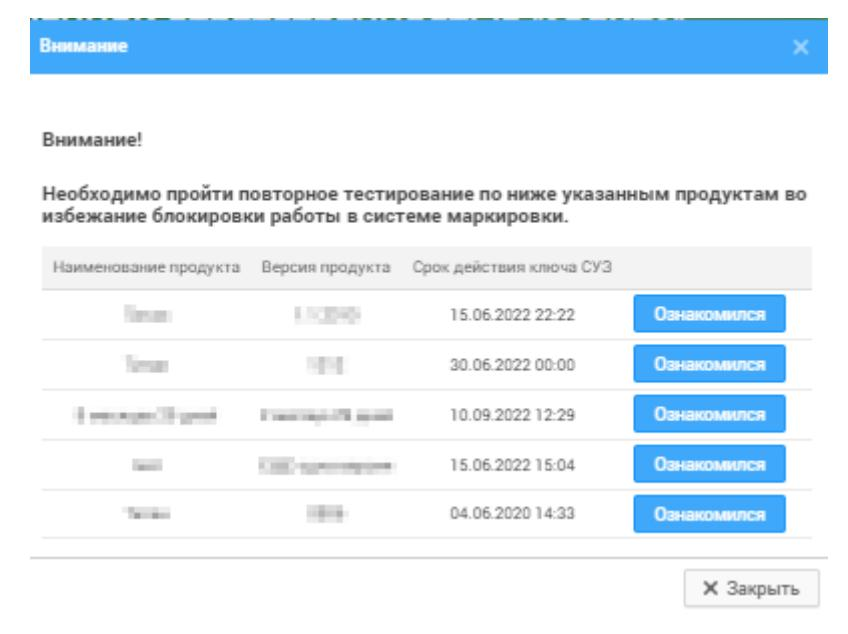

*Figure 78. Information notice on expiry of the OMS key*

To disable display of the information notice in the user account of the Partners and Integrators Register until the next notification date, in the notice modal window it is necessary to click the **[ Familiarized ]** button in a line with a version information.

To avoid blocking the registration key, re-testing can be done well in advance of the key expiration date (see section "[Submission of request for acceptance tests in the OMS](#page-34-1)").

• **"OMS key status"** — key status is displayed (**"Active"** and **"Deactivated"**). The key changes its status to **"Deactivated"** at the end of the validity period or upon deactivation by the Operator for other reasons, in this case a product version status will be changed to **"Deactivated"**.

If the version is successfully re-tested, the registration key is returned to the **"Active"** status and a registration key value remains for the version.

If the OMS key statuses are changed to **"Deactivated"** upon their expiration or in case of deactivation on the part of the Operator for other reasons, a product version status will be changed to **"Deactivated"**. If one of the keys switches to the **"Active"** status, a product version status will be changed to **"Approved for the production use"**.

A product version, which has been successfully tested, becomes available in the OMS user interface in the **"Registry of integration solutions"** section (if a visibility setting is in (on) mode for the product).

For product versions, which have received **"Admitted to the production environment"** status, trusted INNs can be added (see section ["Adding of trusted INN](#page-82-0)").

**Testing of integration with technical means for capturing product information**

In case of successful completion of the acceptance tests, the tested product version will change its status to **"Admitted to the production environment"**, and the **"Approved for operation in the production environment of technical means for capturing product information"** mark will appear in the version card, and a unique registration key (registrationKey), which is valid only in the **production environment** of the TT GIS or MDLP FGIS will appear in the **"Software registration key"** field.

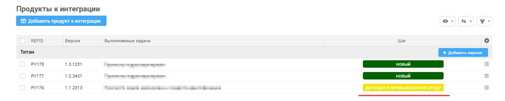

*Figure 79. Status of successfully tested version*

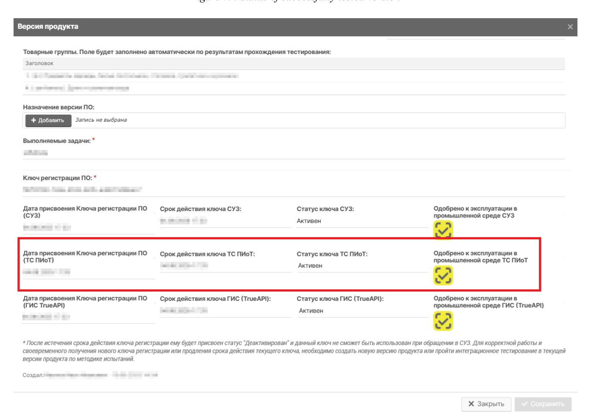

*Figure 80. Card of successfully tested version*

The card of the tested version also contains additional Information on the registration key:

- **"Date of assignment of the registration key to the Software (Technical means for capturing product information)"** — a date of the registration key obtainment is displayed;
- **"Key validity period of technical means for capturing product information"** a key validity period is displayed.

If the key expires, it changes its status to **"Deactivated"** and is blocked for use in the GIS.

To avoid blocking the registration key, re-testing can be done well in advance of the key expiration

date (see section ["Submission of request for acceptance tests of technical means for capturing](#page-47-0) [product information](#page-47-0)").

• **"Key status of technical means for capturing product information"** — a key status is displayed (**"Active"** and **"Deactivated"**). The key changes its status to **"Deactivated"** upon its expiration or in case of deactivation on the part of the Operator for other reasons, a product version status will be changed to **"Deactivated"**.

If the version is successfully re-tested, the registration key is returned to the **"Active"** status and a registration key value is stored for the version.

If the GIS key statuses are changed to **"Deactivated"** upon their expiration or in case of deactivation on the part of the Operator for other reasons, a product version status will be changed to **"Deactivated"**. If one of the keys switches to the **"Active"** status, a product version status will be changed to **"Approved for the production use"**.

**Testing of integration with GIS (TrueAPI)**

In case of successful completion of the acceptance tests, the tested product version will change its status to **"Admitted to the production environment"**, and the **"Approved for operation in the GIS production environment (TrueAPI)"** mark will appear in the version card, and a unique registration key (registrationKey), which is valid only in the **production environment** of the TT GIS will appear in the **"Software registration key"** field.

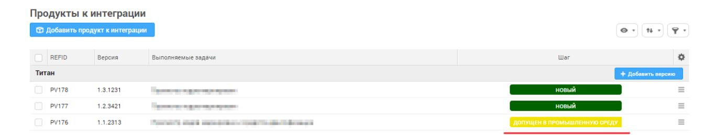

*Figure 81. Status of successfully tested version*

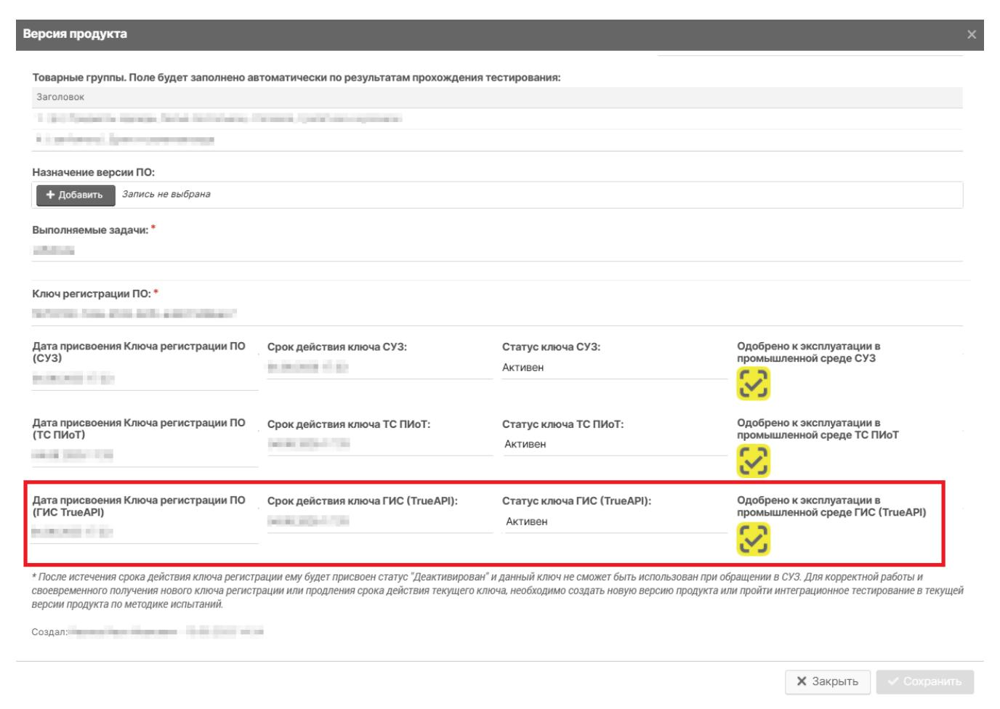

*Figure 82. A card of successfully tested version*

The card of the tested version also contains additional information on the registration key:

- **"Date of assignment of the registration key to the Software (GIS TrueAPI)"** a date of the registration key obtainment is displayed;
- **"Key validity period in the GIS (TrueAPI)"** a key validity period is displayed.

If the key expires, it changes its status to **"Deactivated"** and is blocked for use in the GIS.

To avoid blocking the registration key, re-testing can be done well in advance of the key expiration date (see section "[Submission of request for GIS acceptance tests \(TrueAPI\)](#page-62-0)").

• **"GIS key status (TrueAPI)"** — a key status is displayed (**"Active"** and **"Deactivated"**). The key changes its status to **"Deactivated"** upon expiration of the validity term or in case of deactivation on the part of the Operator for other reasons, a product version status will be changed to **"Deactivated"**.

If the version is successfully re-tested, the registration key is returned to the **"Active"** status and a registration key value is stored for the version.

If the GIS key statuses are changed to **"Deactivated"** upon expiration of the validity term or in case of deactivation on the part of the Operator for other reasons, a product version status will be changed to **"Deactivated"**. If one of the keys switches to the **"Active"** status, a product version status will be changed to **"Approved for the production use"**.

**Self-testing of the integration solution**

Self-testing of the integration solution is possible under the following conditions:

- all required information for an integration solution version is filled out in the **"General information"** tab;
- there are no active requests for joint testing of the version with the Operator's technical support service;
- for one goods group, there are no previously created requests for self-testing which have **"In progress"**, **"Suspended"**, **"Check"**, **"Under improvement"** statuses.

In fulfilling all of the specified conditions, **[ Add test case ]** button will be available.

**ATTENTION**

When the current product version status is **"Invalid"**, the **[ Add test case ]** button is unavailable

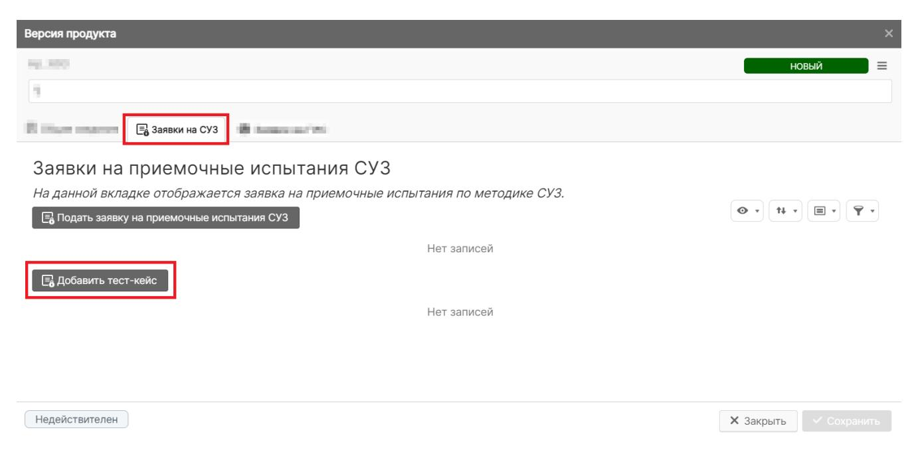

*Figure 83. Add test case button*

Clicking the **[ Add test case ]** button will open a modal window for settings of self-testing in which it will be necessary to fill in the fields:

• **"Goods groups"** — select the checkboxes for the goods groups that require testing. Selection of the goods group determines the testing method developed by the System Operator. A separate set of tests is created for each selected goods group.

To select all goods groups, select the checkbox next to the **"Search"** line;

**ATTENTION "(pharma) Medicines for medical use"** goods group cannot be selected

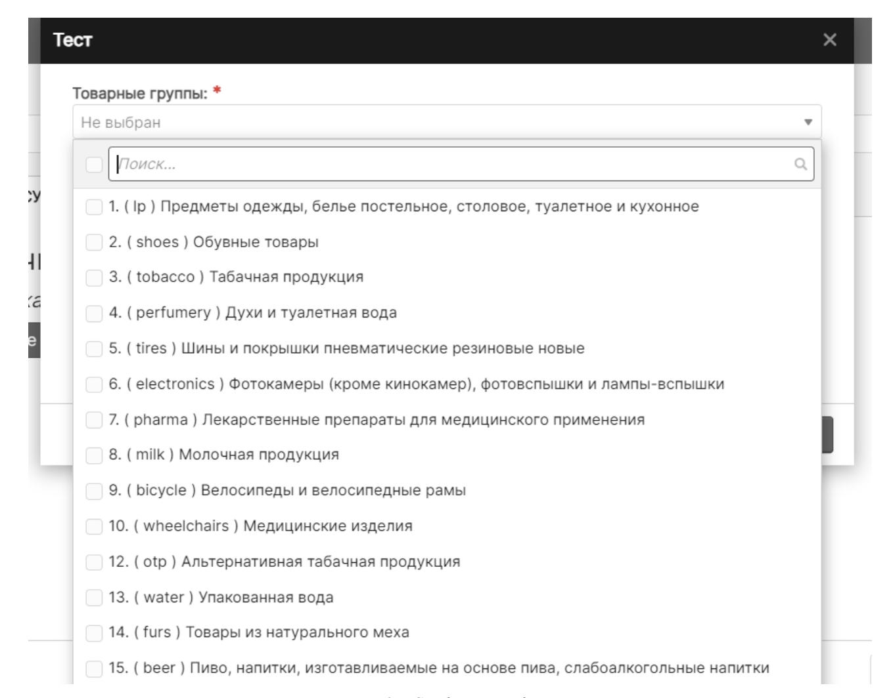

*Figure 84. Goods group selection*

• **"Determination"** — select the method which will be used to test an integration solution version from a list.

After clicking the **[ Save ]** button in the lower part of the window of the requests for the OMS acceptance tests, the tests which have **"Awaiting testing"** status will be created for each selected goods group. For more information about passing the test, see sections "[Description of test set](#page-78-0)" and ["Passing](#page-79-0) [a test set](#page-79-0)".

#### **Description of test set**

The interface of each set of tests contains the following functional areas (figure below):

- a test set status and a test process status (element 1);
- buttons to start the testing and to reject the request (element 2).

When selecting the **"Reject"**, it is necessary to fill in a mandatory field of input of the comment for the employees of the Operator support service. Once the request has been rejected, this test case cannot be returned to the work;

• tabs: **"Test"**, **"Comments"** (element 3).

The **"Test"** tab contains a test method name and a test method operation.

**"Comments"** tab contains a comment input field. Input of the comment is available at any stage of the life cycle of the test set;

- a description of the test method steps and the step control button (element 4);
- a list of the test method steps with progress indicators (element 5).

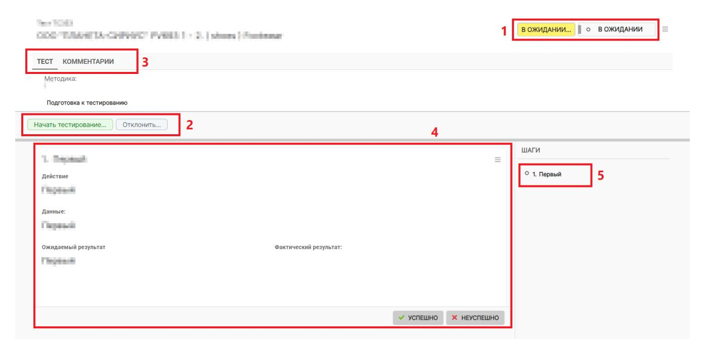

*Figure 85. Testing interface*

For more information on passing of the test, see the section "[Passing a test set"](#page-79-0).

#### **Passing a test set**

To pass a test set, you must do the following:

- go to the **"Test"** tab;
- enter a description of the actual results on the preparatory steps in the **"Actual results on items 1- 5"** field. Without filling in this field, you cannot go to the main test steps. When clicking the **[ Start testing ]** button, the following tooltip appears: **"Complete the preparations for testing and fill in the "Actual result" field"**;
- click the **[ Start testing ]** / **[ Continue testing ]** button and enter an authentication token in the opened modal window **"Fill in the specified data"** to switch a test set to **"In progress"** status. All further API requests performed as part of test cases shall be executed with the authentication token, which has been specified in the **"Fill in the specified data"** modal window.

*Figure 86. Start testing button*

An authentication token should be received in advance via True API (for all goods groups except "(pharma) Medicines for medical use") or via MDLP API (for the "(pharma) Medicines for medical use" goods group). API documentation is published in the user account in the production environment and in the knowledge base of the "Integrators Register".

The authentication token is valid for 10 hours. The token validity time counter is displayed in the upper right corner of the screen. If the testing lasts longer than the specified time, then if the time has been exceeded, a test set will automatically change its status to **"Suspended"**.

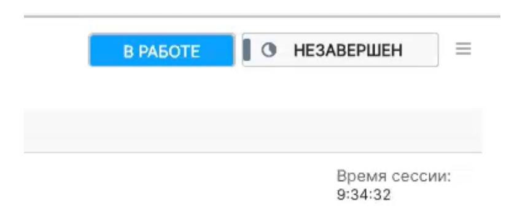

*Figure 87. Token lifetime*

If for any other goods groups there are test cases which have **"In progress"** status, the **[ Start testing ]** button will be unavailable;

- to go through the test steps, proceed as follows:
  - see the description of the next step in the **"Actions"**, **"Data"**, **"Expected result"** fields and perform the required actions;

Optional steps are marked as **"Optional"**;

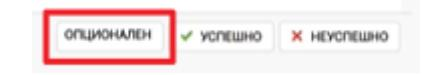

*Figure 88. Indication that a test is optional*

◦ enter the results of the current step of the test case in the **"Actual result"** field. The **"Action"** field contains information about a type of the information which must be indicated in the **"Actual result"** field (logs of API requests and responses or other data).

The **"Actual result"** field is available only if a test set has the **"In progress"** status;

◦ click the **[ Successful ]** button if an actual result has coincided with the expected one or **[ Failed ]** — if the results have not coincided.

The buttons are available only if a test set has **"In progress"** status.

If **" Failed"** value has been selected for a mandatory test step, a status of the test process will be changed to **"Not passed"**. In other cases, a status will accept the **"Unfinished"** value;

◦ go to the next step of the test method.

To quickly switch between the test method steps, select a test in the **"Steps"** list on the right side of the screen.

To suspend the testing, click the **[ Suspend ]** button in the upper right corner of the screen. In this case, a test process status will be changed to **"Postponed"**. To continue testing, click the **[ Continue testing ]** button.

• once all mandatory test method steps have been completed, click the **[ Complete ]** button to send testing results to the employees of the Operator's technical support service for verification. At the same time, a test set status is changed to **"Check"**, and a message about beginning of the request verification is sent to the contact person's email.

If a test case requires introduction of changes on the part of the counterparty, the Operator can send a request for revision. At the same time, a test set status is changed to **"Under improvement"**, and a message about sending the testing request for revision is sent to the contact person's email.

- once the Operator has checked that all test case steps are correct, a request status will be changed to **"Acceptance date approval"**. The Operator contacts the counterparty and agrees the date and time of the final acceptance of the test case by means of videoconference, and the request changes its status to **"Acceptance"**. During the acceptance, the following verification steps are demonstrated:
  - "Report on the usage is sent on the basis of the report on MC validation from equipment L3 (machine vision, scanner, etc.)" (mandatory);
  - "Only identification codes from SWRS are exported" (mandatory);
  - "Compliance with the rules relating to storage and use of the marking codes" (mandatory);
  - "Check of minimum balance on the GCP's personal account" *(optional)*;
  - "Automatic replenishment of MC reserves" *(optional)*;
  - "Control of marking code expiration date" *(optional)*.

In case if these steps require revision or correction on the part of the counterparty, the Operator sends a request for correction, and the test set changes its status to **"Pending correction"**. After making corrections, the counterparty translates the request into the **"Acceptance date approval"** status.

After successful acceptance a status of the tests process will change to **"Passed"**.

#### **Adding of trusted INN**

For product versions, which have received **"Admitted to the production environment"** status, trusted INNs can be added. Organizations, the INNs of which have been added as trusted ones, are able to use this version of the product with the same registration key (registrationKey), which was received for this product version as a result of the acceptance tests.

To add trusted INNs, proceed as follows:

- an organization, which adds trusted INNs, shall be registered in the Partners and Integrators Register with **"Goods circulation participant"** organization type (for more information, see "[Submission of request to change a list of activity types"](#page-24-0)). Other organization types are unacceptable;
- an organization, which adds trusted INNs, as well as added organization shall be registered with the TT GIS or MDLP FGIS in the goods groups corresponding to those specified in the product version tested by the Operator ("[Integration product registration"](#page-26-1)).

#### To add trusted INNs:

- go to **"My organization" › "Products"** section in the **"Main menu"**;
- in the **"Integration products"** block, go to a card of the product version in **"Admitted to the production environment"** status. To go to the card, click on a line with a version number;

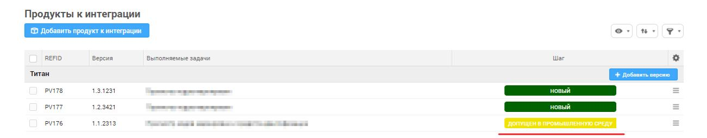

*Figure 89. Status of successfully tested version*

• in the version card on the **"General information"** tab, in **"Trusted inn"** block, click drop-down button , then click **[ + Trusted inn ]**. No more than 15 INN values can be added.

To remove a value, click a menu button in a line with deleted value, select **"Delete…"** and confirm the deletion in the dialog box.

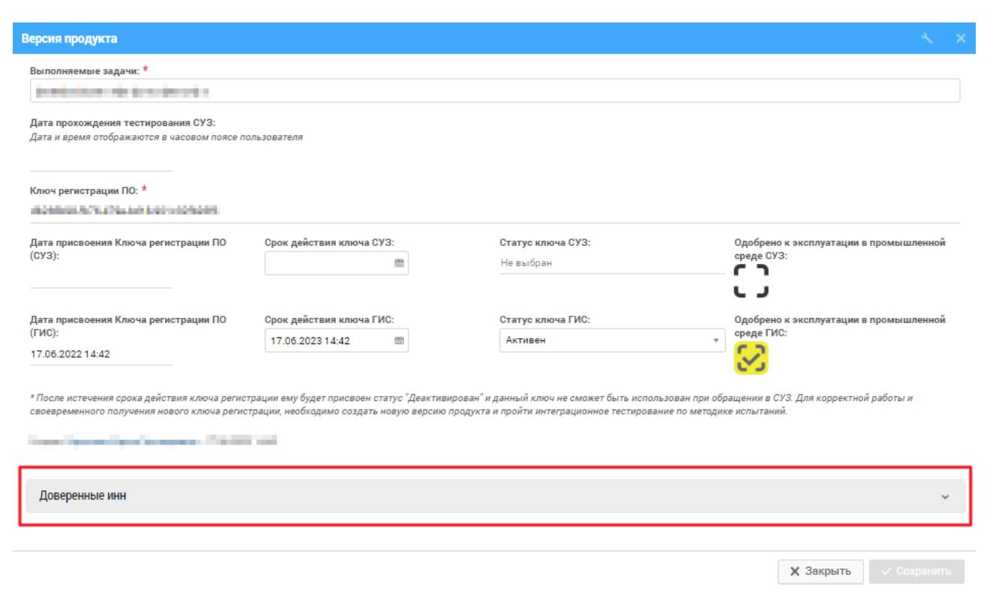

*Figure 90. A block to add trusted INNs*

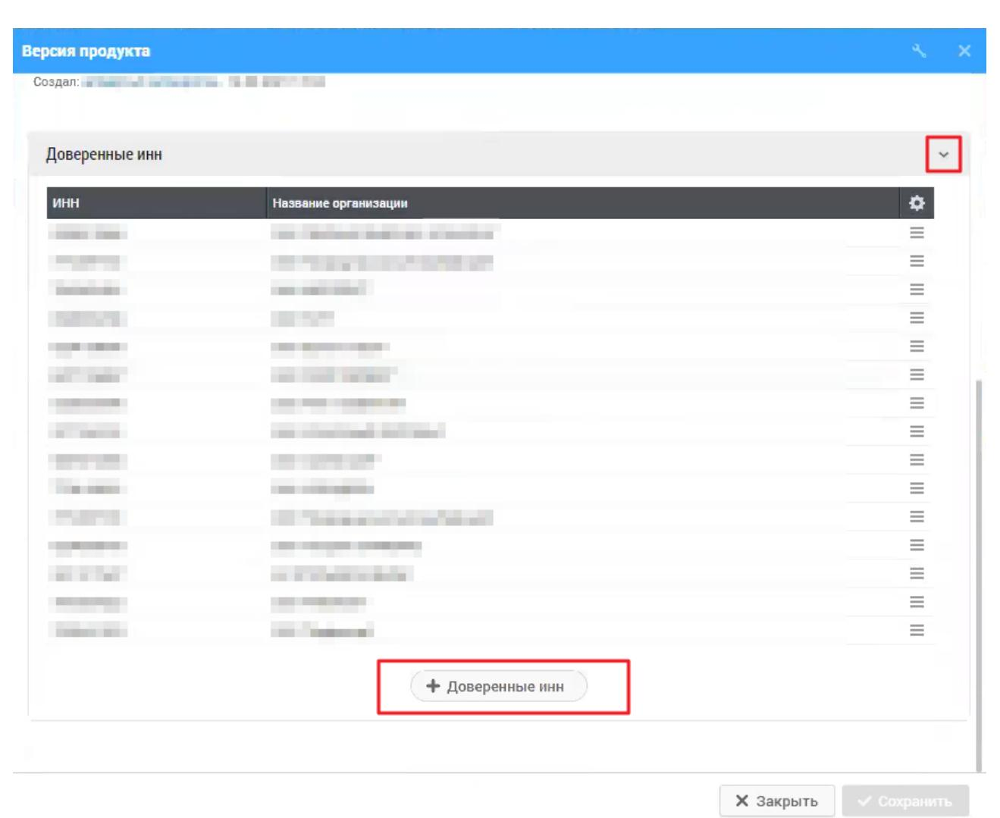

*Figure 91. A button to add trusted INNs*

• in the **"Product version"** modal window, fill in **"INN"** field and press Enter key, after which the **"Organization name"** field will be automatically filled in and confidentiality terms will be displayed. Familiarize yourself with the terms and select a checkbox in each item of the list, then click **[ Save ]** button.

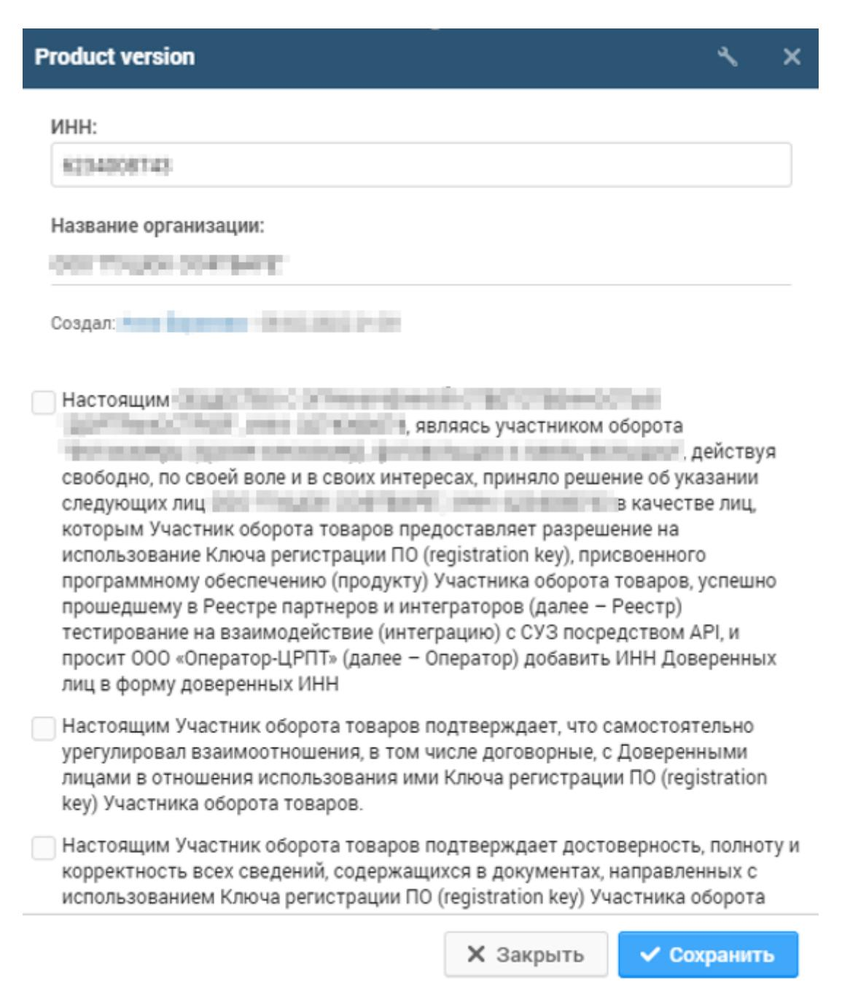

*Figure 92. A window to add organization to trusted list*

After monitoring of compliance with the criteria, the organization will be added to the list of trusted INNs.

#### **Partner solutions**

Work with the partner solutions is available in the Partners and Integrators Register to the organizations with **"Partner"**, **"Integrator"** and **"Service provider"** organization types.

To add new partner solution:

- go to **"My organization" › "Products"** section in the **"Main menu"**;
- in the **"Partner solutions"** block, click **[ Add partner solution ]** button;

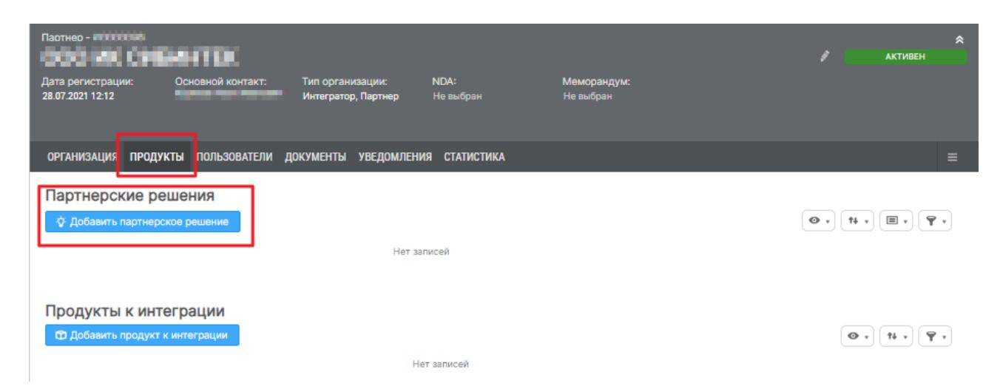

*Figure 93. Location of the button to add partner solution*

If the button has not appeared during the day after registration of the organization in the Partners and Integrators Register, please contact the Technical Support Service by sending an email to [partners@crpt.ru](mailto:partners@crpt.ru) with a copy to [integrators@crpt.ru.](mailto:integrators@crpt.ru)

- in a **"Product details"** modal window, fill out entry fields (mandatory fields are marked with a red asterisk):
  - **"Enter product name"** specify a product name by means of direct input;

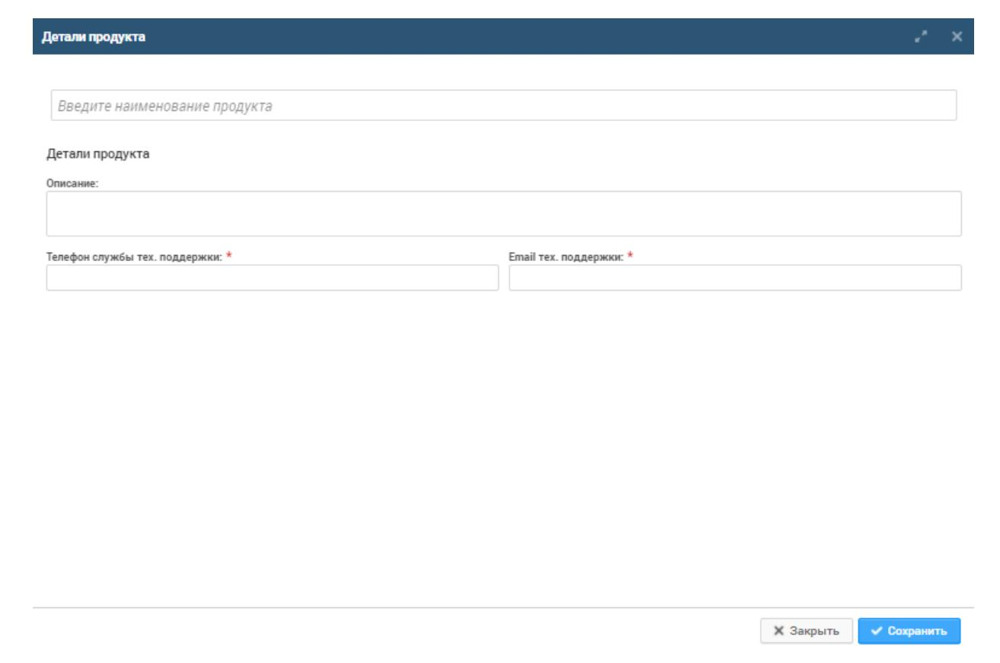

*Figure 94. A modal window to describe product details*

- **"Description"** specify a description of the product by means of direct input (point out competitive advantages and key features of the product);
- **"Phone number of the Technical Support Service"** specify a phone number, which can be used by goods circulation participants of the MDLP FGIS or TT GIS to contact the technical support service of the product;
- **"Email of the Technical Support Service"** specify email, which can be used by goods circulation participants of the MDLP FGIS or TT GIS to contact the technical support service of the product;
- click **[ Save ]** button to save the changes.

After adding a product, it will change its status to **"New"** and will be considered by the Operator. After checking that the product correctly interacts with the TT GIS or MDLP FGIS, the Operator changes a status of the product to **"Confirmed"**, and a questionnaire on product becomes available to a partner (for more information, see section "[Filling out a questionnaire on product](#page-86-0)").

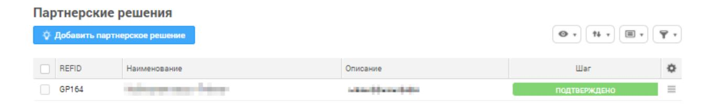

*Figure 95. Confirmed partner product*

- once the questionnaire has been filled in (for more information, see section "[Filling out a](#page-86-0) [questionnaire on product](#page-86-0)") and its correctness has been confirmed by the Operator, familiarize yourself and sign mandatory documents published by the Operator in the **"My organization" › "Documents"** section (for more information, see section ["Document signing"](#page-94-0)):
  - Declaration;
  - Application to enter into a Memorandum;
  - NDA.

#### **Filling out a questionnaire on product**

To fill in a product registration questionnaire:

• in the **"My organization" › "Documents"** section and click **[ Fill in a questionnaire ]** button.

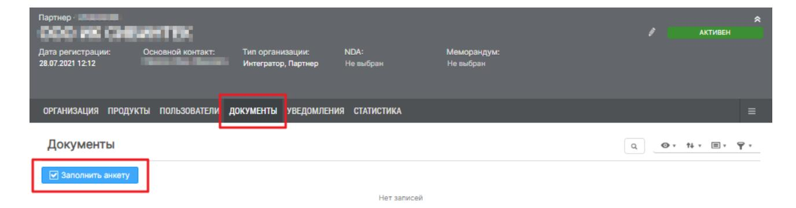

*Figure 96. Switch to filling in a questionnaire*

- in the **"Questionnaire"** modal window, fill in data entry fields (mandatory fields are marked with a red asterisk) and click **[ Save ]** button:
  - **"In what segments are your solutions used?"** select the check boxes next to the relevant segments (**"Wholesale"**, **"Retail"**, **"HORECA"**, **"Filling stations"**, **"Pharma"**, **"Manufacture"**, **"Networks"** and/or **"Other"**);

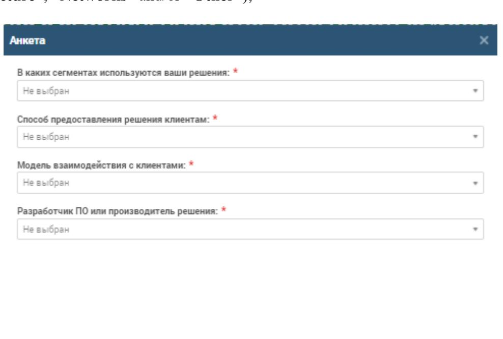

*Figure 97. Questionnaire*

- **"Other"** (available only if **"Other"** value is selected in the **"In what segments are your solutions used?"** field) — fill in by means of direct input. Length of value — no more than 40 characters;
- **"A way of providing solution to customers"** (**"Cloud Software"**, **"Local Software"** and/or **"Other"**);
- **"Other"** (available only if **"Other"** value is selected in the **"A way of providing solutions to customers"** field) — fill in by means of direct input. Length of value — no more than 40 characters;
- **"Model of interaction with customers"** (**"Direct interaction"**, **"Via partners"** and/or **"Mixed"**);
- **"Software developer or solution manufacturer"** (**"Self-developed software"**, **"Software developed by partner"**, **"Self-developed equipment"** and/or **"Equipment developed by partner"**).

Once the questionnaire has been filled in, the questionnaire changes its status to **"Awaiting confirmation"**. After the questionnaire has been confirmed by the Operator, it changes its status to **"Confirmed"**.

### **Editing user data**

In addition to the primary contact, information on which is submitted to the system at the stage of creation of registration request (see section "[Creation of registration request](#page-6-0)"), information on additional users and contact persons can be submitted in the organization card.

Users of the Partners and Integrators Register are persons who are allowed to log in to the system.

Contact persons are employees of the organization without the right to log in to the system to which the technical support service of the Operator may turn to for information related to the activities of the organization within the Partners and Integrators Register.

To add a new user and/or contact person:

- go to **"My organization"** section in the **"Main menu"**;
- on the **"Organization"** tab in the **"Contacts"** block, click the button ;

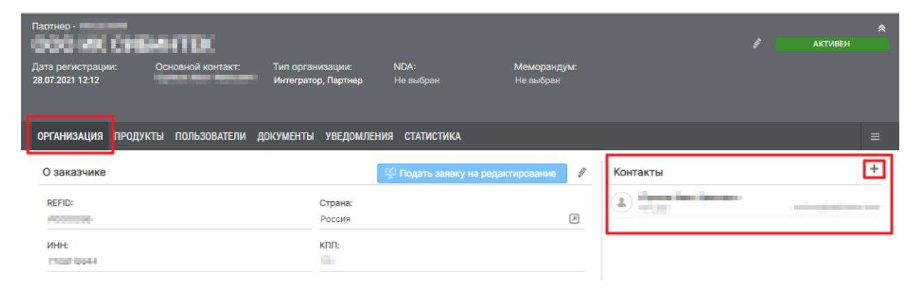

*Figure 98. Placement of button to add users and contact persons*

- fill in **"Contacts"** form fields (mandatory fields are marked with a red asterisk):
  - **"Created contact will be IR user"** activate by moving the switch in the (on) mode (if necessary).

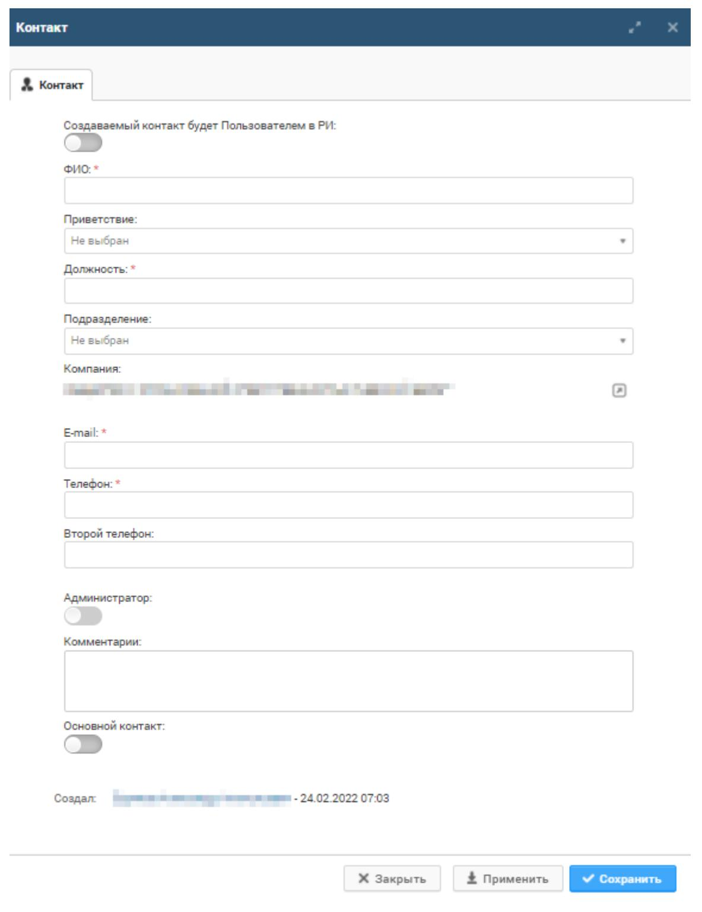

*Figure 99. A modal window to add users and contact persons*

If it is activated, an added employee of the organization will be registered as a user of the Partners and Integrators Register with logon rights. A user account will be automatically generated based on the form data and a notification with access data will be sent to the email specified (only for the organization in **"Active"** status). Not more than three users can be created for one organization. A list of the system users can be viewed in the section **"My organization" › "Users"**.

If the value is not in (on) mode, the employee to be added will be registered as a contact person without access to the system.

- **"Full name"** enter last name, first name and patronymic of the employee by means of direct input;
- **"Salutation"** select a value of **"Dear Sir"** / **"Dear Madam"**;
- **"Position"** specify a value by means of direct input;
- **"Division"** optional field;
- **"E-mail"** specify email by means of direct input. The email will be used in the Partners and Integrators Register to send a notification on account creation and with data on login and password. This email will be specified as the user's login to log in to the system;
- **"Phone number"**;
- **"Second phone number"**;
- **"Administrator"** to assign a user to administrator role, it is necessary to set a switch in the (on) mode (this option will be blocked if a switch **"Created contact will be IR user"** is in (off) mode).

When an organization is registered with the Partners and Integrators Register, organization login details will be sent to email of the user with administrator rights.

- **"Comments"** fill in with arbitrary text;
- **"Primary contact"** to assign a user to main primary contact, it is necessary to set a switch in the (on) mode;
- click **[ Save ]** button to save the changes and to add the user.

Added users will be displayed in the user list on the **"Organization"** tab, as well as on the **"Users"** tab.

## **Work with documents**

This section describes peculiarities of submission and signing of different documents (which relate to activities of the organization within the Partners and Integrators Register) published by the Operator in the section **"My organization" › "Documents"**.

More information on correspondence between documents and organization types can be found in "[Table of correspondence between document mandatory and organization types](#page-92-0)".

For more information on document signing, see section ["Document signing"](#page-94-0).

For more information on how to fill in documents to connect a Service provider, see ["Filling out a](#page-99-0) [questionnaire to connect a Service Provider"](#page-99-0) and "[Submission of application for Soft and Hardware](#page-101-0) [Package Contract](#page-101-0)".

For more information on how to fill in a questionnaire on product, see "[Filling out a questionnaire on](#page-86-0)

#### [product"](#page-86-0).

#### **Table of correspondence between document mandatory and organization types**

Fully-featured work in the Partners and Integrators Register requires signing a number of documents corresponding to the organization type. The table of correspondence between document mandatory and organization types can be found below.

| Organization type                | Document name                                | Document type | Signing method                                        | Comment                                     |
|----------------------------------|----------------------------------------------|---------------|-------------------------------------------------------|---------------------------------------------|
| Goods circulation participant | No mandatory documents for signature         |               |                                                       |                                             |
| Integrator                       | NDA                                          | Electronic    | Signing with EQES in the user account              | Mandatory for operation in the system |
|                                  |                                              | Paper         | Added by the Operator                              | Mandatory for operation in the system |
|                                  | Application to enter into a Memorandum | Electronic    | Signing with EQES in the user account              | Mandatory for operation in the system |
|                                  |                                              | Paper         | Added by the Operator                              | Mandatory for operation in the system |
|                                  | Declaration on products and solutions  | Electronic    | Filling out in the user account without signing | Mandatory for operation in the system |

| Organization type          | Document name                                            | Document type | Signing method                                                           | Comment                                           |
|----------------------------|----------------------------------------------------------|---------------|--------------------------------------------------------------------------|---------------------------------------------------|
| Partner                    | NDA                                                      | Electronic    | Signing with EQES in the user account                                 | Mandatory for operation in the system       |
|                            |                                                          | Paper         | Added by the Operator                                                 | Mandatory for operation in the system       |
|                            | Application to enter into a Memorandum             | Electronic    | Signing with EQES in the user account                                 | Mandatory for operation in the system       |
|                            |                                                          | Paper         | Added by the Operator                                                 | Mandatory for operation in the system       |
|                            | Declaration on products and solutions              | Electronic    | Filling out in the user account without signing                    | Mandatory for operation in the system       |
| Service provider           | Application for Soft and Hardware Package Contract | Electronic    | Signing with EQES in the user account                                 | Mandatory for operation in the system       |
|                            | Soft and Hardware Package Contract                    | Electronic    | Signing with EQES in the user account                                 | Mandatory for operation in the system       |
| Self-employed developer | Consent to personal data processing                | Paper         | Enters the system after registration, attached by a participant | Hard copy shall be sent to CRPT for storage |
|                            | NDA                                                      | Paper         | Added by the Operator                                                 | Mandatory for operation in the system       |
|                            | Application to enter into a Memorandum             | Paper         | Added by the Operator                                                 | Mandatory for operation in the system       |

| Organization type                            | Document name                                | Document type | Signing method                                        | Comment                                     |
|----------------------------------------------|----------------------------------------------|---------------|-------------------------------------------------------|---------------------------------------------|
| Combination of types: Integrator,      | NDA                                          | Electronic    | Signing with EQES in the user account              | Mandatory for operation in the system |
| Partner, Goods circulation participant |                                              | Paper         | Added by the Operator                              | Mandatory for operation in the system |
|                                              | Application to enter into a Memorandum | Electronic    | Signing with EQES in the user account              | Mandatory for operation in the system |
|                                              |                                              | Paper         | Added by the Operator                              | Mandatory for operation in the system |
|                                              | Declaration on products and solutions  | Electronic    | Filling out in the user account without signing | Mandatory for operation in the system |

#### **Document signing**

To sign a document, proceed as follows:

- go to **"My organization" › "Documents"** section in the **"Main menu"**;
- click a line with the document requiring signature (such documents are displayed with the **"Familiarization"** mark in the **"Step"** column);
- familiarize yourself with the document content in the document view window;
- if there is a button **[ Read Memorandum ]** on the sidebar (it is relevant only for the "Application to enter into a Memorandum" document), download the Memorandum and familiarize yourself with its text;
- if there is a **"Responsible persons under the contract"** block in the sidebar (relevant only for the NDA document), add information on the persons responsible under the contract.

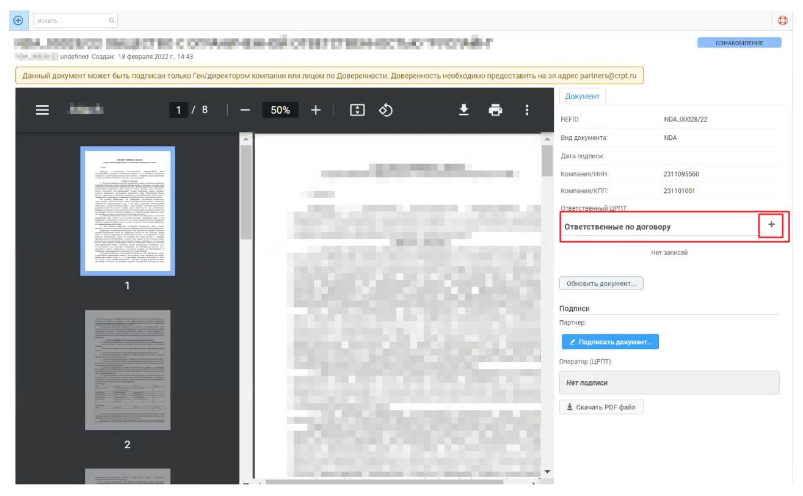

*Figure 100. Placement of the block to add responsible persons under the contract*

To add responsible persons under the contract:

- click the button ;
- fill in the fields of the **"Person responsible under NDA"** modal window by specifying data of the employee responsible under the contract (**"Full name"**, **"Position"**, **"Phone number"**, **"Email"**);
- click the **[ Save ]** button.

The added data on the employee will be displayed in the **"Responsible persons under the contract"** block in the sidebar.

◦ repeat these actions as many times as necessary to indicate all responsible employees under the contract.

If the **"Responsible persons under the contract"** block is not filled in, a warming about necessity to fill it in will be displayed when attempting to sign the document.

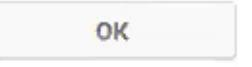

*Figure 101. Document signing error message*

After the specified warning appears, fill in the required data, then click **[ Update document… ]** button to update the text of the document. If at the moment of the signing, a text of the document has not been updated (**[ Update document… ]** button was not clicked), a warning on the need to updated a document will be displayed.

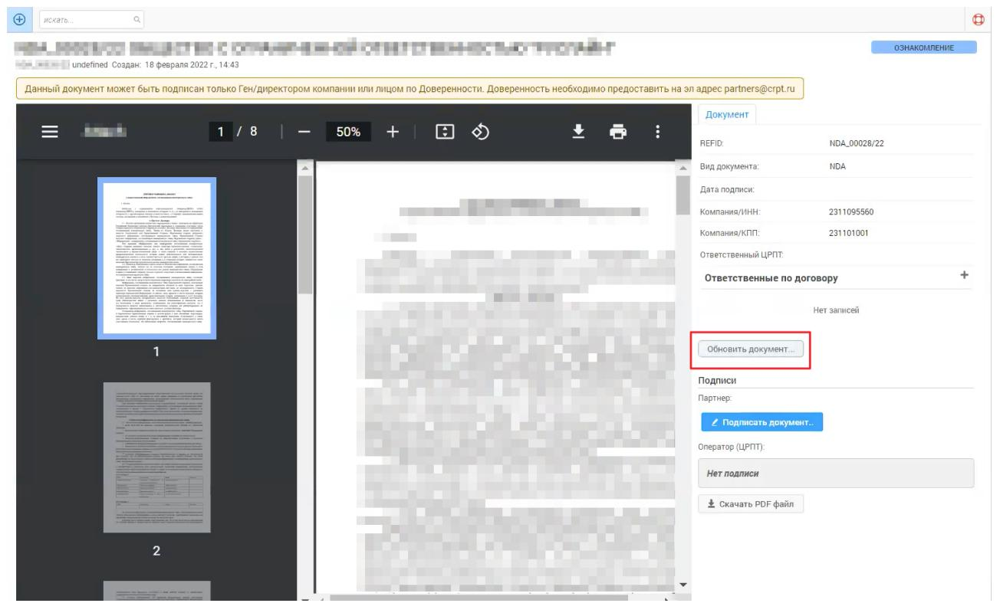

*Figure 102. A button to update a document*

• click **[ Sign document… ]** button on the sidebar.

To download the document, click **[ Download PDF file ]** button.

• select EQES certificate in the modal window of the document signing and click the **[ Sign document ]** button.

A user who has authority to sign electronic documents on behalf of a company should enter the number of the machine-readable PoA (issued in FTS) in the corresponding field. When signing is carried out by Director General of the organization, there is no need to enter the number of the machine-readable PoA.

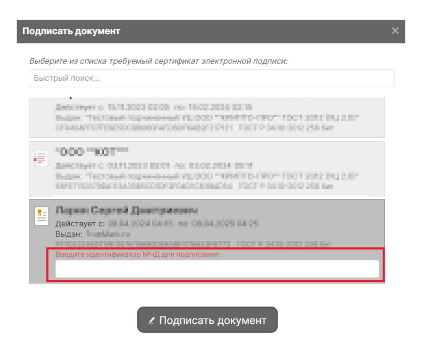

*Figure 103. A modal window with a field to enter an identifier of the machine-readable PoA for signature*

During selection of the certificate for document signing, EQES is checked for compliance with the requirements.

In case of non-compliance of EQES, an information message with reasons for not complying will be displayed in the **"Sign document"** modal window. Information messages are of a warning nature and they do not limit the signature and do not block the signing process:

- **"Document cannot be signed by a test certificate"**;
- **"Certificate was revoked"**;
- **"Certificate does not contain INN"**;
- **"Organization name in the certificate does not correspond to one specified in the system"**;
- **"INN specified in the certificate does not correspond to one specified in the system"**;
- **"Director General specified in the certificate does not correspond to one specified in the system"**;
- **"Certificate authentication error: certificate chain cannot be established. It is possible that a certificate has been issued by un-trusted certification authority"**;
- **"Certificate expired"** (signing is unavailable).

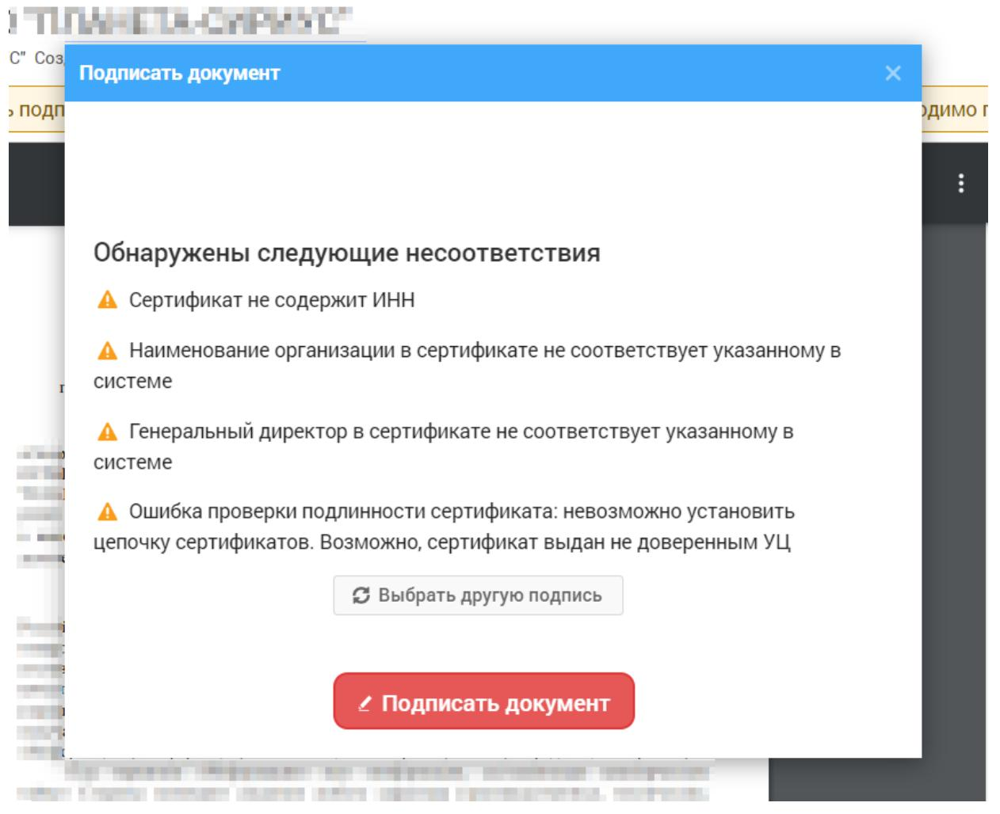

*Figure 104. Modal window with warning information on EQES non-conformity*

A signed document will be displayed in the **"Documents"** tab in the **"Step"** column with **"Under consideration"** mark;

- wait for the document to become **"Signed"** (the corresponding mark will be displayed in the **"Step"** column) after checking the correctness of the signature and receiving confirmation from the Operator;
- If errors are detected when signing the document, the document will be returned to the **"Familiarization"** status with the display of the return reason in the **"Reason for rejection/return"** column.

#### In this case:

- make the required adjustments;
- open the document in a modal window to view documents;
- click **[ Update document… ]** button;
- sign the document by sending it for a repeated check.

#### **Filling out a questionnaire to connect a Service Provider**

To fill out a questionnaire to connect a Service Provider:

• in the **"My organization" › "Documents"** section click **[ Fill in a questionnaire ]** button;

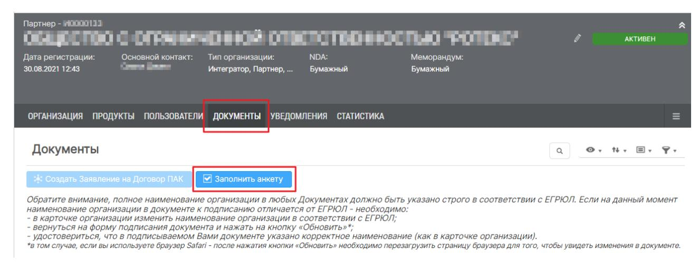

*Figure 105. Placement of the button to switch to fill in questionnaire*

- in the **"Questionnaire on verification of Service provider equipment for compliance with technical specifications"** modal window, fill in data entry fields (mandatory fields are marked with a red asterisk) and click **[ Save ]** button:
  - **"Printing equipment system for production of package/label"** select a value from the drop-down list:
    - **"Intaglio printing machine"**;
    - **"Offset printing machine"**;
    - **"Screen printing machine"**;
    - **"Flexographic printing machine"**;
    - **"Combined printing machine"**;
    - **"Digital printing machine"**;
    - **"Other"**.

If this value is selected, fill in the additional mandatory field **"Other"** with an arbitrary value.

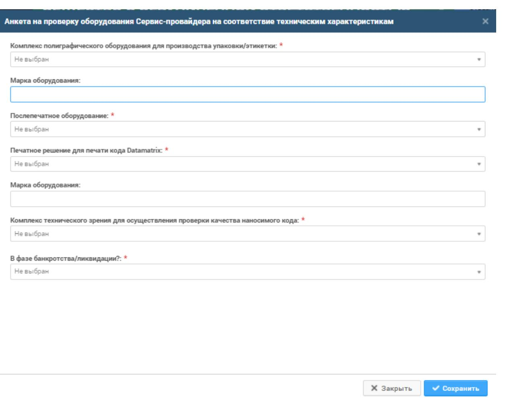

*Figure 106. Questionnaire on verification of equipment*

- **"Equipment brand"** specify by means of direct input a brand of the printing equipment system for production of package/label;
- **"Post-printing machinery"** select a value from the drop-down list:
  - **"Cutting machine"**;
  - **"Lamination machine"**;
  - **"Folding machine"**;
  - **"Varnishing machine"**;
  - **"Bending machine"**;
  - **"Pressing machine"**;
  - **"Die cutting machine"**;
  - **"Other"**.

If this value is selected, fill in the additional mandatory field **"Other"** with an arbitrary value.

◦ **"Printing solution for printing of Datamatrix code"** — select a value from the drop-down list;

- **"DOD technique (jet, by separate module)"**;
- **"Laser printing"**;
- **"Thermal transfer"**;
- **"Thermal spray"**;
- **"Bubble jet"**;
- **"Digital printing"**;
- **"Other"**.

If this value is selected, fill in the additional mandatory field **"Other"** with an arbitrary value.

- **"Equipment brand"** specify by means of direct input a brand of the post-printing machinery;
- **"Technical vision system for quality checking of applied code"** select **"Yes"** / **"No"**.

If **"Yes"** value is selected, fill in **"Equipment brand"** additional field by indicating a brand of the technical vision system by means of direct input;

◦ **"In bankruptcy/liquidation phase?"** — select **"Yes"** / **"No"**.

Once editing has been completed, the questionnaire changes its status to **"Awaiting confirmation"**. Once the Operator has checked the data specified, the questionnaire will change its status to **"confirmed"**, then a possibility to create an application for Soft and Hardware Package Contract will be available (for more information, see section ["Submission of application for Soft and Hardware](#page-101-0) [Package Contract](#page-101-0)").

#### **Submission of application for Soft and Hardware Package Contract**

To create an application for Soft and Hardware Package Contract:

• in the **"My organization" › "Documents"** section click **[ Create application for Soft and Hardware Package Contract ]** button;

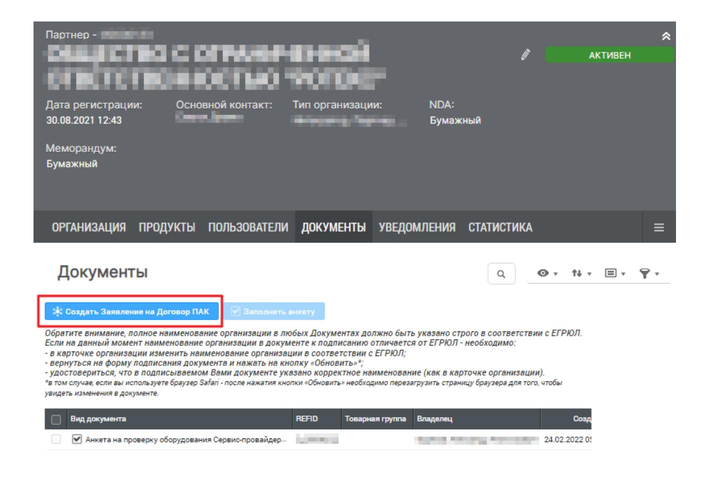

*Figure 107. Placement of the button to switch to application creation*

• in the **"Document Card"** modal window, click the **[ Save ]** button - the application will change its status to **"Generation"** for the time of automatic creation, then it will change the status to **"Familiarization"**;

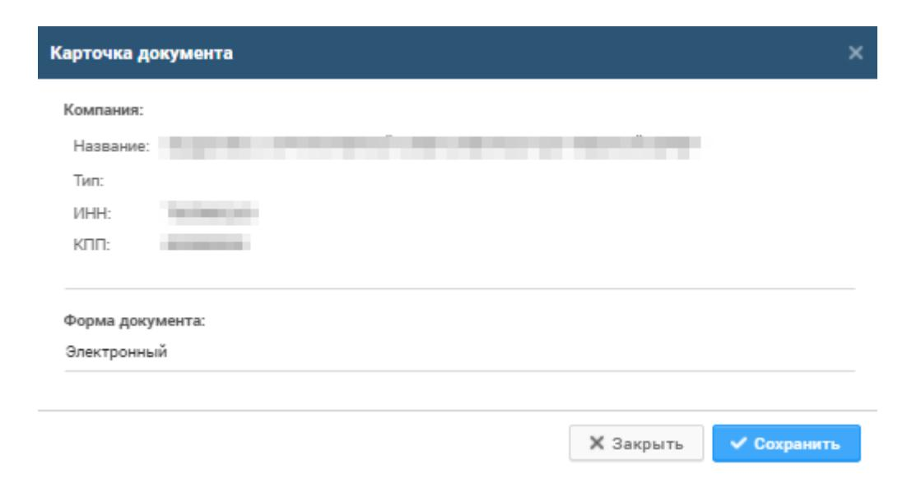

*Figure 108. A window of confirmation of application creation*

• switch to a window of the document viewing by clicking on the line of the application in the list of documents and sign the document with the EQES certificate, selecting the **[ Sign document… ]** button (for more information, see section "[Document signing"](#page-94-0));

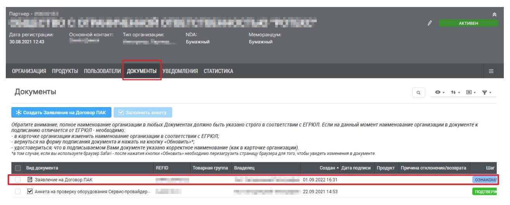

*Figure 109. A switch to view application*

• once the document has been approved by the Operator and has been verified by the Security Service, the document will change its status to **"Signed"**, and a Soft and Hardware Package Contract in the **"Familiarization"** status will appear in the document list. Switch to a window of the document viewing by clicking on the line with the contract, familiarize yourself and sign the document with the EQES certificate, selecting the **[ Sign document… ]** button.

Once the contract has been also signed by the Operator, the document will change its status to **"Signed"**, and an organization profile will change its status to **"Active"**, after which the information about the organization will be added to the list of service providers in the OMS user interface.

**ATTENTION**

If the organization's legal address changes, the contract must be signed again. The contract will be generated automatically.

After signing the contract, you will receive a notification from the Operator with the individual identifier (UUID) to work in the OMS. The identifier is also available in the **"Organization"** tab in the "UUID for SUZ" field (see section "[Organization card interface"](#page-19-1))

## **Viewing notifications**

This section contains notifications sent by the Operator to notify a user of the Register. Each notification is also sent to email of the primary contact of the organization specified during registration (see section "[Creation of registration request](#page-6-0)").

For the full text of the notification:

• go to **"My organization" › "Notifications"** section in the **"Main menu"**;

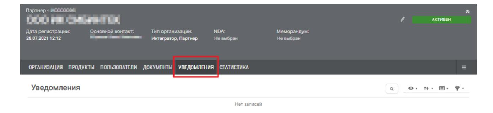

*Figure 110. Placement of notifications in the Partners and Integrators Register*

When a notification is received by the organization, it is displayed in the list of notifications on the **"Notifications"** tab in the **"On familiarization"** status.

• click on the notification line and go to the modal window to view notification;

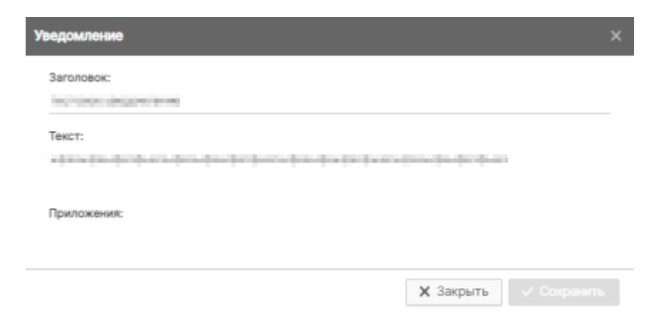

*Figure 111. Modal window to view notification*

• familiarize yourself with the information message, then click the **[ Familiarized ]** button to notify the Operator about the reading and change the status of the notification to **"Read"**.

## **Viewing statistics of integration products usage**

This section contains information on installations of the integration solutions by the goods circulation participants. To switch to the section, select **"My organization" › "Statistics"** section in the **"Main menu"**.

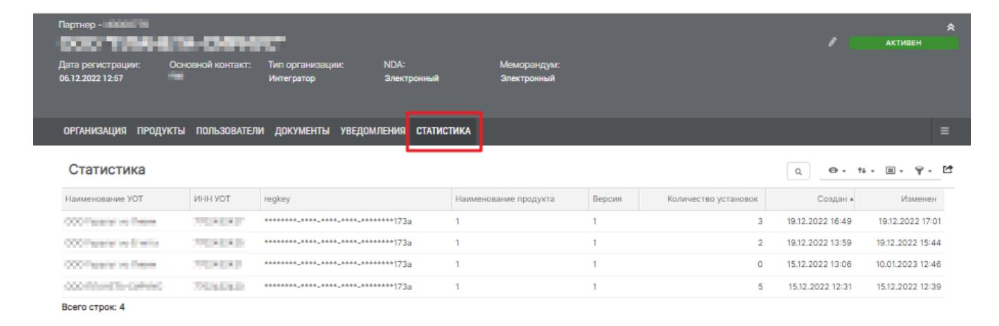

*Figure 112. Statistics of installations of the integration solution*

The tab contains a table with information about installations of the integration solutions. If an organization has not registered any integration solution, the table is not displayed (the **"Statistics"** tab will be empty). The table contains the following information:

- name of a goods circulation participant using the integration solution;
- INN of the goods circulation participant;
- the last four symbols of the registration key of the integration solution;
- integration solution version;
- number of installations of the solution by a goods circulation participant.

To download the table, click the icon in the right upper corner of the table and select **"Export of the table to file"** item. Set the export settings (format and displayed fields) in the opened modal window and click the **[ Export ]** button.

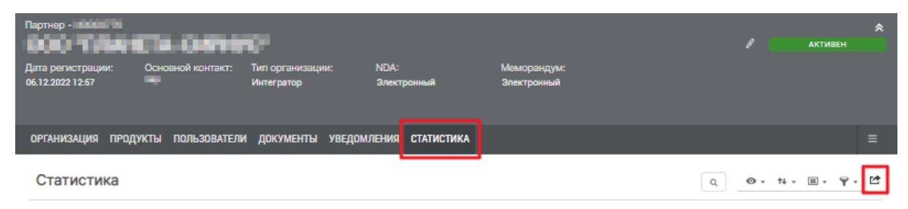

*Figure 113. Table export button*

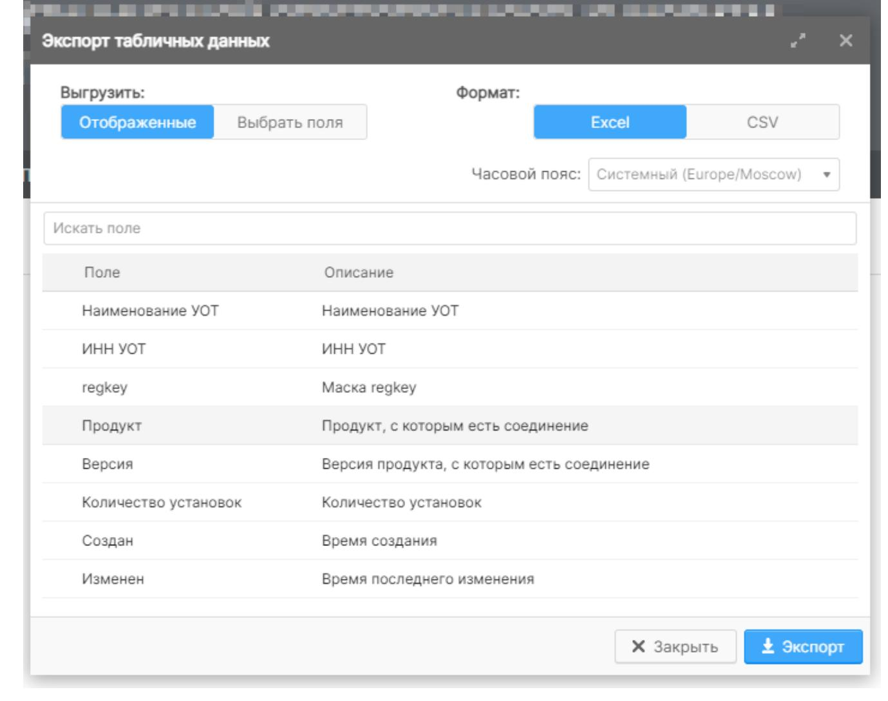

*Figure 114. Modal window of export settings*

## **Work with tasks from the Operator**

Within the Partners and Integrators Register, the Operator can create tasks for individual organizations registered with the register. An example of such interaction can be a requirement to develop mandatory updates for a software or partner solutions required to work with the marked products. Upon receipt of the task, an organization may start work on the task or refuse to improve with indication of the rejection reason.

Once a new task has been created by the Operator and it has received a **"Under assessment"** status, a primary contact of the organization will be notified of the new task with a link for viewing the task in the user account of the Partners and Integrators Register.

To work with the task:

• in the **"Main menu"** in the **"Tasks"** block, switch to the **"Open"** section or in the **"All"** section;

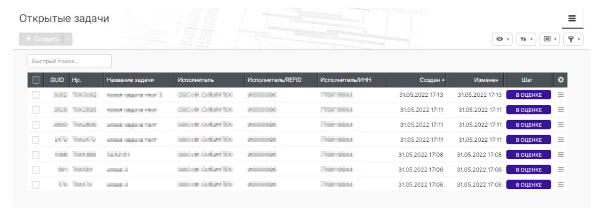

*Figure 115. Open tasks*

• click on the task line and go to view the task card;

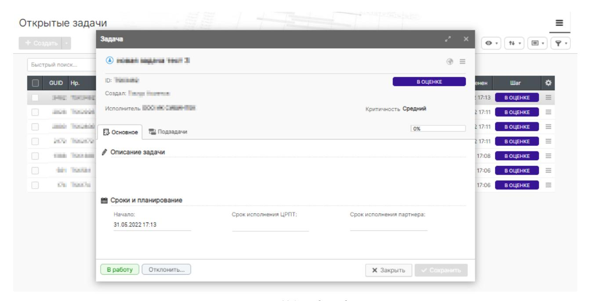

*Figure 116. Task card*

• once you have familiarized yourself with a task description on the **"Main information"** tab (**"Task description"** field), as well as with deadlines (**"Timing and planning"** block) and priority (**"Criticality"** field), it is necessary to start work on the task by clicking the **[ Start work ]** button, or reject the task by clicking **[ Reject ]** button and indicate a reason for rejection in the **"Comments"** field.

Once you have started to work on the task, the task will change its status to **"In process"**.

In case of rejection, the task will change a status to **"Rejected"** and will be moved to **"Canceled"** section.

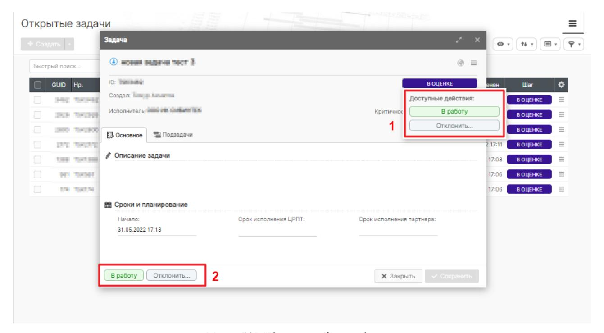

*Figure 117. Placement of action buttons*

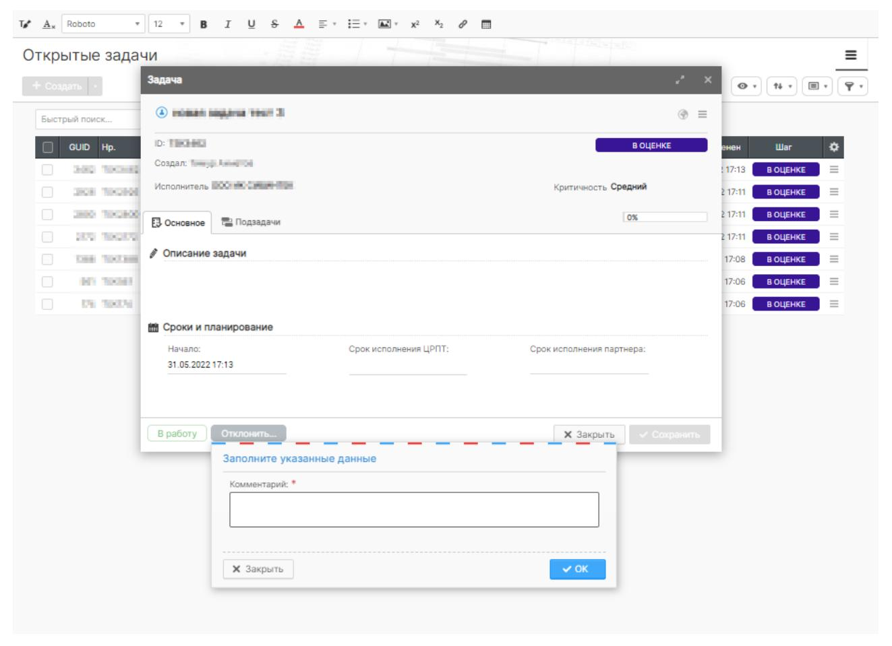

*Figure 118. Indication of rejection reason*

• to view related subtasks, it is necessary to switch to the **"Subtasks"** tab from the task card and then click the icon in the line with a subtask name. Features of the subtask card are the same as the features of the parent task card. To return to the task of the parent card, click **[ Close ]** button.

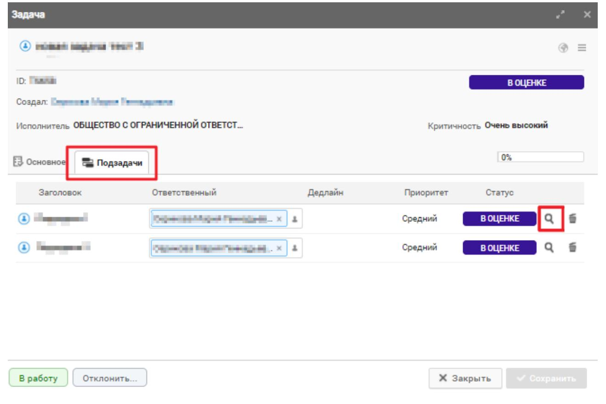

*Figure 119. A button to view a subtask*

• after completion of the work on task, it is necessary to send the task for verification by clicking **[ To verification ]** button in the action block in the lower part of the task card or by clicking on the task status. The task will change its status to **"Under verification"** to receive a confirmation from the Operator.

In case of inaccuracies, the Operator can return the task for correction actions with indication of the rejection reason. In this case, the task is displayed in the user account of the Partners and Integrators Register with **"Under improvement"** status, and a primary contact of the organization will be notified of the rejection reason. In this case, to accept the task for improvement, click the **[ In process ]** button, and after correcting the comments, send the task to the Operator for repeated checking.

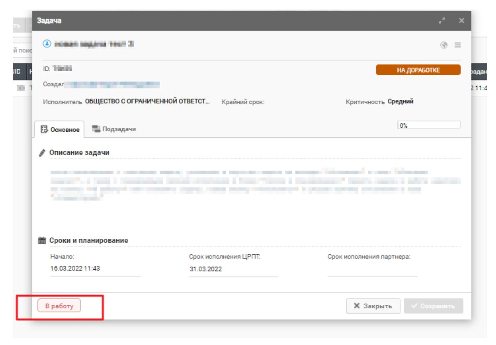

*Figure 120. Acceptance of the task for improvement*

### **Statistics**

Within the Partners and Integrators Register, organizations with **"Fiscal data operator"**, **"Electronic document management operator"** and **"Operator of the Order Management Station"** activity types can view statistics on exchange of the information with the FDO (for more details, see "[Statistics](#page-110-1) [on FDO](#page-110-1)"), EDM operators (for more details, see ["Statistics on EDM](#page-112-0)") and OMS operators (for more details, see ["Statistics on OMS](#page-114-0)").

### **Statistics on FDO**

To view statistics on FDO:

• in the **"Main menu"**, **"Reporting"** block, switch to the **"FDO"** section;

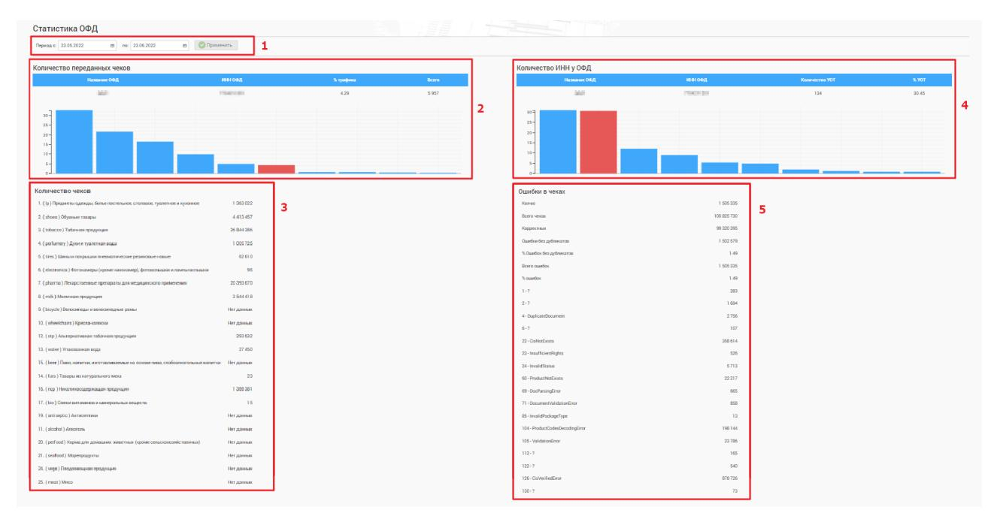

*Figure 121. FDO reporting*

• in a block of configuration of the data export period (element 1 in figure), set start and end dates (inclusive) of the period by clicking icons in the corresponding fields, then click **[ Apply ]** button. Data export period shall not exceed 93 calendar days. By default, the export is made for the last month.

The following information is available in the uploaded data export:

- **"Number of transferred receipts"** displays information on distribution of the total number of the receipts (received by the TT GIS, MDLP FGIS and "Marking information resource") by all FDOs (element 2). Information on the number of the receipts transferred from the current operator is displayed in the table part of the block in relative (**"% of traffic"** column) and absolute (**"Total"** column) values, as well as is marked as red column on the histogram;
- **"Number of receipts"** table contains information on distribution of the number of the receipts transferred to the TT GIS, MDLP FGIS, and "Marking information resource" by the current operator in line with the goods groups (element 3).
- **"Number of FDO's INNs"** displays information on distribution of the general number of the goods circulation participants (which transfer documents to the TT GIS, MDLP FGIS and "Marking information resource") by all FDOs (element 4). Information on the number of the circulation participants, which transfer data through the current operator, is displayed in the table part of the block in absolute (**"GCP number"** column) and relative (**"% of GCPs"** column) values, as well as is marked as red column on the histogram;
- **"Errors in receipts"** information is displayed in tabular form on recorded errors in processing of the receipts received by the TT GIS, MDLP FGIS and "Marking information resource" from the current FDO:

- **"Quantity"** number of the receipts processed with errors;
- **"Total number of receipts"** number of the received receipts;
- **"Correct"** number of the receipts processed correctly;
- **"Errors w/o duplicates"** number of the receipts processed with errors excluding receipts with error "4 — DuplicateDocument: Document <document's identifier> has already been registered";
- **"% of errors w/o duplicates"** a percentage of the receipts processed with errors (excluding receipts with error "4 — DuplicateDocument: Document <document's identifier> has already been registered") from the total number of the received receipts;
- **"Total number of errors"** number of the receipts processed with errors (a value coincides with the **"Quantity"** field);
- **"% of errors"** a percentage of the receipts processed with errors from the total number of the received receipts;
- distribution of the number of the receipts processed with errors by error types (for description of errors presented, see ["Description of errors of document processing in the user account and via](https://честныйзнак.рф/business/doc/?id=Инструкция_по_возникающим_ошибкам.html) [API"\)](https://честныйзнак.рф/business/doc/?id=Инструкция_по_возникающим_ошибкам.html).

#### **Statistics on EDM**

To view statistics on EDM:

• in the **"Main menu"**, **"Reporting"** block, switch to the **"EDM"** section;

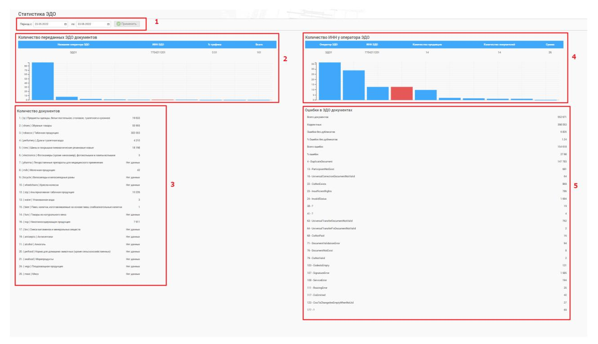

*Figure 122. EDM reporting*

• in a block of configuration of the data export period (element 1 in figure), set start and end dates (inclusive) of the period by clicking icons in the corresponding fields, then click **[ Apply ]** button. Data export period shall not exceed 185 calendar days. By default, the export is made for the last month.

The following information is available in the uploaded data export:

- **"Number of transferred EDM documents"** displays information on distribution of the total number of the EDM documents (received by the TT GIS, MDLP FGIS and "Marking information resource") by all EDM operators (element 2). Information on the number of the documents received from the current operator is displayed in the table part of the block in relative (**"% of traffic"** column) and absolute (**"Total"** column) values, as well as is marked as red column on the histogram;
- **"Number of documents"** table contains information on distribution of the number of the documents received by the TT GIS, MDLP FGIS, and "Marking information resource" from the current EDM operator in line with the goods groups (element 3).
- **"Number of EDM operator's INNs"** displays information on distribution of the general number of the goods circulation participants (which transfer documents to the TT GIS, MDLP FGIS and "Marking information resource") by all EDM operators (element 4). Information on the number of the circulation participants, which transfer data through the current operator, is displayed in the table part of the block in the **"Total"** column in absolute values, as well as is marked as red column on the histogram. Absolute value of the number of sellers and buyers for the current operator is displayed in the table in the following columns: **"Number of sellers"** and **"Number of buyers"**;
- **"Errors in EDM documents"** information is displayed in tabular form on occurred errors in processing of the documents received by the TT GIS, MDLP FGIS and "Marking information resource" from the current EDM operator (element 5):
  - **"Total number of documents"** number of the received documents;
  - **"Correct"** number of the documents processed correctly;
  - **"Errors w/o duplicates"** number of the documents processed with errors excluding documents with error "4 — DuplicateDocument: Document <document's identifier> has already been registered";
  - **"% of errors w/o duplicates"** a percentage of the documents processed with errors (excluding documents with error "4 — DuplicateDocument: Document <document's identifier> has already been registered") from the total number of the received documents;
  - **"Total number of errors"** number of the documents processed with errors;
  - **"% of errors"** a percentage of the documents processed with errors from the total number of

the received documents;

◦ distribution of the number of the documents processed with errors by error types (for description of the errors presented, see ["Description of errors of document processing in the](https://честныйзнак.рф/business/doc/?id=Инструкция_по_возникающим_ошибкам.html) [user account and via API"](https://честныйзнак.рф/business/doc/?id=Инструкция_по_возникающим_ошибкам.html)).

### **Statistics on OMS**

Statistics on OMS can be viewed if a goods circulation participant has a product version with **"Admitted to the production environment"** status and has the OMS key with the **"Active"** status.

To view statistics on OMS:

• in the **"Main menu"**, **"Reporting"** block, switch to the **"OMS"** section;

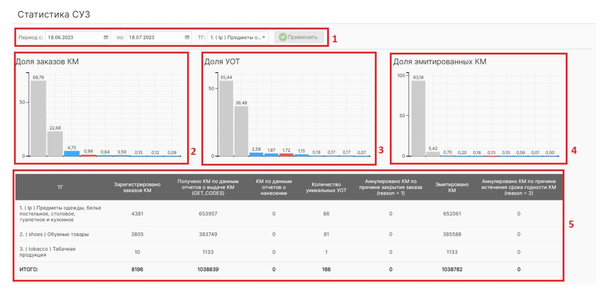

*Figure 123. OMS reporting*

• in a block of configuration of the data export period and selection of the goods groups available in the production environment (element 1 in figure), set start and end dates (inclusive) of the period by clicking the icon in the corresponding fields and by clicking the checkboxes for the goods groups for which generation of the report is required, then click the **[ Apply ]** button. A data export period shall not exceed 180 calendar days. By default, the export is made for the last month.

The following information is available in the uploaded data export:

- **"Share of MC orders"** displays information about registered MC orders of all OMS operators (element 2). Information on the number of MC orders from the current operator is marked on the histogram with a red column;
- **"For GCP"** displays the share of the goods circulation participants for which there are registered MC orders (element 3). Information on the share of the goods circulation participant,

which has been received from the current operator, is marked on the histogram with a red column;

- **"Share of emitted MCs"** displays a proportion of the emitted MCs for the MCs orders registered by a goods circulation participant of the total number of the emitted MCs in the TT GIS for the specified period (element 4). Information on the proportion of emitted MCs from the current operator is marked on the histogram with a red column;
- information on closed OMS receipts from the current operator is displayed in the tabular form (element 5):
  - **"Goods group"** a goods group for which OMS statistics are formed;
  - **"Registered MC orders"** a number of registered MC orders;
  - **"Received MCs according to the reports on MC issue (GET\_CODES)"** a number of the MCs which has been received through the reports on MC issue (GET\_CODES);
  - **"MCs according to the application reports"** a number of the MCs for which an application report has been submitted;
  - **"Number of unique GCPs"** a number of unique circulation participants which have registered MC orders;
  - **"MCs canceled due to the closing of the order (reason = 1)"** a number of the MCs which have been canceled due to the closing of the order (reason = 1);
  - **"Emitted MCs"** a number of emitted MCs;
  - **"MCs canceled due to expiry of the MCs (reason = 2)"** a number of the MCs which have been canceled due to expiry of the MCs (reason = 2).

### **Information about laws and regulations**

The **"L&R information"** section is designed to display help information about laws and regulations governing the process of the marking of goods.

To view all available laws and regulations, go to the **"L&R information"** section and select **"All"** value from the drop-down list.

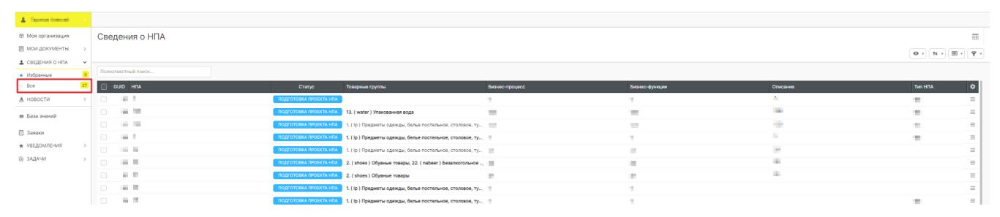

*Figure 124. L&R information*

Information about L&R is presented in tabular form. By default, records are sorted by creation date from oldest to newest. Unread records are marked in semibold. A description of the table fields can be

#### found below.

| Column name        | Description                                                                     |  |
|--------------------|---------------------------------------------------------------------------------|--|
| L&R                | Name of the normative legal act                                                 |  |
| Status             | Current status of the L&R.                                                      |  |
|                    | Possible values:                                                                |  |
|                    | "Preparation of the draft normative legal act";                                 |  |
|                    | "Active";                                                                       |  |
|                    | "Repealed"                                                                      |  |
| Goods groups       | Goods groups that might be covered under the L&R                                |  |
| Business process   | Short description of business process                                           |  |
| Business functions | Short description of business function                                          |  |
| Description        | Description of the record on L&R                                                |  |
| L&R type           | Type of laws and regulations.                                                   |  |
|                    | Possible values:                                                                |  |
|                    | "Federal law" – Federal law;                                                    |  |
|                    | "Decree of the Government of the Russian Federation" – Decree of the            |  |
|                    | Government of the Russian Federation on approval of the rules for marking;      |  |
|                    | "FTS order", "Minpromtorg order" and etc. — order of Federal Tax Service, |  |
|                    | order of the Ministry of Industry and Trade and etc.                            |  |

To search through the table records, use a search string above the table.

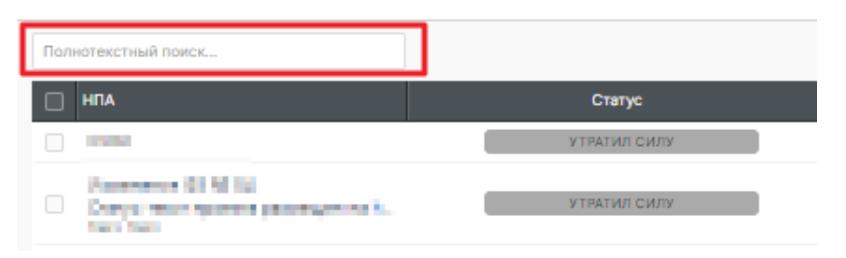

*Figure 125. Search string*

To familiarize yourself with detailed information on the L&R, click the corresponding string in the table and, if required, follow the attached links. To add a record to a favorites list, set when viewing the record.

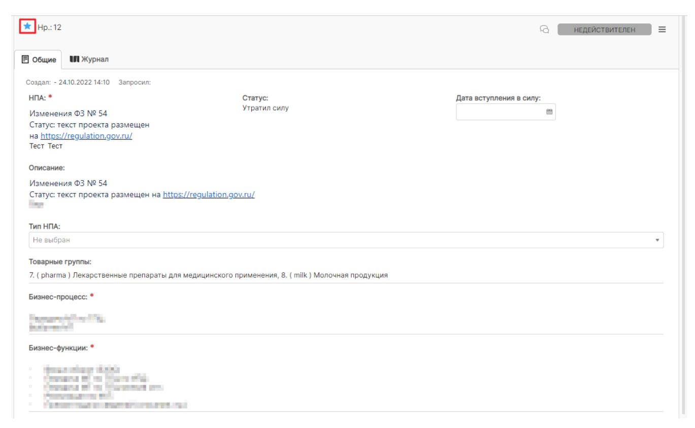

*Figure 126. Detailed information on normative legal act*

Favorite records are indicated by a dark gray background in a general list. To view all favorite records, select **"Favorites"** value from the drop-down list in the **"L&R information"** section.

### **Viewing news**

This section contains news concerning Partners and Integrators Register.

For the full text of the news:

• go to the **"News"** section;

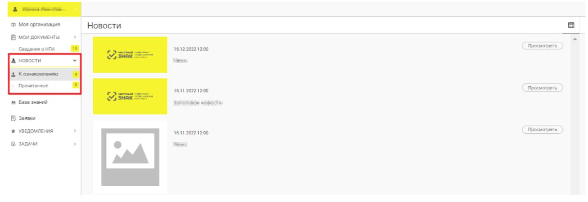

*Figure 127. Viewing news*

New news will be displayed in the **"News"** section with **"For familiarization"** status.

| • | click a line with news and go to a modal window to view news, then click the [ news status will be changed to "Read". |  | Close | ] button. A |
|---|--------------------------------------------------------------------------------------------------------------------------|--|-------|-------------|
|   |                                                                                                                          |  |       |             |
|   |                                                                                                                          |  |       |             |
|   |                                                                                                                          |  |       |             |
|   |                                                                                                                          |  |       |             |
|   |                                                                                                                          |  |       |             |
|   |                                                                                                                          |  |       |             |
|   |                                                                                                                          |  |       |             |
|   |                                                                                                                          |  |       |             |
|   |                                                                                                                          |  |       |             |
|   |                                                                                                                          |  |       |             |
|   |                                                                                                                          |  |       |             |
|   |                                                                                                                          |  |       |             |
|   |                                                                                                                          |  |       |             |
|   |                                                                                                                          |  |       |             |
|   |                                                                                                                          |  |       |             |
|   |                                                                                                                          |  |       |             |
|   |                                                                                                                          |  |       |             |

# **List of abbreviations, designations and terms**

| Term, abbreviation                                                                                                                                                                                                                                                                                                                                                                                                                                                                     | Description                                                                                                                        |  |  |
|----------------------------------------------------------------------------------------------------------------------------------------------------------------------------------------------------------------------------------------------------------------------------------------------------------------------------------------------------------------------------------------------------------------------------------------------------------------------------------------|------------------------------------------------------------------------------------------------------------------------------------|--|--|
| API                                                                                                                                                                                                                                                                                                                                                                                                                                                                                    | Application Programming Interface                                                                                                  |  |  |
| ERP                                                                                                                                                                                                                                                                                                                                                                                                                                                                                    | Enterprise Resource Planning — a software for enterprise business process management                                            |  |  |
| NDA                                                                                                                                                                                                                                                                                                                                                                                                                                                                                    | Non-disclosure agreement                                                                                                           |  |  |
| BIC                                                                                                                                                                                                                                                                                                                                                                                                                                                                                    | Bank Identification Code                                                                                                           |  |  |
| TT GIS Track and Trace Government Information System created to automatize the processes of acquisition and processing of data on circulation of goods subject to mandatory marking with the identification means, store such information, provide access to it, deliver and distribute it, enhance the exchange efficiency for such information, and enable traceability of the goods mentioned, as well as for other purposes as stipulated in the federal laws |                                                                                                                                    |  |  |
| EGRUL                                                                                                                                                                                                                                                                                                                                                                                                                                                                                  | Unified State Register of Legal Entities                                                                                           |  |  |
| INN                                                                                                                                                                                                                                                                                                                                                                                                                                                                                    | Tax identification number                                                                                                          |  |  |
| IE                                                                                                                                                                                                                                                                                                                                                                                                                                                                                     | Individual entrepreneur                                                                                                            |  |  |
| ITIN                                                                                                                                                                                                                                                                                                                                                                                                                                                                                   | Individual Taxpayer Identification Number                                                                                          |  |  |
| MC Marking code is a combination of SGTIN and verification code (VC) applied for the goods identification including those in consumer packing                                                                                                                                                                                                                                                                                                                                 |                                                                                                                                    |  |  |
| KPP                                                                                                                                                                                                                                                                                                                                                                                                                                                                                    | Tax registration reason code                                                                                                       |  |  |
| Peasant farms (farms)                                                                                                                                                                                                                                                                                                                                                                                                                                                                  | Peasant farms (farms)                                                                                                              |  |  |
| Memorandum                                                                                                                                                                                                                                                                                                                                                                                                                                                                             | Memorandum of cooperation for the development of technical solutions for the mandatory marking of goods by identification means |  |  |
| L&R Laws and regulations                                                                                                                                                                                                                                                                                                                                                                                                                                                            |                                                                                                                                    |  |  |
| FDO Fiscal data operator — a legal entity created specifically for receipt, processing, storage and transmission of the fiscal data to the Federal Tax Service (FTS)                                                                                                                                                                                                                                                                                                          |                                                                                                                                    |  |  |
| SHP                                                                                                                                                                                                                                                                                                                                                                                                                                                                                    | Software and Hardware Package                                                                                                      |  |  |
| Software Software                                                                                                                                                                                                                                                                                                                                                                                                                                                                   |                                                                                                                                    |  |  |

| Term, abbreviation   | Description                                                                                                                                                                                                                                                                                                                                                                                                                                                                                                                                                                                                                                                                                                                                                                    |  |
|----------------------|--------------------------------------------------------------------------------------------------------------------------------------------------------------------------------------------------------------------------------------------------------------------------------------------------------------------------------------------------------------------------------------------------------------------------------------------------------------------------------------------------------------------------------------------------------------------------------------------------------------------------------------------------------------------------------------------------------------------------------------------------------------------------------|--|
| SWRS                 | Software of a Related System                                                                                                                                                                                                                                                                                                                                                                                                                                                                                                                                                                                                                                                                                                                                                   |  |
| IR                   | Partners and Integrators Register                                                                                                                                                                                                                                                                                                                                                                                                                                                                                                                                                                                                                                                                                                                                              |  |
| Security Service     | Security Service                                                                                                                                                                                                                                                                                                                                                                                                                                                                                                                                                                                                                                                                                                                                                               |  |
| Service provider     | A legal entity that converts at the request of the goods circulation participant, marking codes into identification means and (or) applies identification means to consumer packing, or to label or sticker. Service providers must have a printing equipment system with sufficient performance to convert and apply identification means at the request of the goods circulation participant. Performance should be no less than regularly placed orders to produce packings and labels from the circulation participant, and should ensure that the class of the marking codes symbols application is no less than 2.5 (B) in accordance with the requirements of the national standard of the Russian Federation GOST R ISO / IEC 15415-2012 |  |
| OMS                  | Marking codes orders management station                                                                                                                                                                                                                                                                                                                                                                                                                                                                                                                                                                                                                                                                                                                                        |  |
| DCT                  | Data collection terminal                                                                                                                                                                                                                                                                                                                                                                                                                                                                                                                                                                                                                                                                                                                                                       |  |
| GCP                  | Goods Circulation Participant — legal entity or individual registered as individual entrepreneurs being tax residents of the Russian Federation, exercising introduction of goods into circulation, circulation and (or) withdrawal of goods from circulation, excluding legal entities and individuals registered as individual entrepreneurs procuring goods to be used in purposes not related to their trade (sale)                                                                                                                                                                                                                                                                                                                                         |  |
| MDLP FGIS            | Federal Government Information System of Track and Trace System of Medicines                                                                                                                                                                                                                                                                                                                                                                                                                                                                                                                                                                                                                                                                                                |  |
| Machine-readable PoA | Machine-readable Power of Attorney                                                                                                                                                                                                                                                                                                                                                                                                                                                                                                                                                                                                                                                                                                                                             |  |
| Bank of Russia       | Central Bank of the Russian Federation                                                                                                                                                                                                                                                                                                                                                                                                                                                                                                                                                                                                                                                                                                                                         |  |

| Term, abbreviation | Description                                                            |
|--------------------|------------------------------------------------------------------------|
| EDM                | Electronic Document Management Operator — an organization              |
|                    | providing an exchange of legally binding electronic documents. EDM     |
|                    | Operators provide services of the exchange of electronic documents for |
|                    | transactions, such as contracts, primary accounting documents,         |
|                    | invoices, between organizations that are legal entities, individual    |
|                    | entrepreneurs and state authorities. A list of the authorized EDM      |
|                    | Operators of Russia included in the Federal Tax Service Network of the |
|                    | Russian Federation is available on the official website of the tax     |
|                    | service                                                                |
| Legal entity       | Legal entity                                                           |

# **Revision History**

| Date       | Document version | Modifications                                                  |
|------------|------------------|----------------------------------------------------------------|
| 27.04.2026 | 32.0             | Submission of the request with the "Component of technical     |
|            |                  | means for capturing product information" product type and      |
|            |                  | the types of components of technical means for capturing       |
|            |                  | product information — "Library for technical means for   |
|            |                  | capturing product information" or "Integration with Library    |
|            |                  | for technical means for capturing product information" is      |
|            |                  | available (see section "Submission of request for acceptance   |
|            |                  | tests of technical means for capturing product information");  |
|            |                  | After changing the legal address of the organization, re       |
|            |                  | signing of the contract (automatically generated) will be      |
|            |                  | required (see section "Soft and Hardware Package               |
|            |                  | Contract");                                                    |
|            |                  | A new section has been added — "Registering new versions |
|            |                  | of the product of technical means for capturing product        |
|            |                  | information"                                                   |

| Date       | Document version | Modifications                                                  |
|------------|------------------|----------------------------------------------------------------|
| 25.03.2026 | 31.0             | A list of activity types has been updated for the "Integrator" |
|            |                  | organization type in the "Table of correspondence of           |
|            |                  | organization types to activity types" section;                 |
|            |                  | The following figures have been updated in the section         |
|            |                  | "Submission of request for acceptance tests of technical       |
|            |                  | means for capturing product information": "Selection of        |
|            |                  | business profile", "General information", "Product type",      |
|            |                  | "Fields for Component of technical means for capturing         |
|            |                  | product information", "Fields for Model of technical means     |
|            |                  | for capturing product information", "Fields correction in the  |
|            |                  | generated request", "Signing of the formed consent for         |
|            |                  | information provision", and "Request for acceptance tests of   |
|            |                  | technical means for capturing product information";            |
|            |                  | If a product already has a version of the "Component of        |
|            |                  | technical means for capturing product information" type        |
|            |                  | with the "Admitted to the production environment"              |
|            |                  | status, a request for acceptance tests may be submitted for a  |
|            |                  | new version in a notification mode (see section "Submission    |
|            |                  | of request for acceptance tests of technical means for         |
|            |                  | capturing product information");                               |
|            |                  | If the consent to provide information is rejected, a           |
|            |                  | notification with the reason for rejection will be sent. After |
|            |                  | correcting the issues, the document can be updated without     |
|            |                  | the need to resubmit the consent (see section "Submission of   |
|            |                  | request for acceptance tests of technical means for capturing  |
|            |                  | product information")                                          |
| 17.03.2026 | 30.0             | A note on the unavailability of buttons when the current       |
|            |                  | product version has the "Invalid" status has been added to     |
|            |                  | the following sections: "Submission of request for             |
|            |                  | acceptance tests in the OMS", "Submission of request for       |
|            |                  | GIS acceptance tests (TrueAPI)", "Self-testing of the          |
|            |                  | integration solution"                                          |
| 26.02.2026 | 29.0             | An individual identifier (UUID) used to work in the OMS        |
|            |                  | can be obtained only after the Soft and Hardware Package       |
|            |                  | contract is signed by the Operator (see sections               |
|            |                  | "Organization card interface" and "Soft and Hardware           |
|            |                  | Package Contract")                                             |

| Date       | Document version | Modifications                                                                                                                                                                                                                                                                                                                                                                                                                                                                                                                                                                                                                                                                                                                                                             |
|------------|------------------|---------------------------------------------------------------------------------------------------------------------------------------------------------------------------------------------------------------------------------------------------------------------------------------------------------------------------------------------------------------------------------------------------------------------------------------------------------------------------------------------------------------------------------------------------------------------------------------------------------------------------------------------------------------------------------------------------------------------------------------------------------------------------|
| 26.01.2026 | 28.0             | If all previously submitted requests are closed, Request for acceptance tests of technical means for capturing product information is generated automatically after the request for interoperability testing is successfully considered by the Operator. In this regard, the description and figures have been updated in the "Submission of request for acceptance tests of technical means for capturing product information" section; If acceptance testing fails, a status of the integration product versions (with the "Registered" status) can now be changed to "Invalid"; The description and the "Modal window to add an integration product" figure have been updated in the "Integration product registration" section |
| 01.12.2025 | 27.0             | Obtaining an individual identifier (UUID) to work in the OMS is available to the service providers in a user account (see sections "Creation of registration request" and "Organization card interface"); The "Availability of packaging contracts with manufacturers of dairy products or mineral water" field has been removed from the filled questionnaire to connect a Service Provider                                                                                                                                                                                                                                                                                                                                                            |
| 14.11.2025 | 26.0             | A clarification has been added to the "Submission of request for acceptance tests of technical means for capturing product information" section, stating that before registering a product of technical means for capturing product information, it is necessary to ensure that the following business profile is selected — "Integrator of software and hardware Solutions", as well as one or both business profiles related to technical means for capturing product information: "Developer of technical means for capturing product information" and/or "Developer of component of technical means for capturing product information"                                                                                            |

| Date       | Document version | Modifications                                                                                                                                                                                                                                                                                                                                                                                                                                                                                                                                                                                                                                                                                                                                                                                                                                                                                                                                                                                                                                                                                                                                       |
|------------|------------------|-----------------------------------------------------------------------------------------------------------------------------------------------------------------------------------------------------------------------------------------------------------------------------------------------------------------------------------------------------------------------------------------------------------------------------------------------------------------------------------------------------------------------------------------------------------------------------------------------------------------------------------------------------------------------------------------------------------------------------------------------------------------------------------------------------------------------------------------------------------------------------------------------------------------------------------------------------------------------------------------------------------------------------------------------------------------------------------------------------------------------------------------------------|
| 31.10.2025 | 25.0             | When registering a product for integration, the "Product of technical means for capturing product information" toggle button is now available in the modal window to create a new product. Enabling this button allows you to submit a request for acceptance tests of technical means for capturing product information; The process of submission of request for acceptance tests of technical means for capturing product information has been updated. Now, prior to submitting a request for acceptance tests, you must agree to provide the information and submit a request for interoperability testing                                                                                                                                                                                                                                                                                                                                                                                                                                                                                                       |
| 01.10.2025 | 24.0             | The "Submission of request for GIS acceptance tests (TrueAPI)" and "Testing of integration with GIS (TrueAPI)" sections were added; The "Submission of request for acceptance tests in the GIS" and "Testing of integration with the GIS" sections have been renamed as "Submission of request for acceptance tests of technical means for capturing product information" and "Testing of integration with technical means for capturing product information"; Descriptions and figures have been updated for the following sections: "Submission of request for acceptance tests in the OMS", "Submission of request for acceptance tests of technical means for capturing product information", "Testing of integration with the OMS" and "Testing of integration with technical means for capturing product information" ; The "Product version status change through the version card" figure has been updated in the section "Transfer of integration product to "Invalid" status"; Now when creating the registration request you can select a main language: "Russian" or "English" |

| Date       | Document version | Modifications                                                                                                                                                                                                                                                                                                                                                                                                                                                                                                                                                                                                                                                                                                                                                                                                                                                                                       |
|------------|------------------|-----------------------------------------------------------------------------------------------------------------------------------------------------------------------------------------------------------------------------------------------------------------------------------------------------------------------------------------------------------------------------------------------------------------------------------------------------------------------------------------------------------------------------------------------------------------------------------------------------------------------------------------------------------------------------------------------------------------------------------------------------------------------------------------------------------------------------------------------------------------------------------------------------|
| 07.07.2025 | 23.0             | "Submission of request for acceptance tests in the GIS" and "Testing of integration with the GIS" sections were added in connection with implementation of functionality; The following figures were updated in the section "Submission of request for acceptance tests in the OMS": "General information", "A button to submit a request for OMS acceptance tests", "Created request", "Configuring displayed columns" and "A request with acceptance tests status"; The "Card of successfully tested version" figure was updated in the "Testing of integration with the OMS" section; The "Add test case button" figure was updated in the "Self testing of the integration solution" section; The "Product version status change through the version card" figure was updated in the section "Transfer of integration product to "Invalid" status" |
| 23.10.2024 | 22.0             | A clarification has been added into the section "Document signing" that in order to use the Partners and Integrators Register, you should see the text of the Memorandum and sign the Application to enter into a Memorandum                                                                                                                                                                                                                                                                                                                                                                                                                                                                                                                                                                                                                                                               |
| 15.05.2024 | 21.0             | In the section "Table of correspondence of organization types to activity types" a new activity type - "Technical Service Center (TSC)" was added for the "Integrator" organization type; A possibility of signing of the documents by a user with the machine-readable PoA has been added into the section titled "Document signing"                                                                                                                                                                                                                                                                                                                                                                                                                                                                                                                                             |

| Date       | Document version | Modifications                                                                                                                                                                                                                                                                                                                                                                                                                                                                                                                                                                                                                                                                                                                                                                                                                                                                                                                                                                                                                                                                                                                |
|------------|------------------|------------------------------------------------------------------------------------------------------------------------------------------------------------------------------------------------------------------------------------------------------------------------------------------------------------------------------------------------------------------------------------------------------------------------------------------------------------------------------------------------------------------------------------------------------------------------------------------------------------------------------------------------------------------------------------------------------------------------------------------------------------------------------------------------------------------------------------------------------------------------------------------------------------------------------------------------------------------------------------------------------------------------------------------------------------------------------------------------------------------------------|
| 02.08.2023 | 20.0             | A module of self-testing of the integration solutions has been implemented (see section "Self-testing of the integration solution"). This improvement allows integrators to conduct testing of the versions of their software on their own; In the "Testing of integration with the OMS" section a clarification has been added that a product version status depends on the OMS/GIS key status; The "Statistics on FDO and EDM" section was renamed "Statistics"; A possibility to view statistics on exchange of the information with the OMS has been implemented (see section "Statistics on OMS"). This improvement allows to receive statistics of the reports on the basis of information of MC orders, build a tool for strategic analysis and marketing planning, helping to develop products focusing on the nearest competitors; "Detailed information on normative legal act" figure was updated in the "Information about laws and regulations" section; "Indication of GUI elements" section was deleted |
| 02.06.2023 | 19.0             | Added a possibility to add records to favorites, the visual highlighting of read / unread records; "L&R type" field was also added into a table with information about laws and regulations in the section titled "Information about laws and regulations"                                                                                                                                                                                                                                                                                                                                                                                                                                                                                                                                                                                                                                                                                                                                                                                                                                                       |
| 20.03.2023 | 18.0             | Clarification has been added into the section titled "Information about laws and regulations" that by default records with information about laws and regulations are sorted by creation date from oldest to newest                                                                                                                                                                                                                                                                                                                                                                                                                                                                                                                                                                                                                                                                                                                                                                                                                                                                            |

| Date       | Document version | Modifications                                                                                                                                                                                                                                                                                                                                                                                                                                                                                                                                                                                                                                                                                                                                                                                                                                                        |
|------------|------------------|----------------------------------------------------------------------------------------------------------------------------------------------------------------------------------------------------------------------------------------------------------------------------------------------------------------------------------------------------------------------------------------------------------------------------------------------------------------------------------------------------------------------------------------------------------------------------------------------------------------------------------------------------------------------------------------------------------------------------------------------------------------------------------------------------------------------------------------------------------------------|
| 17.02.2023 | 17.0             | The figures were updated in connection with the update of the GUI of the Partners and Integrators Register; In the section "Table of correspondence of organization types to activity types" a new activity type was added for the "Integrator" organization type - "Vending machine software developer, vending machine manufacturer"; A clarification has been added into the "Submission of request for acceptance tests in the OMS" section for the "Testing date and time: Testing time, local time" field that when attempting to indicate time which does not correspond to allowed time range, a warning will be displayed                                                                                                                                                                                                     |
| 27.01.2023 | 16.0             | Information that it is necessary to indicate a distribution provider when registering a service provider, has been added into the "Creation of registration request" section; The following information has been added into the "Table of correspondence of organization types to activity types" section for the "Service provider" organization type: to complete a procedure of generation of the request, it is necessary to select a distribution provider from the drop down list in the "Distribution provider" field; In the "Information about laws and regulations" section, a description of the information about laws and regulations, which are provided in the table, has been updated; "Information about laws and regulations" and "Search string" figures have been updated as well |
| 28.12.2022 | 15.0             | A possibility to view information on integration products usage was added ("Viewing statistics of integration products usage" section); A time interval of the start of the testing has been limited for acceptance tests of the integration solutions as follows: from 08:00 AM to 06:00 PM, MSK                                                                                                                                                                                                                                                                                                                                                                                                                                                                                                                                                     |

| 09.12.2022 14.0 In the section titled "Integration product registration", the modal window specified was deleted; "Product version status change through the version card" figure was updated in connection with addition of the following data entry fields in the "Transfer of integration the Sandbox of the TT GIS/Sandbox of the MDLP (id / sys_id)", "omsId"; In the section titled "Registering new product versions",                                                                                                                                                                                                        | Date | Document version | Modifications                                                                                                                                                                                                                                                                                                                                                                                                                                                                                                                                                                                                                                                                                                                                                                                                                                                                                                                                                                                                                           |
|-----------------------------------------------------------------------------------------------------------------------------------------------------------------------------------------------------------------------------------------------------------------------------------------------------------------------------------------------------------------------------------------------------------------------------------------------------------------------------------------------------------------------------------------------------------------------------------------------------------------------------------------------------------------|------|------------------|-----------------------------------------------------------------------------------------------------------------------------------------------------------------------------------------------------------------------------------------------------------------------------------------------------------------------------------------------------------------------------------------------------------------------------------------------------------------------------------------------------------------------------------------------------------------------------------------------------------------------------------------------------------------------------------------------------------------------------------------------------------------------------------------------------------------------------------------------------------------------------------------------------------------------------------------------------------------------------------------------------------------------------------------|
| of the specified modal window was deleted; The following were added into the section titled "Submission of request for acceptance tests in the OMS": the request for acceptance tests, a description on how to "Acceptance test request" modal window was updated; available in the product version with "Testing date assignment" or "Testing date approval" status, has been switch to setting of a new test date", "Setting a new test date", "Buttons to agree on testing date". Added figures: "General information", "A request with acceptance tests display"; "A list of addresses to interact with the OMS", deleted; |      |                  | "Modal window to add an integration product" figure was updated, and a text description of the "Goods group" field of product to "Invalid" status" section: "Language of testing", "INN (or analog) of the company registered on the Sandbox of the TT GIS/Sandbox of the MDLP", "Organization ID in "Modal window to add a new product version" figure was updated; and a text description of the "Goods groups" field information on display of the date and time of acceptance of configure displayed columns in the "OMS requests" tab, a description on how to fill in data entry fields in the "General information" tab; a description on how to fill out fields of the information that a change of the list of the goods groups is deleted. Updated figures: "A button to submit a request for OMS acceptance tests", "Request cancellation", "A button to status", "Configuring columns display", "Configuring table "Buttons to change a list of the goods groups" figures were |

| Date       | Document version | Modifications                                                                                                                                                                                                                                                                                                                                                                                                                                                                                                                                                                                                                                                                                                                               |
|------------|------------------|---------------------------------------------------------------------------------------------------------------------------------------------------------------------------------------------------------------------------------------------------------------------------------------------------------------------------------------------------------------------------------------------------------------------------------------------------------------------------------------------------------------------------------------------------------------------------------------------------------------------------------------------------------------------------------------------------------------------------------------------|
| 03.11.2022 | 13.0             | A new section was added into the user account of the Partners and Integrators Register - "L&R information". The section contains help information on amendments made into the laws and regulations governing the marking processes for quick tracking of changes in the status of regulatory documents and for easy analysis of their impact on marking processes (for more details, see section "Information about laws and regulations")                                                                                                                                                                                                                                                                             |
| 28.10.2022 | 12.0             | In the section titled "Statistics on FDO" a description of the data export period has been updated: the data export period shall not exceed 93 calendar days; In the section titled "Statistics on EDM" a description of the data export period has been updated: the data export period shall not exceed 185 calendar days                                                                                                                                                                                                                                                                                                                                                                                                  |
| 03.10.2022 | 11.0             | In the section titled "Document signing" a description of display of the information message with the reasons of EQES non-conformity has been updated, a list of the non conformity reasons has been updated, "Modal window with warning information on EQES non-conformity" figure has been added                                                                                                                                                                                                                                                                                                                                                                                                                           |
| 15.09.2022 | 10.0             | "List of terms and abbreviations" section was renamed "List of abbreviations, designations and terms"                                                                                                                                                                                                                                                                                                                                                                                                                                                                                                                                                                                                                                    |
| 14.09.2022 | 9.0              | In the section titled "Submission of request for acceptance tests in the OMS" a description of changes in a list of the goods groups in a product version with "Testing date assignment", "Testing date approval" status has been added for "Registry participant", "Counterparty-admin" roles, "Buttons to change a list of the goods groups" figure has been added as well; In the section titled "Document signing" an information has been added that during selection of the certificate for document signing, EQES is checked for compliance with the requirements; a list of the information messages which are displayed in case of non-compliance with the requirements has been added as well |

| Date       | Document version | Modifications                                                   |
|------------|------------------|-----------------------------------------------------------------|
| 29.08.2022 | 8.0              | "Transfer of integration product to "Invalid" status" section   |
|            |                  | was added;                                                      |
|            |                  | In the section titled "Integration product registration",       |
|            |                  | "Modal window to add an integration product" figure was         |
|            |                  | updated, and a text description of the "Goods groups" field     |
|            |                  | of the specified modal window was updated as well;              |
|            |                  | In the section titled "Registering new product versions",       |
|            |                  | "Modal window to add a new product version" figure was          |
|            |                  | updated, and a text description of the "Goods groups" field     |
|            |                  | of the specified modal window was updated as well;              |
|            |                  | "A list of addresses to interact with the OMS" figure was       |
|            |                  | updated in the "Submission of request for acceptance tests in   |
|            |                  | the OMS" section;                                               |
|            |                  | In the section titled "Testing of integration with the OMS"     |
|            |                  | the following figures were updated: "Card of successfully       |
|            |                  | tested version", "Fields of pilot feature";                     |
|            |                  | "A block to add trusted INNs" figure was updated in the         |
|            |                  | section titled "Adding of trusted INN";                         |
|            |                  | In the section titled "Registering new product versions" an     |
|            |                  | information on a possibility to switch to "Product version      |
|            |                  | details" modal window through a product version card was        |
|            |                  | deleted, "Switch to modal window to add version through         |
|            |                  | the product card" figure was deleted;                           |
|            |                  | In the section titled "Testing of integration with the OMS", a  |
|            |                  | note has been added that if a version deactivated as a result   |
|            |                  | of registration key expiration, has been successfully re        |
|            |                  | tested, a value of the registration key will be remained for    |
|            |                  | the version, as well as a note that re-testing can be done well |
|            |                  | in advance of the key expiration date;                          |
|            |                  | In the section titled "Management of integration and partner    |
|            |                  | products" in the table of availability of the products by       |
|            |                  | organization types, as well as in the section titled "Partner   |
|            |                  | solutions" in the list of the organization types which have     |
|            |                  | access to partner solutions, an "Integrator" value was added;   |
|            |                  | In the section titled "Getting Started" a "Partner" value was   |
|            |                  | deleted from a list of the organization types which have        |
|            |                  | access to add integration products                              |
|            |                  |                                                                 |

| Date       | Document version | Modifications                                                                                                                                                                                                                                                                                                                                                                                                                                                                                                                                                                                                                                                                                                                                                                                                                                                                    |
|------------|------------------|----------------------------------------------------------------------------------------------------------------------------------------------------------------------------------------------------------------------------------------------------------------------------------------------------------------------------------------------------------------------------------------------------------------------------------------------------------------------------------------------------------------------------------------------------------------------------------------------------------------------------------------------------------------------------------------------------------------------------------------------------------------------------------------------------------------------------------------------------------------------------------|
| 21.07.2022 | 7.0              | In the "Getting Started" section, a note has been added that during the transition of the organization profile to "Active" status, a notification with a list of the documents for filling in and signing which are required to continue to work in the system will be sent to the email specified during the registration. A note has been added that if the registration request has been rejected by the Security Service, a corresponding notification will be sent to the e-mail. A list of the actions was added for the "Service provider" organization type with a list of the actions to add a list of the service providers in the OMS user interface; The following sections were added: "Filling out a questionnaire to connect a Service Provider" and "Submission of application for Soft and Hardware Package Contract" |
| 24.06.2022 | 6.0              | "Statistics on FDO and EDM" section was added. Information on the section was added into the section titled "Getting Started"; Descriptions were added for "EDM" ("Electronic document management operator") and "FDO" ("Fiscal data operator") in the section titled "List of abbreviations, designations and terms"                                                                                                                                                                                                                                                                                                                                                                                                                                                                                                                                          |

| Date       | Document version | Modifications                                                                 |
|------------|------------------|-------------------------------------------------------------------------------|
| 20.06.2022 | 5.0              | In the section titled "Testing of integration with the OMS", a                |
|            |                  | description of the system behavior in case of expiry of the                   |
|            |                  | OMS key was added, "Card of successfully tested version",                     |
|            |                  | "Fields of pilot feature" figures were updated;                               |
|            |                  | "A block to add trusted INNs" figure was updated in the                       |
|            |                  | section titled "Adding of trusted INN";                                       |
|            |                  | "Organization card interface elements" figure was updated in                  |
|            |                  | the section titled "Organization card interface";                             |
|            |                  | "Block of bank details editing" figure was updated in the                     |
|            |                  | section titled "Editing bank details";                                        |
|            |                  | "A button to submit an edit request" figure was updated in                    |
|            |                  | the section titled "Submission of request to change a list of                 |
|            |                  | activity types";                                                              |
|            |                  | "Location of button to add an integration product" figure                     |
|            |                  | was updated in the section titled "Integration product                        |
|            |                  | registration";                                                                |
|            |                  | "Location of a button to add partner solution" figure was                     |
|            |                  | updated in the section titled "Partner solutions";                            |
|            |                  | "Switch to filling in a questionnaire" figure was updated in                  |
|            |                  | the section titled "Filling out a questionnaire on product";                  |
|            |                  | "Placement of notifications in the Partners and Integrators                   |
|            |                  | Register" figure was updated in the section titled "Viewing notifications" |

| Date       | Document version | Modifications                                                                                                                                                                                                                                                                                                                                                                                                                                                                                                                                                                                                                                                                                                                                                                                                                                                                                                                                                                                                                                                                                                                                                                                                                                                                             |
|------------|------------------|-------------------------------------------------------------------------------------------------------------------------------------------------------------------------------------------------------------------------------------------------------------------------------------------------------------------------------------------------------------------------------------------------------------------------------------------------------------------------------------------------------------------------------------------------------------------------------------------------------------------------------------------------------------------------------------------------------------------------------------------------------------------------------------------------------------------------------------------------------------------------------------------------------------------------------------------------------------------------------------------------------------------------------------------------------------------------------------------------------------------------------------------------------------------------------------------------------------------------------------------------------------------------------------------|
| 06.06.2022 | 4.0              | In the "Creation of registration request" section, clarifications were added to the fields of the block "2. Company details": "Name", "INN", "KPP"; A description of the possibility to download instruction on how to work in the system by a link on the login page of the Partners and Integrators Register was added. The following figures were updated: "Login page" (in the "Creation of registration request" section), "Login page of the Partners and Integrators Register" (in the "Getting Started" and "Authorization and access recovery" sections); A list of the "Questionnaire" modal window fields was updated in the "Filling out a questionnaire on product" section; A "Service provider test" column was deleted from a table of availability of the products by organization types in the "Management of integration and partner products" section; A description of the switch to "Active" status was updated for the "Service provider" organization type in the "Getting Started" section. "Filling out a questionnaire to connect a Service Provider" and "Submission of application for Soft and Hardware Package Contract" sections were deleted; "Editing legal address" section was deleted |
| 04.05.2022 | 3.0              | In the "Creation of registration request" section, information has been added stating that a "Phone number" field is optional for the "IE" business registration form, and a "Main address" field is displayed only for "IE" business registration form; "A list of addresses to interact with the OMS" figure was updated in the "Submission of request for acceptance tests in the OMS" section; In the section titled "Testing of integration with the OMS", "Card of successfully tested version" figure was updated, "Fields of pilot features" figure was added, description of the new card fields was added                                                                                                                                                                                                                                                                                                                                                                                                                                                                                                                                                                                                                                      |

| 16.03.2022 2.0 | In the section "Editing organization data", a clarification was added into description of the "Full name of director" field stating that if organization has the only "Goods circulation participant" organization type, a possibility of changing a "Full name of director" field value is not blocked when                                                                                                                                                                                                                                                                                                                                                                                                                                                                                                                                                                                                                                                                                                                                                                                                                                                                                                                                                                                                                                                                                                                                                                                                                      |
|-------------------|-----------------------------------------------------------------------------------------------------------------------------------------------------------------------------------------------------------------------------------------------------------------------------------------------------------------------------------------------------------------------------------------------------------------------------------------------------------------------------------------------------------------------------------------------------------------------------------------------------------------------------------------------------------------------------------------------------------------------------------------------------------------------------------------------------------------------------------------------------------------------------------------------------------------------------------------------------------------------------------------------------------------------------------------------------------------------------------------------------------------------------------------------------------------------------------------------------------------------------------------------------------------------------------------------------------------------------------------------------------------------------------------------------------------------------------------------------------------------------------------------------------------------------------------------|
|                   | changing a profile status to "Active"; In the "Submission of request for acceptance tests in the OMS" section, a description of the request card was updated: description of the "Language of testing" field was added, "Request for OMS acceptance tests", "Request cancellation" , "A button to switch to setting of a new test date", "Setting a new test date", "Buttons to agree on testing date" figures were updated; "Switching to chat with Operator", "Work with tasks from the Operator" sections were added; "Major features of the Partners and Integrators Register" section was updated; "Editing organization data" was supplemented with information on the method of switch to a mode of editing of registration data; "Address editing block", "Block of bank details editing", "A button to update a document", "A button to submit an edit request", "A button to edit a profile in the organization card", "Sending chat messages", "Switch to a chat on request", "A switch to view application", "Switch to filling in a questionnaire", "Placement of the block to add responsible persons under the contract", "Location a button to add partner solution", "Placement of button to add users and contact persons", "Location of button to add an integration product", "Placement of the button to switch to application creation", "Placement of the button to switch to fill in questionnaire", "Placement of notifications in the |
| 28.02.2022 1.0 | Partners and Integrators Register" figures were updated Initial version                                                                                                                                                                                                                                                                                                                                                                                                                                                                                                                                                                                                                                                                                                                                                                                                                                                                                                                                                                                                                                                                                                                                                                                                                                                                                                                                                                                                                                                                    |